# 15 Best Calendar Sharing App in 2024 (Features, Pros, Cons, Pricing)

Time management and organization are more important than ever in the fast-paced world we live in today. Choosing the correct calendar sharing tool may greatly simplify your scheduling demands, whether you're a busy professional arranging meetings, a student juggling classes and assignments, a project manager managing teams, or a mom organizing family events. 

This post seeks to assist you in choosing the ideal app that fits your lifestyle and increases productivity out of the plethora of possibilities accessible, each meeting distinct functions and needs. Find the perfect solution to maintain a stress-free and organized life, from family organizers to expert scheduling tools.

## The best calendar sharing apps for 2024 at a glance

<table>
    <tr>
        <td></td>
        <td>Free trial time</td>
        <td>Pricing</td>
        <td>Supported platform</td>
        <td>Integration</td>
        <td>AI feature</td>
   </tr>
    <tr>
        <td>TimeTree</td>
        <td>free forever (Free version)</td>
        <td>Start from $4.49/month</td>
        <td>iOS, Android</td>
        <td>✅</td>
        <td>❌</td>
   </tr>
    <tr>
        <td>Google Calendar</td>
        <td>free for personal use</td>
        <td>Start from $6/month for business</td>
        <td>Web, Windows, Mac, iOS, Android</td>
        <td>✅</td>
        <td>❌</td>
   </tr>
    <tr>
        <td>FamCal</td>
        <td>free (with ads)</td>
        <td>Start from $3.99/month</td>
        <td>iOS, Android</td>
        <td>❌</td>
        <td>❌</td>
   </tr>
    <tr>
        <td>Cozi Family Organizer</td>
        <td>free (with ads)</td>
        <td>Start from $29.9/month</td>
        <td>Web, iOS, Android</td>
        <td>❌</td>
        <td>❌</td>
   </tr>
    <tr>
        <td>Family Wall</td>
        <td>free (Standard version)</td>
        <td>Start from $4.99/month</td>
        <td> iOS, Android</td>
        <td>✅</td>
        <td>❌</td>
   </tr>
    <tr>
        <td>GroupCal</td>
        <td>7 days</td>
        <td>Start from $5/month</td>
        <td>iOS, Android</td>
        <td>❌</td>
        <td>❌</td>
   </tr>
    <tr>
        <td>Reclaim.ai</td>
        <td>free forever (Lite version)</td>
        <td>Start from $8/month</td>
        <td>Web, iOS, Android</td>
        <td>✅</td>
        <td>✅</td>
   </tr>
    <tr>
        <td>UpTo</td>
        <td>14 days</td>
        <td>Start from $9/month</td>
        <td>iOS, Android</td>
        <td>❌</td>
        <td>❌</td>
   </tr>
    <tr>
        <td>Microsoft Outlook Calendar</td>
        <td>-</td>
        <td>Start from $6/month (part of Microsoft 365)</td>
        <td>Windows, Mac, iOS, Android</td>
        <td>✅</td>
        <td>❌</td>
   </tr>
    <tr>
        <td>Fantastical</td>
        <td>14 days</td>
        <td>Start from $4.99/month per individual</td>
        <td>Browser, Windows, Mac, iOS, Android, Watch, Vision Pro</td>
        <td>✅</td>
        <td>❌</td>
   </tr>
    <tr>
        <td>Apple Calendar</td>
        <td>free</td>
        <td>-</td>
        <td>Mac, iOS</td>
        <td>✅</td>
        <td>❌</td>
   </tr>
    <tr>
        <td>Any.Do</td>
        <td>forever (Personal version)</td>
        <td>Start from $5/month per individual</td>
        <td>Browser, Windows, Mac, iOS, Android, Watch</td>
        <td>✅</td>
        <td>✅</td>
   </tr>
    <tr>
        <td>Doodle</td>
        <td>free (basic version)</td>
        <td>Start from $6.95/month per individual</td>
        <td>Web, iOS, Android</td>
        <td>✅</td>
        <td>❌</td>
   </tr>
    <tr>
        <td>Teamup Calendar</td>
        <td>free (basic version)</td>
        <td>Start from $10/month</td>
        <td>iOS, Android</td>
        <td>❌</td>
        <td>❌</td>
   </tr>
    <tr>
        <td>Jorte Calendar</td>
        <td>free (basic version)</td>
        <td>Start from $2.99/month</td>
        <td>iOS, Android</td>
        <td>❌</td>
        <td>✅</td>
   </tr>
</table>

### 1. TimeTree

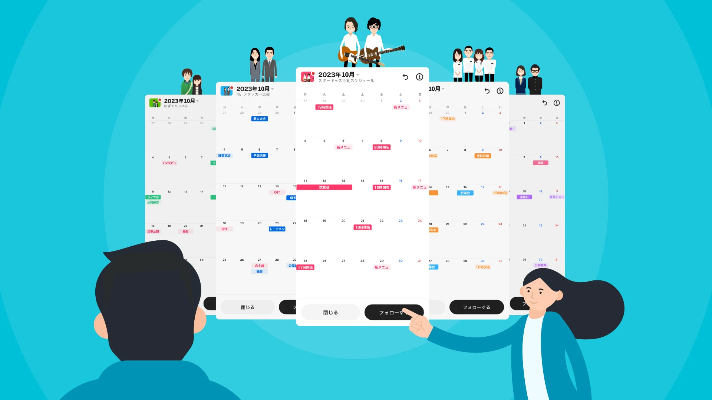
[TimeTree](https://timetreeapp.com/intl/en/) - a shared calendar app designed to foster communication and coordination among users. It's praised for its ease of sharing events with family, friends, and colleagues.

**Key Features:**
- Shared calendars for groups, families, or couples.
- Event and scheduling functionality with chat features for each event.
- Supports sharing photos and notes within a calendar.

**Pros:**
- Strong emphasis on collaboration and communication.
- User-friendly interface.
- Free to use with no hidden costs.

**Cons:**
- Some users may find the app's notifications to be excessive.
- The interface, while user-friendly, can feel cluttered with many events.

**Integration:**
- Limited direct integrations with other apps, focusing more on its core functionalities of calendar sharing and communication.

**Pricing:**
- Free for the basic version. Premium needs 4.49 USD/month (44.99 USD/annual).

### 2. Google Calendar

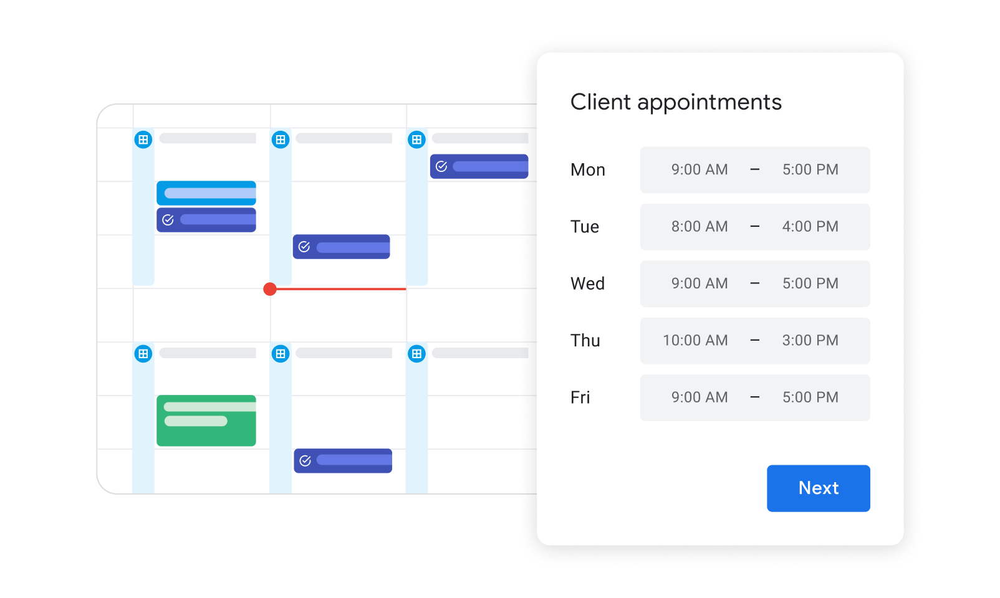

Part of Google Workspace, [Google Calendar](https://calendar.google.com/) allows users to share meetings and schedule appointments. It's known for its seamless integration with other Google services.

**Key Features:**
- Seamless integration with Google services like Gmail, Drive, and Contacts.
- Allows for the creation of multiple calendars.
- Event invitations and RSVP tracking.
- Syncs across devices.

**Pros:**
- Widely used, which facilitates sharing and scheduling with others.
- Highly customizable notification settings.
- Robust functionality for professional use.

**Cons:**
- Heavy integration with Google ecosystem can be a drawback for non-Google users.
- Some advanced features may have a learning curve.

**Integration:**
- Extensive integrations through Google Workspace and third-party apps via Google Calendar API.

**Pricing:**
- Free for personal use.
- Part of Google Workspace for businesses, with plans starting at $6 per user/month.

### 3. FamCal

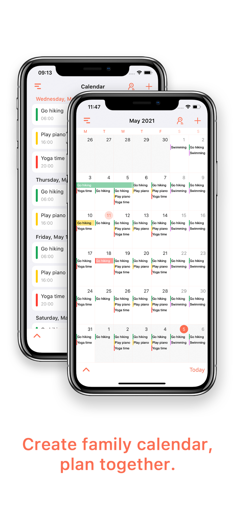

Aimed at keeping family members connected, [FamCal](https://apps.appxy.com/FamCal/HomePage.html) combines calendars, events, tasks, notes, contacts, and birthday reminders in one place.

**Key Features:**
- A shared family calendar app that also includes lists, tasks, and notes.
- Special sections for birthday reminders and contacts.
- Color-coded events for easy viewing.

**Pros:**
- Specifically designed for family use, enhancing organization.
- Allows for private messaging within the app.
- Customizable notifications for different types of events.

**Cons:**
- The free version includes ads.
- May not be as comprehensive in features for broader organizational needs beyond family.

**Integration:**
- Primarily standalone with limited integration capabilities.

**Pricing:**
- Free version available with ads.
- Premium subscription available for ad-free experience and additional features, pricing varies by region.

### 4. Cozi Family Organizer

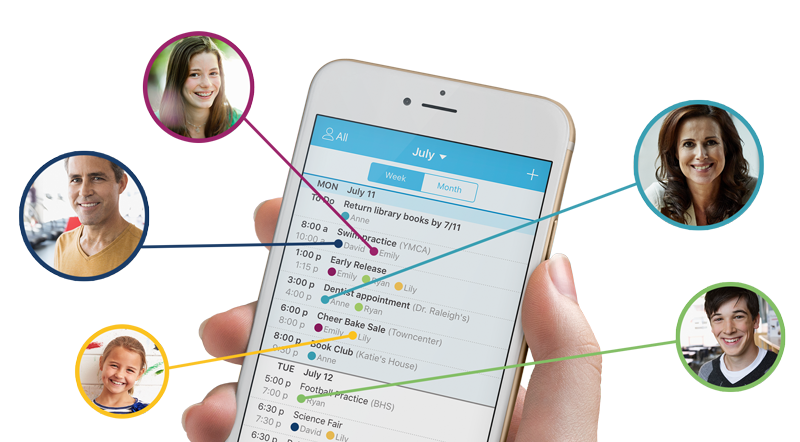

Best suited for busy families, [Cozi Family Organizer](https://www.cozi.com/) helps keep track of everyone's schedules, activities, and appointments.

**Key Features:**
- Family calendar, shopping lists, to-do lists, and meal planner in one app.
- Can be accessed by all family members with one account.
- Email and mobile notifications for family events.

**Pros:**
- Specifically designed for family coordination.
- Includes a journal feature to save special moments.
- Free version covers many essential features.

**Cons:**
- Ads in the free version can be intrusive.
- Limited customization options for calendar views.

**Integration:**
- Limited; focuses on providing a comprehensive standalone family organization tool.

**Pricing:**
- Free with ads.
- Gold version available for $29.99/year, offering an ad-free experience, additional calendar views, and more.

### 5. Family Wall

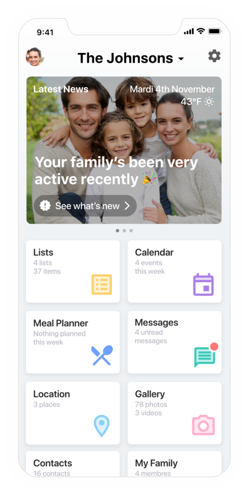

[Family Wall](https://www.familywall.com/index.html) - an app designed for family organization, allowing for shared calendars, lists, contacts, messages, and more.

**Key Features:**
- Shared calendar, shopping lists, to-do lists, and a secure messenger.
- Ability to post photos and videos to a private family feed.
- Location sharing among family members.

**Pros:**
- Comprehensive app for family organization and communication.
- Includes features like alerts for important dates and a locator.

**Cons:**
- Some users may prefer simpler apps for calendar sharing without the additional features.
- Premium features required for full functionality.

**Integration:**
- Designed to be a self-contained family organization hub with limited external integrations.

**Pricing:**
- Basic version is free.
- Premium subscriptions offer additional features, with pricing around $4.99/month or $49.99/year, varying by region and specific offers.

### 6. GroupCal

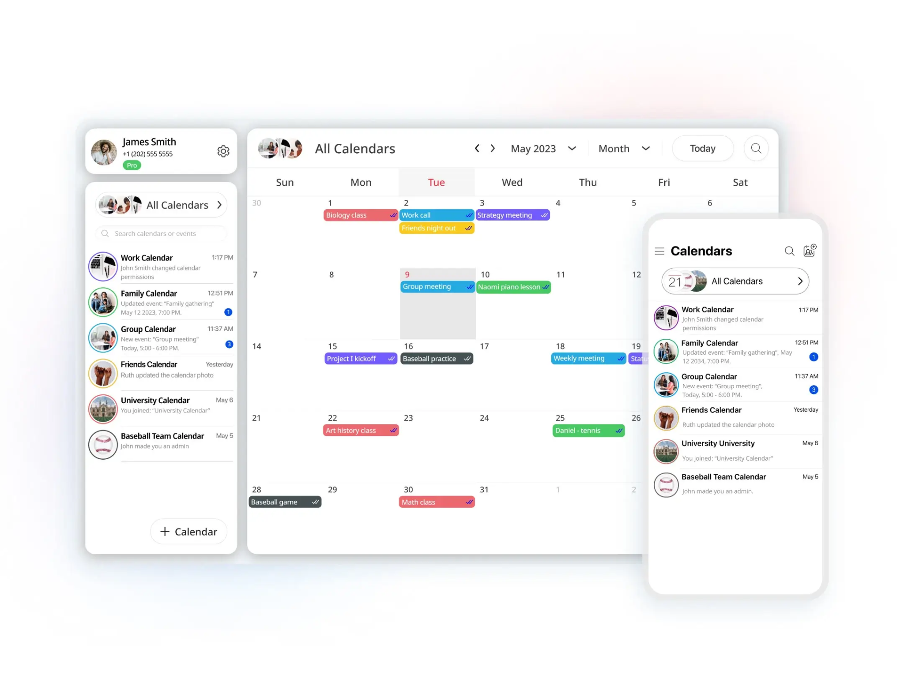

[GroupCal](https://www.groupcal.app/) offers powerful features for sharing calendars with groups, families, customers, and communities.

**Key Features:**
- Shared calendars for various groups, allowing for easy segregation of personal, family, and work events.
- Real-time notifications and updates for shared events.
- Easy setup for new users, inviting members via a link.

**Pros:**
- Simplifies the process of managing multiple calendars.
- Intuitive interface that's easy to navigate.
- Facilitates coordination within any group size efficiently.

**Cons:**
- Limited functionality beyond calendar sharing and event scheduling.
- Some users may find the app lacks advanced customization options.

**Integration:**
- Primarily focused on its standalone features, with limited direct integration with other productivity apps.

**Pricing:**
- Free version available.
- Premium version or in-app purchases may be offered for additional features, though specific pricing details should be checked within the app.

### 7. Reclaim.ai

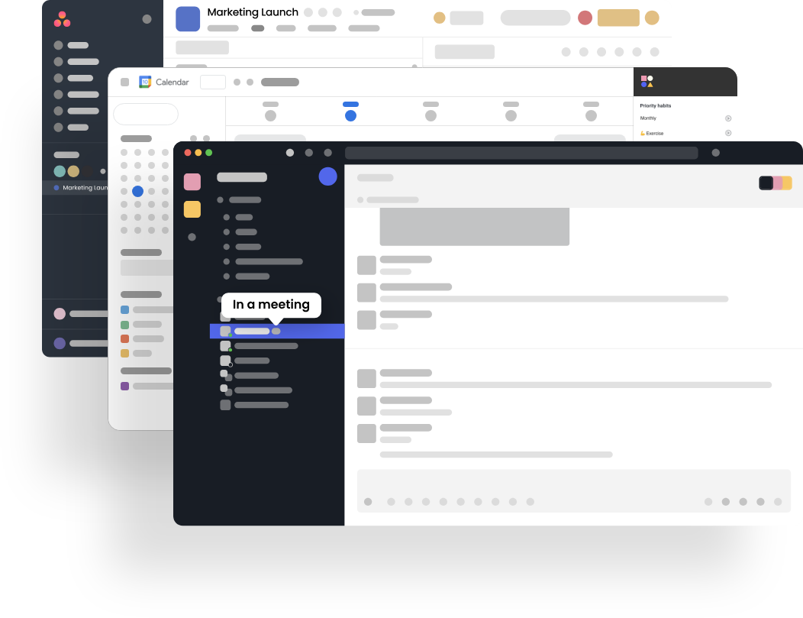

[Reclaim.ai](https://reclaim.ai/) - an AI-driven calendar app that syncs schedules across teams and optimizes time management.

**Key Features:**
- AI-driven scheduling that automatically blocks time for priorities, tasks, and meetings across multiple calendars.
- Smart scheduling links to share availability and book meetings.
- Analytics to track time spent on various activities.

**Pros:**
- Highly efficient for optimizing personal and team schedules.
- Reduces scheduling conflicts and enhances productivity.
- Integrates well with popular calendar services and provides actionable insights.

**Cons:**
- May have a steeper learning curve due to its comprehensive features.
- The AI-driven approach might not suit everyone's working style.

**Integration:**
- Integrates with Google Calendar, Outlook, and other popular calendar services.
- Offers APIs for custom integrations.

**Pricing:**
- Free for basic individual use.
- Paid plans start at $6/user/month for teams, with more advanced features and analytics.

### 8. UpTo

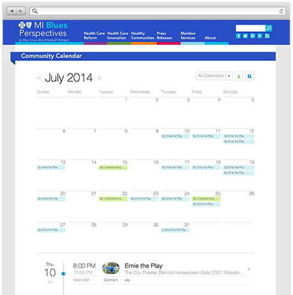

[UpTo](https://upto.com/) provides a social-oriented calendar setup, where users can follow different event streams and integrate personal calendars.

**Key Features:**
- Combines personal and social calendars, allowing users to follow event streams from various sources.
- Integrates personal calendars without oversharing details.
- Modern and visually appealing interface.

**Pros:**
- Unique approach to blending personal and public/social calendars.
- Simplifies discovery and participation in public events.
- Easy to use with straightforward functionality.

**Cons:**
- Limited advanced features for professional scheduling.
- Some users may prefer more privacy controls over their event data.

**Integration:**
- Can integrate with existing calendars (Google, iCloud, Outlook, etc.) for a seamless experience.
- Event streams from various public sources can be followed within the app.

**Pricing:**
- Free to use.
- Additional information about premium features or services should be directly checked as the app evolves.

### 9. Microsoft Outlook Calendar

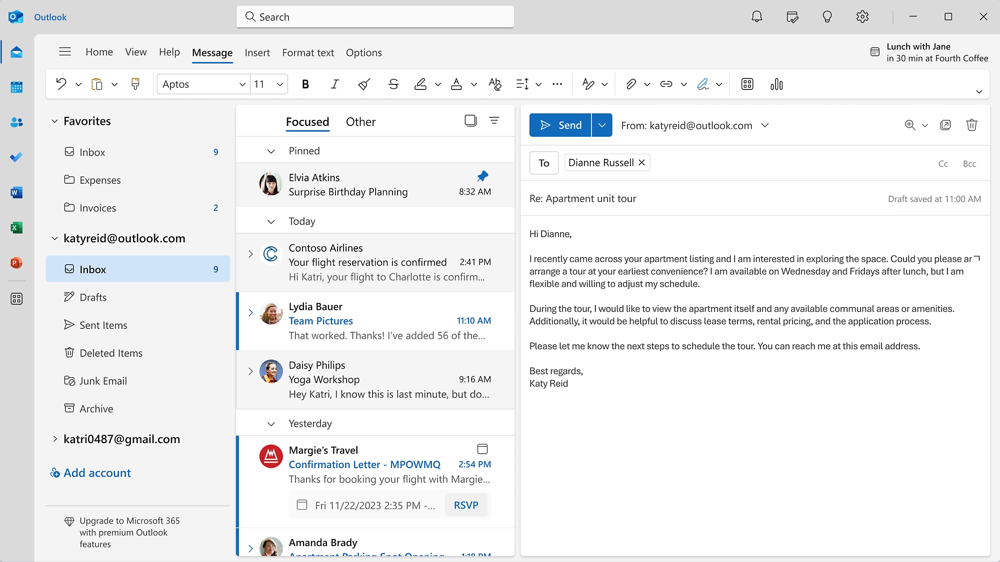

Part of the Microsoft Office suite, [Microsoft Outlook Calendar](https://www.microsoft.com/en-us/microsoft-365/outlook/email-and-calendar-software-microsoft-outlook-b) offers comprehensive calendar sharing features and integrates well with email.

**Key Features:**
- Part of the Microsoft Office suite, providing comprehensive email and calendar integration.
- Allows for shared calendars, meeting scheduling, and room bookings.
- Rich feature set including time zone management, recurring events, and meeting notes.

**Pros:**
- Deep integration with Microsoft ecosystem and services.
- Ideal for professional environments with robust scheduling needs.
- Supports large-scale deployments within organizations.

**Cons:**
- Can be complex for personal or casual use.
- Some users may find the interface less intuitive compared to other calendar apps.

**Integration:**
- Extensive integrations with Microsoft products and third-party applications through Microsoft Graph API.

**Pricing:**
- Part of Microsoft 365 subscriptions, with plans starting at $6/user/month for business users.
- Personal and family plans are also available, with pricing varying by region.

### 10. Fantastical

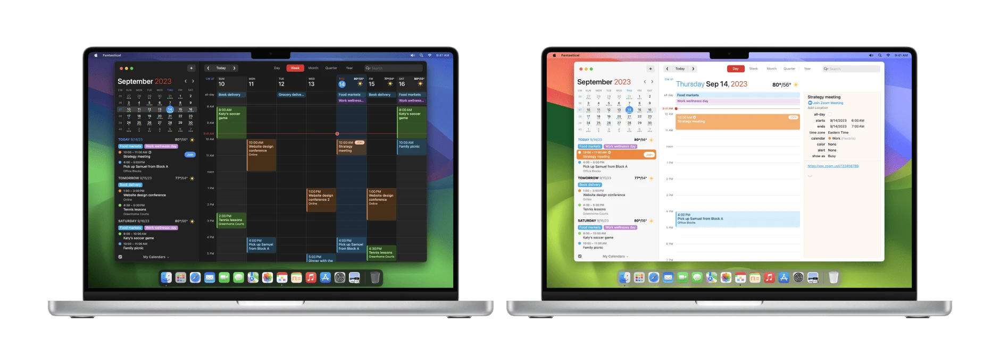

Known for its natural language processing, [Fantastical](https://flexibits.com/fantastical) allows for easy event creation and offers robust sharing options.

**Key Features:**
- Natural language processing for easy event creation.
- Robust sharing options and integration with a wide range of calendar services.
- Advanced features like weather forecasts, meeting proposals, and calendar sets.

**Pros:**
- Highly intuitive interface and ease of use.
- Flexible viewing options and powerful organizational tools.
- Multi-platform support including macOS, iOS, and watchOS.

**Cons:**
- Premium features come at a cost, which might not suit all users.
- Some advanced functionalities could have a learning curve.

**Integration:**
- Supports integration with major calendar services (Google, iCloud, Outlook, etc.).
- Can work alongside other productivity apps through URL scheme and app integrations.

**Pricing:**
- Free version available with basic features.
- Premium subscription required for advanced features, priced at $4.99/month or $39.99/year.

### 11. Apple Calendar

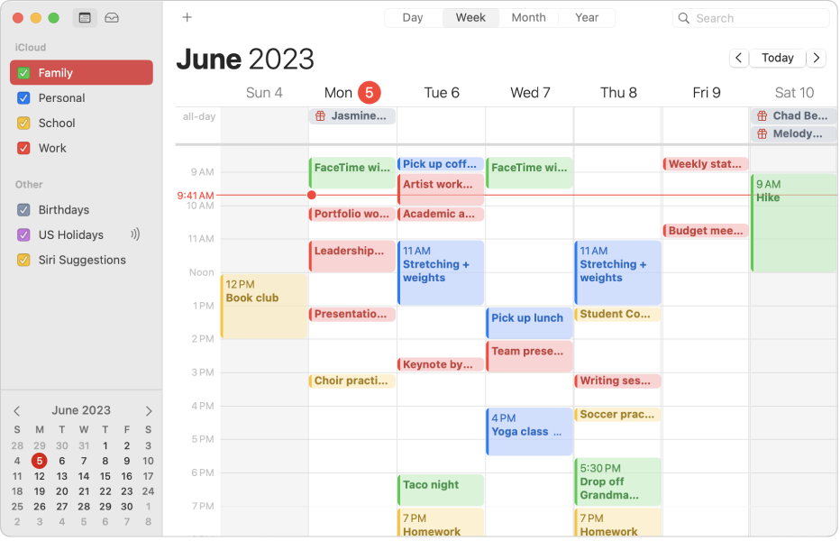

Integrated into the Apple ecosystem, [Apple Calendar](https://www.icloud.com/calendar) allows users to create and share calendars with other iCloud users, making it ideal for those deeply invested in Apple products.
**Key Features:**
- Seamless integration with the Apple ecosystem, including iCloud, Siri, and other Apple apps.
- Allows for the creation of multiple calendars, event invitations, and shared calendars among iCloud users.
- Location suggestions, travel time estimates, and weather information for events.

**Pros:**
- Deeply integrated into iOS, macOS, and watchOS, offering a unified experience across devices.
- Simple and clean interface that's easy to use.
- Reliable syncing across all Apple devices.

**Cons:**
- Limited functionality and customization compared to third-party calendar apps.
- Primarily beneficial for users who are fully invested in the Apple ecosystem.

**Integration:**
- Works seamlessly with other Apple services and apps.
- Limited integration with non-Apple products and services.

**Pricing:**
- Free for all Apple device users.

### 12. Any.do

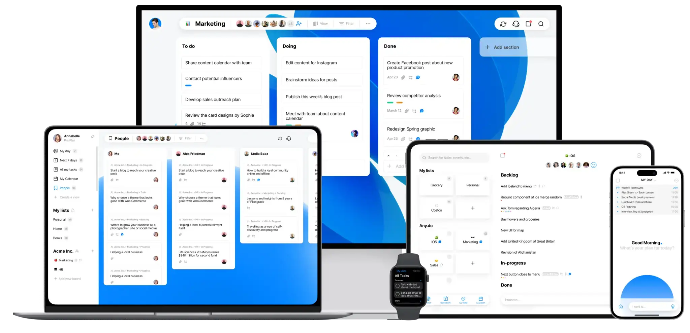

More than just a calendar app, [Any.do](https://www.any.do/) combines tasks, lists, reminders, and an integrated calendar. It's designed to keep your schedule and daily tasks tightly organized.
**Key Features:**
- Combines calendar, tasks, lists, and reminders in one app.
- Voice entry and natural language processing for easy task and event creation.
- Integrates with Google Calendar, Outlook, and more.

**Pros:**
- All-in-one solution for task and time management.
- Cross-platform availability (iOS, Android, web, and more).
- Features like the daily planner and focus mode help enhance productivity.

**Cons:**
- Some advanced features require a premium subscription.
- Users may find the app overwhelming if they prefer separate tools for tasks and calendar management.

**Integration:**
- Syncs with existing calendars (Google, iCloud, Outlook).
- Integrations with other productivity tools through Zapier.

**Pricing:**
- Free version available with basic features.
- Premium plans start at $5.99/month, offering additional features like location-based reminders and color tags.

### 13. Doodle

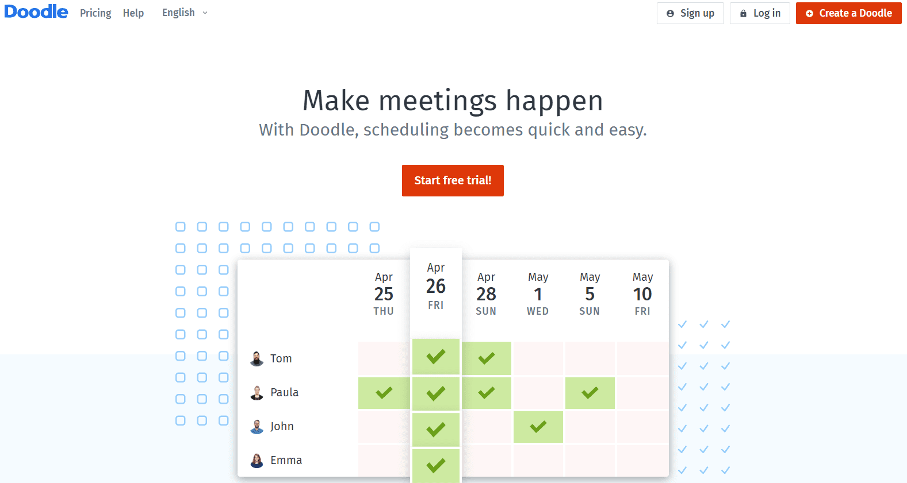

Best known for its group scheduling functionality, [Doodle](https://doodle.com/en/) allows users to propose several times for an event and then lets participants vote on their preferences, simplifying the process of finding the best meeting time.
**Key Features:**
- Simplifies finding the best meeting times by allowing participants to vote on preferred options.
- Integration with personal calendars to avoid scheduling conflicts.
- Offers both individual and group polls.

**Pros:**
- Streamlines the process of scheduling meetings with multiple participants.
- Easy to use, with no need for participants to have a Doodle account.
- Offers a clean, straightforward interface.

**Cons:**
- Advanced features and ad-free experience require a premium subscription.
- Some users may prefer more comprehensive calendar management tools.

**Integration:**
- Can integrate with Google Calendar, Outlook, and iCloud.
- Connects with Zoom, Teams, and other conferencing tools in premium versions.

**Pricing:**
- Free for basic functionality.
- Premium subscriptions start at $6.95/month, providing additional features like automatic reminders and calendar integration.

### 14. Teamup Calendar

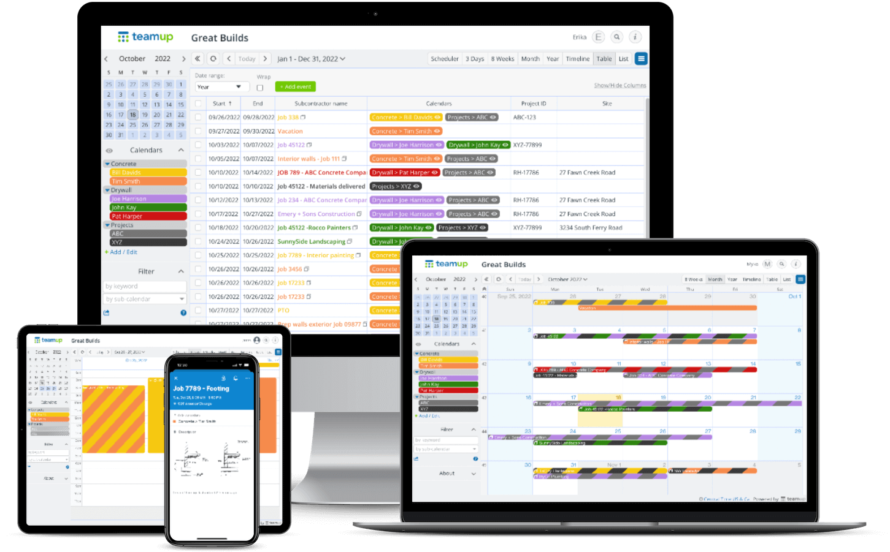

Designed for groups and teams, [Teamup Calendar](https://www.teamup.com/) makes it easy to share schedules, allocate resources, and manage access permissions without requiring user accounts.
**Key Features:**
- Designed for team and group collaboration, allowing for shared calendars without individual user accounts.
- Customizable access permissions for different users.
- Supports sub-calendars, event color-coding, and custom fields.

**Pros:**
- Highly flexible and customizable, suited for a wide range of uses from businesses to community groups.
- No user accounts required, simplifying access for participants.
- Robust sharing and permission settings.

**Cons:**
- Lacks some personal productivity features found in individual-focused calendar apps.
- Interface might seem utilitarian compared to more modern-looking apps.

**Integration:**
- Limited direct integrations, focusing instead on its core functionality as a shared calendar platform.

**Pricing:**
- Basic version is free with limited features.
- Paid plans start at $8/month, offering extended functionalities like more sub-calendars and advanced customization.

### 15. Jorte Calendar

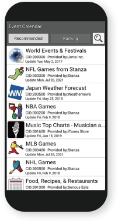

With a focus on customization, [Jorte Calendar](https://www.jorte.com/etc/) offers a personal organizer where you can design your calendar with stickers and themes, while still offering robust sharing capabilities.

**Key Features:**
- Highly customizable interface with themes, stickers, and fonts.
- Integrates with cloud services for syncing across devices.
- Includes a diary function for jotting down notes and memories.

**Pros:**
- Personalization options make it stand out from more utilitarian calendar apps.
- Supports multiple calendar views including daily, weekly, and monthly.
- Offers a public event feature for discovering local events.

**Cons:**
- The abundance of customization options might overwhelm users looking for simplicity.
- Some premium features require a subscription.

**Integration:**
- Syncs with Google Calendar and other cloud services.
- Limited third-party app integration beyond basic calendar syncing.

**Pricing:**
- Free version available with basic features.
- Premium service, Jorte Plus, is available for $1.99/month or $17.99/year, offering additional customization options and cloud storage.

## Key points to choose a calendar sharing app

- **Integration with Other Tools**: Search for an application that easily connects to other services and tools you utilize, like messaging apps, project management software, and email clients. By doing this, a more seamless workflow is guaranteed, and switching between programs is less necessary.

- **User UI and Ease of Use**: You may greatly improve your experience with an intuitive, easy-to-navigate UI. Just think about how easy it is to add, modify, and share events, as well as quickly access your schedule.

- **Collaboration and Sharing Features**: Assess the app's sharing features, such as how simple it is to share calendars with others, manage access rights, and work together on events. This is especially crucial for family planning and group endeavors.

- **Customization and Flexibility**: You may better manage your schedule by adding individualized reminders, color-coding events, and setting up several perspectives (day, week, and month) on your calendar.

- **Cross-Platform Availability**: Look for an app that enables cross-platform synchronization if you work in a diverse setting or use various devices. This guarantees that your calendar will be accessible and manageable from any device.

- **Notifications and Reminders**: You can remain on top of your schedule with the help of effective notification systems that let you set reminders, get notifications for future events, and be informed when shared events alter.

- **Security and Privacy**: If you're providing critical information, pay particular attention to the app's security measures and privacy guidelines. To ensure that your data is protected, look for end-to-end encryption, safe data storage, and transparent privacy policies.

- **Pricing**: A subscription may be needed for premium features, even though many calendar applications have free versions available. Evaluate the price in relation to the value it offers to make sure it fulfills your needs while staying within your budget.

- **Offline Access**: To make sure you always have access to your schedule, an app that lets you see and change your calendar offline is quite helpful when you don't have an internet connection.

- **Support and Reliability**: The functioning of the app and your overall experience can be improved by the app developer's consistent updates and dependable customer service. Examine customer reviews and ratings to determine the dependability and caliber of support for the program.

## Recommended sharing app for different roles

### For Families
- **Cozi Family Organizer**: With features like shared calendars, shopping lists, to-do lists, and meal planning, Cozi is designed to keep family schedules organized. Its user-friendly interface makes it easy for all family members to stay in sync.
- **FamCal**: Offers a shared calendar, reminders, notes, and the ability to share photos and lists, making it great for keeping family members connected and organized.

### For Teams and Project Managers
- **Asana**: While primarily a project management tool, Asana’s calendar view helps teams visualize tasks and deadlines, making it easier to manage projects and timelines.
- **Trello** (with Calendar Power-Up): Trello's visual board approach combined with the Calendar Power-Up allows teams to organize tasks and deadlines effectively, facilitating project management and team coordination.

### For Business Professionals
- **Google Calendar**: Known for its seamless integration with other Google Workspace tools and widespread acceptance, Google Calendar is ideal for professionals looking to schedule meetings, share calendars, and integrate their schedules with other Google services.
- **Microsoft Outlook Calendar**: Part of the Microsoft Office suite, Outlook Calendar is perfect for those already using Microsoft products. It offers robust features for scheduling, sharing, and managing meetings within a professional environment.

### For Students
- **My Study Life**: Specifically designed for students, My Study Life integrates class schedules, homework assignments, and exam preparation into one platform, making it easier to manage academic life.
- **TimeTree**: Excellent for group projects and sharing class schedules among peers, TimeTree allows for easy collaboration and communication among students.

### For Freelancers and Solopreneurs
- **Calendly**: Ideal for managing appointments and meetings with clients, Calendly simplifies the process of finding mutual availability without the back-and-forth emails.
- **Any.do**: Combining tasks, lists, reminders, and an integrated calendar, Any.do helps freelancers stay organized and manage their time effectively across various projects.

### For Event Planners and Community Organizers
- **Teamup Calendar**: With no user account required for access and customizable sharing permissions, Teamup makes it easy to coordinate events, share schedules, and manage resources among large groups.
- **Doodle**: Simplifies the process of scheduling events by allowing participants to vote on preferred times, making it easier to plan meetings and events with multiple stakeholders.

