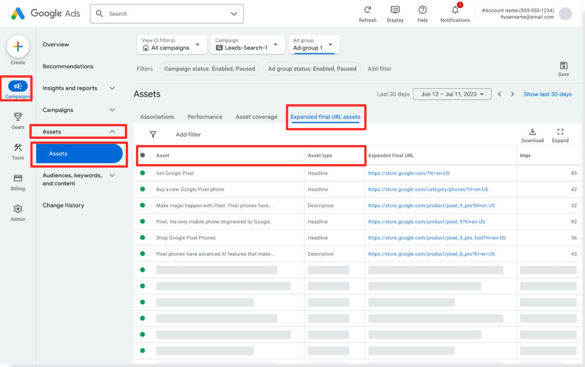

在上一篇文章中，我们研究了 [AI Max 关键词匹配的运作方式](https://chloevolution.com/zh-cn/posts/ai-max-search-keyword-insights/)，发现它正在独立开辟全新的流量通道。但 AI Max 的能力远不止于此，它还能自动生成广告文案和标题。

那么问题来了：这些自动生成的素材是怎么来的？它在带来便利的同时，又隐藏着哪些风险？

## AI Max 生成素材的类型与频率

AI Max 主要会生成两种类型的素材：**标题 (title)** 和**描述 (description)**。在我的测试账户中，AI 生成的素材以标题为主，数量占比高达 **80%**。

这个比例非常值得我们关注。它表明 AI Max 的素材生成策略更倾向于**高频率地测试标题**。标题是广告中曝光度最高、最能直接影响点击率的元素。通过大量生成不同版本的标题，AI 能够快速地进行 A/B 测试，从而找到最能吸引用户的文案。

目前日均新增约 **12 条** AI 自动生成的标题或描述。我甚至观察到，**部分 AI 生成的标题长度明显超过了 Google Ads 传统的 30 个字符限制**。这说明 AI Max 正在使用一套独立的、不同于传统规则的素材系统。

这也解释了为什么 AI Max 自动生成的素材**无法和广告主自己提供的素材在同一个后台数据表格中展示**。它们被完全隔离在另一个数据流中，这意味着 AI Max 不仅仅是一个简单的素材生成工具，而是一个拥有独立规则和逻辑的并行系统。

## AI Max 生成素材的机制

既然 AI Max 能够生成数量庞大且格式独特的素材，那它是如何做到的呢？通过观察，我发现这些素材的生成主要基于两个核心机制。

### **直接引用落地页文本**

AI Max 会直接从你的**落地页**中抓取文本，并将其用作广告标题或描述。这是一种简单粗暴但高效的素材生成方式。你提供的落地页内容越丰富、越有条理，AI 就越有可能从中提取到有价值的文案。

### **基于语义进行匹配与生成**

AI Max 不仅会复制粘贴。我们观察到，部分生成的文案虽然没有直接引用落地页的文本，但内容却与落地页主题高度相关。这表明 AI 能够进行深层次的**语义理解**，并基于这种理解来生成新的、更具吸引力的文案。

此外，我推测 AI 有识别**图片中文字**的倾向。这表明 AI Max 在获取素材信息时，可能比我们想象的更“聪明”，它正在试图理解页面上所有可用的信息。

不过，这种机制也存在一个典型的“黑盒”问题。虽然我们能看到 AI 生成了哪些文案，但我们并**不知道它们具体来自落地页的哪个部分**，也无法追溯其来源。更重要的是，我们目前只能查看这些素材的**曝光量（Impression）**，无法看到点击、花费等关键指标。这种信息不对称，给我们评估素材效果带来了不小的挑战。

## AI 生成素材的风险与挑战

虽然 AI Max 的素材生成能力为我们带来了便利，但这个“黑盒”也并非完美无缺。在我的测试中，也发现了两个值得警惕的风险和挑战。

### 文案内容的不可控性

AI 的生成逻辑有时会超出我们的预期。我们观察到，AI 会从落地页中抓取一些**并不具备营销属性**的文案。例如，在一个介绍企业理念的博客页面中，AI 可能会抓取其中的名人名言，并将其作为广告标题。

这些生成的文案虽然来自你的页面，但可能与你的营销目的毫不相关，甚至显得“无厘头”。这种不可控性是 AI 生成文案最大的风险，需要我们保持警惕。

### 非实时同步的滞后性

另一个风险是**素材更新的滞后性**。AI 生成的文案并不能做到与落地页内容实时同步。例如，即使你在 8 月 1 日更新了落地页，删除了某些表述，但在 8 月 2 日，AI 仍然可能生成包含这些旧信息的文案。

这种滞后性可能导致广告内容与落地页不一致，造成用户的困惑。这不仅会损害用户体验，还可能降低转化率。

更重要的是，这些风险额外增加了我们的工作量。为了确保广告文案的准确性和一致性，我们不得不定期检查 AI 生成的素材，手动排查和移除不符合要求的文案。这与 AI Max 旨在减轻工作量的初衷形成了一种矛盾。

---

AI Max 的广告素材生成能力最直接的价值在于能够作为一个永不枯竭的创意引擎，持续不断地生成新的标题和描述，大大减轻了手动撰写文案的工作量。这种基于落地页内容的自动生成能力，也为我们提供了新的创意方向。

然而，这个“黑盒”也远非完美。它带来了文案内容不可控、更新滞后以及数据不透明的风险。为了保证广告内容的一致性和营销效果，我们不得不花费额外的时间去审查和修正 AI 的产出。这与它旨在实现完全自动化的初衷形成了矛盾。

因此，我们的角色必须发生转变。我们不再是单纯的文案创作者，而是 AI 创意的管理者和监督者。

最终的建议是：
1. **提供高质量的输入**：为 AI 提供清晰、精准、与营销目的高度相关的落地页内容，这是引导其生成有效素材的关键。
2. **保持持续监控**：定期检查 AI 生成的文案，及时排除不相关或可能引起歧义的内容。
3. **理解并接受其局限性**：AI 的自动化能力固然强大，但它仍然需要人类的监督和修正，才能确保广告内容的准确性，并最大化其价值。