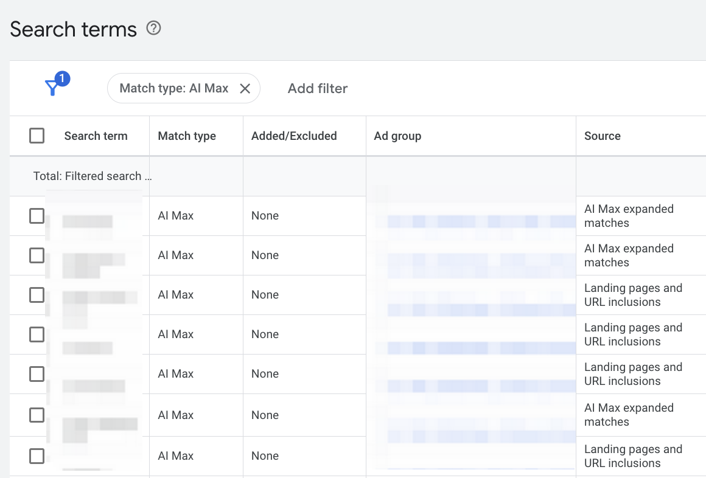

AI is becoming increasingly important in the advertising world, and **[AI Max for Search](https://blog.google/products/ads-commerce/google-ai-max-for-search-campaigns/)** from Google is a perfect example. Its core concept is simple: you provide some basic information, and the AI finds the most relevant users, automating your ad campaigns. For advertisers, this sounds very convenient.

But a question quickly arises: how exactly does this powerful AI work? Its internal decision-making process is invisible to us. We know what we put in and what comes out, but everything in between is like a "black box."

In this article, I’ll share some of my findings from a test I ran on the AI Max **keyword matching** feature. My goal is to use my real data and observations to give you a more practical perspective.

Before we dive in, let's clarify two basic concepts, as they are key to understanding AI Max:

* **Keywords**: These are the words you set in your Google Ads account, telling the system what your ads are about.
* **Search Terms**: These are the actual words or phrases users type into the Google search bar. AI Max's job is to match your ads to these real user searches.

## AI Max's New Match Type: A Brand New Traffic Pool

After enabling AI Max in the backend, we quickly found that besides the familiar broad, phrase, and exact match types, **AI Max introduced a brand new match type: AI Max.**

This led to our first question: Is AI Max just optimizing our existing keywords?

The test results gave us a clear answer: **The search terms matched by AI Max and those matched by traditional methods have zero overlap.** This means AI Max isn't fighting for traffic in the existing pool; it's **independently creating a new matching channel**.

Our data shows that while this new channel's share of traffic and cost is currently small:

* **Traffic Share**: Traditional keywords account for about **90%**, while AI Max matches account for about **10%**.
* **Cost Share**: Traditional keywords account for about **92%**, while AI Max matches account for about **8%**.

So what's its value? While search terms matched by AI Max might overlap with those from your other campaigns that don’t have AI Max enabled, this is precisely **AI Max's core capability: it can autonomously explore and discover new, highly relevant search terms.** Its value lies in its ability to automatically find long-tail keywords that you might have missed or couldn't reach manually.

## AI Max's Two Core Keyword Matching Mechanisms

Since AI Max-matched search terms form an independent traffic pool, how does it actually work? This is our key to looking inside the "black box." We found that all AI Max-matched search terms come from two different sources.

Based on our test data, among all AI Max-matched search terms:

* **61%** came from **AI Max expanded matches**.
* **39%** came from **Landing pages and URL inclusions**.

This clearly indicates that AI Max's keyword matching relies on two core mechanisms.

### Keyword-Based Expansion

AI Max doesn't just expand your keywords; it uses deep semantic analysis to match the most relevant search terms. It understands the user's intent behind the words, not just the words themselves.

**AI Max expanded matches** are the result of this mechanism. They can find long-tail keywords highly relevant to your product that you may never have thought of.

Our data shows this matching method performs quite well:

* Its click-through rate (CTR) is **slightly lower than** our own keywords.
* But its **average CPC** is about **15% lower** than our own keywords.

This means AI Max can get you traffic at a lower cost while maintaining quality.

### Landing Page Content-Based Matching

If you're familiar with Google Ads' **[DSA (Dynamic Search Ads)](https://support.google.com/google-ads/answer/2471185?hl=zh)**, this model will seem familiar. AI Max directly uses your **landing page** content as a basis for finding new traffic.

**Landing pages and URL inclusions** are the source of this mechanism. AI Max crawls and analyzes your landing page content, then matches search terms based on it. Your landing page is no longer just a traffic destination; it's a "super keyword."

This matching method performed exceptionally well:

* Its **CTR** is the **highest** of all match types.
* Its **average CPC** is about **29% lower** than our own keywords, making it the **most cost-effective** of the three.

This discovery is crucial. It tells us that in the world of AI Max, a good landing page can not only increase conversions but also directly impact the quality and cost of your traffic.

However, a classic "black box" problem exists here. While we can see these search terms are bringing good clicks and conversions, the backend doesn't show us **which landing page's content AI Max used to match a specific search term**. This means we don't know its decision-making criteria and can't specifically optimize particular pages.

## The Quality and Challenges of AI-Matched Keywords

We know AI Max is generating new traffic, but what is the quality of these AI-matched keywords?

Our data shows that the **volume of AI-matched search terms is massive**. In our test account, AI-matched keywords accounted for **11% to 12%** of all keywords, with an average of **150+ new ones daily**.

That's a stunning number. But when we analyzed the click data for these terms, a typical "black box" phenomenon appeared: the clicks were **extremely scattered**.

* Over **76%** of the terms only had **1 click**.
* Only a few terms received multiple clicks.

At first glance, this might seem disappointing. Is it a waste that the AI works so hard to find so many terms, only for most to get just one click?

On the contrary, this is precisely **the value of the AI Max black box**. This "casting a wide net" behavior is a typical "prospecting" strategy. Manually, you would never spend the time and effort to test hundreds of long-tail keywords that might only get one or two clicks. But the AI can, and it does so efficiently at a very low cost.

The core value of this model is its ability to **discover potential high-converting long-tail keywords with minimal trial-and-error costs**. Even if most terms perform poorly, finding just a few "golden" ones that can **consistently drive conversions and even have scaling potential** can bring a huge return. This is why continuous monitoring and optimization are so essential.

---

Through this practical test, we've gained a clearer understanding of the AI Max keyword black box. It doesn't just optimize our existing keywords; it **independently opens up a brand new traffic channel**. This channel uses two core mechanisms—keyword expansion and landing page-based matching—to find new traffic efficiently and affordably.

Facing such a powerful automated tool, we don't need to obsess over understanding every decision it makes. Its value isn't in explainability but in its ability to **explore and discover potential high-converting long-tail keywords at a speed and cost we can't match.**

Therefore, the key to success is to **change our mindset**. Our role is no longer a pure optimizer but a data analyst and strategist. Our tasks are:

1.  **Provide high-quality input**: Pay special attention to optimizing landing page content, as it's a key source for the AI to find new keywords.
2.  **Maintain continuous monitoring and optimization**: Regularly check the AI-matched search terms and add top performers to your core keyword list.
3.  **Be results-oriented**: Don't dismiss the value of the AI's scattered clicks. As long as your final CPA and ROI are acceptable, the tool is working effectively for you.

The arrival of AI Max signals a new phase in ad campaigns. It challenges our understanding of traditional keyword optimization while offering unprecedented opportunities. Learning to use this tool correctly will be a critical skill for every optimizer in future competition.