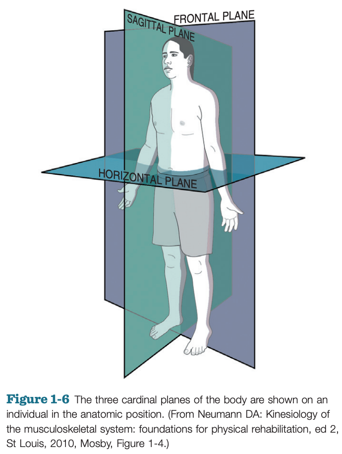
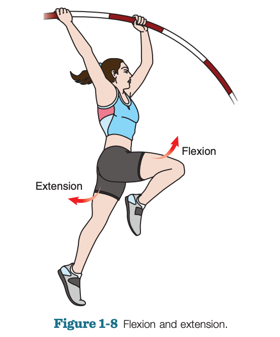
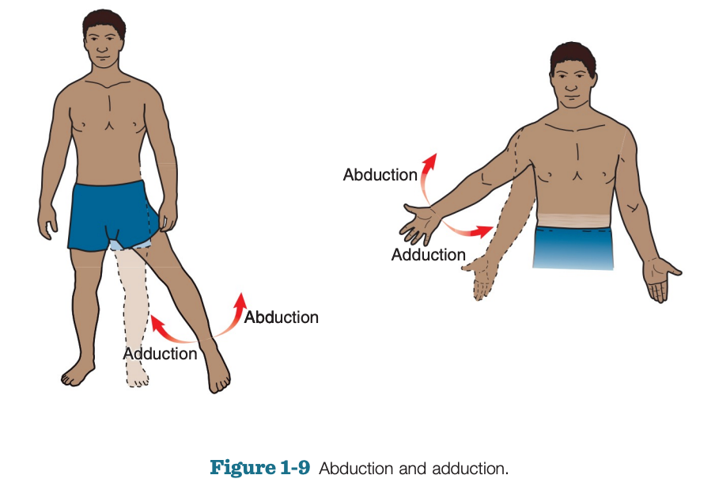
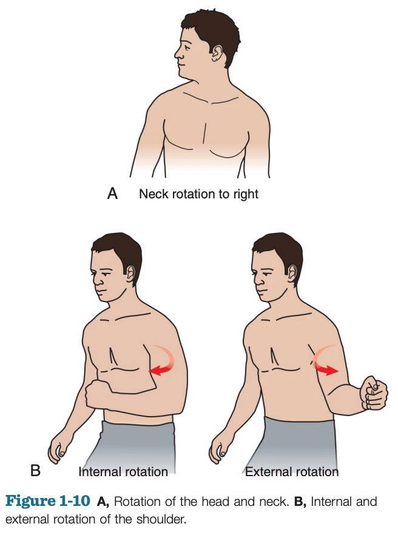
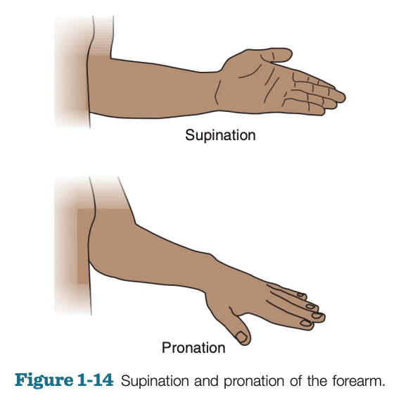
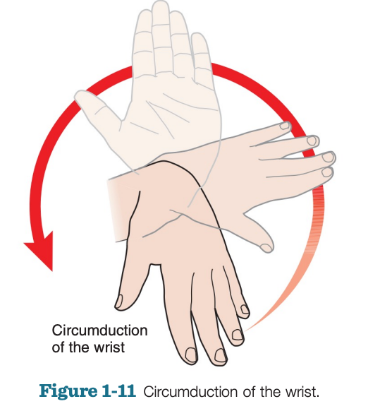
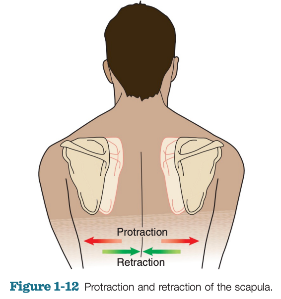
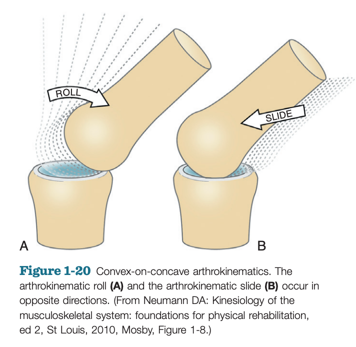
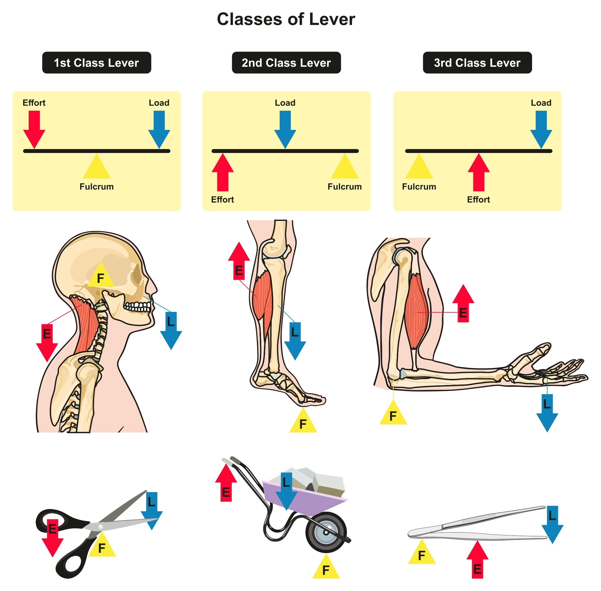
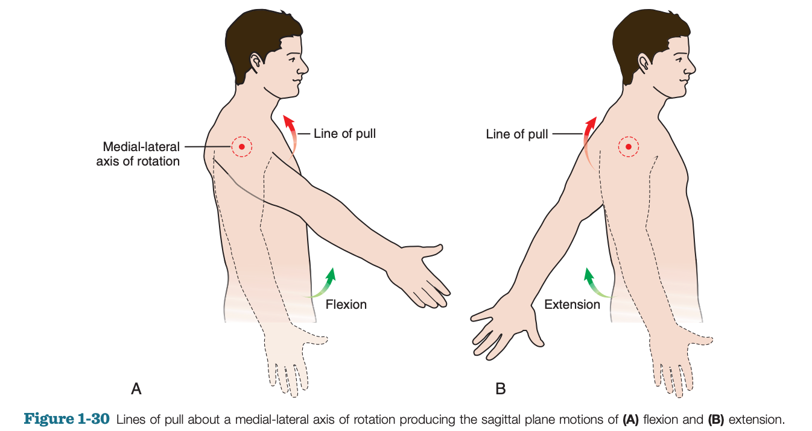

Stepping into the world of sports rehabilitation first requires a systematic framework for understanding how the human body moves. This framework consists of the two core branches of biomechanics—**kinematics** and **kinetics**—and their sub-branches.

You can think of understanding human movement like building a house. The following four concepts serve as the **four key pillars** that support this structure:

| Core Pillar | Key Question |
| :--- | :--- |
| **Kinematics** | **How does the body move?** (Describing movement types and paths) |
| **Osteokinematics** | **How do bones move in space?** (Planes of motion, axes, degrees of freedom) |
| **Arthrokinematics** | **How do joint surfaces move internally?** (Roll, slide, spin) |
| **Kinetics** | **What forces create movement?** (Force, torque, levers) |

Understanding how these four pillars interact forms the foundation for analyzing movement, assessing posture, and designing rehabilitation programs.

## Kinematics: Describing Movement Without Considering Force

**Kinematics** is the first step in understanding human motion. It is a subdivision of **biomechanics** that focuses on **describing body movements**—the path and type of motion—without considering the **forces** (torque, muscle contraction, etc.) that cause the movement.

In biomechanics, the term “body” can refer to the **entire body**, a **specific body region** (e.g., the arm), or a **single bone**.

### Fundamental Types of Motion

Human movement can be summarized into two fundamental types:

* **Translation / Linear Movement**:
    * Occurs when the entire “body” or part of it moves in the **same direction**.
    * **Rectilinear translation**: movement along a straight line (e.g., a book sliding across a table).
    * **Curvilinear translation**: movement along a curved path (e.g., the arc of a thrown ball).

The motion of the **entire human body** is often simplified as translation of its **center of mass (COM)**.
* **Rotation / Angular Movement**:
    * Describes motion where the “body” moves along an arc around a fixed **axis of rotation**.
    * The axis of rotation is the **center** or **pivot point** for rotation. Most joint motions in the human body are rotational.

### What Drives a Movement: Active vs. Passive

Whether translational or rotational, movement can be classified by its source:

* **Active Movement**:
    * Usually generated by **contracting muscles** that are stimulated or activated.
    * *Example:* Actively lifting your arm overhead.
* **Passive Movement**:
    * Generated by factors **other than muscle activation**.
    * *Examples:* **Gravity** pulling your arm down, **ligaments** stretching, or a **therapist** applying force to a limb.

## Osteokinematics: How Bones Move Through Space

**Osteokinematics** describes the **gross movement of bones** relative to the body’s three anatomical planes. It defines the movement paths we see, such as lifting the arm or bending the knee.

### Planes of Motion, Axes of Rotation, and Degrees of Freedom

To accurately describe movement, we need a shared reference system. Human motion is described in three **anatomical planes**, each with a perpendicular **axis of rotation**:  

| Plane of Motion | Division | Typical Movements | Axis of Rotation | Axis Orientation |
| :--- | :--- | :--- | :--- | :--- |
| **Sagittal Plane** | Divides the body into **left and right** | **Flexion** and **extension** | **Mediolateral axis** (coronal axis) | Left-to-right |
| **Frontal/Coronal Plane** | Divides the body into **front and back** | **Abduction** and **adduction** | **Anteroposterior axis** (sagittal axis) | Front-to-back |
| **Transverse/Horizontal Plane** | Divides the body into **upper and lower** | **Rotation** (internal/external rotation, trunk rotation) | **Vertical axis** (longitudinal axis) | Up-and-down |

* **Core Principle:** A joint’s **axis of rotation** is always **perpendicular** to the plane in which movement occurs.

#### Degrees of Freedom (DOF)

**Degrees of Freedom** refer to how many **planes of motion** a joint allows. With 3 anatomical planes, a joint can have up to **3 DOF**:

* **1 DOF:** Movement in one plane (e.g., elbow)
* **2 DOF:** Movement in two planes (e.g., wrist)
* **3 DOF:** Movement in all three planes (e.g., shoulder, hip)

### Basic Movements

Precise terminology is the language of movement science. Below are the fundamental terms describing osteokinematic motion:

#### Movements in the Sagittal Plane (Mediolateral Axis)

* **Flexion & Extension**:
    * **Flexion** generally moves one bone toward another bone’s **flexor surface**.
    * **Extension** is the opposite movement.

* **Dorsiflexion & Plantar Flexion**:
    * Describe ankle movement in the sagittal plane.
    * **Dorsiflexion**: lifting the **top of the foot upward**.
    * **Plantar flexion**: lifting the **heel upward** (pointing toes downward).

#### Movements in the Frontal Plane (Anteroposterior Axis)

* **Abduction & Adduction**:
    * **Abduction**: movement **away from the body’s midline**.
    * **Adduction**: movement **toward the midline**.
    * *Note:* This definition does not apply to certain hand and foot motions.

* **Radial Deviation & Ulnar Deviation**:
    * Describe wrist movement in the frontal plane.
    * **Radial deviation**: hand moves toward the **radius** (thumb side).
    * **Ulnar deviation**: hand moves toward the **ulna** (pinky side).

* **Inversion & Eversion**:
    * Describe foot movements in the frontal plane.
    * **Inversion**: sole turns **inward**.
    * **Eversion**: sole turns **outward**.

#### Movements in the Transverse Plane (Vertical Axis)

* **Rotation**:
    * Segment rotates around its **longitudinal axis**.
    * **Internal/Medial rotation**: anterior surface rotates **toward midline**.
    * **External/Lateral rotation**: anterior surface rotates **away from midline**.

* **Pronation & Supination**:
    * Describe rotational movement of the forearm.
    * **Pronation**: palm faces **backward** (anatomical position).
    * **Supination**: palm faces **forward**.

#### Multiplanar Movements

* **Circumduction**:
    * Circular movement across **at least two planes**, drawing a “circle” with the limb (requires ≥2 DOF).

#### Special Translational Movements

* **Protraction & Retraction**:
    * Typically describe **scapula** or **jaw** movement in a plane **parallel to the ground**.
    * **Protraction**: segment moves **away from midline**.
    * **Retraction**: segment moves **toward midline**.

* **Horizontal Adduction & Horizontal Abduction**:
    * Describe **shoulder movement** in the **transverse plane** (typically with arm abducted to 90°).
    * **Horizontal adduction**: arm moves toward midline (hands come together).
    * **Horizontal abduction**: arm moves away from midline.

### The Relativity of Osteokinematics: Open vs. Closed Chain

Understanding the reference frame is essential. Joint movement can be described relative to either of the bones involved:

* **Open Kinetic Chain (OKC)**:
    * The **distal segment** moves around a relatively fixed **proximal segment**.
    * *Example:* Seated knee extension (leg moves freely).

* **Closed Kinetic Chain (CKC)**:
    * The **proximal segment** moves around a relatively fixed **distal segment**.
    * *Example:* Squatting (feet fixed, trunk and thigh move).

## Arthrokinematics: The Subtle Movements of Joint Surfaces

If **osteokinematics** describes how bones move in space like a **door** opening, then **arthrokinematics** describes the movement of the **hinge** itself. It focuses on the **micromovements between joint surfaces**—small in magnitude but essential for smooth motion and proper joint function.

### Structure and Basic Movements Between Joint Surfaces

Joint surfaces usually form a **curved concave–convex pair**. One side is the **concave surface**, and the other is its opposing **convex surface**. This pairing increases **joint congruency** and **stability**, helping guide the motion between bones.

There are three fundamental arthrokinematic movements:

1. **Roll**

   * **Multiple points** on one joint surface contact **multiple points** on the opposing surface.
   * *Think of:* a wheel rolling on the ground.

2. **Slide / Glide**

   * **One point** on one joint surface contacts **multiple points** on the other.
   * *Think of:* a tire skidding on ice.

3. **Spin**

   * **A single point** on one surface rotates around **a single point** on the other.
   * *Think of:* a spinning top or drill bit rotating in place.

### The Concave–Convex Rule: How Roll and Slide Work Together

To maintain **close contact** and **joint stability** during motion (preventing dislocation or excessive compression), the joint must coordinate roll and slide according to the well-known **concave–convex rule**:

#### Rule 1: Convex Moves on Concave

* When the **convex joint surface** moves on the **concave surface**, **roll** and **slide** occur in **opposite directions**.
* The opposite slide counteracts the roll to maintain **joint stability**.
* *Example:* During shoulder abduction, the **humeral head (convex)** rolls **upward** and must slide **downward**.

#### Rule 2: Concave Moves on Convex

* When the **concave joint surface** moves on the **convex surface**, **roll** and **slide** occur in the **same direction**.
* Sliding in the same direction maintains proper joint contact.
* *Example:* During knee flexion, the **tibial plateau (concave)** rolls **posteriorly** and slides **posteriorly**.

#### Spin Mechanism

Spin occurs around the vertical axis of the joint. Whether the concave surface spins on the convex surface or vice versa, spin is necessary for certain motions (e.g., pure rotation in the shoulder or hip).

## Kinetics: The Forces That Create Movement

**Kinetics** is a branch of mechanics that, unlike kinematics, focuses on **forces** acting on the body. In kinesiology, force can be understood as the **push or pull that initiates, modifies, or stops movement**. It is the body’s **ultimate source of motion and stability**.

### Types of Forces

Forces acting on the human body are divided into two categories:

* **Internal Forces**

  * Forces generated **inside the body**.
  * Primarily from **muscle contraction**.
  * Also includes **passive internal forces** such as tension from **ligaments**, **joint capsules**, or **stretched muscles**.

* **External Forces**

  * Forces applied from **outside the body**.
  * Includes **gravity**, **external loads** (suitcases, barbells), and **manual resistance** applied by a therapist.

### Torque: The Measure of Rotational Movement

Because most human joint movements occur around a **rotational axis**, internal and external forces acting on a joint are often expressed as **torque** (or **moment**). Torque is essentially the **rotational effect of a force**.

Torque depends on two factors:

1. **Magnitude of the force**, and
2. **Moment arm (MA)** — the **perpendicular distance** from the force’s line of action to the axis of rotation.

$$
\text{Torque} = \text{Force} \times \text{Moment Arm}
$$

#### Why Must the Moment Arm Be a Perpendicular Distance?

In human movement, the moment arm is the key that translates **linear force** into **rotational torque**.

Force can be broken into two components:

* **Rotary component** – **perpendicular** to the lever, responsible for producing rotation.
* **Stabilizing/dislocating component** – **parallel** to the lever, contributing to joint compression or distraction.

Only the **perpendicular distance** accurately represents the portion of force that contributes to **pure rotation**.

| Factor                 | Conclusion                                        | Biomechanical Meaning                                                         |
| :--------------------- | :------------------------------------------------ | :---------------------------------------------------------------------------- |
| **Longer moment arm**  | Requires **less force** to create the same torque | **Greater mechanical efficiency**; muscle moves larger loads with less effort |
| **Shorter moment arm** | Requires **more force** to create the same torque | **Lower efficiency**; muscles must work harder                                |

* **Internal torque**: produced by internal forces (muscles) via the **internal moment arm (IMA)**.
* **External torque**: produced by external forces (gravity, loads) via the **external moment arm (EMA)**.

Movement occurs when **internal torque** and **external torque** interact. When analyzing motion, always pay attention to the **relationship between IMA and EMA**, because this determines the **muscular demand** at any joint angle.

### The Three Types of Biological Levers

Human bones, joints, and muscles form a sophisticated system of **biological levers**. Understanding lever types helps explain how efficiently a muscle can produce movement. A lever consists of three elements:
**axis (fulcrum, F)**, **internal force (I)**, and **external force (E)**.

| Lever Type             | Arrangement (I–F–E)                          | Internal Moment Arm (IMA)   | Main Advantage                                                | Example                                                       |
| :--------------------- | :------------------------------------------- | :-------------------------- | :------------------------------------------------------------ | :------------------------------------------------------------ |
| **First-class lever**  | **I – F – E** (fulcrum in the middle)        | May be long or short        | **Balance and stability**; can favor strength or speed        | Neck extensors supporting the head (F at the cervical spine). |
| **Second-class lever** | **F – E – I** (external force in the middle) | Always **longer** than EMA  | **Force advantage** (energy-efficient), strong lever          | Heel raise (gastrocnemius lifting body weight).               |
| **Third-class lever**  | **F – I – E** (internal force in the middle) | Always **shorter** than EMA | **Speed and large ROM advantage**; less mechanical efficiency | Elbow flexion (biceps pulling).                               |

#### Why Are Third-class Levers Most Common?

In human **open-chain movement**, **most joints act as third-class levers**. Although this design requires **greater muscle force** to move smaller external loads (strength disadvantage), it offers critical advantages:

* **Maximal speed and range of motion**
* **Minimal muscle shortening required for large distal movement**

This allows distal segments (like the hand) to move **faster and farther** than the muscle fibers themselves—essential for actions like throwing or reaching.

### Muscle Vectors and Line of Pull

* The **line of pull** describes the **direction** of a muscle’s force and is represented as a **vector**.
* Vectors express both **magnitude** (line length) and **direction** (arrow).
* A muscle’s line of pull relative to a joint’s axis determines the **movement it can produce** (e.g., flexion, extension, stabilization).
* When multiple muscles act together, if their forces are unequal, the resulting force—and motion—will shift toward the **stronger** muscle.

