Having a dependable note-taking app on hand is not just convenient, but essential in today's fast-paced environment when ideas come and go in an instant. 
The correct note-taking app can make all the difference, whether you're a professional balancing projects and meetings, a student carefully planning their study materials, or just someone attempting to keep their everyday thoughts and duties organized. Selecting the ideal app may seem intimidating given the abundance of options available, each with distinct features and catered to different purposes. 
This post explores the world of note-taking applications and offers suggestions for a range of usage scenarios to assist you in selecting the one that will improve your productivity in addition to helping you organize your thoughts.

## The best Note-taking apps for Mac at a glance

<table>
    <tr>
        <td></td>
        <td>Free trial time</td>
        <td>Pricing</td>
        <td>Supported platform</td>
        <td>Integration</td>
        <td>AI feature</td>
   </tr>
    <tr>
        <td>Apple Notes</td>
        <td>free with Apple devices</td>
        <td>-</td>
        <td>Mac, iOS</td>
        <td>❌</td>
        <td>❌</td>
   </tr>
    <tr>
        <td>Microsoft OneNote</td>
        <td>free with a Microsoft account</td>
        <td>in Office 365 subscription</td>
        <td>Web, Windows, Mac, iOS, Android</td>
        <td>✅</td>
        <td>✅</td>
   </tr>
    <tr>
        <td>Zoho Notebook</td>
        <td>free (essential version)</td>
        <td>Start from $19.9/year</td>
        <td>Windows, Mac, iOS, Android</td>
        <td>✅</td>
        <td>❌</td>
   </tr>
    <tr>
        <td>ClickUp</td>
        <td>free</td>
        <td>-</td>
        <td>Web, iOS, Android</td>
        <td>✅</td>
        <td>✅</td>
   </tr>
    <tr>
        <td>Evernote</td>
        <td>forever (Personal version)</td>
        <td>Start from $89.99/year</td>
        <td>Windows, Mac, iOS, Android</td>
        <td>✅</td>
        <td>✅</td>
   </tr>
    <tr>
        <td>Slite</td>
        <td>14 days</td>
        <td>Start from $10/month per member</td>
        <td>Web, Windows, Mac</td>
        <td>✅</td>
        <td>✅</td>
   </tr>
    <tr>
        <td>Notion</td>
        <td>free (basic version)</td>
        <td>Start from $10/month per individual</td>
        <td>Windows, Mac, iOS, Android</td>
        <td>✅</td>
        <td>✅</td>
   </tr>
    <tr>
        <td>Ulysses</td>
        <td>14 days</td>
        <td>Start from $5.99/year per individual</td>
        <td>Mac, iOS</td>
        <td>❌</td>
        <td>❌</td>
   </tr>
    <tr>
        <td>Obsidian</td>
        <td>free for personal use</td>
        <td>$50/user per year</td>
        <td>Windows, Mac, iOS, Android</td>
        <td>❌</td>
        <td>❌</td>
   </tr>
    <tr>
        <td>Logseq</td>
        <td>free forever for personal use</td>
        <td>-</td>
        <td>Windows, Mac, iOS, Android</td>
        <td>❌</td>
        <td>❌</td>
   </tr>
    <tr>
        <td>Joplin</td>
        <td>free</td>
        <td>-</td>
        <td>Windows, Mac, iOS, Android</td>
        <td>❌</td>
        <td>❌</td>
   </tr>
    <tr>
        <td>UPDF for Mac</td>
        <td>free forever</td>
        <td>Start from $29.9/year per individual</td>
        <td>Windows, Mac, iOS, Android</td>
        <td>❌</td>
        <td>✅</td>
   </tr>
    <tr>
        <td>Goodnotes</td>
        <td>7 days</td>
        <td>Start from $9.9/year</td>
        <td>Web, Windows, Mac, iOS, Android</td>
        <td>❌</td>
        <td>✅</td>
   </tr>
    <tr>
        <td>Simplenote</td>
        <td>free forever</td>
        <td>-</td>
        <td>Windows, Mac, iOS, Android</td>
        <td>❌</td>
        <td>❌</td>
   </tr>
    <tr>
        <td>Google Keep</td>
        <td>free</td>
        <td>-</td>
        <td>Web, Windows, Mac, iOS, Android</td>
        <td>❌</td>
        <td>❌</td>
   </tr>
    <tr>
        <td>NotePlan</td>
        <td>14 days</td>
        <td>Start from $9.9/month</td>
        <td>Mac, iOS</td>
        <td>✅</td>
        <td>✅</td>
   </tr>
    <tr>
        <td>MarginNote</td>
        <td>14 days</td>
        <td>Start from $8.99</td>
        <td>Mac, iOS</td>
        <td>✅</td>
        <td>❌</td>
   </tr>
    <tr>
        <td>UPDF for Mac</td>
        <td>free forever</td>
        <td>Start from $29.9/year per individual</td>
        <td>Windows, Mac, iOS, Android</td>
        <td>❌</td>
        <td>✅</td>
   </tr>
</table>

### 1. Apple Notes

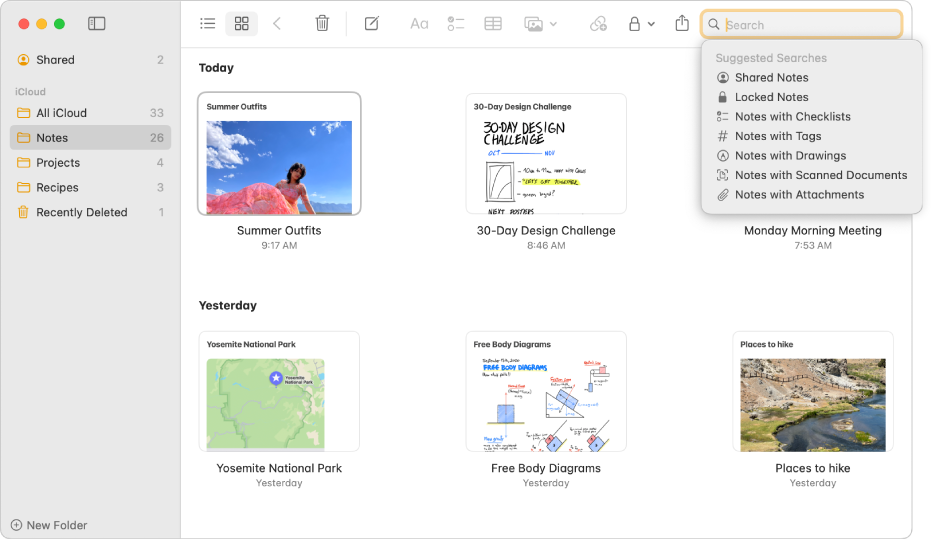

[Apple Notes](https://apps.apple.com/us/app/notes/id1110145109) is a note-taking app developed by Apple Inc. that comes pre-installed on all Apple devices. It offers a straightforward interface for typing notes, adding attachments, and drawing sketches, making it ideal for quick note-taking and seamless synchronization across all your Apple devices.

#### Pros:
  - Seamless integration with the macOS and iOS ecosystem, including Siri.
  - Simple and intuitive user interface.
  - Supports multimedia notes, including photos, sketches, and document scans.
  - Collaboration features allow for shared notes and folders.
#### Cons:
  - Limited organizational tools compared to more advanced note-taking apps.
  - Features can feel basic for power users.
#### Integration: Deep integration with Apple devices and services like iCloud for syncing across all devices seamlessly.
#### Pricing: Free with Apple devices.

### 2. Microsoft OneNote

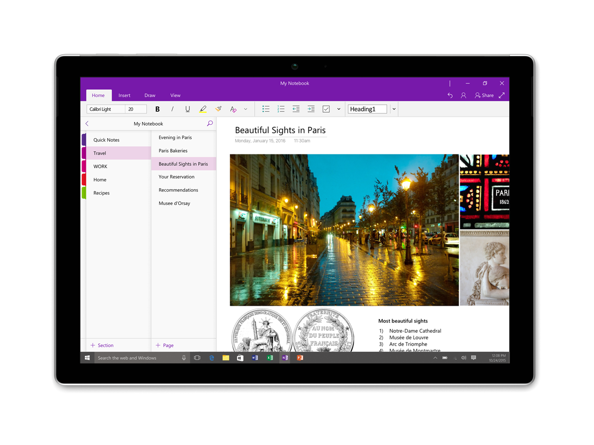

[Microsoft OneNote](https://www.onenote.com/) is a digital notebook part of the Microsoft Office suite, designed for freeform information gathering and multi-user collaboration. It allows users to create, share, and collaborate on notes, drawings, screen clippings, and audio commentaries across devices.

#### Pros:
  - Extensive formatting and organizational features, including notebooks, sections, and tags.
  - Supports multimedia content like images, videos, and audio recordings.
  - Excellent collaboration features, including real-time editing by multiple users.
  - Strong integration with Microsoft Office suite and other Microsoft services.
#### Cons:
  - Can be overwhelming for users looking for simplicity.
  - Performance may lag with very large notebooks.
#### Integration: Integrates with Microsoft Office applications, Microsoft Teams, and various other productivity tools through Office 365.
#### Pricing: Free with a Microsoft account. Additional features available with an Office 365 subscription.

### 3. Zoho Notebook

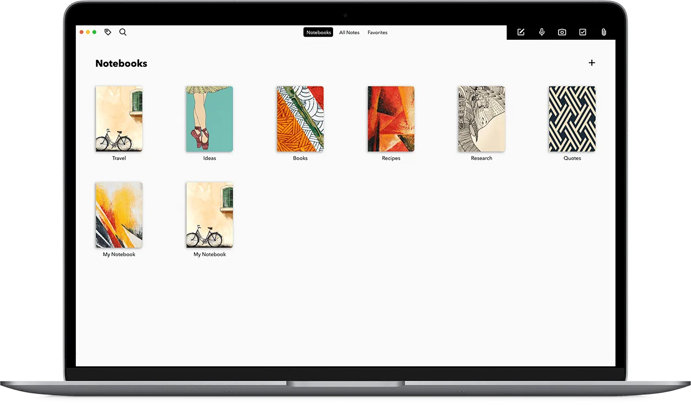

[Zoho Notebook](https://www.zoho.com/notebook/) is a note-taking app that is part of the Zoho suite, designed to offer a visually appealing and user-friendly environment for capturing ideas, compiling notes, and organizing information. It's known for its multimedia capabilities and flexibility across devices.

#### Pros:

  - Visually Appealing: Zoho Notebook stands out with its beautiful, customizable notebook covers and a clean interface, making note organization not only efficient but also visually pleasing.
  - Multimedia Support: Users can add various types of content to their notes, including text, images, audio, checklists, and sketches, catering to diverse note-taking needs.
  - Cross-Platform Syncing: With apps available for iOS, Android, Mac, and web browsers, Zoho Notebook ensures your notes are accessible across all your devices with seamless cloud synchronization.

#### Cons:

  - Limited Advanced Features: For users looking for complex organizational structures like tagging or hierarchical notebooks, Zoho Notebook might feel a bit simplistic.
  - Integration Limitations: While it integrates well within the Zoho ecosystem, its integration with external apps and services is more limited compared to competitors like Evernote or OneNote.
  - No Offline Access on Web: The web version requires an internet connection to access your notes, which can be a limitation for users needing to work offline.

#### Integration:
Zoho Notebook integrates smoothly with other Zoho apps, enhancing productivity for users already invested in the Zoho ecosystem. However, its integration with third-party apps is not as extensive as some of its competitors, focusing more on internal synergy with Zoho services like Zoho Mail.

#### Pricing:

Zoho Notebook is completely free for Essential version. Pro version needs $19.9 per year.

### 4. ClickUp

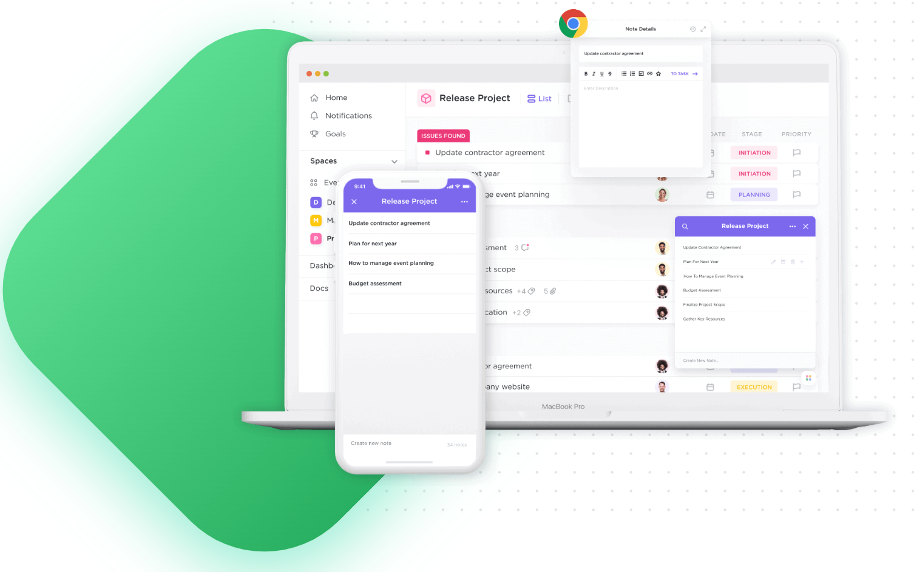

[ClickUp](https://clickup.com/features/notepad) is more than just a note-taking app; it's an all-in-one project management tool that aims to replace other productivity apps. With features for tasks, documents, goals, and even email, ClickUp is designed for teams and individuals looking to centralize their work in one place.

#### Pros:
  - Not just for note-taking; it's a comprehensive project management tool offering tasks, docs, goals, and more.
  - Highly customizable to fit various workflows and industries.
  - Offers robust collaboration features, including task assignments and comments.
#### Cons:
  - The vast array of features can be overwhelming for users looking for just a note-taking app.
  - Steeper learning curve compared to simpler apps.
#### Integration: Integrates with over 1,000 tools via Zapier, plus direct integrations with Google Calendar, Slack, GitHub, and others.
#### Pricing: Free tier available; paid plans offer additional features and start from a monthly fee per user.

### 5. Evernote

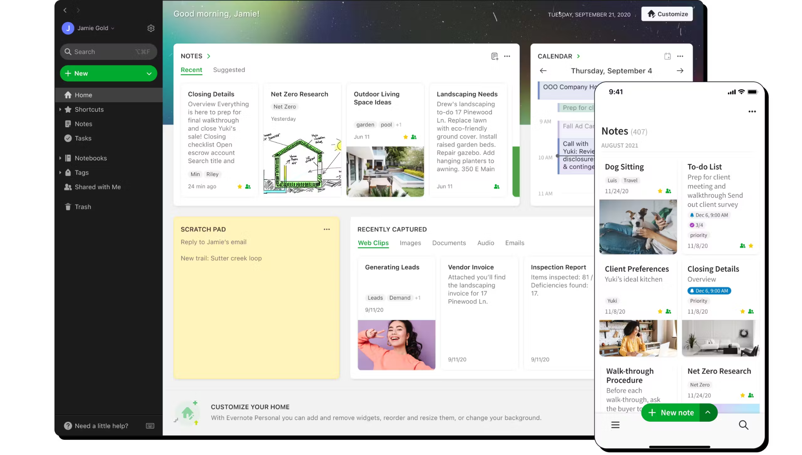

[Evernote](https://apps.apple.com/us/app/evernote/id406056744?mt=12) is a powerful note-taking app known for its robust organizational capabilities, allowing users to capture, organize, and find information across multiple platforms. It supports a wide variety of content types, from text and images to web clippings and audio recordings, making it a versatile tool for personal and professional use.

#### Pros:
  - Powerful search capabilities, including searching for text within images.
  - Rich organizational system with notebooks, tags, and stacks.
  - Cross-platform support ensures access to notes from any device.
#### Cons:
  - Free version is quite limited, pushing users towards paid plans.
  - Some users find the interface cluttered and the performance sluggish at times.
#### Integration: Integrates with Google Drive, Slack, Microsoft Teams, Salesforce, and many other productivity tools.
#### Pricing: Offers a basic free plan; Premium and Business plans are available at monthly or yearly subscriptions, adding more features and capacity.

### 6. Slite

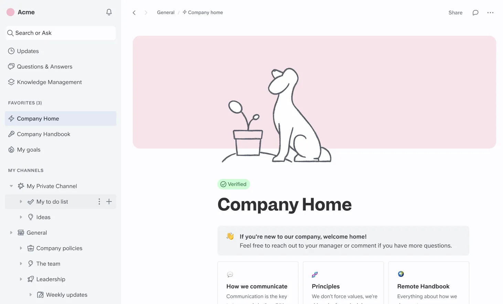

[Slite](https://slite.com/) is a collaborative note-taking and documentation app designed to help teams create, share, and manage their knowledge base and documents efficiently.

#### Pros:
- **Collaboration at Its Core**: Designed for team use, making it easy to share notes, collaborate in real-time, and keep everyone updated.
- **Structured Organization**: Offers channels and collections for organizing documents, which helps in managing large amounts of information.
- **Integration Friendly**: Integrates with popular tools like Slack, Google Drive, and Trello, enhancing workflow and productivity.

#### Cons:
- **Less Ideal for Individual Use**: Its features are team-oriented, which might be more than what's necessary for personal note-taking needs.
- **Limited Free Version**: The free version has restrictions on the number of documents and the amount of storage available.

#### Integration:
Slite integrates with several third-party apps including Slack, Trello, Asana, and Google Drive, making it a versatile tool for teams that use multiple platforms.

#### Pricing:
Slite offers a free plan with limited features. Paid plans start from a monthly fee per user, adding unlimited docs, advanced collaboration features, and more storage.

### 7. Notion

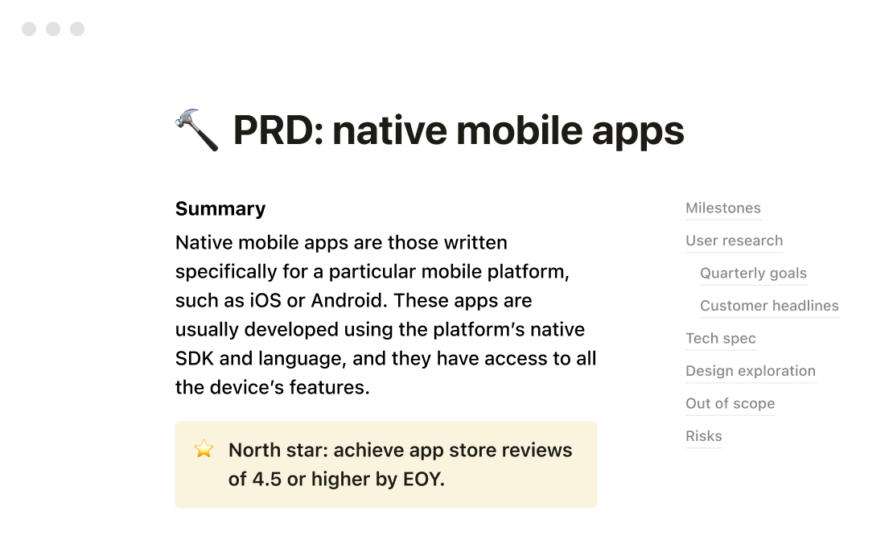

[Notion](https://www.notion.so/desktop) is a comprehensive workspace that combines notes, tasks, databases, and wikis to help users organize their work and personal life.

#### Pros:
- **Highly Customizable**: Users can create their own templates and use Notion for a wide range of purposes, from project management to personal journals.
- **All-in-One Tool**: Combines note-taking, task management, databases, and wikis in one app, reducing the need for multiple tools.
- **Extensive Integration Options**: Supports integration with tools like Slack, Google Drive, Trello, and more through third-party services like Zapier.

#### Cons:
- **Steep Learning Curve**: The vast array of features and customization options can be overwhelming for new users.
- **Performance Issues**: Some users report slow performance, especially with larger databases or when used extensively across many devices.

#### Integration:
Notion offers built-in integrations with apps like Slack, Google Calendar, and Google Drive, and can connect to hundreds more via Zapier.

#### Pricing:
Notion provides a free Personal plan with some limitations. Paid plans include Personal Pro, Team, and Enterprise options, with pricing based on the number of users and level of features needed.

### 8. Ulysses

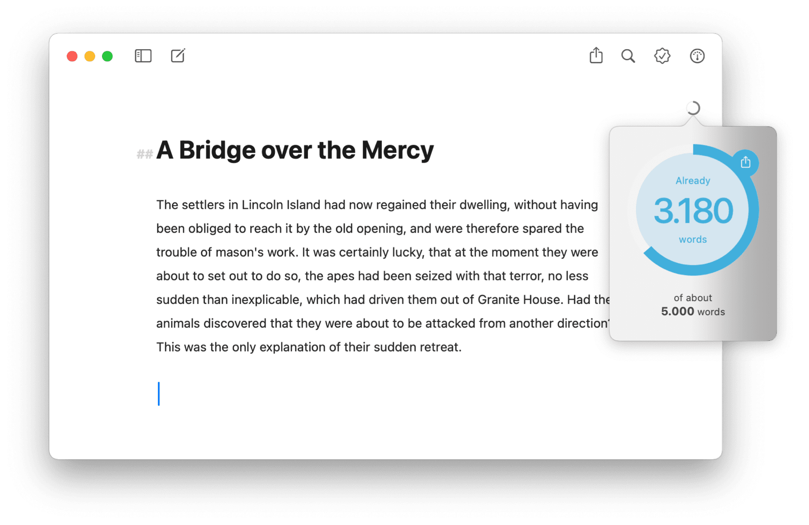

[Ulysses](https://ulysses.app/) is a writing app for Mac and iOS that targets writers, offering a distraction-free environment, document management, and publishing tools.

#### Pros:
- **Focused Writing Experience**: Minimalist interface that helps writers concentrate on their work.
- **Powerful Document Management**: Organize all your writing in one place, with features for tagging, filtering, and searching.
- **Publishing Tools**: Directly publish to platforms like WordPress and Medium from within the app.

#### Cons:
- **Platform Limitation**: Available only on macOS and iOS, limiting access for users on other platforms.
- **Subscription Model**: Unlike one-time purchase apps, Ulysses requires a subscription, which might not appeal to everyone.

#### Integration:
Ulysses offers direct integration with WordPress and Medium for publishing, along with iCloud sync for seamless working across Apple devices.

#### Pricing:
Ulysses operates on a subscription model, with monthly and yearly payment options. A free trial is available to test its features.

### 9. Obsidian

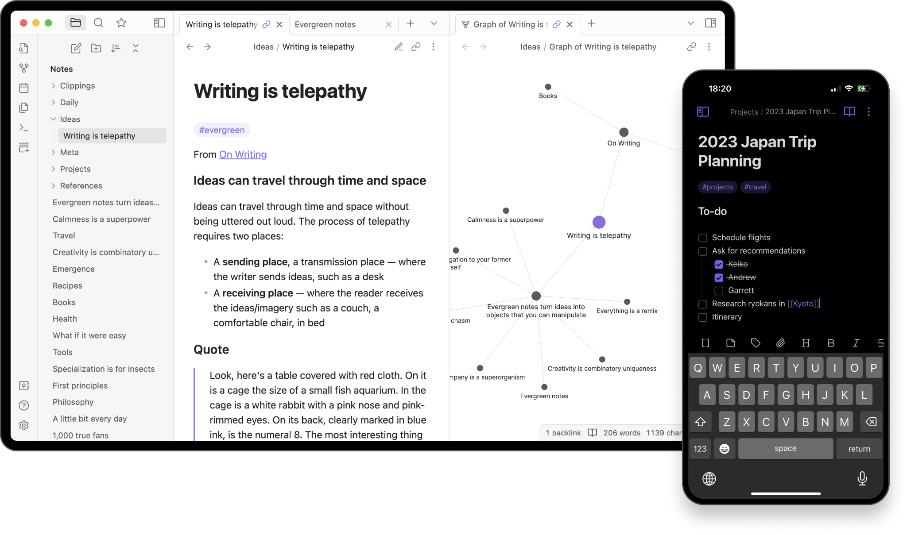

[Obsidian](https://apps.apple.com/us/app/obsidian-connected-notes/id1557175442) is a powerful markdown note-taking app that focuses on linking thoughts and building a knowledge base.

#### Pros:
- **Linking Ideas**: Features like backlinking and graph view help users see how their notes are interconnected, ideal for building a knowledge base.
- **Customization and Plugins**: Highly customizable with themes and plugins, allowing users to tailor their experience.
- **Local Storage**: Notes are stored locally for privacy and control over data.

#### Cons:
- **Learning Curve**: The array of features and markdown basis might be intimidating for non-technical users or those new to markdown.
- **No Built-in Sync or Collaboration**: While third-party plugins offer solutions, there's no built-in option for syncing or collaborating on notes.

#### Integration:
Obsidian's strong community has developed numerous plugins for additional functionality, though it lacks direct integrations with other productivity tools out of the box.

#### Pricing:
Obsidian offers a free version for personal use. Paid options include Catalyst (for early access to new features) and Obsidian Sync and Publish services for cloud storage and publishing notes online.

### 10. Logseq

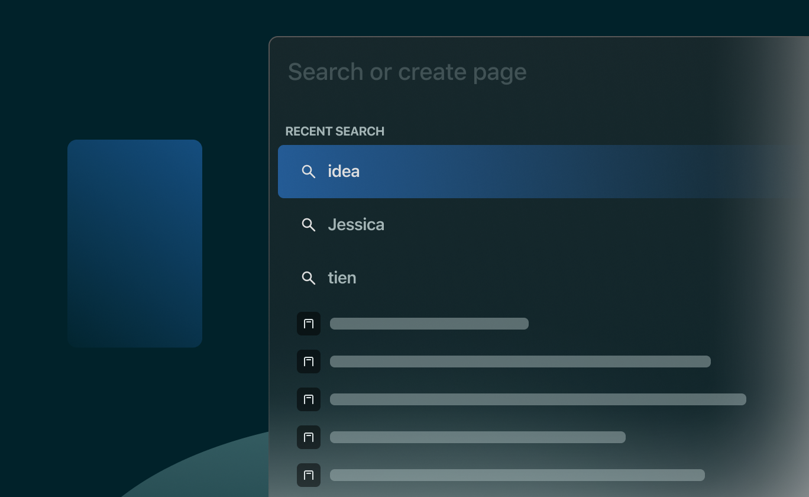

[Logseq](https://logseq.com/) is an open-source knowledge management and note-taking app that supports both outlining and Markdown, making it versatile for various types of note-taking and data organization.

#### Pros:
- **Open Source and Privacy-Focused**: Users have full control over their data, with local storage and no reliance on cloud servers.
- **Outlining and Markdown Support**: Flexible for different note-taking styles, supporting hierarchical organization and markdown formatting.
- **Plugin Ecosystem**: Though still growing, Logseq's plugin ecosystem allows for extending its functionality.

#### Cons:
- **User Interface**: Some users might find the interface less intuitive compared to more visually-oriented apps.
- **Early Development Stage**: Being relatively new and open-source, it may lack the polish and stability of more established apps.

#### Integration:
As an open-source platform, Logseq has a growing list of community-developed plugins for extended functionality but lacks direct integration with major productivity tools.

#### Pricing:
Logseq is completely free to use, emphasizing its commitment to privacy and open-source principles.

### 11. Joplin

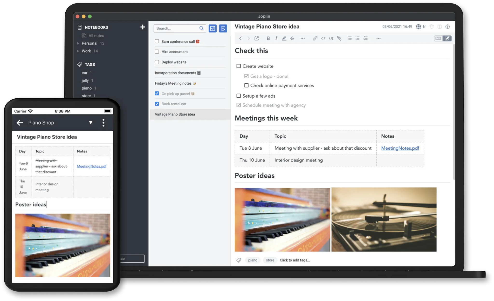

[Joplin](https://joplinapp.org/) is a free, open-source note-taking and to-do application that supports markdown editing and offers synchronization with various cloud services.

#### Pros:
- **Open Source and Free**: Ensures transparency and allows for community contributions.
- **Cross-Platform**: Available on Windows, macOS, Linux, Android, and iOS.
- **End-to-End Encryption**: Offers privacy and security for your data during synchronization.
- **Extensive Synchronization Options**: Supports Nextcloud, Dropbox, OneDrive, and WebDAV.
- **Markdown Support**: Ideal for those who prefer markdown for formatting their notes.

#### Cons:
- **User Interface**: Some users may find the interface less intuitive or visually appealing compared to other note-taking apps.
- **Learning Curve**: Markdown and the overall functionality might require an adjustment period for new users.

#### Integration:
Joplin offers integration with external storage services for synchronization but has limited direct integration with other productivity tools.

#### Pricing:
Joplin is completely free to use.

### 12. UPDF for Mac

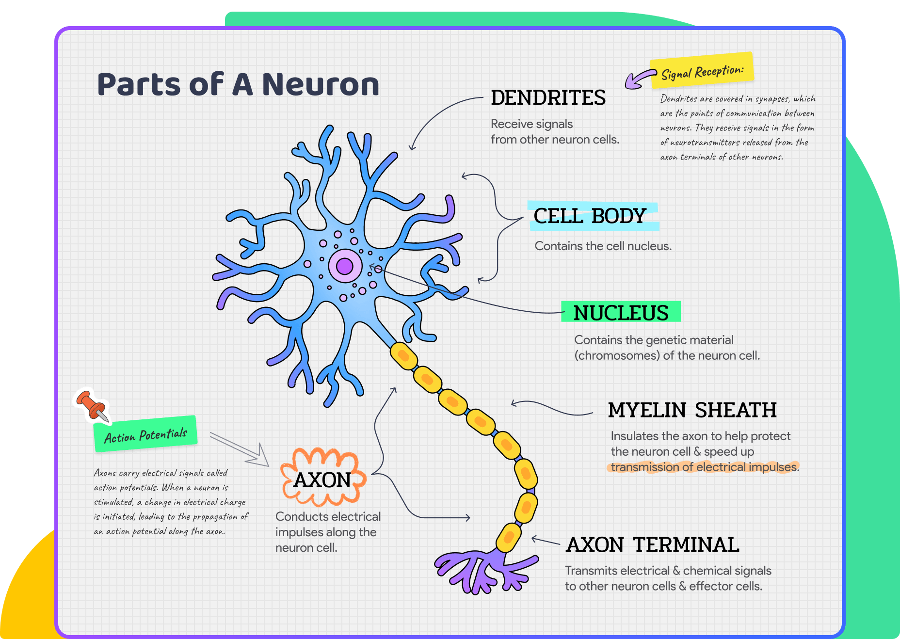

[UPDF for Mac](https://updf.com/) is a PDF editor for Mac known for its annotation and note-taking capabilities, offering a user-friendly interface for working with PDF documents.

#### Pros:
- **Comprehensive PDF Tools**: Not just for note-taking and annotation, UPDF also allows for editing, converting, and organizing PDF files.
- **Intuitive Interface**: Designed to be easy to navigate, making PDF editing and annotation straightforward.
- **High-Quality Annotation Tools**: Offers a variety of annotation tools, including highlights, underlines, and notes.

#### Cons:
- **Limited to PDFs**: Focused solely on PDF files, which might require a separate app for other note-taking needs.
- **Pricing**: While offering powerful features, the cost might be a consideration for those looking for a free tool.

#### Integration:
Primarily a standalone application for managing PDFs, with limited integration with other productivity tools.

#### Pricing:
UPDF offers a free trial, with pricing for the full version available on their website.

### 13. Goodnotes

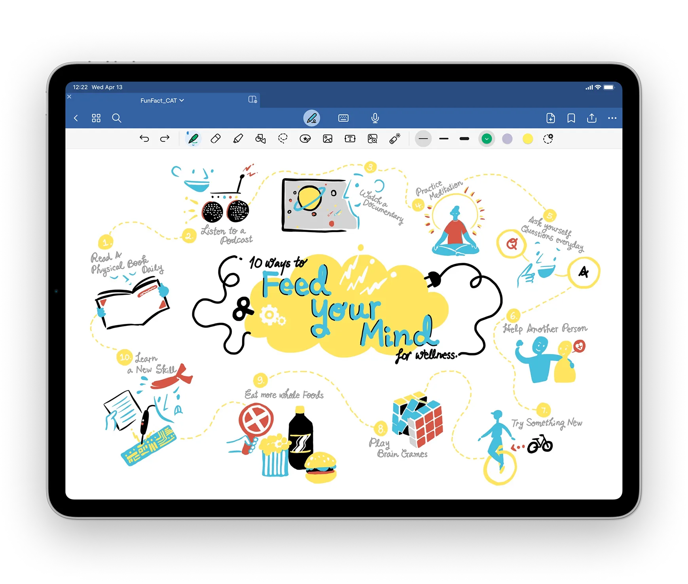

[Goodnotes](https://apps.apple.com/us/app/goodnotes-6/id1444383602) is a popular note-taking app for iOS and macOS, known for its digital handwriting recognition and a wide range of paper styles.

#### Pros:
- **Handwriting Recognition**: Converts handwritten notes to text, making them searchable.
- **Digital Paper**: Offers a variety of paper types and templates for different needs.
- **Sync Across Devices**: Available on iOS and macOS, allowing for seamless work across Apple devices.
- **PDF Annotation**: Supports importing and annotating PDFs.

#### Cons:
- **Platform Limitation**: Limited to Apple's ecosystem, which excludes Windows and Android users.
- **Cost**: Unlike some note-taking apps, Goodnotes is a paid application.

#### Integration:
Integrates with iCloud for syncing across devices but has limited third-party integrations.

#### Pricing:
Goodnotes is available for a one-time purchase price, with no subscription fees.

### 14. Simplenote

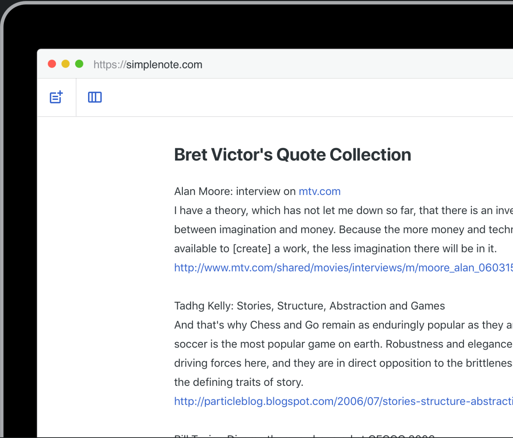

[Simplenote](https://apps.apple.com/us/app/simplenote-notes-and-memos/id692867256?mt=12) is a minimalist note-taking app focused on speed and efficiency, offering a clean interface for quickly capturing ideas on multiple platforms.

#### Pros:
- **Simplicity and Speed**: The user interface is uncluttered, making it quick and easy to take notes.
- **Cross-Platform**: Available on iOS, Android, macOS, Windows, and Linux.
- **Free to Use**: Simplenote is completely free, with no premium plans.
- **Markdown Support**: Offers markdown support for those who prefer it for formatting.

#### Cons:
- **Limited Features**: Lacks the extensive organizational tools and multimedia support found in more comprehensive note-taking apps.
- **No Multimedia Support**: Focuses on text notes, so you can't add images or other media types directly to your notes.

#### Integration:
Simplenote's primary focus is on note-taking, offering limited integration with other productivity tools. It does offer syncing across all platforms where it's available.

#### Pricing:
Simplenote is entirely free to use.

### 15. Google Keep

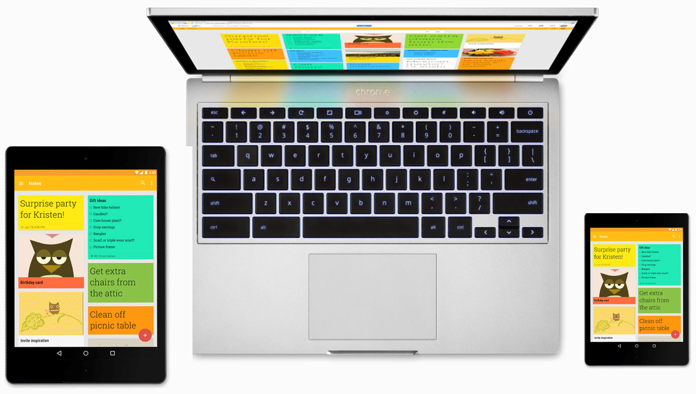

[Google Keep](https://apps.apple.com/us/app/google-keep-notes-and-lists/id1029207872) is a note-taking service developed by Google, offering a simple interface for capturing quick notes, lists, and reminders, well-integrated with the Google ecosystem.

#### Pros:
- **Integration with Google Ecosystem**: Seamless integration with other Google services like Docs, Calendar, and Gmail.
- **Cross-Platform Accessibility**: Available on web, iOS, and Android, ensuring access to notes from any device.
- **Simple and Intuitive**: The user interface is straightforward, making it easy to quickly capture thoughts and organize them with labels and colors.
- **Voice Notes and Image Recognition**: Offers the ability to take voice notes and transcribe them automatically. It can also recognize text in images using OCR (Optical Character Recognition).

#### Cons:
- **Limited Organizational Tools**: While labels and colors help organize notes, users looking for more in-depth features such as folders or tagging might find it lacking.
- **Basic Formatting Options**: The simplicity of Google Keep means that formatting options for notes are limited compared to more feature-rich note-taking apps.

#### Integration:
Deeply integrated with Google Workspace, allowing for easy sharing and collaboration within the Google ecosystem.

#### Pricing:
Free to use, with storage shared across Google Drive.

### 16. NotePlan

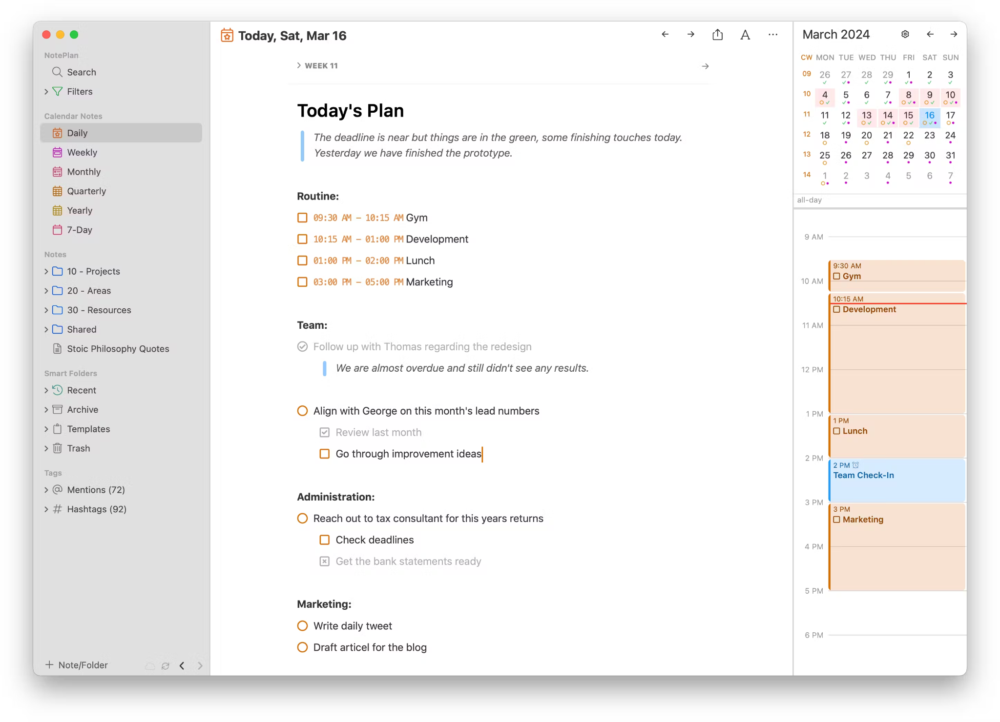

[NotePlan](https://noteplan.co/) is designed for those who want to combine their notes, tasks, and calendar in one place, offering Markdown support and a daily planning approach.

#### Pros:
- **All-in-One Planning**: Combines calendars, to-dos, and notes, allowing users to manage their schedule and tasks alongside their notes.
- **Markdown Support**: Notes and tasks can be written and formatted using Markdown, providing flexibility and efficiency in organizing content.
- **Calendar Integration**: Integrates with Apple's Calendar and Reminders, syncing existing appointments and reminders into the app for comprehensive planning.

#### Cons:
- **Learning Curve**: The combination of notes, tasks, and calendar features, alongside Markdown, might require some time to get used to.
- **Platform Availability**: Primarily available on macOS and iOS, limiting access for users on other platforms.

#### Integration:
Integrates with iCloud for syncing across Apple devices and connects with Apple's Calendar and Reminders for a unified planning experience.

#### Pricing:
Offers a free trial, with a subscription model for continued use. Pricing details are available on the NotePlan website.

### 17. MarginNote

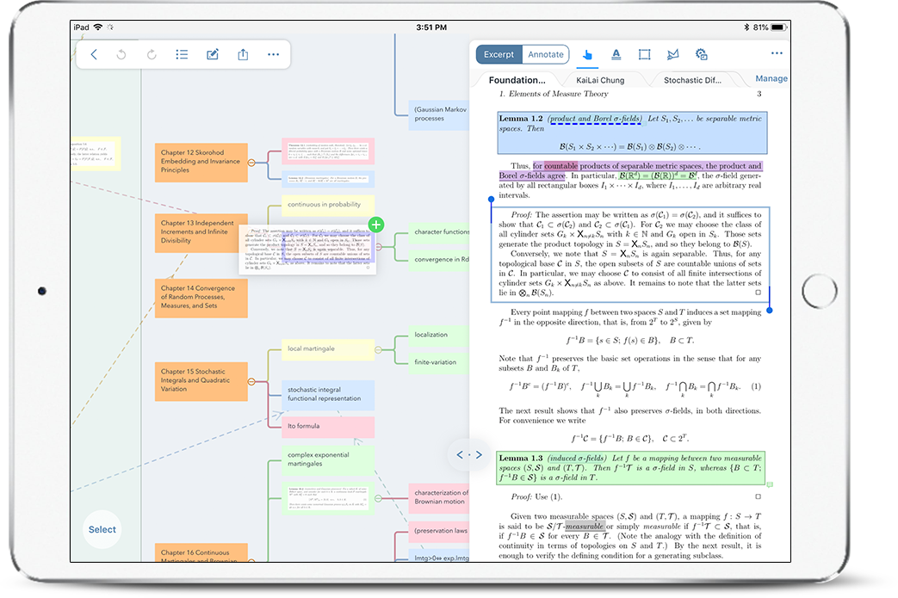

[MarginNote](https://apps.apple.com/us/app/marginnote-3/id1423522373?mt=12) is a powerful tool for students, academics, and anyone engaged in extensive reading and note-taking, especially on PDFs and EPUBs, offering mind mapping, flashcards, and organizing capabilities.

#### Pros:
- **Comprehensive Reading and Note-Taking Tool**: Allows for annotation, mind mapping, and flashcard creation directly from reading materials.
- **Organizational Features**: Users can organize notes and books into projects, making it easier to manage study materials.
- **Interactive Learning**: The combination of mind maps, flashcards, and annotations promotes active learning and better information retention.

#### Cons:
- **Complexity**: With its wide range of features, there can be a significant learning curve for new users.
- **Price**: Compared to some other note-taking and study apps, MarginNotes can be on the pricier side, especially for students.

#### Integration:
Offers some level of document import and export compatibility but is largely designed as a standalone learning environment.

#### Pricing:
MarginNote offers a free trial with limited features. Full features are unlocked with a one-time purchase, and pricing details are available on the MarginNotes website and App Store.

## Key features to look for the best note-taking app for your needs?

- **Cross-Platform Accessibility**: If you use multiple devices across different operating systems, look for an app that syncs your notes seamlessly across all platforms.
- **Collaboration Tools**: For team projects, select an app that allows for real-time editing and sharing, such as Notion or Microsoft OneNote.
- **Organization Capabilities**: Consider how each app allows you to organize notes—through folders, tags, or notebooks—and choose one that matches your organizational preferences.
- **Multimedia Support**: If you often include images, audio, or other media in your notes, ensure the app supports these formats.
- **Privacy and Security**: For sensitive information, look for apps offering robust security measures like end-to-end encryption.

## Recommended note-taking apps for different roles

### For Free Note-Taking:
- **Microsoft OneNote**: A versatile, free note-taking app that offers extensive organizational features, making it ideal for students, professionals, and anyone in between. Its ability to integrate with the Microsoft ecosystem enhances its utility for users reliant on Windows and Office products.

### For Apple Users:
- **Apple Notes**: Apple's native note-taking app is perfectly suited for users deeply integrated into the Apple ecosystem. It offers seamless synchronization across all Apple devices, simplicity in design, and sufficient features for everyday note capture and organization.

### For Google Power Users:
- **Google Keep**: Known for its simplicity and integration with the Google ecosystem, Google Keep is the go-to for quick note-taking, reminders, and to-do lists for users who rely heavily on Google services.

### For Collaboration:
- **Notion**: Offers a highly customizable workspace for notes, tasks, databases, and more, making it an excellent choice for teams and individuals looking for a collaborative environment. Its ability to replace multiple tools with one unified platform makes it particularly appealing for project management and team collaboration.

### For Keeping All Notes Organized:
- **Microsoft OneNote**: Stands out for its organizational capabilities, especially for users looking for a digital binder-like experience. Its flexibility and compatibility across different platforms make it a solid choice for keeping all types of notes well-organized.

### For Students:
- **Evernote**: With features like web clipping, multimedia note support, and rich text formatting, Evernote is a comprehensive solution that suits the diverse needs of students. Whether it's organizing research, lecture notes, or syncing across devices, Evernote offers the versatility required for academic use.

### For Markdown Lovers:
- **Obsidian**: Ideal for users who prefer markdown for their notes and appreciate linking ideas and building a knowledge base. Obsidian's unique approach to note-taking, focusing on connections between notes, makes it perfect for writers, researchers, and anyone interested in a non-linear organization of their thoughts.

### For Project Management:
- **ClickUp**: Not just a note-taking app, ClickUp is an all-in-one project management tool that includes features for task assignment, scheduling, and document management. It's best suited for teams and businesses looking to streamline productivity and collaboration.

