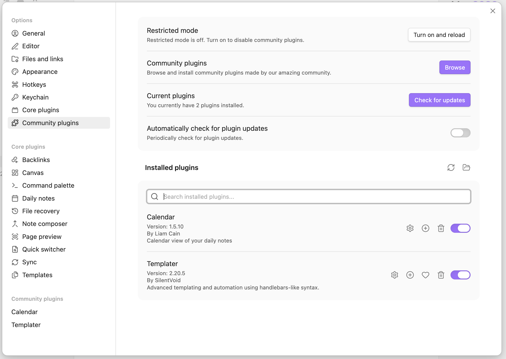

The first time I opened the Obsidian plugin marketplace, I saw over 1,000 plugins and was completely overwhelmed.

Which one is right for me? Which one is most important? Where should I start?

I ended up installing 20 plugins, and after using them for a week, I discovered: only 3 were actually being used, and the rest were just slowing things down.

After 2 years of installing and uninstalling, uninstalling and reinstalling, I finally figured out which plugins beginners should start with.

**Too many plugins is actually a burden**. As a beginner, you don't need to install many plugins. What you need is 5-8 carefully selected, easy-to-use plugins that can immediately improve your experience.

Whether you've just [installed Obsidian](https://chloevolution.com/posts/how-to-install-obsidian/) or have installed a bunch of plugins but don't know which ones to keep, this article can help you.


## Why Do Beginners Need Plugins?

### Limitations of Obsidian's Core Features

Obsidian itself is just a Markdown editor.

Yes, it's powerful. Bidirectional links, graph view, local storage—these are all great. But if you only use the core features, you'll find:

- **No calendar view** - You can't see which days have notes
- **Template functionality is too basic** - Can't insert dynamic dates, can't automate
- **Table editing is painful** - Manual alignment, adding rows and columns is troublesome
- **No task management** - Only simple checkboxes
- **No drawing tools** - Need external tools to draw flowcharts

This is why almost every Obsidian user installs plugins.

### How Plugins Enhance the Beginner Experience

Plugins can transform Obsidian from "okay" to "can't live without it."

**Immediate impact**:
- Install Calendar, instantly get a calendar view, see at a glance which days have notes
- Install Templater, templates become smart, can automatically insert current date
- Install Advanced Tables, table editing becomes 10x easier, automatic alignment

**Simplified operations**:
- Install Paste URL into Selection, creating links goes from 3 steps to 1 step
- Install Kanban, task management becomes visual
- Install Excalidraw, draw without leaving Obsidian

These plugins all have one thing in common: **simple and easy to use, work right after installation, no complex configuration needed**.

### How Many Plugins Should Beginners Install?

My recommendation: **Start with 5, maximum 10**.

Why isn't more better?

**Problems with installing too many**:
- Slows down startup speed
- Plugins may conflict with each other
- Increases learning cost
- Most won't be used

**The right strategy**:
1. First install 3 essential plugins
2. Use for 1-2 weeks, feel the change
3. Then install other plugins as needed
4. Install one at a time, use for 2 weeks before deciding whether to keep
5. Regularly review and delete unused ones

Remember: **Less is more, quality > quantity**.

10 plugins you actually use are 100 times better than 50 installed but unused plugins.


## How to Choose Plugins Suitable for Beginners?

Not all plugins are suitable for beginners.

Some plugins are powerful but have a steep learning curve. Some plugins have duplicate functions and just add confusion. Some plugins are unstable and may cause problems.

So, what kind of plugins are suitable for beginners? I've summarized 4 criteria.

### Criterion 1: Simple and Easy to Use

**Good beginner plugins should**:
- Work right after installation, no complex configuration needed
- Intuitive interface, easy to understand at a glance
- No need to learn new syntax or commands

**For example**:

**Calendar** ✅ Suitable for beginners
- Automatically displays in the right sidebar after installation
- Click on a date to create a note
- No configuration needed

**Dataview** ❌ Not suitable for beginners
- Need to learn SQL-like query language
- Need to understand YAML frontmatter
- Need to write code to use

See the difference? Calendar works right after installation, Dataview requires learning. As a beginner, prioritize the former.

### Criterion 2: Immediate Effect

**Good beginner plugins should**:
- Show results immediately after installation
- Solve obvious pain points
- No waiting or accumulation needed

**For example**:

**Advanced Tables** ✅ Immediate effect
- After installation, tables automatically align
- Tab key jumps between cells
- Immediately feel table editing is easier

**Dataview** ❌ Requires accumulation
- Need to add metadata to notes first
- Need to accumulate a certain number of notes
- Takes time to see value

Beginners need plugins that "feel great right after installation," not "feel great after long-term use."

### Criterion 3: Stable and Reliable

**Good beginner plugins should**:
- High download count (at least 10,000+)
- Actively maintained (updated within the last 3 months)
- Good rating (4 stars or above)
- Won't cause problems or conflicts

**How to judge**:
1. Check download count in the plugin marketplace
2. Check last update time
3. Read user reviews
4. Look at the number of GitHub issues

**My recommendations**:
- Prioritize plugins with over 100,000 downloads
- Avoid plugins not updated for over 6 months
- If many reviews mention bugs, don't install

### Criterion 4: Actually Needed

This is the most important criterion.

**Ask yourself 3 questions**:

**1. Do I really need this feature?**
- If the answer is "might be useful," don't install yet
- If the answer is "definitely need it," then install

**2. Will I use it often?**
- If you won't use it once a week, don't install
- Only install what you'll use frequently

**3. Will I be inconvenienced without it?**
- If it doesn't matter without it, don't install
- Only install those that "you'll miss if you don't have"

**For example**:

When I first started using Obsidian, I saw Excalidraw looked cool and installed it. I didn't use it once for 3 months because I didn't need to draw at all.

Later I deleted it. Now that I need to draw, I installed it again.

**Remember**: Don't install just because "it looks cool." Only install what you truly need.


## 5-8 Best Plugins for Beginners

Now for the main point: which plugins do I recommend?

I've divided them into 3 levels:

- **Essential (3)**: Must-install for beginners, can immediately improve experience
- **Highly Recommended (3)**: Very useful, but not essential
- **Optional (2)**: Suitable for beginners with specific needs

### Essential Plugin #1: Calendar

**One-sentence introduction**: Adds calendar view to Obsidian, works perfectly with Daily Notes.

**Why recommended for beginners**:

This is the first plugin I think beginners must install.

- **Simplest**: Automatically displays in right sidebar after installation, no configuration needed
- **Most intuitive**: See at a glance which days have notes, dates with notes have dot markers
- **Most practical**: Click on a date to create/open Daily Note, no need to manually enter date
- **Most popular**: 4 million+ downloads, almost everyone installs it

**What problems does it solve**:

If you use [Daily Notes](https://chloevolution.com/posts/obsidian-daily-notes/) for journaling or daily records, not having Calendar is very inconvenient:
- Can't see which days have notes
- Creating Daily Notes requires manually entering the date
- Want to review past notes, have to search through folders

Installing Calendar solves all these problems.

**How to install**:

1. Open Settings
2. Click "Community plugins" on the left
3. Click the "Browse" button
4. Search for "Calendar"
5. Click "Install," then click "Enable"

**Basic usage**:

After installation, Calendar automatically displays in the right sidebar.

- **Create today's note**: Click on today's date
- **Open past notes**: Click on dates with dots
- **See which days have notes**: Dates with notes have dot markers
- **Quick navigation**: Click any date to quickly jump


### Essential Plugin #2: Templater

**One-sentence introduction**: Smart template tool, 100 times more powerful than the core Templates plugin.

**Why recommended for beginners**:

If you've used the core Templates plugin, you'll find it too basic. Templater is an enhanced version of Templates.

- **More powerful**: Can insert dynamic dates, times, filenames
- **More flexible**: Can run JavaScript code (don't worry, simple functions don't require writing code)
- **Gentle learning curve**: Start with simple date insertion, gradually learn advanced features
- **Good community support**: Detailed documentation, rich examples

**What problems does it solve**:

Core Templates can only insert static content. But you often need to:
- Insert current date in [templates](https://chloevolution.com/posts/obsidian-templates/)
- Automatically generate filenames
- Display different content based on different situations

Templater can do all of this.

**How to install**:

1. Settings → Community plugins → Browse
2. Search for "Templater"
3. Install → Enable
4. In Templater settings, specify template folder path


**Basic usage**:

Create a template file, for example `meeting-template.md`:

```markdown
# Meeting Notes - <% tp.date.now("YYYY-MM-DD") %>

**Time**: <% tp.date.now("HH:mm") %>
**Participants**:

## Discussion Content

## Action Items

## Next Meeting
```

When using the template, `<% tp.date.now() %>` will automatically be replaced with the current date and time.

**Usage tips**:

- **Start simple**: First learn to insert dates, take it slow with other features
- **Check examples**: Official documentation has many practical template examples
- **Set hotkeys**: Can set hotkeys to quickly insert templates

**Common Templater commands**:
- `<% tp.date.now() %>` - Current date
- `<% tp.file.title %>` - Filename
- `<% tp.date.tomorrow() %>` - Tomorrow's date


### Essential Plugin #3: Advanced Tables

**One-sentence introduction**: Makes Markdown table editing easy, with automatic alignment and formatting.

**Why recommended for beginners**:

If you've edited tables in Obsidian, you know how painful it is.

Manual alignment, adding rows and columns, adjusting format... every time you have to be careful, one mistake and it's a mess.

Advanced Tables solves the biggest pain point of Markdown table editing.

- **Automatic alignment**: No manual adjustment needed, tables automatically align
- **Hotkey operations**: Tab key jumps to next cell, Enter key creates new row
- **Smart formatting**: Automatically adds separators, keeps format neat
- **Improves efficiency**: Table editing efficiency increases 10x

**What problems does it solve**:

Pain points of Markdown table editing:
- Manual alignment is time-consuming
- Adding rows and columns is troublesome
- Tables get messy when there are many
- Easy to make mistakes when editing

**How to install**:

1. Settings → Community plugins → Browse
2. Search for "Advanced Tables"
3. Install → Enable

**Basic usage**:

Create a table:

```markdown
| Name | Age | City |
|------|-----|------|
| Zhang San | 25 | Beijing |
```

Place cursor inside the table, then:
- **Tab key**: Jump to next cell
- **Shift + Tab**: Jump to previous cell
- **Enter key**: Create new row
- **Auto-align**: Automatically aligns after entering content

**Usage tips**:

- Hotkeys work inside tables, won't trigger outside tables
- Can set table style (left align, right align, center)
- Supports table sorting function


### Highly Recommended #1: Kanban

**One-sentence introduction**: Kanban-style task management, visualize your to-do items.

**Why recommended for beginners**:

If you need to manage tasks or projects, Kanban is the most intuitive way.

- **Visual**: Task status at a glance
- **Drag and drop**: Intuitive and easy to use, no learning needed
- **No complex configuration**: Create board, add cards, ready to use
- **Suitable for various scenarios**: Task management, project management, content creation workflow

**What problems does it solve**:

Plain text task lists have these problems:
- Too many tasks, can't see priorities clearly
- Can't see task status (to-do, in progress, completed)
- Lacks visualization, not intuitive enough

**How to install**:

1. Settings → Community plugins → Browse
2. Search for "Kanban"
3. Install → Enable

**Basic usage**:

1. Create a new note, for example `Project Management.md`
2. Click the Kanban icon in the left sidebar, or use command palette
3. Create columns (e.g., To Do, In Progress, Done)
4. Add cards (tasks)
5. Drag cards between columns

**Usage tips**:

- Can add tags and dates to cards
- Can archive completed tasks
- Can embed images in cards
- Supports Markdown format

**My experience**:

I use Kanban to manage my writing workflow: Ideas → Drafting → Editing → Published. Each article is a card, dragging to different columns represents different states.


### Highly Recommended #2: Excalidraw

**One-sentence introduction**: Hand-drawn style diagram tool, draw directly in Obsidian.

**Why recommended for beginners**:

Sometimes, text is not as intuitive as diagrams.

- **No need to learn complex drawing software**: Simple interface, toolbar at a glance
- **Hand-drawn style**: Visually friendly, not too formal
- **Can link to notes**: Drawings can link to other notes
- **Suitable for quick sketches**: Flowcharts, mind maps, architecture diagrams can all be drawn

**What problems does it solve**:

- Want to draw but don't want to use external tools
- Need flowcharts, mind maps to organize ideas
- Want to visualize complex concepts
- Need quick sketches to record inspiration

**How to install**:

1. Settings → Community plugins → Browse
2. Search for "Excalidraw"
3. Install → Enable

**Basic usage**:

1. Create Excalidraw note (search "Excalidraw" in command palette)
2. Use toolbar to draw:
   - Rectangles, circles, arrows
   - Text, lines
   - Freehand pen
3. After completion, can export as PNG or embed in notes

**Usage tips**:

- Use hotkeys to improve efficiency (R=rectangle, C=circle, A=arrow)
- Can link to other notes (create clickable elements)
- Supports multiple export formats
- Can set canvas background color

### Highly Recommended #3: Paste URL into Selection

**One-sentence introduction**: Select text, paste URL, automatically create Markdown link.

**Why recommended for beginners**:

This plugin is super simple but super useful.

- **No learning curve**: Works right after installation
- **Saves tons of time**: Creating links goes from 3 steps to 1 step
- **Intuitive**: Just like adding links in Word
- **Improves efficiency**: Especially suitable for organizing web bookmarks and citing materials

**What problems does it solve**:

Creating links in Markdown is troublesome:
1. Have to remember `[text](url)` syntax
2. Have to enter text first, then add link
3. Easy to make mistakes

**How to install**:

1. Settings → Community plugins → Browse
2. Search for "Paste URL into Selection"
3. Install → Enable

**Basic usage**:

Super simple, just 3 steps:

1. **Select text**: For example "Obsidian Official Website"
2. **Copy URL**: Copy https://obsidian.md
3. **Paste**: Press Ctrl/Cmd + V

Automatically becomes: `[Obsidian Official Website](https://obsidian.md)`

**Usage tips**:

- Suitable for organizing web bookmarks
- Suitable for citing source materials
- Greatly improves link adding efficiency
- Can also be used for internal links


### Optional Plugin #1: Linter

**One-sentence introduction**: Automatically format notes, maintain consistency.

**Why recommended**:

If your note format is inconsistent, or you've imported notes from other tools, Linter can help you automatically organize them.

- Automatically fix format issues
- Unify heading format
- Clean up extra blank lines
- Correct spelling errors

**When needed**:

- Your note format is inconsistent
- You imported notes from Notion, Evernote, etc.
- You want automated format organization
- You have some Markdown foundation

**How to install**:

Settings → Community plugins → Browse → "Linter"

**Usage tips**:

- Need to configure rules (can use default rules)
- Recommend understanding Markdown format standards first
- Can set to run automatically on save
- Suitable for beginners with some foundation


### Optional Plugin #2: Editor Syntax Highlight

**One-sentence introduction**: Code block syntax highlighting, improves code readability.

**Why recommended**:

If you record code in your notes, this plugin can make code more readable.

- Improves code readability
- Supports multiple programming languages
- Lightweight, doesn't affect performance
- Works automatically after installation

**When needed**:

- You record code in notes
- You're a technical user or programmer
- You need better code reading experience
- You take notes while learning programming

**How to install**:

Settings → Community plugins → Browse → "Editor Syntax Highlight"

**Usage tips**:

- Works automatically after installation, no configuration needed
- Supports most programming languages
- Can customize color themes
- Only works in code blocks, doesn't affect plain text


## Plugins Beginners Should Avoid

After recommending plugins suitable for beginners, I also want to tell you: which plugins are not suitable for beginners.

It's not that these plugins are bad, but they're too complex, too advanced, or prone to causing problems for beginners.

### Too Complex: Dataview

**Why not recommended for beginners**:

Dataview is one of the most powerful Obsidian plugins, but it's really not suitable for beginners.

- **Need to learn SQL-like query language**: You have to write code to use it
- **Need to understand YAML frontmatter**: Have to add metadata to notes
- **Steep learning curve**: Beginners might take weeks to get started
- **Requires accumulation**: Need a certain number of notes to see value

**For example**:

Using Dataview to query all notes tagged "work":

```dataview
TABLE file.ctime as "Creation Time"
FROM #work
SORT file.ctime DESC
```

See? You need to learn this query syntax. For beginners, this is too difficult.

**When to reconsider**:

- You've been using Obsidian for over 3 months
- You have lots of notes (at least 100+)
- You need complex queries and statistics
- You're willing to spend time learning

**Beginner alternatives**:

- Use core Search function
- Use tags to filter notes
- Use folders to organize notes
- These are sufficient for beginners

### Plugins with Duplicate Functions

**Don't install multiple task management plugins at once**

I've seen people install simultaneously:
- Kanban
- Tasks
- Checklist
- Day Planner

The result? Use each a little, none used well, and end up confused.

**Why not do this**:

- **Duplicate functions**: They all do task management
- **Causes confusion**: Don't know which one to use
- **Increases learning cost**: Have to learn each one
- **May conflict**: Plugins might be incompatible

**The right approach**:

1. Choose one task management plugin (I recommend Kanban)
2. Use for 2 weeks, get familiar with it
3. If not satisfied, switch to another
4. Don't install multiple at once

**Same principle applies to**:

- Don't install multiple calendar plugins
- Don't install multiple template plugins
- Don't install multiple drawing plugins

Remember: **One function, one plugin**.

### Unstable Plugins

**How to judge if a plugin is stable**:

Before installing plugins, check these indicators:

**1. Download count**
- Below 1,000: May be unstable
- 1,000-10,000: Need caution
- 10,000+: Usually reliable
- 100,000+: Very reliable

**2. Last update time**
- Not updated for over 6 months: May be abandoned
- 3-6 months: Need attention
- Updated within last 3 months: Actively maintained

**3. Rating and reviews**
- Rating below 3 stars: Has problems
- Many reviews mention bugs: Don't install
- Reviews mention conflicts with other plugins: Be cautious

**4. GitHub issues**
- Many unresolved issues: May have problems
- Issues with no response for long time: May be abandoned

**Risks**:

Installing unstable plugins may cause:
- Obsidian crashes
- Note loss or corruption
- Conflicts with other plugins
- Waste time troubleshooting

### Over-customized Plugins

**What are over-customized plugins**:

Some plugins have dozens of setting options and require extensive configuration to use.

**Why not suitable for beginners**:

- **Complex configuration**: Just setting up takes a long time
- **Decision paralysis**: Don't know how to configure
- **Easy to make mistakes**: Wrong configuration may not work
- **High learning cost**: Have to understand what each option does

**For example**:

Some plugin settings pages have:
- 20+ toggle options
- 10+ text input boxes
- 5+ dropdown menus
- Plus advanced settings, custom CSS, etc.

For beginners, this is too overwhelming.

**Beginners should choose**:

- Plugins that work right after installation
- Plugins with good default settings
- Plugins with few setting options
- Plugins with "recommended configuration"

Install fewer, but actually use each one—that's the right strategy.


## Plugin Installation and Management Guide

Now that you know which plugins to install, let me teach you how to install and manage them.

If this is your first time installing plugins, follow this guide step by step, and you won't go wrong.

### How to Enable Community Plugins

Before installing any community plugins, you need to enable the community plugins feature first.

**First-time enabling steps**:

1. Open Obsidian
2. Click the settings icon in the lower left corner (gear icon)
3. Find "Community plugins" in the left menu
4. You'll see a security warning
5. Click the "Turn on community plugins" button
6. Read the risk notice and click confirm

**Security notice**:

Obsidian will display this warning:

> Community plugins are created by third-party developers, not officially by Obsidian. These plugins can access your file system and network. Please only install plugins you trust.

This warning is important. Remember:
- Only install plugins with high download counts
- Only install plugins you truly need
- Regularly check and clean up plugins

To learn more about community plugins, check out the [Obsidian Official Plugin Documentation](https://help.obsidian.md/Extending+Obsidian/Community+plugins).

After enabling, you can start installing plugins.

### How to Install Plugins

**Installation steps** (using Calendar as example):

1. **Open plugin marketplace**
   - Settings → Community plugins
   - Click "Browse" button

2. **Search for plugin**
   - Enter "Calendar" in search box
   - Can see search results list

3. **View plugin details**
   - Click plugin name
   - View plugin description, author, download count
   - Check last update time
   - Read user reviews

4. **Install plugin**
   - Click "Install" button
   - Wait for installation to complete (usually a few seconds)

5. **Enable plugin**
   - After installation completes, click "Enable" button
   - Plugin starts working

### How to Update Plugins

Plugins are constantly updated, adding new features or fixing bugs. Regularly updating plugins is important.

**Update steps**:

1. Settings → Community plugins
2. Click "Check for updates" button
3. If updates available, will show "Update" button
4. Click "Update" to update individual plugin
5. Or click "Update all" to update all plugins

**Update recommendations**:

- **Check once a week**: Develop habit of regular checking
- **Read update logs**: Understand new features and changes
- **Test important plugins first**: Test after updating to see if working normally
- **Don't skip updates**: Updates usually include bug fixes and security patches

**If problems occur after update**:

1. First disable plugin, see if problem disappears
2. If it's a plugin problem, can report on GitHub
3. Or temporarily roll back to old version (requires manual operation)

### How to Disable and Delete Plugins

If you find a plugin is no longer needed, or want to temporarily disable it, it's simple.

**Disable plugin**:

1. Settings → Community plugins
2. Find the plugin to disable in installed plugins list
3. Click the switch next to the plugin to turn it off
4. Plugin immediately stops working, but won't be deleted

**Delete plugin**:

1. First disable plugin (turn off switch)
2. Click trash can icon next to plugin
3. Confirm deletion
4. Plugin is completely deleted

**My recommendations**:

- **Disable first, then delete**: Disable for a few days, confirm not needed before deleting
- **Don't delete too many at once**: Delete one at a time, observe if there's any impact
- **Regular cleanup**: Review once a month, delete unused plugins





### Common Problem Troubleshooting

**Problem 1: Plugin doesn't work after installation**

Solutions:
1. Confirm plugin is enabled (switch is on)
2. Restart Obsidian
3. Check plugin settings, may need configuration
4. View plugin documentation

**Problem 2: Obsidian became slow**

Solutions:
1. Disable half the plugins, see if it gets faster
2. Enable one by one, find the problem plugin
3. Delete infrequently used plugins
4. Check if there are plugin conflicts

**Problem 3: Plugins conflict with each other**

Solutions:
1. Disable recently installed plugins
2. Enable one by one, find conflicting plugins
3. Check plugin documentation for known conflicts
4. Choose one, delete the other

**Problem 4: Problems after plugin update**

Solutions:
1. Disable that plugin
2. Check GitHub issues to see if anyone reported
3. Wait for fix update
4. Or roll back to old version (requires manual operation)


## Frequently Asked Questions

### Q1: Which plugin should I install first?

Start with these 3 essential plugins:

1. **Calendar** - Simplest, most practical, immediate effect after installation
2. **Templater** - Enhances template functionality, high usage frequency
3. **Advanced Tables** - Solves table editing pain points

After installing these 3, use for 1-2 weeks, feel the change. If it feels good, then consider installing Kanban, Excalidraw and other plugins.


### Q2: Are plugins free?

Most plugins are free.

**Free**:
- Almost all community plugins are free
- Voluntarily developed and maintained by developers
- No payment needed to use all features

**Paid** (official services):
- **Obsidian Sync**: $4/month, official sync service
- **Obsidian Publish**: $8/month, publish notes to website

These two are official paid services, not plugins. If you don't need sync or publishing, you can completely use Obsidian and all community plugins for free.

### Q3: Will plugins slow down Obsidian?

Possibly, depends on how many you installed.

**Influencing factors**:
- **Number of plugins**: More installed, slower
- **Plugin type**: Real-time processing plugins (like Dataview) consume more resources
- **Vault size**: More notes, some plugins slower
- **Device performance**: Older computers more likely to feel slowdown

**How to avoid**:
- Keep plugin count within 10
- Disable infrequently used plugins
- Avoid installing plugins with duplicate functions
- Regularly check startup time

**My experience**:
I have 15 plugins installed, Obsidian startup time is about 3 seconds. If you install 30, might take over 10 seconds.

### Q4: How to know if a plugin is safe?

Check these 4 indicators:

**1. Download count**
- 100,000+: Very reliable
- 10,000-100,000: Usually reliable
- 1,000-10,000: Need caution
- Below 1,000: Not recommended for beginners

**2. Last update time**
- Updated within last 3 months: Actively maintained
- 3-6 months: Need attention
- Over 6 months: May be abandoned

**3. Rating and reviews**
- 4 stars or above: Good quality
- 3-4 stars: Average
- Below 3 stars: Has problems

**4. Is it open source**
- Most community plugins are open source
- Can view source code on GitHub
- Open source means code can be reviewed

**My recommendation**:
Prioritize plugins with 100,000+ downloads, updated within last 3 months, rating 4 stars or above.

### Q5: Can these plugins be used on mobile?

Partial support.

**Among my recommended plugins**:

✅ **Support mobile**:
- Calendar
- Templater
- Advanced Tables
- Kanban
- Paste URL into Selection

⚠️ **Partial support**:
- Excalidraw (limited functionality)
- Linter (usable but not very convenient)

❌ **Not supported**:
- Editor Syntax Highlight (not needed on mobile)

**How to confirm**:
Before installing plugin, check plugin description, usually indicates whether mobile is supported.

**My recommendation**:
If you mainly use Obsidian on mobile, confirm mobile compatibility before installing plugins.

### Q6: How to uninstall after installing plugin?

Very simple, two steps.

**Uninstall steps**:

1. **Disable first**
   - Settings → Community plugins
   - Find plugin to delete
   - Click switch to turn it off

2. **Then delete**
   - Click trash can icon next to plugin
   - Confirm deletion
   - Plugin is completely deleted

**My recommendations**:
- Disable for a few days first, confirm not needed before deleting
- Don't delete too many at once, one at a time
- Restart Obsidian after deletion to ensure clean

### Q7: Will plugins conflict with each other?

Possibly, but not common.

**What situations cause conflicts**:
- Plugins with duplicate functions (like multiple task management plugins)
- Plugins modifying same functionality
- Known compatibility issues of certain plugins

**How to avoid conflicts**:
- Don't install plugins with duplicate functions
- Install one at a time, test before installing next
- Read plugin documentation for known conflicts

**If conflicts occur**:
1. Disable recently installed plugins
2. Enable one by one, find conflicting plugins
3. Choose one, delete the other
4. Or report issue on GitHub

**My experience**:
Used for 2 years, only encountered conflicts twice. As long as you don't install randomly, basically won't have problems.

### Q8: How many plugins should I install?

My recommendation: **Beginners 5-8, maximum 10**.

**Why isn't more better**:
- Installing too many slows down speed
- Increases learning cost
- Easy to conflict
- Most won't be used

**Right strategy**:
- First install 3 essential plugins
- Use for 1-2 weeks, confirm need
- Then install other plugins as needed
- Regularly review, delete unused

**My plugin count**:
I now have 15 plugins installed, each has clear purpose, used at least once a week.

**Remember**: 10 plugins you actually use are 100 times better than 50 installed but unused plugins.


---

Plugins are the soul of Obsidian, but more isn't better.

**Review the key points**:

**Plugins beginners should install**:
- Essential (3): Calendar, Templater, Advanced Tables
- Highly Recommended (3): Kanban, Excalidraw, Paste URL into Selection
- Optional (2): Linter, Editor Syntax Highlight

**Plugins beginners should avoid**:
- Too complex plugins (like Dataview)
- Plugins with duplicate functions
- Unstable plugins (low downloads, long-term no updates)
- Over-customized plugins

**Plugin management principles**:
- Install one at a time, use for 2 weeks before deciding whether to keep
- Keep count within 10
- Regularly review, delete unused
- Remember: less is more, quality > quantity

**Start now**:

1. Open Obsidian
2. Enable community plugins
3. Install Calendar plugin
4. Use for 1 week, feel the change
5. Then install Templater and Advanced Tables
6. Slowly explore other plugins

Don't rush to install many plugins. Start with these 3 essential plugins, make your Obsidian immediately 10x better.

**Next steps**:

Want to learn more about Obsidian plugins? Check out our [Complete Plugin Guide](https://chloevolution.com/posts/obsidian-plugins/) for in-depth understanding of the plugin ecosystem, security, and advanced usage.

Enjoy!
