The sheer amount of worthwhile and fascinating stuff available can be debilitating. It feels like there is never enough time to stay on top of everything, from important research papers and compelling podcasts to thought-provoking essays and must-read newsletters. 

This is where apps that let you read anything later come in handy, providing a lifesaver for people who are overwhelmed by information. These apps, which are made to store content for later use, not only assist in managing your digital to-do list but also improve your reading experience by including features catered to different requirements and tastes. 

This post will discuss some of the top choices for 2025 that are suited to various vocations and will help you have the easiest and most pleasurable experience when reading digitally.

  <h2 class="text-3xl font-semibold">Find Your Ideal Read-it-Later App</h2>

  

    <label for="ril-platform" class="selector-label">1. Which platform do you use?</label>
    <select id="ril-platform" class="selector-select">
      <option value="">-- Select --</option>
      <option value="web">Web</option>
      <option value="ios">iOS</option>
      <option value="android">Android</option>
      <option value="mac">Mac</option>
      <option value="windows">Windows</option>
    </select>
  

  

    <label for="ril-pricing" class="selector-label">2. What’s your pricing preference?</label>
    <select id="ril-pricing" class="selector-select">
      <option value="">-- Select --</option>
      <option value="free">Free</option>
      <option value="freemium">Free + Paid</option>
      <option value="paid">Paid Only</option>
    </select>
  

  

    <label for="ril-integration" class="selector-label">3. Need integration with other tools?</label>
    <select id="ril-integration" class="selector-select">
      <option value="">-- Select --</option>
      <option value="yes">Yes</option>
      <option value="no">No</option>
    </select>
  

  

    <label for="ril-ai" class="selector-label">4. Want AI-powered features?</label>
    <select id="ril-ai" class="selector-select">
      <option value="">-- Select --</option>
      <option value="yes">Yes</option>
      <option value="no">No</option>
    </select>
  

  <button onclick="filterRILApps()" class="selector-button">Show Recommendations</button>
  

## The best read-it-later apps for 2025 at a glance

<table>
    <tr>
        <td></td>
        <td>Pricing</td>
        <td>Supported platform</td>
        <td>Integration</td>
        <td>AI feature</td>
   </tr>
    <tr>
        <td>Pocket (formerly Read It Later)</td>
        <td>Free plan available. Premium plan starts from $4.99</td>
        <td>iOS, Android</td>
        <td>✅</td>
        <td>❌</td>
   </tr>
    <tr>
        <td>EmailThis</td>
        <td>Free plan available. Premium plan starts from $19/year</td>
        <td>iOS, Android</td>
        <td>❌</td>
        <td>❌</td>
   </tr>
    <tr>
        <td>Safari Reading List</td>
        <td>Free</td>
        <td>Browser, Windows, Mac, iOS, Android, Watch, Vision Pro</td>
        <td>❌</td>
        <td>❌</td>
   </tr>
    <tr>
        <td>Raindrop.io</td>
        <td>Free plan available. Pro plan starts from $3/month</td>
        <td>Web, Windows, Mac, iOS, Android</td>
        <td>✅</td>
        <td>❌</td>
   </tr>
    <tr>
        <td>Readwise</td>
        <td>30-day free trial. Start from $5.59/month</td>
        <td>iOS, Android</td>
        <td>❌</td>
        <td>❌</td>
   </tr>
    <tr>
        <td>Matter</td>
        <td>Free plan available. Pro plan starts from $8/month</td>
        <td>iOS, Android</td>
        <td>✅</td>
        <td>❌</td>
   </tr>
    <tr>
        <td>Omnivore</td>
        <td>Free</td>
        <td>Web, Mac, iOS, Android</td>
        <td>❌</td>
        <td>✅</td>
   </tr>
    <tr>
        <td>Wallabag</td>
        <td>14-day free trial. Start at €9/year</td>
        <td>Web, iOS, Android</td>
        <td>❌</td>
        <td>❌</td>
   </tr>
    <tr>
        <td>PaperSpan</td>
        <td>Free to use. Premium version - $8.99</td>
        <td>iOS, Android</td>
        <td>❌</td>
        <td>❌</td>
   </tr>
    <tr>
        <td>Bublup</td>
        <td>Free to use. Start at $2.99</td>
        <td>✅</td>
        <td>✅</td>
   </tr>
</table>

### 1. Pocket (formerly Read It Later)
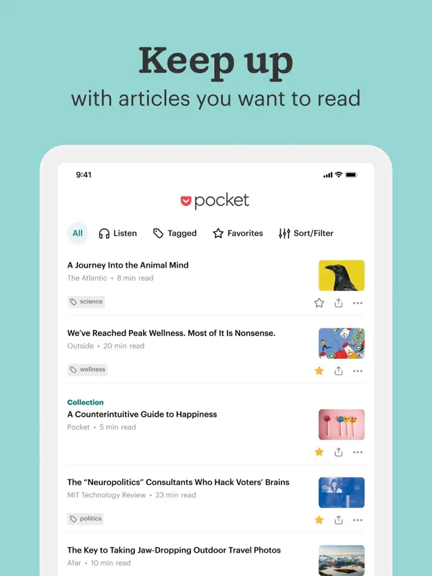

[Pocket (formerly Read It Later)](https://getpocket.com/collections) allows users to save articles, videos, and stories from any publication, page, or app for later enjoyment with a clean, easy-to-read layout. It's known for its offline reading capabilities and personalized content recommendations.

**Key Features:**
- Save articles, videos, and stories from any publication, page, or app.
- Curate your own space filled with everything you can’t wait to learn.
- Immersive reading experience with a clean, easy-to-read layout.
- Discover new content with personalized recommendations.

**Pros:**
- Wide range of supported content types.
- Offline reading capability.
- Integration with over 1500 apps including Twitter, Flipboard, and Feedly.

**Cons:**
- Premium features require subscription.
- May not organize content as extensively as some users would like.

**Integration:**
- Extensive, with browsers, social media platforms, and news aggregators.

**Pricing:**
- Free version available; Premium version priced at $4.99/month or $44.99/year.

### 2. Instapaper
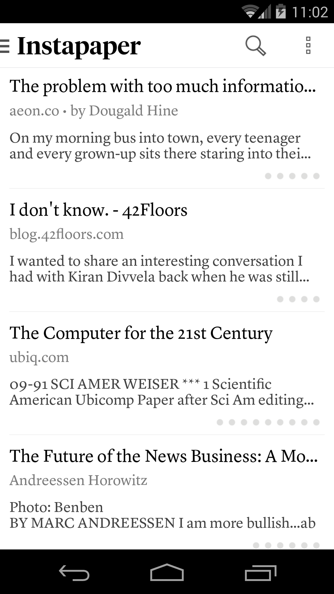

[Instapaper](https://www.instapaper.com/) offers a distraction-free space to save and read articles later, featuring tools for highlighting, note-taking, and organizing content into folders. It supports text-to-speech and allows users to send saved articles to their Kindle device.

**Key Features:**
- Save and store articles for reading later with no distractions.
- Text-to-speech option available.
- Highlighting and note-taking within articles.
- Organize with folders and tags.

**Pros:**
- Clean, distraction-free reading environment.
- Speed reading feature to help read faster.
- Kindle support for sending articles to your device.

**Cons:**
- Some advanced features locked behind the premium version.
- Less social sharing features compared to competitors.

**Integration:**
- Works with iOS, Android, Kindle, and web browsers.

**Pricing:**
- Basic version is free; Premium version is $2.99/month.

### 3. EmailThis
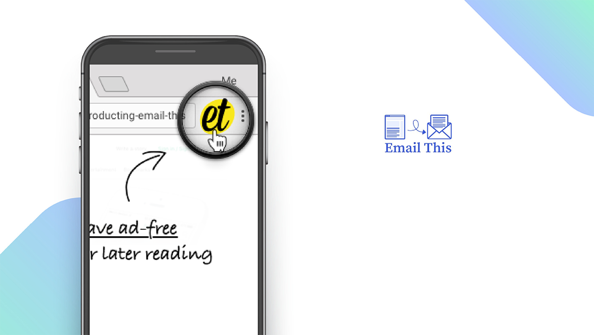

[EmailThis](https://www.emailthis.me/) strips away ads and distractions from web articles and sends them directly to your email for a simplified reading experience. It emphasizes privacy and ease of use, making it a straightforward solution for saving content.

**Key Features:**
- Removes ads and distractions from articles and sends them to your email.
- Bookmarklet allows easy saving from any browser.
- Simple setup and operation without the need for an additional app.

**Pros:**
- Direct delivery to your email, integrating into your workflow.
- Privacy-focused, minimal data collected.
- Very straightforward and easy to use.

**Cons:**
- Limited organizational features compared to dedicated apps.
- Relies on email for reading, which might not suit all users.

**Integration:**
- Primarily browser-based with bookmarklet for saving.

**Pricing:**
- Free version available; Premium plans start at $19/year.

### 4. Safari Reading List
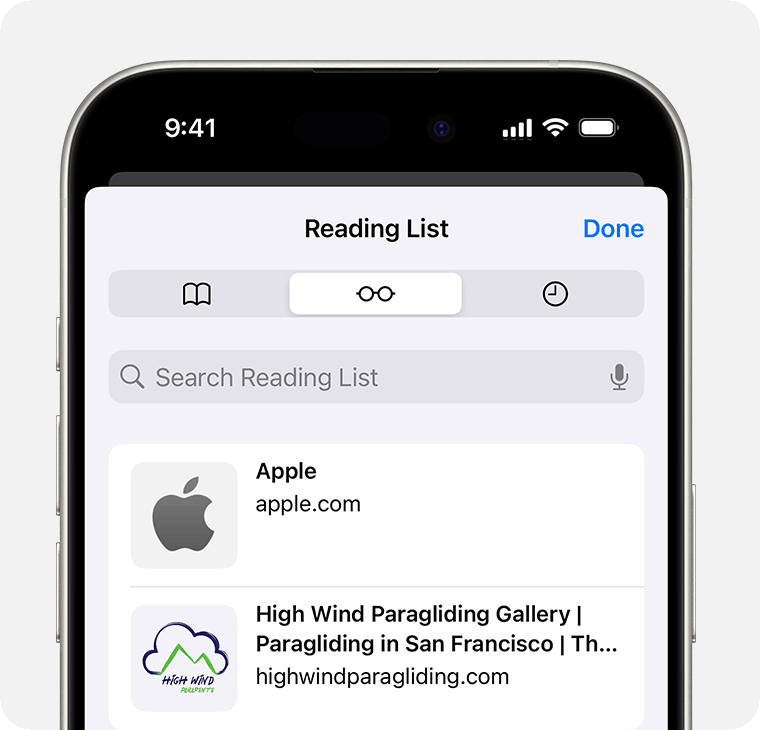

Integrated directly into Apple's Safari browser, the Safari Reading List lets users save web pages and articles for offline reading, syncing across all devices connected to iCloud. It's a convenient option for those deeply integrated into the Apple ecosystem.

**Key Features:**
- Built directly into the Safari web browser.
- One-click saving of articles and websites.
- Offline reading capability.
- Syncs across all Apple devices using iCloud.

**Pros:**
- Seamless integration with the Apple ecosystem.
- No additional account or setup required for Apple users.
- Completely free to use.

**Cons:**
- Limited to Apple devices.
- Lacks advanced features and organizational tools found in other apps.

**Integration:**
- Exclusive to Apple's Safari browser and ecosystem.

**Pricing:**
- Free.

### 5. Raindrop.io
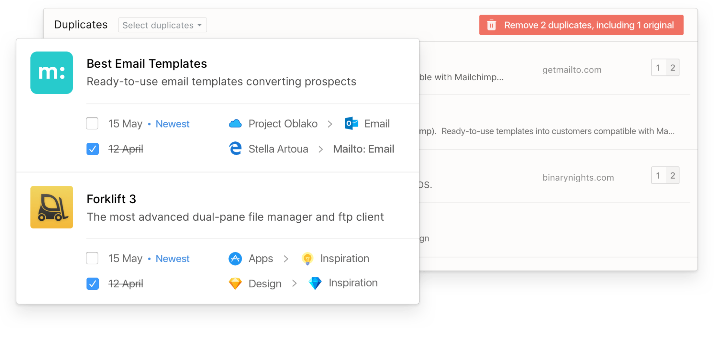

[Raindrop.io](https://raindrop.io/) is a versatile bookmarking tool that not only saves articles but also photos, videos, and more, offering robust organizational features like collections, tags, and nested folders. It facilitates content sharing and collaboration, making it useful for both personal and professional use.
**Key Features:**
- Bookmarking tool that supports articles, photos, videos, and more.
- Advanced categorization with collections, tags, and nested folders.
- Content can be shared publicly or with specific groups.
- Browser extension and mobile apps available for cross-platform use.

**Pros:**
- Versatile and visually appealing interface.
- Strong organizational capabilities.
- Collaborative features for sharing content with others.

**Cons:**
- May be more complex than simple read-it-later apps.
- Some features are locked behind the Pro version.

**Integration:**
- Integrates with browsers through extensions and has dedicated apps for major platforms.

**Pricing:**
- Basic version is free; Pro version is $3/month billed annually.

### 6. Readwise
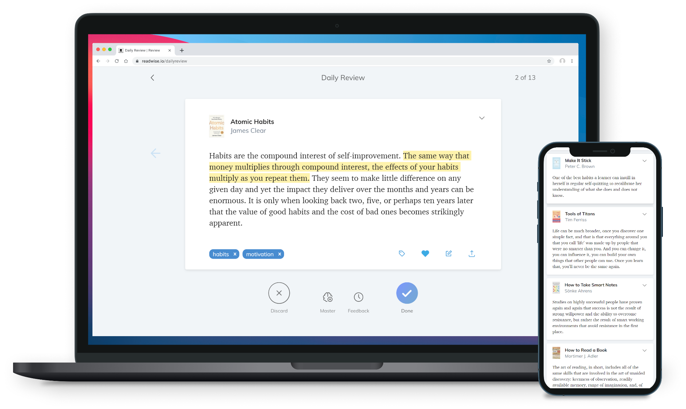

[Readwise](https://readwise.io/) leverages your reading to its full potential by syncing highlights from ebooks, articles, and PDFs into one place, where they can be reviewed and integrated into your knowledge base. It is especially beloved for its daily review feature, which resurfaces your highlights to reinforce memory.
**Key Features:**
- Comprehensive highlight synchronization from a variety of sources including Kindle, Apple Books, Instapaper, Pocket, and more.
- Daily review emails to reinforce learning and retention.
- Organize highlights by tags and connect them to note-taking apps.

**Pros:**
- Powerful tool for consolidating and reviewing knowledge.
- Extensive integration options make it versatile across reading platforms.

**Cons:**
- Relies on subscription for full functionality, which may deter some users.
- Primarily highlight-focused, which might not suit those looking for full-article read-it-later functionality.

**Integration:**
- Broad integration capabilities with most e-readers, read-it-later apps, and note-taking applications like Evernote and Notion.

**Pricing:**
- Free trial available; premium subscription starts at $4.99/month, with an option for an annual subscription that offers additional savings.

### 7. Matter
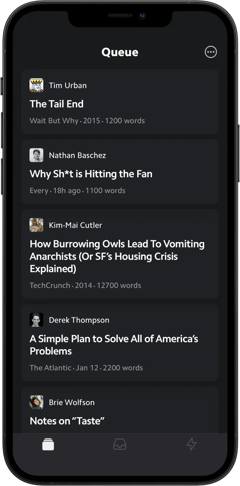

[Matter](https://hq.getmatter.com/) is a read-it-later app that aims to create a single space for all your reading materials, from newsletters and articles to Twitter threads, with powerful tools for organization, annotation, and discovery.

**Key Features:**
- Support for a wide range of content including newsletters, articles, podcasts, and Twitter threads.
- Advanced tools for annotations and highlighting, collaborative notes, and sharing insights within the community.
- Personalized discovery feed to find new content.

**Pros:**
- Offers a seamless reading and listening experience across devices.
- Encourages engagement through community features and content discovery.

**Cons:**
- Limited platform availability with a focus on iOS could exclude Android and desktop users.
- The abundance of features might be overwhelming for users seeking simplicity.

**Integration:**
- Direct integration with Twitter for saving threads and RSS feeds for newsletters and articles. Email forwarding for newsletter subscriptions.

**Pricing:**
- Free for basic use; details on premium features and pricing are expected as the platform evolves.

### 8. Omnivore
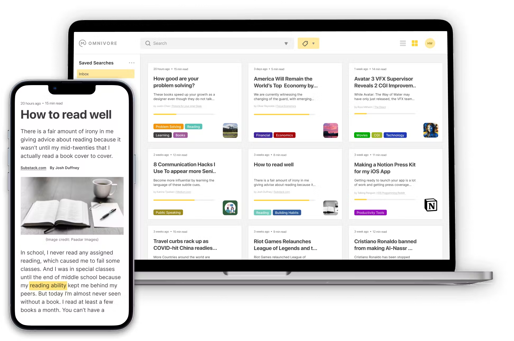

[Omnivore](https://omnivore.app/) offers a unique approach by not just saving articles for later but also employing AI to summarize them, aiming to save users time while keeping them informed.

**Key Features:**
- AI-driven summaries of saved articles to provide quick insights without reading the full text.
- Ability to save and categorize articles for later reading.
- Focus on reducing information overload through summarization.

**Pros:**
- Efficient for users looking to stay informed without investing a lot of time.
- Simplifies the reading list to key takeaways and summaries.

**Cons:**
- AI summaries may miss important nuances or fail to capture the author's full intent.
- Limited integration at early stages, focusing primarily on web articles.

**Integration:**
- Initial versions focus on web-based content, with plans to expand integration in the future.

**Pricing:**
- Free and open-source.

### 9. Wallabag
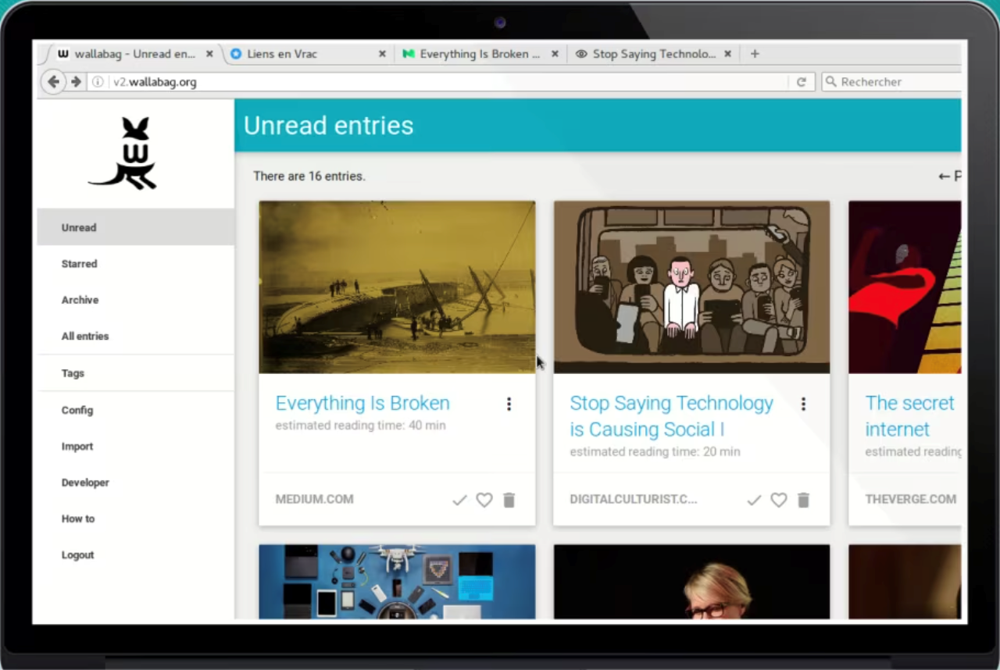

[Wallabag](https://www.wallabag.it/en) is an open-source, self-hosted read-it-later app that allows users to save web pages offline, offering complete data control and privacy.

**Key Features:**
- Save web pages offline from your computer or smartphone.
- Freedom to organize articles with tags and categories.
- Self-hosting option for complete control over data and privacy.

**Pros:**
- No reliance on third-party services, offering maximum privacy and control.
- Open-source with a supportive community for continuous improvement.

**Cons:**
- Requires technical knowledge for self-hosting setup.
- Lacks the polished user interface of commercial counterparts.

**Integration:**
- Compatible with multiple browsers through extensions and offers mobile applications for reading on the go.

**Pricing:**
- Free if you opt to self-host. The hosted service, Wallabag.it, offers subscriptions starting at €9/year, providing a managed solution for users.

### 10. PaperSpan
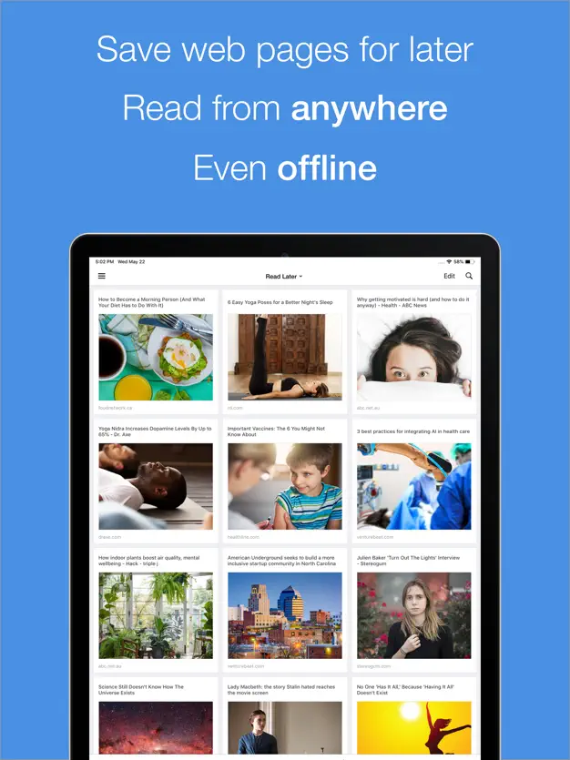

[PaperSpan](https://www.paperspan.com/) is designed to help users easily save articles to read or listen to later, with features aimed at improving productivity and learning, such as reading time estimates and audio playback.

**Key Features:**
- Text-to-speech functionality for articles, enabling listening on the go.
- Estimated reading times help users manage their reading list efficiently.
- Ability to save, categorize, and annotate articles for future reference.

**Pros:**
- Audio playback feature is ideal for multitasking or visually impaired users.
- Provides a productivity-oriented experience with reading time estimates and progress tracking.

**Cons:**
- User interface and experience may not be as refined as other more established apps.
- Focuses mainly on article content, lacking support for videos or interactive media.

**Integration:**
- Available across web, iOS, and Android platforms, ensuring accessibility from various devices.

**Pricing:**
- Free basic functionality with premium features available starting at $8.99/month, which includes unlimited text-to-speech and advanced article management features.

### 11. Bublup
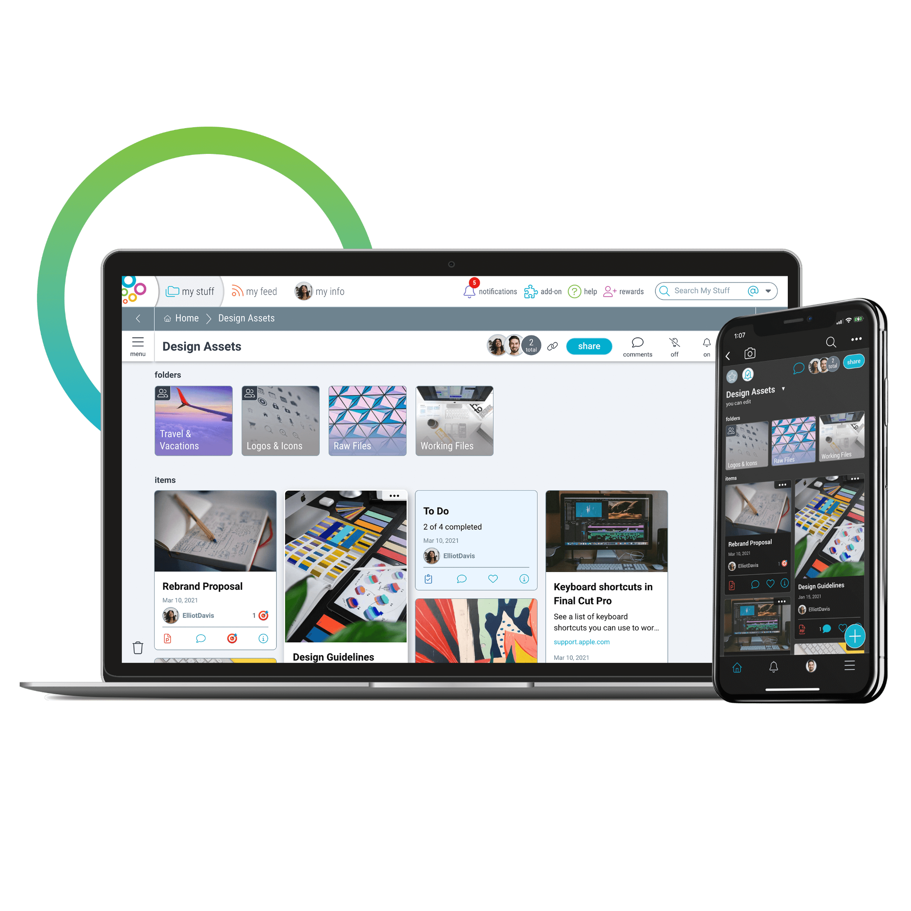

[Bublup](https://www.bublup.com/) is more than a read-it-later app; it's a comprehensive tool for saving not just articles but also links, photos, notes, and files in visually organized folders, making it ideal for project planning and collaboration.

**Key Features:**
- Allows saving of a broad array of content types, including links, documents, images, and notes into visually organized folders.
- Real-time collaboration and sharing capabilities for folders and content.
- Integration with cloud storage services for backing up and importing files.

**Pros:**
- Highly versatile, catering to both personal bookmarking needs and professional project management.
- Visual organization aids in easier navigation and content retrieval.

**Cons:**
- The comprehensive feature set can be overwhelming for users seeking a straightforward read-it-later solution.
- May require a learning curve to fully utilize its organizational capabilities.

**Integration:**
- Integrates with major web browsers via extensions and offers mobile apps for on-the-go access. Compatibility with cloud storage platforms enhances file management.

**Pricing:**
- Free tier with substantial functionality; premium plans start at $3.99/month, offering enhanced storage, collaboration features, and advanced organization tools.

## Recommended read-it-later apps for different people

### For Podcast Enthusiasts: Pocket
**Pocket** stands out for its ability to turn articles into a podcast-like experience. This feature is ideal for users who prefer listening over reading, such as commuters or multitaskers, allowing them to consume written content audibly.

### For Speed Readers: Instapaper
**Instapaper** offers a unique speed-reading function that flashes words on the screen, enabling users to consume content faster. This could be particularly beneficial for professionals or students who need to go through large volumes of text efficiently.

### For Newsletter Lovers: Omnivore
**Omnivore** is recommended for those who frequently save newsletters for later reading. Its capabilities might cater specifically to individuals who subscribe to numerous newsletters and require an organized way to catch up on them.

### For Comprehensive Content Organization: Evernote
Though not a traditional read-it-later app, **Evernote** is suggested for its robust features in capturing, organizing, sorting, and tagging a collection of articles. This makes it suitable for researchers, writers, or anyone needing extensive content management tools.

### For a Mix of Reading and Learning: Readwise Reader
**Readwise Reader** is praised as a game-changer for digital-age readers, possibly due to its integration with learning and review systems. It might appeal to avid learners, students, or professionals looking to not only save content but also incorporate it into their knowledge base efficiently.

### For a Straightforward Reading Experience: PaperSpan
**PaperSpan** is highlighted among the best read-it-later apps, likely for its straightforward approach to saving and reading articles. It could be ideal for everyday readers seeking a simple and effective way to manage their reading lists without the need for additional features.

