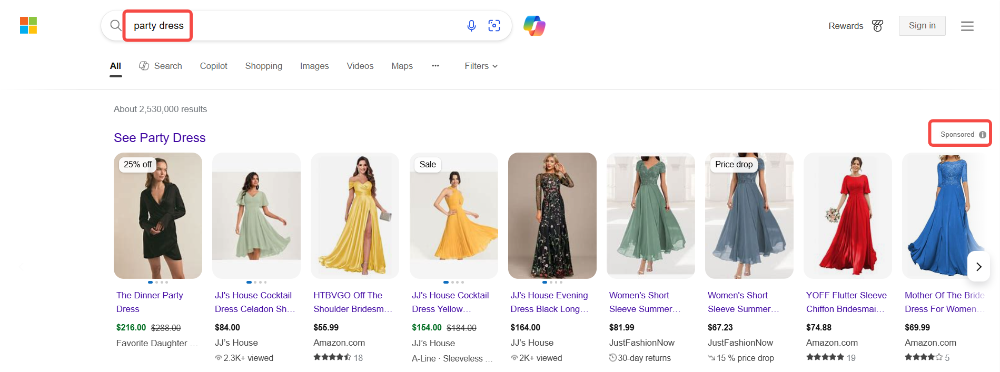
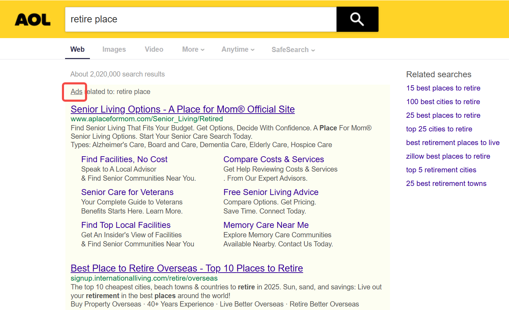

## Bing's Market Share Continues to Grow

According to [StatCounter (2024 data)](https://gs.statcounter.com/search-engine-market-share), Bing holds approximately **3.42%** of the global search engine market share, making it the second-largest search engine after Google.  
In the U.S. market, Bing's search engine market share stands at **7.85%**, showing slight growth from 5.97% in 2021. In 2014, Bing reached its peak U.S. market share at **9.9%**.  

## Why Focus on Bing Ads?  
### High-Purchasing-Power User Base  
- **Significant Male Demographic**: Data from [SimilarWeb](https://www.similarweb.com/website/bing.com/#demographics) shows that two-thirds (64.15%) of Bing users are male, with over 50% under age 34 (30.7% aged 25-34, 22.17% aged 18-20).  
- **Affluent User Profile**: As reported by [Coalition](https://coalitiontechnologies.com/blog/bing-statistics-search-and-usage-data-in-2024), 38% of Bing users have a household income exceeding $100,000 annually.  
- **E-Commerce Impact**: Bing Shopping Ads achieve a **43% higher click-through rate (CTR)** compared to Google, driven by partnerships with platforms like Amazon, OfferUp, and Gumtree.  

### Cross-Platform Reach  
Bing Ads are displayed across multiple Microsoft-owned platforms:  
**1. Yahoo & AOL**  
- **Technical Collaboration**:  
  - Bing has powered Yahoo's search technology since 2009, covering its global search traffic (excluding some non-U.S. regions).  
  - AOL partnered with Microsoft in 2015 to use Bing for search ads.  
- **User Scale**:  
  - **Yahoo**: ~680 million monthly active users globally, primarily in the U.S. and Japan.  
  - **AOL**: ~120 million monthly active users, predominantly older U.S. demographics.  
- **Ad Placement**:  
  - Search results pages, news/article pages, and email interfaces (e.g., Yahoo Mail).  

**2. Edge Browser**  
- **Preinstalled Advantage**:  
  - Edge is the default browser for Windows 10/11, installed on over **1 billion devices** worldwide.  
  - Windows holds **74%** of the global desktop OS market share, with **68% of Edge users being enterprise clients**.  
- **Search Behavior**:  
  - Bing is the default search engine for Edge address bar queries, ensuring high-frequency ad exposure.  

**3. LinkedIn**  
Leveraging [LinkedIn](https://about.ads.microsoft.com/en/blog/post/march-2022/reach-specific-audiences-with-linkedin-profile-targeting) professional attributes (job titles, companies, industries) and interest tags (skills, groups), ads can target:  
  - **Decision-makers** (e.g., "Supply Chain Managers," "IT Directors").  
  - **Specific industries** (e.g., manufacturing, finance).  
  - **Enterprise-scale** (companies with ≥500 employees).  

**4. Xbox**  
- **User Scale**:  
  - Xbox has over **120 million monthly active users**, with **72% being males aged 18-34**.  
- **Ad Formats**:  
  - **In-game ads**: Displayed during loading screens or gameplay (e.g., sports brands advertising shoes in racing games).  
  - **Homepage promotions**: Featured deals or co-branded products on the Xbox dashboard.  

### Untapped Advertising Potential  
With lower competition than Google, small-to-medium businesses can more easily secure top ad placements at reduced costs. [WordStream](https://www.wordstream.com/blog/ws/2015/05/21/how-much-does-adwords-cost#:~:text=The%20average%20cost%20per%20click%20in%20Google%20Ads%20is%20between,$50%20or%20more%20per%20click.) data shows Bing Ads' average CPC is $1.54, compared to Google Ads' $2–$4 range.  

### AI-Driven Enhancements  
Microsoft's integration of OpenAI's ChatGPT into Bing has transformed traditional keyword searches into **conversational AI searches**, allowing users to obtain structured answers (e.g., product comparisons, shopping guides). This innovation positions Bing as an **intelligent decision-making assistant**, attracting younger users seeking efficiency and personalization.  

## What Are Bing Shopping Ads?  
Bing Shopping Ads are **product catalog-based advertisements** within Microsoft's advertising platform. They dynamically display product images, prices, and names to directly engage users with commercial intent.  

- **Key Differences from Traditional Search Ads**:  
  - **No Keyword Bidding**: Ads are automatically matched to user search terms based on product attributes (titles, descriptions, categories).  
  - **Visual Presentation**: Image-centric formats (similar to e-commerce platforms) enhance click-through rates.  

- **Common Ad Placements**:  
  - **Product carousels** at the top of Bing search results (labeled "Sponsored").  
    
  - Microsoft partner platforms (e.g., Yahoo Shopping, AOL search results).  
    
    

- **Operational Mechanism**  
1. **Data Source: Microsoft Merchant Center**  
   - Advertisers must create a **product feed** (including titles, descriptions, prices, stock status, image links) in Microsoft Merchant Center.  
   - Feeds undergo strict validation (e.g., price consistency with official websites, images ≥800×800 pixels).  

2. **Ad Trigger Logic**  
   - **Search Term Matching**: User queries (e.g., "men's sneakers") are linked to product titles/categories.  
   - **Contextual Expansion**: Ads may appear for semantically related terms (e.g., showing sneaker ads for "gym outfit ideas").  

3. **Ad Delivery & Conversion Tracking**  
   - Users are redirected to advertiser websites upon clicking ads.  
   - Microsoft Advertising UET tags track conversions, ROAS (return on ad spend), and other KPIs.  
