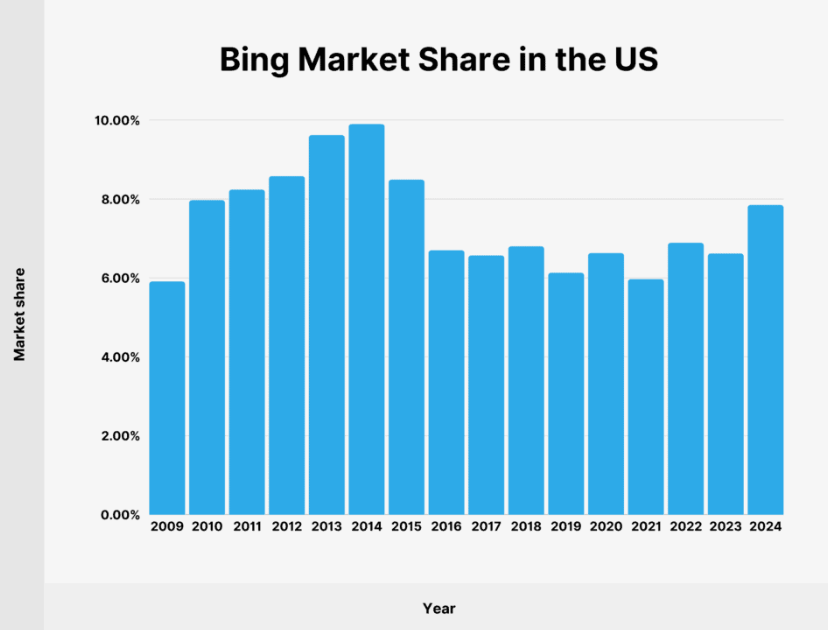
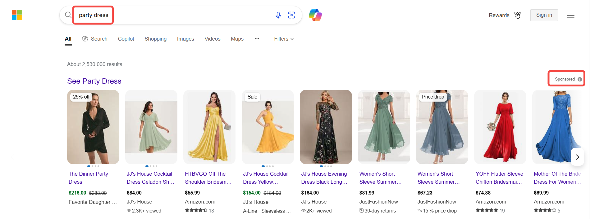
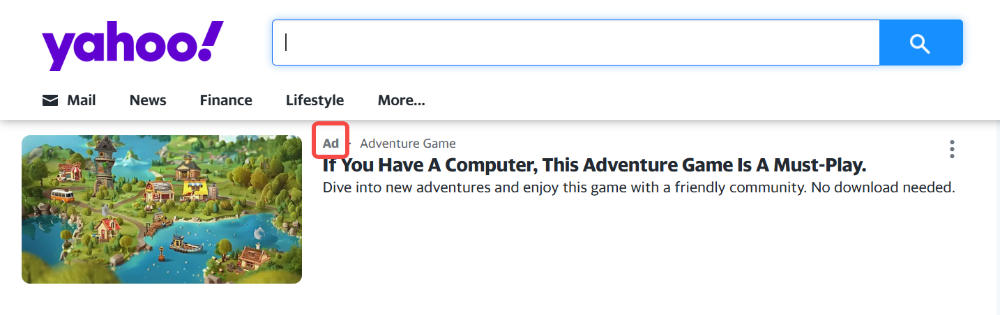
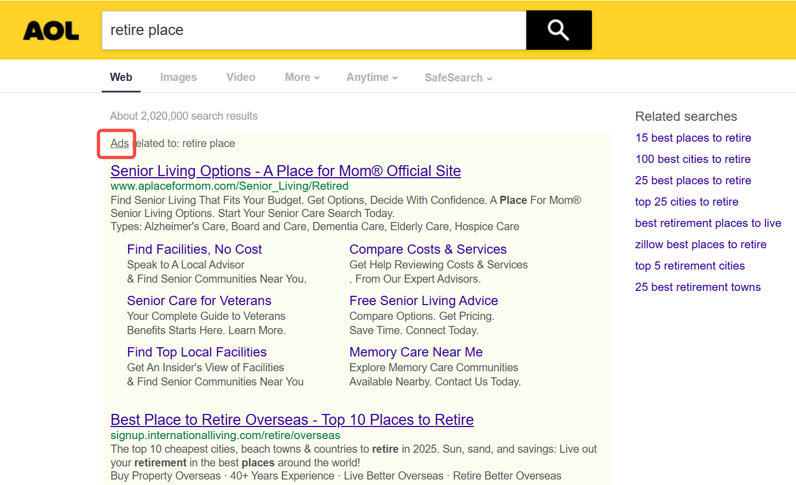

## Bing市场份额在持续增长

根据[StatCounter（2024年数据）](https://gs.statcounter.com/search-engine-market-share)，Bing占据全球搜索引擎市场份额约**3.42%**，是仅次于Google的第二大搜索引擎。
其中在美国市场，Bing在搜索引擎市场的份额为**7.85%**，较2021年的5.97%略有增长。2014年，Bing在美国的市场份额达到顶峰，为**9.9%**。

## 为什么关注Bing Ads？ 
### 高购买力用户群体
- 中青年男性占比不低：根据[SimilarWeb](https://www.similarweb.com/website/bing.com/#demographics)显示的数据，Bing用户中，有三分之二（64.15%）为男性用户，超过50%的用户年龄在34岁以下（其中30.7%的人年龄在25-34岁之间，22.17% 的人年龄在18-20岁之间）。
- 用户收入水平不低：根据[Coalition](https://coalitiontechnologies.com/blog/bing-statistics-search-and-usage-data-in-2024)的数据，平均而言，Bing 用户往往比较富裕，其中 38% 的用户年家庭收入超过100,000美元。
- 在电商领域占有一席之地：与谷歌相比，Bing的购物广告点击率 (CTR) 高出 43%。主要得益于其与亚马逊、OfferUp和Gumtree等热门购物网站的合作。

### 跨平台覆盖
Bing广告可展示在Microsoft旗下多个平台，包括：
**1. Yahoo & AOL**
- **技术合作**：  
  - 自2009年起，Bing为Yahoo提供搜索技术支持，覆盖其全球搜索流量（美国以外部分区域除外）。  
  - AOL于2015年与Microsoft达成协议，由Bing提供搜索广告服务。  
- **用户规模**：  
  - **Yahoo**：全球月活跃用户约 **6.8亿**，主要覆盖美国、日本等市场。  
  - **AOL**：仍拥有约 **1.2亿** 月活跃用户，以美国中老年用户为主。  
- **广告曝光场景**：  
  - 广告展示在Yahoo/AOL的 **搜索结果页**、**新闻资讯页** 及 **邮箱界面**（如Yahoo Mail）。  

**2. Edge浏览器**
- **预装优势**：  
  - Edge是Windows 10/11的默认浏览器，覆盖全球超 **10亿台设备**。  
  - Windows系统占全球桌面操作系统份额 **74%**，Edge用户中 **68%为企业用户**。  
- **搜索行为**：  
  - 用户直接在Edge地址栏输入搜索词时，默认调用Bing搜索（不可更改设置），形成高频广告曝光场景。  

**3. LinkedIn**

基于[LinkedIn](https://about.ads.microsoft.com/en/blog/post/march-2022/reach-specific-audiences-with-linkedin-profile-targeting)的 **职业属性**（职位、公司、行业）和 **兴趣标签**（技能、群组），定向广告至：  
  - **采购决策者**（如“供应链经理”“IT总监”）。  
  - **特定行业**（如制造业、金融业）。  
  - **企业规模**（员工数≥500人的公司）。  

**4. Xbox**
- **用户规模**：  
  - Xbox全球月活跃用户超 **1.2亿**，其中 **72%为18-34岁** 男性。  
- **广告形式**：  
  - **游戏内广告**：在加载页面或场景中展示商品（如运动品牌在赛车游戏中投放鞋类广告）。  
  - **主界面推荐**：在Xbox首页推荐“限时折扣”或联名产品。  

### 未被充分开发的广告红利
与Google相比，Bing广告竞争程度较低，中小商家更容易以低成本抢占头部广告位。[WordStream](https://www.wordstream.com/blog/ws/2015/05/21/how-much-does-adwords-cost#:~:text=The%20average%20cost%20per%20click%20in%20Google%20Ads%20is%20between,$50%20or%20more%20per%20click.)数据显示，Bing Ads平均每次点击费用约为1.54美元，而Google Ads则在2美元到4美元之间。

### AI技术加持
Microsoft投资OpenAI并深度整合ChatGPT至Bing搜索，将传统“关键词搜索”升级为对话式AI搜索，用户可通过自然语言提问获取结构化答案（如商品对比、购物建议）。这一变革使Bing从“工具型搜索引擎”转型为智能决策助手，吸引追求高效、个性化体验的年轻用户。

## 什么是Bing Shopping Ads？
Bing Shopping Ads 是 Microsoft 广告平台推出的 **基于产品目录的购物广告**，通过动态展示商品图片、价格、名称等信息，直接触达搜索购物意图的用户。  

- **与传统搜索广告的区别**：  
  - **无需关键词竞价**：广告展示由用户搜索词与商品属性（标题、描述、分类）自动匹配。  
  - **视觉化呈现**：以图片为主的信息流形式（类似电商平台），提升用户点击欲望。  

- **常见广告位置**：  
  - Bing 搜索结果页顶部的 **商品轮播卡**（带“Sponsored”标识）。  
  
  - Microsoft 广告合作伙伴平台（如Yahoo购物频道、AOL搜索结果页）。  
  
  

- **运作机制**  
1. **商品数据源：Microsoft Merchant Center**  
   - 商家需在 Microsoft Merchant Center 创建 **产品Feed**（包含商品标题、描述、价格、库存、图片链接等字段）。  
   - Feed 要求严格审核（如价格需与官网一致，图片尺寸≥800×800像素）。  

2. **广告触发逻辑**  
   - **搜索词匹配**：用户搜索词（如“男士运动鞋”）与商品标题、分类、属性自动关联。  
   - **上下文扩展**：部分场景下，Bing 会将广告展示在相关但非直接匹配的搜索词下（例如搜索“健身房穿搭”可能触发运动鞋广告）。  

3. **广告展示与转化追踪**  
   - 点击广告后，用户跳转至商家网站完成购买。  
   - 通过 Microsoft Advertising UET 标签（通用事件追踪）监测转化率、ROAS（广告支出回报率）等关键指标。  

