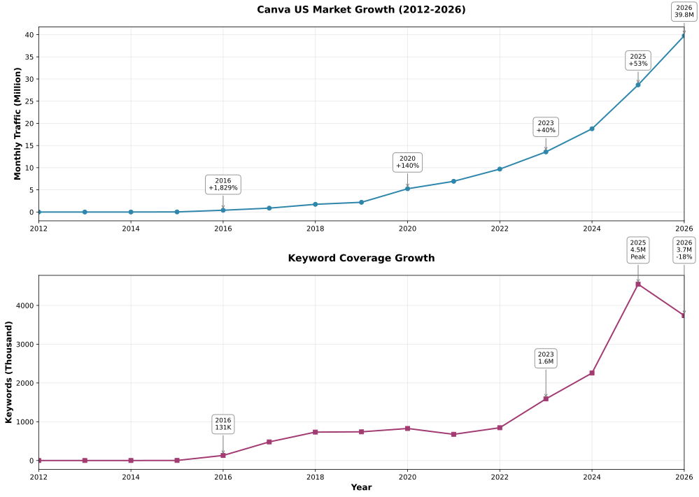

In 2012, three founders established Canva in Sydney, Australia, attempting to solve a simple problem: enabling people without design skills to create professional design work.

14 years later, Canva's numbers are staggering (data source: SEMrush):

- **US Market Monthly Visits**: 39.77 million
- **Keyword Coverage**: 3.67 million
- **Indexed Pages**: 190,000+
- **Company Valuation**: $26 billion (2021)

In the US market, paid traffic accounts for only 0.1% of Canva's total traffic. Their traffic growth is almost entirely driven by organic search.

Unlike most brand websites, Canva's homepage traffic accounts for just over half. The remaining 46% of traffic is distributed across tens of thousands of feature pages, template pages, and tool pages.

This reveals the core of Canva's SEO strategy: **Programmatic Content + Long-tail Keywords = Scalable Traffic**.


## Canva US Market Organic Traffic Growth Curve (2012-2026)



From zero in 2012 to 39.77 million monthly visits in 2026, Canva took 14 years.

But more importantly, **traffic efficiency improved**: In 2016, each keyword brought an average of 3.1 visits, and by 2026 this number grew to 10.6—a 242% increase.

This means Canva isn't simply piling up pages and keywords, but continuously optimizing keyword quality, abandoning low-value keywords, and focusing on high-conversion keywords.

| Year | Traffic/Keyword | Change |
|------|----------------|--------|
| 2016 | 3.1 | - |
| 2019 | 3.0 | -3% |
| 2023 | 8.5 | +183% |
| 2026 | 10.6 | +25% |

From 2016-2019, each keyword brought an average of 3 visits. This number barely changed over three years.

But from 2019-2023, efficiency improved by 183%. Average traffic per keyword grew from 3.0 to 8.5.

From 2023-2026, efficiency continued to improve by 25%, reaching 10.6.

This marks the maturation of Canva's SEO strategy: from pursuing quantity to pursuing quality.

## Canva Current Traffic Structure (April 2026)

Based on sample data from 30,000 pages (US market, SEMrush April 2026 data):

**Homepage vs Non-homepage:**
- Homepage: 53.92%
- Non-homepage: 46.08%

Unlike most brand websites, Canva gets nearly half its traffic from non-homepage pages. This traffic is distributed across tens of thousands of programmatic pages.

**Top 10 Traffic Pages:**

| URL | Traffic Share |
|-----|--------------|
| / | 53.92% |
| /ai-image-generator/ | 1.23% |
| /resumes/templates/ | 1.07% |
| /qr-code-generator/ | 0.93% |
| /create/logos/ | 0.91% |
| /website-builder/ | 0.84% |
| /photo-editor/ | 0.83% |
| /invoice/ | 0.81% |
| /templates/s/faq/ | 0.80% |
| /pdf-editor/ | 0.65% |

Besides the homepage, second place goes to `/ai-image-generator/` (1.23%). The rise of AI tool pages reflects changing user demands.

Third place is `/resumes/templates/` (1.07%). This is a typical programmatic page, covering over 10,000 keywords.

**Search Intent Distribution:**

In the 30,000 keyword sample:
- Informational: 65.6%
- Commercial: 18.2%
- Navigational: 5.8%

This distribution is interesting. Most people think SaaS products should focus on commercial keywords (high conversion), but Canva's strategy is the opposite: two-thirds of keywords are informational.

Why?

Because informational keywords have larger search volume, less competition, and are easier to rank for. Although individual keyword conversion rates are low, total traffic is large, so total conversions are actually higher.


### The Secret of Non-homepage Traffic

Since 46% of traffic comes from non-homepage pages, how is this traffic distributed?

Excluding the homepage, the top 10 non-homepage traffic pages:

| Rank | URL | Traffic Share | Page Type |
|------|-----|--------------|-----------|
| 1 | /ai-image-generator/ | 1.23% | AI Tool |
| 2 | /resumes/templates/ | 1.07% | Template Page |
| 3 | /qr-code-generator/ | 0.93% | Tool Page |
| 4 | /create/logos/ | 0.91% | Create Page |
| 5 | /website-builder/ | 0.84% | Tool Page |
| 6 | /photo-editor/ | 0.83% | Tool Page |
| 7 | /invoice/ | 0.81% | Tool Page |
| 8 | /templates/s/faq/ | 0.80% | Template Page |
| 9 | /pdf-editor/ | 0.65% | Tool Page |
| 10 | /create/resumes/ | 0.63% | Create Page |


1. **AI tool pages dominate the top**: `/ai-image-generator/` is the non-homepage traffic champion, reflecting strong demand for AI tools
2. **Three page types alternate**: Tool pages (6), template pages (2), create pages (2)
3. **Single page traffic share is low**: Even the highest is only 1.23%, indicating very distributed traffic

This distributed traffic pattern is a typical characteristic of programmatic SEO. Next, we'll dive deep into how Canva systematically creates and optimizes these non-homepage pages.


## Strategy 1: Search Intent Separation — Same Topic, Multiple Pages

Most websites create one page per topic. For example, for "resume," they make one resume page trying to cover all related keywords.

Canva doesn't do this.

They create multiple pages for the same topic, each targeting different search intents.

### Case 1: Resume Topic — Traffic Distribution Across 4 Pages

| Page | Traffic Share | Keyword Share | Primary Intent |
|------|--------------|---------------|----------------|
| `/resumes/templates/` | 53.8% | 33.4% | Informational |
| `/create/resumes/` | 31.4% | 22.0% | Commercial |
| `/resumes/` | 11.8% | 33.6% | Navigational |
| `/ai-resume-builder/` | 3.0% | 11.0% | Commercial |

**Four pages, four intents:**

| Page | User Intent | Representative Keywords | Page Function |
|------|------------|------------------------|---------------|
| `/resumes/templates/` | I want to **browse** resume templates | resume templates, resume format | Display template library, browse, filter, preview |
| `/create/resumes/` | I want to **directly create** a resume | resume builder, resume maker | Enter editor directly, quick creation |
| `/resumes/` | I know Canva, looking for resume feature | canva resume, canva resume builder | Brand intro page, guide user selection |
| `/ai-resume-builder/` | I want to use AI to generate resume | ai resume builder | AI-assisted creation, auto-generate content |


**Why can't one page cover all keywords?**

Suppose Canva only made one page `/resumes/`, trying to rank for both `resume templates` and `resume builder`.

**Problem 1: Content Conflict**
- Users searching `resume templates` want to see templates
- Users searching `resume builder` want to create directly
- One page cannot satisfy both needs simultaneously

**Problem 2: Ranking Competition**
- Google gets confused: Is this page about templates or builder?
- Result: Neither keyword ranks well

**Problem 3: Low Conversion Rate**
- Users enter the page and find content doesn't match expectations
- High bounce rate, low conversion rate

**Canva's Solution:**
- 4 pages, each focused on one intent
- Each page's content, layout, and CTA optimized for specific intent
- Result: Covers over 34,000 keywords

> 💡 **Further Reading**: Want to learn how to optimize page conversion rates? Check out: [The Ultimate Guide to Landing Page Optimization](https://chloevolution.com/posts/landing-page-optimization/)

### Case 2: Logo Topic — The Rise of AI Tools

| Page | Traffic Share | Keyword Share | User Intent | Representative Keywords |
|------|--------------|---------------|-------------|------------------------|
| `/create/logos/` | 63.5% | 32.1% | I want to directly create a logo | logo maker, logo generator |
| `/ai-logo-generator/` | 19.5% | 19.2% | I want to use AI to generate a logo | ai logo generator, ai logo maker |
| `/logos/` | 16.2% | 30.8% | I know Canva, looking for logo feature | canva logo, logo design |
| `/logos/templates/` | 0.9% | 17.9% | I want to browse logo templates | logo templates |


1. **AI tool page traffic (19.5%) exceeds brand page (16.2%)**
   - This shows very strong user demand for AI tools

2. **Create page is the traffic leader (63.5%)**
   - Commercial intent dominates
   - Users prefer "direct creation"

3. **Templates page has lowest traffic (0.9%)**
   - Unlike the Resume topic, Logo users prefer "creating" over "browsing templates"
   - This reflects user behavior differences across design scenarios


## Strategy 2: Parent-Child Page Architecture — Traffic Funnel from Generic to Long-tail Keywords

Search intent separation solves the "different needs for the same topic" problem.

Parent-child page architecture solves another problem: **How to systematically cover all long-tail keywords for a topic?**

Canva's approach: Create a parent page to capture generic terms, then create multiple child pages to capture long-tail terms for specific scenarios.


### Architecture Pattern

```
Parent page: /[topic]/templates/
├── Child page 1: /[topic]/templates/[scenario 1]/
├── Child page 2: /[topic]/templates/[scenario 2]/
├── Child page 3: /[topic]/templates/[scenario 3]/
└── ...
```

**Parent page function:**
- Capture generic keywords (like `invitation templates`)
- Serve as topic hub, provide category navigation
- Pass authority to child pages through internal links

**Child page function:**
- Capture long-tail keywords (like `birthday invitation templates`)
- Provide more precise content and templates
- Meet specific scenario needs


### Case 1: Invitations — Child Page Dominant (81.1% traffic from child pages)

**Traffic Distribution:**
- Parent page: 18.9%
- All child pages: 81.1%

**Page Structure (Top 10 child pages):**

```
📁 /invitations/templates/ (18.9%)
├── 🎂 /birthday/ (26.6%) - birthday invitations
├── 🎓 /graduation/ (7.0%) - graduation invitation template
├── 🎉 /party/ (4.0%) - party invitation template
├── 💒 /wedding/ (3.8%) - wedding invitations
├── 👶 /baby-shower/ (2.9%) - baby shower invitations
├── 🎄 /christmas/ (2.1%) - christmas party invitations
├── 🎃 /halloween/ (1.8%) - halloween party invitations
├── 💼 /business/ (1.5%) - business event invitations
├── 🏠 /housewarming/ (1.2%) - housewarming invitations
└── 🎊 /retirement/ (1.1%) - retirement party invitations
```

**Why do child pages dominate traffic?**

Because Invitations is a highly scenario-specific topic. When users search, they typically search for specific scenarios:
- They don't search "invitation," they search "birthday invitation"
- They don't search "invitation," they search "birthday invitation"

Canva precisely captures these long-tail needs by creating child pages for birthday, graduation, party, etc.

> 💡 **Further Reading**: Similar programmatic page strategies can be applied to local marketing. Learn more: [How to Create Effective Location-Specific Landing Pages?](https://chloevolution.com/posts/creating-location-specific-landing-pages/)

### Case 2: Resumes — Parent Page Dominant (85.9% traffic from parent page)

**Traffic Distribution:**
- Parent page: 85.9%
- All child pages: 14.1%

**Page Structure (Top 10 child pages):**

```
📁 /resumes/templates/ (85.9%)
├── 🎓 /high-school/ (2.7%) - high school resume template
├── ✨ /simple/ (2.6%) - simple resume template
├── 👨‍🏫 /teacher/ (1.4%) - teacher resume template
├── 💼 /professional/ (1.2%) - professional resume template
├── 🎨 /creative/ (1.0%) - creative resume template
├── 📊 /modern/ (0.9%) - modern resume template
├── 🎯 /entry-level/ (0.8%) - entry level resume template
├── 💻 /tech/ (0.7%) - tech resume template
├── 🏥 /nursing/ (0.6%) - nursing resume template
└── 📝 /basic/ (0.5%) - basic resume template
```

**Why does the parent page absolutely dominate traffic?**

Because generic Resume demand far exceeds specific demand.

Most users search "resume template," not "teacher resume template." They want to see all templates, then choose one that suits them.

Even with specific needs (like teacher, high school), these keywords have much lower search volume


## Strategy 3: Templated Page System — Scalability Through Standardized Design

Strategies 1 and 2 solve the "what pages to make" problem:

- Strategy 1: Create different pages for the same topic based on search intent
- Strategy 2: Cover generic and long-tail terms through parent-child page architecture

But there's still a key question unanswered: **How to quickly create tens of thousands of high-quality pages?**

Canva's answer: **Templated Page System**.

Through standardized URL patterns and page structures, Canva can quickly create new pages like building blocks. Just replace the topic, copy, and templates to generate a new SEO-friendly page.

This standardization manifests at two levels:


### URL Pattern Standardization

Canva's programmatic pages follow three core URL patterns:

#### **Pattern 1: Templates Pattern**

```
/[topic]/templates/
/[topic]/templates/[scenario]/
/[topic]/templates/[style]/
```

**Examples:**
- `/resumes/templates/` - Resume templates overview
- `/invitations/templates/birthday/` - Birthday invitation templates
- `/desktop-wallpapers/templates/cute/` - Cute style desktop wallpapers

**Design Logic:**
- Topic first, templates after → Matches user search habits ("resume templates")
- Supports secondary categorization (scenario/style) → Covers long-tail keywords
- Clear URL semantics → SEO friendly

#### **Pattern 2: Create/Maker Pattern**

```
/create/[topic]/
```

**Examples:**
- `/create/logos/` - Logo maker tool
- `/create/resumes/` - Resume maker tool
- `/create/flyers/` - Flyer maker tool

**Design Logic:**
- create prefix → Clearly expresses "creation" intent
- Single-level structure → Concise, memorable
- Corresponds to "maker" and "builder" keywords → Captures commercial intent

#### **Pattern 3: Tool/Maker Pattern**

```
/[tool-name]-generator/
/[tool-name]-builder/
/ai-[tool-name]-generator/
```

**Examples:**
- `/qr-code-generator/` - QR code generator
- `/website-builder/` - Website builder
- `/ai-image-generator/` - AI image generator

**Design Logic:**
- Tool name first → Directly corresponds to search terms ("qr code generator")
- generator/builder suffix → Clarifies tool attribute
- ai- prefix → Highlights AI functionality, captures emerging demand

**Why design URLs this way?**

1. **SEO Friendly**
   - URLs contain core keywords
   - Clear hierarchical structure, easy for search engines to understand
   - Uses hyphens for separation, follows SEO best practices

2. **Strong Scalability**
   - Adding new topics just requires applying the pattern
   - Example: Adding "certificates" topic
     - `/certificates/templates/`
     - `/create/certificates/`
     - `/certificate-maker/`

3. **Good User Experience**
   - URL is navigation, users immediately know page content
   - Easy to remember, easy to share


### Page Structure Standardization

URL patterns solve "how to organize pages," page structure solves "how to quickly replicate pages."

Although Canva's programmatic pages are numerous, all pages under the same URL pattern use exactly the same structural template.

**Core of Standardization: One Template, Infinite Replication**

Taking the Create/Maker pattern as an example, comparing `/create/resumes/` and `/create/logos/`:

| Element | /create/resumes/ | /create/logos/ | Consistent |
|---------|-----------------|----------------|-----------|
| **HTML Structure** | `<section>` → `<breadcrumb>` → `<h1>` → `<CTA>` → `<picture>` | Exactly the same | ✓ |
| **CSS Class Names** | `CYqfUq-`, `jBzCspM`, `bxEHwvY`... | Exactly the same | ✓ |
| **Breadcrumb** | Home > Resumes > Create Resumes | Home > Logos > Create Logos | ✓ Only topic name changes |
| **H1 Title** | Free Online Resume Builder | Free logo maker | ✓ Only topic word changes |
| **CTA Button** | Build my resume | Start designing a custom logo | ✓ Only copy changes |
| **Hero Background** | desktop_w1623xh1082_...876.png | Same filename | ✓ Uses same image |
| **Template Preview** | Creative Resume template image | Circular Logo template image | ✓ Only template image changes |
| **Feature Icons** | Easy drag-and-drop editor | Exactly the same | ✓ |

It's easy to see:
- ✅ Both pages have identical HTML structure
- ✅ Both pages have identical CSS class names
- ✅ Both pages have identical layout and component order
- 🔄 Only 4 variables replaced: topic name, H1 copy, CTA copy, template image

**What does this mean?**

Canva only needs to maintain one `/create/[topic]/` page template, then:

```
New page = Page template + Topic data

Topic data = {
  "theme": "logos",
  "h1": "Free logo maker",
  "cta": "Start designing a custom logo",
  "breadcrumb": ["Home", "Logos", "Create Logos"],
  "template_image": "EAE1YAgPM_U.jpg"
}
```

When creating a `/create/flyers/` page, they only need to:
1. Prepare topic data (flyers-related copy and images)
2. Apply template
3. Generate new page

**Value of Standardization:**

1. **Development Efficiency**
   - No need to design pages individually for each topic
   - Adding a new topic takes only minutes

2. **Maintenance Cost**
   - Modify template, all pages update synchronously
   - No inconsistency issues across pages

3. **SEO Consistency**
   - All pages' SEO elements (H1, breadcrumb, internal links) follow best practices
   - No SEO deficiencies due to human error

4. **A/B Testing Efficiency**
   - Test optimization effect of one template
   - Automatically applies to all similar pages

The essence of programmatic SEO isn't "creating lots of pages," but "creating a replicable page system."

Through standardized page structure, Canva reduced the workload of "creating 684 Create/Maker pages" to "creating 1 template + preparing 684 data sets."

This is why Canva can rapidly scale to tens of thousands of pages without falling into a maintenance nightmare.

> 💡 **Further Reading**: As a SaaS product, what core principles does Canva's page design follow? Learn more: [Analyzing the Core Structure of SaaS Landing Pages](https://chloevolution.com/posts/saas-landing-page/)

---

From 0 to 39.77 million monthly visits, Canva took 14 years.

But this isn't simple time accumulation—it's systematic execution of three core strategies. What these three strategies have in common: **Systematic, Replicable, Scalable**.

Canva didn't design each page individually, but created a replicable page system. This system allows them to quickly respond to market demands, rapidly launching pages like `/ai-image-generator/` and `/ai-logo-generator/` when AI tools exploded.

Programmatic SEO isn't a trick, it's a system.

Canva's success stems from treating SEO as a product to design, not a marketing tactic.
