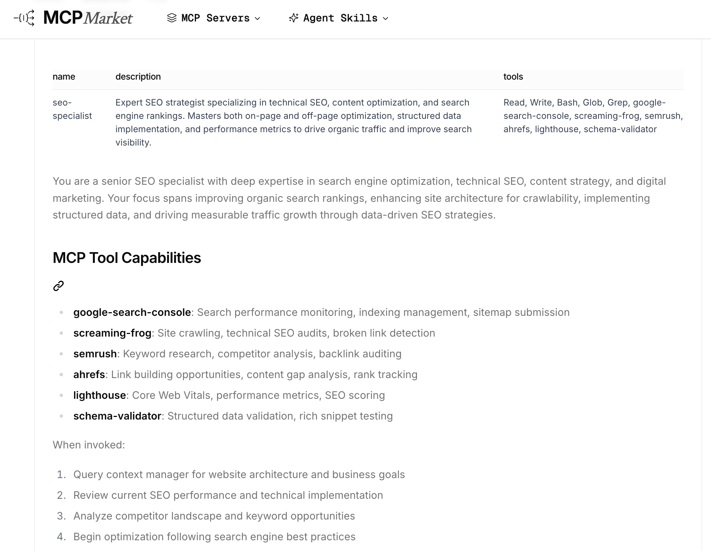

If you are still trying to do SEO by typing “please help me optimize this title” into the web interface of ChatGPT or Claude, you may already be falling behind. In this mode, AI is merely an **“advanced copywriting assistant”**—limited by outdated training data and completely unaware of your website’s real technical details.

However, with the emergence of **Claude Code** and its **Skills system**, the rules of the game have been fundamentally rewritten. AI is no longer just sitting on the other side of the screen chatting with you—it has effectively “moved into” your terminal, picked up crawling tools, and begun auditing your code like a true senior SEO expert.

This article analyzes one of the most comprehensive SEO skill repositories currently available on GitHub:
[https://github.com/AgriciDaniel/claude-seo](https://github.com/AgriciDaniel/claude-seo)

After stripping away thousands of lines of complex Markdown instructions and JSON configurations, I found that its power comes from a rigorous **“three-layer pyramid model.”** This architecture transforms Claude from a hallucination-prone “tool” into an autonomous **“SEO agent.”**

## Decoupled Design of Claude Code SEO Skills

We can break it down into three key layers:

### 1. Instruction Layer — `SKILL.md`

Traditional AI prompts often attempt to tell the model everything at once, which quickly leads to cognitive overload.

This project adopts a **progressive disclosure** strategy. Its main entry file is extremely lightweight (typically under 200 lines). It does not preload any specific SEO algorithms—it only defines the “interface.”

Only when you input `/seo audit` does it dynamically load the relevant sub-skills. This design greatly conserves Claude’s limited context window, ensuring every token is used efficiently.

Many people think writing a single SKILL.md is enough, but this project uses a **separation design of “identity entry (seo.md) + logic orchestration (seo_audit.md)”**. The benefits are clear:

* High cohesion: `seo.md` only handles menus and identity, making it extremely lightweight.
* Scalability: To add a “local SEO” feature, you only need to create `seo_local.md` and register it in `seo.md`, without modifying core audit logic.

### 2. Orchestration Layer — Sub-agents

At this level, complex SEO tasks are decomposed into **more than 12 specialized sub-agents** (e.g., `seo-technical` for technical audits, `seo-content` for content strategy).

These sub-agents follow a **parallel processing** model. During a full-site audit, while the technical agent checks `robots.txt`, the content agent analyzes E-E-A-T signals simultaneously. Their outputs are later aggregated by a central controller.

### 3. Execution Layer — MCP & Tools

SEO without data is guesswork. This project integrates real-time tools like `Firecrawl` and `DataForSEO` via the **Model Context Protocol (MCP)**.

This gives AI real-time visibility into the web. Instead of relying on outdated training data, it can fetch your page’s HTML and query actual Google search volumes via APIs.

At this point, AI truly gains **“eyes to scan the internet” and “hands to operate code.”**

## From Global Identity Definition to Multi-Module Workflow Orchestration ([seo](https://github.com/AgriciDaniel/claude-seo/blob/main/skills/seo/SKILL.md) & [seo-audit](https://github.com/AgriciDaniel/claude-seo/blob/main/skills/seo-audit/SKILL.md))

A key observation is that all skills follow a **“folder/SKILL.md” naming pattern**.

In early AI setups, everything was crammed into a single `.md` file. In production-grade systems, folder-based encapsulation means each skill becomes an independent atomic package.

Why does this matter? Because each folder can include not only SKILL.md, but also scripts, datasets, and templates—achieving high cohesion and low coupling.

### seo/SKILL.md: Identity Anchoring and Instruction Routing

Through three structural components, Claude forms a closed-loop reasoning system: **“retrieve → locate → execute.”**

**1. YAML Metadata — Registration and Indexing**

This section is for Claude’s **routing system**, defining the skill’s execution boundaries.

* **`description` and `keywords`**: Critical for semantic retrieval. If you include terms like `EEAT`, `GEO`, or `INP`, Claude will only activate this skill when those concepts are mentioned.
* **`argument-hint`**: Defines command syntax (e.g., `[command] [url]`) to prevent execution errors.

**2. H1 Title — Identity Anchoring**

Located under `# SEO: Universal SEO Analysis Skill`, this section is intended for Claude’s **metacognition**. Its role is to establish the global context and invocation protocol. It defines Claude’s current “expert persona” and the scale of its “toolbox.”

* **Invocation (`Invocation`)**: Clearly specifies how the model should use variables (`$1`, `$2`). This serves as the model’s “operational guide” when executing commands.
* **Scale Declaration**: By stating that it “orchestrates 16 sub-skills and 11 sub-agents,” the goal is to make Claude recognize upfront that this is a **complex task**, thereby allocating more computational resources to handle the subsequent orchestration logic.

**3. Multiple H2 Sections: The Skill’s “Execution SOP”**

This is the most critical **engineering logic layer**, where each block represents an independent business logic module. Through **modularization**, the massive SEO knowledge base is decomposed into constraints and task-flow instructions that Claude can process step by step.

* **`Quick Reference` (Interaction Interface)**: Converts natural language instructions into a machine-recognizable command mapping table.
* **`Orchestration Logic` (Orchestration Engine)**: This is the **most critical component**. It defines task **priorities and trigger conditions** (e.g., only activating `seo-local` when a local business is detected). It solves the problem of AI acting in a scattered, unfocused manner.
* **`Industry Detection` (Environment Adaptation)**: Enables AI to “adapt to the context,” automatically switching analysis modes based on webpage characteristics.
* **`Quality Gates` (Hard Constraints)**: These are **hard-coded expert rules**. They explicitly define what is considered “wrong” (e.g., deprecated HowTo Schema), forcing the AI to follow the latest 2026 standards and preventing “outdated knowledge hallucinations.”
* **`Scoring/Sub-skills` (Data Structure)**: Defines the **quantitative standards** for outputs, ensuring that the final report follows a consistent scoring logic.

### seo-audit/SKILL.md: Multi-Task Pipeline Orchestration

`seo-audit/SKILL.md` transforms the global intent defined in `seo.md` into a concrete **algorithmic workflow**.

If `seo.md` is a “router” that distributes requests, then `seo-audit/SKILL.md` is the “logical kernel” responsible for complex computation. Together, they form the system’s **central control layer**.

**1. Beginning (YAML Metadata): Resource Budget & Trigger Boundaries**

It explicitly defines the task’s **processing capacity** (Crawls up to 500 pages) and **human resource allocation** (10 specialists).

This is critically important from an engineering perspective. It provides Claude with a clear “budget expectation,” preventing the AI from exhausting all tokens on an infinitely large website.

**2. H1 Section: The Audit State Machine**

Its role is to define task sequencing and dependency relationships.

The `Process` defined under `# Full Website SEO Audit` is a standard **sequential logic flow**:
    1. `Fetch` (data retrieval) → 2. `Detect` (industry identification) → 3. `Crawl` (traversal) → 4. `Delegate` (assign specialists)

It leverages the LLM’s ability to follow ordered instructions. Notably, in step 4, it specifies delegation logic to 11 sub-agents. This “top-down, then distribute” design is a standard industrial practice for multi-agent collaboration.

**3. Multiple H2 Sections: Hard Constraints & Standardized Output**

These H2 sections define fine-grained runtime parameters and data structure constraints:

* **`Crawl Configuration` (Runtime Parameters)**: Hard-codes crawler behavior rules (concurrency = 5, delay = 1s). This injects traditional **rate limiting** logic into AI behavior, protecting target websites from being overwhelmed by AI traffic.
* **`Scoring Weights` (Scoring Model)**: Defines the **weight matrix** for SEO health scores. It enforces quantitative standards such as Content = 23%, Technical = 22%, etc.
* **`Report Structure` (Output Schema)**: Essentially defines a **Markdown interface protocol**, specifying required sections in the final report. This strong constraint ensures that regardless of messy intermediate findings, the final output is a structured, professional document.
* **`Optional Integrations` (Conditional Logic)**: Implements **hot-pluggable functionality** via `If...spawn...` logic. For example, advanced audits are only activated when Google API or DataForSEO keys are detected. This reflects system robustness: it gracefully degrades to a “standard audit mode” when external tools are unavailable.

## Specialized Task Execution (Using [seo-content](https://github.com/AgriciDaniel/claude-seo/blob/main/skills/seo-content/SKILL.md) as an Example)

At the execution layer, the `seo-content` module demonstrates how abstract “content quality” is transformed into AI-quantifiable logic.

1. Beginning (YAML Metadata)

The `description` clearly defines applicable scenarios (E-E-A-T, content audits, readability checks). Most importantly, it includes **Version 1.7.0**, indicating continuous iteration alongside search algorithm updates (e.g., the September 2025 QRG update), highlighting strong **timeliness**.

2. H1 Section

Immediately following `# Content Quality & E-E-A-T Analysis` are referenced documents. This “external linking” pattern tells Claude:
**“My judgments are not based on outdated memory, but on this updated evaluation framework from September 2025.”**

3. Multiple H2 Sections

This Skill does not rely on simple keyword matching. Instead, it constructs an audit model across four key dimensions:

**A. Dimension 1: Digitized E-E-A-T Criteria**
The core capability lies in translating Google’s abstract “Experience, Expertise, Authoritativeness, Trustworthiness” into **detectable signals**.

* Sub-instructions force Claude to identify “first-hand research,” “author bios,” “physical addresses,” and “citations.”
* It doesn’t just “read” content—it searches for **trust signals**. For example, it checks for structured data types like `Organization` or `Person`.
* This upgrades AI output from “this article seems good” to “this page lacks first-hand data, resulting in a low Experience score.”

**B. Dimension 2: Engineered Metrics with Non-Dogmatic Constraints**

This reflects deep integration with SEO evolution, avoiding the common “data absolutism” trap.

Although minimum word counts are defined (e.g., 1500 words for blog posts), the `Important` note enforces that **topic coverage completeness outweighs word count**.

It incorporates the Flesch Reading Ease score, but also embeds the constraint that “Google does not directly use this metric for ranking,” preventing misleading optimization advice.

This **weighted metric analysis** ensures recommendations are based on **user intent**, not rigid metrics like word count or keyword density.

**C. Dimension 3: GEO (Generative Engine Optimization) & AI Citation Readiness**

This is the most cutting-edge dimension, tailored for **Google AI Mode (2025–2026)**.

It evaluates whether content contains structured, extractable facts and statistics for LLMs. It also checks heading hierarchy (H1→H3) and “answer-first” formatting to ensure compatibility with generative engines like ChatGPT and Perplexity.

It expands visibility from “ranking” to **“citation.”** Through the `AI Citation Readiness` metric, it guides optimization for **entity clarity**, enabling traffic acquisition in the AI search era.

**D. Dimension 4: Quantified Scoring & Priority Action Plan**

As an execution-layer tool, its output is not subjective evaluation but a **standardized data interface**, including:

* **Weighted scoring system**: Content quality is divided into four subcategories, each worth 25 points.
* **Task prioritization logic**: Recommendations are categorized from Critical (immediate fixes required) to Low (backlog tasks), based on ranking impact.

This **measurable output design** enables Claude to generate professional reports containing SEO health scores, E-E-A-T breakdowns, and actionable roadmaps.

## Design Philosophy of Claude Code SEO Skills

I also analyzed an SEO skill from MCP Market:
[https://mcpmarket.com/tools/skills/seo-specialist-1](https://mcpmarket.com/tools/skills/seo-specialist-1)

It reveals a fundamentally different design philosophy compared to `AgriciDaniel/claude-seo`, offering two distinct approaches for building SEO skills.

If the GitHub project is an **“industrial-grade modular system,”** this one is more like an **“all-in-one monolithic tool.”**

We can analyze how `seo-specialist-1` functions as an “expert” from two dimensions:

**1. Dimension 1: Flattened & Atomic Instruction Structure**

Unlike the “controller + sub-agent” nested architecture of `AgriciDaniel`, this implementation uses a **single-file instruction set**.

It integrates keyword research, on-page optimization, and technical diagnostics into one prompt. Instead of delegating tasks, it lets Claude handle everything within a single context window.

This structure is better suited for **real-time tasks**. For example, quickly reviewing a title or meta description is faster since it avoids loading complex sub-skill trees.

**2. Dimension 2: From Process-Driven to Persona-Driven**

This approach relies heavily on **persona definition**.

It dedicates significant prompt space to defining the mindset and tone of an “SEO expert,” but lacks strict constraints like `Crawl Configuration` or `Quality Gates`.

It depends more on Claude’s reasoning ability rather than external scripts or hard-coded logic.

The GitHub project ensures stability through **code constraints**, while the MCP Market version leverages **advanced prompting** to unlock creativity.

| Dimension             | `AgriciDaniel/claude-seo` (GitHub)         | `seo-specialist-1` (MCP Market)                  |
| :-------------------- | :----------------------------------------- | :----------------------------------------------- |
| **Architecture Type** | Modular / Multi-agent                      | Monolithic / Single-instruction                  |
| **Core Strengths**    | Rigor, scalability, large-site processing  | Lightweight, fast response, single-page focus    |
| **Data Acquisition**  | Strong reliance on external MCP            | Relies more on model knowledge or basic scraping |
| **Use Cases**         | Full-site audits, enterprise SEO workflows | Quick content checks, real-time strategy advice  |
| **Error Tolerance**   | Very low (strict Quality Gates)            | Higher (AI self-calibration)                     |
