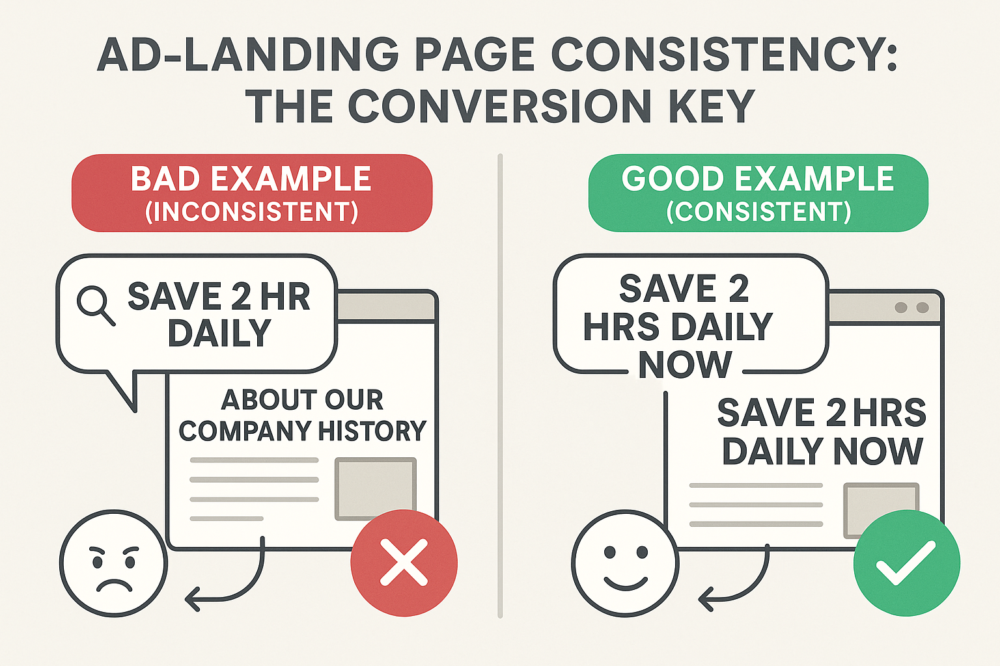
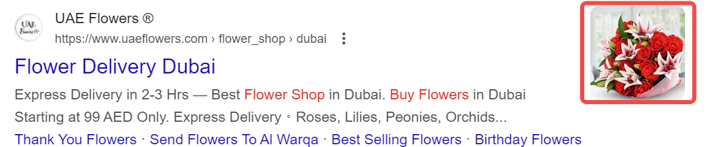

## What is SEM Copy?

SEM (Search Engine Marketing) copy is text content created specifically for online advertising, designed to attract user clicks and increase conversion rates. SEM copy must not only be eye-catching but also practical, capable of guiding potential users to take action, directly impacting ad performance and ROI. **For a more comprehensive understanding of the components of paid search advertising, refer to [ "Paid Search Advertising: An Introductory Guide"](https://chloevolution.com/zh-cn/posts/paid-search/)**.

### Understanding the Components of SEM Ads: Three Main Elements

1.  **Headline**: The first thing users see in the search results. An eye-catching headline can effectively grab user attention and prompt them to click.

2.  **Description**: The content below the headline, detailing the features and benefits of the product or service. It should be problem-solving oriented for user needs, clearly conveying the value proposition.

3.  **URL**: The displayed link address, which influences user decisions. A clear and relevant URL can increase user trust and improve the click-through rate.

      * **Display URL**: The link shown to users in the ad, usually short and relevant to the ad content.
      * **Final URL**: The actual web page address users land on after clicking the ad.

In addition to these three basic elements, **Ad Extensions** are also an indispensable part of modern SEM ads. They significantly enrich ad content and improve click-through rates without increasing click costs. We will cover them in detail in a later section.

## What Constitutes Persuasive SEM Copy?

Persuasive SEM copy is more than just conveying information; it's an art form. In a limited space, it precisely connects user needs with your solutions and inspires action. Writing SEM ad copy is not about stuffing keywords or simply showcasing your brand. Instead, it's about delivering a clear, attractive, and credible promise to users with specific intent, using limited characters, and guiding them to take the next step.

To make this explanation more actionable, we'll use a fictional product as an example throughout:

> Product Background: You are the marketing manager for an online time management tool called **TimeFlow**. Its core selling points are: an extremely minimalist interface, automatic calendar syncing, and team collaboration capabilities. The target audience is small to medium-sized businesses and freelancers.

### 1\. Capture Search Intent, Don't Just Talk About Yourself

SEM advertising is not a stage for brands to talk about themselves; it's an "instant conversation" that responds to user needs. You need to adjust your copy's wording based on user search intent, as users at different stages require different linguistic strategies.

**Search Intent vs. Copy Strategy:**

| Purchase Stage | User Search Example                     | Recommended Copy Strategy       | Example Copy (TimeFlow)                                 |
| -------------- | --------------------------------------- | ------------------------------- | ------------------------------------------------------- |
| **Awareness** | "what are time management tools"        | Provide value, guide exploration | "The Best Time Management Tool for Busy Professionals"  |
| **Consideration** | "Notion vs Todoist vs TimeFlow"         | Highlight differentiating advantages, user trust elements | "Lighter, Faster than Notion: Designed for Teams"       |
| **Conversion** | "subscribe TimeFlow" / "TimeFlow pricing" | Clear offers, urgency, action-oriented | "Sign up now, 30 days free trial, no credit card required" |

**Tip**: Don't use vague phrases like "we are the best." Instead, use user-centric language that directly addresses their actual search purpose.

### 2\. Emphasize Unique Value, Not Generalizations

Continuing with TimeFlow as an example, you should avoid vague terms like "comprehensive," "efficient," or "integrated." Instead, express specific, tangible benefits:

> ❌ **Generalization**: "A comprehensive time management solution"
>
> ✅ **Persuasive**: "Save 2 hours a day, say goodbye to scheduling conflicts"

To come up with a good value proposition, ask yourself these three questions:

1.  What pain point do we solve for users? (**This is often closely related to user needs discovered during [keyword research](https://chloevolution.com/zh-cn/posts/keyword-research-and-targeting/)**)
2.  How are we different from others?
3.  Can it be quantified or exemplified?

### 3\. Use Clear and Powerful Language

Good copy uses precise wording, strong verbs, and tangible actions or results, avoiding "industry jargon" or abstract descriptions. SEM copy space is very limited (for example, Google Ads headlines are typically limited to 30 characters, and descriptions to 90 characters), so precise wording is essential. The following comparison table can be directly applied:

| Scenario        | Recommended Wording                   | Wording Not Recommended      |
| --------------- | ------------------------------------- | ---------------------------- |
| Value Description | "Save time," "Automatic sync"         | "Efficient," "Optimize processes" |
| Social Proof    | "Trusted by 100k users," "4.8-star rating" | "Industry-recognized," "Popular"   |
| Action-Oriented | "Start now," "Free trial"             | "Learn more," "Get info"     |
| Trust Building  | "No credit card required," "Cancel anytime" | "Flexible plans," "Attentive service" |

**Pro Tip**: Verb + specific number or result is the golden formula for SEM copy.

### 4\. Clearly Guide Action (Call to Action)

A strong CTA is key to driving clicks and conversions. Different industries suit different types of CTAs:

| Industry          | Common CTA Examples                       |
| ----------------- | ----------------------------------------- |
| **SaaS Software** | "Start Free Trial" / "Request Demo" / "Sign Up Now" |
| **E-commerce/Retail** | "Shop Now" / "Order Early" / "View Deals"     |
| **Education/Training** | "Get a Free Trial Lesson" / "Download Study Materials" / "Enroll Now" |
| **Financial Services** | "Get a Quote" / "Book a Consultant" / "Calculate Loan Rates" |
| **B2B Services** | "Contact Us" / "Get a Customized Solution" / "Download Case Study" |

For TimeFlow, a strong SEM copy should achieve these four points:

| Principle            | TimeFlow Example Copy                                 |
| -------------------- | ----------------------------------------------------- |
| Responds to search intent | "Best Time Management Tool Recommended"               |
| Clear unique value   | "Save 2 hours a day, auto-sync calendar & meetings"   |
| Specific, powerful wording | "Used by 100k+ teams" instead of "a popular tool"     |
| Clear, driving action | "Start free trial now, no credit card required"       |

> **Remember: Users don't care how great your brand is; they only care: Can you solve their problem, immediately, clearly, and credibly? Deeply understanding this philosophy is the cornerstone of all successful [SEM strategies](https://chloevolution.com/zh-cn/posts/sem-basics/).**

## Ad-to-Landing Page Consistency: The Key to Conversion

Many problems with SEM campaigns aren't about the ad's click-through rate, but about what happens **"after the click."** Users click, but quickly bounce without converting. The root cause is often not a bad product, but rather: **the landing page content doesn't match the ad's promise, creating too much "psychological discrepancy" for the user.**

This is the core issue of "ad-to-landing page consistency": **what you promise, you must deliver immediately.**

Let's look at how TimeFlow can achieve consistency optimization across different campaign paths:

### 1\. Information Consistency: What the Ad Says, the Landing Page Must Respond to Immediately

Suppose your search ad copy is as follows:

  * Headline: Time Management Tool That Saves 2 Hours a Day
  * Description: Auto-syncs calendars, supports team collaboration, try free now

If the landing page users arrive at begins with: "TimeFlow was founded in 2017, committed to advancing digital efficiency," while this company introduction isn't wrong, it doesn't respond to the user's initial reason for clicking the ad. At this point, the user's primary concern isn't your vision, but whether this tool can truly help them save time.

A better approach is to continue the value proposition emphasized in the ad on the landing page's first screen:

  * Headline: "Save 2 Hours a Day, Experience TimeFlow Now"
  * Sub-headline: "Auto-syncs schedules, seamless collaboration, for busy professionals"
  * First screen button: "Free Trial, No Credit Card Required"

The landing page shouldn't make users re-understand or re-evaluate. Instead, it should flow from their interest and intent, continuing the core promise of the ad.

### 2\. Visual and Structural Consistency: Maintaining User Sensory Continuity

An ad brings not just a click, but also an anticipated experience. If a user jumps from a clean, minimalist ad visual to a cluttered, information-dense landing page, they'll feel "this isn't where I just clicked from," which reduces trust.

Elements that should remain consistent include:

  * **Color scheme and typography**: If the ad has a clean blue, white, and gray style, the landing page shouldn't switch to a brand poster-like design.
  * **Tone of voice**: If the ad copy is concise and rational, the landing page shouldn't become emotional or overly playful.
  * **Call-to-action placement**: If the ad emphasizes "free trial," the main action button on the landing page should be prominently placed on the first screen, and the text should be identical.

The essence of consistency is making the user feel that "this is a complete and credible experience."

### 3\. Action Path Consistency: No Interruption from Click to Conversion

The call to action in an ad (e.g., "Sign up for a trial" or "Get a quote") is not just to increase click-through rate, but to set user expectations for the subsequent path. If the action button on the landing page is vague or the action doesn't align, users can easily get lost.

Here's how TimeFlow's example would match:

| Primary Call to Action in Ad | Matching Strategy on Landing Page              | Common Problem Examples      |
| ---------------------------- | ---------------------------------------------- | ---------------------------- |
| Free Trial                   | First-screen button: "Start Free Trial Now," leads to pop-up registration upon click | No button on first screen, or vague button text |
| Get Pricing                  | Prominent pricing form entry, title: "Get Pricing Plan" | Redirects to irrelevant page after form submission |
| Schedule Demo                | Form title: "Schedule Product Demo," concise form fields | Form located too deep, or tedious fields |

A consistent action path reduces user hesitation and increases the likelihood of completing a conversion.

### Consistency Not Only Affects Conversions, But Also Ad Performance and Cost

Beyond conversion effectiveness at the user experience level, consistency also directly impacts overall ad performance on the platform. For example, Google Ads evaluates each ad based on its "Quality Score," which not only determines whether your ad can be displayed but also affects the cost per click.

Quality Score is made up of three main factors:

1.  Expected Click-Through Rate (CTR)
2.  Ad Relevance
3.  Landing Page Experience

The latter two are directly related to consistency. If there's a lack of coherence between the ad copy, keywords, and landing page, the system will deem it a "poor experience," thereby lowering the score. A low Quality Score not only affects impressions but also leads to an increase in click costs.

In other words, neglecting consistency can not only hinder conversion improvements but also lead to structural waste in advertising costs.

## Ad Extensions: Powerful Tools to Enhance Ad Performance

In SEM ad optimization, beyond the main ad copy itself, **Ad Extensions** are also an indispensable and important component. Using ad extensions appropriately can not only enrich ad content and increase the ad's footprint in the search results but also help users quickly get more valuable information, thereby improving click-through rates and Ad Quality Score.

### What are Ad Extensions?

Ad extensions are additional pieces of information provided by search advertising platforms like Google Ads and Microsoft Ads that can be attached alongside your main ad copy, such as:

  * **Sitelinks**: Display more page links, helping users quickly navigate to specific parts of your website.
  

  * **Callout Extensions**: Used to highlight unique selling points, like "Free Shipping" or "24/7 Customer Service."

  * **Structured Snippet Extensions**: List categories of products or services, enhancing product information display.
  

  * **Call Extensions**: Directly display a contact phone number, suitable for businesses that require phone inquiries.

  * **Location Extensions**: Display your business address and provide a map link in the ad, helping users find your physical store.

  * **Price Extensions**: Show the price of products or services directly in the ad, helping users quickly understand cost information.
  

  * **Promotion Extensions**: Highlight current promotions or discount information, incentivizing users to act immediately.

  * **Image Extensions**: Add high-quality images to your ads, making them more vivid and enhancing visual appeal.
  

### Why Use Ad Extensions?

  * **Increase Ad Footprint**: Makes your ad more prominent in search results, attracting user attention.
  * **Add Information Dimensions**: Supplements product details or promotional information that cannot be fully covered by the main ad copy.
  * **Increase Click-Through Rate (CTR)**: Studies show that ads using extensions have significantly higher average CTRs than regular ads.
  * **Improve Quality Score**: Rich information and better user experience help improve Google Ads' Quality Score, reducing click costs.

### How to Use Ad Extensions Effectively?

| Type                  | Applicable Scenarios         | Optimization Suggestions                     |
| --------------------- | ---------------------------- | -------------------------------------------- |
| Sitelinks             | Website with multiple key pages | Choose the most frequently visited or critical pages |
| Call Extensions       | Businesses needing phone conversions | Ensure accurate phone numbers and clear working hours |
| Callout Extensions    | Highlight selling points, service advantages | Be concise and powerful, avoid irrelevant information |
| Structured Snippets   | Brands with rich product categories | Choose the most representative categories, easy to understand |

## How AI is Changing SEM Copywriting?

AI is driving transformation in SEM copy creation in multiple ways, enhancing efficiency and accuracy. **Large language models like GPT-4, Gemini, and AI assistants built into various marketing automation platforms** are, to varying degrees, changing the ad copy generation, analysis, and optimization processes:

| Application Scenario              | Specific Role                                        | Advantages Gained                                        |
| --------------------------------- | ---------------------------------------------------- | -------------------------------------------------------- |
| Rapid generation of multiple copy versions | AI generates multiple ad copies in different styles based on keywords and core information | Saves creation time, enriches alternative options, facilitates A/B testing |
| User search intent analysis       | AI analyzes large volumes of search behavior to accurately identify user needs and pain points | Copy is more aligned with user psychology, improving CTR and CVR |
| Real-time intelligent copy optimization | Machine learning dynamically adjusts headline and description combinations, automatically matching the best content | Reduces manual trial and error, flexibly adapts to diverse users and environmental changes |
| Intelligent linking of copy and landing pages | AI combines user behavior to automatically recommend or adjust corresponding landing page content | Achieves closed-loop optimization from click to conversion, improving overall effectiveness |

Google's recently launched smart ad products like **AI Max Search** further integrate AI deeply into all aspects of search advertising, from keyword matching to copy creation, and then to campaign optimization. This helps advertisers achieve more efficient and precise ad management and improved results. **However, regardless of technological advancements, a deep understanding of user intent and a precise expression of brand value remain the core of any successful ad copy. AI is merely a powerful auxiliary tool.**

## FAQ

### Q1: When writing SEM copy, how can I avoid ad creative fatigue?

**A1:** Ad creative fatigue occurs when users repeatedly see the same ad copy and become bored, leading to a decline in click-through rate and performance. To avoid creative fatigue, you need to:

1.  **Regularly A/B test**: Continuously experiment with different headlines, descriptions, and calls to action.
2.  **Diversify information**: Emphasize different selling points, benefits, or use cases of your product or service in various ad copies.
3.  **Utilize ad extensions**: Provide fresh appeal and more value to users through sitelinks, promotion information, etc., without changing the main ad copy.
4.  **Monitor competitors**: Analyze competitor ad strategies to find new creative inspiration.
5.  **Leverage AI tools**: Use AI to quickly generate multiple copy versions for rapid iteration and testing.

### Q2: Should I directly mention prices in my ad copy?

**A2:** This depends on your product strategy and target audience.

  * **Advantages of mentioning price**: It can filter out users whose budget doesn't match, increase the precision of click intent, and potentially improve conversion rates. This is especially effective for competitively priced products or services.
  * **Advantages of not mentioning price**: It can attract a broader user base, and you can educate and persuade users with more information on the landing page.

If your product's price is transparent and competitive, or you have a clear promotional offer, **consider using Price Extensions or mentioning it directly in the description**. The final decision should be based on A/B test results.

### Q3: What is Quality Score and why is it important?

**A3:** Quality Score is a diagnostic tool Google Ads uses to measure the relevance and quality of your ads, keywords, and landing pages, with a score ranging from 1-10. It's mainly influenced by three factors:

1.  **Expected Click-Through Rate (Expected CTR)**: Your ad's anticipated click performance for a given keyword.
2.  **Ad Relevance**: How closely your ad copy relates to your keywords.
3.  **Landing Page Experience**: The relevance of your landing page to your ad and keywords, user-friendliness, loading speed, etc.

**Why is it important?** A high Quality Score means your ad is more likely to get a **higher ad rank at a lower Cost Per Click (CPC)**. Simply put, it helps you get better ad positions for less money. Writing high-quality ad copy and optimizing your landing page are key to improving Quality Score. **For more details on Quality Score, refer to the article [ "The Complete Guide to SEM Data Analysis"](https://chloevolution.com/zh-cn/posts/sem-analytics/)**.

