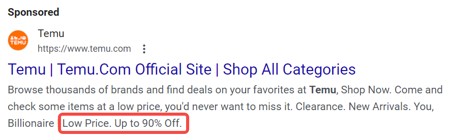

## What is SEM copy?

SEM (search engine marketing) copy is text content created specifically for online advertising, designed to attract users to click and increase conversion rates. SEM copywriting should not only attract attention, but also be practical, able to guide potential users to take action, and directly affect the effectiveness and ROI of advertising.

### Understand the composition of SEM ad copy: three main elements

1. **Title**: The part that users see at first glance in the search results. A striking title can effectively attract users' attention and stimulate their desire to click.

2. **Description**: The content below the title, which details the features and advantages of the product or service. It should be oriented towards solving user needs and clearly convey the value proposition.

3. **URL**: The displayed link address, which influences user decisions. A clear and relevant URL can increase user trust and increase click-through rate.

- **Display URL**: The link displayed to users in the ad, usually short and relevant to the ad content.

- **Destination URL**: The actual web page address that users jump to after clicking the ad.

### Requirements for SEM copy on various advertising platforms

| Platform | Title | Description | URL |
|----------|----------------|-----------------------|--------------------|
| [Google Ads](https://support.google.com/google-ads/answer/7684791) | Up to 30 characters | Up to 90 characters | It is recommended to be concise and clear |
| [Bing Ads](https://help.ads.microsoft.com/apex/index/22/en/14019) | Up to 30 characters | Up to 90 characters | It is recommended to be brief and relevant |
| Yahoo | Up to 30 characters | Up to 90 characters | It is recommended to be brief and relevant |
| Baidu | Up to 40 characters | Up to 80 characters | URL must be clear |
| Yandex | Up to 30 characters | Up to 90 characters | It is recommended to be concise and clear |
| DuckDuckGo | Up to 30 characters | Maximum 90 characters | URL must be clear |

## How to write a good SEM copy?

### 1. Thorough research

The first step to writing a good SEM copy is thorough research and planning, including:

#### Identify your unique selling proposition (USP)
USP (Unique selling proposition) refers to the unique advantages of your product or service compared to your competitors. In this step, you need to identify the needs, pain points and preferences of your target users, analyze the user's purchase decision process, and understand the factors they care about (such as price, quality, service, etc.).
- **Method**:
    - Conduct market research and user interviews to obtain direct feedback.
    - Create user portraits to depict the characteristics and behavior patterns of typical customers.
- **Tools**:
    - SurveyMonkey or Google Forms: for designing and distributing online questionnaires.
    - HubSpot Persona Generator: create detailed user portraits.

#### Keyword research
Keywords are words that users enter into search engines. Through [effective keyword research](https://chloevolution.com/posts/keyword-research-and-targeting/), you can identify the user's search intent and needs, thereby optimizing your copy and increasing the visibility and click-through rate of your ads. 

The most important thing in this step is to determine the user's true search intent, that is, to understand the user's goal when searching, whether to obtain information, compare products or purchase directly. At the same time, you need to determine the classification of keywords, including informational keywords, transactional keywords, etc.

- **Method**:
    - Analyze relevant topics and questions that users may ask to help identify potential keywords.
    - Observe social media and forums to understand the hot spots and concerns of user discussions.
    - Use keyword tools to find related keywords and analyze the potential of each keyword.
    - Focus on long-tail keywords, which usually have less competition and higher conversion rates.
- **Tools**:
    - AnswerThePublic: Generate questions related to specific topics to help identify informational keywords.
    - Google Trends: Analyze the search trends and popularity of keywords.
    - Google Keyword Planner: Provides keyword search volume and competition to help formulate advertising strategies.
    - SEMrush or Ahrefs: Analyze keyword rankings and traffic potential.

#### Landing Page Consistency
The [landing page](https://chloevolution.com/posts/best-landing-page-layouts-with-webform/) is the page that users visit after clicking on an ad. Ensuring that your ad copy is consistent with the content of the landing page to provide a consistent user experience is key to improving conversion rates. What the ad copy promises must be met on the landing page to avoid disappointment for users.
- **Method**:
    - Compare ad copy and landing page content to ensure that key points and value propositions are consistent.
    - Use similar titles and descriptions to enhance user trust.
- **Tools**:
    - Grammarly: Check for consistency and grammatical errors in copy.
    - Google Optimize: Test different versions of landing pages and observe conversion effects.

#### Competitive SEM Copy Analysis
Collect and study [competitors' SEM copy](https://chloevolution.com/posts/ppc-ad-spy/), analyze their successes and shortcomings, find opportunities for improvement and differentiation, and develop more effective copy strategies.
- **Method**:
    - Use your keywords in the search engine and observe the ads of top-ranked competitors.
    - Save ad copy and screenshots for subsequent analysis.
    - Compare your USP with competitor copy and identify areas for improvement.
- **Tools**:
    - SWOT Analysis Tool: Helps you systematically evaluate the strengths and weaknesses of your competitors.
    - SEMrush: View competitor advertising history and strategies.
    - AdSpy: Analyze competitor ads on social media and search engines.

### 2. Start writing

Before discussing more detailed writing techniques, it is important to make it clear that no matter what your product or service is, the **core principle** of SEM copywriting is: **cater to the pain points of your target audience**. Once you deviate from this principle, your ad conversion rate will definitely be negatively affected (even if the click-through rate is good).

When writing SEM copy, the key is how to attract users and prompt them to take action. Let's take an environmentally friendly water bottle as an example. This product not only solves the needs of users, but also has a sense of social responsibility. We will use several key elements to show how to write effective SEM copy so that it can not only capture the attention of the target audience but also increase conversion rates.

#### Insert target keywords
Naturally integrate relevant keywords into the copy to increase the search visibility and click-through rate of the ad. Suppose you sell environmentally friendly water bottles, the keywords can be "reusable water bottles" and "environmentally friendly water bottles".
- **Positive Example**:
    - Ad Title: "Eco-friendly water bottles, help you reduce plastic waste"
    - Description: "Buy our reusable water bottles and enjoy 10% off! Keep drinking water healthy and save the planet!"

- **Negative Example**:
    - Title: "Come here to buy water bottles!"
    - Description: "We have a lot of choices!" (No keywords used)

Through effective keyword insertion, users are more likely to find your ads when searching, increasing click-through rates, while negative examples may cause your ads to be ignored.

#### Social Testimonials and Public Recommendations
Use user reviews and testimonials to enhance the credibility of your ads. Social testimonials can help build trust with potential customers, especially in a competitive market. Customers who see positive feedback from other users are more likely to click on your ads and ultimately purchase.
- **Positive Case**:
Quote real user reviews in ads, such as: "This water bottle has really changed my life. It is convenient and environmentally friendly! - Miss Zhang"

- **Negative Case**:
"Our water bottle is very useful. Welcome to buy it!" (Lack of specific user feedback)

The negative case lacks specific user recommendations, which may cause customers to doubt and be unwilling to buy.

#### Strong and clear CTA (call to action)

CTA is a key element to guide users to take action and must be concise and clear. A clear CTA can eliminate users' doubts and clearly tell them what to do next, thereby increasing conversion rates.

- **Positive Case**:
Use a strong CTA in ads, such as: "Buy now and enjoy a limited-time 10% discount!"

- **Negative Case**:
"Want to learn more?" (vague and unclear)

The negative case does not clearly guide users to the next step, which may cause potential customers to feel confused and miss the opportunity to buy.

#### Use numbers and statistics
Numbers and statistics can effectively enhance the persuasiveness of copywriting. Specific numbers make the copy more authoritative, better able to attract users' attention and enhance their confidence in buying.

- **Positive case**:
"90% of users reported that using our environmentally friendly water bottles reduced plastic use by 30%!"

- **Negative case**:
"Our water bottles are very popular!"

The lack of specific data in the negative case makes the ad unconvincing, and users may not be convinced, reducing their willingness to click and buy.

#### Create a sense of urgency
Motivate users to act quickly through time limits or scarcity. The sense of urgency can stimulate users' desire to buy, prevent them from delaying decisions, and increase conversion rates.

- **Positive case**:
"Only 100 water bottles left, hurry up and buy! The event is limited to 48 hours!"

- **Negative case**:
"We always have stock, welcome to buy!"

The lack of urgency in the negative case may cause users to delay decision-making and miss the opportunity to buy.

#### Use benefit-oriented language
Emphasize the benefits that users can get, not just the features of the product. Benefit-oriented language can stimulate users' emotional resonance and make them realize the value of the product, making it easier for them to make a purchasing decision.

- **Positive case**:
"By using our water bottle, you can not only stay hydrated, but also contribute to protecting the environment!"

- **Negative case**:
"Our water bottles come in many colors to choose from."

Negative cases only list product features, fail to touch on users' needs and benefits, and reduce purchasing motivation.

### 3. Test and Optimization
#### A/B Test
A/B test is an experimental method that compares two different versions of ad copy (version A and version B) at the same time to evaluate which version performs better, thereby improving the click-through rate (CTR) and conversion rate (CVR) of SEM copy.

It includes the following steps:
1. **Clear goal**: Determine the goal of the test, such as improving click-through rate or increasing purchase conversion.

2. **Select variables**: Select specific elements to be tested, such as titles, descriptions, CTA, etc.

3. **Create two versions**: Design version A and version B, and ensure that other conditions remain consistent for easy comparison.

4. **Randomly assign traffic**: Randomly assign users to the two versions to ensure that each version receives the same amount of traffic.

5. **Collect data**: Monitor the performance of each version and record key indicators such as click-through rate, conversion rate, etc.

6. **Analyze results**: Evaluate which version performs better and make decisions based on data.

7. **Implement optimization**: Select the best performing version and launch it in the ad, while considering continuing to test other variables.

Some tools that can be used for SEM copy A/B testing:
- **[Google Optimize](https://optimize.google.com)**: A powerful tool for performing A/B testing, suitable for testing websites and ad copy.
- **[Optimizely](https://www.optimizely.com)**: Provides a comprehensive A/B testing solution, easy to use, suitable for all types of companies.
- **[VWO (Visual Website Optimizer)](https://vwo.com)**: Can perform A/B testing, split testing, etc., with a friendly interface, suitable for beginners.
- **[Adobe Target](https://business.adobe.com/products/target/adobe-target.html)**: An enterprise-level A/B testing tool suitable for large-scale advertising testing.

#### Use ad extensions
In SEM advertising, ad extensions are an important tool to enhance advertising effectiveness, providing additional information and interactive options, ultimately achieving higher conversion rates.

##### Sitelink

Add additional links to different parts of the website, such as product pages, customer reviews, or FAQs, to help users quickly find the information they need and increase the chance of clicking.

For example: in an eco-friendly water bottle ad, add links to the pages of "Customer Reviews", "Environmental Concepts", and "Purchase Options". Users can directly visit these links to learn more about the relevant information.

##### Callout
Add a short text to the ad to highlight the unique advantages of the product, such as "BPA-free", "Free Shipping", and "30-day Money Back Guarantee", to enhance the attractiveness of the ad, provide more information that users care about, and encourage them to click on the ad.

For example: In the eco-friendly water bottle ad text, include additional instructions such as "Eco-friendly Water Bottle, Free Shipping, 30-day Money Back Guarantee!" to make users feel the extra value.

##### Structured Snippet

Show specific features of a product or service, such as "color", "brand", "type", etc. Provide users with key information to help them make faster choices during the decision-making process.

For example: In an ad for an eco-friendly water bottle, use a structured snippet such as "Color: Blue, Green, Red" to help users quickly understand the available colors.

##### Location extension
Show the business address and provide a map link in the ad to help users find the physical store location, thereby increasing store traffic. This is especially effective for physical stores or service providers.

##### Call extension
Add a phone number to the ad so that users can call directly for consultation, making it easier for users to get more information and increase consultation and conversion rates.

##### Price extension

Show the price of a product or service in the ad to help users quickly understand the cost information. Improve price transparency and attract price-sensitive customers.

For example: In an ad for an eco-friendly water bottle, displaying "Only $19.99" directly lets users know the price, thereby increasing their desire to buy.

##### Promotion extension

Highlight current promotions or discount information to motivate users to take immediate action and increase click-through and conversion rates.

For example: Ads can include promotional information such as "Buy now and enjoy 20% off!" to attract users to click immediately.

##### App (application extension)
Guide users to download mobile apps, increase app downloads, and increase app usage.

For example: Add a link to "Download our app and get exclusive offers!" to encourage users to download the app.

##### Image extension

Add high-quality images to ads to make them more vivid, enhance visual appeal, and increase user click-through rates and brand awareness.

#### Optimize advertising results with reference to Quality Score
Quality score is an important indicator used by search engines (such as Google) to evaluate the quality and relevance of advertisements. It is usually expressed as a score of 1 to 10. The higher the score, the better the quality of the advertisement. . It is usually evaluated based on the following factors:
- **Click-through rate (CTR)**: the frequency of advertisements being clicked in search results.
- **Ad relevance**: the degree of match between the advertisement content and the keywords.
- **Landing page experience**: the quality of the page visited by users after clicking on the advertisement, including loading speed, content relevance, and user experience.

Quality score directly affects the ranking and cost per click (CPC) of advertisements. Ads with high scores can not only get better positions in search results, but also enjoy lower click costs. Conversely, low quality scores may cause advertisements to fail to display or require higher fees.

#### Pay attention to changes in search trends
Paying attention to changes in search trends helps to understand changes in user interests and needs, thereby optimizing SEM copywriting and advertising strategies. By analyzing search trends, you can discover popular keywords, seasonal changes, and changes in user preferences, and adjust advertising content in a timely manner to improve relevance and click-through rate.

You can monitor the changing trends of keyword search popularity through the following tools:
- **[Google Trends](https://trends.google.com)**: By looking at the search frequency of specific keywords, you can understand their popularity in different times and regions.
- **[Google Keyword Planner](https://ads.google.com/home/tools/keyword-planner/)**: A tool in Google Ads that can discover new keywords and analyze their search volume and trends.
- **[SEMrush](https://www.semrush.com)**: Provides comprehensive SEO and SEM tools, including keyword analysis, competitor research, and trend monitoring.
- **[Ahrefs](https://ahrefs.com)**: A powerful SEO tool that provides keyword research, content analysis, and search trend monitoring.
- **[BuzzSumo](https://buzzsumo.com)**: Used for content analysis and trend monitoring, it helps you discover popular content and social media performance related to a specific topic.

#### Use AI to improve creation and optimization efficiency

Artificial intelligence (AI) technology is changing the way SEM copy is created and optimized. By using AI tools, we can improve the quality of copy, increase efficiency, and achieve data-driven decision-making.

| Function | Corresponding tools | Introduction |
|------------------------|-------------------------------------|----------------------------------------------|
| Automatically generate copy | **Jasper** | AI writing assistant, generate multiple versions of advertising copy based on input. |
| | **Copy.ai** | Provides a variety of copy styles and quickly generates marketing content. |
| Data analysis and optimization | **Google Ads** | Provides advertising performance data analysis to help identify the best copy. |
| | **SEMrush** | Monitors advertising performance and provides optimization suggestions. |
| Keyword optimization | **Ahrefs** | Analyzes keyword trends and search volume to optimize copy keywords. |
| | **Moz Keyword Explorer** | Provides keyword research and related suggestions. |
| Personalized copy recommendation | **Dynamic Yield** | Implement personalized advertising content recommendation and generate copy based on user behavior data. |
| | **Evergage** | Generate personalized marketing content using real-time data. |
| A/B test optimization | **Optimizely** | Automate the A/B testing process to quickly identify the best copy combination. |
| | **Google Optimize** | Conduct A/B testing, analyze ad performance, and adjust copy. |

## SEM Ad Copy Checklist

| Check Items | Description | Completion Status |
|------------------------------|----------------------------------------------------------|--------|
| **Research and Planning** | | |
| Identify Unique Selling Points (USP) | Ensure that the unique advantages of the product or service are clear, and analyze user needs and pain points. | |
| Keyword Research | Identify user search intent and select relevant keywords, including long-tail keywords. | |
| Landing Page Consistency | Ensure that the ad copy is consistent with the landing page content to enhance the user experience. | |
| Competitive SEM Copy Analysis | Study competitor copy and find opportunities for improvement and differentiation. | |
| **Writing Copy** | | |
| Insert Target Keywords | Naturally integrate relevant keywords to improve search visibility. | |
| Social Testimonials and Public Recommendations | Use real user reviews to enhance credibility. | |
| Powerful and Clear CTA | Clearly guide users to take action and use concise call-to-action language. | |
| Use numbers and statistics | Provide specific data to enhance persuasion. | |
| Create a sense of urgency | Motivate users to act quickly through time limits or scarcity. | |
| Use benefit-oriented language | Emphasize the benefits that users can obtain and touch emotional resonance. | |
| **Testing and optimization** | | |
| A/B testing | Design and test different versions of ad copy and analyze performance. | |
| Use ad extensions | Add extensions such as website links, phone numbers, and locations to provide additional information. | |
| Refer to quality scores | Pay attention to the quality scores of ads and optimize click-through rates and conversion rates. | |
| Pay attention to changes in search trends | Monitor changes in keyword search popularity and adjust ad content. | |
| Use AI to improve creation and optimization efficiency | Improve the quality and efficiency of copywriting through AI tools. | |

## FAQ
### What is the difference between SEM and advertising? 

SEM (search engine marketing) mainly refers to the promotion of products or services through search engines, usually including paid search ads (such as Google Ads) and search engine optimization (SEO). Advertising is a broader concept that covers all forms of marketing communications, including TV ads, social media ads, outdoor ads, etc. In simple terms, SEM focuses on acquiring traffic on search engines, while advertising is marketing activities on any channel.

### Is SEM the same as AdWords?

SEM and AdWords are not exactly the same. SEM (search engine marketing) is a broad term that covers all paid advertising and natural search optimization activities conducted through search engines. AdWords is a specific paid advertising service provided by Google (now called Google Ads), which is part of SEM. In other words, AdWords is a tool to achieve SEM goals, focusing on displaying ads through the Google search engine.

### Is Google Ads SEO or SEM?

Google Ads belongs to SEM (search engine marketing). SEM includes paid advertising and natural search optimization, while Google Ads is a way to display ads in Google search results by paying. SEO (search engine optimization) is a method of improving natural search rankings by optimizing website content and structure.