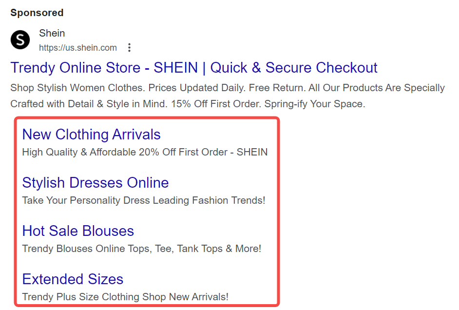
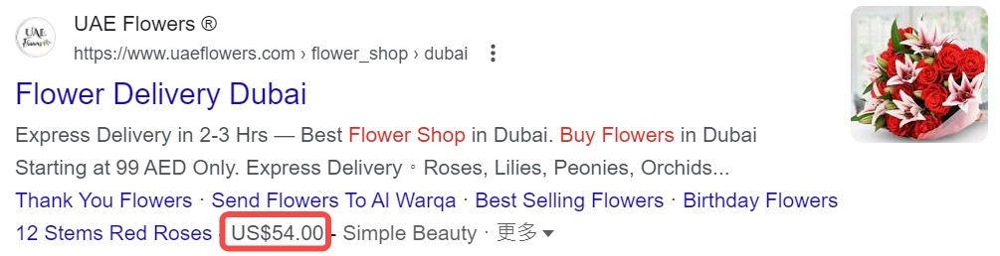

## 什么是SEM文案？

SEM（搜索引擎营销）文案是专门为在线广告创建的文本内容，旨在吸引用户点击并提升转化率。SEM文案不仅要吸引眼球，还需具备实用性，能够引导潜在用户采取行动，直接影响广告的效果与ROI。

### 理解SEM广告的构成：三个主要元素

1. **标题**：用户在搜索结果中第一眼看到的部分。一个引人注目的标题能够有效地吸引用户的注意力，激发他们的点击欲望。

2. **描述**：标题下方的内容，详细阐述产品或服务的特点和优势。它应以解决用户需求为导向，清晰传达价值主张。

3. **URL**：显示的链接地址，影响用户的决策。清晰且具有相关性的URL能够增加用户的信任感，提升点击率。
   - **显示URL**：在广告中显示给用户的链接，通常简短且与广告内容相关。
   - **目标URL**：用户点击广告后跳转到的实际网页地址。

### 各广告平台对SEM文案的要求

| 平台         | 标题           | 描述                  | URL                |
|--------------|----------------|-----------------------|--------------------|
| [Google Ads](https://support.google.com/google-ads/answer/7684791)   | 最多30个字符  | 最多90个字符  | 建议简洁明了      |
| [Bing Ads](https://help.ads.microsoft.com/apex/index/22/en/14019)     | 最多30个字符  | 最多90个字符  | 建议简短且相关    |
| Yahoo        | 最多30个字符  | 最多90个字符          | 建议简短且相关    |
| Baidu        | 最多40个字符  | 最多80个字符          | URL需清晰          |
| Yandex       | 最多30个字符  | 最多90个字符  | 建议简洁明了      |
| DuckDuckGo   | 最多30个字符  | 最多90个字符          | URL需清晰          |

## 怎么写出好的SEM文案？

### 1. 充分调研

写出好的SEM文案的第一步是充分的调研与规划，包括：

#### 确定你的独特卖点（USP）
USP（Unique selling proposition）是指你的产品或服务相较于竞争对手的独特优势。在这一步你需要确定目标用户的需求、痛点和偏好，分析用户的购买决策过程，了解他们关注的因素（如价格、质量、服务等）。
- **方法**：
  - 进行市场调研和用户访谈，以获取直接反馈。
  - 创建用户画像，描绘出典型客户的特征和行为模式。
- **工具**：
  - SurveyMonkey 或 Google Forms：用于设计和分发在线问卷。
  - HubSpot Persona Generator：创建详细的用户画像。

#### 关键词研究
关键词是用户在搜索引擎中输入的词语。通过[有效的关键词研究](https://chloevolution.com/zh-cn/posts/keyword-research-and-targeting/)，可以识别用户的搜索意图和需求，从而优化你的文案，提高广告的可见性和点击率。这一步最重要的是确定用户的真实搜索意图，即理解用户在搜索时的目标，是获取信息、比较产品还是直接购买。同时，你需要确定关键词的分类，包括信息型关键词、交易型关键词等。
- **方法**：
  - 分析相关话题和用户可能提出的问题，帮助识别潜在关键词。
  - 观察社交媒体和论坛，了解用户讨论的热点和关注点。
  - 利用关键词工具查找相关关键词，分析每个关键词的潜力。
  - 重点关注长尾关键词，这些关键词通常竞争较小，转化率更高。
- **工具**：
  - AnswerThePublic：生成与特定主题相关的问句，帮助识别信息型关键词。
  - Google Trends：分析关键词的搜索趋势和流行度。
  - Google Keyword Planner：提供关键词的搜索量和竞争情况，帮助制定广告策略。
  - SEMrush 或 Ahrefs：分析关键词的排名情况和流量潜力。

#### 落地页一致性
[落地页](https://chloevolution.com/zh-cn/posts/best-landing-page-layouts-with-webform/)是用户点击广告后访问的页面。确保你的广告文案与落地页内容一致，以提供一致的用户体验，是提升转化率的关键。广告文案承诺的内容必须在着陆页上得到满足，避免用户感到失望。
- **方法**：
  - 比较广告文案和着陆页内容，确保关键点和价值主张一致。
  - 使用相似的标题和描述，以增强用户的信任感。
- **工具**：
  - Grammarly：检查文案的一致性和语法错误。
  - Google Optimize：测试不同版本的着陆页，观察转化效果。

#### 竞品SEM文案分析
收集和研究[竞争对手的SEM文案](https://chloevolution.com/zh-cn/posts/ppc-ad-spy/)，分析他们的成功之处和不足之处，找到改进和差异化的机会，从而制定更有效的文案策略。
- **方法**：
  - 在搜索引擎中使用你的关键词，观察排名前列的竞争对手的广告。
  - 保存广告文案和截图，以便后续分析。
  - 比较你的USP与竞争对手的文案，找出能够加强的领域。
- **工具**：
  - SWOT分析工具：帮助你系统性地评估竞争对手的强弱。
  - SEMrush：查看竞争对手的广告历史和策略。
  - AdSpy：分析社交媒体和搜索引擎上的竞争对手广告。

### 2. 开始撰写

在讨论更加细节的撰写技巧之前，需要明确的是，无论你的产品或服务是什么，SEM文案撰写的**核心原则**都是：**迎合你的目标受众的痛点**。一旦偏离了这个原则，你的广告转化率肯定会受负面影响（即使点击率很不错）。
在撰写SEM文案时，关键在于如何吸引用户并促使他们采取行动。假设我们以一款环保水瓶为例，这个产品不仅解决了用户的需求，还具备社会责任感。我们将通过几个关键要素来展示如何撰写出高效的SEM文案，使其既能抓住目标受众的注意，又能提升转化率。

#### 插入目标关键词
将相关关键词自然地融入文案中，以提高广告的搜索可见性和点击率。假设你销售环保水瓶，关键词可以是“可重复使用水瓶”、“环保水瓶”。
- **正面案例**：
    - 广告标题：“环保水瓶，助你减少塑料浪费”
    - 描述：“购买我们的可重复使用水瓶，享受10%优惠！保持饮水健康，拯救地球！”

- **反面案例**：
    - 标题：“买水瓶就来这里！”
    - 描述：“我们有很多选择！”（没有使用关键词）

通过有效的关键词插入，用户在搜索时更容易找到你的广告，提高了点击率，而反面案例则可能导致广告被忽视。

#### 社会证言和公众推荐
利用用户评价和推荐信来增强广告的可信度。社会证言能够帮助潜在客户建立信任，尤其是在竞争激烈的市场中。客户看到其他用户的积极反馈，更可能点击广告并最终购买。
- **正面案例**：
  在广告中引用真实用户的评价，比如：“这款水瓶真的改变了我的生活，使用起来方便又环保！——张小姐”

- **反面案例**：
  “我们的水瓶很好用，欢迎大家购买！”（缺乏具体的用户反馈）

反面案例缺乏具体用户的推荐，可能导致客户产生怀疑，从而不愿意购买。

#### 强有力且清晰的CTA（号召性用语）
CTA是引导用户采取行动的关键元素，必须简洁明了。清晰的CTA能够消除用户的疑虑，明确告诉他们下一步该做什么，从而提高转化率。

- **正面案例**：
  在广告中使用强有力的CTA，比如：“立即购买，享受限时9折优惠！”

- **反面案例**：
  “想要了解更多信息？”（模糊且不明确）

反面案例没有明确引导用户的下一步，可能导致潜在客户感到迷茫，从而错失购买机会。

#### 使用数字和统计数据
数字和统计数据能够有效增强文案的说服力。具体的数字使文案更具权威性，能够更好地吸引用户的注意，增强购买的信心。

- **正面案例**：
  “90%的用户反馈，使用我们的环保水瓶后减少了30%的塑料使用！”

- **反面案例**：
  “我们的水瓶很受欢迎！”

反面案例缺乏具体数据，使得广告缺乏说服力，用户可能不信服，降低了点击和购买的意愿。

#### 创造紧迫感
通过时间限制或稀缺性激励用户快速行动。紧迫感能够刺激用户的购买欲望，避免他们拖延决策，提高转化率。

- **正面案例**：
  “仅剩100个水瓶，赶快抢购！活动仅限48小时！”

- **反面案例**：
  “我们随时都有库存，欢迎购买！”

反面案例缺乏紧迫感，可能导致用户拖延决策，从而错失购买机会。

#### 使用以好处为导向的语言
强调用户能够获得的好处，而不仅仅是产品的特点。好处导向的语言能够激发用户的情感共鸣，让他们意识到产品的价值，从而更容易做出购买决策。

- **正面案例**：
  “通过使用我们的水瓶，你不仅能保持水分充足，还能为保护环境贡献一份力量！”

- **反面案例**：
  “我们的水瓶有很多颜色可供选择。”

反面案例只是列举产品特性，未能触及用户的需求和利益，降低了购买动机。

### 3. 测试与优化
#### A/B测试
A/B测试是一种实验方法，通过同时对比两个不同版本的广告文案（版本A和版本B），来评估哪一个版本的表现更好，从而提高SEM文案的点击率（CTR）和转化率（CVR）。

包括以下几个步骤：
1. **明确目标**：确定测试的目标，例如提高点击率或增加购买转化。

2. **选择变量**：选择要测试的具体元素，比如标题、描述、CTA等。

3. **创建两个版本**：设计版本A和版本B，确保其他条件保持一致，以便于比较。

4. **随机分配流量**：将用户随机分配到两个版本，确保每个版本获得同等规模的流量。

5. **收集数据**：监测每个版本的表现，记录关键指标如点击率、转化率等。

6. **分析结果**：评估哪个版本表现更好，基于数据做出决策。

7. **实施优化**：选择表现最佳的版本并在广告中上线，同时考虑继续测试其他变量。

一些可用于SEM文案A/B测试的工具：
- **[Google Optimize](https://optimize.google.com)**：用于执行A/B测试的强大工具，适合网站和广告文案的测试。
- **[Optimizely](https://www.optimizely.com)**：提供全面的A/B测试解决方案，易于使用，适合各类企业。
- **[VWO (Visual Website Optimizer)](https://vwo.com)**：可以进行A/B测试、分割测试等，界面友好，适合新手。
- **[Adobe Target](https://business.adobe.com/products/target/adobe-target.html)**：一款企业级的A/B测试工具，适合大规模广告测试。

#### 使用广告扩展
在SEM广告中，广告扩展是增强广告效果的重要工具，可以提供额外的信息和互动选项，最终实现更高的转化率。

##### Sitelink（网站链接扩展）

在广告中添加额外链接，指向网站的不同部分，如产品页面、客户评价或常见问题等，帮助用户快速找到所需信息，增加点击的机会。

例如：在环保水瓶广告中，添加链接到“客户评价”、“环保理念”、“购买选项”的页面。用户可以直接访问这些链接，了解更多相关信息。

##### Callout（附加说明扩展）
在广告中添加简短的文本，突出产品的独特优势，如“无 BPA”、“免费送货”、“30天退款保证”，增强广告吸引力，提供更多用户关注的信息，促使他们点击广告。

例如：在环保水瓶广告文本中包含“环保水瓶，免费送货，30天退款保证！”这样的附加说明，让用户感受到额外的价值。

##### Structured Snippet（结构化片段扩展）

展示产品或服务的特定特性，如“颜色”、“品牌”、“类型”等。为用户提供关键信息，帮助他们在决策过程中做出更快的选择。

例如：在环保水瓶的广告中，使用“颜色：蓝色、绿色、红色”这样的结构化片段，帮助用户快速了解可选颜色。

##### Location（位置扩展）

显示企业地址，并在广告中提供地图链接，帮助用户找到实体店位置，从而提高到店流量。尤其对于实体店或服务提供商非常有效。

##### Call（电话扩展）
在广告中添加电话号码，用户可以直接拨打进行咨询，方便用户获取更多信息，提高咨询和转化率。

##### Price（价格扩展）

在广告中显示产品或服务的价格，帮助用户快速了解费用信息。提高价格透明度，吸引对价格敏感的客户。

例如：在环保水瓶广告中，显示“只需$19.99”，直接让用户了解价格，从而提高购买欲望。

##### Promotion（促销扩展）

突出当前的促销活动或折扣信息，激励用户立即行动，增加点击率和转化率。

例如：广告中可以包含“现在购买，享受20%折扣！”的促销信息，吸引用户立刻点击。

##### App（应用扩展）
引导用户下载移动应用，提升应用下载量，增加应用的使用率。

例如：在广告中添加“下载我们的应用，获取独家优惠！”的链接，鼓励用户下载应用程序。
##### Image（图片扩展）

在广告中添加高质量图片，使广告更生动，增强视觉吸引力，提升用户点击率和品牌认知度。

#### 参考质量得分优化广告效果
质量得分是搜索引擎（如Google）用来评估广告质量和相关性的一个重要指标，通常以1到10的分数表示，得分越高，意味着广告的质量越好。。它通常基于以下几个因素进行评估：
- **点击率（CTR）**：广告在搜索结果中被点击的频率。
- **广告相关性**：广告内容与关键词的匹配程度。
- **着陆页体验**：用户点击广告后访问的页面质量，包括加载速度、内容相关性和用户体验等。

质量得分直接影响广告的排名和每次点击费用（CPC）。得分高的广告不仅可以在搜索结果中获得更好的位置，还能享受更低的点击成本。反之，低质量得分可能导致广告无法展现或需要支付更高的费用。

#### 关注搜索趋势变化
关注搜索趋势变化有助于了解用户的兴趣和需求的变化，从而优化SEM文案和广告策略。通过分析搜索趋势，可以发现热门关键词、季节性变化和用户偏好的转变，及时调整广告内容以提高相关性和点击率。

可以通过以下工具监控关键词搜索热度的变化趋势：
- **[Google Trends](https://trends.google.com)**：通过查看特定关键词的搜索频率，了解其在不同时间和地区的受欢迎程度。
- **[Google Keyword Planner](https://ads.google.com/home/tools/keyword-planner/)**：Google Ads中的工具，可以发现新关键词并分析其搜索量和趋势。
- **[SEMrush](https://www.semrush.com)**：提供全面的SEO和SEM工具，包括关键词分析、竞争对手研究和趋势监测。
- **[Ahrefs](https://ahrefs.com)**：强大的SEO工具，提供关键词研究、内容分析和搜索趋势的监测。
- **[BuzzSumo](https://buzzsumo.com)**：用于内容分析和趋势监测，帮助您发现与特定主题相关的热门内容和社交媒体表现。

#### 利用AI提高创作和优化效率

人工智能（AI）技术正在改变SEM文案的创作和优化方式。通过利用AI工具，我们可以提高文案质量、提升效率，并实现数据驱动的决策。

| 功能                     | 对应工具                                 | 简介                                           |
|------------------------|-------------------------------------|----------------------------------------------|
| 自动生成文案              | **Jasper**                           | AI写作助手，根据输入生成多版本广告文案。              |
|                        | **Copy.ai**                         | 提供多种文案风格，快速生成营销内容。                  |
| 数据分析与优化            | **Google Ads**                      | 提供广告表现数据分析，帮助识别效果最佳的文案。         |
|                        | **SEMrush**                         | 监测广告表现，提供优化建议。                       |
| 关键词优化               | **Ahrefs**                          | 分析关键词趋势和搜索量，优化文案关键词。               |
|                        | **Moz Keyword Explorer**            | 提供关键词研究和相关建议。                        |
| 个性化文案推荐            | **Dynamic Yield**                   | 实现个性化广告内容推荐，基于用户行为数据生成文案。       |
|                        | **Evergage**                        | 利用实时数据生成个性化的营销内容。                    |
| A/B测试优化             | **Optimizely**                      | 自动化A/B测试过程，快速识别最佳文案组合。              |
|                        | **Google Optimize**                 | 进行A/B测试，分析广告表现并调整文案。                |

## SEM广告文案检查清单

| 检查项                         | 描述                                                       | 完成情况 |
|------------------------------|----------------------------------------------------------|--------|
| **调研与规划**                  |                                                          |        |
| 确定独特卖点（USP）           | 确保明确产品或服务的独特优势，分析用户需求与痛点。               |        |
| 关键词研究                     | 识别用户搜索意图，选择相关关键词，包括长尾关键词。                  |        |
| 落地页一致性                   | 确保广告文案与落地页内容一致，以增强用户体验。                      |        |
| 竞品SEM文案分析               | 研究竞争对手的文案，寻找改进和差异化的机会。                        |        |
| **撰写文案**                   |                                                          |        |
| 插入目标关键词                 | 自然地融入相关关键词，提升搜索可见性。                           |        |
| 社会证言和公众推荐             | 利用真实用户评价增强可信度。                                   |        |
| 强有力且清晰的CTA              | 明确引导用户采取行动，使用简洁的号召性用语。                      |        |
| 使用数字和统计数据             | 提供具体数据以增强说服力。                                     |        |
| 创造紧迫感                     | 通过时间限制或稀缺性激励用户快速行动。                            |        |
| 使用以好处为导向的语言         | 强调用户能获得的好处，触及情感共鸣。                             |        |
| **测试与优化**                 |                                                          |        |
| A/B测试                       | 设计并测试不同版本的广告文案，分析表现。                        |        |
| 使用广告扩展                   | 添加网站链接、电话、位置等扩展，提供额外信息。                    |        |
| 参考质量得分                   | 关注广告的质量得分，优化点击率和转化率。                        |        |
| 关注搜索趋势变化               | 监控关键词搜索热度变化，调整广告内容。                          |        |
| 利用AI提高创作和优化效率      | 通过AI工具提高文案创作质量与效率。                             |        |

## FAQ
### SEM与广告有什么区别？
SEM（搜索引擎营销）主要指通过搜索引擎来推广产品或服务，通常包括付费搜索广告（如Google Ads）和搜索引擎优化（SEO）。而广告则是更广泛的概念，涵盖所有形式的营销传播，包括电视广告、社交媒体广告、户外广告等。简单来说，SEM专注于在搜索引擎上获取流量，而广告则是任何渠道上的营销活动。

### SEM与AdWords是一样的吗？
SEM和AdWords并不完全一样。SEM（搜索引擎营销）是一个广泛的术语，涵盖了所有通过搜索引擎来进行的付费广告和自然搜索优化的活动。而AdWords是谷歌提供的一种具体的付费广告服务（现称为Google Ads），它是SEM的一部分。换句话说，AdWords是实现SEM目标的一种工具，专注于通过Google搜索引擎展示广告。

### 谷歌广告是SEO还是SEM？
谷歌广告属于SEM（搜索引擎营销）。SEM包括付费广告和自然搜索优化，而谷歌广告是通过付费在谷歌搜索结果中展示广告的一种方式。SEO（搜索引擎优化）则是通过优化网站内容和结构，提高自然搜索排名的方法。