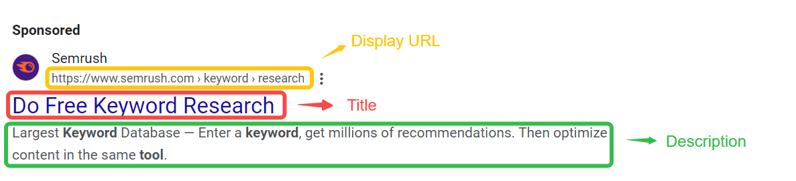

## 什么是SEM文案？

SEM（搜索引擎营销）文案是专门为在线广告创建的文本内容，旨在吸引用户点击并提升转化率。SEM文案不仅要吸引眼球，还需具备实用性，能够引导潜在用户采取行动，直接影响广告的效果与ROI。**想更全面了解付费搜索广告的构成，可参考[《付费搜索广告：入门指南》](https://chloevolution.com/zh-cn/posts/paid-search/)。**

### 理解SEM广告的构成：三个主要元素

1. **标题**：用户在搜索结果中第一眼看到的部分。一个引人注目的标题能够有效地吸引用户的注意力，激发他们的点击欲望。

2. **描述**：标题下方的内容，详细阐述产品或服务的特点和优势。它应以解决用户需求为导向，清晰传达价值主张。

3. **URL**：显示的链接地址，影响用户的决策。清晰且具有相关性的URL能够增加用户的信任感，提升点击率。
   - **显示URL**：在广告中显示给用户的链接，通常简短且与广告内容相关。
   - **目标URL**：用户点击广告后跳转到的实际网页地址。

除了以上三个基础元素，**广告附加信息（Ad Extensions）**也是现代 SEM 广告不可或缺的构成部分，它们在不增加点击费用的前提下，能极大丰富广告内容和提升点击率。我们将在后续章节详细介绍。

## 什么才算是有说服力的 SEM 文案？

一个有说服力的 SEM 文案，不仅仅是信息传递，更是一种艺术，它能在有限的空间内，精准连接用户的需求与你的解决方案，并激发行动。撰写 SEM 广告文案并不是堆砌关键词或单纯展示品牌，而是用有限的字符，向特定意图的用户传递一个清晰、有吸引力、可信的承诺，并引导他们采取下一步行动。

撰写 SEM 广告文案并不是堆砌关键词或单纯展示品牌，而是用有限的字符，向特定意图的用户传递一个清晰、有吸引力、可信的承诺，并引导他们采取下一步行动。

为了让讲解更具操作性，我们以一个虚构产品为例贯穿全文：

> 产品背景：你是一款在线时间管理工具的市场经理，产品叫 **TimeFlow**，核心卖点是：界面极简、自动同步日历、可与团队协作，目标用户是中小型企业和自由职业者。

### 1. 抓住搜索意图，而不是自说自话

SEM 广告不是品牌自说自话的舞台，而是回应用户需求的“即时对话”。你需要根据用户的搜索意图调整文案措辞，不同阶段的用户需要不同的语言策略。

**搜索意图 vs. 文案策略：**

| 购买阶段     | 用户搜索示例                          | 推荐文案策略         | 示例文案（TimeFlow）          |
| -------- | ------------------------------- | -------------- | ----------------------- |
| **认知阶段** | “时间管理工具有哪些”                     | 提供价值、引导探索      | “最适合忙碌职场人的时间管理工具”       |
| **考虑阶段** | “Notion vs Todoist vs TimeFlow” | 突出差异化优势、用户信任元素 | “比 Notion 更轻、更快：专为团队设计” |
| **转化阶段** | “订阅 TimeFlow” / “TimeFlow 价格”   | 明确优惠、紧迫感、行动导向  | “现在注册，30 天免费试用，无需信用卡”   |

**提示**：不要用“我们是最好的”这类空话，而要用用户语言回应他们的真正搜索目的。

### 2. 强调独特价值，而不是泛泛而谈

继续以 TimeFlow 为例，你要避免说“全面”、“高效”、“一体化”这种模糊词，而是要表达具体的可感知好处：

> ❌ 泛泛而谈：“一个全方位的时间管理解决方案”

> ✅ 有说服力：“每天节省 2 小时，告别日程冲突”

想出一个好价值主张，可以自问这三个问题：
1. 我们解决了用户的什么痛点？（**这往往与[关键词研究](https://chloevolution.com/zh-cn/posts/keyword-research-and-targeting/)中发现的用户需求紧密相关**）
2. 我们跟别人有什么不一样？
3. 能不能量化或举例？

### 3. 使用清晰有力的语言

好的文案用词精准、动词强、有可感知的动作或结果，避免“行业黑话”或抽象描述。SEM文案空间极小（以 Google Ads 为例，标题通常限制为30字符，描述限制为90字符），必须用词精准。下面这个对比表格可以直接套用：

| 场景   | 推荐用词                   | 不推荐用词         |
| ---- | ---------------------- | ------------- |
| 价值描述 | “节省时间”、“自动同步”          | “高效”、“优化流程”   |
| 社会证明 | “被 10 万用户信赖”、“4.8 星评分” | “业内认可”、“很受欢迎” |
| 动作导向 | “立即开始”、“免费试用”          | “了解更多”、“获取信息” |
| 信任建立 | “无需绑定信用卡”、“随时取消”       | “灵活方案”、“贴心服务” |

**小技巧：**动词 + 具体数字或结果，是 SEM 文案的黄金公式。

### 4. 明确引导行动（Call to Action）

一个强力的 CTA 是推动点击转化的关键。不同领域适合不同类型的 CTA：

| 行业          | 常用 CTA 示例                     |
| ----------- | ----------------------------- |
| **SaaS 软件** | “开始免费试用” / “申请演示” / “立即注册”    |
| **电商/零售**   | “立即购买” / “抢先下单” / “查看优惠”      |
| **教育/培训**   | “领取试听课” / “下载学习资料” / “报名现在开始” |
| **金融服务**    | “获取报价” / “预约顾问” / “计算贷款利率”    |
| **B2B 服务**  | “联系我们” / “获取个性化方案” / “下载案例”   |

以TimeFlow为例，一个强有力的 SEM 文案，应该做到这四点：

| 原则        | TimeFlow 示例文案             |
| --------- | ------------------------- |
| 回应搜索意图    | “最佳时间管理工具推荐”              |
| 明确独特价值    | “每天节省 2 小时，自动同步日历与会议”     |
| 用词具体、有力   | “被 10 万+ 团队使用”，而非“受欢迎的工具” |
| 行动清晰、有驱动力 | “立即开始免费试用，无需绑定信用卡”        |

> **记住：用户不在乎你的品牌多牛，他们只在乎：你能否解决他们的问题，立刻、清楚、可信地。深入理解这一理念是所有[SEM 策略](https://chloevolution.com/zh-cn/posts/sem-basics/)成功的基石。**

## 从广告到落地页的一致性：转化的关键
很多 SEM 投放的问题，不在广告点击率，而在 **“点击之后”**。用户点进来了，却迅速跳出、没有转化，根本原因往往不是产品不好，而是：**落地页内容与广告 promise 不一致，让用户“心理落差”太大。**

这就是“广告-落地页一致性”的核心问题：**你承诺了什么，就要第一时间兑现它。**

我们来看 TimeFlow 在不同投放路径下，如何做到一致性优化：

### 1. 信息一致性：广告说了什么，落地页必须第一时间回应

假设你的搜索广告文案如下：

* 标题：每天节省 2 小时的时间管理工具
* 描述：自动同步日历，支持团队协作，立即免费试用

如果用户点击后进入的落地页开头写的是：“TimeFlow 成立于 2017 年，致力于推动数字效率的发展”，这段企业介绍虽然无误，但它并没有回应用户点击广告的初衷。用户此时最关心的，不是你的愿景，而是这个工具是否真能帮他节省时间。

更好的做法是在落地页首屏就延续广告中强调的价值主张：

* 标题：“每天节省 2 小时，立即体验 TimeFlow”
* 副标题：“自动同步日程、无缝协作，适用于繁忙职场人士”
* 第一屏按钮：“免费试用，无需信用卡”

落地页不应该让用户重新理解、重新判断，而应顺着他们的兴趣和意图，延续广告中的核心承诺。

### 2. 视觉与结构一致性：保持用户感官的连续性

广告带来的不仅是点击，还有一种预期体验。如果用户从一个干净、极简风格的广告画面跳转到一个色彩混乱、信息密集的落地页，会觉得“这不是我刚刚点进来的地方”，进而降低信任感。

应保持一致的元素包括：

* 色彩风格和字体排版：如果广告是蓝白灰简洁风格，落地页就不应切换成品牌宣传海报式的设计
* 语气调性：如果广告文案是简洁、理性风，落地页不要转为情绪化或娱乐化
* 操作指引位置：广告中强调“免费试用”，落地页的主要行动按钮应在首屏显著位置，文字表达应完全一致

一致性的本质，是让用户感到“这是一个完整而可信的体验”。

### 3. 行动路径一致性：从点击到转化不能中断

广告中的行动指引（如“注册试用”或“获取报价”）不仅是为了提升点击率，更是为了设定用户对后续路径的预期。如果落地页上的行动按钮模糊不清或动作不一致，就容易让用户迷失方向。

以下是 TimeFlow 示例的匹配方式：

| 广告中的主行动指引 | 落地页上的匹配策略                | 常见问题举例         |
| --------- | ------------------------ | -------------- |
| 免费试用      | 首屏按钮为“立即开始免费试用”，点击后弹窗注册  | 首屏没有按钮或按钮文字模糊  |
| 获取价格      | 显著位置提供价格表单入口，标题为“获取定价方案” | 提交表单后跳转至无关页面   |
| 预约演示      | 表单标题为“预约产品演示”，表单字段精简明确   | 表单位置太深，或字段填写繁琐 |

一致的行动路径能减少用户的犹豫成本，提高完成转化的概率。

### 一致性不仅影响转化，还影响广告效果和成本
除了用户体验层面的转化效果，一致性还直接影响广告在平台上的整体表现。以 Google Ads 为例，平台会根据“质量得分”（Quality Score）来评估每条广告，这不仅决定你的广告是否能展示，还影响每次点击的成本。

质量得分由三个主要因素构成：

1. 预估点击率（CTR）

2. 广告与关键词的相关性

3. 落地页体验

其中后两项与一致性直接相关。如果广告文案、关键词与落地页之间缺乏连贯性，系统会判断为“体验不佳”，从而拉低得分。质量得分低不仅会影响曝光量，还会导致点击成本上升。

换句话说，不重视一致性，不仅转化难以提升，还可能导致投放成本的结构性浪费。

## 广告附加信息（Ad Extensions）：提升广告表现的利器
在 SEM 广告优化中，除了主文案本身，广告附加信息（Ad Extensions）也是不可忽视的重要组成部分。合理使用广告附加信息不仅能丰富广告内容，增加广告占用的版面空间，还能帮助用户快速获取更多有价值的信息，从而提升点击率和广告质量得分。

### 什么是广告附加信息？
广告附加信息是指 Google Ads、Microsoft Ads 等搜索广告平台提供的，可以附加在主广告文案旁的额外信息，如：

- 附加链接（Sitelinks）：展示更多页面链接，帮助用户快速跳转到网站的具体部分

- 附加说明（Callout Extensions）：用于强调独特卖点，如“免费送货”、“7x24小时客服”

- 结构化摘要（Structured Snippet Extensions）：列举产品或服务类别，增强产品信息展示

- 电话附加信息（Call Extensions）：直接显示联系电话，适合需要电话咨询的业务

- 位置附加信息（Location Extensions）：显示企业地址，并在广告中提供地图链接，帮助用户找到实体店位置

- 价格附加信息（Price Extensions）：在广告中显示产品或服务的价格，帮助用户快速了解费用信息

- 促销附加信息（Promotion Extensions）：突出当前的促销活动或折扣信息，激励用户立即行动

- 图片附加信息（Image Extensions）：在广告中添加高质量图片，使广告更生动，增强视觉吸引力

### 为什么要用广告附加信息？

* **提升广告占用面积**：广告在搜索结果中的展示位置更显眼，吸引用户注意
* **增加信息维度**：补充主文案无法全面覆盖的产品细节或促销信息
* **提高点击率（CTR）**：研究显示，使用附加信息的广告，平均点击率明显高于普通广告
* **改善质量得分**：丰富的信息和更好用户体验有助于提升 Google Ads 的质量得分，降低点击成本

### 如何合理使用广告附加信息？

| 类型     | 适用场景      | 优化建议            |
| ------ | --------- | --------------- |
| 附加链接   | 网站有多个重点页面 | 选择用户最常访问或最关键的页面 |
| 电话附加信息 | 需要电话转化的业务 | 保证电话准确，工作时间清晰   |
| 附加说明   | 突出卖点、服务优势 | 简洁有力，避免堆砌无关信息   |
| 结构化摘要  | 产品品类丰富的品牌 | 选择最具代表性的类别，易于理解 |

## AI如何改变SEM文案写作？

AI正以多种方式推动 SEM 文案创作的变革，提升效率和精准度。**诸如 GPT-4、Gemini 等大型语言模型，以及各类营销自动化平台内置的 AI 助手**，都在不同程度上改变着广告文案的生成、分析与优化流程：

| 应用场景        | 具体作用                       | 带来的优势                   |
| ----------- | -------------------------- | ----------------------- |
| 多版本文案快速生成   | AI 根据关键词和核心信息生成多条不同风格文案    | 节省创作时间，丰富备选方案，方便 A/B 测试 |
| 用户搜索意图分析    | AI 分析大量搜索行为，精准识别用户需求和关注点   | 文案更贴合用户心理，提高点击率和转化率     |
| 实时文案智能优化    | 通过机器学习实时调整标题、描述组合，自动匹配最佳内容 | 减少人工试错，灵活应对多样化用户和环境变化   |
| 文案与落地页的智能联动 | AI 结合用户行为，自动推荐或调整对应落地页内容   | 实现从点击到转化的闭环优化，提升整体效果    |

谷歌近期推出的 **AI Max Search** 等智能广告产品，更是将AI深度融入搜索广告投放的各个环节，从关键词匹配到文案创作，再到投放优化，帮助广告主实现更高效、更精准的广告管理和效果提升。**然而，无论技术如何发展，对用户意图的深刻理解和对品牌价值的精准表达，仍是任何广告文案成功的核心，AI 只是强大的辅助工具。**

## FAQ
### Q1：撰写 SEM 文案时，如何避免广告创意疲劳？

**A1：** 广告创意疲劳是指用户对同一广告文案反复看到后产生厌倦，导致点击率和效果下降。为了避免创意疲劳，你需要：
1.  **定期 A/B 测试**：持续尝试不同的标题、描述和号召性用语。
2.  **多样化信息**：在不同的广告文案中强调产品或服务的不同卖点、优势或应用场景。
3.  **利用广告附加信息**：通过附加链接、促销信息等，在不改变主文案的情况下，为用户提供新鲜感和更多价值。
4.  **关注竞争对手**：分析竞争对手的广告策略，寻找新的创意灵感。
5.  **借助 AI 工具**：利用 AI 快速生成多种文案版本，进行快速迭代和测试。

### Q2：我应该在广告文案中直接提及价格吗？

**A2：** 这取决于你的产品策略和目标用户。
* **提及价格的优势**：可以直接筛选掉预算不符的用户，提高点击的意图精准度，并可能提升转化率。对于价格有竞争力的产品或服务尤其有效。
* **不提及价格的优势**：可以吸引更广泛的用户群体，并在落地页上通过更多信息来教育和说服用户。

如果你的产品价格透明且有竞争力，或有明确的促销活动，**可以考虑使用价格附加信息（Price Extensions）或直接在描述中提及**。最终决策应基于 A/B 测试结果。

### Q3：什么是广告质量得分（Quality Score），它为什么重要？

**A3：** 广告质量得分是 Google Ads 用来衡量你的广告、关键词和落地页相关性与质量的一个诊断工具，得分范围为 1-10 分。它主要受以下三个因素影响：
1.  **预期点击率（Expected CTR）**：你的广告在某个关键词下的预计点击表现。
2.  **广告相关性（Ad Relevance）**：你的广告文案与关键词的相关程度。
3.  **落地页体验（Landing Page Experience）**：你的落地页与广告和关键词的相关性、用户友好度、加载速度等。

**为什么重要？** 高质量得分意味着你的广告更有可能以**更低的每次点击成本（CPC）获得更高的广告排名**。简单来说，它能帮你花更少的钱，获得更好的广告位置。撰写高质量的广告文案和优化落地页是提升质量得分的关键。**更多关于质量得分的详情，请参考[《SEM 数据分析全攻略》](https://chloevolution.com/zh-cn/posts/sem-analytics/)一文。**