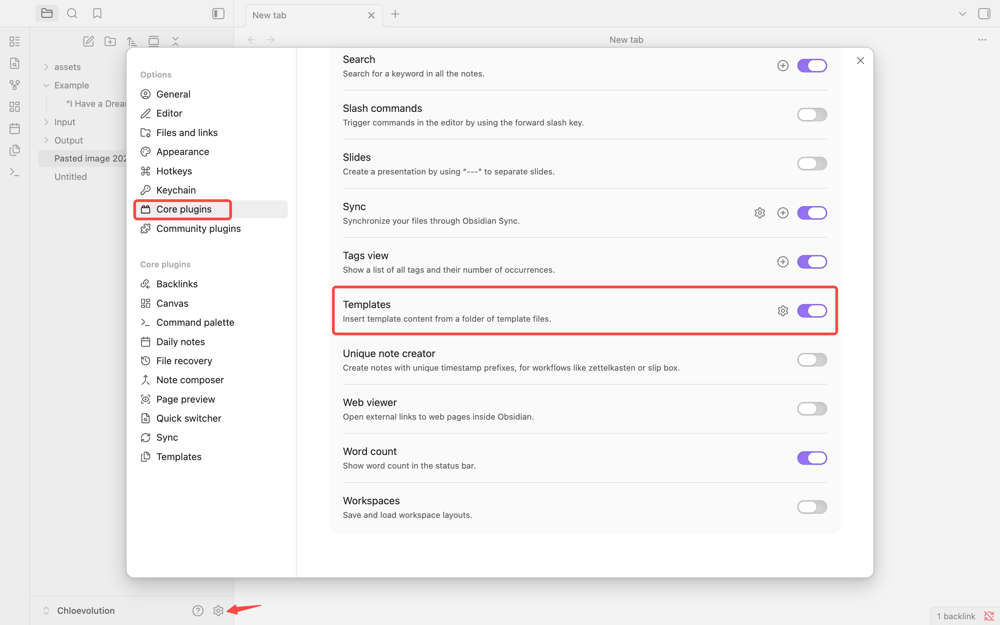
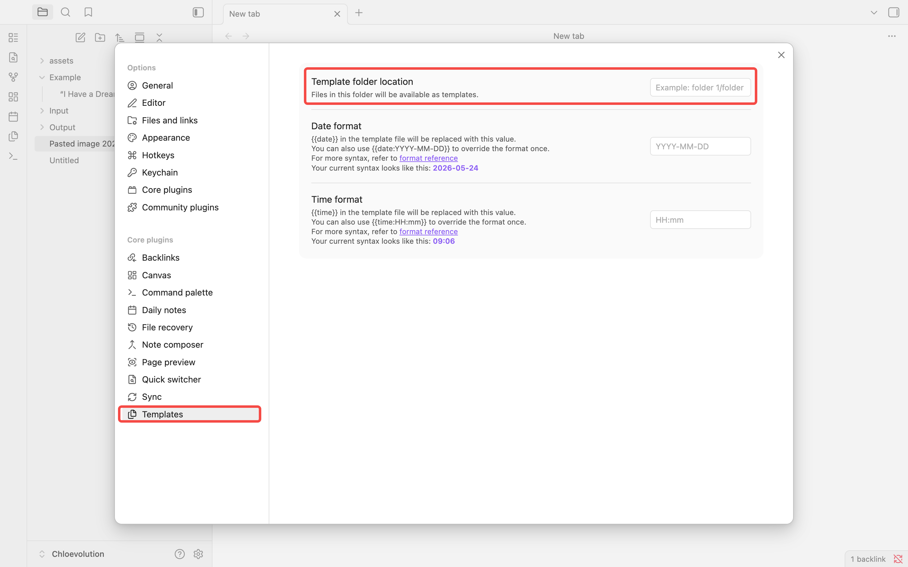
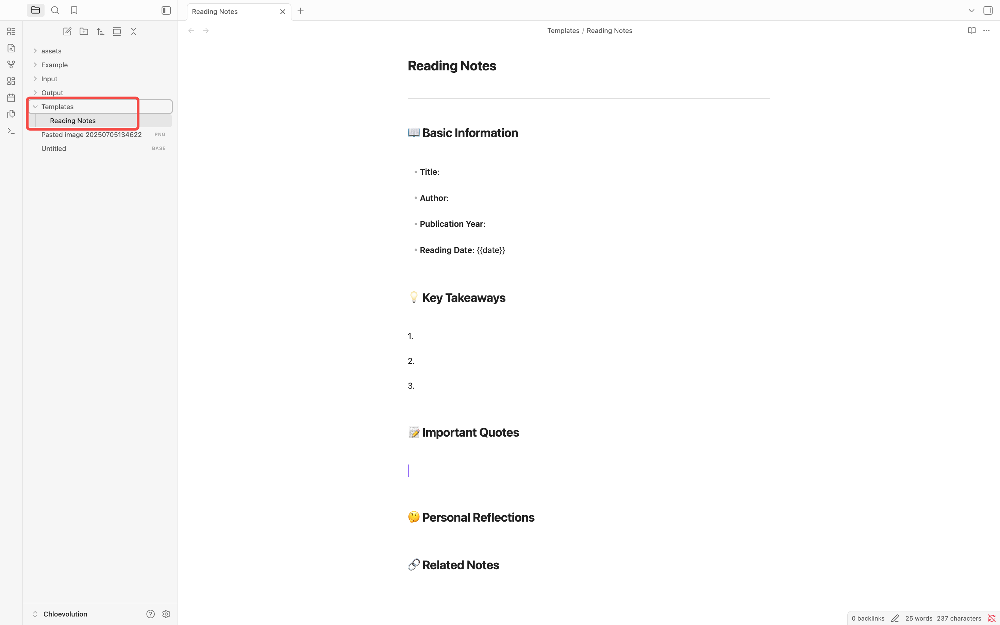
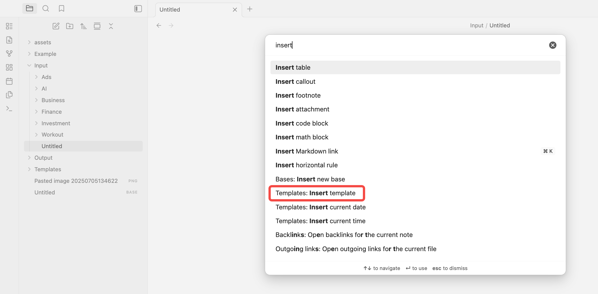
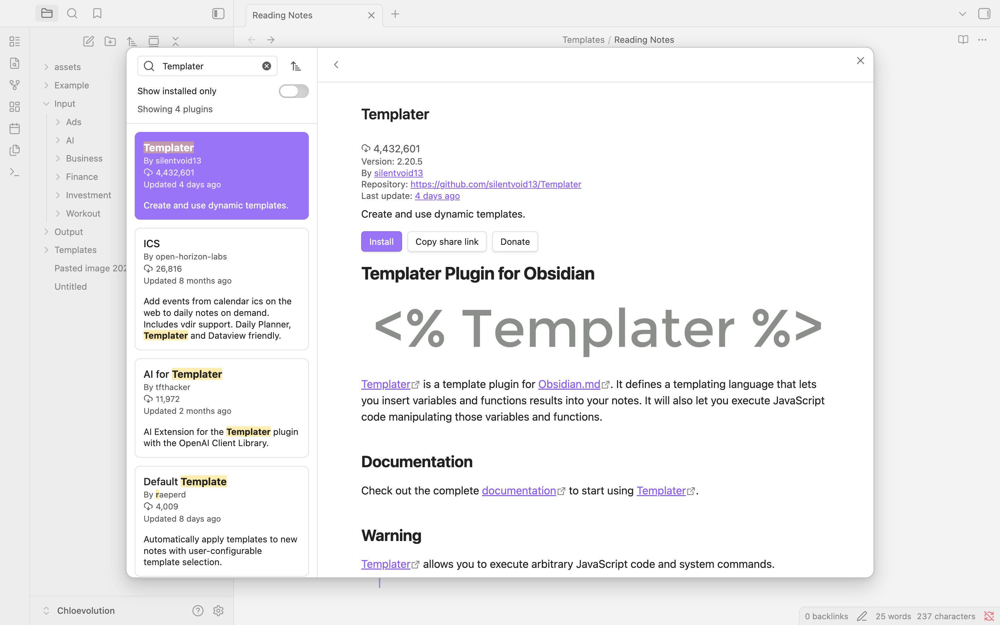

When taking notes in Obsidian, have you noticed yourself repeating the same tasks? Every time you create a book note, you manually enter fields like "title, author, reading date"; every time you write a Daily Note, you recreate the same heading structure; every project note requires building the "goals, tasks, progress" framework from scratch.

These repetitive tasks not only waste time but also lead to inconsistent note formatting. When your vault contains hundreds of notes, format chaos makes information retrieval difficult.

Obsidian's template feature can completely solve this problem. By using templates, you can:
- Create notes with unified structure in one click
- Automatically insert current date, time, and note title
- Keep all notes of the same type consistently formatted
- Reduce repetitive work time by over 80%

This article will cover in detail:
- How to set up and use Obsidian's template feature
- The difference between the core Templates plugin and the Templater plugin
- 7 practical templates you can use directly
- Best practices for template design


## What are Obsidian Templates?

Templates are pre-designed note structures that help you quickly create notes with the same format. When you need to create a new note, simply insert a template, and Obsidian will automatically fill in the preset content and structure.

In Obsidian, templates are particularly suitable for the following scenarios:

- **Book Notes**: Unified book information, summary, and reflection structure
- **Project Management**: Consistent project overview, goals, and task lists
- **Daily Notes**: Fixed structure and reflection questions for daily notes
- **Weekly/Monthly Reports**: Standard format for regular summaries
- **Zettelkasten Cards**: Standard format conforming to the Zettelkasten method
- **Literature Notes**: Literature recording templates for academic research

The advantages of using templates are:
1. **Save Time**: No need to repeatedly enter the same structure and format, focus on content itself
2. **Maintain Consistency**: All notes of the same type use a unified format, facilitating subsequent retrieval and organization
3. **Improve Efficiency**: With plugins like Dataview, unified format makes data querying and summarization simple


## How to Use Obsidian's Core Templates Plugin

Obsidian has a built-in Templates plugin, which is the official template solution. It's simple to use and can meet most users' basic needs.

### Step 1: Enable the Templates Plugin

1. Open Obsidian settings (click the gear icon in the lower left corner, or use the shortcut `Cmd/Ctrl + ,`)
2. Select "Core plugins" in the left menu
3. Find "Templates" and toggle it on
4. After enabling, a "Templates" settings item will appear in the left menu



### Step 2: Configure the Template Folder

After enabling the plugin, you need to specify a folder to store all template files:

1. On the "Templates" settings page, find the "Template folder location" option
2. Enter the folder path, for example `Templates`



**Important Note**: Obsidian will not automatically create this folder. When you enter the folder path in settings, Obsidian only remembers in its underlying configuration "if the user wants to call templates in the future, look in this folder". If this folder doesn't actually exist in your vault, the template feature will not work.

3. Manually create the template folder:
   - In the file explorer, right-click on the vault root directory
   - Select "New folder"
   - Enter the folder name you specified in settings (such as `Templates`)

**Suggestion**: Place the template folder in the vault's root directory for easy management and access.


### Step 3: Create Your First Template

Let's create a simple book notes template:

1. Create a new file in the template folder, name it `Book Notes Template.md`
2. Enter the following content:

```markdown
---
title:
author:
publication_year:
reading_date: {{date}}
tags: #book-notes
---

## 📖 Basic Information

- **Title**:
- **Author**:
- **Publication Year**:
- **Reading Date**: {{date}}

## 💡 Key Takeaways

1.
2.
3.

## 📝 Important Quotes

>

## 🤔 Personal Reflections

## 🔗 Related Notes

```

3. Save the file

This template uses the `{{date}}` variable, which will be automatically replaced with the current date when the template is inserted.




### Step 4: Using Templates

There are two ways to insert templates:

**Method 1: Through the Command Palette**
1. Create or open a note
2. Press `Cmd/Ctrl + P` to open the command palette
3. Type "Insert template"
4. Select the template you want to use




**Method 2: Set a Hotkey**
1. Open Settings → Hotkeys
2. Search for "Insert template"
3. Set your preferred hotkey, for example `Cmd/Ctrl + T`

### Variables Supported by the Templates Plugin

The Templates plugin provides several useful variables that can automatically fill in information in templates:

| Variable | Description | Example Output |
|------|------|----------|
| `{{title}}` | Current note title | "My Note" |
| `{{date}}` | Current date | 2026-05-23 |
| `{{time}}` | Current time | 14:30 |
| `{{date:YYYY-MM-DD}}` | Custom date format | 2026-05-23 |
| `{{date:YYYY年MM月DD日}}` | Chinese date format | 2026年05月23日 |

**Date Format Explanation**:
- `YYYY` = Four-digit year
- `MM` = Two-digit month
- `DD` = Two-digit date
- `HH` = 24-hour format hour
- `mm` = Minutes
- `ss` = Seconds

For example, `{{date:YYYY-MM-DD HH:mm}}` will output `2026-05-23 14:30`


## 7 Practical Templates You Can Use Directly

Below are 7 templates that you can copy and use directly, or adjust according to your own needs.

### 1. Meeting Notes Template

Suitable for work meetings, team discussions, client communications, etc.

```markdown
---
meeting_topic:
date: {{date}}
participants:
tags: #meeting-notes
---

# {{title}}

**Date**: {{date:YYYY-MM-DD HH:mm}}
**Participants**:
**Duration**:

## 📋 Agenda

1.
2.
3.

## 💬 Discussion Points

### Topic 1:

**Discussion**:

**Decision**:

### Topic 2:

**Discussion**:

**Decision**:

## ✅ Action Items

- [ ] Task description @owner 📅 due date
- [ ] Task description @owner 📅 due date

## 📌 Next Meeting

**Time**:
**Agenda**:
```

### 2. Project Management Template

Suitable for work projects, personal projects, learning plans, etc.

```markdown
---
project_name:
status: planning/in-progress/completed/on-hold
priority: P0/P1/P2/P3
start_date: {{date}}
due_date:
owner:
tags: #project-management
---

# 🎯 {{title}}

**Status**: 🟡 In Progress
**Priority**: P0
**Timeline**: {{date:YYYY-MM-DD}} ~

## 📋 Project Overview

**Background**:

**Objectives**:

**Expected Outcomes**:

## 🎯 Key Milestones

- [ ] Milestone 1 📅 date
- [ ] Milestone 2 📅 date
- [ ] Milestone 3 📅 date

## ✅ Task List

### To Do
- [ ] Task 1
- [ ] Task 2

### In Progress
- [ ] Task 3

### Completed
- [x] Task 4

## 👥 Team Members

| Name | Role | Responsibility |
|------|------|----------------|
| | | |

## 📊 Progress Tracking

**Overall Progress**: 30%

**This Week**:
-

**Next Week**:
-

**Issues**:
-

## 📎 Related Resources

- [[Related Doc]]
- [External Link]()

## 📝 Project Log

### {{date:YYYY-MM-DD}}

```

### 3. Daily Notes Template

Suitable for daily recording, schedule planning, reflection and summary.

```markdown
---
date: {{date}}
day_of_week:
weather: ☀️
mood: 😊
tags: #daily
---

# 📅 {{date:YYYY-MM-DD dddd}}

## 🌅 Morning Plan

**Today's Goals**:

**Important Tasks**:
1.
2.
3.

## ✅ Task List

### Work
- [ ]
- [ ]

### Personal
- [ ]
- [ ]

### Learning
- [ ]
- [ ]

## 📝 Daily Log

### Work Log


### Learning Notes


### Ideas

💡

## 🌙 Evening Review

**Completed Today**:
-

**Highlights**:

**To Improve**:

**Tomorrow's Focus**:

## 🔗 Related Notes

- [[]]
```

### 4. Weekly Report Template

Suitable for work weekly reports, learning summaries, personal reviews.

```markdown
---
week_number: {{date:YYYY Week WW}}
date_range:
tags: #weekly-review
---

# 📊 {{date:YYYY Week WW}} Review

**Date Range**: {{date:MM-DD}} -

## 📈 Weekly Metrics

| Metric | Value | vs Last Week |
|--------|-------|--------------|
| Work Hours | | |
| Tasks Completed | | |
| Learning Hours | | |

## ✅ Completed This Week

### Work
1.
2.
3.

### Learning
1.
2.

### Personal Growth
1.
2.

## 🎯 Goal Achievement

- [ ] Goal 1: % complete
- [ ] Goal 2: % complete

## 💡 Key Learnings

**New Skills**:

**New Insights**:

**Good Habits**:

## 🤔 Challenges & Reflections

**Challenges**:

**Solutions**:

**To Improve**:

## 📅 Next Week Plan

### Key Goals
1.
2.
3.

### Specific Tasks
- [ ]
- [ ]

## 📊 Time Allocation

- Work: %
- Learning: %
- Rest: %
- Other: %
```

### 5. Goal Tracking Template

Suitable for annual goals, quarterly OKRs, personal growth plans.

```markdown
---
goal_type: annual/quarterly/monthly
set_date: {{date}}
status: in-progress
tags: #goal-tracking
---

# 🎯 {{title}}

**Set Date**: {{date:YYYY-MM-DD}}
**Goal Period**:
**Current Status**: 🟢 On Track

## 🎯 Goal Definition

**SMART Goal Description**:
- **S**pecific:
- **M**easurable:
- **A**chievable:
- **R**elevant:
- **T**ime-bound:

## 📊 Key Results

- [ ] KR1: (Progress: %)
- [ ] KR2: (Progress: %)
- [ ] KR3: (Progress: %)

## 📈 Progress Tracking

**Overall Progress**: %

## 🗓️ Milestones

| Date | Milestone | Status |
|------|-----------|--------|
| | | ⏳ |
| | | ⏳ |

## 📝 Action Plan

### This Month
- [ ]
- [ ]

### This Week
- [ ]
- [ ]

## 🚧 Obstacles & Risks

**Current Obstacles**:

**Mitigation Strategy**:

## 📊 Regular Review

### {{date:YYYY-MM-DD}}

**Progress**:

**Adjustments**:

## 🎉 Final Outcome

(Fill after completion)

**Achievement**:

**Lessons Learned**:
```

### 6. Brainstorming Template

Suitable for idea collection, problem analysis, solution design.

```markdown
---
topic:
date: {{date}}
participants:
tags: #brainstorming
---

# 💡 {{title}}

**Date**: {{date:YYYY-MM-DD HH:mm}}
**Participants**:
**Duration**:

## 🎯 Core Problem

What problem are we trying to solve?

## 🧠 Divergent Thinking

### Idea 1


### Idea 2


### Idea 3


## 🔍 Idea Categorization

### High Feasibility
-

### High Innovation
-

### Needs Validation
-

## ⭐ Best Solution

**Rationale**:

**Implementation Steps**:
1.
2.
3.

## 📋 Follow-up Actions

- [ ]
- [ ]

## 🔗 Related Resources

- [[]]
```

### 7. Learning Notes Template

Suitable for course learning, skill training, knowledge organization.

```markdown
---
course_name:
instructor:
learning_date: {{date}}
progress:
tags: #learning-notes
---

# 📚 {{title}}

**Course Name**:
**Instructor**:
**Learning Date**: {{date:YYYY-MM-DD}}
**Progress**:

## 🎯 Learning Objectives

Through this learning session, I aim to master:
1.
2.
3.

## 📝 Core Content

### Concept 1:

**Definition**:

**Key Points**:
-
-

**Example**:

### Concept 2:

**Definition**:

**Key Points**:
-
-

**Example**:

## 💡 Key Takeaways

1.
2.
3.

## 🤔 Questions & Reflections

**Questions**:

**Personal Thoughts**:

## 💼 Practical Application

How to apply this knowledge in practice?

**Use Case 1**:

**Use Case 2**:

## 📋 Action Items

- [ ] Practice task 1
- [ ] Practice task 2

## 🔗 Related Notes

- [[]]
- [[]]

## 📚 Further Reading

-
```


## Templater Plugin: A More Powerful Template Solution

If you feel the core Templates plugin's features are insufficient, you can try the community plugin Templater. It provides more powerful features, including JavaScript scripts, user-defined functions, dynamic content generation, etc.

### Templater vs Templates: Which to Choose?

| Feature | Templates (Core Plugin) | Templater (Community Plugin) |
|------|----------------------|----------------------|
| Installation | Built-in, enable directly | Need to install from community plugins |
| Learning Curve | Simple, 5 minutes to get started | Medium, need to learn syntax |
| Variable Support | Basic variables (date, title, etc.) | Rich built-in variables and functions |
| Customization | Limited | Supports JavaScript scripts |
| Dynamic Content | Not supported | Supported (e.g., random content, API calls) |
| Use Cases | Daily basic needs | Advanced automation needs |

**Suggestions**:
- If you're a beginner or only need basic template features, use the core Templates plugin
- If you need complex automation, dynamic content generation, or have programming background, you can try Templater

### How to Install the Templater Plugin

1. Open Obsidian Settings → Community Plugins
2. Turn off "Safe mode" (if not already off)
3. Click the "Browse" button
4. Search for "Templater"
5. Click "Install", then click "Enable"



### Templater Example

Here's a Daily Notes template example using Templater, demonstrating its more powerful features compared to the core plugin:

```markdown
---
date: <% tp.date.now("YYYY-MM-DD") %>
day_of_week: <% tp.date.now("dddd") %>
week_number: Week <% tp.date.now("WW") %>
weather: ☀️
---

# 📅 <% tp.date.now("YYYY-MM-DD dddd") %>

## 🌤️ Daily Quote

<% tp.web.daily_quote() %>

## ✅ Today's Tasks

<% tp.file.cursor(1) %>

## 📝 Notes

<% tp.file.cursor(2) %>

---

[[<% tp.date.now("YYYY-MM-DD", -1) %>|← Yesterday]] | [[<% tp.date.now("YYYY-MM-DD", 1) %>|Tomorrow →]]
```

**Templater's Unique Features**:
- `<% tp.file.cursor() %>` - Set cursor position, cursor will automatically position after inserting template
- `<% tp.date.now("YYYY-MM-DD", -1) %>` - Date calculation, -1 means yesterday, 1 means tomorrow
- `<% tp.web.daily_quote() %>` - Call web API to get daily quote
- Supports conditional statements, loops, and other programming logic

### Common Templater Functions

| Function | Description | Example |
|------|------|------|
| `tp.date.now()` | Current date and time | `<% tp.date.now("YYYY-MM-DD") %>` |
| `tp.date.tomorrow()` | Tomorrow's date | `<% tp.date.tomorrow("YYYY-MM-DD") %>` |
| `tp.date.yesterday()` | Yesterday's date | `<% tp.date.yesterday("YYYY-MM-DD") %>` |
| `tp.file.title` | Current file title | `<% tp.file.title %>` |
| `tp.file.cursor()` | Set cursor position | `<% tp.file.cursor(1) %>` |

If you want to learn Templater in depth, you can check the official documentation: [https://silentvoid13.github.io/Templater/](https://silentvoid13.github.io/Templater/)


## Best Practices for Template Design

In the process of using templates, I've summarized some methods to make templates more useful, and I'd like to share them with you.

### 1. Keep It Simple, Avoid Over-Design

When I first started using templates, I also made the mistake of "over-design", wanting to cram all information into them.

**Bad Practice**:
```markdown
## 📚📖📝 Book Notes 📝📖📚
═══════════════════════════════
【Title】:
【Author】:
【Publisher】:
【ISBN】:
【Pages】:
【Price】:
【Binding】:
【Publication Year】:
═══════════════════════════════
```

**Good Practice**:
```markdown
## 📖 Book Notes

**Title**:
**Author**:
**Reading Date**: {{date}}
```

I later found that keeping only the truly necessary fields makes templates easier to stick with. Too many decorations and fields create a "filling burden".

### 2. Use Consistent Naming and Structure

Maintain a consistent style across all templates:
- Consistently use or don't use emojis
- Unified date format (e.g., all use `YYYY-MM-DD`)
- Unified heading hierarchy (e.g., H1 for note title, H2 for sections)
- Unified metadata field names

The benefit of doing this is that when your notes grow, format consistency makes retrieval and organization much easier.

### 3. Design for Your Future Self

When designing templates, think more about how "yourself three months from now" will use these notes:
- **Searchability**: Use unified tags and metadata for easy subsequent searching
- **Extensibility**: Reserve enough space to add new content
- **Compatibility**: If using plugins like Dataview, ensure field format compatibility

### 4. Regular Review and Optimization

My habit is to review template usage once a month:
- Which fields are never filled? Consider removing
- What content often needs to be added manually? Consider adding to template
- Which templates are rarely used? Consider merging or deleting

Templates are not designed once and never changed, but need to be continuously adjusted based on actual usage.

### 5. Establish Template Folder Structure

When the number of templates increases, it's recommended to organize by type:

```
Templates/
├── Work/
│   ├── Meeting Notes.md
│   ├── Project Management.md
│   └── Weekly Report.md
├── Learning/
│   ├── Book Notes.md
│   ├── Course Notes.md
│   └── Literature Notes.md
└── Personal/
    ├── Daily Notes.md
    ├── Weekly Review.md
    └── Goal Tracking.md
```


## Frequently Asked Questions

### 1. What if variables aren't replaced after inserting a template?

**Reason**: Possibly variable syntax error, or using Templater syntax without installing the Templater plugin.

**Solution**:
- Core Templates plugin uses `{{date}}` syntax
- Templater plugin uses `<% tp.date.now() %>` syntax
- Confirm the syntax you're using matches the installed plugin

### 2. Can I use Dataview queries in templates?

Yes. Add a Dataview code block in the template, it will execute normally after insertion:

````markdown
```dataview
TABLE Status, Priority
FROM #project-management
WHERE Status = "In Progress"
```
````

### 3. How to set default templates for different folders?

Use Templater plugin's "Folder Templates" feature:
1. Install and enable Templater
2. Find "Folder Templates" in Templater settings
3. Add folder path and corresponding template

For example: `Projects/` folder automatically uses "Project Management Template".

### 4. Can templates include bidirectional links?

Yes. Use `[[]]` syntax in templates, links will be created after insertion:

```markdown
## Related Notes
- [[]]
- [[]]
```

### 5. How to set cursor position in templates?

**Templates Plugin**: Does not support cursor positioning

**Templater Plugin**: Use `<% tp.file.cursor() %>`

```markdown
# {{title}}

<% tp.file.cursor(1) %>

## Note Content

<% tp.file.cursor(2) %>
```

After inserting the template, the cursor will position at the first location, press Tab to jump to the next location.

### 6. Can I use templates on mobile?

Yes. Obsidian mobile fully supports both Templates and Templater plugins. Operation method:
1. Open command palette (click command icon in upper left)
2. Search for "Insert template"
3. Select template

### 7. Will template files themselves be searched?

Yes. If you don't want to see template files in global search, you can:
1. Add template folder in Settings → Files & Links → Excluded files
2. Or add `publish: false` in the template file's YAML

### 8. How to share templates with others?

The simplest way:
1. Copy template files to the other person's vault
2. Or send template content to the other person for manual creation

If you have multiple templates to share, you can:
- Create a GitHub repository to store templates
- Use Obsidian's sync feature


## Summary

The template feature looks simple, but when used well, it can greatly improve note-taking efficiency.

From enabling the Templates plugin, creating your first template, to using the 7 practical templates provided in this article, to understanding Templater as a more powerful option—you now have mastered the complete method of using templates in Obsidian.

My suggestion is: start with a simple template, such as Daily Notes or book notes. After using it for a while, adjust fields and structure based on actual needs. Templates are not designed once and never changed, but are continuously optimized during use.

When you find that a certain note type always repeats the same structure, that's the signal to create a new template. Gradually, you'll build a template library that suits you, making note-taking easier and more efficient.
