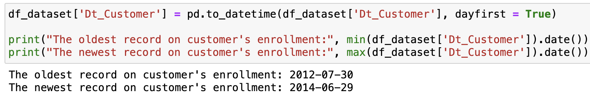
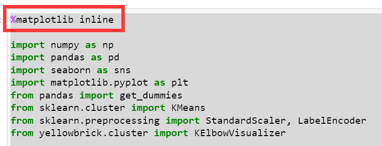
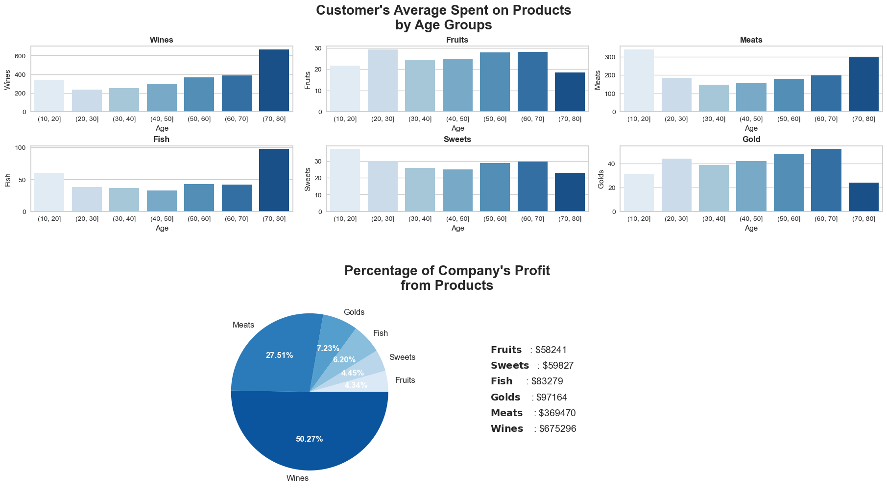
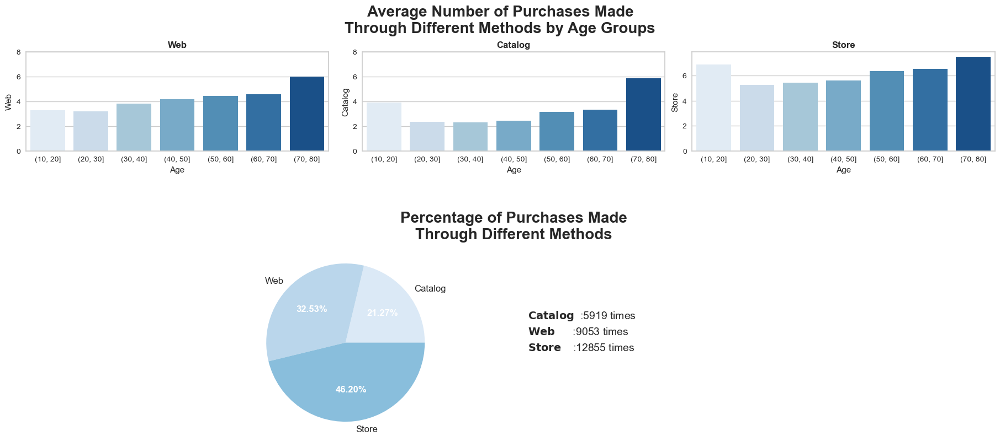
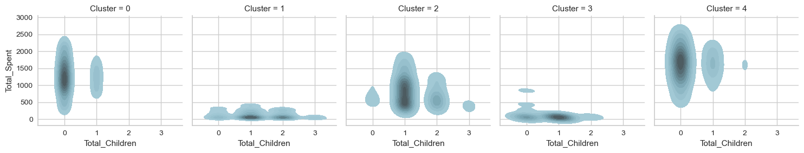
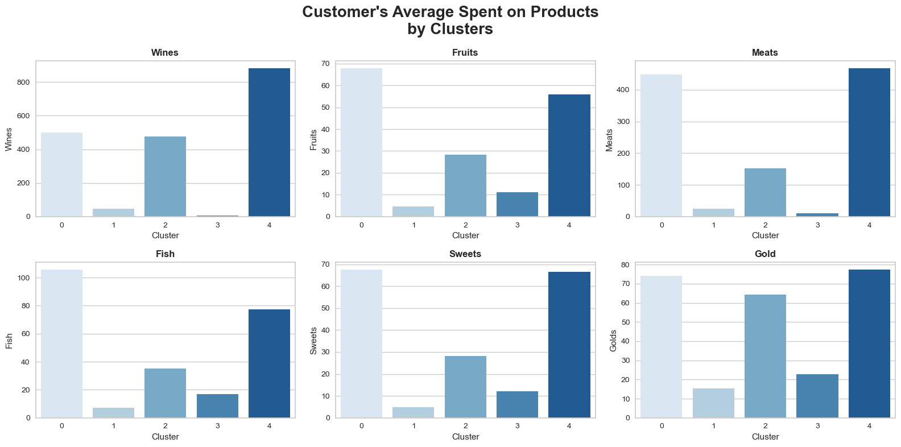
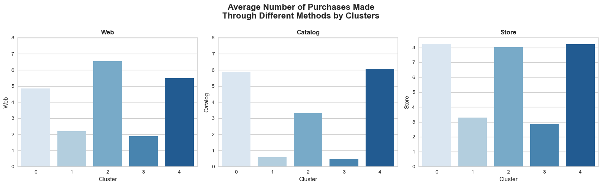

本文使用的示例数据和分析代码来自Kaggle。但因为实际的运行结果与[原作者](https://www.kaggle.com/code/mfaaris/customer-segmentation-insights-profiling)不同，故在分析部分略有差异。

具体的分析流程包括：

1. 数据准备
2. 数据清洗
3. 数据可视化
4. 数据加工
5. 聚类分析
6. 用户画像分析

## 1. 数据准备

使用KMeans聚类算法，将数据分成K个集群：

```python
import numpy as np
import pandas as pd
import seaborn as sns
import matplotlib.pyplot as plt
from pandas import get_dummies
from sklearn.cluster import KMeans
from sklearn.preprocessing import StandardScaler, LabelEncoder
from yellowbrick.cluster import KElbowVisualizer

import warnings
warnings.filterwarnings('ignore')
```

### ModuleNotFoundError: No module named ‘yellowbrick’


出现这个错误的原因是我本地没有安装Yellowbrick这个库。

Yellowbrick是一个机器学习可视化库，主要依赖于sklearn机器学习库，能够提供多种机器学习算法的可视化。

Yellowbrick有两个主要依赖：scikit-learn和matplotlib。Yellowbrick是Python 3软件包，可与3.4或更高版本一起使用。

安装方法：
```
pip install yellowbrick
```
查看数据的基本情况，共有29列：

```python
#sep是分隔符，字符型，默认值是','号。'\t'是制表符分隔
#如果数据之前存在空格，或者说分隔符与数据之间存在空格，skipinitialspace如果指定为True，会跳过这个空格再读数据.。如果取值为False不会跳过空格，而是将空格作为数据的一部分进行读取。skipinitialspace的默认取值为False
df_dataset = pd.read_csv('marketing_campaign.csv', sep='\t', skipinitialspace = True)

#根据位置返回对象的前n行，默认前5行
df_dataset.head()
```


查看各列的数值类型及空值情况：

```python
#info()函数用于打印DataFrame的简要摘要，显示有关DataFrame的信息，包括索引的数据类型、列的数据类型、非空值的数量、内存使用情况
df_dataset.info()
```


## 2. 数据清洗

已知顾客注册时间（Dt_Customer）的类型为Object。为便于后续拆分为年、月、日，需将其转换为日期时间的格式。

同时通过`date()`查看数据的时间跨度。由此可知数据集中customer注册时间为2012-2014年：

```python
#to_datetime()将参数转换为日期时间的格式
#Dt_Customer的原始格式是Object，并不是时间格式，需要转换
df_dataset['Dt_Customer'] = pd.to_datetime(df_dataset['Dt_Customer'], dayfirst = True)

print("The oldest record on customer's enrollment:", min(df_dataset['Dt_Customer']).date())
print("The newest record on customer's enrollment:", max(df_dataset['Dt_Customer']).date())
```



### ValueError: time data doesn’t match

to_datetime()的默认日期解析顺序是月日年，而数据集中的日期格式是日月年，故需要指定dayfirst的值：


对一些属性进行优化以便于后续的分析：

- 年龄（Age）：顾客记录的最近时间为2014年，以此为锚点，减去顾客的出生日期
- 学历情况（Education）：缩小为3个类目：Graduate、Postgraduate、Undergraduate
- 婚恋状况（Living_With）：缩小为2个类目：Partner、Alone
- 孩子数量（Total_Children）：新属性，合并“Kidhome“和”Teenhome“，表示顾客家里的孩子总数（儿童+青少年）
- 顾客注册时间（Dt_Customer）：拆分为天、星期几、月、年
- 是否已为父母（Is_Parent）：新属性，表明顾客的育儿状态
- 总花费（Total_Spent）：顾客的总花费
- 剩余特征属性维持不变

```python
df_dataset['Age'] = 2014 - df_dataset['Year_Birth']
df_dataset['Education'] = df_dataset['Education'].replace({'Graduation':'Graduate', 'PhD':'Postgraduate', 'Master':'Postgraduate', '2n Cycle':'Postgraduate', 'Basic':'Undergraduate'})
df_dataset['Living_With'] = df_dataset['Marital_Status'].replace({'Married':'Partner', 'Together':'Partner', 'Single':'Alone', 'Divorced':'Alone', 'Widow':'Alone', 'Absurd':'Alone', 'YOLO':'Alone'})
df_dataset['Total_Children'] = df_dataset['Kidhome'] + df_dataset['Teenhome']

#把顾客注册时间拆分为具体的日、月、年以及对应的星期几
#lambda函数也叫匿名函数，即没有具体名称的函数，格式为：lambda 参数:操作（参数）
#以冒号为分界线，左边是输入的变量，右边是对变量进行的操作
#利用lambda和apply函数结合，可以对DataFrame的一行或一列进行操作
df_dataset['Day'] = df_dataset['Dt_Customer'].apply(lambda x: x.day)
df_dataset['Dayofweek'] = df_dataset['Dt_Customer'].apply(lambda x: x.day_name())
df_dataset['Month'] = df_dataset['Dt_Customer'].apply(lambda x: x.month)
df_dataset['Year'] = df_dataset['Dt_Customer'].apply(lambda x: x.year)

#若有小孩，则赋值为1，否则为0
df_dataset['Is_Parent'] = df_dataset['Total_Children'].apply(lambda x: 1 if x != 0 else 0)
df_dataset['Total_Spent'] = df_dataset['MntWines'] + df_dataset['MntFruits'] + df_dataset['MntMeatProducts'] + df_dataset['MntFishProducts'] + df_dataset['MntSweetProducts'] + df_dataset['MntGoldProds']

#简化属性名称
#inplace参数的作用：为True时，不创建新的对象，直接修改原始对象；为False时，对数据进行修改，创建并返回新的对象承载其修改结果
df_dataset.rename(columns={'MntWines':'Wines', 'MntFruits':'Fruits', 'MntMeatProducts':'Meats', 'MntFishProducts':'Fish', 'MntSweetProducts':'Sweets', 'MntGoldProds':'Golds'}, inplace=True)
df_dataset.rename(columns={'NumWebPurchases':'Web', 'NumCatalogPurchases':'Catalog', 'NumStorePurchases':'Store'}, inplace=True)

#dropna()能够找到DataFrame类型数据的空值，将空值所在的行/列删除后，将新的DataFrame作为返回值返回
#drop()可删除表中的某一行或某一列，不改变原有的DataFrame中的数据，而是返回另一个DataFrame来存储删除后的数据
#drop()默认删除行，如果要删除列，需要添加'axis = 1'
df_dataset.dropna(inplace=True)
df_dataset.drop(['ID', 'Dt_Customer', 'Year_Birth', 'Marital_Status', 'Z_CostContact', 'Z_Revenue'], axis=1, inplace=True)

#copy()可创建一个包含相同元素的新列表
df = df_dataset.copy()
```

按照顾客的收入和年龄升序排序，读取最后5行以确认是否有异常值

删除异常值：年龄大于等于80、收入金额过高

```python
#sort_values() 可以对Dataframe的数据集按照某个字段中的数据进行排序，默认升序
#tail()读取文件的最后特定行
print('Income:')
print(df['Income'].sort_values().tail(5))

print('\nAge:')
print(df['Age'].sort_values().tail(5))

#删除异常值
df = df.drop(2233)
df = df[df['Age'] < 80]
```


## 3. 数据可视化

```python
#设置图表色系
sns.color_palette('Blues')
```

绘制散点矩阵图，初步观察“年龄”、“收入”、“总花费”、“消费频次“、”是否为父母“几项特征之间的关联关系：

```python
data = ['Age', 'Income', 'Total_Spent', 'Recency', 'Is_Parent']

#pairplot为散点矩阵图，用来展示两两特征之间的关系。对角线上是各个属性的直方图（分布图），非对角线上是两个不同属性之间的相关图
#hue针对某一字段进行颜色分类，palette控制色调
#suptitle()用于向图形添加居中标题，y是图形坐标中文本的y位置
plot = sns.pairplot(df[data], hue='Is_Parent', palette='Blues')
plot.fig.suptitle('Feature Relationship', y=1.05, weight='bold', fontsize=16)
```


从图表中可以看出：

- 非父母人群的收入、消费金额、消费频次明显高于已为父母的人群
- 收入越高，人们越愿意花钱

### Error: 只出现标题，没有图

如果使用的Jupyter Notebook，需要在代码最前面加上
`%matplotlib inline`

作用是在Notebook内显示图像，而不需要显式地调用plt.show()，具体原理可参考[Stackoverflow](https://stackoverflow.com/questions/21176731/automatically-run-matplotlib-inline-in-ipython-notebook)



通过条形图观察顾客注册为会员的时间分布：

```python
#在figure上创建2*2的网格
#flatten()对数组进行降维，返回一份拷贝，对拷贝所作的修改不会影响原始矩阵
#axes.flatten()把子图展开赋值给axes，则axes[0]为第一个子图，axes[1]为第二个子图，以此类推
fig, axes = plt.subplots(2,2, figsize=(15,8))
axes = axes.flatten()
fig.suptitle("When Did the Customer Enrolled To be a Member", weight='bold', fontsize=16)

#sns.countplot用于画类别特征的频数条形图
#order对x或y的字段排序，排序的方式为列表
#ax用于指定坐标系
sns.countplot(df['Dayofweek'], order=['Monday', 'Tuesday', 'Wednesday', 'Thursday', 'Friday','Saturday', 'Sunday'], palette='Blues', ax=axes[0])

sns.countplot(df['Day'], palette='Blues', ax=axes[1])

sns.countplot(df['Month'], palette='Blues', ax=axes[2])

sns.countplot(df['Year'], palette='Blues', ax=axes[3])
```


从图表中可以看出：

- 多数消费者在周一、周三注册成为会员
- 每月第12天的注册人数明显更多
- 8月的注册人数最多，其次是5月、10月、3月，均超过200人
- 2013年的注册人数最多（但存在数据缺失问题，本数据集不包含2012年上半年和2014年下半年的数据）

把“年龄”划分为不同的区间，跨度为10：

```python
#pd.cut把一组数据分割成离散的区间，默认左边为开区间、右边为闭区间
group = pd.cut(df['Age'], [10, 20, 30, 40, 50, 60, 70, 80])

#value_counts()用于查看表格中有多少个不同值
group.value_counts()
```


复制一个新的数据表，在此基础上将“年龄”替换为处理后的区间数据：

```python
df2 = df.copy()

#将Age列替换为已经分割后的数据
df2['Age'] = group

#将顾客花费按照年龄进行分类，并分别求和、求平均数
sum_group = df2[['Total_Spent', 'Age']].groupby('Age').sum()
mean_group = df2[['Total_Spent', 'Age']].groupby('Age').mean()

fig, axes = plt.subplots(1,2,figsize=(14,8))
axes = axes.flatten()

#barplot绘制柱状图，ci为置信区间的大小，orient为绘图方向
sns.barplot(x=sum_group['Total_Spent'], y=sum_group.index, palette='Blues', ci=None, orient='h', ax=axes[0])
axes[0].set_title('Total Spent on Products\nby Age Groups', weight='bold', fontsize=16)

#enumerate() 将一个可遍历的数据对象组合为一个索引序列，同时列出数据下标和数据
#plt.text()用于设置文字说明
#'$ {}'.format(v)给所有金额都加上货币符号
for i,v in enumerate(sum_group['Total_Spent']):
    if i == 0 or i ==6:
        axes[0].text(v+30000, i, '$ {}'.format(v), horizontalalignment='center', verticalalignment='center', weight='bold', color='black', fontsize=12)
    else:
        axes[0].text(v-40000, i, '$ {}'.format(v), horizontalalignment='center', verticalalignment='center', weight='bold', color='white', fontsize=12)

sns.barplot(x=mean_group['Total_Spent'], y=mean_group.index, palette='Blues', ci=None, orient='h', ax=axes[1])
axes[1].set_title('Average Spent on Products\nby Age Groups', weight='bold', fontsize=16)

#round(v,2)保留浮点数的小数点后两位
for i,v in enumerate(mean_group['Total_Spent']):
    axes[1].text(v-130, i, '$ {}'.format(round(v,2)), horizontalalignment='center', verticalalignment='center', weight='bold', color='white', fontsize=12)
```


从图表中可以看出：

- 消费分布两极分化明显。两端年龄区间的人数加起来不超过20人，导致总消费金额差距明显
- 70岁以上人群的平均消费金额最高，超过1000美金，相当于30-40岁人群平均消费金额的两倍

观察不同年龄段人群对不同产品的消费偏好，以及各品类对公司收入的贡献：

```python
fig, axd = plt.subplot_mosaic([[0,1,2],[3,4,5], [6,6,7], [6,6,7], [6,6,7]],
                              constrained_layout=True, figsize=(18,10))

fig.suptitle("Customer's Average Spent on Products\nby Age Groups", weight='bold', fontsize=20)

#画条形图，并设置对应的图名称
sns.barplot(data=df, x=group, y='Wines', palette='Blues', ci=None, ax=axd[0])
axd[0].set_title('Wines', weight='bold')
sns.barplot(data=df, x=group, y='Fruits', palette='Blues', ci=None, ax=axd[1])
axd[1].set_title('Fruits', weight='bold')
sns.barplot(data=df, x=group, y='Meats', palette='Blues', ci=None, ax=axd[2])
axd[2].set_title('Meats', weight='bold')
sns.barplot(data=df, x=group, y='Fish', palette='Blues', ci=None, ax=axd[3])
axd[3].set_title('Fish', weight='bold')
sns.barplot(data=df, x=group, y='Sweets', palette='Blues', ci=None, ax=axd[4])
axd[4].set_title('Sweets', weight='bold')
sns.barplot(data=df, x=group, y='Golds', palette='Blues', ci=None, ax=axd[5])
axd[5].set_title('Gold', weight='bold')

#画饼图，对各商品类别求和后升序排列
data = df[['Wines', 'Fruits', 'Meats', 'Fish', 'Sweets', 'Golds']].sum().sort_values()

#设置饼图的颜色
palette = sns.color_palette('Blues')
#wedges是一个包含扇形对象的列表，texts是一个包含文本标签对象的列表，autotexts是一个包含自动生成的文本标签对象的列表
#autopct设置饼图内各个扇形百分比显示格式，'%.2f%%'为两位小数百分比，textprops为字典类型，用于指定文本标签的属性，如字体大小、字体颜色等
wedges, texts, autotexts = axd[6].pie(x=data, labels=data.index, autopct='%.2f%%', colors=palette, textprops=dict(fontsize=12));
axd[6].set_title("\n\nPercentage of Company's Profit\nfrom Products", weight='bold', fontsize=20, x=1.2)

#设置文本标签对象的颜色和字体
for autotext in autotexts:
    autotext.set_color('white')
    autotext.set_weight('bold')
    
#设置饼图右侧的标签文字说明
#enumerate函数提供了一个计数器i
#zip函数将数据的索引和相应的值打包成元组（name, value）供循环中的每次迭代使用
#x坐标固定为2.3，而y坐标从0.5开始，每次循环向下移动0.2（由0.5-0.2*i计算得出），以此来垂直排列文本
#r"$\bf{" + name + "}$"使用粗体显示name，"\t:"插入一个制表符和冒号作为分隔符，"\$" + str(value)显示一个美元符号和转换为字符串的value值
for i, (name, value) in enumerate(zip(data.index, data)):
    axd[6].text(2.3, 0.5-0.2*i, r"$\bf{" + name + "}$" + "\t:" + " \$" + str(value), fontsize=14)
    
#隐藏axd字典中键为7的子图的轴
axd[7].axis('off')
```



从图表中可知：

- 除了水果、糖果、金子外，其余品类都是70岁以上人群的消费金额最高，其中他们在酒类商品的平均消费金额超过600美金
- 酒类是公司销售额最高的产品，其次是肉类和金子。酒类在3年中贡献了675k美金的销售额，占公司总收入的50.27%

### 如何使用plt.subplot_mosaic

plt.subplot_mosaic可用于同时创建多个不同的子图，利用列表代表 axes 的方位，返回一个 figure 和多个 axes

参数[[0,1,2],[3,4,5], [6,6,7], [6,6,7], [6,6,7]]：这个参数定义了子图的布局。这里，我们提供了一个列表的列表（或者说是一个矩阵），其中每个子列表代表图形中的一行，列表中的每个元素代表该行中的一个子图位置。通过重复数字，我们指示某些子图跨越多行或多列。在此例中，数字6出现在三行两列的位置上，表示有一个子图跨越了这些位置

根据这段代码，最终的布局将有8个子图，布局如下：

第一行有三个子图，分别标识为0、1、2
第二行也有三个子图，分别标识为3、4、5
第三行开始，有一个较大的子图标识为6，它跨越了第三行到第五行，并占据了两列的空间。旁边是一个较小的子图标识为7

观察不同年龄段人群偏好的购物渠道，以及公司整体的订单来源：

```python
fig, axd = plt.subplot_mosaic([[0,1,2], [3,3,4], [3,3,4]],
                               constrained_layout=True, figsize=(18,8))
fig.suptitle("Average Number of Purchases Made\nThrough Different Methods by Age Groups", weight='bold', fontsize=20)

#指定y轴的范围从0到8
#plt.setp()设置子图中y轴的范围
custom_ylim = (0, 8)
plt.setp(axd[0], ylim=custom_ylim)
plt.setp(axd[1], ylim=custom_ylim)

#按照“购买来源”分类后，绘制条形图
sns.barplot(data=df, x=group, y='Web', palette='Blues', ci=None, ax=axd[0])
axd[0].set_title('Web', weight='bold')
sns.barplot(data=df, x=group, y='Catalog', palette='Blues', ci=None, ax=axd[1])
axd[1].set_title('Catalog', weight='bold')
sns.barplot(data=df, x=group, y='Store', palette='Blues', ci=None, ax=axd[2])
axd[2].set_title('Store', weight='bold')

#按照“购买来源”分别求和，绘制饼图
data = df[['Web', 'Catalog', 'Store']].sum().sort_values()

#设置饼图颜色和细节
palette = sns.color_palette('Blues')
wedges, texts, autotexts = axd[3].pie(x=data, labels=data.index, autopct='%.2f%%', colors=palette, textprops=dict(fontsize=12));
axd[3].set_title('\n\nPercentage of Purchases Made\nThrough Different Methods', weight='bold', fontsize=20, x=1.35)
    
for autotext in autotexts:
    autotext.set_color('white')
    autotext.set_weight('bold')
    
#设置饼图数据标签的位置和展示形式
for i, (name, value) in enumerate(zip(data.index, data)):
    axd[3].text(2.3, 0.3-0.2*i, r"$\bf{" + name + "}$" + "\t:" + str(value) + " times", fontsize=14)

#隐藏没有用上的图
axd[4].axis('off')
```



从图中可知：

- 在三种不同购买渠道中，70岁以上人群的消费金额都是最高的，尽管这个群组只有8人。再次反映他们的消费金额要明显高于其它年龄段的人群
- 将近一半的销售都直接来自于商店，占总购买额的46.2%

```python
#将列名从'Response'更改为'AcceptedCmp6'，计算顾客接受的campaign
#inplace=True参数确保更改直接在原始DataFrame上进行，而不是返回一个新的DataFrame
df.rename(columns={'Response':'AcceptedCmp6'}, inplace=True)

plt.figure(figsize=(9,4))
plt.title('Percentage of Customer Who Accepted the nth Offer', weight='bold', fontsize=16)

#df.sum()计算所有列的总和
#len(df)返回DataFrame df中的行数，这实际上是计算了每个选定列的总和占DataFrame所有行的百分比
percent = df.sum()[['AcceptedCmp1', 'AcceptedCmp2', 'AcceptedCmp3', 'AcceptedCmp4', 'AcceptedCmp5', 'AcceptedCmp6']]*100/len(df)

#分别通过条形图和线图绘制percent数据
#通过style='o-'参数添加了标记点，这意味着数据点以圆圈('o')标记，并通过直线('-')连接
ax = percent.plot.bar(color='#6495ED')
percent.plot(style='o-', colormap='copper')

plt.setp(ax, ylim=(0, 18))

#x坐标是数据点的索引i，使文本与相应的数据点对齐
#y坐标是数据点的值v加上1.2，这样做是为了将文本放置在数据点之上一定的距离，避免文本与数据点或图表其他元素重叠
for i,v in enumerate(percent):
    plt.text(i, v+1.2, '{:.2f}%'.format(v), horizontalalignment='center', weight='bold', color='Black', fontsize=10)
```


从图中可知：

- 愿意接受第一次campaign的人只有6.42%，第二次甚至暴跌到1.36%
- 第六次campaign明显吸引了大量顾客，接受率高达15.05%

观察使用折扣进行购物的人群分布，以及“是否已成为父母”这一因素的影响：

```python
plt.figure(figsize=(9,4))
plt.title('Average Number of Purchases Made with a Discount\nby Age Groups', weight='bold', fontsize=16)

#按“是否已成为父母”分别观察使用折扣进行购物的情况
sns.barplot(data=df, x=group, y='NumDealsPurchases', hue='Is_Parent', ci=None, palette='Blues')
```


从图中可以看出：

已成为父母的人群明显更容易被折扣吸引，进而进行购买

通过热力图观察“数值”类型的属性之间的关联关系，颜色越深，关联性越强：

```python
#从df中选取所有数值类型的列，返回这些列的列名
data = df.select_dtypes(include=[np.number]).columns

plt.figure(figsize=(12,10))
plt.title('Feature correlation', weight='bold', fontsize=16, y=1.05)

#绘制数值列之间的相关系数矩阵，通过热力图的颜色渐变显示相关性
sns.heatmap(df[data].corr(), cmap='Blues')
```


从图中可以看出：

- “月度官网访问次数”、“孩子总数”、“是否为父母”与顾客消费金额的相关性较小
- 收入、产品类别会显著影响顾客消费金额

## 4. 数据处理

处理df中的分类特征（即非数值特征），将它们转换为虚拟变量（也称为哑变量或指示变量），然后创建一个新的DataFrame (`df_final`)，其中包含原始数值特征和新生成的虚拟变量：

```python
#选择df中的非数值特征并返回对应的列名
obj_feat = df.select_dtypes(exclude=[np.number]).columns

#get_dummies将非数值特征转换为虚拟变量
#drop_first=True参数表示对于每个特征，去掉第一个类别的虚拟变量，以避免虚拟变量陷阱（即完全多重共线性）
#concat函数沿着列(axis=1)方向将原始DataFrame (df) 和包含虚拟变量的DataFrame (dummies) 合并
#drop方法移除df_final中的原始非数值特征列，inplace=True表示在原地修改df_final，不创建新的DataFrame
#df.shape获取df_final的形状，即其行数和列数
dummies = get_dummies(df[obj_feat], drop_first=True)
df_final = pd.concat([df, dummies], axis=1)
df_final.drop(obj_feat, axis=1, inplace=True)
df_final.shape
```

所得结果为：(2212, 38)

使用`sklearn.preprocessing`中的`StandardScaler`对数据进行标准化处理，然后将处理后的数据转换回Pandas DataFrame格式：

```python
#StandardScaler是Scikit-learn库中的一个预处理类，用于将特征缩放到具有均值为0和标准差为1的分布
#fit_transform计算每个特征的均值和标准差，然后使用这些参数将数据进行标准化转换
scaler = StandardScaler()
scaled = scaler.fit_transform(df_final)

#DataFrame构造函数将scaled数组转换回DataFrame格式
#为了保持列名的一致性，使用df_final.columns作为新DataFrame的列名
#故df_final_scaled是一个新的DataFrame，其中包含了标准化后的数据，并且保留了原始DataFrame的列名
df_final_scaled = pd.DataFrame(scaled, columns=df_final.columns)
df_final_scaled.head()
```


进行标准化处理后，数据点的值表示原始值相对于均值的偏离程度，以标准差为单位。例如，一个处理后的值为2表示该数据点的原始值比均值高出了两个标准差

使用`LabelEncoder`对DataFrame (`df`) 中的非数值特征进行编码转换，以便于之后的数据可视化：

```python
le = LabelEncoder()

#通过一个for循环遍历obj_feat中的所有元素（除了最后一个元素）
#先拟合obj中的数据，找出该特征中所有的唯一类别及其对应的整数编码，然后将这些唯一类别转换为整数编码
#原始DataFrame中的当前列（obj）被替换为包含转换后整数编码的trans列
for obj in obj_feat[:-1]:
    trans = le.fit_transform(df[obj])
    df[obj] = trans
```

## 5. 聚类分析

此处使用"Elbow method"（肘部法则）进行聚类分析

### "Elbow method"（肘部法则）的原理

1. 计算SSE（误差平方和）：对于每个k值（即聚类数目），我们计算所有点到其分配的聚类中心的欧几里得距离的平方和，这被称为SSE。随着k值的增加，每个聚类的大小通常会减小，因此每个点到其聚类中心的距离也会减小，导致SSE减少。
2. 寻找“肘点”：理想情况下，我们希望找到一个较小的k值，同时保持SSE也相对较小。当我们绘制不同k值对应的SSE时，随着k值的增加，SSE的下降速度会放缓，曲线会呈现出一个“肘”形状。这个“肘点”通常被认为是最佳的聚类数量，因为在这一点之后增加更多的聚类不会显著改善模型的拟合度（即SSE的减少）

考虑到随机初始化的影响：

KMeans算法在开始时会随机选择k个聚类中心，这可能导致算法结果受到初始选择的影响，从而使得最终的聚类结果具有一定的随机性。为了在多次运行或不同的环境下获得一致的结果，我们可以设置一个随机状态（random state）。

此处，通过设置`random_state=123`，我们确保了每次运行KMeans时聚类中心的初始随机选择是相同的，从而使得结果可复现。

### 为什么SSE会随着k的增加而减少？

1. 聚类中心的增加：当我们增加聚类数量k时，意味着有更多的聚类中心可以用来表示数据点。随着聚类中心数量的增加，每个数据点更有可能被分配到离它更近的聚类中心，因此每个点到其聚类中心的平均距离会减少，导致SSE降低。
2. 聚类大小的减小：随着k值的增加，每个聚类包含的数据点数量通常会减少。较小的聚类使得聚类内部的数据点更加紧密，减少了数据点与其聚类中心之间的距离，进一步降低了SSE。
3. 极端情况：在极端情况下，如果k的值等于数据点的总数，那么每个数据点都是其自己的聚类中心，这时SSE将会是0。但这种情况没有实际的聚类意义，只是说明了为什么随着k的增加，SSE会持续减少。

```python
#使用KMeans聚类算法，指定要测试的最大聚类数量为10
#KElbowVisualizer将会评估从1到10的k值，以决定哪个k值是最佳选择
#调用fit方法来训练KMeans模型
elbow = KElbowVisualizer(KMeans(random_state=123), k=10)
elbow.fit(df_final_scaled)
elbow.show()
```

运行结果是一个关于不同k值（聚类数量）与对应的SSE（误差平方和）的图表。肘部图的目的是帮助我们直观地看到随着k值增加，SSE如何变化。理想情况下，SSE随k值增加而降低，但下降速度会在某一点明显放缓，这个点就是所谓的“肘点”，被认为是最佳的聚类数量


从图中可以看出，“肘点”为k=5

```python
#根据上图结果，创建一个聚类对象，设置聚类数量为5，即最终的目标是将数据点分成8个聚类
model = KMeans(n_clusters=5, random_state=123)

#fit_predict使用预处理和标准化后的数据集来训练（拟合）KMeans模型，返回每个数据点被分配到的聚类标签，这些标签存储在yhat变量中
yhat = model.fit_predict(df_final_scaled)

#将聚类结果添加到原始DataFrame中，从而能够看到每个原始数据点属于哪个聚类
df['Cluster'] = yhat
```

```python
#绘制每个聚类标签出现的次数
sns.countplot(data=df, x='Cluster', palette='Blues')
```


## 6. 用户画像分析

分析收入与总消费之间的关系，并按照聚类结果进行区分，绘制散点图和小提琴图：

```python
#constrained_layout=True确保了图形的布局自动调整以避免重叠
fig, axd = plt.subplot_mosaic([[0,0],[1,2]], constrained_layout=True, figsize=(14,8))
fig.suptitle('Income vs Total Spent', weight='bold', fontsize=16)

sns.scatterplot(data=df, x='Income', y='Total_Spent', hue='Cluster', palette='Blues', ax=axd[0])
sns.violinplot(data=df, x='Cluster', y='Total_Spent', palette='Blues', ax=axd[1])
sns.violinplot(data=df, x='Cluster', y='Income', palette='Blues', ax=axd[2])
```


从图中可知：

类0：高消费 & 高收入

类1：低消费 & 低收入

类2：平均消费 & 平均收入

类3：消费最低 & 收入最低

类4：消费最高 & 收入最高

### 小提琴图怎么看？

1. **查看宽度**：小提琴图的形状可以揭示数据分布的特征。例如，如果小提琴图在某一端特别宽，则表明在那个数值附近的数据点更加密集。
2. **分析箱线图**：内嵌的箱线图提供了数据的五数概括，帮助我们了解数据的分布范围和中位数的位置。

绘制“年龄”和“总花费”的核密度估计图（KDE)：

```python
g = sns.FacetGrid(data=df, col='Cluster')
g.map(sns.kdeplot, 'Age', 'Total_Spent', color='#95C8D8', fill=True)
```


### 核密度估计图怎么看

核密度估计图（KDE图），是一种用于展示变量分布的图形，它可以看作是直方图的平滑版本。通过KDE图，我们可以直观地了解数据的分布情况，包括数据的集中趋势、分散程度和偏态情况。以下是如何解读核密度估计图的几个要点：

1. **峰值（Peaks）**：KDE图上的峰值表示数据中的众数区域，即该值附近的数据点较多。一个图上可以有多个峰值，表明数据分布可能是多模的（即存在多个众数）。
2. **宽度（Width）**：图形的宽度反映了数据的变异性或分散程度。宽度较大的核密度图表示数据点分布较为分散；相反，宽度较窄的图表示数据点比较集中。
3. **偏态（Skewness）**：如果KDE图不是完全对称的，那么数据分布可能是偏斜的。如果图形向右延伸更长，说明数据呈正偏态（右偏），即较多的数据值位于平均值的左侧；如果图形向左延伸更长，则数据呈负偏态（左偏），即较多的数据值位于平均值的右侧。
4. **尾部（Tails）**：KDE图的尾部可以告诉我们数据分布的尾部行为，例如是否存在长尾或者极端值。长尾指的是图形的一端延伸得很长，表明存在一些极端的高值或低值。
5. **叠加图**：有时候，研究者会在同一张图上绘制多个KDE图以比较不同子集的数据分布。这时，你可以通过观察哪些区域重叠较多，以及各个图形的形状差异，来了解不同子集之间的分布差异。
6. **核密度估计与实际数据**：需要注意的是，核密度估计图表示的是对数据分布的估计，而不是实际的数据分布。因此，它对于揭示数据的整体趋势很有帮助，但可能不适合用于精确的统计测试。

绘制“是否为父母”和“总花费”的核密度估计图：

```python
g = sns.FacetGrid(data=df, col='Cluster')
g.map(sns.kdeplot, 'Is_Parent', 'Total_Spent', color='#95C8D8', fill=True)

plt.text(0.6,3900, '0: Non Parent\n1: Parent', weight='bold', fontsize=12)
```


绘制“儿童数量”和“总花费”的核密度估计图：

```python
g = sns.FacetGrid(data=df, col='Cluster')
g.map(sns.kdeplot, 'Kidhome', 'Total_Spent', color='#95C8D8', fill=True)
```


绘制“青少年数量”和“总花费”的核密度估计图：

```python
g = sns.FacetGrid(data=df, col='Cluster')
g.map(sns.kdeplot, 'Teenhome', 'Total_Spent', color='#95C8D8', fill=True)
```


绘制“孩子总量”和“总花费”的核密度估计图：

```python
g = sns.FacetGrid(data=df, col='Cluster')
g.map(sns.kdeplot, 'Total_Children', 'Total_Spent', color='#95C8D8', fill=True)
```



绘制“婚恋状况”和“总花费”的核密度估计图：

```python
g = sns.FacetGrid(data=df, col='Cluster')
g.map(sns.kdeplot, 'Living_With', 'Total_Spent', color='#95C8D8', fill=True)

plt.text(0.7,3900, '0: Alone\n1: Partner', weight='bold', fontsize=12)
```


绘制“学历情况”和“总花费”的散点图：

```python
g = sns.FacetGrid(data=df, col='Cluster')
g.map(sns.scatterplot, 'Education', 'Total_Spent', color='#95C8D8')

plt.text(0.6,3400, '0: Graduate\n1: Postgraduate\n2: Undergraduate', weight='bold', fontsize=12)
```


### 散点图怎么看？

1. 相关性（Correlation）

正相关：如果一个变量的增加伴随着另一个变量的增加，那么这两个变量之间存在正相关。在散点图中，这表现为点集总体上从左下到右上的趋势。
负相关：如果一个变量的增加伴随着另一个变量的减少，那么这两个变量之间存在负相关。在散点图中，这表现为点集总体上从左上到右下的趋势。
无相关：如果两个变量之间没有明显的线性关系，点集在图上分布较为均匀，没有明显的趋势。

2. 集群（Clusters）

散点图上的点有时会形成一个或多个集群，表明数据中存在不同的子群。这些集群可能代表了不同的类别、组或具有相似特征的数据点。

3. 异常值（Outliers）

在散点图中，远离其他数据点的点称为异常值。这些点可能表示了数据录入错误、测量误差或者实际的数据分布特性。

4. 趋势线（Trend Line）

有时在散点图上会添加一条趋势线（例如线性回归线），以更清楚地显示变量之间的主要趋势。趋势线的斜率和方向提供了变量之间关系的直观表示。

5. 分布密度

在某些散点图中，点的密集程度可以反映数据在该区域的集中性。点越密集的区域表明那里的数据点越多。

绘制“顾客类别”与“顾客最近一次消费时间”之间的条形图：

```python
plt.figure(figsize=(9,4))
plt.title("Average Number of Days Since Customer's Last Purchase\nby Clusters", weight='bold', fontsize=16)
sns.barplot(data=df, x='Cluster', y='Recency', palette='Blues', ci=None)
```


观察不同顾客群体（Cluster）在不同产品类别（如葡萄酒、水果、肉类等）中的平均消费额：

```python
fig, axes = plt.subplots(2,3, figsize=(16,8))
fig.suptitle("Customer's Average Spent on Products\nby Clusters", weight='bold', fontsize=20)
axes = axes.flatten()

sns.barplot(data=df, x='Cluster', y='Wines', palette='Blues', ci=None, ax=axes[0])
axes[0].set_title('Wines', weight='bold')
sns.barplot(data=df, x='Cluster', y='Fruits', palette='Blues', ci=None, ax=axes[1])
axes[1].set_title('Fruits', weight='bold')
sns.barplot(data=df, x='Cluster', y='Meats', palette='Blues', ci=None, ax=axes[2])
axes[2].set_title('Meats', weight='bold')
sns.barplot(data=df, x='Cluster', y='Fish', palette='Blues', ci=None, ax=axes[3])
axes[3].set_title('Fish', weight='bold')
sns.barplot(data=df, x='Cluster', y='Sweets', palette='Blues', ci=None, ax=axes[4])
axes[4].set_title('Sweets', weight='bold')
sns.barplot(data=df, x='Cluster', y='Golds', palette='Blues', ci=None, ax=axes[5])
axes[5].set_title('Gold', weight='bold')

#调整子图的布局，确保子图之间有足够的空间，标题和坐标轴标签不会重叠
plt.tight_layout()
```



观察不同顾客群体在不同销售渠道中的平均消费次数：

```python
fig, axes = plt.subplots(1,3, figsize=(16,5))
fig.suptitle("Average Number of Purchases Made\nThrough Different Methods by Clusters", weight='bold', fontsize=16)
axes = axes.flatten()

custom_ylim = (0, 8)
plt.setp(axes[0], ylim=custom_ylim)
plt.setp(axes[1], ylim=custom_ylim)

sns.barplot(data=df, x='Cluster', y='Web', palette='Blues', ci=None, ax=axes[0])
axes[0].set_title('Web', weight='bold')
sns.barplot(data=df, x='Cluster', y='Catalog', palette='Blues', ci=None, ax=axes[1])
axes[1].set_title('Catalog', weight='bold')
sns.barplot(data=df, x='Cluster', y='Store', palette='Blues', ci=None, ax=axes[2])
axes[2].set_title('Store', weight='bold')

plt.tight_layout()
```



观察不同顾客群体在不同营销campaign中的平均消费次数：

```python
fig, axes = plt.subplots(2,3, figsize=(16,8))
fig.suptitle("Average Number of Purchases Made\nThrough Different Campaigns by Clusters", weight='bold', fontsize=20)
axes = axes.flatten()

sns.barplot(data=df, x='Cluster', y='AcceptedCmp1', palette='Blues', ci=None, ax=axes[0])
axes[0].set_title('Campaign 1', weight='bold')
sns.barplot(data=df, x='Cluster', y='AcceptedCmp2', palette='Blues', ci=None, ax=axes[1])
axes[1].set_title('Campaign 2', weight='bold')
sns.barplot(data=df, x='Cluster', y='AcceptedCmp3', palette='Blues', ci=None, ax=axes[2])
axes[2].set_title('Campaign 3', weight='bold')
sns.barplot(data=df, x='Cluster', y='AcceptedCmp4', palette='Blues', ci=None, ax=axes[3])
axes[3].set_title('Campaign 4', weight='bold')
sns.barplot(data=df, x='Cluster', y='AcceptedCmp5', palette='Blues', ci=None, ax=axes[4])
axes[4].set_title('Campaign 5', weight='bold')
sns.barplot(data=df, x='Cluster', y='AcceptedCmp6', palette='Blues', ci=None, ax=axes[5])
axes[5].set_title('Campaign 6', weight='bold')

plt.tight_layout()
```


观察不同顾客群体使用折扣进行消费的情况：

```python
plt.figure(figsize=(9,4))
plt.title('Average Number of Purchases Made with a Discount\nby Clusters', weight='bold', fontsize=16)
sns.barplot(data=df, x='Cluster', y='NumDealsPurchases', ci=None, palette='Blues')
```


综合以上多个图表，我们可以总结出以下5类用户画像：

类0：

- 高消费 & 高收入
- 跨越各个年龄段
- 大部分未成为父母
- 成为父母的，家里有1个青少年

类1：

- 低消费 & 低收入
- 跨越各个年龄段
- 大部分已成为父母
- 最多3个小孩

类2：

- 平均消费 & 平均收入
- 相对更年长
- 几乎都已成为父母，除了一小部分人
- 最多3个小孩，主要是青少年
- 热衷于用折扣进行购买

类3：

- 消费最低 & 收入最低
- 相对更年轻
- 最多2个小孩，主要是儿童

类4：

- 消费最高 & 收入最高
- 跨越各个年龄段
- 大部分未成为父母
- 6次营销campaign都积极参加