[DreamFlow](https://dreamflow.app/) 是一个 **AI** 移动应用构建器，它旨在将应用程序的开发过程实现**自动化**、**可视化**和**代码化**。其目标是让用户能够以前所未有的速度创建出**真正的、可投入生产环境**的应用程序：利用 **AI** 的速度快速起步和迭代，同时保持对底层代码的完全控制，确保最终产物是高质量、可扩展的商业级应用。

用户使用方法：

1.  **描述你的应用 (Describe your app)**：
    使用自然语言告诉系统你想要构建什么。
2.  **在画布或代码中调整 (Adjust in canvas or code)**：
    要求 **AI** 代理（Agent）进行更改，在可视化画布上进行微调，或者直接深入编辑代码。
3.  **发布或导出 (Ship or export)**：
    即时部署或导出完整的 **Flutter** 项目。

## 产品 Slogan

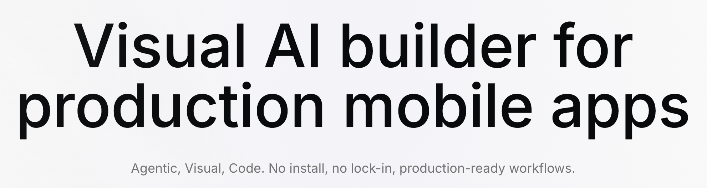

**Dreamflow** 的产品 Slogan 包括两部分：

  - **动态轮播 Slogan**，包括三种表述：
      - 适用于生产环境移动应用的**可视化 AI 构建器** (**Visual AI builder for production mobile apps**)
      - 以未来人的方式构建应用程序 (**Build apps like you're from the future**)
      - 画布 ↔ 代码，无缝同步 (**Canvas ↔ Code, seamlessly synced**)
  - **底部固定的静态辅助说明文字**：
    **Agentic** (代理驱动的), **Visual** (可视化的), **Code** (代码化的)。**无需安装，没有锁定，提供可用于生产环境的工作流** (**No install, no lock-in, production-ready workflows**)。

## 主要功能

### Tri-Surface Editing
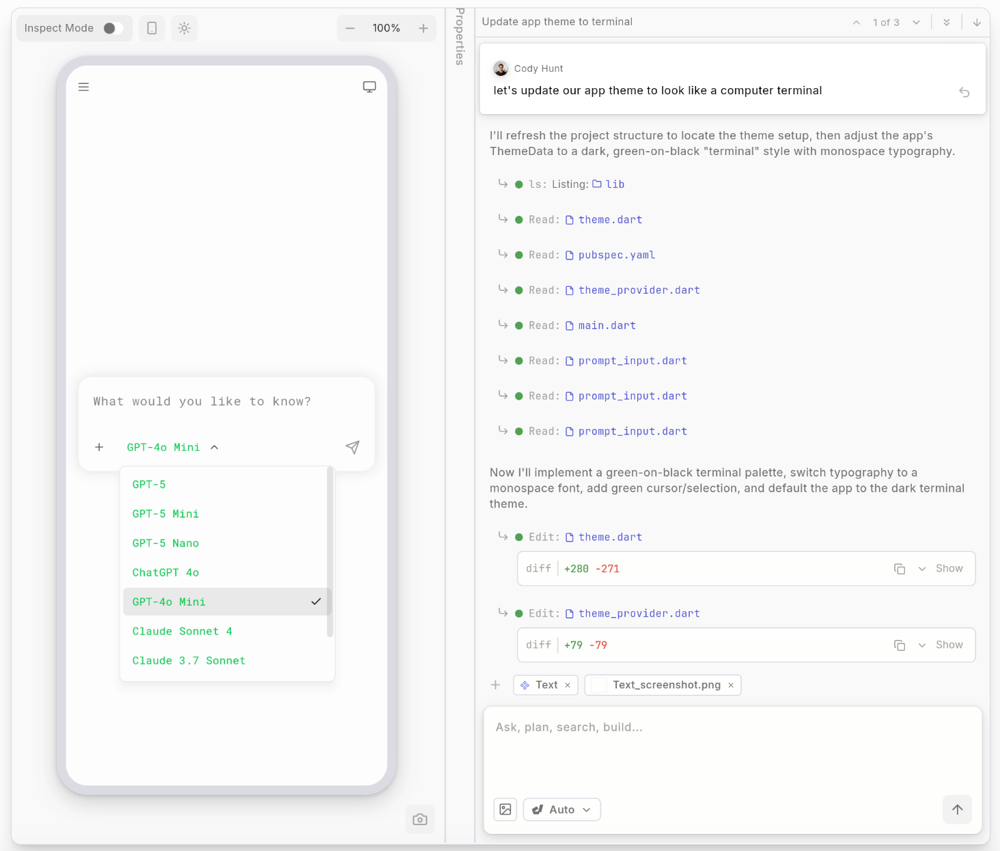

**Dreamflow** 支持从三个维度同时对产品进行编辑：**Agentic**（**AI** 代理驱动）、**Visual**（可视化）和 **Code**（代码）。
它实现了在同一个页面对 **AI** 指令（**prompts**）、可视化画布（**visual canvas**）和代码（**code**）进行无缝编辑。例如，当你修改 **prompt** 时，可以实时看到预览效果中的视觉设计发生对应的变化，这极大地提高了开发效率和反馈速度。

### AI-Powered

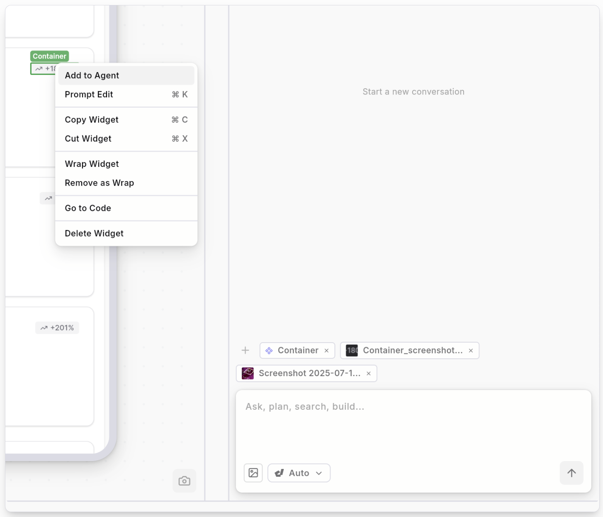

**Dreamflow** 提供了强大的 **AI** 能力。用户可以在已有原型图的基础上直接进行编辑。它支持“**上下文感知生成** (**Context aware generation**)”，即 **AI** 具备理解模式和最佳实践的能力，能够以正确的方式来搭建和组织功能。这意味着 **AI** 不只是生成代码，还能遵循行业规范和设计原则。

### Build for any screen

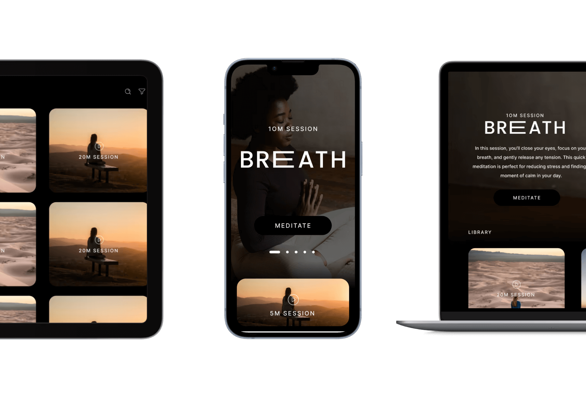

得益于 **Flutter** 框架的支持，Dreamflow实现了响应式设计，能够适配任意设备尺寸。它可以帮助用户构建健壮的、响应式的应用，以适应各种设备尺寸,可部署到 **App Store**、**Play Store** 和 **Web**。

### Backend Integrations
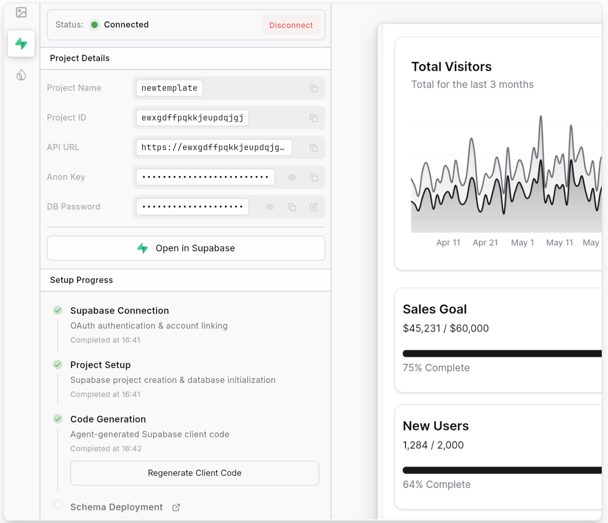

Dreamflow支持集成后端服务，包括 **Supabase** 和 **Firebase**，提供开箱即用的支持。这让用户能够从项目开始的第一天就构建可扩展的全栈应用程序。

## 转化路径

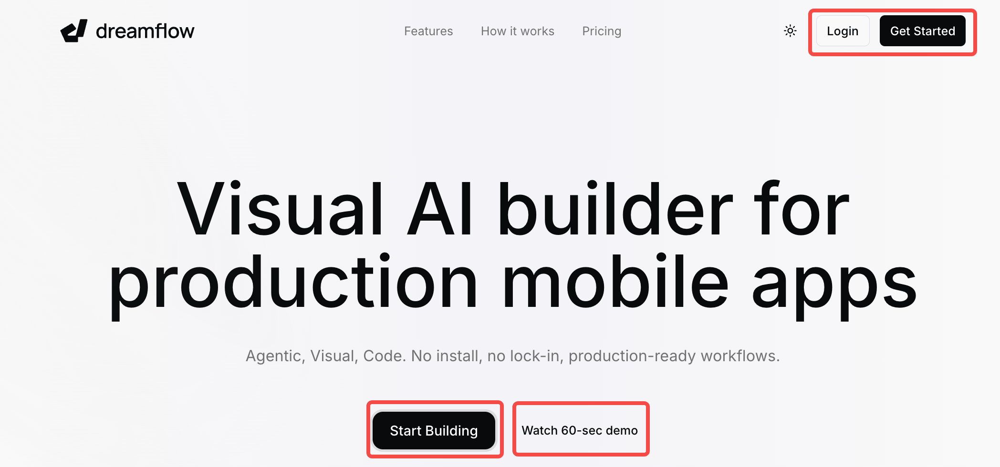

Dreamflow官网的转化路径看起来包括4个转化按钮：“**Start Building**”、“**Watch 60-sec demo**”、“**Login**”、“**Get Started**”。其中，“**Start Building**” 和 “**Get Started**” 采用了醒目的黑色视觉设计，旨在吸引用户点击。

实际上，除了 “**Watch 60-sec demo**” 按钮外，其余 3 个按钮都统一引导用户进入登录页：`https://app.dreamflow.com/login`。

### 登录页
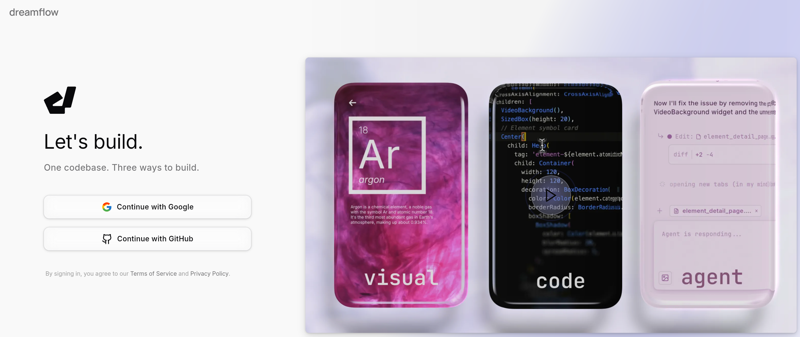

登录页支持两种主要方式：**Google** 邮箱和 **GitHub** 账号。页面的右侧为产品的宣传视频，帮助潜在用户进一步了解产品功能和价值。

我尝试用Google邮箱进行登录后，进入到onboarding界面，显示一共有3步：

1.  回答用户来到 **Dreamflow** 的原因或主要目标。
2.  描述用户在团队中的角色，预设选项包括：工程师（**Eng**）、产品经理（**Product**）、设计师（**Designer**）、创始人（**Founder**），用户也可以自行填写其他角色。
3.  选择公司规模，最小为 1-10 人，最大为 5000+。

完成这些信息填写后，用户即可开始试用产品。

### Watch 60-sec demo
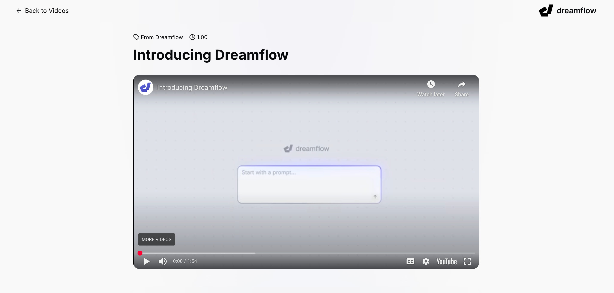

点击此按钮后，会进入一个包含演示视频的专门页面。该视频简要介绍了 **Dreamflow** 是什么，以及用户为什么要选择 **Dreamflow**。

## 产品生态

**Dreamflow** 提供了完善的、多形式的教程和资源，以指导用户使用产品。

### [产品使用文档](https://docs.dreamflow.com/)
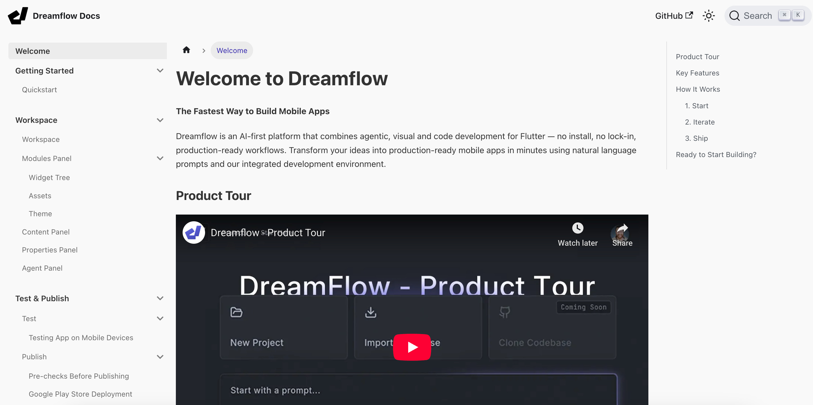

产品使用文档内容详实，除了纯文本说明外，还搭配有对应的产品截图以及 **YouTube** 教程视频，形成多媒体学习体验。

### [教程视频](https://dreamflow.app/videos)

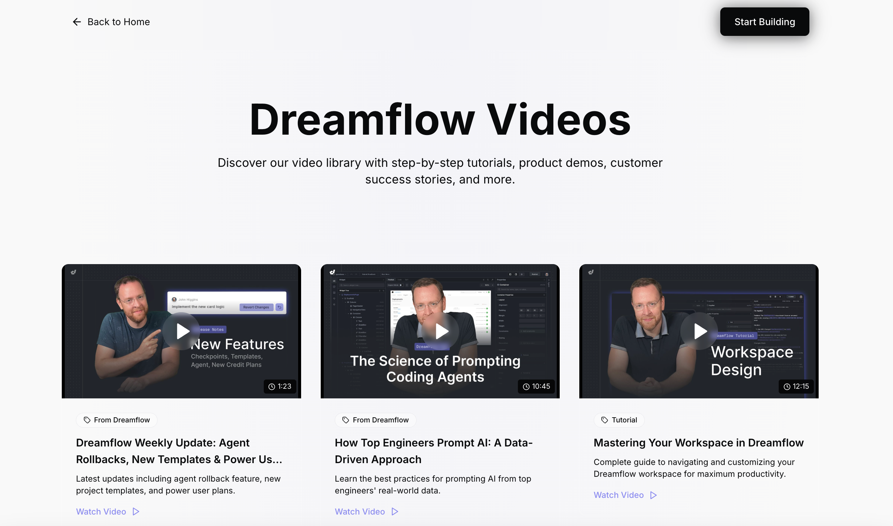

在 **Dreamflow** 官网上，设置有专门的视频区域，用于汇总相关的产品使用教程视频，方便用户系统地学习和掌握产品功能。

### [reddit 社区](https://www.reddit.com/r/DreamFlow/)
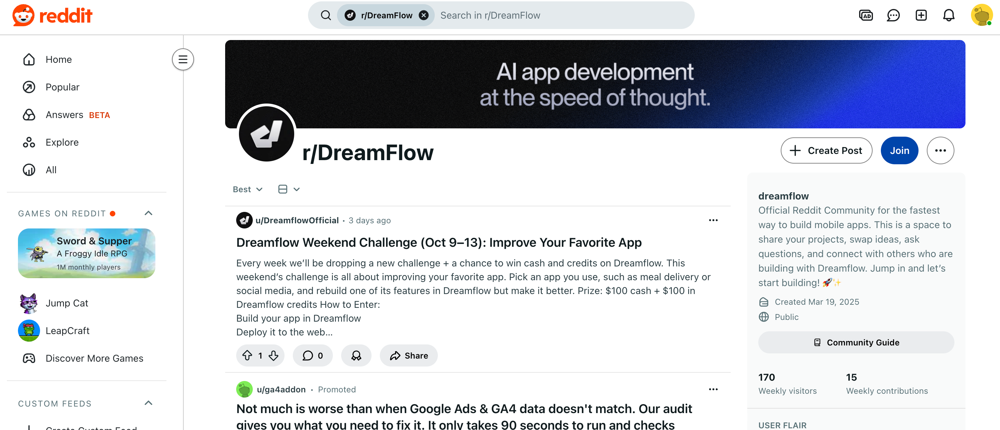

**Dreamflow** 还在 **reddit** 上建立了自己的社区。这个社区便于用户之间互相讨论产品使用经验、分享成果，并向官方反馈问题和提出建议，是产品与用户互动的重要平台。

## 价格体系

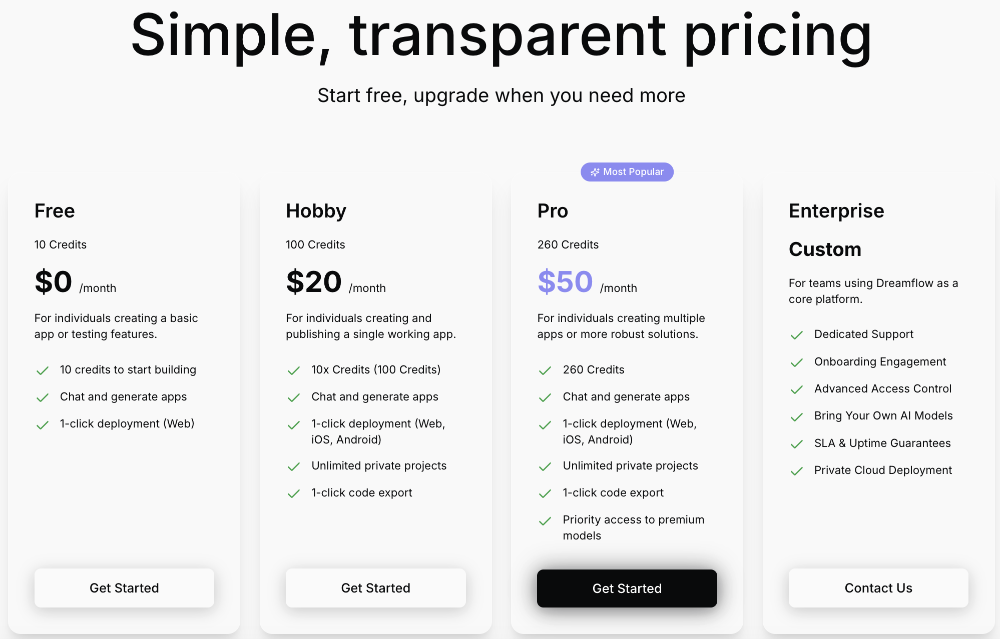

**Dreamflow** 的价格分为 4 档，主要根据用户可使用的额度（**credits**）以及功能权限进行划分。

**免费用户**每天可以使用 10 **credits**，并允许在 **Web** 端部署一次。然而，如果用户需要使用更多高级功能，例如导出代码、部署在移动端（**App Store/Play Store**）等，则需要付费升级至更高版本。

值得注意的是，该产品的核心使用体验和生成结果会受到用户 **prompt** 的影响，而**更高级别的付费版本用户，有权优先使用更高级别的 AI 模型**。这在一定程度上会直接影响用户生成的产品和代码的质量、复杂度和完成度，是付费分级中非常关键的差异点。

## 页面交互

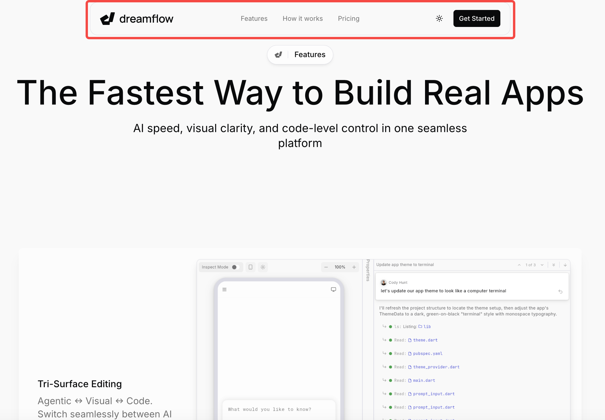

最后，值得单独说明 **Dreamflow** 网站的交互形式。可以看出，该站点目前的页面数量相对较少，或者说，它有意将所有重要的内容都汇总在一个主页面上，以避免用户在页面跳转的过程中流失。

因此，**Dreamflow** 网站顶部导航栏的三个重要入口：**Features**、**How it works**、**Pricing**，在用户点击之后，并不会跳转到新的页面，而是通过 URL 中的 `#` 锚点直接平滑下滑到对应的模块内容。

此外，在用户向下滑动页面的过程中，导航栏会以悬浮（**sticky**）的形式始终固定在页面顶部，这极大地方便了用户随时查看和点击其他感兴趣的内容，提升了单页网站的导航效率。