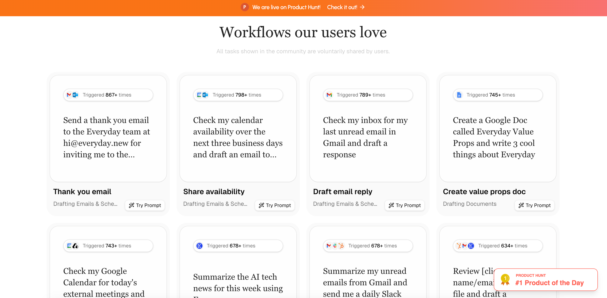
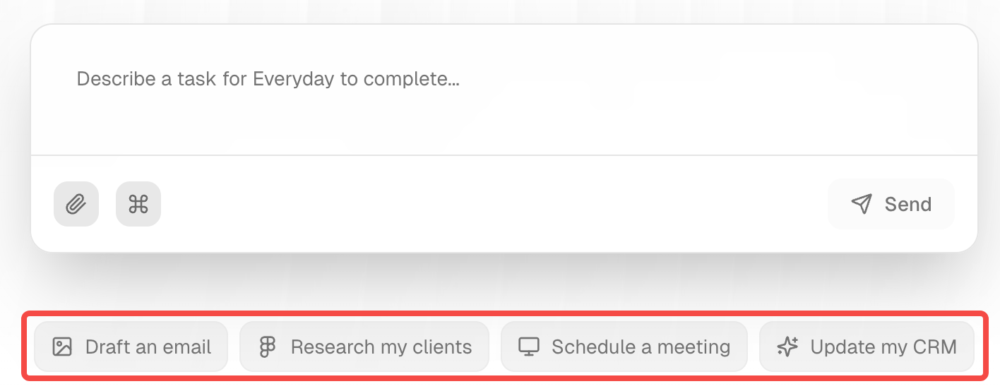
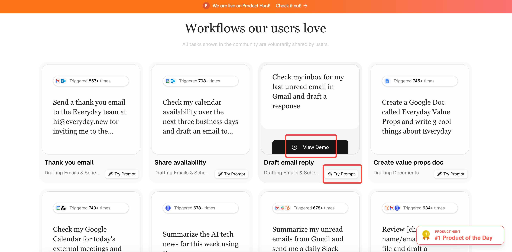

**[Everyday](https://www.everyday.new/)** is a personal AI assistant designed to help users complete tasks and multi-step workflows across different applications through simple natural language commands. It aims to boost productivity and allow users to focus on what truly matters.

In short, Everyday is an “all-in-one AI” that turns user intentions into real outcomes—helping you clean up your inbox, organize daily work, and drive progress, so you can focus on higher-value tasks.

## Product Slogan

Everyday’s slogan is **“Get more done, Everyday.”**  
On one hand, it emphasizes its importance and frequency of use (something you use every day); on the other, it plays on the brand name “Everyday” itself.

## Core Features

Everyday’s feature presentation isn’t very systematized—there isn’t a dedicated feature page or module in either the top or bottom navigation. You can only learn about its functions from the “Workflows our users love” section on the homepage. Its main goal is workflow automation, covering areas such as:

### 1. Email and Communication

These features focus on **drafting, replying to, following up on, and summarizing emails**, as well as **scheduling coordination**.

**Key features include:**

* **Email drafting and replies:** Thank you email, Draft email reply, Personalized CRM email, Review notes and follow up.  
* **Scheduling and availability sharing:** Share availability, Check calendar and send availability.  
* **Email summaries:** Email digest.

### 2. Customer Relationship Management (CRM)

These features focus on **automating CRM updates, preparation, and data utilization**, while enhancing client interactions.

**Key features include:**

* **CRM data operations:** Update CRM, Find inactive CRM contacts and...  
* **Meeting prep and research:** Meeting prep with CRM, Research attendees, Meeting attendee research, Client CRM file and personalization.

### 3. Document and Information Processing

These features handle **document generation and information summarization**.

**Key features include:**

* **Content creation:** Create value props doc.  
* **Information summaries:** Weekly AI news summary, AI news digest.

### 4. Scheduling and Task Management

These features aim to **improve time management and reminders**.

**Key features include:**

* **Task reminders:** Create reminders.  
* **Calendar coordination:** Check calendar and send availability.

## Conversion Path

Everyday’s conversion path is designed to capture users with **clear intent**. In addition to the standard “Get Started” button (top right corner), the product uses several key interaction methods to encourage sign-up:

### Chatbox Interaction (Core Entry Point of the AI Product)

The chatbox is the most common and familiar interaction format for AI products. The placeholder text “Describe a task for Everyday to complete...” encourages users to type in a task they’d like Everyday to handle.

For example, entering “create a to-do list for today” and clicking the button redirects to the signup page. In the URL, the input prompt is appended as a `prompt` parameter:

However, the purpose of this parameter isn’t entirely clear. One might assume that after registration, Everyday would automatically execute the entered task—but it doesn’t. You still need to re-enter the command. Possible reasons include:

1. **User data collection:** To continuously collect **high-frequency user needs** before signup, which helps guide product feature prioritization.  
2. **Retention and conversion analysis:** To track the **intent source** of signups and analyze conversion rates between different task prompts and paying users—useful for both marketing and product optimization.

### Template Tags

If users don’t have a specific task in mind, they can click one of the template tags below the chatbox—such as “Draft an email.” This also redirects to the signup page with a corresponding `prompt` parameter.

### Use Cases

Besides templates, Everyday showcases detailed use cases, each displaying how many times the task has been triggered. Users can click “View Demo” to preview the workflow execution or “Try Prompt” to experience it firsthand (which again leads to the signup page).

## Pricing Structure

**Everyday hides its pricing behind a registration wall**—users must sign up and enter the app to find the pricing page in the bottom-left corner. This strategy is known as **“Pricing Behind the Wall.”**

For individual users, Everyday currently offers three pricing tiers (enterprise users must contact sales for details), ranging from free to $99. The key differences lie in the **monthly credit limits**, **number of integrations supported**, and **priority of customer support**.

## Personalization and Onboarding

### Behavioral Rewards

The “**Earn 150K tokens (0/3)**” badge in the upper-right corner represents a **user engagement incentive system**. It encourages exploration through small, trackable tasks (like 0/3) with valuable virtual rewards (tokens).

Here, the reward encourages users to **connect their commonly used tools with Everyday**, increasing **product stickiness** and creating a **lock-in effect**—the more integrations a user adds, the higher the switching cost, making Everyday the central hub of their workflow.

### Installation Pop-up

A pop-up invites users to add Everyday to their desktop home screen, enabling them to open Everyday directly via an app-like icon instead of going through a browser each time.

Once visible on the screen, the icon serves as a **constant reminder**, helping Everyday seamlessly integrate into the user’s daily workflow and **subtly build long-term usage habits**.
