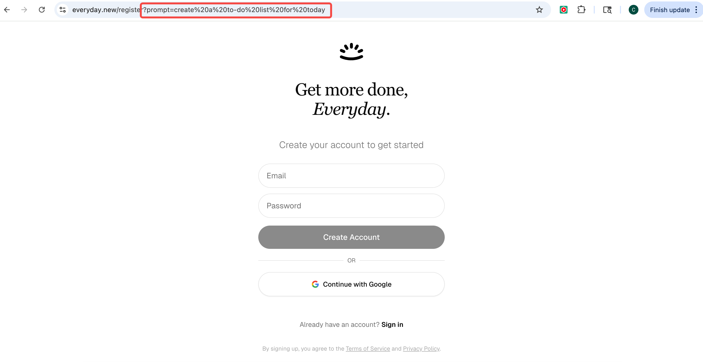
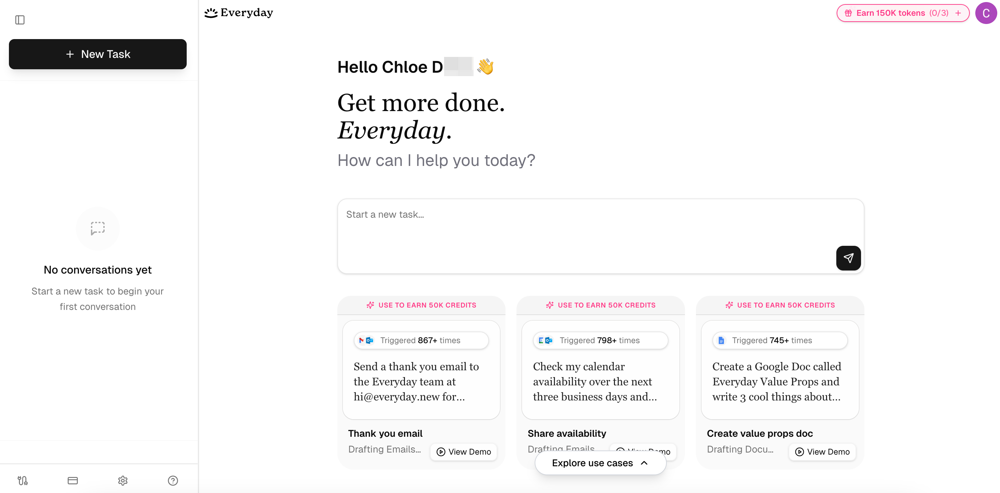
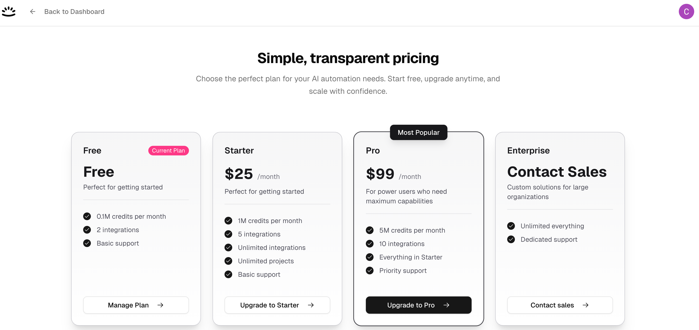

**[Everyday](https://www.everyday.new/)** 是一款个人AI助手产品，旨在帮助用户通过简单的自然语言指令，跨应用完成任务和多步骤工作流程，从而提高效率，让用户专注于更重要的事情。

简而言之，Everyday 是一个“一体化的 AI”，通过将用户的意图转化为实际结果，帮助用户清理收件箱、组织日常工作并推动工作进展，让用户专注于更重要的事情。

## 产品slogan

Everyday的slogan为“Get more done, Everyday.”，一方面强调其对用户的重要程度和必要性（每天都会使用到），另一方面和其产品名称“Everyday”相呼应。

## 主要功能

Everyday的功能介绍其实没有非常体系化，我在其顶部和底部导航栏都没有找到专门的功能介绍页面或模块。只能通过首页第二屏的“Workflows our users love”中的示例了解Everyday的产品功能，核心目标是实现工作流程自动化，包括：

### 1. 电子邮件与通信

这类功能主要关注于**处理邮件的起草、回复、跟进和总结，以及日程协调**。

**主要功能包括：**

* **邮件起草和回复：** Thank you email (发送感谢邮件), Draft email reply (草拟邮件回复), Personalized CRM email (个性化 CRM 邮件), Review notes and follow up (审查笔记并跟进)。
* **日程和可用性共享：** Share availability (分享空闲时间), Check calendar and send availability (检查日历并发送空闲时间)。
* **邮件摘要：** Email digest (邮件摘要)。

### 2. 客户关系管理 (CRM)

这类功能旨在**自动化 CRM 数据的更新、准备和利用，以及增强客户互动**。

**主要功能包括：**

* **CRM 数据操作：** Update CRM (更新 CRM), Find inactive CRM contacts a... (查找非活跃 CRM 联系人并...)。
* **会议准备与研究：** Meeting prep with CRM (使用 CRM 进行会议准备), Research attendees (研究参会者), Meeting attendee research (会议参会者研究), Client CRM file and personalization (客户 CRM 文件和个性化)。

### 3. 文档与信息处理

这类功能负责**自动生成文档和进行信息提炼**。

**主要功能包括：**

* **内容创建：** Create value props doc (创建价值主张文档)。
* **信息摘要：** Weekly AI news summary (每周 AI 新闻摘要), AI news digest (AI 新闻摘要)。

### 4. 日程与任务管理

这类功能主要用于**优化时间管理和任务提醒**。

**主要功能包括：**

* **任务提醒：** Create reminders (创建提醒)。
* **日程协调：** Check calendar and send availability (检查日历并发送空闲时间)。

## 转化路径

Everyday 的转化路径设计旨在利用用户的 **“明确意图”** 驱动注册。除了常见的注册按钮（右上角的“Get Started”），主要通过以下方式吸引用户进行下一步：

### 对话框交互（AI 产品的核心入口）

对话框应该是AI产品最常见的交互方式，也是人们最熟悉的交互方式。框中有提示文字“Describe a task for Everyday to complete...”鼓励用户可以尝试输入自己期望完成的任务。

我以“create a to-do list for today”为例，输入并点击按钮后会进入注册页面，在URL可以看到我输入的需求通过 `prompt` 参数拼接在网址最后方：

但是我不太明白这个prompt的参数有什么用。我本来以为是便于我完成注册后，进入产品使用界面时会直接呈现给我任务的执行结果，但看起来并不会，我仍然需要再次输入任务指令。关于这个设置，我有以下猜测：
1. **用户数据收集：** 持续收集真实用户在注册前最迫切的 **高频需求**，指导产品功能的开发优先级。
2. **留存与转化分析：** 跟踪用户注册的 **“意图来源”**，分析不同任务需求（Prompt）与最终付费用户之间的转化率，这有助于优化营销和产品体验。

### 模板标签

如果暂时想不到有什么需要Everyday执行的任务，也可以直接点击对话框下方的模板标签，如“Draft an email”。点击后跳转到注册页面，URL中也会有对应的 `prompt` 参数。

### 使用案例

除了模板标签外，Everyday还提供了更具体的使用案例，并介绍每个案例（任务）被触发了的次数。你可以点击“View Demo”感受任务执行的情况，也可以点击“Try Prompt”直接体验（同样是跳转到注册页面）。

## 价格体系

**Everyday 将价格表藏在应用内部**，用户需要完成注册、进入产品后才能在左下角找到价格页面的入口。这种策略称为 **“门后定价”（Pricing Behind the Wall）**。

对于个人用户来说，目前Everyday有三档价格（企业用户需要联系销售确认使用细节），从免费到$99，主要区别在于：每月允许使用的credits限额、支持integrations的其它应用、官方支持的优先级。

## 个性化配置
### 行为奖励

产品界面右上角的 **“Earn 150K tokens (0/3)”** 提示，是一种典型的 **用户激励模型**。通过设定具体的、可追踪的小任务（如 0/3），并提供有价值的虚拟奖励（Token），来引导用户探索产品核心功能。

在这里，奖励目标是引导用户将自己的常用工具与 Everyday 进行绑定。这背后的核心在于提升 **“产品粘性”** 和 **锁定效应**。用户绑定的应用越多，**更换产品的成本就越高**，从而将 Everyday 锁定为工作流的中心枢纽。

### 安装弹窗

弹窗提示用户将Everday添加到电脑主屏幕，用户可以像原生 App 一样，通过点击图标直接打开 Everyday，避免了每次都要打开浏览器、输入网址或查找书签的步骤。

一旦图标出现在屏幕上，它就可以保持持续的可见性，作为一种**持续的提醒**。这种便捷性有助于产品快速融入用户日常工作流程，**潜移默化地建立使用习惯**。
