[FounderPal](https://founderpal.ai/) is an AI-powered marketing platform, somewhat similar to [Swiftbrief](https://chloevolution.com/posts/swiftbrief-review/), which we previously reviewed. Its core features include:

- **AI Marketing Strategy Generator**: Users only need to input basic business details, and the AI will generate a comprehensive marketing strategy within minutes.  
- **User Persona Generator**: Helps users identify and analyze target audiences by creating detailed ideal customer profiles.  
- **Marketing Idea Generator**: Assists users in brainstorming innovative marketing concepts based on industry trends and business objectives.  

## Website Strategy

### Hero Section Messaging  
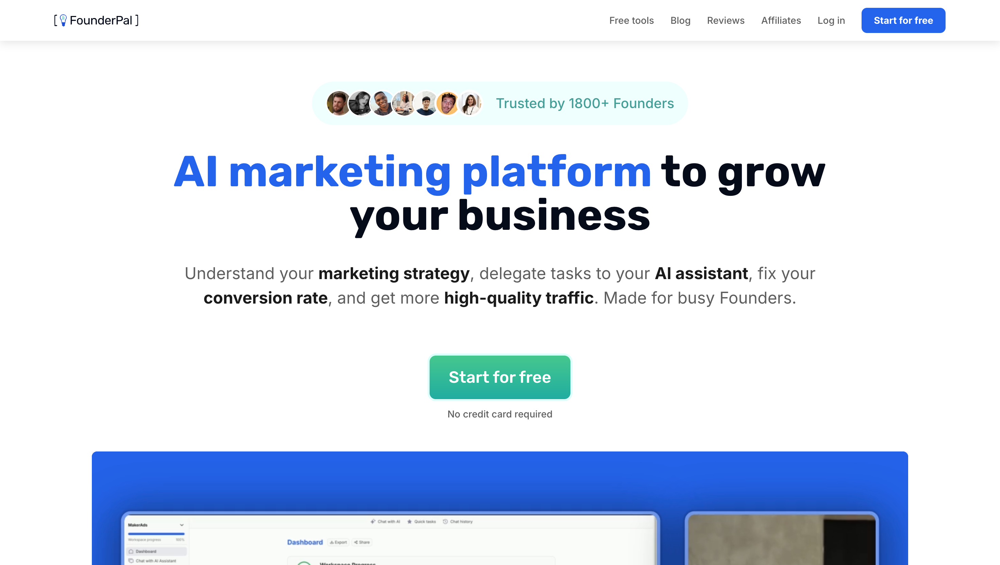

First, FounderPal positions itself clearly as an "AI Marketing Platform," with value focused on driving **business growth** through AI — covering user concerns such as **strategy**, **conversion**, and **high-quality traffic**.

The homepage content centers around two key aspects:

1. **Social Proof**
   - Above the main headline  
     
   - Below the demo video  
     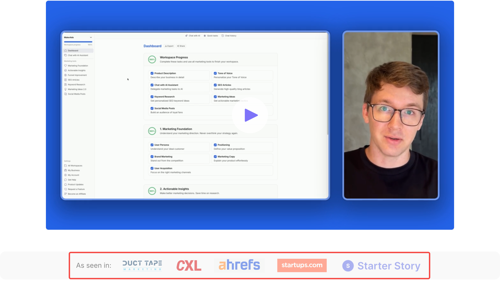
   - Client logo section  
     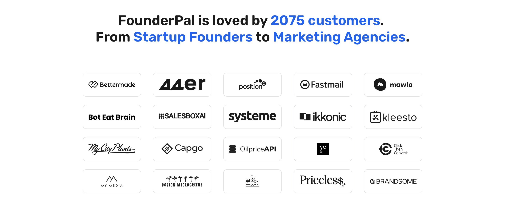
   - Client testimonials (both video and written)  
     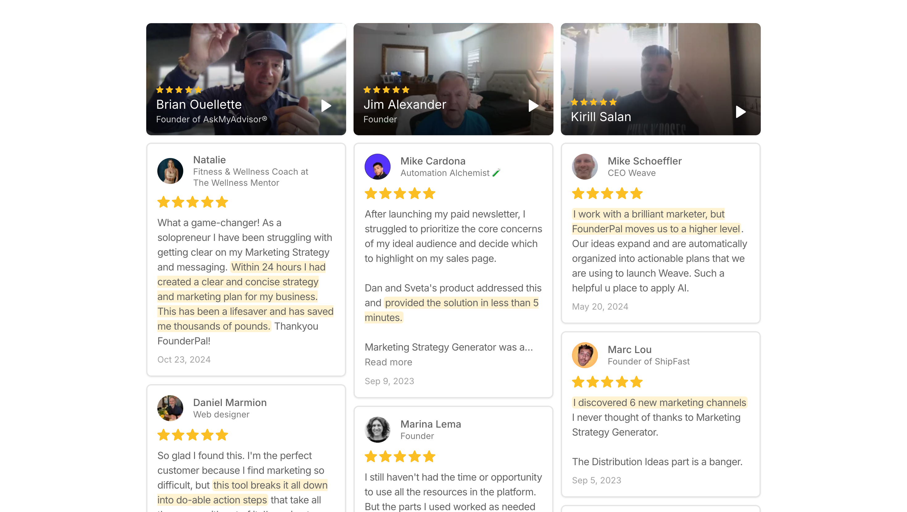

2. **Time-Saving (Efficiency)**
   - Highlights how FounderPal completes processes faster than traditional methods  
     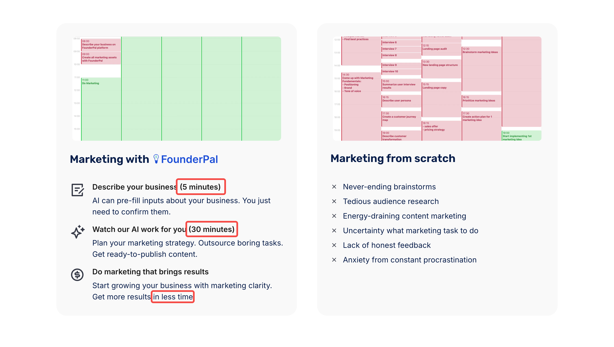
   - Each use-case card shows the estimated monthly time savings  
     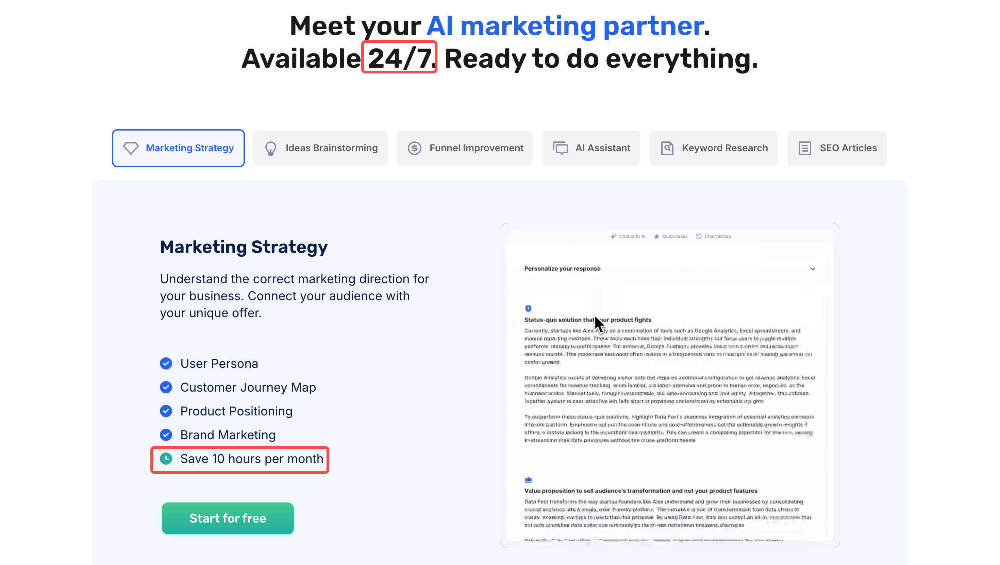

### Traffic Acquisition Strategy

From FounderPal’s footer structure, we can infer their traffic strategy through SEO and affiliate marketing:

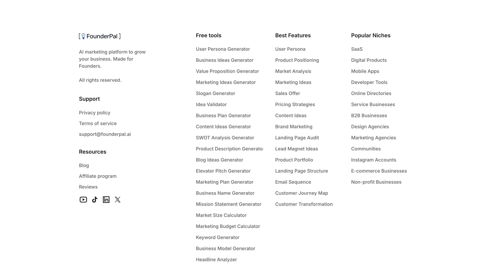

- **Marketing Strategy Examples Page**: https://founderpal.ai/marketing-strategy-examples

This page lists marketing strategies across various industries and products. Each case study follows the same structure:
1. Learn about your ideal customer  
2. Improve your product positioning  
3. Get 10 marketing ideas  

These align directly with the product's three main features: User Persona, Product Positioning, and Marketing Ideas.  
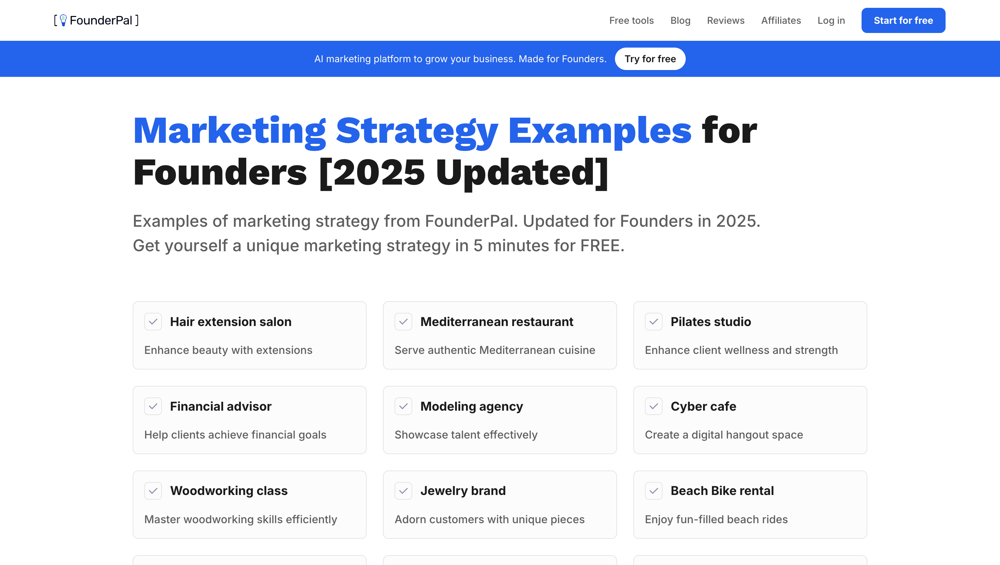

- **Features Page**: https://founderpal.ai/msg-features

Lists key features, each with a dedicated page and corresponding free tools.  

- **Free Tools Page**: https://founderpal.ai/free-tools

Unlike the features page, this one aggregates all free tools with clear instructions—users only need to fill in three input fields to get results. Each tool page also provides example outputs.  
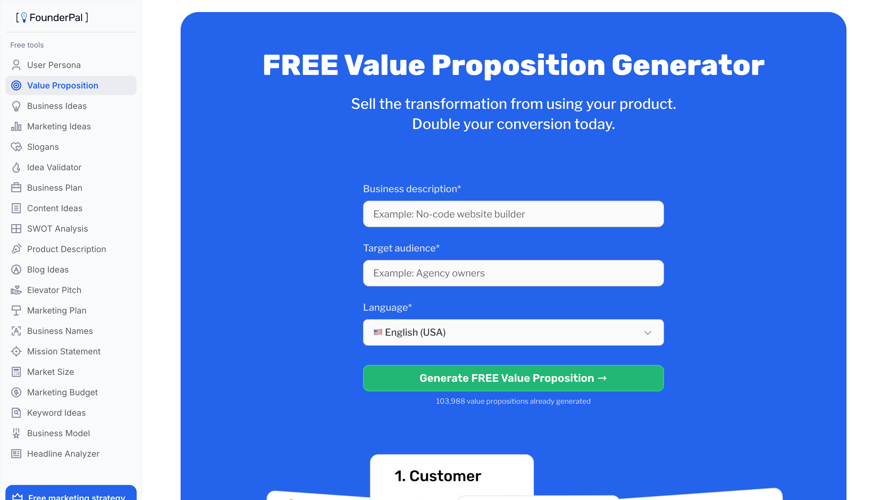

- **Affiliate Program**: https://founderpal.ai/affiliate

Affiliates earn 30% commission per sale. Earnings screenshots are shown below.  
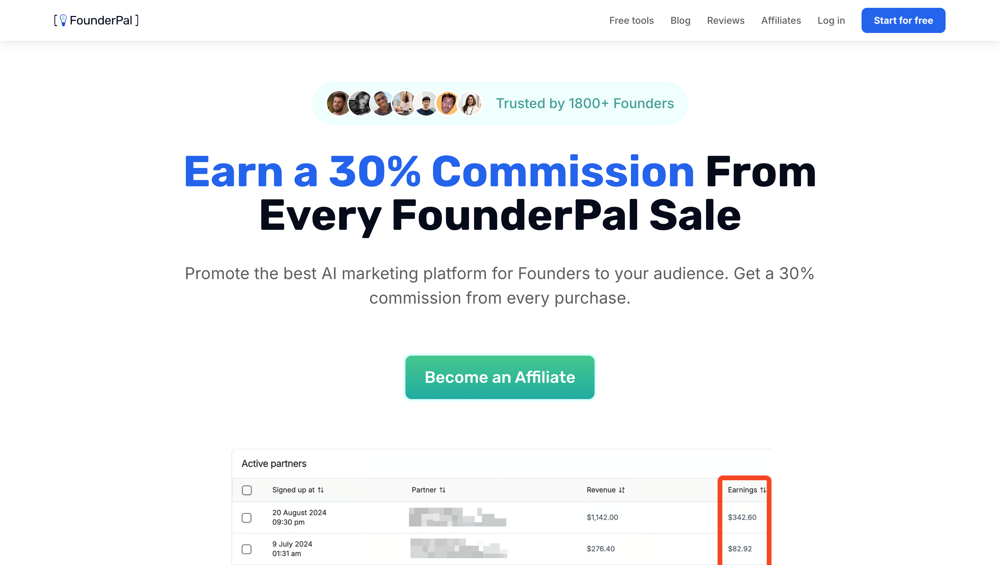

## Product Review

### Sign-Up

Supports email registration or Google sign-in. A message above the sign-up form shows how many people registered last week to encourage sign-ups.  
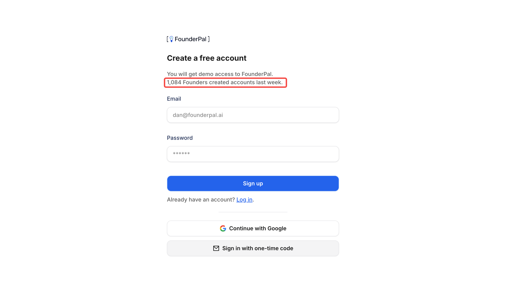

### Onboarding  
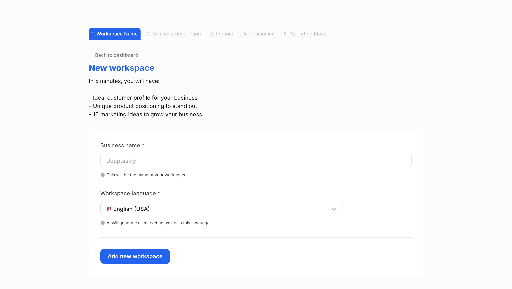

The onboarding flow consists of five steps, expected to take 5 minutes:

1. **Workspace Name**  
   Includes business name and workspace language.

2. **Describe Your Business**  
   - For new ideas (no existing product): Describe your idea in 2–3 sentences. If stuck, click "Generate 10 business ideas."  
     For example, inputting “pilates” produces several concepts:  
     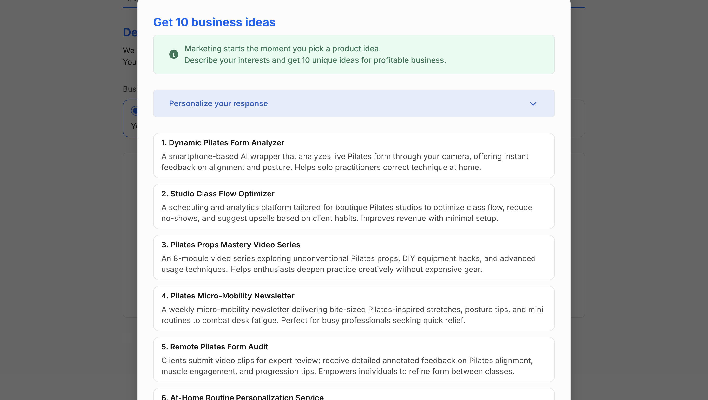

     Clicking an idea auto-fills the text field:  
     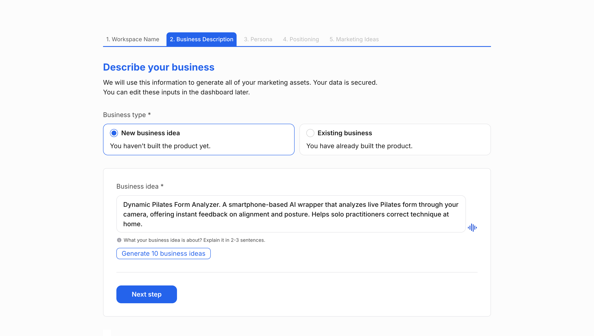

   - For existing businesses: Provide more detail—website URL, product description, monetization model (optional), product type (optional), and product stage (optional).  
     The example used is the *Dynamic Pilates Form Analyzer*.

3. **Set Target User Persona**  
   Country, gender, and age (optional).  
   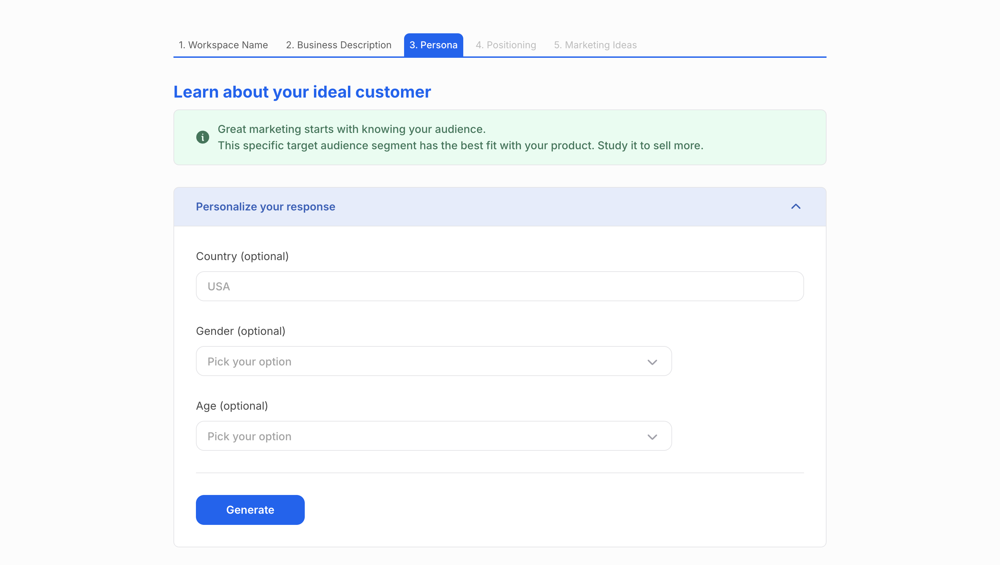

   The resulting persona includes:

| **Dimension**       | **Element**         | **Description**                                                                   |
|---------------------|---------------------|-----------------------------------------------------------------------------------|
| **Pain & Needs**    | Core Pain           | Problem that bothers your Persona                                                 |
|                     | Daily Frustration   | Pains that irritate your Persona                                                  |
|                     | Desired Goal        | Goal that your Persona wants to achieve                                          |
|                     | Expected Benefits   | Benefits that your Persona craves                                                |
| **Current Status**  | Existing Solution   | Status-quo solution that your Persona uses                                       |
|                     | Tool Usage          | Tools that your Persona currently uses                                           |
|                     | Awareness Limitation| Context of your Persona about other solutions                                    |
| **Decision Journey**| Trigger Event       | Event that triggered your Persona                                                |
|                     | Decision Doubts     | Doubts that slow down your Persona                                               |
|                     | Purchase Cycle      | Sales cycle of your Persona                                                      |
|                     | Decision Influencer | Advisors that impact your Persona's decision                                     |
| **Info Consumption**| Content Preference  | Content that your Persona consumes                                               |
|                     | Key Influencers     | Influencers that your Persona follows                                            |
|                     | Community Presence  | Communities that your Persona knows about                                       |

4. **Set Product Positioning**  
   Includes product rival, marketing tone, and target emotions (optional). The resulting output includes:

| **Element**         | **Description**                                                                 |
|---------------------|---------------------------------------------------------------------------------|
| **Attention Anchor**| Big idea to get your audience's attention                                      |
| **Value Proposition**| Promise of transformation/outcome                                              |
| **Emotional Commitment**| Promises to build emotional connection with target audience               |
| **Switching Reasons**| Reasons to ditch current solution for yours                                   |
| **Competitive Advantage**| Strengths that make your product better than alternatives               |

5. **Get 10 Marketing Ideas**  
   Customize by complexity, cost, and time needed.  
   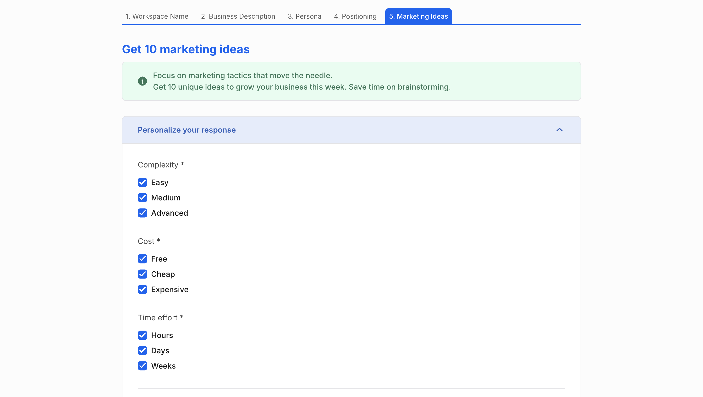

   The output spans landing pages, livestreams, influencer marketing, community building, and more:  
   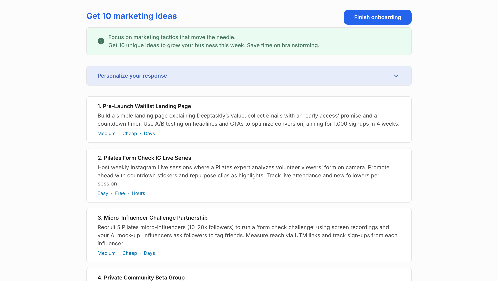

After onboarding, a pop-up lets users know they've just completed a small part of the overall product journey and encourages exploring the full dashboard:  
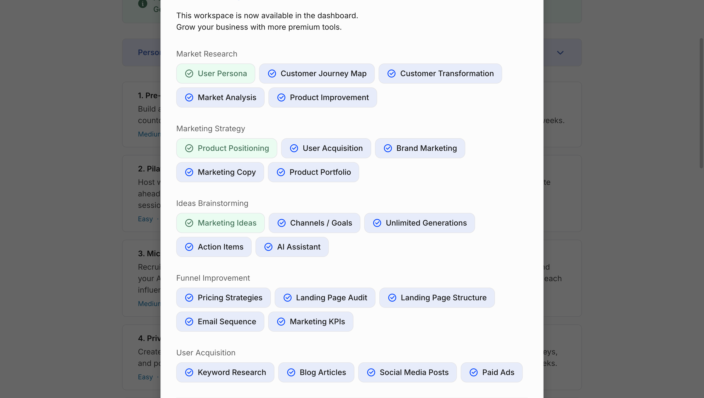
