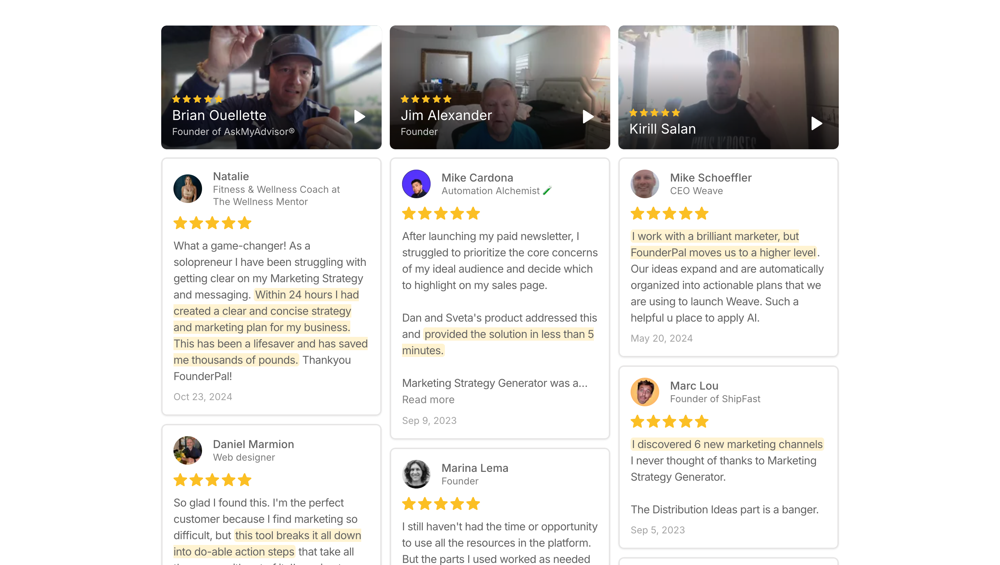
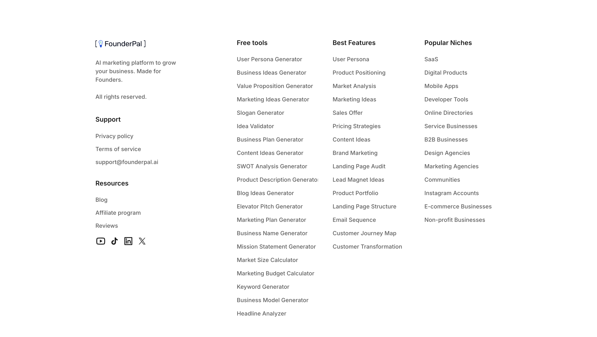
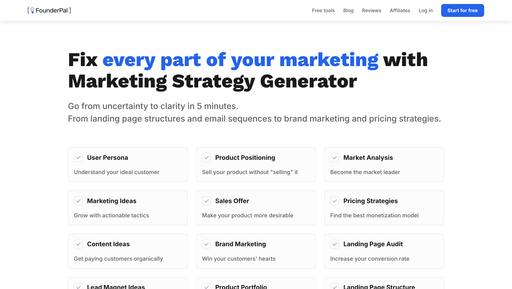
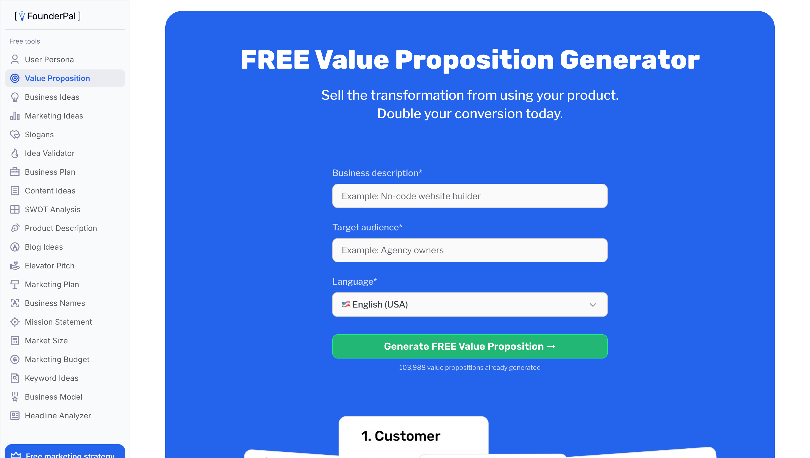
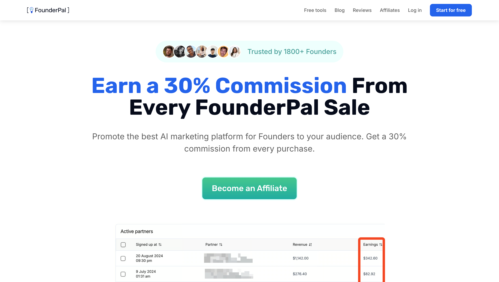
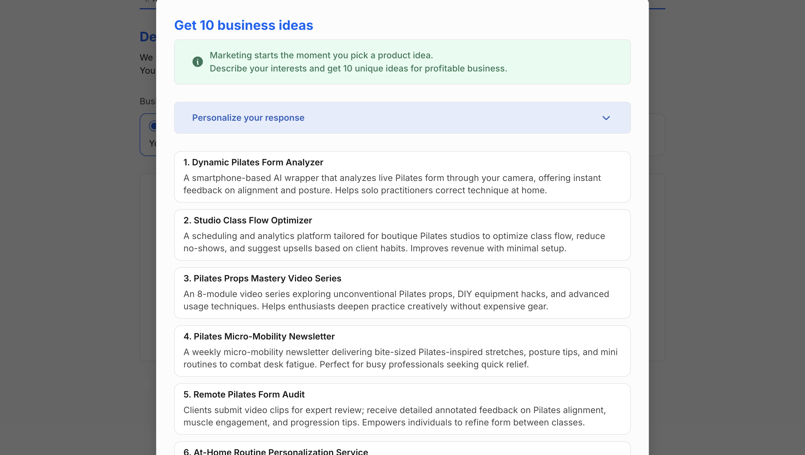
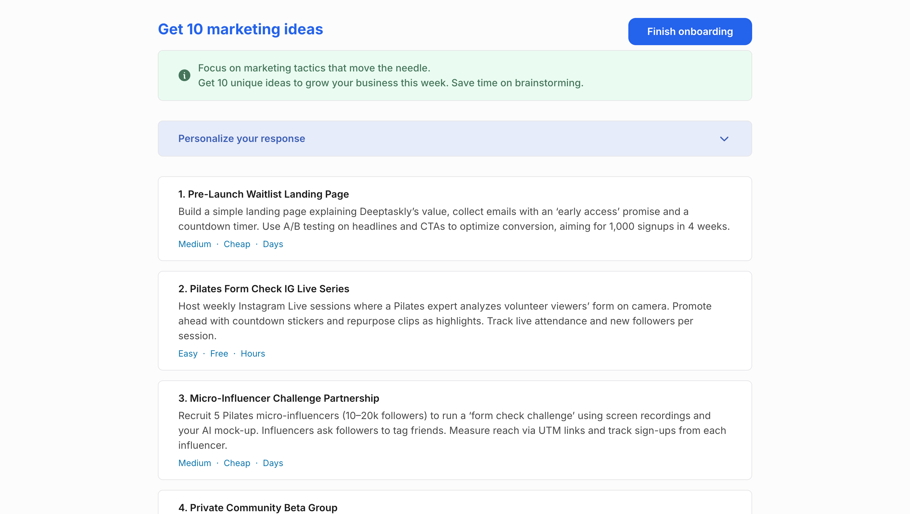
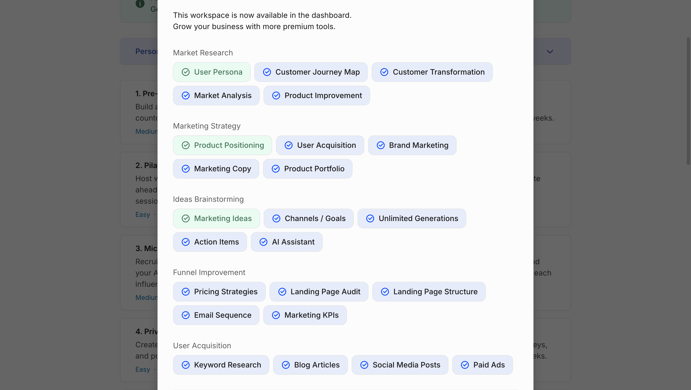

[FounderPal](https://founderpal.ai/)是一个AI驱动的营销平台，和之前测评过的[Swiftbrief](https://chloevolution.com/zh-cn/posts/swiftbrief-review/)在某种程度上类似。核心功能包括：
- AI驱动的营销策略生成器：用户只需提供业务详情，AI即可在几分钟内生成策略相应的营销策略
- 用户画像生成器：通过创建详细的理想客户画像，帮助用户识别和分析目标受众
- 营销创意生成器：根据行业趋势和业务目标，协助用户集思广益，提出创新的营销理念和内容创意

## 网站运营策略
### 首页叙事

首先，可以看到Founderpal给自己的定位是“AI营销平台“，其产品价值在于通过AI助手“帮助业务增长”，涵盖用户关注的重点：营销策略、转化率、高质量流量。
其次，可以发现首页的内容有两个重点：
1. 信任背书
- 首屏主标题上方

- demo视频下方

- 客户品牌logo展示

- 具体客户证言，包括视频和文字两种形式

2. 省时（即高效）
- 对比传统的营销流程，明确列出Founderpal完成相同流程所需要的时间，让用户能够更加明确地感知到工具带来的潜在效率

- 介绍具体的使用场景时，每张卡片下都会说明每月节省了多少时间

### 引流方法
从Founderpal底部导航栏，我们其实可以大概了解其从SEO和联盟营销角度吸引流量的方法：

- 案例聚合页：https://founderpal.ai/marketing-strategy-examples

这个页面列举了大量不同行业/产品的营销策略案例，每个案例的内容结构是相似的：
1. 了解你的理想客户 (Learn about your ideal customer)  
2. 优化产品定位 (Improve your product positioning)  
3. 获取10个营销创意 (Get 10 marketing ideas)
这三点刚好对应产品功能（Features）里面的三个功能：User Persona、Product Positioning、Marketing Ideas

- 功能聚合页：https://founderpal.ai/msg-features

列举了十几个产品的关键功能，每个功能都有单独的介绍页，且有对应的免费工具可试用。

- 免费工具聚合页：https://founderpal.ai/free-tools

不同于功能页，免费工具汇总在一个页面，明确提示用户只需要确认三个输入框内的内容，即可免费试用。如果用户仍有疑虑，每个工具页面下方还会提供内容生成结果的示例。

- 通过联盟营销进行产品分销：https://founderpal.ai/affiliate

每分销成功一次，可获得销售额的30%作为佣金，下方还展示了佣金收入的截图。

## 产品测评
### 注册
支持邮箱注册，或直接通过谷歌邮箱授权登录。在注册框上方会提示上周有多少人完成了注册，用来吸引用户完成注册流程。

### Onboarding

需要设置五方面的信息，预计耗时5分钟：
1. 工作区名称（workspace name）
包括业务名称、工作区语言
2. 描述业务细节
这里会区分：
- 新的业务想法（即还没有对应的产品）：用两到三句话解释业务背景。如果暂时没有比较明确的思路，也可以点击下方的“Generate 10 business ideas”来帮助思考。
比如我输入“pilates”之后生成的业务想法：

如果你觉得其中一个想法还不错，点击后就会自动填充到文本框里：

- 已有业务（即已有产品）：需要提供的信息就比较多了。包括：网站URL、产品描述、商业化模式（选填）、产品类型（选填）、产品阶段（选填）

这里使用前面提到的动态普拉提姿势分析仪 (Dynamic Pilates Form Analyzer)作为例子，进入下一步。

3. 设置目标用户画像
包括国家、性别、年龄。不过这三项都是选填。

然后你就会得到一份用户画像，包括以下几个方面：

| **维度**         | **要素**       | **详细说明**                                                                 |
|------------------|------------------|----------------------------------------------------------------------------|
| **痛点与需求**   | 核心痛点         | 困扰用户的问题 *(Problem that bothers your Persona)*                   |
|                  | 日常烦恼         | 激怒用户的痛苦点 *(Pains that irritate your Persona)*                  |
|                  | 渴望目标         | 用户希望达成的目标 *(Goal that your Persona wants to achieve)*         |
|                  | 期望收益         | 用户渴望获得的收益 *(Benefits that your Persona craves)*               |
| **当前状态**     | 现有解决方案     | 用户当前使用的现状解决方案 *(Status-quo solution that your Persona uses)* |
|                  | 工具使用情况     | 用户当前使用的工具 *(Tools that your Persona currently uses)*          |
|                  | 认知局限         | 用户对其它解决方案的认知 *(Context of your Persona about other solutions)* |
| **决策路径**     | 触发事件         | 促使用户寻找解决方案的事件 *(Event that triggered your Persona)*      |
|                  | 决策顾虑         | 使用户决策放缓的疑虑 *(Doubts that slow down your Persona)*           |
|                  | 购买周期         | 用户的销售周期 *(Sales cycle of your Persona)*                        |
|                  | 决策影响因素     | 影响用户决策的建议者 *(Advisors that impact your Persona's decision)* |
| **信息接触**     | 内容偏好         | 用户消费的内容 *(Content that your Persona consumes)*                 |
|                  | 关注KOL          | 用户追随的意见领袖 *(Influencers that your Persona follows)*          |
|                  | 社群参与         | 用户了解的社群 *(Communities that your Persona knows about)*          |

4. 设置产品定位
包括产品的克星、营销风格、期望的客户情绪。这三项也都是选填。提交后会得到以下几个方面的内容：

| **要素**       | **说明**                                                                                     |
|-------------------|---------------------------------------------------------------------------------------------|
| **注意力锚点**     | 吸引目标受众的核心创意（Big idea to get your audience's attention）                          |
| **价值主张**       | 向客户承诺的可实现的转变/成果（Value proposition to sell the desired transformation）        |
| **情感承诺**       | 与目标受众建立情感连接的产品承诺（Promises to build a connection with your target audience） |
| **替代理由**       | 放弃现有解决方案选择本产品的关键原因（Reasons to ditch the status-quo solution for your product） |
| **竞争优势**       | 使产品优于替代方案的差异化优势（Strengths that make your product better than alternative solutions） |

5. 获得10个营销想法
设置：复杂度、花费、需要的时间。

涵盖落地页、直播、KOL营销、社区等多个方面的营销策略：

以上就是onboarding的全流程，然后弹窗会提示你：其实你只完成了整个产品从概念到发布过程中的小部分环节，还有很多重要的策略需要设计，可以在dashboard中试用：
