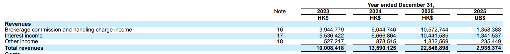
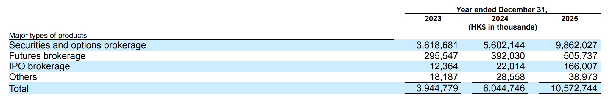
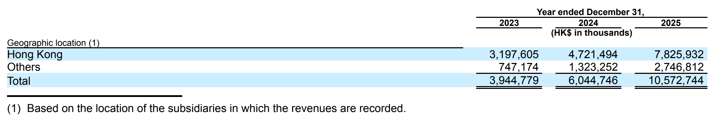
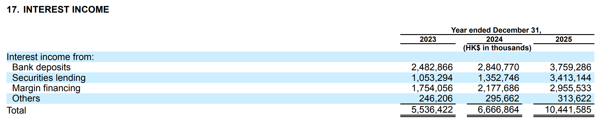
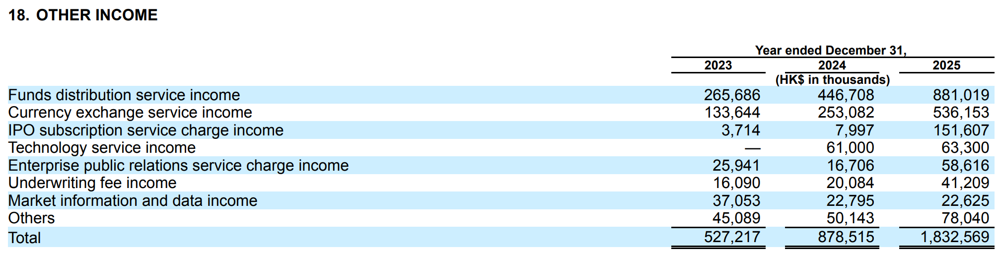

## Core Business Model of Brokerages

Securities companies (brokerages) play an indispensable "bridge" role in financial markets. If we compare the financial market to a huge trading marketplace, brokerages connect buyers and sellers while providing various supporting services as intermediaries.

At the most basic level, brokerages do three things:

**1. Connect Investors to Markets**

Individual investors cannot directly enter stock exchanges to buy and sell stocks; they must use trading channels provided by brokerages. Brokerages build a bridge between investors and exchanges, allowing ordinary people to participate in capital markets. It's like wanting to purchase from a wholesale market but needing to go through a qualified distributor to access the goods.

**2. Provide Capital and Tool Support**

Brokerages not only provide trading channels but can also lend money to investors for trading (margin financing and securities lending), and offer various financial products and investment tools. This is similar to how a supermarket not only sells goods but also provides shopping carts, membership cards, and installment payment options.

**3. Act as Information and Risk Managers**

Brokerages help companies issue stocks (IPO underwriting), provide research reports and investment advice to investors, and manage risks during trading. This is like how real estate agents not only match buyers and sellers but also provide property valuation, legal consultation, loan assistance, and other one-stop services.

### Main Business Types: Brokerage, Proprietary Trading, Investment Banking, Asset Management

Brokerage businesses can be divided into four major categories, each with different profit models:

| Business Type | Description | Core Revenue | Characteristics | Typical Representatives |
|--------------|-------------|--------------|-----------------|------------------------|
| **Brokerage Business** (Brokerage) | Provides trading channels for investors and collects commissions and handling fees. Like Amazon providing a platform for buyers and sellers, extracting a certain percentage from each transaction | • Trading commissions • Account management fees • Margin financing interest | • Low barrier, large scale • Low profit margin • Depends on trading activity | Futu, Tiger and other internet brokerages focus on this business |
| **Proprietary Trading** (Proprietary Trading) | Brokerages use their own funds for investment trading to earn investment returns. Like a supermarket not only selling others' goods but also stockpiling and trading stocks themselves | • Stock investment returns • Bond investment returns • Derivatives trading returns | • High risk, high return • Requires strong research capability • Can profit greatly in good years, may lose heavily in bear markets | Traditional large brokerages like CITIC Securities have proprietary business accounting for 20-30% |
| **Investment Banking** (Investment Banking) | Helps companies raise capital, including IPO listings, bond issuance, M&A restructuring, etc. This is high-end business with high profits but high barriers | • IPO underwriting fees • Bond underwriting fees • Financial advisory fees • M&A restructuring fees | • Project-based revenue • High profit margin • Requires licenses and resources • Client relationship driven | CICC, Goldman Sachs and other investment banking business can account for 30-50% |
| **Asset Management** (Asset Management) | Manages assets for clients, including issuing fund products and providing portfolio management services | • Management fees (1-2% of AUM) • Performance fees • Investment advisory fees | • Stable and sustainable revenue • Obvious scale effect • Key direction for brokerage transformation | Charles Schwab, Interactive Brokers and others see increasing asset management business proportion |

### Profit Model

Understanding brokerage profit models can be simplified with a formula:

**Total Brokerage Revenue = Transaction-Driven Revenue + Asset-Driven Revenue + Service-Driven Revenue**

**Transaction-Driven Revenue**: Mainly from brokerage business
- Depends on market trading activity
- Makes money in bull markets, struggles in bear markets
- High volatility

**Asset-Driven Revenue**: Mainly from interest and management fees
- Depends on client asset scale
- Relatively stable revenue
- Strong sustainability

**Service-Driven Revenue**: Mainly from investment banking and consulting
- Depends on professional capabilities and client relationships
- High profit margin but high barriers
- Large project fluctuations

### Traditional Brokerages vs. Internet Brokerages

Traditional brokerages are like "all-rounders," conducting all four businesses with diversified revenue sources. For brokerages like CITIC Securities and GF Securities, investment banking business may account for 30-40% of revenue, and proprietary trading 20-30%.

Internet brokerages are more like "specialists," mainly focusing on brokerage business (helping clients trade), winning through technology and low costs. For brokerages like Futu and Tiger, brokerage-related revenue (commissions + interest) typically accounts for over 80% of total revenue.

**Why such differences?**

1. **License restrictions**: Investment banking business requires underwriting qualifications, not every brokerage has them
2. **Capital requirements**: Proprietary trading requires large amounts of proprietary capital, emerging brokerages have relatively weak capital strength
3. **Strategic positioning**: Internet brokerages choose to use technology to reduce service costs and attract long-tail customers
4. **Risk preference**: Brokerage business is "earning pipeline fees," with relatively controllable risk

Brokerages are essentially financial service industries, with business models that:
- Use licenses to gain market access
- Use technology and services to attract customers
- Use economies of scale to reduce costs
- Generate revenue from customer transactions and assets through multiple methods

Understanding this basic logic helps us better analyze brokerage revenue composition and understand why different brokerages have vastly different profitability.

## Detailed Breakdown of Major Revenue Sources

After understanding the basic business model of brokerages, let's dive deep into the specific revenue sources of internet brokerages (like Futu). Unlike traditional brokerages, internet brokerages have a relatively simple revenue structure, mainly concentrated in several major sectors related to brokerage business.

### Commission and Handling Charge Income (Core Revenue)

This is the most traditional and direct revenue source for brokerages, and most people's first impression of how brokerages make money.

#### Securities Trading Commissions

**Basic Principle**

Whenever you buy or sell stocks through a brokerage, the brokerage charges a certain percentage as commission. Assuming a commission rate of 0.03%, if you buy HK$100,000 worth of stocks, the brokerage charges HK$30 commission; when selling, another HK$30 is charged, totaling HK$60 for a round trip.

For individual users, a few dozen dollars isn't much. But for brokerages, this is a "high-volume, low-margin" business:
- Futu had over 1 million+ paying customers in Q3 2023
- Average daily trading volume exceeded HK$10 billion
- Even with a commission rate of only 0.03%, daily revenue can reach millions of HKD

**Evolution of Commission Rates**

Over the past twenty years, commission rates have experienced a cliff-like drop:

| Period | Typical Commission Rate | Representative Events |
|--------|------------------------|---------------------|
| Before 2000 | 0.3% - 0.5% | Fixed commission era |
| 2000-2010 | 0.1% - 0.3% | Commission liberalization reform |
| 2010-2019 | 0.03% - 0.08% | Rise of internet brokerages |
| 2019-present | 0% - 0.03% | "Zero commission" era arrives |

In October 2019, US brokerage Robinhood pioneered zero-commission trading, and established brokerages like TD Ameritrade and Charles Schwab were forced to follow. This price war also spread to Asian markets.

**The Truth About "Zero Commission"**

When you see "commission-free trading" advertisements, are brokerages really not making money? The answer is: there's no such thing as a free lunch.

Brokerages compensate through other means:
- **Payment for Order Flow (PFOF)**: Selling your orders to market makers
- **Interest income**: Earning interest on idle funds in your account
- **Exchange rate spread**: Currency exchange fees for cross-border trading
- **Value-added services**: Level 2 market data, investment advisory services, and other paid features

So "zero commission" is more of a marketing strategy; brokerages have simply moved revenue sources from the surface to behind the scenes.

#### Other Transaction-Related Fees

Besides basic trading commissions, brokerages also charge fees at other stages:

**IPO Subscription Fees**
- When subscribing to new stock listings, fees are typically required
- Typical rate: 0.5% - 1% of subscription amount
- Hong Kong IPO market is active, making this revenue considerable

**Hong Kong Grey Market Trading Fees**
- Grey market is a pre-trading mechanism unique to Hong Kong stocks
- Trading before official listing
- Fees are usually higher than normal trading

**Corporate Action Fees**
- Company dividends, rights issues, placements, etc.
- Some brokerages charge small service fees for these operations

#### Influencing Factors

The amount of commission revenue depends on three key factors:

**1. Trading Activity**

This is the most important factor. Brokerages love "active traders":
- **Day Traders**: Trade dozens of times a day, contributing substantial commissions
- **Short-term traders**: Frequently switch stocks, high trading volume
- **Long-term investors**: Buy and hold, few trades, low commission contribution

**2. Market Conditions**

Bull and bear markets have vastly different impacts on commission revenue:

- **Bull market**: Trading enthusiasm soars, trading volume explodes, commission revenue can double
- **Bear market**: Investors wait and see, trading volume shrinks, commission revenue drops significantly
- **Volatile market**: Volatility creates trading opportunities, may be more active than one-sided bull markets

Commission revenue is the brokerage's "foundation," but also faces the greatest competitive pressure. The continued decline in commission rates is inevitable, and brokerages must:
- Expand user base (more people)
- Increase user activity (higher frequency trading)
- Develop other revenue sources (reduce dependence on commissions)

### Margin Financing Interest Income

If commission revenue is "pay-per-transaction," then margin financing interest income is a "pay-per-day" rental business. For many brokerages, the profit margin of this revenue stream is even higher than commissions.

#### Margin Financing Business Principles

**What is Margin Financing and Securities Lending?**

Simply put, it's when brokerages lend money or stocks for your trading:
- **Margin Financing (Margin)**: Borrow money to buy stocks, amplifying gains (and risks)
- **Securities Lending (Short Selling)**: Borrow stocks to sell, profit from short positions

**An Example of Margin Trading**

Suppose you have HK$100,000 principal and are bullish on a stock:

| Item | Regular Trading | Margin Trading (2x Leverage) |
|------|----------------|----------------------------|
| Own capital | HK$100,000 | HK$100,000 |
| Margin loan | 0 | HK$100,000 |
| Total investment | HK$100,000 | HK$200,000 |
| Stock rises 10% | Earn HK$10,000 (10% return) | Earn HK$20,000 (20% return) |
| Stock falls 10% | Lose HK$10,000 (-10% loss) | Lose HK$20,000 (-20% loss) |

Sounds tempting, right? But note two things:
1. **Leverage amplifies risk**: Losses also double
2. **Interest must be paid**: Borrowing from the brokerage isn't free

#### How Do Brokerages Make Money? Interest Income

Assuming:
- You borrow HK$100,000 on margin
- Annual margin interest rate is 6%
- Hold for 30 days

Interest = 100,000 × 6% × (30/365) = HK$493

For individual users, a few hundred dollars in interest isn't much. But brokerages' advantage lies in:
- Many users using margin simultaneously
- Long duration (some users use leverage long-term)
- Large interest rate spread (borrowing cost 2%, lending rate 6%, earning 4% spread)

#### Influencing Factors

**1. Market Sentiment**

Margin demand is highly correlated with market sentiment:

- **Bull market**: Confidence surges, many investors leverage up, margin balance explodes
- **Bear market**: Risk aversion, deleveraging, margin balance shrinks
- **Surge phase**: Margin balance can double in a few months

**2. Margin Interest Rate Level**

Interest rates are a double-edged sword:
- **High rates**: High unit margin revenue, but reduced user demand
- **Low rates**: Attract more users, but lower unit profit

Margin interest rates vary greatly across different markets:
- US stocks: 3% - 8% annualized (tiered by margin size)
- Hong Kong stocks: 5% - 8% annualized
- A-shares: 6% - 9% annualized

Internet brokerages typically offer better rates to large customers, forming "tiered pricing":

| Margin Amount | Annual Rate |
|--------------|-------------|
| 0 - 100K | 6.8% |
| 100K - 500K | 5.8% |
| 500K+ | 4.8% |

**3. Regulatory Policy**

Margin financing is high-risk business with strict regulation:

- **Leverage ratio limits**: A-shares maximum 2x, Hong Kong stocks can reach 10x (varies by stock)
- **Eligible securities restrictions**: Not all stocks can be financed, usually only liquid large-cap stocks
- **Forced liquidation mechanism**: When losses reach a certain level (e.g., margin below 130%), brokerages will force sell

#### Risk Control

Margin business looks profitable but also harbors risks:

**Liquidation Risk in Extreme Markets**

If stock prices plummet instantly (like a flash crash), liquidation may be too late, and brokerages may incur bad debts:
- Client has HK$100K principal, borrows HK$100K margin, total HK$200K in stocks
- Stock drops 60% in one day, stock market value only HK$80K left
- Brokerage's HK$100K principal loan loses HK$20K

So brokerages will:
- Set strict margin ratios (e.g., 140%)
- Raise margin requirements for highly volatile stocks
- Monitor market risks in real-time

### Interest Income

This is an easily overlooked but very stable revenue source. You might not realize that idle funds in your brokerage account are also making money for the brokerage.

#### Interest Income from Client Idle Funds

**How Does Money Flow?**

When you deposit funds into your brokerage account but haven't bought stocks yet, this money isn't just "sitting" there:

1. **Your perspective**: Account shows HK$100,000 cash, available for trading anytime
2. **Brokerage's operation**: Deposit this HK$100K in partner banks or purchase money market funds
3. **Revenue distribution**:
   - Banks/money market funds give brokerages 2.5% annualized interest
   - Brokerages give you 0.5% annualized interest (or nothing)
   - Brokerages earn a 2% spread

#### Characteristics of Interest Income

**Advantages:**
- ✅ **High stability**: Not affected by market volatility, as long as users are there, money is there
- ✅ **Low marginal cost**: No additional operations needed, system operates automatically
- ✅ **Strong scale effect**: More users, more idle funds

**Disadvantages:**
- ⚠️ **Highly correlated with interest rate environment**: When central banks cut rates, interest income decreases
- ⚠️ **Competitive pressure**: Some brokerages introduce "cash management" features, sharing some interest with users

#### Relationship with Market Interest Rate Environment

Interest income is closely related to macroeconomic interest rate policies:

| Period | Interest Rate Environment | Brokerage Interest Income |
|--------|-------------------------|--------------------------|
| 2020-2021 | Fed zero interest rate | Extremely low (near 0) |
| 2022-2023 | Fed rapid rate hikes to 5.25% | Significant growth |
| 2024-2025 | Expected rate cut cycle | Gradual decline |

[Interactive Brokers disclosed in its 2023 annual report](https://www.sec.gov/cgi-bin/browse-edgar?action=getcompany&CIK=0001466891&type=10-K&dateb=&owner=exclude&count=40):
- Client cash account interest income accounted for over 40% of total revenue
- Fed rate hike cycle increased this revenue by over 200% year-over-year

This shows how significant the impact of interest rate environment is on brokerage profitability.

#### Brokerage Response Strategies

To retain client funds, some brokerages have introduced revenue-sharing policies:

**Traditional approach**: Brokerages take entire spread, users get 0
**New trend**: Brokerages share some interest with users

For example:
- **Interactive Brokers**: Clients' idle USD funds can earn 4.83% annualized return (2023 data)
- **Futu "Cash Treasure"**: Automatically subscribe to money market funds, users receive partial returns

This is a "sacrifice margin for scale" strategy:
- Although unit spread decreases (from 2% to 0.5%)
- But users are more willing to keep larger amounts of funds
- Total revenue may actually increase

### Currency Exchange Income

For cross-border brokerages (like Futu and Tiger), this is a unique and highly profitable revenue source. When you switch trading between different markets, currency exchange becomes a necessary step.

**Why is Currency Exchange Needed?**

Suppose you're a Chinese investor using a Futu account:
- Deposit in **Chinese Yuan (CNY)**
- Need **US Dollars (USD)** to buy US stocks
- Need **Hong Kong Dollars (HKD)** to buy Hong Kong stocks
- Need **Singapore Dollars (SGD)** to buy Singapore stocks

Each market switch involves currency exchange, and brokerages earn spreads in this process.

**Main Currency Pairs**

Main currency exchanges involved in cross-border brokerages:

| Currency Pair | Typical Scenario | Trading Frequency |
|--------------|------------------|-------------------|
| CNY/USD | Chinese investors buying US stocks | Very High |
| CNY/HKD | Chinese investors buying HK stocks | Very High |
| USD/HKD | US-HK stock market switching | High |
| CNY/SGD | Buying Singapore market | Medium |
| USD/SGD | Cross-market fund allocation | Medium |

#### Profit Mechanism: Bid-Ask Spread

**What is Bid-Ask Spread?**

When you want to exchange currency, you'll see two prices:
- **Bid Price**: Price at which brokerages will buy foreign currency (you sell to brokerages)
- **Ask Price**: Price at which brokerages will sell foreign currency (you buy from brokerages)

**A Specific Example**

Assuming current USD to CNY exchange rate:
- Market mid-price: 7.2000
- Brokerage bid price: 7.1800 (when you sell USD to brokerages)
- Brokerage ask price: 7.2200 (when you buy USD from brokerages)
- **Spread**: 0.04 yuan, approximately 0.55%

If you exchange CNY 100,000 for USD:
- At market price should get: 100,000 ÷ 7.2000 = 13,888 USD
- Actually get: 100,000 ÷ 7.2200 = 13,850 USD
- Difference: 38 USD ≈ CNY 274

This CNY 274 is the brokerage's exchange income.

**Comparison with Third-Party Payment**

Exchange rate spreads across different channels:

| Channel | Typical Spread | Pros and Cons |
|---------|---------------|---------------|
| Bank wire transfer | 0.3% - 0.5% | High fees, slow arrival |
| Third-party payment (Alipay, WeChat) | 0.5% - 1% | Convenient but large spread |
| Professional exchange platforms (Wise) | 0.1% - 0.3% | Small spread but doesn't support securities accounts |
| Brokerage internal exchange | 0.2% - 0.8% | Instant arrival, but spread not transparent |

Brokerages' advantages:
- ✅ **Instant exchange**: Arrives in seconds, doesn't affect trading
- ✅ **No additional fees**: Spread already included in exchange rate
- ✅ **Simple process**: One-click operation within APP

#### Impact of Exchange Rate Fluctuations on Revenue

Exchange income comes not only from spreads but is also affected by market volatility:

**Stable Exchange Rate Period**
- Stable spread, predictable revenue
- Mainly earn through trading volume

**Volatile Exchange Rate Period**
- Brokerages widen spreads to hedge risks
- Spreads may expand from 0.3% to over 1%
- Per-transaction revenue increases

**Real Case: Strong USD Appreciation in 2022**
- CNY depreciated from 6.3 to 7.3
- Large amounts of capital flowed into US stock market
- Exchange trading volume surged, brokerage exchange income grew 50%+ year-over-year

#### Revenue Scale Estimation

Using Futu as an example (rough estimate):
- Assuming 1 million paying customers
- Average 2 exchanges per person per year
- Average CNY 50,000 per exchange
- Average spread 0.4%

Annualized exchange income = 1 million × 2 × 50,000 × 0.4% = **CNY 400 million**

This is a very considerable and stable revenue stream with almost zero marginal cost.

**Summary**

Currency exchange income is a "hidden gold mine" for cross-border brokerages:
- ✅ High profit margin (pure spread income)
- ✅ Low marginal cost (system automation)
- ✅ Strong user stickiness (must go through brokerage for exchange)
- ⚠️ But easily overlooked by users (not transparent)

---

### PFOF (Payment for Order Flow) Income

This is a highly controversial business model in the United States that barely exists in other markets. Understanding PFOF is key to understanding how "zero commission" brokerages make money.

#### PFOF Business Model Analysis

**What is Payment for Order Flow?**

Simply put, brokerages "sell" customer trading orders to market makers:

1. **You place an order**: Buy 100 shares of Apple in the brokerage APP
2. **Brokerage doesn't send directly to exchange**: Instead sells to market maker (like Citadel Securities)
3. **Market maker pays**: Gives brokerage $0.002 per share, total $0.2
4. **Market maker executes order**: Completes trade in the market, earning bid-ask spread

**Why Do Market Makers Want to Pay?**

Market makers profit through bid-ask spreads:
- Bid price: $150.00
- Ask price: $150.02
- Spread: $0.02/share

For a 100-share order, market makers can earn $2, pay $0.2 to brokerage, net profit $1.8.

**Interest Chain: Brokerage, Market Maker, Investor**

| Role | Benefits | Costs |
|------|----------|-------|
| **Investor** | Zero commission trading | May get slightly worse execution price |
| **Brokerage** | PFOF income from market makers | Forgo commission revenue |
| **Market Maker** | Bid-ask spread profit | Pay PFOF fees |

**PFOF Rate Standards**

Typical PFOF payment standards (US stock market):

| Order Type | Per Share Payment | Minimum Per Order |
|-----------|------------------|-------------------|
| Stock market order | $0.002 | $0.10 |
| Stock limit order | $0.003 | $0.10 |
| Options contract | $0.50-0.70/contract | - |

Options PFOF fees are far higher than stocks, making them a key revenue source for brokerages.

#### Regulatory Differences Across Markets

**US Market: Legal but Controversial**

- ✅ **Legality**: SEC allows PFOF but requires disclosure
- ⚠️ **Controversy**: Whether it harms investor interests (price priority principle)
- 📋 **Regulatory requirements**:
  - Must disclose PFOF income in Rule 606 reports
  - Need to ensure "Price Improvement"
  - SEC Chairman Gary Gensler has repeatedly questioned PFOF model

**Hong Kong Market: Basically Non-existent**

- ❌ Hong Kong SFC has strict requirements for order routing
- Brokerages must ensure Best Execution
- PFOF viewed as potential conflict of interest

**China A-Share Market: Explicitly Prohibited**

- ❌ CSRC explicitly prohibits brokerages from profiting from order flow
- All orders must be sent to exchanges for centralized bidding
- Violations may result in license revocation

---

### Securities Lending Income

This is a relatively niche but extremely high-margin business, mainly serving short sellers and institutional investors.

#### Securities Lending Business Principles

**What is Securities Lending?**

When investors want to short sell a stock, they need to borrow the stock first:

1. **Short seller borrows stock from brokerage**: For example, borrows 1,000 shares of Tesla
2. **Where does brokerage get the stock?**: Borrows from other clients' accounts (clients usually unaware)
3. **Short seller pays borrowing fee**: Calculated daily, annual rate may be 1%-50%
4. **Brokerage takes cut**: Brokerage receives most of borrowing fee, small portion to stock holder

**A Specific Example**

Assuming Tesla stock price $300, borrowing annual rate 10%:
- Short seller borrows 1,000 shares, market value $300,000
- Annualized borrowing fee: $300,000 × 10% = $30,000
- Daily calculation: $30,000 ÷ 365 = $82/day
- If borrowed for 30 days: $2,460

**Brokerage Revenue Split**:
- Brokerage takes: 70-90% ($1,722-2,214)
- Stock holder: 10-30% ($246-738)

#### Source Providers

**Whose Stocks Are Being Lent?**

Usually long-term investors' stocks:
- Institutional investors holding large positions
- Individual investors with buy-and-hold strategies
- These stocks "sit idle" in accounts, perfect for lending

**Do Users Know?**

- User agreements typically have clauses authorizing brokerages to lend stocks
- Most users don't read carefully and don't know their stocks are being lent
- Some brokerages (like Interactive Brokers) proactively share revenue, encouraging user participation

#### Borrowing Rates for Popular Stocks

Borrowing rates vary greatly across stocks:

| Stock Type | Typical Annual Rate | Examples |
|-----------|-------------------|----------|
| Large-cap blue chips | 0.5% - 2% | Apple, Microsoft, Tencent |
| Regular stocks | 2% - 5% | Most normal companies |
| Popular short targets | 10% - 30% | Companies with questioned financials |
| Extremely scarce supply | 50% - 100%+ | Stocks with retail squeeze, very limited supply |

**Real Case: GameStop (GME) 2021**
- Retail investors squeezed institutional shorts
- Stock supply extremely scarce
- Borrowing rate once exceeded **80% annualized**
- GME stock holders profited from lending even without selling

#### Revenue Scale

For brokerages, securities lending revenue represents a small proportion but extremely high profit margin:

**Futu's Securities Lending Business** (estimated):
- Lendable stock market value approximately HK$5-10 billion
- Average borrowing rate 5%
- Annualized borrowing fees: HK$250-500 million
- Brokerage takes 80%: HK$200-400 million
- Accounts for about **5%** of total revenue

Although proportion isn't high, this is "passive income" with almost zero cost.

**Summary**

Securities lending is "invisible" but highly profitable revenue:
- ✅ Extremely high profit margin (80% to brokerage)
- ✅ Near-zero marginal cost
- ✅ Greater market volatility and short selling demand means more revenue
- ⚠️ But scale limited by stock supply and market short demand

---

### Other Value-Added Service Income

Besides the above main revenue sources, brokerages also provide various value-added services to "monetize users." These services have small individual revenues but add up, also constituting certain revenue supplements.

#### Enterprise Services

**IPO Underwriting and Sponsorship**

Core business of traditional large brokerages, but internet brokerages have limited participation:
- Futu and Tiger mainly do **IPO distribution** (selling new share quotas to retail customers)
- Charge subscription fees: 0.5% - 1%
- When Hong Kong IPO market is active, this revenue is considerable

**ESOP (Employee Stock Ownership Plan) Management**

Provide equity incentive management services for startups:
- Help companies manage employee options
- Provide exercise, transfer and other services
- Charge management fees and trading commissions
- Futu's "Enterprise Services" segment focuses on this

**Wealth Management Services**

- Provide asset allocation advice for high-net-worth clients
- Charge consulting fees or asset management fees
- Typical rate: 1-2% AUM (charge by asset scale)

#### Data and Technology Services

**Level 2 Market Data Subscription**

Level 1 is free basic quotes, Level 2 is paid in-depth market data:

| Quote Level | Content | Fees |
|------------|---------|------|
| Level 1 | Latest price, volume, top bid/ask | Free |
| Level 2 | 10-level bid/ask, tick-by-tick trades, large order tracking | US stocks $1-2/month HK stocks $10-30/month |

For active traders, Level 2 is essential, providing stable subscription revenue.

**API Interface Services**

- Provide API interfaces for quantitative traders
- Support programmatic trading
- Pricing model: by API calls or monthly subscription
- Typical price: $50-200/month

**Trading Tools and Strategy Subscriptions**

- Technical analysis tools
- Smart stock screeners
- Options strategy analyzers
- Monthly subscription: $10-50/month

#### Membership Subscription Services

**Premium Membership Benefits**

Some brokerages introduce membership systems:
- **Basic membership**: Free, basic features
- **Premium membership**: $10-30/month, enjoy lower commissions, free Level 2 quotes, etc.
- **VIP membership**: $100+/month, dedicated customer service, research reports, priority activities

**Research and Information Services**

- Institutional-grade research reports
- Real-time news push
- Hot topic analysis and investment strategies
- Subscription: $20-100/month

**Community and Educational Content**

- Investment courses (like options trading tutorials)
- Offline event tickets
- Expert livestream rooms
- Paid communities

---

## Case Study: Futu Holdings Revenue Structure Analysis

Theory complete, let's look at a real case. Using Futu Holdings (FUTU) 2025 annual report as example, see what an internet brokerage's revenue composition looks like in the real world.

### Total Revenue Overview (2025 Full Year)

First look at the big picture, Futu's 2025 revenue structure:

| Revenue Type | Amount (HK$ billion) | Proportion | YoY Growth |
|-------------|---------------------|-----------|-----------|
| **Commission and handling charges** | 10.57 | 46.3% | +74.9% |
| **Interest income** | 10.44 | 45.7% | +56.6% |
| **Other income** | 1.83 | 8.0% | +108.6% |
| **Total revenue** | **22.85** | **100%** | **+68.1%** |

**Key Findings:**

1. **Balanced revenue structure**: Commissions and interest each account for about 45%, forming "dual engines"
2. **Explosive growth**: Total revenue grew 68% year-over-year, nearly doubled
3. **Fastest growing other income**: Grew 109%, showing diversification effectiveness

**Historical Comparison: Revenue Structure Evolution**

| Year | Commission % | Interest % | Other % |
|------|-------------|-----------|---------|
| 2023 | 39.4% | 55.3% | 5.3% |
| 2024 | 44.5% | 49.1% | 6.5% |
| 2025 | 46.3% | 45.7% | 8.0% |

**Trend Analysis:**
- Commission proportion rising yearly (39% → 46%): Shows increasing trading activity
- Interest proportion declining (55% → 46%): Not because interest income decreased, but commissions grew faster
- Other income proportion continuously rising: Diversification strategy working

### Commission and Handling Charge Income: HK$10.57 Billion

This is Futu's "foundation," let's dive deep.

#### Revenue Composition

| Type | Amount (HK$ billion) | % of Commission Revenue |
|------|---------------------|----------------------|
| **Securities and options brokerage** | 9.86 | 93.3% |
| **Futures brokerage** | 0.51 | 4.8% |
| **IPO brokerage** | 0.17 | 1.6% |
| **Others** | 0.04 | 0.4% |
| **Total** | **10.57** | **100%** |

**Verifying Earlier Theory:**

Remember Chapter 2? Securities trading commissions are core revenue, validated here:
- **Securities and options account for 93%**: Stock, ETF, options trading are absolute mainstays
- **Futures proportion not high**: Futures trading has high barriers, fewer participating users
- **IPO brokerage rising**: Only HK$0.02 billion in 2024, surged to HK$0.17 billion in 2025 (7.5x growth!)

**What Does IPO Brokerage Surge Mean?**

Hong Kong IPO market recovered in 2025:
- Multiple star companies listed (like Kuaishou's Hong Kong secondary listing)
- Futu as main distribution channel, IPO subscription fees greatly increased
- This validates our statement "when Hong Kong IPO market is active, this revenue is considerable"

#### Geographic Distribution

| Region | Amount (HK$ billion) | Proportion |
|--------|---------------------|-----------|
| **Hong Kong** | 7.83 | 74.0% |
| **Others** | 2.75 | 26.0% |

**Interpretation:**
- Hong Kong remains main battlefield (Hong Kong stocks + US stock channel)
- "Others" includes Singapore, US and other new markets
- 26% other market proportion shows internationalization effectiveness

### Interest Income

Interest income for the first time rivals commission income, let's see how this HK$10.4 billion comes.

#### Revenue Composition

| Source | Amount (HK$ billion) | Proportion | YoY Growth |
|--------|---------------------|-----------|-----------|
| **Bank deposit interest** | 3.76 | 36.0% | +32.3% |
| **Securities lending** | 3.41 | 32.7% | +152.3% |
| **Margin financing** | 2.96 | 28.3% | +35.7% |
| **Others** | 0.31 | 3.0% | +6.1% |
| **Total** | **10.44** | **100%** | **+56.6%** |

**Three Pillars, Each with Characteristics:**

**1. Bank Deposit Interest (HK$3.76 billion)**
- Source: Client idle funds deposited in banks or money market funds
- 32% growth, benefiting from Fed high interest rate environment

**2. Securities Lending (HK$3.41 billion) — Growth Star!**
- Source: Lending clients' stocks to short sellers
- Shows active short selling in 2025 market, strong borrowing demand

**3. Margin Financing (HK$2.96 billion)**
- Source: Clients use leverage trading, pay interest
- 36% growth, shows investors' willingness to leverage up increased

#### Why Did Securities Lending Surge?

**2025 Market Environment Analysis:**

1. **Increased Hong Kong stock volatility**: Some companies targeted by short sellers, borrowing demand surged
2. **Active US stock shorting**: Tech stock high valuations triggered shorting wave
3. **Futu's rich stock supply**: Large number of long-term investors holding stocks, available for lending
4. **High borrowing fees**: Popular short targets can have 20-50% annual borrowing rates

**Profitability Analysis:**

| Item | Amount (HK$ billion) |
|------|---------------------|
| Securities lending income | 3.41 |
| Securities lending costs | 1.46 |
| **Net income** | **1.95** |
| **Net margin** | **57.2%** |

Securities lending costs are fees Futu pays to borrow securities from other institutions. Net margin 57%, far higher than commission business's 5% cost rate, very high-quality revenue.

#### Steady Growth of Margin Financing

**Margin Financing Business Data:**

| Item | Amount (HK$ billion) |
|------|---------------------|
| Margin interest income | 2.96 |
| Margin interest expenses | 0.28 |
| **Net income** | **2.68** |
| **Net margin** | **90.6%** |

**Interpretation:**
- Futu obtains funds from banks at low cost (annualized about 2-3%)
- Lends to clients at higher rates (annualized about 6-8%)
- Interest spread about 4-5%, profit margin as high as 90%

Margin business interest expenses only account for 9.4% of revenue, showing Futu's capital cost control is excellent.

#### Stability of Interest Income

Comparing 2023-2025 data:

| Year | Interest Income (HK$ billion) | YoY Growth |
|------|------------------------------|-----------|
| 2023 | 5.54 | - |
| 2024 | 6.67 | +20.4% |
| 2025 | 10.44 | +56.6% |

Interest income continues growing, and accelerated in 2025, mainly due to:
1. **Expanding client asset scale**: More idle funds
2. **High interest rate environment**: Fed maintained high rates until mid-2024
3. **Securities lending explosion**: Strong market short selling demand

### Other Income

Although only 8%, this revenue grew fastest (+109%), and is diverse, worth detailed examination.

| Type | Amount (HK$ billion) | Proportion | YoY Growth |
|------|---------------------|-----------|-----------|
| **Fund distribution services** | 0.88 | 48.1% | +97.2% |
| **Currency exchange** | 0.54 | 29.3% | +111.9% |
| **IPO subscription fees** | 0.15 | 8.3% | +1,794.8% |
| **Technology services** | 0.06 | 3.4% | +3.8% |
| **Enterprise PR services** | 0.06 | 3.2% | +250.8% |
| **Underwriting fees** | 0.04 | 2.2% | +105.2% |
| **Market data** | 0.02 | 1.2% | -0.7% |
| **Others** | 0.08 | 4.3% | +55.7% |
| **Total** | **1.83** | **100%** | **+108.6%** |

**Verifying Earlier Theory:**

**1. Fund Distribution Services (HK$0.88 billion)**
- Futu helps fund companies sell funds, charges distribution commissions (typically 0.5-1%)
- 97% growth, shows investors shifting from stock trading to fund buying

**2. Currency Exchange (HK$0.54 billion) — Doubled Growth!**
- Corresponds to Section 2.4 "Currency Exchange Income"
- Validates our statement: Cross-border brokerages' "hidden gold mine"
- HK$0.25 billion in 2024 → HK$0.54 billion in 2025, 112% growth
- Shows very active cross-border trading (HK stocks ↔ US stocks)

**3. IPO Subscription Fees (HK$0.15 billion) — Surged 18x!**
- Only HK$8 million in 2024 → HK$0.15 billion in 2025
- Echoes IPO brokerage income (HK$0.17 billion), both dividends from IPO market recovery
- Validates "when Hong Kong IPO market is active, this revenue is considerable"

**4. Technology Services (HK$0.06 billion)**
- Provide trading systems, API interfaces for B2B clients
- Flat growth, not a main growth driver

---

Brokerage revenue composition appears to be just numbers and percentages on the surface, but behind it is business model evolution, market environment changes, regulatory policy dynamics, and ultimately the practical impact on every investor.

Hope this analysis helps you better understand this industry.
