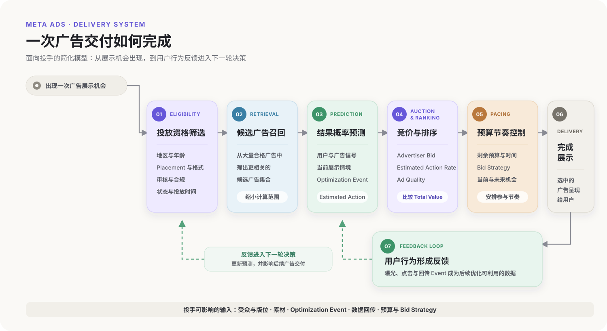
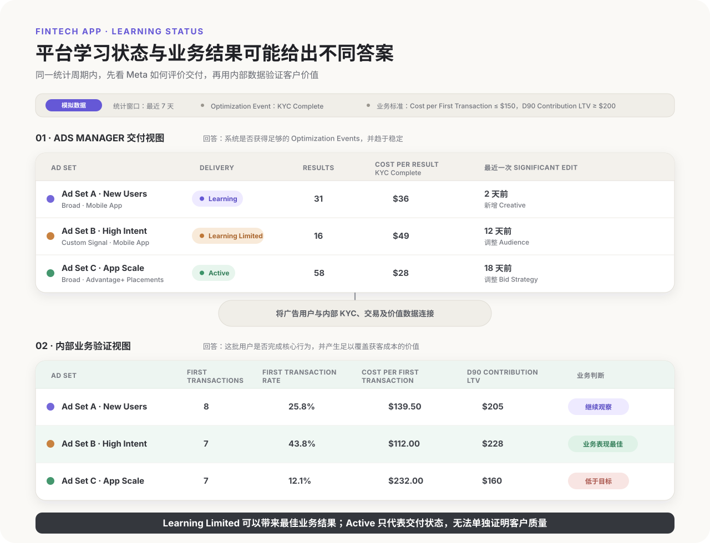
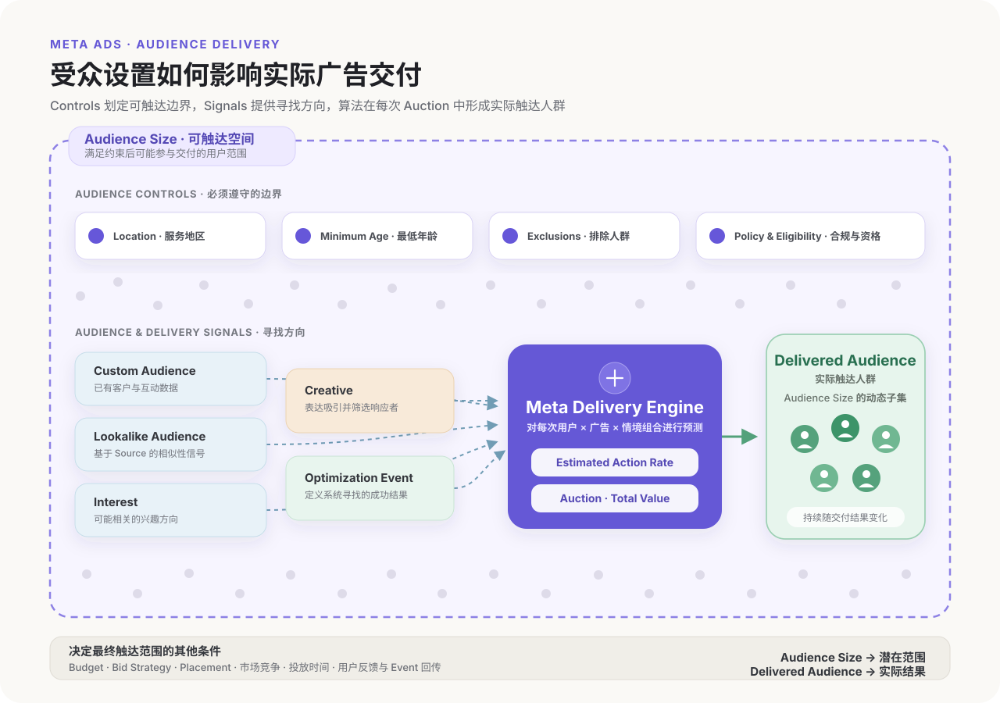
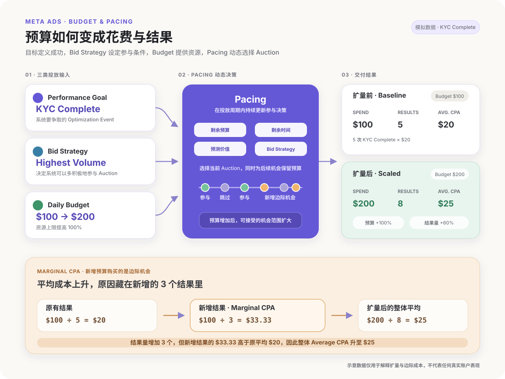

打开 Ads Manager 后，广告主可以选择 Campaign Objective、设置预算和受众、上传素材，再指定希望 Meta 优化的结果。后台把投放呈现为一组可以操作的设置，但广告上线之后，系统如何决定广告获得哪些曝光机会、把广告展示给谁，以及用多少预算争取这些展示呢？

广告主购买的并非一批提前固定的人群或版位。每当 Facebook、Instagram 或 Meta 的其他广告版位出现展示机会时，系统都会从当时符合条件的广告中筛选候选项，预测不同广告展示给当前用户后可能产生的结果，再通过竞价与排序决定最终交付。预算、出价、受众、素材和 Optimization Event，都会影响这个实时决策过程。

[Meta 对 Andromeda 的介绍](https://engineering.fb.com/2024/12/02/production-engineering/meta-andromeda-advantage-automation-next-gen-personalized-ads-retrieval-engine/)显示，其广告推荐系统采用多阶段结构：先从数量庞大的广告中召回相关候选项，再使用更复杂的模型预测这些广告可能为用户和广告主带来的价值，最后完成排序和展示。理解这条决策链，有助于投手判断每一项设置究竟在改变什么。

## 从广告请求到最终展示：一次广告交付经历了什么

当用户刷新 Feed、浏览 Stories 或观看 Reels，页面中可能出现一个可供广告展示的位置。对广告系统来说，这会形成一次广告请求。整个交付过程可以简化为：

```text
出现广告展示机会
→ 筛选符合条件的广告
→ 召回相关候选广告
→ 预测用户采取目标行为的可能性
→ 计算广告的 Total Value 并完成排序
→ 结合预算与投放节奏完成交付
→ 用户行为形成新的反馈数据
```



1. **Eligibility 划定参与边界。** 系统先检查地区、年龄、Placement、审核状态、投放时间、预算、Billing 和合规要求。不符合条件的广告不会进入当前展示机会。
2. **Candidate Retrieval 缩小候选集合。** 潜在合格广告数量非常庞大，系统需要先召回一批更相关的候选项，再交给更复杂的 Ranking Model。Meta 在 Andromeda 的公开资料中将这一过程描述为从数以千万计的广告中召回数千个候选项。
3. **Prediction 估计目标行为。** 系统预测“当前广告展示给当前用户后，发生 Optimization Event 的可能性”。围绕 App Install、KYC Complete 或 Purchase 优化时，预测目标和最终交付人群都会不同。
4. **Auction 比较 Total Value。** 候选广告会基于 Advertiser Bid、Estimated Action Rate 和 Ad Quality 进行价值比较。出价只是其中一个因素。
5. **Pacing 安排参与节奏。** 系统结合预算、剩余时间、Bid Strategy 和当前机会，决定何时参加 Auction、何时为后续机会保留预算。
6. **Feedback 更新后续判断。** 用户可能忽略、点击、安装或完成更深层 Event。Meta 可观察的平台行为，以及通过 [App SDK、MMP、Pixel 或 CAPI 建立的数据链路](/zh-cn/posts/meta-ads-data-tracking/)，会成为后续预测可以利用的反馈。

这条链路不会让 Meta 自动理解完整的商业价值。如果 Campaign 优化 Install，系统会学习哪些人更容易安装；如果业务真正重视 First Transaction，广告主还需要用产品漏斗和内部数据验证这些安装是否产生了价值。这个目标应当先在[业务模式、转化链路和单位经济模型](/zh-cn/posts/meta-ads-business-strategy/)中定义清楚。

## Total Value：为什么最高出价不一定赢得展示

Auction 负责比较候选广告在当前展示机会中的价值。Meta 公开的框架包含三个核心组成部分：Advertiser Bid、Estimated Action Rate 和 Ad Quality。

```text
Total Value = Advertiser Bid × Estimated Action Rate + Ad Quality
```

[Meta 对广告 Auction 与 Total Value 的说明](https://ai.meta.com/blog/advertising-fairness-variance-reduction-system-vrs/)指出，拥有最高 Total Value 的广告更有可能赢得展示。因此，提高 Bid 只能改变竞价的一部分；用户采取目标行为的可能性和广告体验也会影响结果。

### Advertiser Bid：为目标结果参与竞争的价值

Advertiser Bid 表示广告主愿意为目标行为投入的价值。使用自动出价时，投手无需为每次展示手动报价，系统会根据 Bid Strategy、预算和当前机会参与 Auction。

需要区分三个概念：Budget 规定投放周期内可以使用的资金范围，Bid Strategy 规定系统如何面对成本与规模的取舍，Advertiser Bid 则是一次 Auction 中进入 Total Value 计算的竞价组成部分。增加 Budget 可以扩大参与机会，却不会自动提高每次 Auction 的竞争力。

### Estimated Action Rate：当前用户完成目标行为的概率

Estimated Action Rate 可以理解为系统对“向这位用户展示这条广告后，他完成目标行为的可能性”的预测。它同时取决于用户、广告、展示情境和 Optimization Event，并非素材拥有的固定分数。

```text
Estimated Action Rate
= f（用户信号、广告信号、展示情境、Optimization Event、历史反馈）
```

这里的 `f` 仅表示多种输入共同形成预测，并非 Meta 公布的实际函数。投手也无法查看某个用户的具体预测分数。

Estimated Action Rate 不能直接等同于 CTR。围绕 Link Click 优化时，点击概率与目标较为接近；围绕 KYC Complete 或 Purchase 优化时，系统关注相应 Event 的发生概率。某条广告可以获得较高 CTR，同时带来较低的深层转化率。

### Ad Quality：把广告体验纳入排序

Ad Quality 让 Auction 同时考虑广告可能带来的用户体验。Meta 可能参考用户反馈，以及是否存在隐瞒信息、耸动表达、Engagement Bait 等低质量属性。

Ad Quality 与 Policy Review 的含义不同。通过审核说明广告具备投放资格，无法保证它在 Auction 中具有较高质量。画面精致程度也不能单独代表 Ad Quality：表达清楚、与用户需求匹配的简单 Creator-style Video，可能比制作成本更高但缺少相关性的素材更有竞争力。

对 Fintech 广告而言，收益暗示、风险表达、费用说明和产品资格同时影响合规与信任。依赖夸张承诺吸引点击，可能伴随负面反馈、低质量流量和后续转化下降。

### Total Value 会随每次展示机会变化

用户、Placement、时间、竞争者和 Optimization Event 发生变化时，Estimated Action Rate 与相对排序也可能变化。下面的模拟数据用于说明三项因素如何共同影响结果：

| 候选广告 | Bid 指数 | Estimated Action Rate 指数 | Ad Quality 指数 | 示意 Total Value | 排序结果 |
| --- | ---: | ---: | ---: | ---: | --- |
| 广告 A | 7 | 8 | 6 | 62 | 第 1 |
| 广告 B | 9 | 5 | 7 | 52 | 第 3 |
| 广告 C | 6 | 9 | 2 | 56 | 第 2 |

广告 B 的 Bid 指数最高，但预估行动率较低；广告 C 的预估行动率最高，较弱的 Ad Quality 拉低了整体结果。换一位用户后，三条广告的 Estimated Action Rate 可能重新排列，获胜广告也可能改变。

因此，Meta 所说的“找到更可能转化的人”并非先生成一份固定用户名单。系统持续比较“这条广告—这位用户—这个目标行为”在具体展示机会中的组合价值。

## 机器学习如何寻找更可能转化的人

Meta 无法提前知道哪位用户一定会转化。系统利用已有数据估计不同结果发生的概率，再把预算优先分配给更可能完成 Optimization Event 的展示机会。

模型可以利用用户与展示情境、广告和素材、广告主回传的 Event，以及受众、预算和出价等投放设置。[Meta 关于广告 Sequence Learning 的说明](https://engineering.fb.com/2024/11/19/data-infrastructure/sequence-learning-personalized-ads-recommendations/)进一步表明，行为发生的顺序和时间也可以形成用户兴趣与广告偏好的表示。这些信号最终形成概率预测，并不会变成投手可以读取的固定规则。

### Optimization Event 定义系统要学习的成功结果

广告主选择的 Optimization Event 会成为系统重点预测和获取的结果。以 Fintech App 为例：

| Optimization Event | 系统更容易找到的人 | 主要优势 | 主要风险 |
| --- | --- | --- | --- |
| App Install | 愿意下载 App 的用户 | 事件量较大、反馈较快 | 安装可能无法预测 KYC 和交易 |
| Registration | 愿意创建账户的用户 | 比 Install 更接近产品使用 | 低门槛注册可能带来低质量用户 |
| KYC Complete | 愿意并能够完成身份验证的用户 | 更接近合格金融客户 | 事件更少，审核流程影响反馈 |
| First Deposit | 愿意投入资金的用户 | 与商业价值关系更强 | 回传较慢，支付流程影响结果 |
| First Transaction | 开始使用核心交易功能的用户 | 更接近收入和长期价值 | 事件稀疏、延迟更长 |

深层 Event 通常更接近业务价值，可供学习的样本也更少。选择时需要同时考虑业务相关性、事件量、回传速度和数据质量。

Meta 只会围绕接收到的成功标签优化。如果 Campaign 选择 KYC Complete，系统会尝试提高获得这一 Event 的效率；KYC 用户后续的 First Transaction Rate、Retention 和 LTV 仍需要由业务数据验证。

### Learning Phase 描述反馈积累，不代表盈利状态

新建 Ad Set 或进行 Significant Edit 后，Ads Manager 可能显示 Learning。此时系统正在围绕当前素材、受众范围、Optimization Event、预算和出价约束积累反馈，结果与 Cost per Result 更容易波动。

Learning Phase 不意味着平台为每个 Ad Set 从零训练一套模型。结合 Meta 公布的多阶段广告推荐架构，更合理的理解是：平台已有利用大规模数据训练的模型，新的投放单元仍需要校准当前条件下的具体交付。Meta 没有公开 Learning Phase 的全部内部实现。

[Meta 关于 Learning Phase 的说明](https://www.facebook.com/business/help/112167992830700)通常将每个 Ad Set 在 7 天内获得约 50 次 Optimization Events 作为稳定交付的参考。这个数字适合用于检查事件量与预算是否匹配，不能理解为通用的盈利门槛或算法开关。

```text
预计每周 Optimization Events
= Daily Budget × 7 ÷ 预计 Cost per Optimization Event
```

假设 Daily Budget 为 100 美元，Cost per KYC Complete 预计为 40 美元，每周大约只能产生 17 至 18 次 KYC Complete。如果同时建立四个相似 Ad Set，有限的反馈还会继续分散。

Learning Limited 表示系统难以获得足够 Event 来稳定交付，也不能替代业务结果判断。一个高价值 Campaign 可能每周只有少量 First Transaction，却拥有可接受的 CAC 和 LTV；一个已经退出 Learning Phase 的 Install Campaign，也可能带来大量不会完成 KYC 和交易的用户。



这组模拟数据中，Ad Set B 的 KYC Complete 数量较少，因此处于 Learning Limited，但它的 First Transaction Rate 和 D90 Contribution LTV 达到业务要求。Ad Set C 已经处于 Active，平台内 Cost per KYC Complete 更低，后续客户质量却较弱。Delivery 状态适合描述反馈条件，内部数据负责判断结果是否值得继续购买。

更换 Optimization Event、受众、素材或 Bid Strategy，可能改变预测对象、候选空间或竞价条件，并触发重新学习。投手应减少缺乏明确假设的频繁编辑，同时以 Ads Manager 当时显示的状态为准，无需把“每次只能增加 20%”一类经验规则当成固定平台机制。

## 受众定向如何提供约束和信号

Meta 的 Audience 设置不会提前选出一份固定名单。它先划定广告可以触达的范围，并提供寻找方向；系统随后结合素材、Optimization Event 和历史反馈，在符合条件的展示机会中继续预测和排序。

### Controls 划定不可越过的边界

地区、最低年龄、排除人群和合规资格通常属于系统必须遵守的约束。例如，Fintech App 只在获得许可的市场提供服务，要求用户达到最低年龄，并排除现有客户，这些条件都应通过可用的 Audience Controls 落实。

| 约束来源 | Fintech App 示例 | 设置错误的后果 |
| --- | --- | --- |
| 服务范围 | 仅覆盖已经开放并允许获客的国家或地区 | 用户安装后无法开户或使用产品 |
| 用户资格 | 最低年龄或其他必要条件 | 浅层 Event 能够转化，后续审核无法完成 |
| 获客定义 | 排除已有客户、员工或测试账户 | 新客预算花在已经存在的用户上 |
| 合规要求 | 产品类别、广告政策及当地监管限制 | 广告被拒、账户受限或客户不符合资格 |

这些设置直接改变广告可以参与哪些 Auction。每一项限制都应有明确的业务依据；无依据地叠加条件会压缩系统寻找有效机会的空间。

### Suggestions 提供方向，Audience Size 表示探索空间

Interest、Lookalike Audience、Custom Audience 等输入，在 Advantage+ Audience 中可能作为建议使用。它们可以帮助系统识别起始方向，系统仍可能在预计能够改善结果时探索建议范围之外的用户。具体哪些设置属于 Controls 或 Suggestions，应以当前 Campaign 界面为准。[Meta Blueprint 的 Advantage+ Audience 课程](https://trainingworkshops.facebookblueprint.com/student/path/253166-advantage-plus-audiences)也将数据源、Detailed Targeting、Custom Audience 和 Lookalike Audience 放在同一套受众策略中讨论。

信号价值取决于来源行为和数据质量。基于 First Transaction 建立的来源人群，通常比只完成 Install 的来源更接近业务价值；大量低价值注册用户构成的 Lookalike Source，也可能继续引导系统寻找容易注册的人。

Broad Audience 提供较大的候选空间，但系统仍会根据 Estimated Action Rate 和 Total Value 选择具体展示机会，因此不会随机或平均地购买曝光。Narrow Audience 看起来更具体，也可能排除潜在有效用户、减少可参与的 Auction，并让稀疏的深层 Event 更难积累。

判断受众范围时，可以问一个更直接的问题：当前条件是在排除无法创造价值的人，还是只是在表达广告主对理想客户的猜测？

### Creative 与 Optimization Event 也会塑造实际触达人群

素材会吸引不同需求、风险偏好和认知阶段的人，Optimization Event 则告诉系统哪一种响应值得继续寻找。例如，两条广告使用相同的 Broad Audience：强调低门槛注册的素材可能获得更多 Registration；具体解释交易功能、费用与适用人群的素材 CTR 可能较低，却可能筛选出更多愿意完成 KYC 和首次交易的用户。

最终触达人群由 Audience Controls、受众建议、Creative、Optimization Event、预算和 Auction 共同形成。Audience Size 只代表潜在范围，Delivered Audience 才是系统在实际条件下形成的结果。

验证时无需在本文展开完整的衡量方法，只需把 Meta Delivery 与业务结果接起来：查看预算实际购买了哪些 Placement 和人群，再比较这些用户的 Registration、KYC Complete、First Transaction 与后续价值。如果低成本 Registration 集中在一类最终无法交易的用户中，应检查优化事件、素材表达和必要约束，而不能只依据平台 CPA 扩量。



## 预算、Bid Strategy 与 Pacing 如何决定花费

设置预算后，Meta 不会按照固定价格购买固定数量的展示或转化。每次机会的竞争程度、Estimated Action Rate 和 Ad Quality 都可能不同，系统需要同时判断当前机会是否值得参与，以及应当为后续时间保留多少预算。

| 投放选择 | 回答的问题 | 主要影响 |
| --- | --- | --- |
| Performance Goal / Optimization Event | 希望系统获得什么结果？ | 决定系统预测和优化的行为 |
| Bid Strategy | 愿意用什么成本或价值条件参加 Auction？ | 决定竞价方式与可接受的机会 |
| Budget | 在投放周期内可以使用多少资金？ | 决定能够购买和探索的总体规模 |

Pacing 负责把这些输入转化为时间上的花费节奏。

### Budget 提供资源，Bid Strategy 设定参与条件

Budget 是交付系统可以使用的资金范围，无法单独创造合格机会。Audience 过窄、成本控制过严、素材响应较弱或 Optimization Event 很难发生时，即使预算充足，Campaign 也可能无法充分花费。

Bid Strategy 决定系统更偏向获得结果量、转化价值，还是遵守特定成本或回报约束。[Meta 的 Bid Strategy 说明](https://www.facebook.com/business/help/1619591734742116)列出了以花费、目标或手动控制为中心的不同策略。限制越严格，系统可以接受的 Auction 通常越少；目标明显低于市场可实现水平时，常见表现是花费不足和结果量下降。

对 Fintech App 而言，成本约束还要与 Optimization Event 的业务含义一致。Cost per KYC Complete Goal 应来自 KYC 用户到 First Transaction、收入与回本的历史关系，不能直接用最终 Target CAC 替代中间 Event 的合理成本。

### Pacing 在当前机会与未来机会之间分配预算

Pacing 会结合剩余预算、剩余时间、Bid Strategy、预期机会和当前预测价值，动态决定何时更积极地参与 Auction。

```text
当前是否参与 Auction，以及愿意多积极地参与
= 剩余预算 + 剩余时间 + 预期机会 + Bid Strategy + 当前预测价值
```

这是一种面向投手的概念模型，并非 Meta 公布的实际计算公式。当某个时段出现更多高预测价值用户时，系统可能加快花费；竞争上升、合格机会减少或成本限制难以满足时，花费可能放缓。因此，单个小时或单日的曲线不足以判断 Pacing 是否异常，还需要结合完整投放周期、事件延迟和业务结果。

### 为什么增加预算后 CPA 可能上升

Campaign 在当前预算下获得较低 CPA，说明系统找到了相对有利的机会。增加预算后，要获得更多结果，系统通常需要参加更多 Auction，并逐渐进入成本更高或预测把握较低的边际机会。

例如，一个 Ad Set 每天花费 100 美元获得 5 次 KYC Complete，平均成本为 20 美元。预算提高到 200 美元后，系统获得 8 次 KYC Complete：

```text
原有结果：$100 ÷ 5 = $20
扩量后整体结果：$200 ÷ 8 = $25
新增部分的边际成本：($200 - $100) ÷ (8 - 5) = $33.33
```

预算增长 100%，结果量增长 60%，Average CPA 从 20 美元升至 25 美元。Campaign 获得了更多结果，但新增 3 个结果的 Marginal CPA 达到 33.33 美元。扩量是否值得，应继续比较整体成本与 Target CAC，并检查新增 KYC 用户的 First Transaction Rate 和 LTV。

预算变化还可能改变 Pacing、可参与的 Auction 和 Learning 状态。固定的“每次增加 20%”规则无法代替账户验证；更可靠的做法是预先定义可接受的成本与客户质量范围，分阶段增加预算，并给深层 Event 足够的成熟时间。



## 结语：投手真正能够控制什么

Meta 的广告交付可以归纳为一条持续循环的决策链：约束确定广告能参加哪些展示机会，Retrieval 召回候选广告，模型预测目标行为，Auction 比较 Total Value，Pacing 安排预算，用户行为再成为后续反馈。

投手看不到每次 Auction 的候选集合、预测分数和最终 Total Value，但可以改变系统接收到的输入：

| 可控变量 | 对交付系统的主要影响 | 投手需要回答的问题 |
| --- | --- | --- |
| Optimization Event | 定义系统预测和学习的成功结果 | Event 是否接近业务价值，并有足够稳定的反馈？ |
| Creative | 影响用户响应、广告信号与体验 | 素材吸引的是否是真正可能完成目标行为的人？ |
| 数据回传 | 提供目标行为的反馈 | Event 是否准确、及时、完整？ |
| Audience Controls | 划定可以参与的用户与 Auction 范围 | 哪些条件是必要约束，哪些只是主观猜测？ |
| Placement 与格式 | 改变可参与的展示情境 | 素材是否适配实际获得交付的版位？ |
| Bid Strategy | 规定成本、价值与规模之间的取舍 | 当前限制是否符合业务可承受范围？ |
| Budget | 决定系统可以探索和购买的机会规模 | 新增预算能否继续获得有价值的边际结果？ |

这些变量需要放在同一套系统中判断。扩大 Audience 可以增加候选机会，但素材覆盖不足时，新增用户未必响应；选择更深的 Optimization Event 可以提高业务相关性，也可能因事件稀疏而增加波动；放宽成本限制能够恢复花费，同时可能提高 Marginal CPA。

理解机制的价值，在于形成更可靠的分析顺序。跑量不足时检查资格边界、受众空间、成本限制和 Event 回传；成本上升时同时观察 Auction 环境、素材响应、Pacing 和新增用户质量；平台结果看似改善时，再用内部 CAC、Retention、LTV 和 Payback Period 判断这是否也是业务上的改善。
