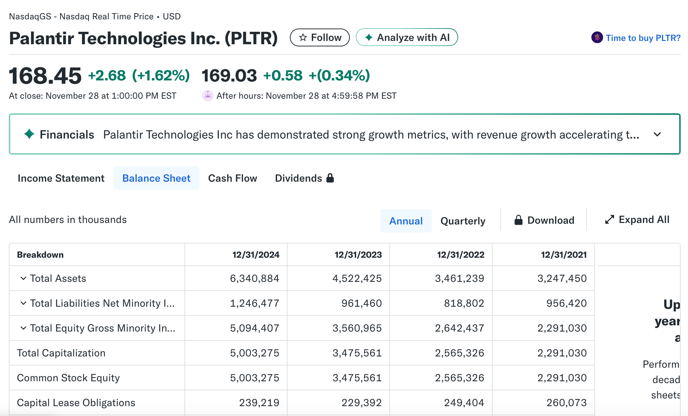
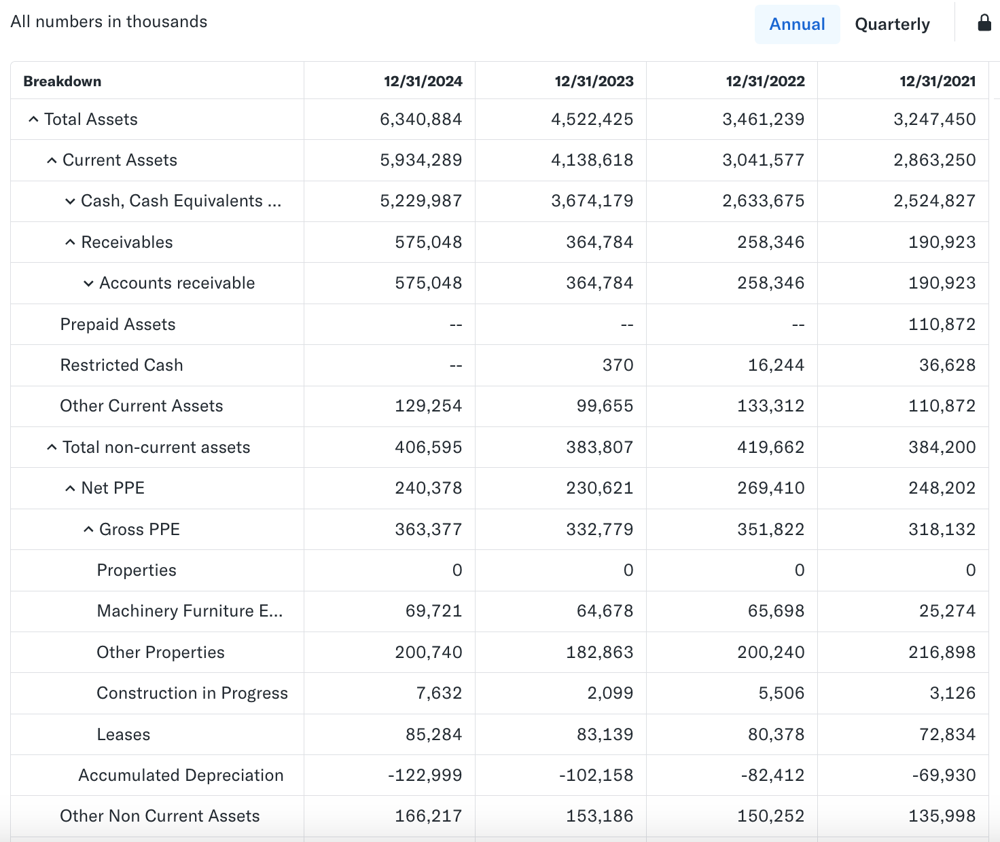
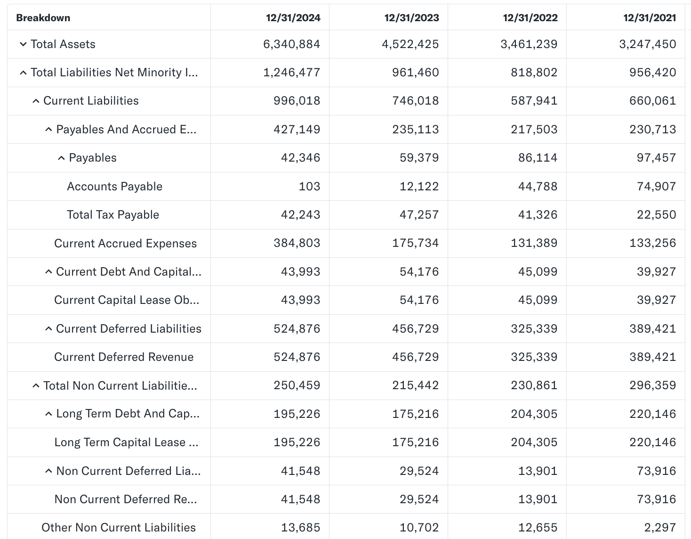

资产负债表是理解公司财务健康状况的基石，它的结构设计非常精妙，必须永远保持平衡。

## 资产负债表的定义与目的
资产负债表 (Balance Sheet) 是公司三大主要财务报表之一（另两个是利润表和现金流量表）。它的特殊之处在于它展示的是公司在**特定日期**（例如：2025 年 12 月 31 日）的财务状况。

> **它是一个“快照”**：不像利润表覆盖一段时间（如一个季度），资产负债表就像一张照片，记录了公司在拍摄那一瞬间拥有什么、欠着什么。

资产负债表的核心目的是向管理者、投资者和债权人展示公司的**财务实力（Financial Strength）**和**净值（Net Worth）**。

* **对于投资者：** 判断公司的偿债风险高低、资产结构是否健康。
* **对于债权人：** 评估公司是否有能力偿还贷款。

## 资产负债表的三大组成部分

资产负债表将公司的所有财务信息归类为三大相互关联的要素：**资产、负债和股东权益**。

| 要素 | 核心问题 | 简单定义 |
| :--- | :--- | :--- |
| **资产 (Assets)** | **公司拥有什么？** | 过去交易形成的、能给公司带来未来经济利益的资源。 |
| **负债 (Liabilities)** | **公司欠谁的钱？** | 过去交易形成的、未来需要公司用资产偿还的义务或债务。 |
| **股东权益 (Equity)** | **股东拥有多少？** | 资产扣除负债后，属于公司所有者（股东）的净值部分。 |

## 核心会计恒等式：永恒的平衡

资产负债表之所以得名，是因为它永远遵循一个基本的会计恒等式：

$$\text{资产} = \text{负债} + \text{股东权益}$$

### 平衡的意义

这个公式意味着：公司的所有资产（即公司拥有的所有东西）都必然由两种来源提供资金：

1.  **外部负债 (Liabilities)：** 银行贷款、欠供应商的钱等（公司欠外部人的钱）。
2.  **内部权益 (Equity)：** 股东的投入或公司自己赚取的利润（公司欠股东的钱）。

因此，资产的**总价值**永远等于负债和股东权益的**总和**，表格两侧始终处于完美的平衡状态。

接下来，我们以[Palantir](https://finance.yahoo.com/quote/PLTR/balance-sheet/)的资产负债表为例进行介绍。

### 资产的分类

在资产负债表中，资产是按照**流动性**（即转换为现金的速度）从高到低排列的，它被分为两大类：

* **流动资产 (Current Assets)：** 预计一年内可以转换为现金或用完（如现金、应收账款）。这一部分是公司**短期运营能力**的基石，主要用于支付短期账单和满足日常周转需求。对于Palantir来说，就是：现金及短期投资、应收账款。

* **非流动资产 (Non-Current Assets)：** 那些预计使用寿命超过一年的长期资产，如固定资产、商誉等。这一部分代表公司的**长期投资**和**商业模式**。例如，软件公司的非流动资产主要是专利和品牌（无形资产），而制造业则是厂房设备（净 PPE）。

* **公式：** $$\text{总资产} = \text{流动资产} + \text{非流动资产}$$

仅仅看数字本身没有意义，我们需要通过两种核心方法来解读它们：**趋势分析**和**占比分析**。

#### 1. 趋势分析 (Trend Analysis)

**方法：** 计算各项指标的**年同比增长率（YoY Growth Rate）**。

**目的：** 了解公司的规模和结构是在**扩大**、**萎缩**还是在**转型**。

#### 2. 占比分析 (Common-Size Analysis)

**方法：** 计算各项资产占**总资产**的比例。

**目的：** 了解资产的**结构**是否健康。例如，现金占比高代表安全，而应收账款占比过高则可能有风险。

我们现在应用上述方法来解读 Palantir 的数据，单位均为**千美元**：

#### A. 整体规模与增长

我们首先关注 **总资产 (Total Assets)** 的增长情况：

| 年份 | 2021 | 2022 | 2023 | 2024 |
| :--- | :--- | :--- | :--- | :--- |
| **总资产** | 32.5 亿 | 34.6 亿 | 45.2 亿 | 63.4 亿 |
| **年增长率** | N/A | 7% | 31% | 40% |

可以看出Palantir 在 2022 年后经历了爆炸性增长。其**总资产**在四年内几乎翻了一番，尤其在 2023 年和 2024 年实现了超过 30% 的高速增长。这表明 Palantir 不仅在扩大规模，而且**扩张速度正在加快**，这是一个极强的积极信号。

### B. 财务安全与流动性

我们来看公司最重要的资产：**现金、现金等价物及短期投资**。

**计算公式：**
$$\text{现金占总资产比} = \frac{\text{现金及短期投资}}{\text{总资产}}$$
**计算目的：** 这个比率衡量公司的**流动性强度**。在 Palantir 这种高增长的科技公司，现金是生命线。

| 年份 | 现金及短期投资 | 总资产 | 现金占总资产比 |
| :--- | :--- | :--- | :--- |
| **2021** | 25.2 亿 | 32.5 亿 | **78%** |
| **2024** | 52.3 亿 | 63.4 亿 | **82%** |

可以看出Palantir 是一个“金融堡垒”，其现金占比长期稳定在 **76% 到 82%** 之间，这是极高的水平。这意味着 Palantir 的绝大部分资产都是流动性最强的现金。

这种极高的流动性表明公司**抗风险能力极强**，能够在不借债的情况下为研发、并购或回购提供资金。对于投资者来说，这代表了极大的财务安全边际。

### C. 收入质量与运营周转

我们关注 **应收账款（Receivables）** 的增长情况：

| 年份 | 应收账款 | 年增长率 |
| :--- | :--- | :--- |
| **2021** | 1.91 亿 | N/A |
| **2024** | 5.75 亿 | **58%** (2023至2024年) |

应收账款从 2021 年到 2024 年快速增长，并在最后一年增长了近 60%。

这是公司**快速增长的伴生现象**。科技公司通常是先提供服务或开具发票，客户再在 30-90 天内付款。应收账款的快速增长意味着**公司的销售额正在快速增加**。
* **但请注意：** 应收账款代表尚未收到的钱，理论上有坏账风险。然而，由于 Palantir 拥有**巨大的现金储备（是应收账款的数倍）**，这种风险被充分对冲。

### D. 商业模式分析

我们关注 **净物业、厂房和设备 (Net PPE)**，这代表了公司对实物资产的依赖程度。

**计算公式：**
$$\text{净 PPE 占总资产比} = \frac{\text{净物业、厂房和设备}}{\text{总资产}}$$
**计算目的：** 衡量公司的**资本密集度**。对于科技公司，这个比例应该很低。

| 年份 | 净 PPE | 总资产 | 净 PPE 占总资产比 |
| :--- | :--- | :--- | :--- |
| **2021** | 2.48 亿 | 32.5 亿 | **8%** |
| **2024** | 2.40 亿 | 63.4 亿 | **4%** |

随着公司总资产规模的扩大，**净 PPE 占总资产的比例持续下降**。这帮助我们**确认了 Palantir 的轻资产软件模式。** 公司的增长主要依靠其软件和知识产权（无形资产），而非投资大量实体厂房。这使得其商业模式具有高可扩展性和高盈利潜力。

**从 Palantir 的资产数据中我们可以学到以下分析方法：**

1.  **看总资产增长：** 确定公司规模是否在健康快速扩大。
2.  **看现金占比：** 确定公司抗风险能力和财务安全度。
3.  **看应收账款增长：** 确定收入增长是否伴随信用风险（并用现金对比来衡量风险）。
4.  **看净 PPE 占比：** 确定公司的商业模式是**轻资产**还是**重资产**。

### 负债的分类

负债通常按**到期日**（偿还紧迫性）进行分类：

* **流动负债 (Current Liabilities)：** 预计一年内必须偿还的债务（如短期贷款、应付账款）。对于Palantir来说，就是：应付账款、应计费用（尚未支付的工资或账单）、**流动递延收入**。
* **非流动负债 (Non-Current Liabilities)：** 长期债务，偿还期限超过一年。对于Palantir来说，就是：**长期债务**、**非流动递延收入**。

负债是有不同性质的。在科技公司，我们必须区分**金融债务**和**运营义务**：

  * **传统金融债务（“坏债”）**：需要支付利息，如银行贷款或债券（示例中的“债务和资本租赁义务”）。
  * **递延收入（“好债”）**：这是客户提前支付给公司的钱，但公司尚未提供服务（例如：客户预付了一年的软件订阅费）。它在会计上是负债，但实际上代表**未来已锁定的收入**，是积极的。

我们将把Palantir的负债与资产数据结合起来，计算三个重要的指标：

#### 1. 短期偿债能力：流动比率（Current Ratio）

流动比率是衡量公司用**流动资产**（一年内可变现的现金）来覆盖**流动负债**（一年内需偿还的债务）的能力。它是判断公司短期偿债安全性的黄金标准。

**计算公式：**
$$\text{流动比率} = \frac{\text{总流动资产}}{\text{总流动负债}}$$

| 年份 | 2021 | 2022 | 2023 | 2024 |
| :--- | :--- | :--- | :--- | :--- |
| **流动比率 (x)** | **4** | **5** | **6** | **6** |

Palantir 的流动比率介于 **4 到 6** 之间。

  * **行业标准：** 多数投资者认为 **1.5 到 2.0** 之间是健康的。
  * **Palantir 的表现：** 6 倍的比率表明 Palantir 的流动资产是其短期债务的 **6 倍**。这证实了我们在资产端得出的结论：公司拥有**极高的财务安全性**，短期内几乎没有任何偿债风险。

#### 2. 核心债务状况：净现金（Net Cash）

净现金是衡量公司**实际财务杠杆**的指标。如果公司的现金比其总债务还多，那么它在实际意义上是“无债一身轻”。

**计算公式：**
$$\text{净现金} = \text{现金及短期投资} - \text{总债务}$$

| 年份 | 现金及短期投资 | 总债务 | 净现金 |
| :--- | :--- | :--- | :--- |
| **2021** | 25.2 亿 | 2.6 亿 | **22.6 亿** |
| **2024** | 52.3 亿 | 2.39 亿 | **49.9 亿** |

Palantir 不仅有现金，而且其**净现金**从 2021 年的 22.6 亿增长到 2024 年的 **49.9 亿**。

则Palantir公司的现金储备是其总债务的 **20 倍以上**。在金融分析中，拥有如此庞大净现金的公司被认为是 **“无负债”或“净债为负”**，是典型的**金融堡垒**。这意味着公司运营产生的风险极低，其资产几乎完全由股东权益（自有资金）支持。

#### 3. 负债的性质：递延收入占比

我们计算**递延收入**占**总负债**的比例，以此判断公司的负债是源于传统的金融借贷，还是源于客户对未来服务的预付费。

**计算公式：**
$$\text{递延收入占比} = \frac{\text{总递延收入}}{\text{总负债}}$$

| 年份 | 总递延收入 | 总负债 | 递延收入占比 |
| :--- | :--- | :--- | :--- |
| **2021** | 4.63 亿 | 9.56 亿 | **48%** |
| **2024** | 5.66 亿 | 12.5 亿 | **45%** |

Palantir 的总负债中，约 **41% 到 51%** 是由递延收入构成的。

这表明 Palantir 的负债主要是一种**运营义务**（承诺提供服务），而不是需要支付利息的**金融债务**。递延收入的增加是好事，因为它代表客户信任公司并预付了资金，锁定了未来的收入来源。

综合资产和负债两端的分析，我们得出以下最终结论：

1.  **财务安全性 (Safety)：** **极高**。流动比率高达 6，且公司拥有近 50 亿美元的**净现金**。
2.  **业务模式 (Model)：** 经典的**轻资产软件模式**。总资产中 80% 是现金，且不需要大量实体资产（净 PPE 占比极低）。
3.  **增长质量 (Growth)：** **健康**。资产和应收账款都在快速增长，表明销售额在扩大。同时，负债中有大量**递延收入**，锁定了部分未来收入。

总而言之，Palantir 的资产负债表展示了**稳健**的财务状况，为其高风险、高增长的商业战略提供了充足的资本缓冲和灵活性。

### 权益的分类

股东权益代表了公司**净资产**中，归属于所有者（股东）的部分。
简单来说，股东权益告诉我们公司的净资产来自两个主要方面：**股东的投入**和**公司自己赚的钱**，体现公司的**历史价值积累**和**未来增长模式**。

股东权益的分类和组成如下：

### 1. 投入资本 (Contributed Capital)

这是股东直接或间接投入公司的资金。

* **普通股 (Common Stock) 或股本 (Share Capital):**
    * **定义：** 公司首次发行股票时，股东投入的资金，通常按股票的**面值（Par Value）**或法定价值记录。
    * **含义：** 这是股东对公司最初的投资。
* **额外实缴资本 (Additional Paid-in Capital, APIC):**
    * **定义：** 股东购买股票时，支付的**超过面值**的那部分资金。
    * **含义：** 在现代公司中，APIC 通常是比普通股更大的数字，代表了股东实际投入资本的大部分。

| 年份 | APIC（千美元） | 增长来源（方法论） |
| :--- | :--- | :--- |
| **2021** | 77.8 亿 | 投入资本和激励机制的累计 |
| **2024** | 101.9 亿 | |

可以看到Palantir的APIC 持续稳健增长，从 2021 年到 2024 年增加了超过 24 亿美元。说明Palantir 的权益增长主要是由**投入资本**（包括股权激励）驱动，而非利润留存。

对于像 Palantir 这样的科技公司，APIC 的增长并非总是股东直接现金投入。很大一部分增长是由**股权激励（Stock-Based Compensation, SBC）**驱动的。
公司向员工发放股票作为薪酬时，这在利润表上是**费用**，但在资产负债表上，它被记录为**股东投入资本的增加**。这是一种不涉及现金的资本增加，但会**稀释现有股东的股权比例**。

### 2. 留存收益 (Retained Earnings)

这是公司通过运营**自己赚取**并保留在公司内部的利润。

* **定义：** 公司自成立以来累计的**净利润总和**，减去所有已支付的**股息**（Dividends）。
* **含义：** 这是衡量公司盈利能力和再投资成功与否的终极指标。**如果一家公司长期盈利，这个数字通常会持续增长。** 如果这个数字是负数，则被称为“累计赤字”。

| 年份 | 留存收益（千美元） | 留存收益变化 | 含义（方法论） |
| :--- | :--- | :--- | :--- |
| **2021** | -54.8 亿 | N/A | **历史累计亏损** |
| **2022** | -58.6 亿 | -3.7 亿 | 持续亏损 |
| **2023** | -56.5 亿 | **+2.1 亿** | **首次实现年度盈利** |
| **2024** | -51.9 亿 | **+4.6 亿** | 盈利扩大，累计亏损减少 |

  * **历史状态：** 留存收益在所有年份都是巨大的负数（直到 2024 年仍有 -51.9 亿美元），这表明 Palantir 在历史上积累了**巨额亏损**。
  * **关键转折点：** 从 2023 年开始，**留存收益的变化转为正值（+2.1 亿和 +4.6 亿）**。留存收益的变化额就是公司当年的净利润（减去股息，但 Palantir 不发股息）。这一转正表明公司在 2023 年和 2024 年**实现了净盈利**。这是公司财务健康状况中最重要的积极信号。
  * **结论：** 虽然公司的累计亏损仍然庞大，但盈利能力已经实现根本性突破，开始用每年的利润去填补历史亏损。

### 3. 库存股（Treasury Stock）

库存股是一种特殊的项目，它是**股东权益的减项**。

* **定义：** 公司用现金从公开市场**回购**的自己已发行的股票。
* **含义：** 回购股票会减少公司资产（现金），同时减少股东权益。对于投资者来说，回购通常被视为积极信号，因为它表明管理层认为自家股票被低估，并积极向股东返还资本。因此，库存股在报表上通常显示为**负值**。

### 4. 累计其他综合收益（Accumulated Other Comprehensive Income, AOCI）

这是一个相对复杂的项目，它记录了一些**未经过利润表**的、直接影响权益的利得和损失。

* **定义：** 主要是尚未实现（Unrealized）的损益，例如未出售的长期投资的价值变动、外币换算调整等。
* **含义：** 帮助会计恒等式保持平衡，但由于它不是通过核心经营活动产生的“实现”损益，因此需要单独列示。

总而言之，股东权益最终是这样构成的：

$$\text{股东权益} = \text{普通股} + \text{额外实缴资本} + \text{留存收益} + \text{累计其他综合收益} - \text{库存股}$$

这整个总和代表了公司的净资产，并用于与负债相加，以平衡**资产 = 负债 + 股东权益**的恒等式。

### Palantir 资产负债表的分析总结

我们现在综合资产、负债和权益的分析，可以了解 Palantir 财务状况如下：

| 分析维度 | 关键指标 | 趋势和数值（2024年） | 财务安全/商业模式结论 |
| :--- | :--- | :--- | :--- |
| **资产安全** | 现金及短期投资 | 52.3 亿美元 | 拥有巨额流动性，**极度安全**的“金融堡垒”。 |
| **短期偿债** | 流动比率 | **6** 倍 | 远超健康标准（1.5-2.0），短期偿债能力**无忧**。 |
| **债务状况** | 净现金 | **49.9 亿美元** | 净债务为负，实际意义上**无负债**。 |
| **负债性质** | 递延收入占比 | 约 45% | 负债主要由**客户预付的收入**构成，是未来的营收保证。 |
| **商业模式** | 净 PPE 占比 | 约 4% | **轻资产**的软件公司，具有高可扩展性。 |
| **价值积累** | 留存收益转正 | 2023年开始转正 | 历史积累的亏损正在被近期实现的**利润**所填补。 |

Palantir 拥有一个**极其健康和安全**的资产负债表。它通过股权激励积累了大量资本，保持着巨大的现金储备和极低的传统债务，并在近两年成功实现了盈利的突破。

## 资产负债表的其它指标

这些内容，通常被称为 **“补充指标”**或 **“关键衍生指标”**。它们本身并不是资产负债表的基本要素（资产、负债、权益），而是基于基本要素计算或提取出来的，目的是帮助投资者**快速评估**公司的特定财务方面。

对于金融小白来说，这些衍生指标是提高分析效率的“捷径”。

### 1. 流动性与效率指标

| 补充指标 | 定义和计算公式 | 作用和重要性 | Palantir 数据解读 (2024) |
| :--- | :--- | :--- | :--- |
| **运营资本 (Working Capital)** | **流动资产 - 流动负债** | 衡量公司**短期偿债能力和运营效率**。正值越大，表示公司短期资源越充足，运营越灵活。 | **49.4 亿美元 (2024)**。**极其庞大且持续增长**。这证实了 Palantir 的流动比率高，短期资金周转毫无压力。 |
| **净有形资产 (Net Tangible Assets)** | **总资产 - 总负债 - 无形资产** | 衡量公司在清算时，**可分配给股东的实际物理价值**。它排除了商誉和专利等“软资产”。 | **50 亿美元 (2024)**。由于 Palantir 几乎没有商誉和无形资产（或将其视为零），这个数字与股东权益高度重合，表明**公司的价值是“硬”的**。 |
| **有形账面价值 (Tangible Book Value)** | **股东权益 - 无形资产** | 衡量每股实际的净有形资产价值。 | **50 亿美元 (2024)**。与净有形资产是同一个概念，但更常用于计算每股价值（Tangible Book Value Per Share）。 |

### 2. 资本结构与债务指标

| 补充指标 | 定义和计算公式 | 作用和重要性 | Palantir 数据解读 (2024) |
| :--- | :--- | :--- | :--- |
| **总资本 (Total Capitalization)** | **总债务 + 股东权益** | 衡量公司用于运营和投资的**总资金来源**。用于计算资本结构比率（如债务占总资本的比重）。 | **50 亿美元 (2024)**。这个数字与股东权益相等（50.03 亿），再次证明 Palantir **几乎没有传统债务**，其资本结构几乎完全由自有资金构成。 |
| **投资资本 (Invested Capital)** | **总债务 + 股东权益**（或**总资产 - 非付息流动负债**） | 与总资本概念相似，用于衡量公司用于产生运营收益的资金总额。是计算 **ROIC (投入资本回报率)** 的基础。 | **50 亿美元 (2024)**。由于总债务极低，这表明公司主要使用自有权益来驱动回报。 |
| **总债务 (Total Debt)** | **流动债务 + 非流动债务**（通常指计息负债） | 衡量公司欠外部债权人的计息资金总额。 | **2.39 亿美元 (2024)**。这个数字在 2021-2024 年保持稳定，且远低于其 52 亿美元的现金。**再次确认 Palantir 财务极度安全**。 |
| **资本租赁义务 (Capital Lease Obligations)** | **流动资本租赁 + 非流动资本租赁** | 这是总债务的主要构成部分。资本租赁在会计上被视为购买资产并承担负债，通常是租用办公楼或设备。 | **2.39 亿美元 (2024)**。与总债务一致，表明 Palantir 的总债务全部是**融资租赁**，而不是传统的银行贷款。 |

### 3. 股权与稀释指标

| 补充指标 | 定义和计算公式 | 作用和重要性 | Palantir 数据解读 (2024) |
| :--- | :--- | :--- | :--- |
| **已发行股份 (Shares Issued)** | **公司历史上向股东发行股份的总数** | 用于计算每股收益、每股净资产等指标。 | **23.39 亿股 (2024)**。持续增长。 |
| **普通股股数 (Ordinary Shares Number)** | **与已发行股份相同** | 衡量流通在外股份的总数。 | **23.39 亿股 (2024)**。与已发行股份一致。 |
| **库存股数量 (Treasury Shares Number)** | **公司回购的股票数量** | 衡量公司减少市场流通股的数量。 | **0 股**。表明 Palantir 在这些年份**没有进行股票回购**。其权益的增长是通过 APIC（股权激励）驱动的，而不是通过减少流通股数量。 |

