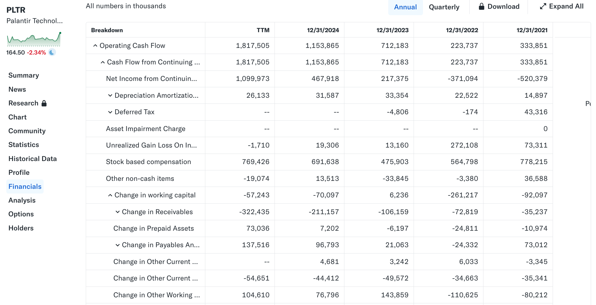

The **Cash Flow Statement (CFS)** is the **closest to reality** among the three major financial statements. Unlike the income statement (which includes non-cash expenses) and the balance sheet (which is only a snapshot at a point in time), the CFS tracks the **actual cash** flowing in and out of the business over a **specific period**.

The ultimate value of a stock depends on how much **free cash flow** a company can generate throughout its lifecycle. The CFS directly reveals a company’s **financial health**, **liquidity**, and **ability to service its debt**.

## Why the CFS Exists: Accounting Basics and the Link Between the Three Statements

### Why do we need a CFS? (Accrual vs. Cash Accounting)

* **Cash Method:** Revenue is recognized when cash is received, and expenses are recognized when cash is paid. Under this method, the **income statement equals cash flow**, and a separate CFS is unnecessary (although this method is not permitted under GAAP/IFRS).
* **Accrual Method:** Revenue is recognized when it is **earned** (even if cash hasn’t been received), and expenses are recognized when they are **incurred** (even if cash hasn’t been paid).

  * **Result:** **Net income ≠ actual cash received**.
  * **Role of the CFS:** The CFS adjusts net income to **reconcile it back to real cash changes**, addressing the limitations of accrual-based accounting.

### How the CFS Connects to Other Financial Statements

The CFS links the income statement and the balance sheet:

$$\text{Ending Cash Balance} = \text{Beginning Cash Balance} + \text{Cash Flow from Operations} + \text{Cash Flow from Investing} + \text{Cash Flow from Financing}$$

In this article, we continue to use [Palantir](https://finance.yahoo.com/quote/PLTR/cash-flow/) as an example to explain the structure of the CFS.

## The Basic Structure of the CFS

The CFS separates all cash activities into three independent sections: operating, investing, and financing.

| Component               | Abbreviation | Core Content                                                                             | Investment Insight                                                      |
| :---------------------- | :----------- | :--------------------------------------------------------------------------------------- | :---------------------------------------------------------------------- |
| **Operating Cash Flow** | **CFO**      | Cash generated or consumed by core business operations.                                  | Measures the company’s ability to “generate cash from its core.”        |
| **Investing Cash Flow** | **CFI**      | Cash spent on or received from long-term assets (plants, equipment, acquisitions, etc.). | Indicates whether the company is expanding or contracting.              |
| **Financing Cash Flow** | **CFF**      | Cash exchanged with shareholders and creditors.                                          | Shows how the company raises capital and returns value to shareholders. |

## Cash Flow from Operations (CFO)

**CFO (Cash Flow from Operations)** is the most important part of the statement. It represents the **net cash inflow from core business activities**.

We focus on **three essential questions**:

1. **How high is the quality of earnings?** (Compare net income vs. cash flow)
2. **What is the biggest cost driver?** (Identify the largest adjustments)
3. **What is the long-term trend?** (Analyze CFO over time)

### CFO Trend Analysis

Let’s examine the long-term change in Palantir’s cash-generating ability.

| Metric                              | 2021     | 2022     | 2023    | 2024      | TTM (Last 12 Months) | Trend                                    |
| :---------------------------------- | :------- | :------- | :------ | :-------- | :------------------- | :--------------------------------------- |
| **Net Income**                      | -520,379 | -371,094 | 217,375 | 467,918   | 1,099,973            | **Turned profitable with strong growth** |
| **Cash Flow from Operations (CFO)** | 333,851  | 223,737  | 712,183 | 1,153,865 | 1,817,505            | **Rapid growth, far above net income**   |

This tells us:

1. **A historic shift: From losses to profitability**

   * In 2021 and 2022, Palantir posted accounting losses (negative net income).
   * **Since 2023:** Net income turned positive and has been growing rapidly, indicating accelerating profitability.

2. **High-quality earnings (CFO far exceeds net income)**

   * The key observation: **CFO is much higher than net income every year.**
   * Even when net income was negative, CFO was positive; after profitability, CFO grew even faster.
   * This means Palantir’s **real cash generation** is much stronger than what its accounting profit shows—an indicator of highly healthy earnings quality.

### Why Net Income and CFO Differ So Much

The large gap between net income and CFO is mainly due to **non-cash expenses**. For Palantir, one adjustment dominates all others: **Stock-Based Compensation (SBC)**.

#### Key Red Flag: Stock-Based Compensation (SBC)

SBC refers to **shares or stock options** granted to employees and executives.

* **Impact on Net Income:** SBC is recorded as an **expense**, reducing net income.
* **Impact on CFO:** SBC is a **non-cash expense**, so it is **added back** when calculating CFO.

Consider the relationship between net income and SBC:

| Metric (in thousands) | 2021     | 2022     | 2023    | 2024    | TTM       |
| :-------------------- | :------- | :------- | :------ | :------ | :-------- |
| **Net Income**        | -520,379 | -371,094 | 217,375 | 467,918 | 1,099,973 |
| **SBC**               | 778,215  | 564,798  | 475,903 | 691,638 | 769,426   |

* In 2021 and 2022, SBC far exceeded the accounting loss. Because SBC is added back, **CFO turned positive despite negative net income** (i.e., ( CFO = \text{Net Income} + SBC + \dots )).
* But high SBC means more shares issued, **diluting existing shareholders**. Investors must watch whether SBC is too high relative to revenue or FCF.

#### Other Core Adjustments: Working Capital Changes

**Changes in working capital** include fluctuations in accounts receivable, accounts payable, and prepaid expenses:

* **Increase in accounts receivable = decrease in cash:** Revenue is recognized but cash not yet collected.
* **Increase in accounts payable = increase in cash:** Payments to suppliers are delayed, essentially a short-term loan.

**Change in Receivables:**
This line has been consistently negative and increasingly so (from (-35,237) in 2021 to (-322,435) in the TTM).
This indicates rapidly growing sales, leading to a surge in **accounts receivable**—customers owe more.
While this signals growth, it also **consumes cash**, locking it in outstanding invoices.

Overall, Palantir’s CFO story is:
**A fast-growing software company transitioning from accounting losses to strong cash generation, driven by rapid revenue growth (which expands receivables) and heavy reliance on SBC adjustments.**

## Cash Flow from Investing Activities (CFI)

**Cash Flow from Investing Activities (CFI)** records the cash flows generated from the purchase or sale of long-term assets and other investment activities.

* **Purpose of CFI:** Shows how the company uses its cash (usually generated from CFO or raised through CFF) for **long-term investments and expansion**.
* **How to interpret the signs:**

  * **Negative (-):** Cash outflow — the company is buying assets or making investments (investing for growth).
  * **Positive (+):** Cash inflow — the company is selling assets or liquidating investments (recovering cash).
* **For growth companies:** It is normal for **CFI to remain negative** over the long term because it reflects ongoing investment in future growth.

### Trend Analysis of Palantir’s CFI

Let's first look at the overall trend of Palantir’s CFI and break down its major components.

| Metric (in thousands)              | 2021     | 2022    | 2023       | 2024     | TTM (Last 12 Months) |
| :--------------------------------- | :------- | :------ | :--------- | :------- | :------------------- |
| **Cash Flow from Investing (CFI)** | -397,912 | -45,427 | -2,711,180 | -340,655 | -1,185,526           |

**Key Takeaways:**

1. **CFI is consistently negative:** This is typical for a growth company, showing that Palantir continues to invest heavily in long-term assets and financial investments.
2. **Extreme volatility:** CFI reached a massive **-$2.7 billion** in 2023, compared with just **-$45 million** in 2022. This indicates that Palantir’s CFI is influenced more by **financial investment activities** rather than stable capital expenditures.

### Key Components of CFI

We break CFI into two major categories:

## 1. Capital Expenditures (CapEx): Purchase of Property, Plant, and Equipment (PPE)

**Capital Expenditures (CapEx)** represent cash spent on long-term physical assets such as servers, data centers, and office equipment. CapEx is a crucial component in calculating **Free Cash Flow (FCF)**.

| Metric (in thousands)    | 2021    | 2022    | 2023    | 2024    | TTM     | Conclusion                     |
| :----------------------- | :------ | :------ | :------ | :------ | :------ | :----------------------------- |
| **PPE Purchase (CapEx)** | -12,627 | -40,027 | -15,114 | -12,634 | -23,716 | **Consistently extremely low** |

Palantir’s CapEx has remained very low across all years, especially relative to CFO. This confirms that Palantir is a **capital-light software business**, requiring minimal physical investment to grow or maintain operations. As a result, the company benefits from extremely high **cash conversion efficiency**.

## 2. Strategic Investments and Financial Asset Management (Net Investment Purchase and Sale)

This is the primary driver of volatility in Palantir’s CFI.

| Metric (in thousands)       | 2021     | 2022     | 2023       | 2024       | TTM        |
| :-------------------------- | :------- | :------- | :--------- | :--------- | :--------- |
| **Purchase of Investments** | -382,265 | -124,500 | -5,636,406 | -5,395,913 | -8,137,651 |
| **Sale of Investments**     | 851      | 52,319   | 2,889,268  | 5,073,507  | 6,982,456  |
| **Net Investment Change**   | -381,414 | -72,181  | -2,747,138 | -322,406   | -1,155,195 |

These activities **do not** represent investments in Palantir’s core operations or subsidiaries. They reflect how Palantir deploys its **excess cash** into financial assets such as Treasury securities, money market funds, or equity investments.

* **Analysis:**

  * **2023 volatility:**
    In 2023, Palantir spent **$5.6 billion** purchasing investments and received **$2.9 billion** from liquidations, resulting in a **net outflow of $2.7 billion**.
    This large-scale buying and selling indicates active management of its significant cash reserves.
  * **2024 and TTM:**
    Investment activity remains large in scale, but cash inflows from investment sales have also increased, reducing net cash outflows compared to 2023.
  * **Summary:**
    These high-frequency, high-volume transactions show that Palantir holds **substantial cash reserves** and strategically invests them to earn interest or capital gains.

## Outlook on Free Cash Flow (FCF)

The most direct implication of investing cash flows is the calculation of **Free Cash Flow (FCF)**.

$$\text{FCF} = \text{CFO} - \text{CapEx}$$

Using the previously discussed CFO (TTM: **$1.817 billion**), and the very low CapEx (TTM: **$23.7 million**), we can compute Palantir’s exceptional free cash flow:

$$\text{TTM FCF} = 1,817,505 - 23,716 \approx 1,793,789 \text{ (thousand USD)}$$

Palantir converts **nearly all** of its operating cash flow (CFO) into free cash flow (FCF). This demonstrates its **exceptionally high cash flow conversion efficiency and strong earnings quality**.

## Cash Flow from Financing Activities (CFF)

**Cash Flow from Financing Activities (CFF)** records cash transactions between the company and its **capital providers**—shareholders and creditors.

* **Purpose of CFF:** Reflects how the company **raises capital** (issuing shares or taking on debt) and how it **returns or distributes capital** (share repurchases, dividend payments, or debt repayment).
* **How to interpret the signs:**

  * **Positive (+):** Cash inflow, typically from issuing new shares or taking on new debt.
  * **Negative (-):** Cash outflow, usually from repaying debt, paying dividends, or buying back shares.

### Trend Analysis of Palantir’s CFF

First, let’s look at the overall CFF trend for Palantir.

| Metric (in thousands)              | 2021    | 2022   | 2023    | 2024    | TTM (Last 12 Months) | Trend                                                 |
| :--------------------------------- | :------ | :----- | :------ | :------ | :------------------- | :---------------------------------------------------- |
| **Cash Flow from Financing (CFF)** | 306,747 | 85,996 | 218,839 | 463,364 | 222,652              | **Consistently positive with significant volatility** |

**Key Takeaways:**

1. **CFF is consistently positive:** This indicates that over the past several years, Palantir’s **net financing activities** have resulted in cash inflows. In other words, the company has received **more cash from shareholders and creditors** than it has paid out.
2. **Composition of CFF:** By examining the components, we can see that Palantir’s financing activities are driven primarily by **equity-related transactions**, not debt.

## Main Components of CFF

### 1. Debt Management (Net Issuance Payments of Debt)

| Metric (in thousands)  | 2021     | 2022 | 2023 | 2024 | TTM |
| :--------------------- | :------- | :--- | :--- | :--- | :-- |
| **Net Long-Term Debt** | -200,000 | 0    | 0    | 0    | --  |

Aside from a **$200 million debt repayment** (cash outflow, negative) in 2021, Palantir has had virtually **no debt activity** from 2022 onward.

This further confirms Palantir’s **financial strength** and **capital-light model**. The company does not rely on borrowing to sustain or expand its operations and can meet its funding needs primarily through its own business (CFO) and equity-related activity.

### 2. Core Cash Source: Proceeds from Stock Options Exercised

This is the cash the company receives when employees or executives **exercise** (purchase) their stock options. This represents a **real cash inflow** (positive).

| Metric (in thousands)                    | 2021    | 2022   | 2023    | 2024    | TTM     |
| :--------------------------------------- | :------ | :----- | :------ | :------ | :------ |
| **Proceeds from Stock Option Exercised** | 507,455 | 86,089 | 218,238 | 745,396 | 596,028 |

Stock option exercises are the **primary driver** of Palantir’s CFF. In 2024, this figure reached **$745 million**.

Although **stock-based compensation (SBC)** is a major non-cash expense in CFO (diluting shareholders), when employees exercise their options, it generates **actual cash inflows** for the company. Rising exercise proceeds often coincide with strong stock performance, as employees choose to realize their gains.

### 3. Share Repurchases (Net Common Stock Issuance)

When **net common stock issuance** is negative, it typically indicates that the company has conducted **share repurchases** (Common Stock Payments) — using cash to buy back its own shares on the open market.

Data from 2024 and the TTM period show **net outflows** (-74,387 thousand and -64,196 thousand), indicating that Palantir has begun deploying cash to **repurchase shares**.

Share repurchases generally occur when a company has **abundant free cash flow (FCF)**. This sends a positive signal to the market: management believes the stock is undervalued and is choosing to directly return value to shareholders by reducing the number of shares outstanding. This aligns with the strong FCF trend calculated earlier.

## Summary: Palantir’s Cash Flow Story

Now, let’s consolidate all three types of cash flows to complete Palantir’s cash flow picture.

| Cash Flow Type                | TTM Data (in thousands USD) | Key Insight                                                                                                                               |
| :---------------------------- | :-------------------------- | :---------------------------------------------------------------------------------------------------------------------------------------- |
| **Operating Cash Flow (CFO)** | +1,817,505                  | **Extremely strong cash generation and high earnings quality.** The largest adjustments relate to SBC.                                    |
| **Investing Cash Flow (CFI)** | -1,185,526                  | **Capital-light model** (very low CapEx). Cash outflows primarily reflect **financial investment management**, not operational expansion. |
| **Financing Cash Flow (CFF)** | +222,652                    | **No reliance on debt**. Cash mainly comes from **employee stock option exercises**; company has begun **share repurchases**.             |

**“Three-Color Cash Flow Rule” Conclusion (TTM):**

| CFO   | CFI   | CFF   | Interpretation                                                                                                                         |
| :---- | :---- | :---- | :------------------------------------------------------------------------------------------------------------------------------------- |
| **+** | **-** | **+** | **High-growth stage:** Strong core cash generation (CFO+), continuous investment (CFI-), and net inflows from equity financing (CFF+). |

**Final Net Change in Cash:**

Summing the three cash flow categories gives the company’s net increase in cash for the TTM period:

$$\text{Net Change in Cash} = \text{CFO} + \text{CFI} + \text{CFF}$$

$$\text{Net Change in Cash} = 1,817,505 - 1,185,526 + 222,652 = \mathbf{854,631} \text{ (thousand USD)}$$

Palantir increased its cash reserves by approximately **$855 million** over the past 12 months, reflecting exceptionally strong financial health.
