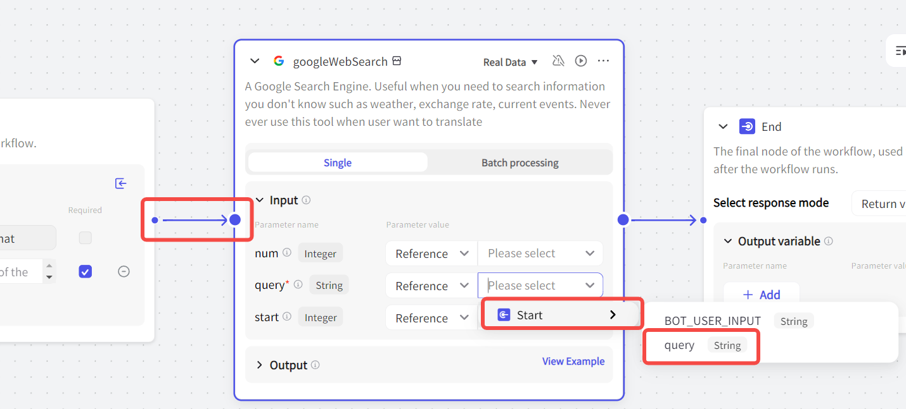
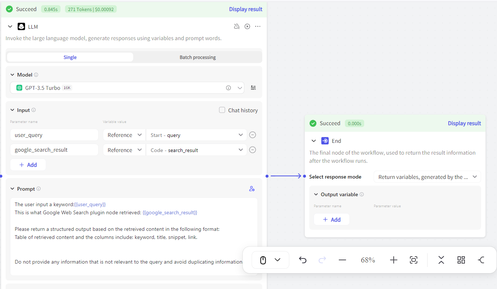
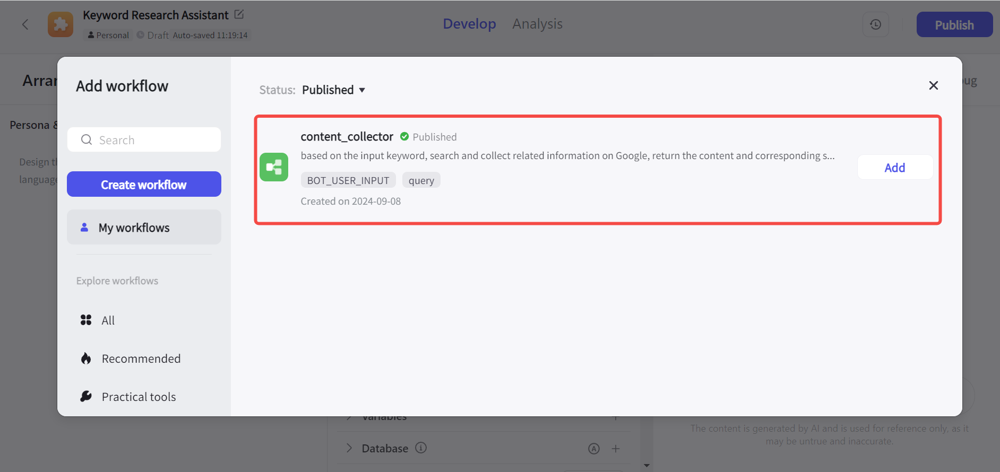
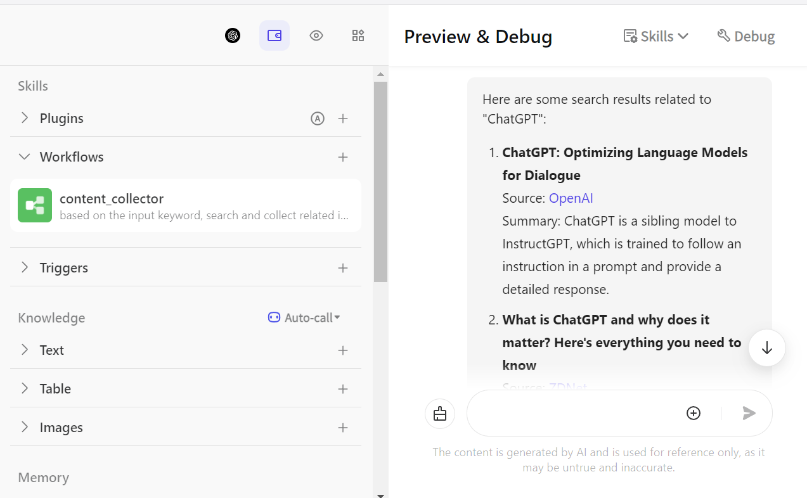

## 什么是工作流？
工作流指的是一组预定义的、标准化的步骤，可以用来完成特定的任务。一个工作流中包含多个节点，每个节点完成一个固定的任务。

举个不太恰当但很容易理解的例子，我们都很熟悉“把大象放进冰箱需要几步？”这个脑筋急转弯，答案是三步：打开冰箱、把大象放进去、关上冰箱。在这个场景中，这三步就构成了“把大象放进冰箱”这个工作流的节点。

## 为什么需要使用工作流？
在之前介绍[如何在Coze中创建Bot](https://chloevolution.com/zh-cn/posts/how-to-create-bot-on-coze/)的文章中，有一个步骤是选择你的Bot期望使用的LLM模型。而LLM模型的能力边界受到“上下文”的限制，当你输入给Bot的信息越多、要求其解决的问题越发杂时，Bot返回给你的答案质量就会下降。相信你在直接使用ChatGPT或Claude时也有过类似的感受。

短期内，我们很难要求大语言模型在处理上下文方面获得显著的能力提升。那么另一个解决方法，就是把输入给Bot的复杂任务拆解为多个简单的子任务，从而保证Bot输出内容的质量。

## Coze工作流功能简介
节点是组成工作流的基本单元，工作流由多个节点构成。Coze中的节点可以分为两类，一类是默认自动生成的固定节点，另一类是可选的基础节点：

### 默认自动生成的固定节点
- **Start节点**：工作流的起始节点，可以包含用户输入的信息
- **End节点**：工作流的末尾节点，用于返回工作流的运行结果

### 可选基础节点
目前，Coze共提供十三个基础节点：
<table>
    <tr>
        <td>节点名称</td>
        <td>描述</td>
   </tr>
    <tr>
        <td>Plugin</td>
        <td>插件节点。用于使用外部实时数据并处理任务</td>
   </tr>
    <tr>
        <td>LLM</td>
        <td>大语言模型节点。支持选择不同的AI模型处理文本生成任务</td>
   </tr>
    <tr>
        <td>Code</td>
        <td>代码节点。通过IDE编写代码处理输入参数，并返回输出值</td>
   </tr>
    <tr>
        <td>Knowledge</td>
        <td>知识库节点。根据输入参数从关联知识库中召回数据，并返回</td>
   </tr>
    <tr>
        <td>Workflow</td>
        <td>工作流节点。添加已发布的工作流并执行子任务</td>
   </tr>
    <tr>
        <td>Condition</td>
        <td>if-else 逻辑节点。满足设置条件则运行 if 分支，否则运行 else 分支</td>
   </tr>
    <tr>
        <td>Loop</td>
        <td>循环节点。通过设置循环的逻辑和次数以重复执行一系列任务</td>
   </tr>
    <tr>
        <td>Intent recognition</td>
        <td>意图识别节点。用于识别用户输入的意图，将其与预置的意图选项匹配</td>
   </tr>
    <tr>
        <td>Text Processing</td>
        <td>文本处理节点。用于处理多个字符串类型的变量</td>
   </tr>
    <tr>
        <td>Message</td>
        <td>消息节点。支持中间过程的消息输出，支持流式和非流式方式</td>
   </tr>
    <tr>
        <td>Question</td>
        <td>问题节点。支持在对话过程中向用户提问，既有预设选项，也有开放式问题</td>
   </tr>
    <tr>
        <td>Variable</td>
        <td>变量节点。用于读取和写入 Bot 中的变量</td>
   </tr>
    <tr>
        <td>Database</td>
        <td>数据库节点。用户可以在开发者控制的数据库中读写数据。必须事先在Bot的数据库中添加一个表</td>
   </tr>
</table>

### 节点与参数
不同节点可能需要输入不同的参数，输入参数分为Reference和Input两类：

- **Reference参数**：指引用前面节点的参数值
- **Input参数**：支持设置自定义的参数值

## 如何使用Coze创建工作流
本文会介绍一个我用Coze搭建关键词调研Bot的案例，它可以根据用户输入的目标关键词，在Google中查询和总结相关的信息，并且附带对应的内容链接。

1. 首先，我们需要创建一个Bot（如果不太清楚如何创建，可以看[之前的一篇文章](https://chloevolution.com/zh-cn/posts/how-to-create-bot-on-coze/)），然后点击“工作流”后面的“+”号：

2. 输入工作流的名称和描述，注意命名只能包括字母、数字、下划线，而且要以字母开头。然后点击“确认”：

3. 之后进入工作流编辑页面，可以看到，Coze会自动生成Start节点和End节点。左侧为前面提到的可选的基础节点：

4. 首先，我们需要确定如何从Google中获得我们想要的信息。以往我们更多地直接通过写代码来访问API进而收集到所需要的信息。那么在Coze中，可以直接使用插件来完成这项任务。
点击左侧的“Plugin”按钮，然后选择Google Web Search这款插件并添加：

5. 这个工作流的触发是用户输入的关键词，所以我们需要在Start节点配置字符串类型的参数，用于接收输入的文本，此处命名为query：

6. 关键词信息需要流向Google Web Search插件，由其完成文本处理和检索任务，这里的操作包括：
- 设置为上一步骤中的query
- 将开始节点右侧和插件节点左侧连接起来，表示任务之间的顺序

此外，我们还可以设置另外两个参数：
- **num参数**：定义返回的最大数量的检索结果数，默认为10
- **start参数**：设置检索的页面数，默认为0，即检索结果第一页

7. 这时我们可以先点击右上角的“Test run”测试一下输出效果。这里我们输入“chatgpt”为例，可以看到Coze花费3秒钟成功运行了这个工作流。点击插件节点右上角的“Display result”可以查看其处理任务的具体结果：

8. 我希望这个工作流最终输出的信息包括：每个检索结果的标题、描述，以及对应的链接。而这些信息是混杂在Google Web Search插件的输出结果中的，那么我需要一个Code节点来提取这些信息。

将Code节点置于插件节点和End节点之间后，input参数设置为插件节点输出的结果，然后点击Edit in IDE进入比代码编辑页面：

9. 目前Code节点支持Python和JavaScript两种语言。如果你不会写代码，也可以通过在内置的AI中输入自然语言prompt让AI帮你写。写完之后点击“Test Code”测试代码是否可以正常运行：

10. 确定代码运行正常后，我们可以再次测试整个工作流的运行情况。虽然此时我们已经能够从Google搜索结果中提取相应的结果标题、链接、摘要，但所有的信息都堆在一起，所以我们还需要一个LLM节点来帮助我们组织信息。为了保证输出结果的质量，prompt中要尽可能讲清楚背景信息：

## 如何将工作流应用在Coze Bot中
测试工作流能够正常运行后，我们可以点击右上角的“Publish”按钮进行发布，然后在Bot中添加这个工作流（注意：工作流需要发布后才能添加到Bot中）：

