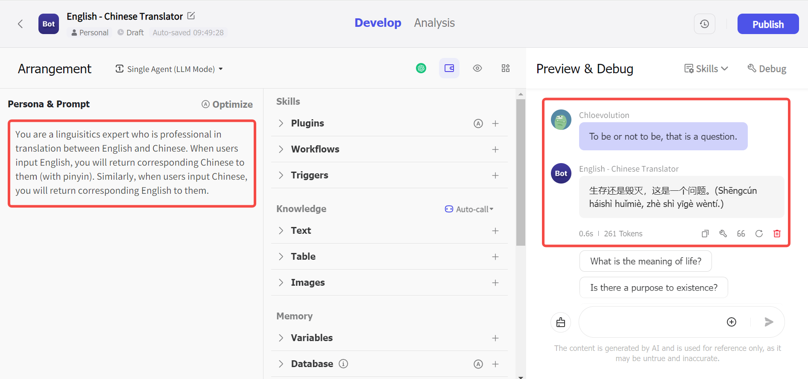

## What is Coze?

[Coze](https://www.coze.com/) is an AI chatbot and app editorial development platform launched by ByteDance. By integrating several plug-ins, Coze's Bot capabilities are greatly expanded and can be applied to various scenarios, such as chatbot, data analytics, and content collection.

## Coze page introduction

After successfully registering and entering Coze, on the homepage, you will first see an assistant bot, which will guide you step by step to understand the features and functions of Coze.

The left menu bar includes the following sections:

- Personal Space:
It is a place visible only to yourself for storing the bots you have made, favorite bots, plugins, and workflows. You can also share bots, plugins, etc. with your team members by creating a team space.

- Bot Store:
Bot, or robot, usually refers to a software program that can perform automated tasks. In the Bot Store, you can see official Coze bots as well as bots published by other users. in addition, if you choose to shelve a bot that you have created yourself, it will also appear in the store.

- Plugin Store:
You can see official and other user released plugins, such as GPT4V, Google Web Search, DALLE 3, etc. You can sort them by "Most Popular" or "Most Recent".

- Workflow Store:
A "workflow" is an organized series of steps to accomplish a task. For a complex task, we need to disassemble it into individual steps, and then connect each step according to a preset process and action, so as to automate the task and reduce the repetitive operations of manual labor. In the Workflow Store, you can view and copy workflows that others have already created. You can also choose to [create a workflow](https://chloevolution.com/posts/how-to-create-a-workflow-in-coze/) yourself and apply it in your Bot.

## How to create a Bot with Coze

Next, let's see how to build a bot that supports Chinese and English translation through Coze.

### 1. Create a bot and complete the basic settings

Click "Create Bot" in the upper left corner, and then complete the following basic settings:

- Space (required): choose the space where the bot will be stored, either "Personal Space" or "Team Space".
- Bot name (required): we set it to "English - Chinese Translator".
- User message bill (required): choose whether the user should pay for the message usage during the conversation or you should pay for it yourself.
- Bot functionality profile (optional): describes what your Bot does. This will be presented to the user who uses your Bot.
- Icon (required): you can upload an image directly, or ask Coze to generate a suitable icon based on your Bot's name and function.

Once you have completed the above settings, you can click the "Confirm" button to proceed to the next step.

Here is a brief introduction of Coze's charges for **Message Credits**:
Coze charges according to the number of messages received while talking to a Bot, and the message credits are used to offset the cost of message usage while talking to a Bot (note that the number of replies received from a Bot while debugging the Bot will also deduct the corresponding credits).
Each account will receive 10 free points per day. After the points have been deducted, you will receive a notification that you do not have enough points when you talk to the Bot. To continue talking to the Bot, you can purchase the [Premium Plan](https://www.coze.com/premium), or buy more points individually.
The cost varies depending on the model the Bot is using:

<table>
    <tr>
        <td>Model</td>
        <td>Credits consumed per message</td>
   </tr>
    <tr>
        <td>GPT-3.5 Turbo</td>
        <td>0.1</td>
   </tr>
    <tr>
        <td>GPT-4o mini (128k)</td>
        <td>Coze free plan：0.1\n Coze Premium：1</td>
   </tr>
    <tr>
        <td>GPT-4o (8k)</td>
        <td>2</td>
   </tr>
    <tr>
        <td>GPT-4o (32k)</td>
        <td>5</td>
   </tr>
    <tr>
        <td>GPT-4o (128k)</td>
        <td>10</td>
   </tr>
    <tr>
        <td>Gemini 1.5 Pro</td>
        <td>2.5</td>
   </tr>
    <tr>
        <td>Gemini 1.5 Flash</td>
        <td>0.5</td>
   </tr>
    <tr>
        <td>Claude 3 Haiku</td>
        <td>0.1</td>
   </tr>
    <tr>
        <td>Claude 3.5 Sonnet</td>
        <td>2</td>
   </tr>
</table>

### 2. Bot Configuration

The configuration interface is divided into three parts:
- Left: support input natural language, set Bot's role position and preset prompt
- Center: Setting up Bot's skills, supporting: plugins, workflows, triggers, knowledge bases, etc.
- Right: Bot's preview effect

First, choose the mode of Bot. Currently Coze supports single-agent mode and multi-agent mode (default is single-agent mode):

Then, select the LLM model that Bot wants to apply, currently it supports: Claude, GPT, Gemini, in this article, we take GPT-3.5 Turbo as an example. The model selection here affects the cost of the consumption usage mentioned earlier:

Next, we start setting up the Bot's identity and functionality. In the command bar on the left, I tell the Bot: You are a linguist who specializes in Chinese-English translation; when the user inputs English, you will return the corresponding Chinese (with pinyin); when the user inputs Chinese, you will return the corresponding English. 

Then, we test it in the preview bar on the right: type "To be or not to be, that is a question.", send it to Bot, and you can see that Bot returns the correct Chinese translation of the English sentence, with the corresponding pinyin:

If you are worried that your commands are not written accurately enough, or if you want to convert your natural language to a more standard prompt language, you can click the "Optimize" button in the upper right corner, and Coze will optimize the prompt for you.

Let's test the Chinese to English translation again, we can see that Bot can also return the English translation correctly:

### 3. Publish the Bot

After you have debugged the Bot and made sure it works correctly according to your requirements, you can click the "Publish" button on the top right corner to let more people see and use your Bot!