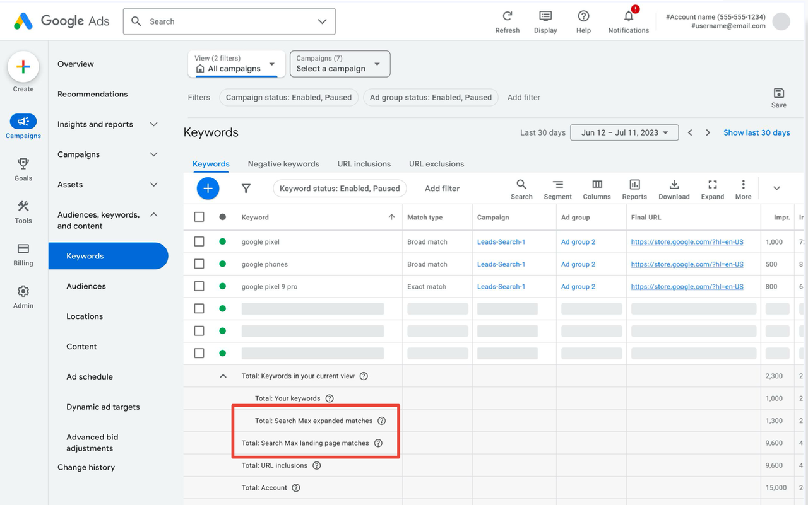
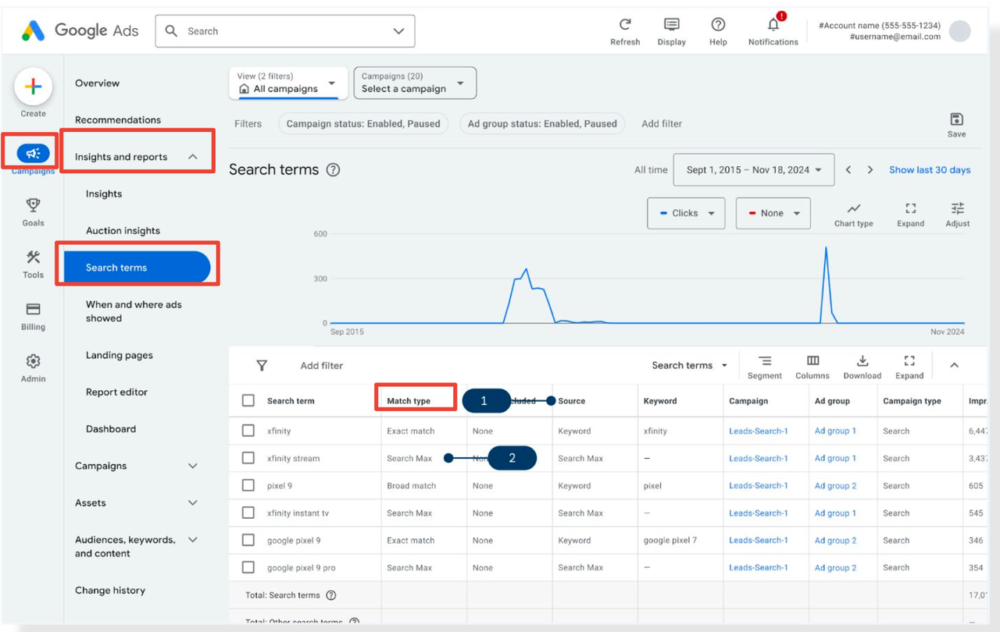

In Google Ads, AI Max is not a separate campaign type but a set of AI enhancements embedded within existing search ads. As a result, the methods for viewing data and analyzing performance are integrated into your Search campaign reports.

Once AI Max is enabled, advertisers are most concerned with performance: how do features like expanded keyword matching, automatically generated ad copy, and AI-selected landing pages impact traffic and conversions? In Google Ads, we can use several key reports to gain deeper insights into AI Max performance.

## Keywords Report

In the summary section of the Keywords Report, you will see a **Total** column:

Total: Campaign = Total: Keywords in your campaign + Total: AI Max landing page matches + Total: URL inclusions in your campaign

* **Total: Keywords in your campaign** = Your manually added keywords + AI Max expanded matches
* **AI Max expanded matches**: New matching keywords generated by AI based on your existing keywords
* **AI Max landing page matches**: Traffic triggered by search queries matching your landing pages or assets, outside of your original keyword list

> Example use case: For e-commerce advertisers, newly captured long-tail keywords can drive additional traffic from new customers without manually adding each search term.

## Search Term Report

In the Search Term view, the **Match Type** column now includes a new type: **AI Max**, in addition to the original Broad, Phrase, and Exact Match types.

* When the Match Type is AI Max, the **Source** field will indicate whether the traffic came from **Landing pages and URL inclusions** or **AI Max expanded matches**
* This allows you to quickly identify which traffic comes from AI-captured new search intents and which comes from landing page matches

Additionally, the Search Term Report now includes the **Search terms and landing pages from AI Max** view:

* You can see the **search term + ad headline + landing page combinations** after enabling AI Max
* Associated metrics include: Clicks, Impressions, Cost, Conversions, etc.

> Example use case: This view helps you identify which ad headline and landing page combinations perform well for new search terms, guiding optimization of creative and pages.

## Landing Pages Report

* Supports differentiation between **Automatically selected** and **Advertiser selected** landing pages
* Allows analysis of performance differences between AI-selected landing pages and manually provided landing pages

> Example use case: If AI-selected landing pages outperform manually set pages, you might consider applying elements from those pages to more ad groups.

## Assets Report

* Supports viewing **Expanded Final URL Assets**, i.e., AI Max-generated headlines and descriptions
* Allows analysis of performance metrics for AI-generated copy

> Example use case: By comparing CTR and conversions of AI-generated copy versus original copy, you can determine which headlines and descriptions better engage users and guide future creative optimization.
