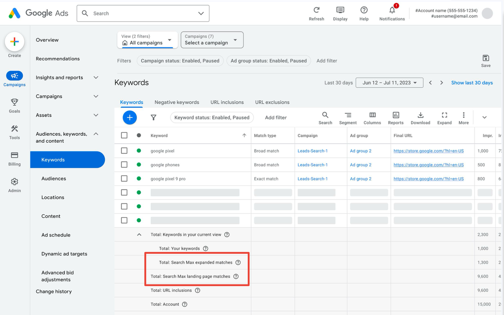
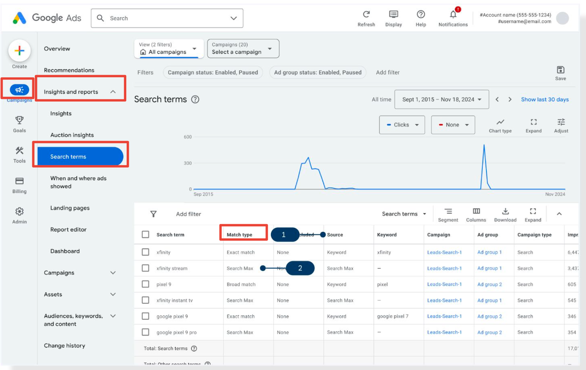
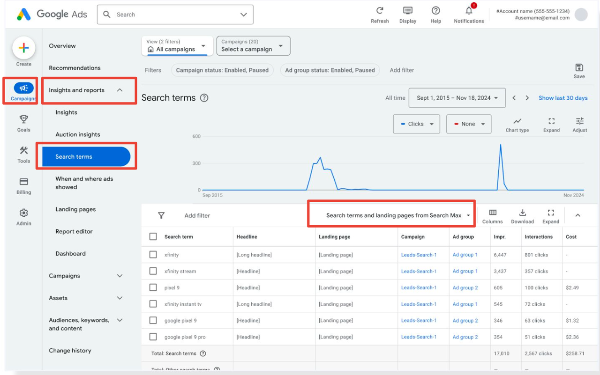
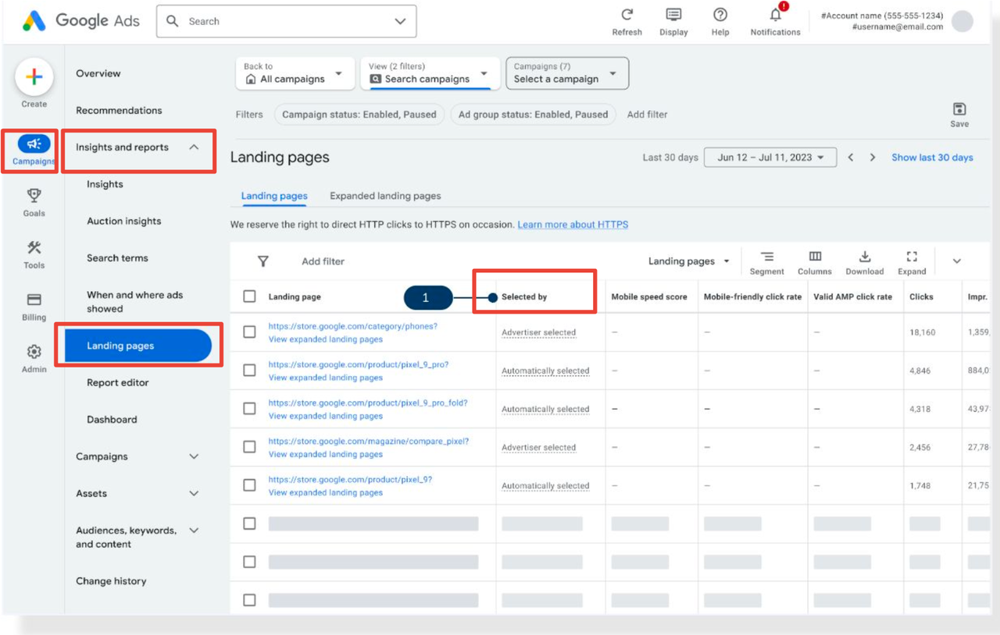
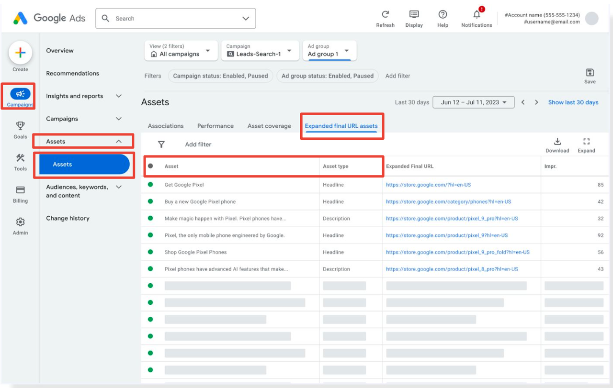

在 Google Ads 中，AI Max 并不是一个独立的广告系列类型，而是一组嵌入在现有搜索广告里的 AI 增强功能。因此，查看数据和分析表现的方法也会嵌入到 Search campaign 的报告里。

开启 AI Max 后，广告主最关心的就是效果：AI 拓展了关键词匹配、自动生成文案、选择落地页，这些功能到底带来了哪些流量和转化？在 Google Ads 中，我们可以通过几个关键报告来深入了解 AI Max 的表现。

## Keywords Report（关键词报告）

在 Keywords Report 的汇总数据部分，你会看到一个 Total 栏目：

Total: Campaign = Total: Keywords in your campaign + Total: AI Max landing page matches + Total: URL inclusions in your campaign

* **Total: Keywords in your campaign** = 你自己添加的关键词 + AI Max 拓展匹配的关键词（AI Max expanded matches）
* **AI Max expanded matches**：AI 根据已有关键词拓展出的新匹配词
* **AI Max landing page matches**：搜索词与落地页或素材匹配而触发的流量，不在原有关键词列表中

> 使用场景示例：如果你是电商广告主，新增的长尾关键词可能带来了更多新客户流量，而你无需手动添加每一个搜索词。

## Search Term Report（搜索词报告）

在 Search Term 视图中，Match Type 指标除了原有的 Broad / Phrase / Exact Match 外，新增了 **AI Max** 类型。

* 当 Match Type 是 AI Max 时，Source 会显示是 **Landing pages and URL inclusions** 还是 **AI Max expanded matches**
* 你可以快速识别哪些流量是 AI 帮你捕捉的新搜索意图，哪些是通过落地页带来的

此外，Search Term Report 还新增了 **Search terms and landing pages from AI Max** 视图：

* 可查看开启 AI Max 后的 **搜索字词 + 广告标题 + 落地页组合**
* 关联数据指标包括：点击量（Clicks）、展示量（Impressions）、花费（Cost）、转化（Conversions）等

> 使用场景示例：通过这个视图，你可以发现某些广告标题和落地页组合在新搜索词上的表现非常好，从而优化素材和页面。

## Landing Pages Report（落地页报告）

* 支持通过 **Automatically selected** 和 **Advertiser selected** 区分落地页来源
* 可以分析 AI 选择的落地页和你手动提供的落地页在转化上的差异

> 使用场景示例：如果 AI 自动选择的落地页表现优于手动设置的页面，你可以考虑将这些页面的元素推广到更多广告组。

## Assets Report（素材报告）

* 支持查看 **Expanded Final URL Assets**，即 AI Max 生成的标题和描述
* 可分析这些 AI 自动生成文案的曝光表现

> 使用场景示例：通过对比 AI 生成文案和原始文案的 CTR 和转化，你可以判断哪些标题和描述更吸引用户，指导后续创意优化。

