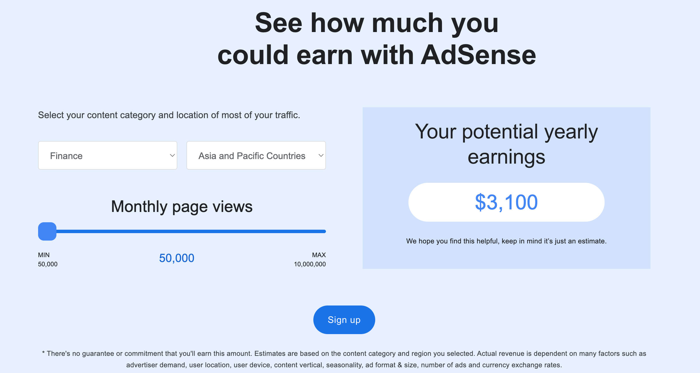
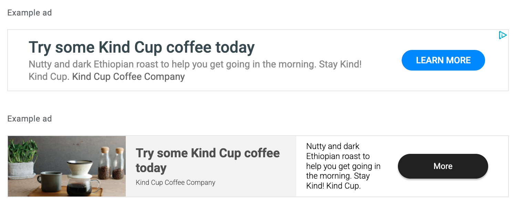
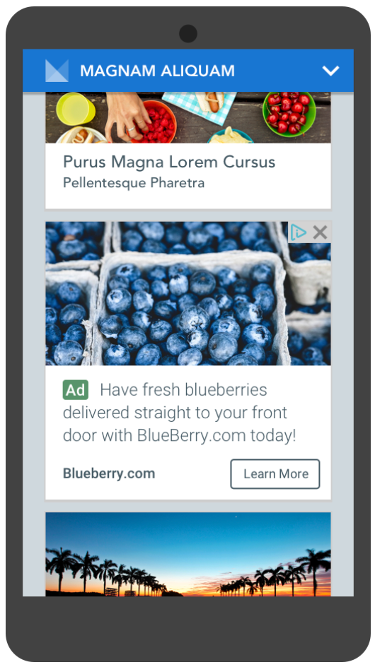
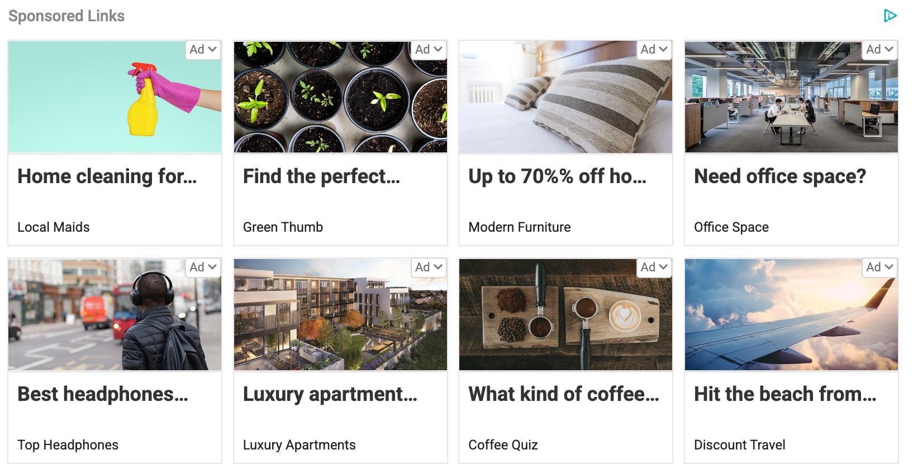
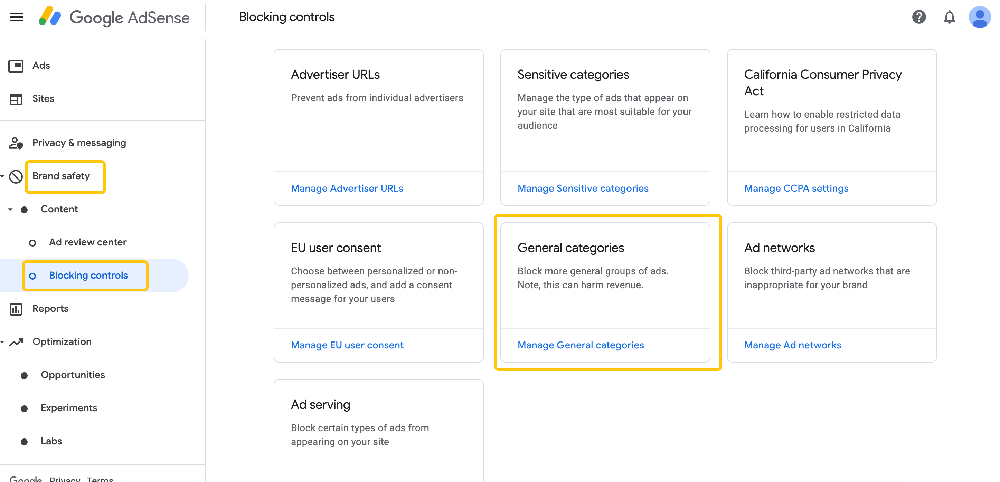

如果你已经按照[前一篇指南](https://chloevolution.com/zh-cn/posts/how-to-earn-money-with-adsense/)，顺利把 **Google AdSense** 广告放到了网站上，那么恭喜你——赚钱的第一步已经迈出！但很多新手网站主会发现，**流量来了，收入却不理想**。这时候，如何提升 AdSense 收入就成了关键。

## 理解 AdSense 收入机制

在优化收入之前，先弄清楚 **AdSense 是怎么赚钱的**非常重要。简而言之，你的网站流量和广告互动决定了收入，而广告收入主要由 **广告展示量（RPM）** 和 **广告点击量（CPC）** 两大来源构成。

### 广告收入的两个来源

| 收入类型             | 说明                          | 举例                                 |
| ---------------- | --------------------------- | ---------------------------------- |
| **RPM（每千次展示收入）** | 用户访问页面就等于浏览了一次广告。按每千次展示计算收入 | 如果 RPM 是 \$2，每 1000 次页面展示，你就能赚 \$2 |
| **CPC（按点击付费）**   | 用户点击广告所产生的收入                | 如果 CPC 是 \$0.5，用户点击一次广告，你就能赚 \$0.5 |

广告的总收益可以理解为：

**广告总收益 = （每千次展示收入 × 浏览次数 ÷ 1000）+（每次点击收入 × 点击次数）**

也就是说，网站流量越高，广告展示次数和点击次数越多，收入也就越高。

### 关键指标：CTR 和 RPM

* **CTR（点击率）**：点击次数 ÷ 广告展示次数

  * CTR 越高，意味着广告更吸引访客，CPC 收入潜力更大。
* **RPM（每千次展示收入）**：每千次广告展示的平均收入

  * RPM 可以帮助你衡量整体收入效率，不仅取决于流量，还受广告单价影响。

这两个指标相辅相成：CTR 决定点击收益，RPM 决定展示收益，它们共同影响你的网站整体收入表现。

### 广告单价受地区和行业影响

广告单价（RPM 和 CPC）不是固定的，它主要取决于网站的 **行业类型** 和 **访客地区**：

### 高收益国家

| 排名 | 国家    | 平均 CPC（美元） | CTR（点击率） | 官方语言    | 第二语言  |
| -- | ----- | ---------- | -------- | ------- | ----- |
| 1  | 冰岛    | \$0.83     | 0.55%    | 冰岛语     | 英语    |
| 2  | 阿尔巴尼亚 | \$0.65     | 未提供      | 阿尔巴尼亚语  | 英语    |
| 3  | 卢森堡   | \$0.65     | 0.55%    | 卢森堡语、法语 | 德语、英语 |
| 4  | 美国    | \$0.61     | 0.75%    | 英语      | 西班牙语  |
| 5  | 澳大利亚  | \$0.57     | 0.72%    | 英语      | 未提供   |

数据来源：[World Population Review](https://worldpopulationreview.com/country-rankings/adsense-cpc-rates-by-country)

### 高收益行业

| 排名 | 行业    | 平均 RPM（美元） | 话题举例              |
| -- | ----- | ---------- | ----------------- |
| 1  | 金融    | \$20–\$50  | 个人贷款、信用卡、保险       |
| 2  | 房地产   | \$20–\$40  | 房产列表、市场趋势、投资建议    |
| 3  | 法律服务  | \$20–\$50  | 个人伤害法、法律咨询        |
| 4  | 技术与软件 | \$15–\$40  | SaaS 工具、软件评测、科技产品 |
| 5  | 教育    | \$10–\$30  | 在线课程、认证、教育资源      |

数据来源：[Ranktracker](https://www.ranktracker.com/blog/which-niches-have-the-highest-rpm-in-adsense)

💡 要提高 AdSense 收入，既可以从**增加流量**入手，也可以从**优化网站行业定位和目标用户地区**来提升广告单价。

Google官方也提供了[收入计算器](https://adsense.google.com/intl/en_us/start/)，你可以通过选择行业和位置来估算可能获得的收入：

## AdSense 广告类型介绍

在提升 AdSense 收入之前，先了解不同的广告类型非常重要。不同类型的广告在展示方式、位置和收入潜力上都有所差异，选择合适的广告类型可以帮助你更高效地变现：

### Display Ads（展示广告）
展示广告可以是方形、横幅或竖幅广告。它们会自动调整大小以适应网页显示区域，同时也可以设置固定尺寸，以保持特定布局。展示广告适合放在侧边栏、页脚或文章段落之间。无论是桌面端还是移动端，这类广告都能保持良好的视觉效果和功能性，是最常见、易上手的广告类型。

### In-Feed Ads（信息流广告）
信息流广告是原生广告，嵌入在文章列表或产品列表中，与周围内容的风格一致，因此用户体验更佳。它们在移动端尤其有效，可以自然融入列表或内容流，不打扰用户浏览。信息流广告可以自定义样式，使其与网站整体设计协调，既美观又实用。

### In-Article Ads（文章内广告）
文章内广告也是原生广告，通常放置在文章段落之间，能与文章内容自然融合。它们会根据文本流自动调整大小和布局，适合桌面和移动端阅读。这类广告在长篇内容中效果显著，既不干扰阅读，又提供良好的变现机会。

### Multiplex Ads（多重广告）
多重广告在一个广告单元内展示多个广告块，通常以网格形式排列，可以横向或纵向显示。它们适合文章结尾或侧边栏等位置，能集中吸引已经阅读内容的用户注意力。多重广告同样可以自定义样式，与网站整体设计保持一致，是展示多条广告、提升曝光量的有效方式。

💡 **小提示**：

* 对新手来说，先使用 **Display Ads** 和 **In-Article Ads**，操作简单，收益稳定。
* **In-Feed Ads** 适合内容列表丰富的页面。
* **Multiplex Ads** 最适合高流量页面，通过集中展示广告提高点击和收益。

## 广告布局与位置优化

广告的展示位置和布局对收入有直接影响。合理的广告布局可以提高广告的点击率（CTR）和曝光量，同时保持用户体验。

### 1. 结合内容自然放置广告

* **Display Ads**：适合放在网页侧边栏、页脚或文章段落之间。横向广告适合文章底部，方形广告适合侧边栏。
* **In-Feed Ads**：嵌入在文章列表或产品列表中，和内容风格一致，用户在浏览列表时自然看到广告。
* **In-Article Ads**：放在文章正文段落之间，建议每篇文章放 1-2 个，避免干扰阅读。
* **Multiplex Ads**：适合文章结尾或侧边栏，可展示多个广告，提高广告曝光量。

### 2. 保持页面清爽，不堆叠广告

* 广告数量过多可能导致页面加载变慢，影响用户体验和 SEO 排名。
* Google 对页面体验也有评分，过度堆砌广告可能被处罚或降低收入潜力。

### 3. 优先展示高收益广告

* 使用自动广告（Auto Ads）功能，可以让 Google 根据用户行为和页面布局智能分配广告类型和位置。
* 结合手动广告位布局，确保高流量页面的广告展示在最佳位置，如文章开头、正文中间或结尾。

### 4. 测试不同位置和格式

* 尝试不同广告类型、尺寸和位置组合，观察 CTR 和 RPM 的变化。
* 定期分析后台数据，找出表现最好的广告组合并优化其他页面。
对于位置占据过大，可能影响用户阅读的体验的广告类型，可以手动进行屏蔽：

### 5. 移动端优化广告布局

* 确保广告在移动端不会遮挡内容或破坏排版。
* 横幅广告和 In-Feed Ads 在手机屏幕上表现良好，可提高点击率。

💡 **小技巧**：合理间隔广告与内容，避免干扰用户阅读，同时让广告在自然浏览流程中出现，既提升体验又增加收益。

## 常见误区与注意事项

在使用 AdSense 过程中，有一些常见误区和需要特别注意的事项。如果不小心触碰违规规则，可能会导致收入损失甚至账户被封禁。

### 1. 避免诱导点击或作弊行为

* **不要诱导用户点击广告**：比如“点击这里赚钱”或“支持本站广告”等文字或弹窗，都属于违规行为。
* **不要使用自动点击工具**：任何试图增加点击量的脚本、插件或服务都是严格禁止的。
* **保持点击自然**：AdSense 收入应来源于用户真实兴趣，而不是人为操作。

### 2. 不要堆砌广告，保持用户体验

* 广告过多会破坏页面布局，导致访问者流失。
* 谨慎设置广告数量和位置，确保内容仍然清晰、易读。
* 优先考虑广告类型与页面内容匹配度，例如在文章段落之间使用 In-Article Ads，而不是塞满整个页面。

### 3. 定期检查网站合规性

* 定期审查网站内容，确保没有涉及成人、赌博、非法下载等违规主题。
* 检查广告显示情况，确认广告代码未被篡改或失效。
* 留意 AdSense 后台的 Policy Center 提示，及时处理潜在违规问题，避免收入受影响。

