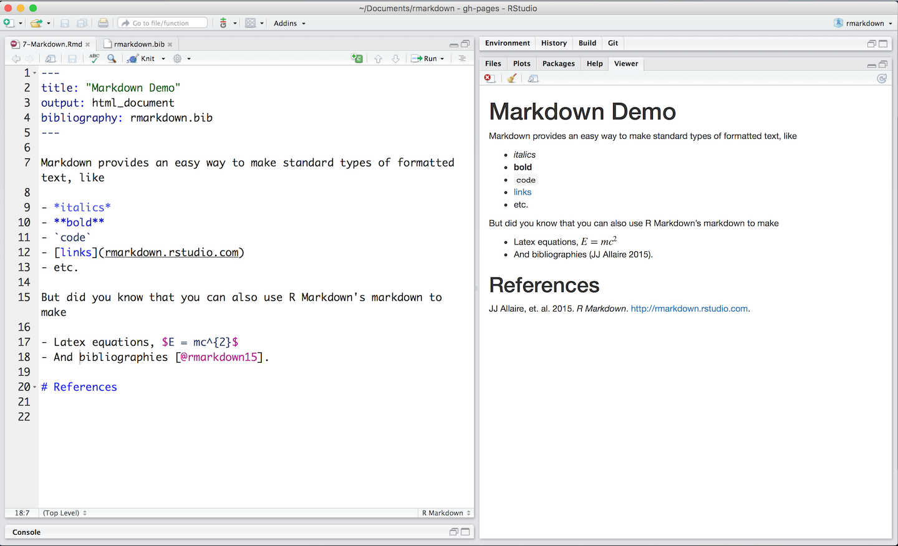
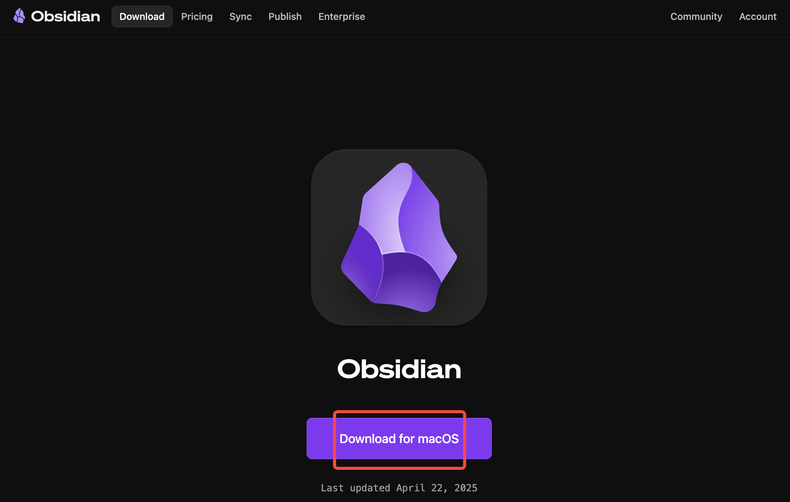
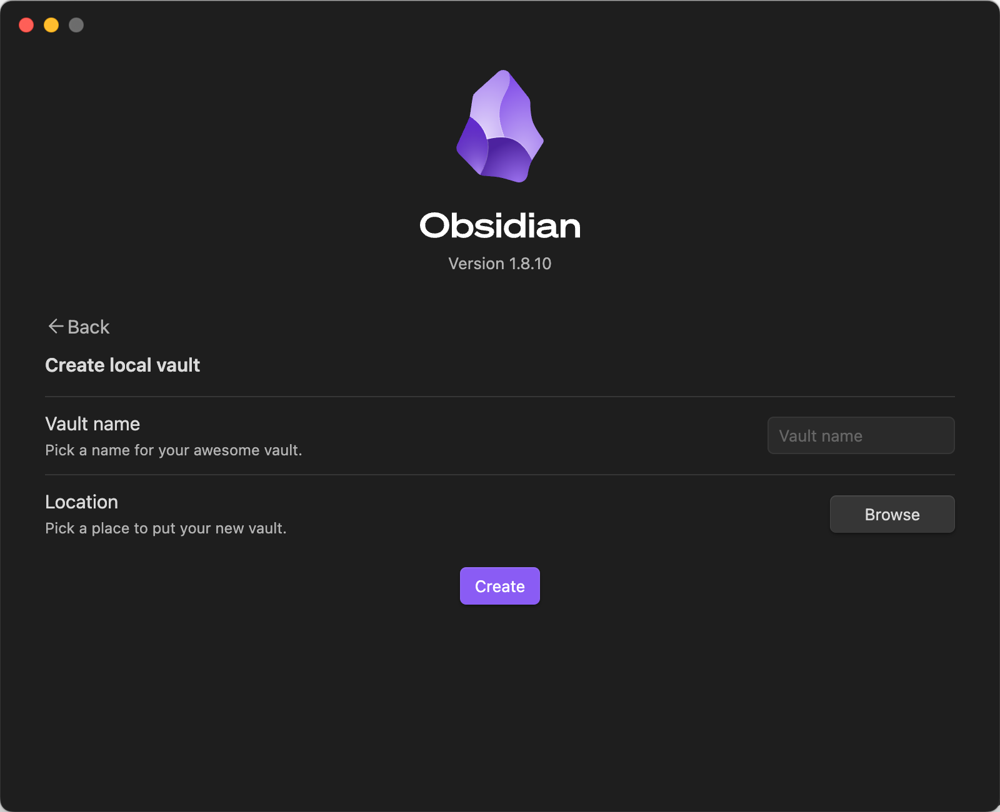

In the era of information overload, more and more people are realizing that organizing and consolidating knowledge is more important than acquiring it. [Obsidian](https://obsidian.md/), a note-taking app focused on **local knowledge management**, has rapidly gained popularity among productivity enthusiasts and knowledge workers in recent years. It is not just another cloud-based note-taking tool but a "second brain" system that emphasizes **local storage, Markdown formatting, and linked thinking**.

## The Core Philosophy of Obsidian

At its core, Obsidian is about building a knowledge network that you control. Unlike traditional linear note-taking, Obsidian advocates for **nonlinear linked notes**. By linking different notes, you can create a multidimensional, interconnected knowledge graph.

Its design is partly inspired by the Zettelkasten (slip-box) method, encouraging users to record atomic units of information and naturally organize them into a network structure through bidirectional links (backlinks).

## Key Features of Obsidian

### 1. Local Markdown Editing

Every note in Obsidian is saved as a local `.md` file. This means you have complete control over your data, with no reliance on the cloud. Notes can be version-controlled, encrypted, synced, or even opened with other Markdown editors.

Markdown is a lightweight markup language designed to make it easier for humans to read and write formatted text while also being convertible to well-structured HTML (web language). Its syntax is simple and intuitive, requiring no complex formatting operations, making it ideal for writing notes, documentation, blogs, or even books.



### 2. Bidirectional Linking and Backlinks

In your notes, you can quickly reference other notes using `[[Note Title]]`. Obsidian automatically generates a "reference record" in the linked note. This greatly enhances the connectivity between notes, fostering the organic growth of your knowledge network.

### 3. Graph View

The Graph View visually displays the connections between all your notes. This view isn't just aesthetically pleasing—it helps you identify missing knowledge nodes and potential connections.

### 4. Plugin Ecosystem

Obsidian offers a rich plugin interface, with both official and community-contributed plugins. Whether you need task management, calendars, Kanban boards, full-text search, highlighting, or writing aids, you'll find a plugin to suit your needs.

### 5. Offline-First, Privacy-Focused

All of Obsidian's features work locally, meaning you can use it without an internet connection. For users who prioritize data security and privacy, this is a highly attractive feature.

## Who Is Obsidian For?

* Students and researchers looking to systematically organize knowledge
* Content creators building personal knowledge bases
* Programmers and writers who prefer Markdown
* Users who value privacy and data sovereignty
* Those seeking a local alternative to cloud-based note-taking tools like Notion or Evernote

## How to Install Obsidian?
Based on your computer's operating system, visit the [Obsidian website](https://help.obsidian.md/install) to download the appropriate version by clicking "Download":


After installation, open Obsidian. You'll see the following three options:


This is Obsidian's prompt for "how to get started" upon first launch. In simple terms, a **Vault is your note repository**, corresponding to a local folder where all your Markdown (`.md`) files are stored:

### 1. Create a New Vault

**Meaning**: Start from scratch by creating a new note folder. Obsidian will manage all your notes in that folder.

**Ideal for**:
* First-time Obsidian users
* Those who want a clean, independent note space (e.g., "Work Notes" or "Study Notes")

### 2. Open Folder as Vault

**Meaning**: You already have a folder containing Markdown files and want to use it directly as your Obsidian vault.

**Ideal for**:
* Users who previously stored `.md` files locally with other tools
* Those who don't want to move or copy existing content and prefer to manage it in place

### 3. Open Vault from Obsidian Sync

**Meaning**: You've used Obsidian Sync (Obsidian's paid sync feature) on another device and want to pull that synced vault onto your current machine.

**Ideal for**:
* Users who have subscribed to Obsidian Sync
* Those who sync data across multiple devices

**If you haven't subscribed to Sync**, you can ignore this option.

Since this is my first time using Obsidian, I'll create a new note folder by naming it and selecting a storage location:


## Basic Obsidian Interface Structure


After opening a vault, Obsidian's interface is divided into the following areas:

### 1. Left Sidebar (Side Pane)

This is your primary navigation area. You can toggle its visibility using the icon in the top-left corner.

Common modules include:
* **File Explorer**: Displays all your notes and folders. Here, you can create new notes or folders, rename, move items, etc.
* **Search**: Supports full-text search. Enter keywords to find matches across all notes.
* **Tags** (visible if you use tags): Shows all tags used in your notes. Click to view all notes with a specific tag.
* **Backlinks**: Displays which notes "mention the current note," helping you build connections.
* **Graph View**: Visualizes links between notes. Beginners can explore this feature later.

You can manage plugins, themes, and extensions by clicking the icons in the bottom-left corner.

### 2. Central Editing Area (Main Editor)

This is the main workspace for writing and reading notes. You can:
* Double-click to open any note
* Open multiple notes simultaneously (as tabs or split views)
* "Pin" important notes using the pin icon in the top-right corner
* Switch viewing modes (reading, editing, split view, etc.) in the top title bar

### 3. Right Sidebar

Similar to the left sidebar, the right sidebar can display:
* Backlinks for the current note
* Plugin extensions (e.g., calendar, tasks)

### 4. Bottom Status Bar

The gray bar at the bottom shows the current mode (editing/reading), word count, cursor position, and other information.

## How to Start Using Obsidian
### Creating Your First Note

Let’s create a new note and add content:

1. **Click the "New Note" Button**
   In the left sidebar, click the "paper +" icon (hovering shows `New note`).


2. **Name Your Note**
   The system auto-generates a name like "Untitled." Change it to `My First Note.md` and press Enter.

3. **Start Editing**
   You can now edit the note content. If you find you can only edit the title but not the body, check the top-right corner for a "pencil" or "book" icon, representing "edit" and "reading" modes, respectively. In "reading" mode, you can't edit—click to switch:
   
   
   Start typing:

   ```
   My First Note

   Today, I started using Obsidian. This is my first note.
   ```

   Notes save automatically—no manual saving required. Your first note is complete!
   

### Trying Bidirectional Linking

#### What Are Bidirectional Links?
First, let’s understand the concept of bidirectional links in Obsidian:
Bidirectional links (**Backlinks**) are one of Obsidian's most core and valuable features. Their significance lies in:

> **Not only can you "reference" other notes, but Obsidian also automatically shows you "which notes mention the current one."**

This "mutual awareness" is what sets Obsidian apart from traditional note-taking tools:
You don’t manually organize structure—notes "build networks" on their own.

For example, suppose you have two notes:
* Note A: `What is Markdown?`
* Note B: `Obsidian Features Overview`

In Note B, you write:

```
Obsidian supports [[What is Markdown?]] format.
```

What did you do? You **linked Note A in Note B**.

Obsidian automatically displays a "backlink" in Note A:

> "This note is referenced by **Obsidian Features Overview**."

Compare "forward links" and "backlinks":

| Type       | Concept                          | Example               |
| ---------- | -------------------------------- | --------------------- |
| Forward Link | Manually linking another note with `[[ ]]` | In B, type `[[A]]`    |
| Backlink   | Obsidian shows you which notes mention this one | In A, see: "Referenced by B" |

In other words:
* Forward links are you saying, "I reference who"
* Backlinks are the system telling you, "Who references me"

#### Why Are Bidirectional Links Important?

Traditional notes are tree-structured (category → subcategory → file), which easily becomes messy.

Obsidian’s bidirectional links let you build a **networked knowledge structure**, where notes freely connect and cross-reference. This helps you:
* String ideas together
* Rediscover forgotten content
* Build your "second brain"

#### How to View Backlinks in Obsidian?

When you open a note:
* In the bottom-right or right sidebar, there’s a "Backlinks" panel
* It shows "which notes mention this one"
* You can click these notes to quickly jump to their context

In summary:

> **Bidirectional links = Automatically building a knowledge network, no longer taking isolated notes, but letting information interconnect to form a system.**

#### How to Create Bidirectional Links

Let’s try a simple demo:

1. **Create Another New Note**
   Follow the earlier steps to create a note named `Study Plan`

2. **Add the Following Content**:

   ```
   I’ll start planning based on the content of [[My First Note]].
   ```

Now, you’ll see "My First Note" highlighted and clickable. In the right panel, you’ll see a line connecting "Study Plan" and "My First Note":


In the link view, you can also see "Study Plan" linking to "My First Note":


"My First Note" has a backlink from "Study Plan":


3. **Click `[[My First Note]]`**
   You’ll jump to that note.

Now you’ve built a bidirectional link structure, where notes can jump between each other like web pages and automatically track references.

The first time you open Obsidian, it might feel empty, but once you get used to linking notes, it becomes increasingly engaging. Next, I’ll cover more practical uses, like plugin recommendations, search tips, and daily writing organization. If you’re also using Obsidian, let’s explore it together.