在信息爆炸的时代，越来越多的人意识到知识的整理与沉淀比获取更重要。[Obsidian](https://obsidian.md/)，作为一款专注于**本地知识管理**的笔记软件，近年来在生产力爱好者和知识工作者之间迅速走红。它不是又一个云笔记工具，而是一个强调**本地存储、Markdown 格式、链接思维**的“第二大脑”系统。

## Obsidian的核心理念

Obsidian的核心在于构建一个由你自己掌控的知识网络。与传统的线性笔记不同，Obsidian倡导的是**非线性链接笔记**。通过链接不同的笔记，你可以构建出一个多维度、相互关联的知识图谱。

其设计灵感部分来源于Zettelkasten（卡片盒笔记法），鼓励用户记录原子化的信息单元，并通过双向链接（Backlink）将它们自然组织成网络结构。

## Obsidian主要功能

### 1. 本地 Markdown 编辑

Obsidian的每一条笔记都是保存在本地的 `.md` 文件。这意味着你完全掌握自己的数据，不依赖云端。笔记可被任意版本控制、加密、同步，甚至用其他Markdown编辑器打开。

Markdown是一种轻量级标记语言，它的设计初衷是：让人类更容易阅读和编写格式化的文本，同时也能被转换成结构良好的 HTML（网页语言）。它的语法简单、直观，不需要复杂的排版操作，特别适合写笔记、写文档、写博客、甚至写书。

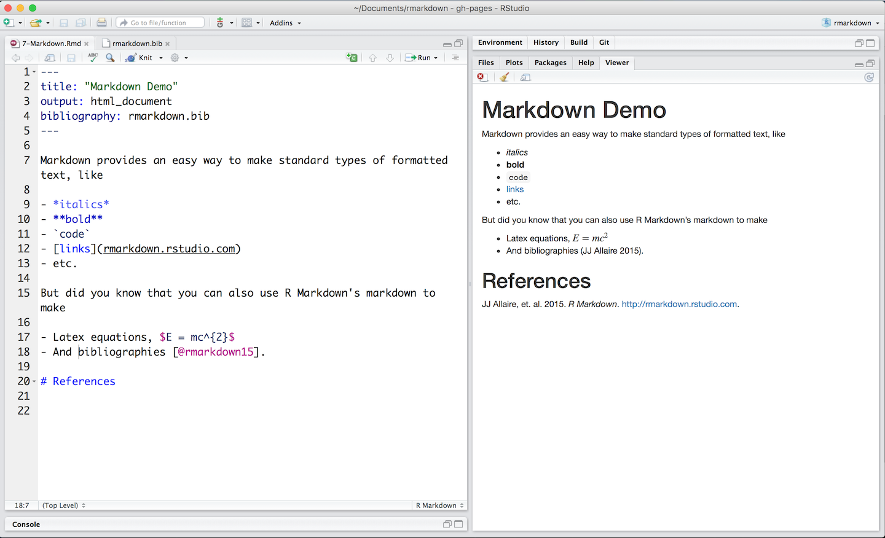

### 2. 双向链接与反向引用

在笔记中，你可以通过 `[[笔记标题]]` 的方式快速引用其他笔记。而Obsidian会自动在被引用的笔记中生成“被引用记录”。这种方式大大增强了笔记之间的关联性，促进知识网络的自然生长。

### 3. 图谱视图（Graph View）

图谱视图可以直观展示你所有笔记之间的连接关系。这种视图不仅好看，更重要的是可以帮助你发现遗漏的知识节点和潜在的连接。

### 4. 插件生态

Obsidian 提供了丰富的插件接口，官方和社区都贡献了大量高质量的插件。无论是任务管理、日历、看板，还是全文搜索、高亮阅读、写作辅助，你都能找到对应的扩展工具。

### 5. 离线优先，隐私至上

Obsidian的所有功能在本地运行，即使完全断网也不会影响使用。对于注重数据安全和隐私的用户，这是一项极具吸引力的特性。

## Obsidian适合谁？

* 想系统整理知识的学生与研究者
* 需要构建个人知识库的内容创作者
* 习惯用 Markdown 写作的程序员与写作者
* 重视隐私和数据主权的用户
* 正在寻找 Notion、Evernote 等云笔记工具的本地替代方案的人

## 如何安装Obsidian？

### 第一步：下载 Obsidian

根据电脑的系统版本，在[Obsidian官网](https://help.obsidian.md/install)选择适合自己的软件版本，点击”Download”即可下载：
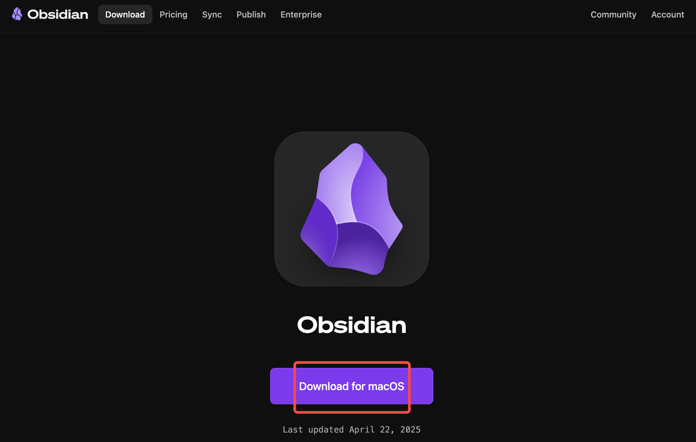

Obsidian 支持 **Windows**、**macOS**、**Linux** 三大桌面平台，以及 **iOS** 和 **Android** 移动平台。下面我们详细介绍 macOS 的安装步骤，其他平台用户可参考官方文档。

### 第二步：macOS 详细安装步骤

#### 1. 选择正确的安装包

下载页面会根据你的系统自动推荐版本，但你也需要确认：

- **Apple Silicon (M1/M2/M3/M4 芯片)**：选择 “Apple Silicon” 版本
- **Intel 芯片**：选择 “Intel” 版本

如果不确定自己的 Mac 是什么芯片，可以点击屏幕左上角的  图标 → “关于本机” → 查看”芯片”或”处理器”信息。

下载后会得到一个 `.dmg` 文件（例如 `Obsidian-1.x.x-arm64.dmg`）。

#### 2. 安装到 Applications 文件夹

1. **双击下载的 `.dmg` 文件**  
   系统会挂载磁盘镜像，并弹出一个安装窗口。

2. **拖动 Obsidian 图标到 Applications 文件夹**  
   按照窗口提示，将 Obsidian 图标拖动到右侧的 Applications 文件夹图标上。

3. **等待复制完成**  
   系统会自动将 Obsidian 复制到 `/Applications/Obsidian.app`，这是 macOS 应用程序的标准安装位置。

4. **推出磁盘镜像**  
   复制完成后，可以右键点击桌面上的 Obsidian 磁盘图标，选择”推出”。

#### 3. 首次启动与权限设置

1. **打开 Obsidian**  
   你可以通过以下任一方式启动：
   - 在 **Launchpad** 中找到 Obsidian 图标并点击
   - 在 **Finder → 应用程序** 中找到 Obsidian 并双击
   - 使用 **Spotlight 搜索**（按 `Cmd + 空格`，输入 “Obsidian”）

2. **处理”无法验证开发者”提示**  
   首次打开时，macOS 可能会提示：”无法打开 Obsidian，因为无法验证开发者。”
   
   **解决方法**：
   - 点击”取消”
   - 打开”系统设置” → “隐私与安全性”
   - 滚动到底部，会看到关于 Obsidian 的提示
   - 点击”仍要打开”按钮
   - 在弹出的确认对话框中点击”打开”

3. **授予必要的权限**  
   Obsidian 可能会请求以下权限：
   - **文件和文件夹访问权限**：这是必需的，因为 Obsidian 需要读写你的笔记文件
   - **通知权限**（可选）：用于提醒和插件通知
   
   建议授予这些权限以获得完整体验。

#### 4. Vault 数据存储位置建议

Obsidian 本身安装在 `/Applications` 文件夹，但你的**笔记数据（Vault）可以存储在任何位置**。

推荐的存储位置：

| 存储位置 | 优点 | 适合场景 |
|---------|------|---------|
| `~/Documents/Obsidian` | 本地存储，访问快速 | 单机使用，不需要同步 |
| `~/Library/Mobile Documents/iCloud~md~obsidian/` | iCloud 自动同步 | 多台苹果设备间同步 |
| `~/Dropbox/Obsidian` | Dropbox 同步 | 跨平台同步（Mac/Windows/Linux） |
| 外置硬盘/U盘 | 便携式使用 | 需要在不同电脑间移动笔记 |

**注意**：Vault 位置是在创建笔记库时选择的，后续也可以更改。

### 其他平台安装说明

#### Windows 用户

Windows 版本提供两种安装方式：

- **为当前用户安装**（User Installer）：安装到 `%AppData%\Local\Obsidian`，不需要管理员权限
- **为所有用户安装**（System Installer）：安装到 `C:\Program Files\Obsidian`，需要管理员权限

下载 `.exe` 安装程序后，双击运行并按照向导完成安装。

**通过包管理器安装**（可选）：
```powershell
# 使用 Scoop
scoop bucket add extras
scoop install obsidian

# 使用 Chocolatey
choco install obsidian
```

#### Linux 用户

Linux 支持多种安装方式：

- **AppImage**：下载后添加执行权限即可运行，无需安装
- **Snap**：`sudo snap install obsidian --classic`
- **Flatpak**：`flatpak install flathub md.obsidian.Obsidian`

详细步骤可参考 [Obsidian 官方安装文档](https://help.obsidian.md/Getting+started/Download+and+install+Obsidian)。

### 安装类型和位置选择详解

在安装 Obsidian 之前，了解不同的安装选项可以帮助你做出最适合自己需求的选择。

#### 1. 安装类型对比（Windows 用户）

Windows 版本的 Obsidian 提供两种安装类型，它们的主要区别如下：

| 对比项 | User Install（用户安装） | Install for All Users（所有用户安装） |
|-------|----------------------|--------------------------------|
| **安装位置** | `%AppData%\Local\Obsidian` | `C:\Program Files\Obsidian` |
| **管理员权限** | ❌ 不需要 | ✅ 需要 |
| **可用范围** | 仅当前 Windows 用户可用 | 该电脑所有 Windows 用户都可用 |
| **适用场景** | 个人电脑、公司受限电脑 | 家庭共享电脑、多用户环境 |
| **更新权限** | 当前用户可自行更新 | 需要管理员权限才能更新 |

**推荐选择**：
- **个人电脑或没有管理员权限的工作电脑**：选择 **User Install**
- **需要多人共享使用的电脑**：选择 **Install for All Users**

#### 2. 默认安装路径

不同平台的 Obsidian **应用程序**默认安装在以下位置：

| 平台 | 默认安装路径 |
|------|-------------|
| **Windows (User Install)** | `C:\Users\你的用户名\AppData\Local\Obsidian\` |
| **Windows (All Users)** | `C:\Program Files\Obsidian\` |
| **macOS** | `/Applications/Obsidian.app` |
| **Linux (AppImage)** | 无需安装，可放在任意位置 |
| **Linux (Snap)** | `/snap/obsidian/` |

**重要提示**：
- 上述路径是 **Obsidian 应用程序本身**的安装位置
- 你的**笔记数据（Vault）**是单独存储的，可以放在任何你想要的位置
- 两者是完全分离的，这也是 Obsidian 设计的核心理念之一

#### 3. 能否自定义安装位置？

**应用程序安装位置**：

- **Windows**：在安装向导中，部分安装程序允许选择自定义路径，但大多数情况下使用默认路径即可
- **macOS**：应用程序必须安装在 `/Applications` 文件夹中（这是 macOS 的标准做法）
- **Linux (AppImage)**：可以放在任意位置，因为 AppImage 是便携式的

**Vault（笔记库）存储位置**：

✅ **完全自由选择！** 你可以将 Vault 创建在：
- 系统盘的任意文件夹
- 外置硬盘
- 网络驱动器（不推荐，可能影响性能）
- 云同步文件夹（Dropbox、iCloud、OneDrive 等）

#### 4. 便携式安装：能否安装到移动硬盘/U盘？

如果你需要在不同电脑间携带 Obsidian 和你的笔记，有以下几种方案：

**方案一：仅携带 Vault（推荐）**
- **做法**：将 Vault 文件夹放在移动硬盘/U盘上
- **使用**：在每台电脑上正常安装 Obsidian，然后打开移动设备上的 Vault
- **优点**：简单可靠，性能好
- **缺点**：需要在每台电脑上安装 Obsidian 应用

**方案二：便携式应用 + Vault（完全便携）**
- **Windows**：
  - 下载 Windows 的便携版（可从第三方渠道获取，官方不直接提供）
  - 或使用 User Install 后复制整个 Obsidian 文件夹到 U盘
- **macOS**：
  - 将 `/Applications/Obsidian.app` 复制到移动硬盘
  - Vault 也放在移动硬盘上
  - ⚠️ 注意：在其他 Mac 上首次运行可能需要处理安全权限
- **Linux (AppImage)**：
  - 直接将 AppImage 文件和 Vault 一起放在移动硬盘
  - 这是最理想的便携式方案

**方案三：云同步（最省心）**
- 使用 Dropbox、iCloud Drive、OneDrive 等云服务同步 Vault
- 在每台设备上安装 Obsidian，指向云同步文件夹
- 无需物理移动存储设备

**⚠️ U盘使用注意事项**：
- 使用 **U盘** 时，Obsidian 的性能可能会受影响（尤其是 USB 2.0）
- 推荐使用 **USB 3.0+ 移动固态硬盘**以获得更好体验
- 定期备份！移动存储设备有丢失和损坏风险

#### 5. 是否需要管理员权限？

| 平台 | 是否需要管理员权限 | 说明 |
|------|------------------|------|
| **Windows (User Install)** | ❌ 不需要 | 安装到当前用户目录 |
| **Windows (All Users)** | ✅ 需要 | 安装到 Program Files 需要管理员权限 |
| **macOS** | ❌ 不需要 | 拖拽到 Applications 不需要管理员密码 |
| **Linux** | 看情况 | AppImage 不需要；Snap/Flatpak 可能需要 sudo |

**在受限环境中使用 Obsidian**：

如果你在公司或学校电脑上没有管理员权限：

1. **Windows**：选择 User Install 版本，安装到用户目录
2. **macOS**：通常不会遇到权限问题
3. **备选方案**：使用 AppImage（Linux）或便携版，直接从 U盘运行

**常见问题**：

> **Q: 我在大学电脑上无法安装 Obsidian，怎么办？**  
> A: 尝试以下方法：
> - 下载 User Install 版本（不需要管理员权限）
> - 使用便携版，从 U盘运行
> - 联系 IT 部门申请安装权限
> - 使用个人笔记本电脑

> **Q: Vault 应该放在哪里最好？**  
> A: 取决于你的需求：
> - **单机使用**：`~/Documents/Obsidian`
> - **多设备同步**：iCloud、Dropbox 等云同步文件夹
> - **隐私优先**：加密的外置硬盘
> - **团队协作**：共享网络驱动器（需要注意同步冲突问题）

### 常见安装问题解决

在安装 Obsidian 的过程中，用户可能会遇到一些问题。以下是常见问题及其解决方案。

#### 问题 1：Windows 10 无法安装 Obsidian

**症状**：
- 双击安装程序后没有反应
- 安装程序闪退或报错
- 提示"无法运行此应用"或"此应用无法在你的电脑上运行"

**可能的原因及解决方案**：

**原因一：系统权限不足**
- **解决方法**：
  1. 下载 **User Install 版本**而非 System Install 版本
  2. 右键点击安装程序 → 选择"以管理员身份运行"
  3. 如果公司/学校电脑限制安装，尝试使用便携版或从 U盘运行

**原因二：Windows Defender 或杀毒软件拦截**
- **解决方法**：
  1. 暂时禁用 Windows Defender 或杀毒软件
  2. 将 Obsidian 安装程序添加到白名单
  3. 从官方网站重新下载安装程序（确保文件完整性）

**原因三：系统版本过旧**
- **解决方法**：
  1. 检查你的 Windows 10 版本（设置 → 系统 → 关于）
  2. Obsidian 需要 Windows 10 版本 1809 或更高
  3. 更新 Windows 系统到最新版本

**原因四：安装文件损坏**
- **解决方法**：
  1. 删除已下载的安装程序
  2. 清空浏览器缓存
  3. 重新从官网下载完整的安装包
  4. 使用其他浏览器下载（如 Chrome、Firefox、Edge）

**原因五：缺少必要的系统组件**
- **解决方法**：
  1. 安装最新的 [Visual C++ Redistributable](https://aka.ms/vs/17/release/vc_redist.x64.exe)
  2. 安装 [.NET Framework 4.7.2 或更高版本](https://dotnet.microsoft.com/download/dotnet-framework)
  3. 重启电脑后再次尝试安装

#### 问题 2：在大学/公司电脑上无法安装 Obsidian

**症状**：
- 提示"需要管理员权限"但你没有管理员密码
- IT 部门限制安装第三方软件
- 网络代理导致无法下载或验证

**解决方案**：

**方案一：使用 User Install 版本（推荐）**
1. 下载 Obsidian 的 **User Installer**（用户安装版本）
2. 这个版本会安装到你的用户目录 `%AppData%`，不需要管理员权限
3. 安装路径：`C:\Users\你的用户名\AppData\Local\Obsidian`

**方案二：使用便携版**
1. 寻找 Obsidian 的便携版（Portable Version）
2. 将便携版复制到 U盘或个人文件夹
3. 直接运行，无需安装

**方案三：通过包管理器安装（如果允许）**
如果你的电脑允许使用 Scoop 或 Chocolatey：
```powershell
# 使用 Scoop（不需要管理员权限）
scoop bucket add extras
scoop install obsidian

# 使用 Chocolatey（需要管理员权限）
choco install obsidian
```

**方案四：解决代理问题**
如果是网络代理导致的问题：
1. **下载离线安装包**：
   - 在家里或其他可以访问的网络下载完整安装包
   - 通过 U盘传输到受限电脑
2. **配置代理设置**：
   - 询问 IT 部门代理服务器地址和端口
   - 在 Windows 设置中配置代理（设置 → 网络和 Internet → 代理）
3. **使用手机热点**：
   - 临时使用手机热点绕过公司/学校网络限制

**方案五：申请 IT 部门许可**
1. 向 IT 部门提交软件安装申请
2. 说明 Obsidian 是本地笔记软件，不涉及数据上传
3. 强调 Obsidian 的安全性和隐私保护特性
4. 提供官方网站和软件说明文档

**最后的替代方案**：
- 使用个人笔记本电脑
- 使用 Obsidian 移动版（iOS/Android）在手机上使用

#### 问题 3：如何重装 Obsidian

有时你可能需要重装 Obsidian 来解决问题或更换安装类型。以下是重装步骤：

**完整卸载步骤（Windows）**：

1. **卸载应用程序**：
   - 打开"设置" → "应用" → "应用和功能"
   - 找到 "Obsidian"
   - 点击"卸载"

2. **删除残留文件**（可选，彻底清理）：
   - 删除安装目录：
     - User Install: `C:\Users\你的用户名\AppData\Local\Obsidian`
     - System Install: `C:\Program Files\Obsidian`
   - 删除配置文件：`C:\Users\你的用户名\AppData\Roaming\obsidian`
   - ⚠️ **注意**：这不会删除你的 Vault（笔记数据），Vault 是单独存储的

3. **重新下载并安装**：
   - 从官网下载最新版本
   - 按照正常安装流程安装

**完整卸载步骤（macOS）**：

1. **删除应用程序**：
   - 打开 Finder → 应用程序
   - 找到 Obsidian.app
   - 拖动到废纸篓（或右键 → 移到废纸篓）

2. **删除配置文件**（可选，彻底清理）：
   - 打开 Finder，按 `Cmd + Shift + G`
   - 输入 `~/Library/Application Support/obsidian`
   - 删除该文件夹
   - ⚠️ **注意**：这不会删除你的 Vault 数据

3. **清空废纸篓并重新安装**

**完整卸载步骤（Linux）**：

```bash
# AppImage（直接删除文件）
rm ~/Downloads/Obsidian-*.AppImage

# Snap
sudo snap remove obsidian

# Flatpak
flatpak uninstall md.obsidian.Obsidian

# 删除配置文件（可选）
rm -rf ~/.config/obsidian
```

**重装后恢复数据**：
- 你的 Vault（笔记数据）不会受影响
- 重新打开 Obsidian，选择"Open folder as vault"
- 指向你原来的 Vault 文件夹即可

#### 问题 4：覆盖安装 vs 全新安装

**覆盖安装（Upgrade/Update）**

**定义**：在现有安装基础上直接安装新版本，保留所有设置和插件。

**何时使用**：
- 更新 Obsidian 到新版本
- 修复损坏的安装文件
- 不想重新配置所有设置

**操作方法**：
1. 下载最新版本的安装程序
2. 直接运行安装程序
3. 安装程序会自动检测到现有安装并覆盖

**优点**：
- ✅ 保留所有插件和设置
- ✅ 保留主题和外观配置
- ✅ Vault 完全不受影响
- ✅ 操作简单快速

**缺点**：
- ❌ 如果旧版本有配置问题，可能无法完全解决
- ❌ 某些深层的缓存问题可能依然存在

**全新安装（Clean Install）**

**定义**：完全卸载旧版本（包括配置文件），然后安装新版本。

**何时使用**：
- Obsidian 出现严重错误或崩溃
- 插件冲突导致无法正常使用
- 想要彻底清理配置从头开始
- 切换安装类型（User Install ↔ System Install）

**操作方法**：
1. 备份重要配置（如果需要）：
   - 插件设置：`配置文件夹/.obsidian/plugins/`
   - 主题：`配置文件夹/.obsidian/themes/`
   - 自定义 CSS：`配置文件夹/.obsidian/snippets/`
2. 完全卸载 Obsidian（参考上面的卸载步骤）
3. 删除配置文件夹
4. 重新下载并安装 Obsidian
5. 重新配置或恢复备份的设置

**优点**：
- ✅ 解决深层次的配置问题
- ✅ 清除所有缓存和临时文件
- ✅ 获得"出厂设置"的干净状态
- ✅ 适合排查插件冲突

**缺点**：
- ❌ 需要重新安装所有插件
- ❌ 需要重新配置所有设置
- ❌ 更费时间

**对比总结**：

| 对比项 | 覆盖安装 | 全新安装 |
|-------|---------|---------|
| **设置保留** | ✅ 保留 | ❌ 清空 |
| **插件保留** | ✅ 保留 | ❌ 需重装 |
| **Vault 数据** | ✅ 不受影响 | ✅ 不受影响 |
| **解决深层问题** | ❌ 可能无效 | ✅ 有效 |
| **操作时间** | ⚡ 快速 | 🐢 较慢 |
| **推荐场景** | 日常更新 | 故障排查 |

**推荐策略**：
1. **日常更新**：使用覆盖安装
2. **遇到问题**：先尝试覆盖安装
3. **问题依然存在**：再进行全新安装
4. **切换安装类型**：必须全新安装

#### 问题 5：安装后无法启动或闪退

**症状**：
- Obsidian 打开后立即关闭
- 启动时卡在加载界面
- 显示白屏或黑屏

**解决方法**：

**方法一：清除缓存并重启**
```bash
# Windows
# 删除缓存文件夹
%AppData%\obsidian\Cache
%AppData%\obsidian\GPUCache

# macOS
~/Library/Application Support/obsidian/Cache
~/Library/Application Support/obsidian/GPUCache

# Linux
~/.config/obsidian/Cache
~/.config/obsidian/GPUCache
```

**方法二：禁用硬件加速**
1. 找到 Obsidian 的启动文件
2. 右键 → 属性 → 目标
3. 在目标路径后添加：`--disable-gpu`
4. 示例：`"C:\...\Obsidian.exe" --disable-gpu`

**方法三：以安全模式启动**
- Windows: 按住 `Ctrl + Shift` 双击 Obsidian 图标
- macOS: 按住 `Cmd + Shift` 双击 Obsidian 图标
- 这会禁用所有社区插件，帮助你诊断是否是插件冲突

**方法四：检查系统兼容性**
- 确保系统满足最低要求
- 更新显卡驱动程序
- 更新操作系统到最新版本

#### 获取更多帮助

如果以上方法都无法解决你的问题：

1. **查看官方文档**：[Obsidian Help](https://help.obsidian.md/)
2. **访问官方论坛**：[Obsidian Forum](https://forum.obsidian.md/)
3. **加入 Discord 社区**：[Obsidian Discord](https://discord.gg/obsidianmd)
4. **查看 GitHub Issues**：[Obsidian GitHub](https://github.com/obsidianmd)
5. **联系官方支持**：support@obsidian.md

**提交问题时，记得包含以下信息**：
- 操作系统及版本
- Obsidian 版本号
- 问题的详细描述
- 错误信息截图或日志
- 已尝试的解决方法

### 第三步：创建或打开 Vault

安装完成后，打开Obsidian，你会看到以下三个选项：
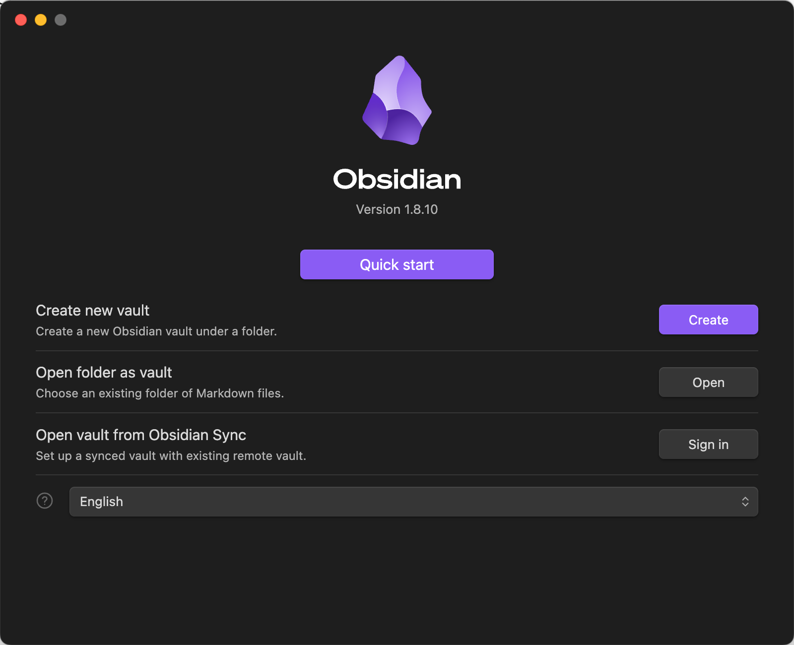


这是Obsidian在第一次启动时提示你“如何开始使用”。简单来说，**Vault 就是你的笔记库**，它对应一个本地文件夹，里面保存的都是 Markdown（.md）文件：

### 1. Create new vault（创建新的笔记库）

**含义**：你要从零开始，创建一个新的笔记文件夹，Obsidian 会在那个文件夹里帮你管理所有笔记。

**适合谁**：

* 第一次使用 Obsidian 的新用户
* 想创建一个干净的、独立的笔记空间（比如“工作笔记”或“学习笔记”）

### 2. Open folder as vault（用已有文件夹作为笔记库）

**含义**：你已经有一个存放了 Markdown 文件的文件夹，想直接用它作为 Obsidian 的笔记库。

**适合谁**：

* 之前在本地用其他工具写了很多 `.md` 文件
* 不想移动或复制已有内容，只想“原地管理”


### 3. Open vault from Obsidian Sync（从 Obsidian Sync 同步笔记库）

**含义**：你在其他设备上用了 Obsidian Sync（Obsidian 的付费同步功能），现在想把那个同步笔记库拉下来到本机。

**适合谁**：

* 已经购买了 Obsidian Sync 服务
* 在多台设备间同步数据

**如果你没开通 Sync**，可以忽略这个选项。

由于我是第一次使用Obsidian，所以我选择创建一个新的笔记文件夹，需要为其命名并选择存储位置：
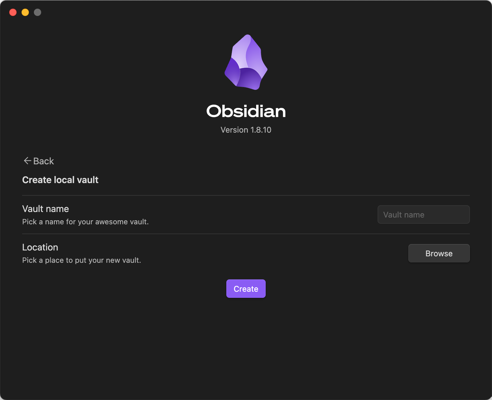

## 安装后的首次设置

创建或打开 Vault 后，建议先进行一些基础设置，让 Obsidian 更符合你的使用习惯。这些设置可以帮助你更快上手，并避免一些常见的困惑。

### 1. 界面语言设置

Obsidian 默认会根据你的系统语言自动选择界面语言，但你也可以手动更改：

**设置步骤**：
1. 点击左下角的 **设置图标**（齿轮图标）
2. 在左侧菜单中找到 **"General"（通用）**
3. 在 **"Language"（语言）** 下拉菜单中选择 **“简体中文”** 或其他你偏好的语言
4. 重启 Obsidian 使设置生效

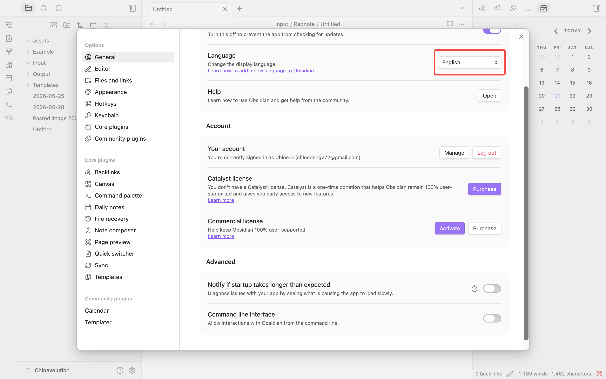

**提示**：语言设置会影响整个界面、菜单和帮助文档的显示语言。

### 2. 外观主题选择

Obsidian 提供了浅色和深色两种基础主题，以及丰富的社区主题。

**更改基础主题**：
1. 打开 **设置 → Appearance（外观）**
2. 在 **“Base color scheme”（基础配色方案）** 中选择：
   - **Light（浅色）**：适合白天使用，眼睛更舒适
   - **Dark（深色）**：适合夜晚使用，减少蓝光刺激
   - **Adapt to system（跟随系统）**：根据操作系统的深色模式自动切换

**安装社区主题**（可选）：
1. 在 **设置 → Appearance（外观）** 中点击 **“Manage”（管理）** 按钮
2. 浏览社区主题库，找到喜欢的主题
3. 点击 **“Install and use”（安装并使用）**

**热门主题推荐**：
- **Minimal**：极简风格，性能优秀
- **Things**：灵感来自 Things 任务管理应用
- **Shimmering Focus**：优雅的过渡效果
- **AnuPpuccin**：柔和的配色，护眼友好

### 3. 文件自动保存机制

很多新用户会问：“**我编辑完 Markdown 笔记后，需要手动保存吗？**”

**答案是：不需要！** 

Obsidian 的笔记会**自动保存**，你不需要按 `Ctrl+S` 或 `Cmd+S` 来保存文件。

**自动保存的工作原理**：
- 当你在编辑器中输入内容时，Obsidian 会在**几秒钟内**自动将更改写入到对应的 `.md` 文件
- 你可以在文件资源管理器中看到文件的修改时间会实时更新
- 即使 Obsidian 意外关闭，你的内容也不会丢失（最多丢失几秒钟的输入）

**如何验证自动保存**：
1. 创建一个新笔记并输入一些内容
2. 打开系统的文件管理器（Finder 或资源管理器）
3. 导航到你的 Vault 文件夹
4. 用文本编辑器打开对应的 `.md` 文件
5. 你会看到刚才在 Obsidian 中输入的内容已经保存了

**手动保存快捷键**（可选）：
虽然不需要手动保存，但如果你习惯了按保存键，也可以按 `Ctrl+S`（Windows/Linux）或 `Cmd+S`（Mac），不会有任何副作用。

### 4. 必备核心插件推荐

Obsidian 的插件分为两类：
- **核心插件（Core Plugins）**：官方内置，默认部分启用
- **社区插件（Community Plugins）**：第三方开发，需要手动安装

对于新手，建议先熟悉以下核心插件：

#### 推荐启用的核心插件

进入 **设置 → Core plugins（核心插件）**，确保以下插件已启用：

| 插件名称 | 功能说明 | 是否推荐 |
|---------|---------|---------|
| **File explorer** | 文件浏览器，管理笔记和文件夹 | ✅ 必需（默认启用） |
| **Search** | 全局搜索功能 | ✅ 必需（默认启用） |
| **Quick switcher** | 快速切换笔记（快捷键 `Ctrl/Cmd+O`） | ✅ 强烈推荐 |
| **Graph view** | 图谱视图，可视化笔记链接关系 | ✅ 推荐 |
| **Backlinks** | 显示反向链接 | ✅ 推荐 |
| **Outgoing links** | 显示当前笔记的正向链接 | ✅ 推荐 |
| **Tag pane** | 标签面板 | ✅ 推荐 |
| **Page preview** | 悬停预览笔记内容 | ✅ 推荐 |
| **Templates** | 笔记模板功能 | ✅ 推荐（进阶使用） |
| **Daily notes** | 每日笔记功能 | ✅ 推荐（后面会详细介绍） |
| **Slash commands** | 斜杠命令快捷输入 | ⭐ 可选 |
| **Command palette** | 命令面板（快捷键 `Ctrl/Cmd+P`） | ✅ 强烈推荐 |

**如何启用核心插件**：
1. 打开 **设置 → Core plugins**
2. 找到想要启用的插件
3. 点击右侧的开关按钮启用

#### 社区插件入门（可选）

如果你想探索更多功能，可以安装社区插件：

1. 打开 **设置 → Community plugins（社区插件）**
2. 点击 **“Turn on community plugins”（打开社区插件）**
3. 点击 **"Browse"（浏览）** 按钮查看可用插件
4. 搜索并安装你需要的插件

**新手友好的社区插件推荐**：
- **Calendar**：日历视图，配合 Daily notes 使用
- **Kanban**：看板视图，任务管理
- **Excalidraw**：在笔记中绘制手绘风格的图表
- **Advanced Tables**：增强 Markdown 表格编辑体验

⚠️ **注意**：不要一次性安装太多插件，建议先熟悉基础功能，再根据需要逐步添加。

### 5. 创建 Vault 后的推荐配置

完成上述基础设置后，还可以根据个人需求调整以下配置：

#### （1）编辑器设置

进入 **设置 → Editor（编辑器）**：

- **Spellcheck（拼写检查）**：根据需要开启
- **Line numbers（行号）**：如果你习惯写代码，可以开启行号
- **Readable line length（可读行长）**：限制每行文字宽度，提升阅读体验（推荐开启）
- **Strict line breaks（严格换行）**：Markdown 换行规则，新手建议关闭

#### （2）文件和链接设置

进入 **设置 → Files & Links（文件与链接）**：

- **Default location for new notes（新笔记的默认位置）**：
  - 选择 **"In the folder specified below"**，可以指定一个默认文件夹（如 `Notes/`）
  - 这样新建笔记不会散落在 Vault 根目录
  
- **New link format（新链接格式）**：
  - 推荐使用 **"Shortest path when possible"**（尽可能使用最短路径）
  - 这样链接更简洁，如 `[[笔记名]]` 而不是 `[[文件夹/笔记名]]`

- **Use [[Wikilinks]]（使用 Wiki 链接）**：
  - 推荐开启，这是 Obsidian 的核心链接方式
  - 如果你需要兼容标准 Markdown，可以关闭改用 `[text](link)` 格式

#### （3）文件夹结构建议

创建 Vault 后，可以建立一些基础文件夹来组织笔记：

```
My Vault/
├── 00-Inbox/          # 收件箱，临时想法和待整理内容
├── 01-Projects/       # 项目笔记
├── 02-Areas/          # 长期关注的领域（如工作、学习、健康）
├── 03-Resources/      # 参考资料、书籍笔记、文章摘录
├── 04-Archives/       # 已完成或不再活跃的内容
├── Templates/         # 笔记模板
└── Attachments/       # 图片、PDF 等附件
```

**提示**：文件夹结构不是必需的，很多用户更喜欢"扁平化"管理，完全依靠链接和标签来组织笔记。选择最适合你的方式即可。

### 6. 快速上手技巧

完成设置后，可以尝试以下操作来熟悉 Obsidian：

1. **创建第一个笔记**：点击左上角的"新建笔记"图标
2. **使用快速切换器**：按 `Ctrl/Cmd+O`，输入笔记名快速跳转
3. **打开命令面板**：按 `Ctrl/Cmd+P`，查看所有可用命令
4. **尝试创建链接**：输入 `[[` 就会触发笔记链接自动补全
5. **查看图谱**：点击右上角的"图谱视图"图标，看看笔记之间的连接

**下一步**：设置完成后，你可以开始创建笔记和探索双向链接功能了。接下来我们会详细介绍如何使用 Obsidian 的核心功能。

## Obsidian的基本界面结构
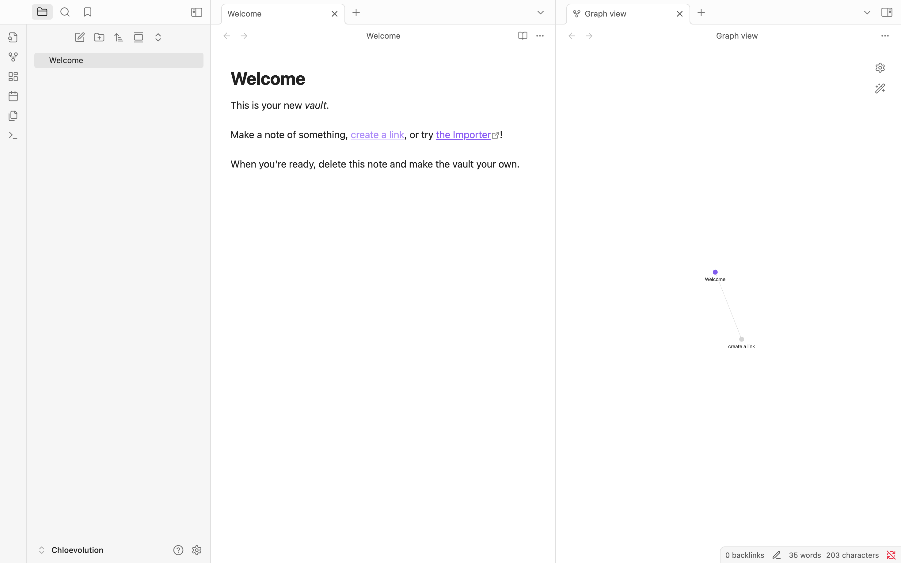

打开Vault后，Obsidian的界面大致分为以下几个区域：

### 1. 左侧边栏（Side Pane）

这是你主要的导航区域。可以通过左上角的图标打开或隐藏。

常见模块包括：

* **File Explorer（文件管理器）**
  显示你所有的笔记和文件夹。你可以在这里新建笔记、新建文件夹、重命名、移动等。

* **Search（搜索）**
  支持全文搜索，输入关键词可查找所有笔记中的匹配项。

* **Tags（标签）**（如你使用标签时会显示）
  显示你笔记中用到的所有标签，可点击查看带该标签的所有笔记。

* **Backlinks（反向链接）**
  显示哪些笔记“提到了当前这篇笔记”，有助于构建连接网络。

* **Graph View（图谱视图）**
  可视化显示笔记之间的链接关系，初期使用者可以先了解其存在。

你可以通过点击左下角的图标来管理插件、设置主题、安装扩展等。


### 2. 中间编辑区（Main Editor）

这是写作和阅读笔记的主区域。你可以：

* 双击打开任意笔记
* 同时打开多个笔记（会变成多标签页或并排视图）
* 点击右上角的图钉图标“固定”重要笔记
* 在顶部标题栏中切换查看模式（阅读、编辑、拆分等）


### 3. 右侧边栏

和左侧边栏类似，右侧边栏可以显示：

* 当前笔记的反向链接（Backlinks）
* 插件扩展内容（比如日历、任务等）


### 4. 底部状态栏

在最底部的灰色条中，你可以看到当前的模式（编辑/阅读）、字数统计、光标位置等信息。


## 如何开始使用Obsidian
### 从第一个笔记开始

下面我们创建一个全新的笔记并写入内容：

1. **点击“新建笔记”按钮**
   在左侧边栏上方，有一个“纸张 +”图标（悬浮时显示 `New note`）。


2. **输入笔记名称**
   系统会自动填一个，比如 “Untitled”，你可以改为 `我的第一个笔记.md`，按下回车确认。
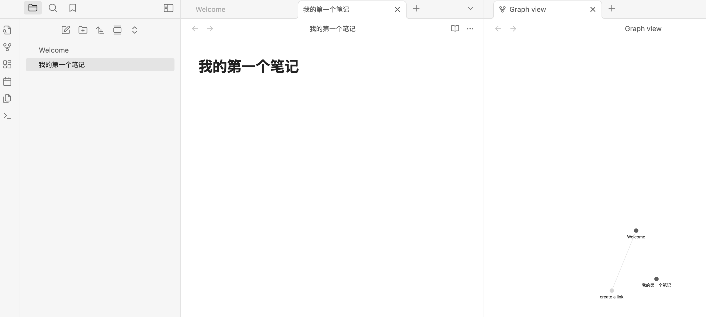
3. **开始编辑**
   接下来可以编辑笔记内容。可能你会发现只能编辑标题，但是不能输入正文内容。这时你需要检查下右上角是“铅笔”还是“书本”的图标，它分别代表了“阅读”和“编辑”模式。处于“阅读”模式的话，是无法编辑的，点击即可切换：
   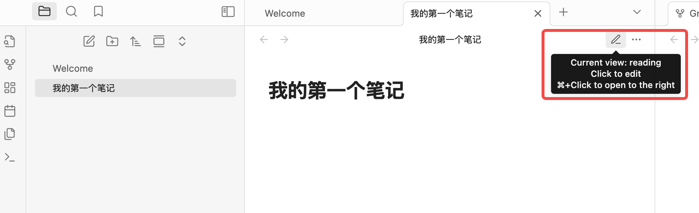
   
   开始输入内容：

   ```
   我的第一个笔记

   今天开始使用 Obsidian 了，这是第一条笔记内容。
   ```

   笔记保存是自动的，你不用手动保存。第一条笔记创建完成！
   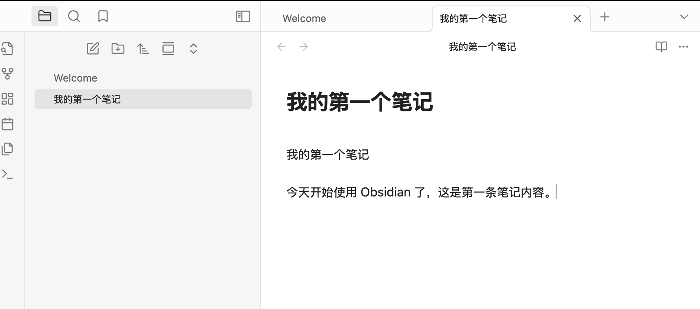

### 尝试双向链接

#### 什么是双向链接？
首先，我们来看下Obsidian中双向链接的概念：
双向链接（**Backlinks**）是Obsidian最核心、也最有价值的特性之一。它的意义在于：

> **不仅你可以“引用”别的笔记，Obsidian也能自动告诉你“哪些笔记提到了当前这篇笔记”。**

这种“彼此知道彼此”的关系，和普通的笔记工具最大不同就在于：
你不用手动整理结构，笔记之间自己“建立网络”。

举个例子，假设你有两篇笔记：
* A笔记：`什么是Markdown`
* B笔记：`Obsidian的功能介绍`

在 B 笔记中你写下这样一句话：

```
Obsidian 支持 [[什么是Markdown]] 格式。
```

你做了什么？你在 **B 中链接了 A**。

这时候，Obsidian自动会在A笔记中展示一条 “反向链接”：

> “这篇笔记被 **Obsidian的功能介绍** 引用了。”


对比下“正向链接”和“反向链接”：

| 类型   | 概念                         | 举例               |
| ---- | -------------------------- | ---------------- |
| 正向链接 | 你手动用 `[[ ]]` 去链接别的笔记       | 在 B 中输入 `[[A]]`  |
| 反向链接 | Obsidian 自动告诉你：哪些笔记提到了这篇笔记 | 在 A 中看到：“被 B 引用” |

换句话说：

* 正向链接是你主动说“我引用了谁”
* 反向链接是系统告诉你“谁引用了我”


#### 为什么双向链接很重要？

传统笔记是树状结构（分类 → 子分类 → 文件），非常容易越记越乱。

而 Obsidian的双向链接让你构建一个**网状结构的知识网络**，笔记之间可以自由连接、跨主题交叉。它支持你：

* 把想法“串”起来
* 找到以前忘掉的内容
* 构建你的“第二大脑”


#### 在 Obsidian 中怎么看反向链接？

当你打开某篇笔记时：

* 在右下角或右侧边栏中，会有一个“Backlinks”面板
* 它会显示“哪些笔记提到了这篇笔记”
* 你可以点击这些笔记快速跳转查看上下文


总结一句话：

> **双向链接 = 自动建立知识网络，不再孤立地记笔记，而是让信息互相关联，形成系统。**


#### 如何创建双向链接

接下来，我们来做一个简单的演示：

1. **再次新建一个笔记**
   按照前面教过的步骤，创建一个新笔记，命名为 `学习计划`

2. **在新笔记中写入以下内容**：

   ```
   我要根据 [[我的第一个笔记]] 的内容开始规划。
   ```

这时，你会发现“我的第一个笔记”被高亮，且显示是可以点击的状态。而在右侧视图中，你可以看到“学习计划”和“我的第一个笔记”两者之间被直线连接了起来：
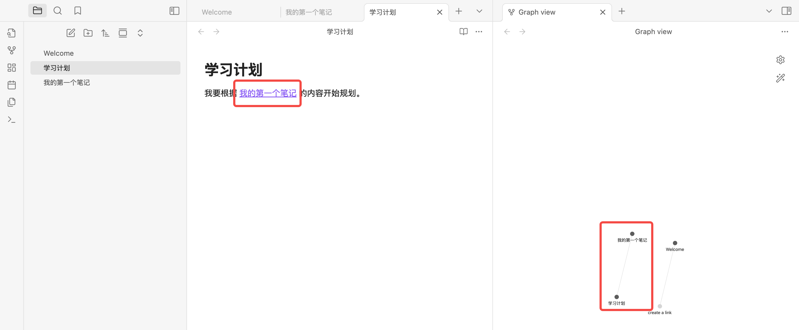

在链接视图，也可以看到“学习计划”链向了“我的第一个笔记”：
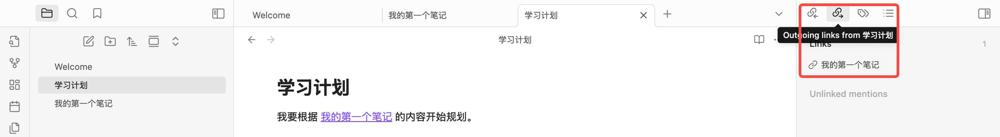

“我的第一个笔记”有一个来自“学习计划”的链接：
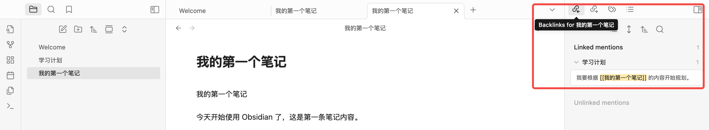

3. **点击 `[[我的第一个笔记]]`**
   你会跳转到那篇笔记的页面。

这样你就构建了一个双向链接结构，笔记之间可以像网页一样互相跳转，并能自动追踪引用关系。


第一次打开 Obsidian 也许会觉得有点空，但一旦习惯链接笔记的方式，它会变得越来越有意思。接下来我会写一些更实用的用法，比如插件推荐、搜索技巧、日常写作的整理方式等等。如果你也在用 Obsidian，不妨一起探索下去。