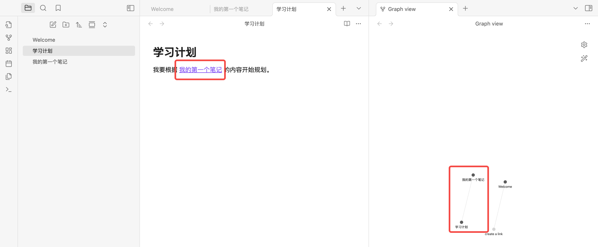

在信息爆炸的时代，越来越多的人意识到知识的整理与沉淀比获取更重要。[Obsidian](https://obsidian.md/)，作为一款专注于**本地知识管理**的笔记软件，近年来在生产力爱好者和知识工作者之间迅速走红。它不是又一个云笔记工具，而是一个强调**本地存储、Markdown 格式、链接思维**的“第二大脑”系统。

## Obsidian的核心理念

Obsidian的核心在于构建一个由你自己掌控的知识网络。与传统的线性笔记不同，Obsidian倡导的是**非线性链接笔记**。通过链接不同的笔记，你可以构建出一个多维度、相互关联的知识图谱。

其设计灵感部分来源于Zettelkasten（卡片盒笔记法），鼓励用户记录原子化的信息单元，并通过双向链接（Backlink）将它们自然组织成网络结构。

## Obsidian主要功能

### 1. 本地 Markdown 编辑

Obsidian的每一条笔记都是保存在本地的 `.md` 文件。这意味着你完全掌握自己的数据，不依赖云端。笔记可被任意版本控制、加密、同步，甚至用其他Markdown编辑器打开。

Markdown是一种轻量级标记语言，它的设计初衷是：让人类更容易阅读和编写格式化的文本，同时也能被转换成结构良好的 HTML（网页语言）。它的语法简单、直观，不需要复杂的排版操作，特别适合写笔记、写文档、写博客、甚至写书。


### 2. 双向链接与反向引用

在笔记中，你可以通过 `[[笔记标题]]` 的方式快速引用其他笔记。而Obsidian会自动在被引用的笔记中生成“被引用记录”。这种方式大大增强了笔记之间的关联性，促进知识网络的自然生长。

### 3. 图谱视图（Graph View）

图谱视图可以直观展示你所有笔记之间的连接关系。这种视图不仅好看，更重要的是可以帮助你发现遗漏的知识节点和潜在的连接。

### 4. 插件生态

Obsidian 提供了丰富的插件接口，官方和社区都贡献了大量高质量的插件。无论是任务管理、日历、看板，还是全文搜索、高亮阅读、写作辅助，你都能找到对应的扩展工具。

### 5. 离线优先，隐私至上

Obsidian的所有功能在本地运行，即使完全断网也不会影响使用。对于注重数据安全和隐私的用户，这是一项极具吸引力的特性。

## Obsidian适合谁？

* 想系统整理知识的学生与研究者
* 需要构建个人知识库的内容创作者
* 习惯用 Markdown 写作的程序员与写作者
* 重视隐私和数据主权的用户
* 正在寻找 Notion、Evernote 等云笔记工具的本地替代方案的人

## 如何安装Obsidian？
根据电脑的系统版本，在[Obsidian官网](https://help.obsidian.md/install)选择适合自己的软件版本，点击“Download”即可下载：


安装完成后，打开Obsidian，你会看到以下三个选项：


这是Obsidian在第一次启动时提示你“如何开始使用”。简单来说，**Vault 就是你的笔记库**，它对应一个本地文件夹，里面保存的都是 Markdown（.md）文件：

### 1. Create new vault（创建新的笔记库）

**含义**：你要从零开始，创建一个新的笔记文件夹，Obsidian 会在那个文件夹里帮你管理所有笔记。

**适合谁**：

* 第一次使用 Obsidian 的新用户
* 想创建一个干净的、独立的笔记空间（比如“工作笔记”或“学习笔记”）

### 2. Open folder as vault（用已有文件夹作为笔记库）

**含义**：你已经有一个存放了 Markdown 文件的文件夹，想直接用它作为 Obsidian 的笔记库。

**适合谁**：

* 之前在本地用其他工具写了很多 `.md` 文件
* 不想移动或复制已有内容，只想“原地管理”


### 3. Open vault from Obsidian Sync（从 Obsidian Sync 同步笔记库）

**含义**：你在其他设备上用了 Obsidian Sync（Obsidian 的付费同步功能），现在想把那个同步笔记库拉下来到本机。

**适合谁**：

* 已经购买了 Obsidian Sync 服务
* 在多台设备间同步数据

**如果你没开通 Sync**，可以忽略这个选项。

由于我是第一次使用Obsidian，所以我选择创建一个新的笔记文件夹，需要为其命名并选择存储位置：


## Obsidian的基本界面结构


打开Vault后，Obsidian的界面大致分为以下几个区域：

### 1. 左侧边栏（Side Pane）

这是你主要的导航区域。可以通过左上角的图标打开或隐藏。

常见模块包括：

* **File Explorer（文件管理器）**
  显示你所有的笔记和文件夹。你可以在这里新建笔记、新建文件夹、重命名、移动等。

* **Search（搜索）**
  支持全文搜索，输入关键词可查找所有笔记中的匹配项。

* **Tags（标签）**（如你使用标签时会显示）
  显示你笔记中用到的所有标签，可点击查看带该标签的所有笔记。

* **Backlinks（反向链接）**
  显示哪些笔记“提到了当前这篇笔记”，有助于构建连接网络。

* **Graph View（图谱视图）**
  可视化显示笔记之间的链接关系，初期使用者可以先了解其存在。

你可以通过点击左下角的图标来管理插件、设置主题、安装扩展等。


### 2. 中间编辑区（Main Editor）

这是写作和阅读笔记的主区域。你可以：

* 双击打开任意笔记
* 同时打开多个笔记（会变成多标签页或并排视图）
* 点击右上角的图钉图标“固定”重要笔记
* 在顶部标题栏中切换查看模式（阅读、编辑、拆分等）


### 3. 右侧边栏

和左侧边栏类似，右侧边栏可以显示：

* 当前笔记的反向链接（Backlinks）
* 插件扩展内容（比如日历、任务等）


### 4. 底部状态栏

在最底部的灰色条中，你可以看到当前的模式（编辑/阅读）、字数统计、光标位置等信息。


## 如何开始使用Obsidian
### 从第一个笔记开始

下面我们创建一个全新的笔记并写入内容：

1. **点击“新建笔记”按钮**
   在左侧边栏上方，有一个“纸张 +”图标（悬浮时显示 `New note`）。


2. **输入笔记名称**
   系统会自动填一个，比如 “Untitled”，你可以改为 `我的第一个笔记.md`，按下回车确认。

3. **开始编辑**
   接下来可以编辑笔记内容。可能你会发现只能编辑标题，但是不能输入正文内容。这时你需要检查下右上角是“铅笔”还是“书本”的图标，它分别代表了“阅读”和“编辑”模式。处于“阅读”模式的话，是无法编辑的，点击即可切换：
   
   
   开始输入内容：

   ```
   我的第一个笔记

   今天开始使用 Obsidian 了，这是第一条笔记内容。
   ```

   笔记保存是自动的，你不用手动保存。第一条笔记创建完成！
   

### 尝试双向链接

#### 什么是双向链接？
首先，我们来看下Obsidian中双向链接的概念：
双向链接（**Backlinks**）是Obsidian最核心、也最有价值的特性之一。它的意义在于：

> **不仅你可以“引用”别的笔记，Obsidian也能自动告诉你“哪些笔记提到了当前这篇笔记”。**

这种“彼此知道彼此”的关系，和普通的笔记工具最大不同就在于：
你不用手动整理结构，笔记之间自己“建立网络”。

举个例子，假设你有两篇笔记：
* A笔记：`什么是Markdown`
* B笔记：`Obsidian的功能介绍`

在 B 笔记中你写下这样一句话：

```
Obsidian 支持 [[什么是Markdown]] 格式。
```

你做了什么？你在 **B 中链接了 A**。

这时候，Obsidian自动会在A笔记中展示一条 “反向链接”：

> “这篇笔记被 **Obsidian的功能介绍** 引用了。”


对比下“正向链接”和“反向链接”：

| 类型   | 概念                         | 举例               |
| ---- | -------------------------- | ---------------- |
| 正向链接 | 你手动用 `[[ ]]` 去链接别的笔记       | 在 B 中输入 `[[A]]`  |
| 反向链接 | Obsidian 自动告诉你：哪些笔记提到了这篇笔记 | 在 A 中看到：“被 B 引用” |

换句话说：

* 正向链接是你主动说“我引用了谁”
* 反向链接是系统告诉你“谁引用了我”


#### 为什么双向链接很重要？

传统笔记是树状结构（分类 → 子分类 → 文件），非常容易越记越乱。

而 Obsidian的双向链接让你构建一个**网状结构的知识网络**，笔记之间可以自由连接、跨主题交叉。它支持你：

* 把想法“串”起来
* 找到以前忘掉的内容
* 构建你的“第二大脑”


#### 在 Obsidian 中怎么看反向链接？

当你打开某篇笔记时：

* 在右下角或右侧边栏中，会有一个“Backlinks”面板
* 它会显示“哪些笔记提到了这篇笔记”
* 你可以点击这些笔记快速跳转查看上下文


总结一句话：

> **双向链接 = 自动建立知识网络，不再孤立地记笔记，而是让信息互相关联，形成系统。**


#### 如何创建双向链接

接下来，我们来做一个简单的演示：

1. **再次新建一个笔记**
   按照前面教过的步骤，创建一个新笔记，命名为 `学习计划`

2. **在新笔记中写入以下内容**：

   ```
   我要根据 [[我的第一个笔记]] 的内容开始规划。
   ```

这时，你会发现“我的第一个笔记”被高亮，且显示是可以点击的状态。而在右侧视图中，你可以看到“学习计划”和“我的第一个笔记”两者之间被直线连接了起来：


在链接视图，也可以看到“学习计划”链向了“我的第一个笔记”：


“我的第一个笔记”有一个来自“学习计划”的链接：


3. **点击 `[[我的第一个笔记]]`**
   你会跳转到那篇笔记的页面。

这样你就构建了一个双向链接结构，笔记之间可以像网页一样互相跳转，并能自动追踪引用关系。


第一次打开 Obsidian 也许会觉得有点空，但一旦习惯链接笔记的方式，它会变得越来越有意思。接下来我会写一些更实用的用法，比如插件推荐、搜索技巧、日常写作的整理方式等等。如果你也在用 Obsidian，不妨一起探索下去。