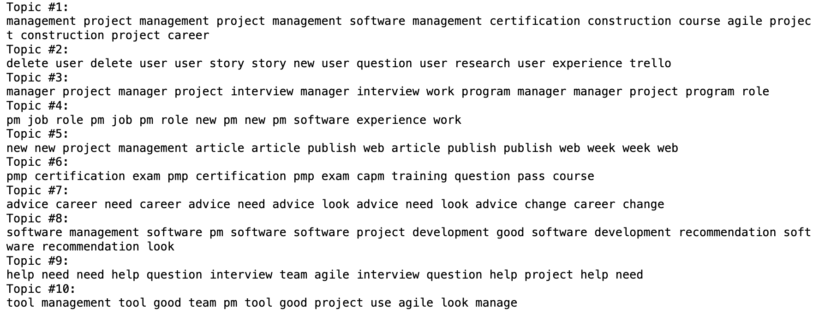

## Prerequisites

To run this code, you need the `pandas`, `zstandard` (`zstd`), and `json` libraries. If not already installed, you can install `pandas` and `zstandard` using pip:

```python
pip install pandas zstandard
```

`json` is part of Python's standard library, so no additional installation is needed for it.

**Note**: The above below assumes the data inside the `.zst` file is the **newline-delimited JSON (NDJSON)** format. If your data is in another format (e.g., CSV, TSV), you should use the appropriate `pandas` function (like `pd.read_csv()`).

## Function Definition

Design a Python function named `decompress_zst_to_csv` to decompress a `.zst` (Zstandard compressed) file containing JSON objects, convert these objects into a pandas DataFrame, and then export this DataFrame to a CSV file. Let's break down how each part of the function works:

```python
def decompress_zst_to_csv(zst_file_path, output_csv_path):
```

This line defines a function `decompress_zst_to_csv` that takes two parameters: `zst_file_path` (the path to the `.zst` file you want to decompress) and `output_csv_path` (the path where you want to save the resulting CSV file).

### Create a Zstandard Decompressor

```python
dctx = zstd.ZstdDecompressor()
```

Here, a `ZstdDecompressor` object from the `zstd` module is instantiated. This object is used to decompress data compressed with Zstandard (`.zst`) compression.

### Initialize Data List

```python
data_list = []
```

An empty list, `data_list`, is initialized to store the decompressed JSON objects.

### Open and Decompress the .zst File

```python
with open(zst_file_path, 'rb') as compressed:
    with dctx.stream_reader(compressed) as reader:
        text_stream = io.TextIOWrapper(reader, encoding='utf-8')
        for line in text_stream:
            data = json.loads(line)
            data_list.append(data)
```

This block opens the `.zst` file in binary reading mode (`'rb'`). It then uses the `ZstdDecompressor`'s `stream_reader` method to decompress the file content on-the-fly. The decompressed data stream is wrapped in a `TextIOWrapper` to facilitate reading the stream line by line as text (with UTF-8 encoding). Each line is expected to be a JSON object, which is parsed into a Python dictionary using `json.loads` and appended to `data_list`.

### Convert to DataFrame and Export to CSV

```python
df = pd.DataFrame(data_list)
df.to_csv(output_csv_path, index=False)
```

After all JSON objects have been read and stored in `data_list`, this list of dictionaries is converted into a pandas DataFrame. Finally, the DataFrame is exported to a CSV file specified by `output_csv_path`, with `index=False` to prevent pandas from writing row indices into the CSV file.

### Usage Example

```python
decompress_zst_to_csv('sample.zst', 'output.csv')
```

This line demonstrates how to call the `decompress_zst_to_csv` function, specifying paths to the input `.zst` file and the desired output CSV file.

## Text Data Processing and Analysis

The code below is used to extracting and analyzing topics from a collection of text data (Reddit submission titles, in this case) using Python libraries such as pandas, scikit-learn for NMF (Non-negative Matrix Factorization) topic modeling, and spaCy for text preprocessing

### Importing Libraries

```python
import pandas as pd
from sklearn.feature_extraction.text import TfidfVectorizer
from sklearn.decomposition import NMF
import spacy
```

This part imports the necessary Python libraries. `pandas` is used for data manipulation, `TfidfVectorizer` from `sklearn.feature_extraction.text` for transforming text into a matrix of TF-IDF features, `NMF` from `sklearn.decomposition` for topic modeling, and `spacy` for advanced text preprocessing.

### spaCy Language Model Loading

```python
nlp = spacy.load("en_core_web_sm")
```

Here, the English language model (`en_core_web_sm`) is loaded into `nlp`. This model will be used for tokenizing, lemmatizing, and removing stopwords from the text data.

### Text Preprocessing Function

```python
def preprocess_title(title):
    doc = nlp(title.lower())
    return " ".join([token.lemma_ for token in doc if not token.is_stop and not token.is_punct and token.is_alpha])
```

The function `preprocess_title` takes a text string (`title`), processes it with the `nlp` object to tokenize and lemmatize it, and removes stopwords and punctuation. It then joins the processed tokens back into a single string. Lemmatization converts words to their base or dictionary form, which is helpful for standardizing variations of the same word.

### Loading and Preprocessing the Dataset

```python
df = pd.read_csv('path_to_your_file.csv')
df['processed_titles'] = df['title'].apply(preprocess_title)
```

This block loads a dataset from a CSV file into a pandas DataFrame `df`. It assumes there's a column named `'title'` containing the text to be analyzed. Each title is then preprocessed using the `preprocess_title` function defined earlier.

### TF-IDF Vectorization

```python
vectorizer = TfidfVectorizer(max_df=0.85, min_df=3, stop_words='english', ngram_range=(1,2))
tfidf = vectorizer.fit_transform(df['processed_titles'])
```

The `TfidfVectorizer` is configured and applied to transform the preprocessed titles into a matrix of TF-IDF features. Parameters such as `max_df`, `min_df`, and `ngram_range` are set to filter out too common or rare terms and include bi-grams for richer feature representation.

### Topic Modeling with NMF

```python
nmf = NMF(n_components=10, random_state=42).fit(tfidf)
```

Non-negative Matrix Factorization (NMF) is applied to the TF-IDF matrix to identify a specified number of topics (`n_components=10`). NMF decomposes the high-dimensional TF-IDF matrix into two lower-dimensional matrices, revealing patterns that can be interpreted as topics.

### Displaying Topics

```python
for topic_idx, topic in enumerate(nmf.components_):
    print(f"Topic #{topic_idx+1}:")
    print(" ".join([vectorizer.get_feature_names_out()[i] for i in topic.argsort()[:-10 - 1:-1]]))
```

For each topic discovered by NMF, the top terms associated with that topic are printed. This is done by sorting the components (topics) in descending order of importance and selecting the top terms to describe each topic.

But I think the analysis result is not good enough, maybe can try other models later:

