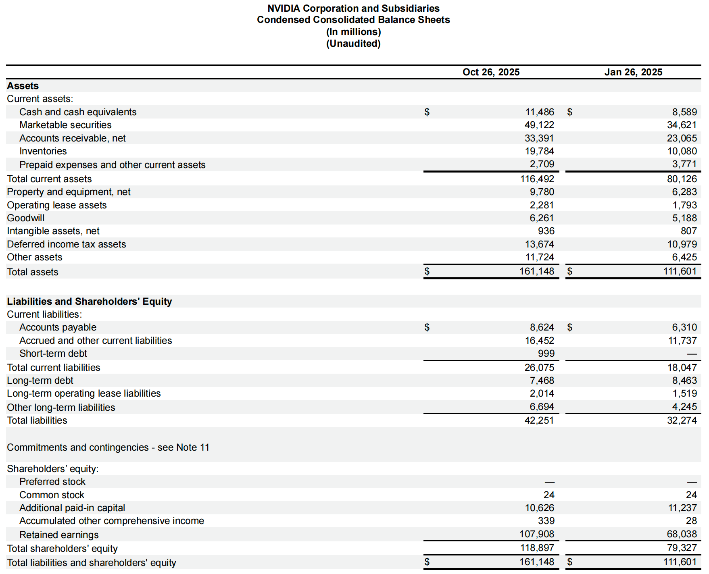
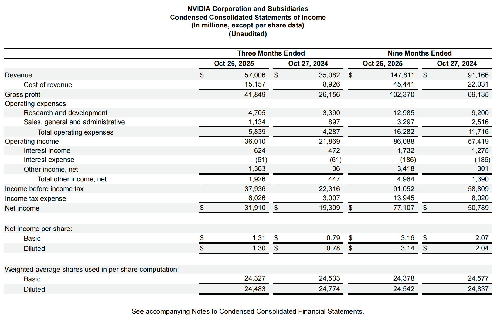
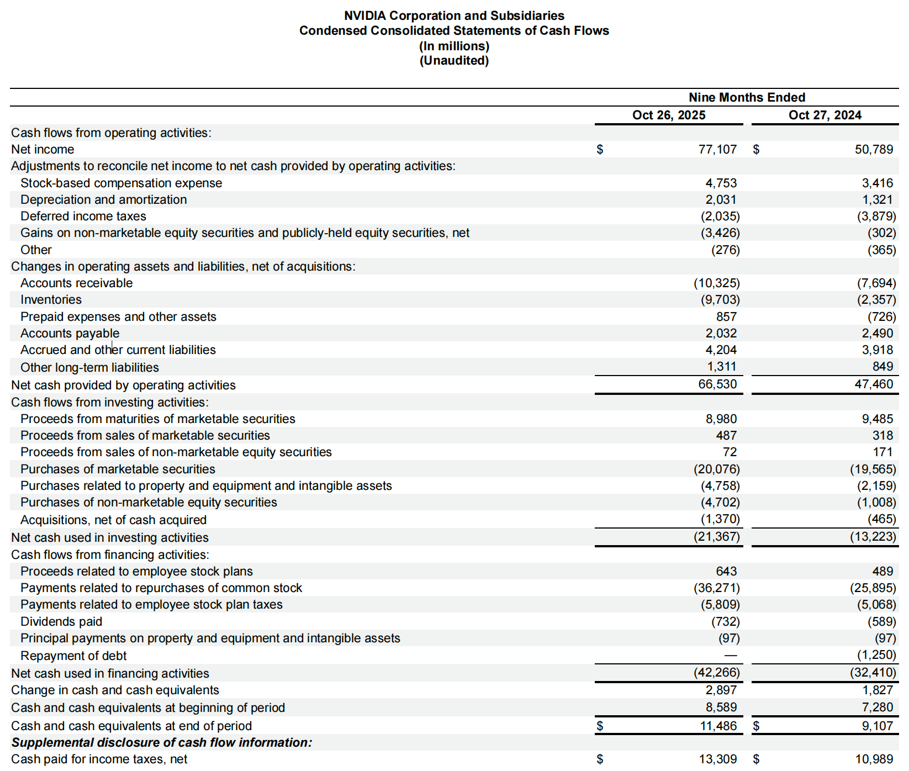

For any beginner who wants to gain a deeper understanding of investing, financial statements are a core tool that must be mastered. Financial statements are the quantitative record of a company’s operating activities; they disclose its profitability, asset structure, and cash flows.

This article focuses on the third-quarter report released in 2025 by the world’s leading AI and semiconductor company—**NVIDIA**—as the case study for analysis.

I will cover:

1. The three main financial statements.
2. Key figures in NVIDIA’s report.
3. How to use these figures to assess the company’s financial performance and the quality of its growth.

First, you need to download NVIDIA’s third-quarter financial report from the company’s official website:
[https://investor.nvidia.com/financial-info/financial-reports/](https://investor.nvidia.com/financial-info/financial-reports/)

## Cover Page Information

When you open a public company’s financial report, the first thing you see is the “cover page,” which provides key information for identifying and positioning the document. Understanding this information is the first step toward proper analysis.

### Report Type and Regulatory Authority

Public companies are required to file reports with regulators on a regular basis. The report name (form number) defines its type and filing frequency.

| Report Type          | Form Number | Filing Frequency / Purpose                                                                                            |
| :------------------- | :---------- | :-------------------------------------------------------------------------------------------------------------------- |
| **Quarterly Report** | **10-Q**    | Filed after each completed fiscal quarter. It provides a concise update on recent operations and financial condition. |
| Annual Report        | **10-K**    | Filed after the fiscal year end; it is the most comprehensive and detailed report.                                    |
| Current Report       | **8-K**     | Filed when a material event that investors should know about occurs (e.g., CEO change, major acquisition).            |

* **10-Q**: Indicates that this document is NVIDIA’s **quarterly financial report**.
* **UNITED STATES SECURITIES AND EXCHANGE COMMISSION (SEC)**: Indicates that the report is filed in accordance with SEC requirements, the primary regulator of U.S. public companies.

### Timing and Corporate Identity

The cover page clearly states the reporting period and the company’s legal information:

* **For the quarterly period ended October 26, 2025**: This specifies the **cut-off date** of the report. All financial data reflect the company’s operations up to this date or the period leading up to it.
* **NVIDIA CORPORATION**: The company’s registered legal name.
* **Delaware**: NVIDIA’s state of incorporation.
* **94-3177549**: The company’s **Employer Identification Number (EIN)**, essentially its tax ID.
* **2788 San Tomas Expressway, Santa Clara, California**: The company’s **principal executive office address**.

### Equity Information

* **Common Stock, $0.001 par value per share**: This describes the basic information about the company’s common stock.

  * **Par Value**: In corporate law, par value is a nominal amount assigned to each share; NVIDIA’s par value is $0.001 per share.
  * **Important Note**: **Par value** is a historical accounting concept. It is **not** the issue price and **not** the market price of the stock, and it has virtually no relevance for practical investment analysis.

## Table of Contents

After the cover page, the table of contents guides you to the core sections of the financial report.

### Audit Status of the Report

* **Financial Statements (Unaudited)**: This phrase indicates that the financial statements you are reading are **unaudited**.

  * **Reason**: Quarterly reports (**Form 10-Q**) are typically unaudited due to time constraints. The figures are based on internal records and management judgment.
  * **Audit Opinion**: Only the annual report (**Form 10-K**) is required to include an independent auditor’s **audit opinion**, which gives the data a higher level of reliability and assurance.

> When reading a 10-Q, keep in mind that the data are preliminary—generally reliable, but subject to adjustment when the annual report is released.

### The Four Core Financial Statements

Financial analysis primarily revolves around four core statements, each depicting the company’s financial health and operating activities from a different perspective.

| Statement                          | Core Question                                           | Key Concepts                               |
| :--------------------------------- | :------------------------------------------------------ | :----------------------------------------- |
| **Balance Sheet**                  | What does the company **own** and **owe**?              | Assets, liabilities, shareholders’ equity  |
| **Income Statement**               | How much did the company **earn** during the period?    | Revenue, costs, net income                 |
| **Comprehensive Income Statement** | What **other gains or losses** exist beyond net income? | Other comprehensive income (OCI)           |
| **Cash Flow Statement**            | Where did the company’s **cash come from and go to**?   | Operating, investing, financing cash flows |

### Accounting Standards: US GAAP

When making international comparisons, it is crucial to understand which accounting standards a company follows:

* **US GAAP**: As a U.S.-listed company, NVIDIA prepares its financial statements in accordance with **U.S. Generally Accepted Accounting Principles (US GAAP)**.
* **IFRS**: Many non-U.S. companies follow **International Financial Reporting Standards (IFRS)**.

> US GAAP and IFRS differ in areas such as revenue recognition and asset valuation. When comparing NVIDIA (US GAAP) with a European or Asian company (IFRS), you must account for these potential **accounting standard differences** to ensure a fair comparison.

## Balance Sheet

The balance sheet reflects a company’s financial position at a **specific point in time**, based on the core equation: Assets = Liabilities + Shareholders’ Equity. Understanding how each line item maps to NVIDIA’s actual operations is key to analysis.

### Assets: Resources Owned by the Company

Assets are resources owned or controlled by the company that are expected to generate future economic benefits. We interpret them according to liquidity (how quickly they can be converted into cash).

#### Current Assets

Current assets are those expected to be converted into cash or consumed within **one year**.

| Item                                          | Definition                                                                                                      | How It Appears in NVIDIA’s Business                                                                        | Significance of the Change                                                                                                                                                               |
| :-------------------------------------------- | :-------------------------------------------------------------------------------------------------------------- | :--------------------------------------------------------------------------------------------------------- | :--------------------------------------------------------------------------------------------------------------------------------------------------------------------------------------- |
| **Cash and Cash Equivalents**                 | Funds available for immediate use or highly liquid short-term investments.                                      | Cash received from chip sales and software licensing.                                                      | **Increase**: Indicates strong immediate liquidity and ample cash reserves.                                                                                                              |
| **Marketable Securities**                     | Short-term financial assets that can be quickly sold to earn interest or investment returns.                    | Investments such as government and corporate bonds purchased with excess cash.                             | **Significant increase**: Suggests excess cash flow and active short-term cash management to generate returns.                                                                           |
| **Accounts Receivable, Net**                  | Amounts owed by customers after product delivery or service provision, net of allowances for doubtful accounts. | Receivables from data-center customers (e.g., cloud giants) after shipment of AI chips (H100/A100).        | **Significant increase**: Typically aligns with **strong revenue growth**, but requires monitoring of collection periods.                                                                |
| **Inventories**                               | Goods held for sale (finished goods), in production (work in process), or raw materials.                        | Includes **finished GPU chips**, memory, wafers as raw materials, and semi-finished products at foundries. | **Doubling**: During strong demand cycles, higher inventories indicate active stockpiling for **future demand surges**, though obsolescence risk (e.g., older GPUs) should be monitored. |
| **Prepaid Expenses and Other Current Assets** | Expenses paid in advance for services or benefits not yet received.                                             | Prepayments to foundries (e.g., TSMC) or unamortized software license fees.                                | **Change**: Normal operational fluctuation; typically a small proportion.                                                                                                                |
| **Total Current Assets**                      |                                                                                                                 |                                                                                                            | **Sharp increase**: Reflects rapid expansion in business scale and liquidity.                                                                                                            |

#### Non-Current Assets

Non-current assets are those expected to be realized or consumed **beyond one year**.

| Item                            | Definition                                                                                                                | How It Appears in NVIDIA’s Business                                                                 | Significance of the Change                                                                                              |
| :------------------------------ | :------------------------------------------------------------------------------------------------------------------------ | :-------------------------------------------------------------------------------------------------- | :---------------------------------------------------------------------------------------------------------------------- |
| **Property and Equipment, Net** | Long-term tangible assets such as land, buildings, and equipment, net of accumulated depreciation.                        | **R&D facilities**, testing equipment, data-center servers, and production-related machinery.       | **Increase**: Indicates substantial **capital expenditures (CapEx)** to expand capacity and upgrade R&D infrastructure. |
| **Goodwill**                    | The excess of purchase price over the fair value of net assets acquired in acquisitions, representing intangible value.   | Intangible value from past acquisitions (e.g., Mellanox), including brand and technology synergies. | **Increase**: Reflects new **major acquisition activity**.                                                              |
| **Deferred Income Tax Assets**  | Amounts that can be used to offset future income taxes, arising from timing differences between accounting and tax rules. | Recognized due to tax-deductible losses or expenses allowed in future periods.                      | **Increase**: Requires analysis; may relate to heavy depreciation from CapEx or tax treatment of acquisitions.          |
| **Total Assets**                |                                                                                                                           |                                                                                                     | **Significant growth**: Represents a rapid expansion in the company’s overall scale and resource base.                  |

### Liabilities: The Company’s Debts and Obligations

Liabilities represent a company’s obligations to external parties, which must be settled in the future through the use of assets or the provision of services.

| Item                                      | Definition                                                                                                                                  | How It Appears in NVIDIA’s Business                                                                                   | Significance of the Change                                                                                                                                     |
| :---------------------------------------- | :------------------------------------------------------------------------------------------------------------------------------------------ | :-------------------------------------------------------------------------------------------------------------------- | :------------------------------------------------------------------------------------------------------------------------------------------------------------- |
| **Accounts Payable**                      | Amounts owed to suppliers for the purchase of raw materials or services.                                                                    | Amounts NVIDIA owes to partners such as TSMC (foundries) and memory chip suppliers for manufacturing and procurement. | **Increase**: Typically moves in line with an **expansion in purchasing volume**. If it grows faster than procurement, it may indicate extended payment terms. |
| **Accrued and Other Current Liabilities** | Expenses that have been incurred but not yet paid as of the reporting date (e.g., employee compensation, taxes payable, warranty reserves). | Bonuses payable to employees, unpaid advertising expenses, and provisions for after-sales product warranties.         | **Increase**: Reflects **higher business activity**, such as rising labor and selling costs.                                                                   |
| **Short-Term Debt**                       | Bank borrowings or bonds due within one year.                                                                                               | Borrowings used for short-term working capital needs.                                                                 | **Newly added**: Indicates the company has begun using short-term financing to support operations or investments.                                              |
| **Long-Term Debt**                        | Bank loans or bonds due after more than one year.                                                                                           | Corporate bonds issued to fund large capital expenditures or acquisitions.                                            | **Decrease**: Indicates repayment of long-term principal.                                                                                                      |
| **Total Liabilities**                     |                                                                                                                                             |                                                                                                                       | **Increase**: Although liabilities have expanded, this represents healthy growth if assets and revenues are growing faster.                                    |

### Shareholders’ Equity

Shareholders’ equity represents the residual interest in the company’s assets after deducting liabilities.

| Item                           | Definition                                                                           | How It Appears in NVIDIA’s Business                                                                                                | Significance of the Change                                                                                                                        |
| :----------------------------- | :----------------------------------------------------------------------------------- | :--------------------------------------------------------------------------------------------------------------------------------- | :------------------------------------------------------------------------------------------------------------------------------------------------ |
| **Additional Paid-In Capital** | The portion of equity paid by shareholders in excess of the stock’s par value.       | The portion of shareholders’ initial investment above the $0.001 par value.                                                        | **Slight decrease**: May be related to **share repurchases** (retirement of shares) or accounting treatment of employee equity incentive plans.   |
| **Retained Earnings**          | The cumulative **net income** since inception, minus dividends paid to shareholders. | Profits earned over the years from chip and software sales that were retained and reinvested rather than distributed as dividends. | **Significant increase**: The **most direct indicator of profitability**. Strong growth shows substantial net income during the reporting period. |
| **Total Shareholders’ Equity** |                                                                                      |                                                                                                                                    | **Sharp increase**: Indicates a significant rise in net asset value driven by improved profitability.                                             |

## Income Statement

The income statement reflects a company’s operating results over a **specific accounting period**, showing its ability to generate profits. It presents revenue, costs, expenses, and ultimately net income.

Here, I focus on NVIDIA’s performance in the latest **third quarter (Three Months Ended October 26, 2025)** compared with the same period last year.

### Revenue and Gross Margin: Measuring Core Business Value

This section shows the revenue generated from selling chips and related services, as well as the inherent profitability of NVIDIA’s products.

| Item                | Definition                                                                            | How It Appears in NVIDIA’s Business                                                                                      | Significance of the Change (Current Period vs. Prior Year)                                                                                                              |
| :------------------ | :------------------------------------------------------------------------------------ | :----------------------------------------------------------------------------------------------------------------------- | :---------------------------------------------------------------------------------------------------------------------------------------------------------------------- |
| **Revenue**         | Total income generated from core business activities (sales of products or services). | Revenue from selling GPU chips (e.g., H100 for data centers, RTX series for gaming) and related software and licenses.   | **Significant increase** (e.g., Q3 from $35.082 billion to $57.006 billion): The most critical metric, reflecting **explosive demand growth**, especially for AI chips. |
| **Cost of Revenue** | Costs directly associated with producing products or delivering services.             | Wafer fabrication fees paid to foundries (e.g., TSMC), costs of memory chips and other materials, and shipping expenses. | **Increase**: In line with revenue growth, indicating higher shipment volumes and production scale.                                                                     |
| **Gross Profit**    | Revenue minus cost of revenue; measures product-level profitability.                  | Profit remaining after deducting direct manufacturing costs from chip sales.                                             | **Sharp increase**: Shows that absolute profit expanded rapidly alongside revenue growth.                                                                               |

### Operating Expenses and Operating Income: Measuring Efficiency and Investment

This section reflects the costs incurred to support operations and invest in new technologies.

| Item                                         | Definition                                                                                  | How It Appears in NVIDIA’s Business                                                                                                 | Significance of the Change (Current Period vs. Prior Year)                                                                                       |
| :------------------------------------------- | :------------------------------------------------------------------------------------------ | :---------------------------------------------------------------------------------------------------------------------------------- | :----------------------------------------------------------------------------------------------------------------------------------------------- |
| **Research and Development (R&D)**           | Costs incurred to develop new products or improve existing ones.                            | Spending on next-generation GPU architectures, AI algorithms, the CUDA ecosystem, and salaries for software and hardware engineers. | **Steady increase**: Indicates sustained, high-intensity investment in future technologies—**critical to maintaining technological leadership**. |
| **Sales, General and Administrative (SG&A)** | Non-production costs related to sales, management, and administration.                      | Compensation for sales teams, marketing expenses, executive salaries, office rent, etc.                                             | **Increase**: Driven by company scale expansion and increased marketing activity.                                                                |
| **Total Operating Expenses**                 | Sum of R&D and SG&A.                                                                        |                                                                                                                                     | **Increase**: Reflects team expansion and higher R&D spending to support rapid growth.                                                           |
| **Operating Income**                         | Gross profit minus total operating expenses; measures profitability of **core operations**. | Profit generated from the main business after R&D and marketing costs.                                                              | **Significant increase**: **A core indicator of operating health.** Strong growth shows revenue expanding much faster than operating expenses.   |

### Non-Operating Items and Net Income

This section includes income and expenses not related to core operations and ultimately leads to the bottom line—net income.

| Item                   | Definition                                                                 | How It Appears in NVIDIA’s Business                                   | Significance of the Change (Current Period vs. Prior Year)                                                                                                          |
| :--------------------- | :------------------------------------------------------------------------- | :-------------------------------------------------------------------- | :------------------------------------------------------------------------------------------------------------------------------------------------------------------ |
| **Interest Income**    | Interest earned on cash and marketable securities.                         | Returns from short-term investments made with large cash balances.    | **Increase**: Driven by higher cash and investment holdings.                                                                                                        |
| **Interest Expense**   | Interest paid on short-term or long-term debt.                             | Interest paid to bondholders or banks.                                | **Stable / unchanged**: Indicates relatively stable debt levels and interest rates.                                                                                 |
| **Other Income, Net**  | Non-core, non-recurring gains or losses (e.g., asset disposals, FX gains). | Gains from investments or joint ventures, and foreign exchange gains. | **Significant increase**: Requires close footnote analysis, as it may include **large non-recurring gains**; caution is needed when assessing sustainable earnings. |
| **Income Tax Expense** | Corporate income taxes payable.                                            |                                                                       | **Significant increase**: A direct result of much higher pre-tax income.                                                                                            |
| **Net Income**         | The company’s final profit, or “bottom line.”                              |                                                                       | **Sharp increase**: Reflects the company’s **ultimate value creation** during the reporting period.                                                                 |

## Cash Flow Statement

The cash flow statement classifies all cash activities into three categories: **operating, investing, and financing activities**.
Here, I analyze NVIDIA’s cash flows for the **nine months ended October 26, 2025**.

### Cash Flows from Operating Activities

This is the most important section, reflecting cash generated from core business activities (producing and selling chips).

| Item                                               | Definition                                                                                                                             | How It Appears in NVIDIA’s Business                                                                             | Significance of the Change (Current Period vs. Prior Year)                                                                                                                                                     |
| :------------------------------------------------- | :------------------------------------------------------------------------------------------------------------------------------------- | :-------------------------------------------------------------------------------------------------------------- | :------------------------------------------------------------------------------------------------------------------------------------------------------------------------------------------------------------- |
| **Net Income**                                     | The bottom line of the income statement and the starting point for cash flow calculation.                                              | NVIDIA’s reported book profit for the nine-month period ($77.107 billion).                                      | **Sharp increase**: Demonstrates a strong profitability base.                                                                                                                                                  |
| **Non-Cash Adjustments**                           | Adds back non-cash items included in net income (e.g., depreciation, stock-based compensation) and removes non-operating gains/losses. |                                                                                                                 |                                                                                                                                                                                                                |
| **Stock-Based Compensation**                       | Equity awards granted to employees; a non-cash expense.                                                                                | **Added back** ($4.753 billion) because it reduces net income but does not involve cash outflow.                | **Increase**: Reflects stronger employee incentives and higher equity compensation value.                                                                                                                      |
| **Depreciation and Amortization**                  | Non-cash expenses representing asset value consumption.                                                                                | **Added back** ($2.031 billion) since they reduce net income but do not use cash.                               | **Increase**: Consistent with higher fixed assets on the balance sheet (new equipment purchases).                                                                                                              |
| **Gains on Non-Marketable Equity Securities, Net** | Accounting gains from investments that are non-cash or non-operating.                                                                  | **Subtracted** (-$3.426 billion) because they increased net income but did not generate operating cash inflows. | **Significant increase**: Highly volatile; contributes negatively to sustainable operating cash flow.                                                                                                          |
| **Changes in Operating Assets and Liabilities**    | Impact of changes in working capital on cash.                                                                                          |                                                                                                                 |                                                                                                                                                                                                                |
| **Accounts Receivable**                            | **Cash outflow** (-$10.325 billion). An increase means revenue was recognized but cash has not yet been collected.                     | Despite explosive sales growth, some cash is tied up with customers.                                            | **Larger negative impact**: Faster sales growth with slower collections increases cash flow pressure.                                                                                                          |
| **Inventories**                                    | **Cash outflow** (-$9.703 billion). Inventory growth reflects cash spent on stockpiling.                                               | Large cash investment in **advance production and inventory buildup** to meet strong AI chip demand.            | **Much larger negative impact**: Shows substantial cash tied up in the supply chain to support growth.                                                                                                         |
| **Accounts Payable**                               | **Cash inflow** ($2.032 billion). Higher payables mean purchases were made while **payments were deferred**.                           | Use of supplier credit after procuring from foundries and vendors.                                              | **Positive impact**: Reflects bargaining power with suppliers and improves cash turnover.                                                                                                                      |
| **Net Cash Provided by Operating Activities**      | **$66.530 billion**                                                                                                                    |                                                                                                                 | **Sharp increase** (prior year $47.460 billion): **Conclusion**—even after heavy cash investment to support growth, **core operating cash flow remains extremely strong and far exceeds reported net income.** |

### Cash Flows from Investing Activities

Reflects the purchase or sale of long-term assets and investments unrelated to core operations.

| Item                                                        | Definition                                | How It Appears in NVIDIA’s Business                                       | Significance of the Change (Current Period vs. Prior Year)                                                                                                               |
| :---------------------------------------------------------- | :---------------------------------------- | :------------------------------------------------------------------------ | :----------------------------------------------------------------------------------------------------------------------------------------------------------------------- |
| **Purchases of Marketable Securities**                      | Cash outflows for short-term investments. | Use of excess cash to buy short-term financial instruments.               | **Large outflow** (-$20.076 billion): **Indicates very strong cash reserves** and active cash management.                                                                |
| **Purchases of Property, Equipment, and Intangible Assets** | Capital expenditures (CapEx).             | Spending on servers and equipment to expand R&D and data center capacity. | **Significant increase** (-$4.758 billion): Shows **large-scale investment in infrastructure and core technological capabilities**, forming the basis for future growth. |
| **Acquisitions, Net of Cash Acquired**                      | Cash used for strategic acquisitions.     | Smaller or mid-sized M&A to acquire specific technologies or talent.      | **Increase**: Indicates accelerated technology integration and market expansion via acquisitions.                                                                        |
| **Net Cash Used in Investing Activities**                   | **-$21.367 billion**                      |                                                                           | **Larger outflow**: The company is in an aggressive investment and expansion phase.                                                                                      |

### Cash Flows from Financing Activities

Reflects cash transactions between the company and capital providers (shareholders and creditors).

| Item                                                | Definition                                                    | How It Appears in NVIDIA’s Business                                      | Significance of the Change (Current Period vs. Prior Year)                                                                                                                                 |
| :-------------------------------------------------- | :------------------------------------------------------------ | :----------------------------------------------------------------------- | :----------------------------------------------------------------------------------------------------------------------------------------------------------------------------------------- |
| **Payments Related to Repurchases of Common Stock** | Cash used to buy back the company’s own shares.               | **Large-scale share repurchases** to enhance EPS and manage share count. | **Much larger outflow** (-$36.271 billion): The **primary driver of cash outflows**, indicating management views the stock as undervalued and is returning operating cash to shareholders. |
| **Payments Related to Employee Stock Plan Taxes**   | Withholding taxes paid when employees exercise equity awards. |                                                                          | **Higher outflow**: Reflects increased value and exercise of employee equity incentives.                                                                                                   |
| **Dividends Paid**                                  | Cash dividends distributed to shareholders.                   | Cash dividends paid to NVIDIA shareholders.                              | **Higher outflow**: In line with increased profitability.                                                                                                                                  |
| **Net Cash Used in Financing Activities**           | **-$42.266 billion**                                          |                                                                          | **Larger outflow**: Mainly driven by aggressive share repurchases, highlighting an assertive capital structure management strategy.                                                        |
