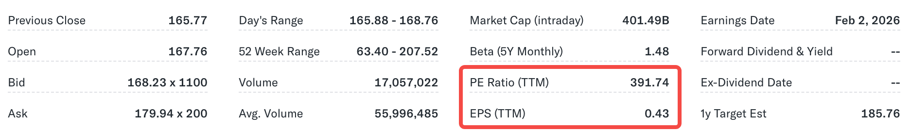

**市盈率（Price-to-Earnings Ratio，简称 P/E Ratio）**是衡量一只股票估值最常用的指标之一，它直接对比了股票的**价格**与公司的**盈利能力**。

1.  **它是什么？**
    市盈率简单来说就是：你为公司每赚取 **1 块钱利润**，需要支付多少钱（价格）。
2.  **它衡量什么？**
    市盈率反映了市场对一家公司的**预期**和**溢价**。举例来说，如果一只股票的 P/E 是 **20 倍**，这意味着投资者愿意以公司年度利润的 20 倍的价格购买这只股票。
3.  **它的作用？**
    它是一个快速的“体温计”，可以帮助你判断市场目前对这家公司的估值是高了还是低了，以及投资者对它未来的增长前景是**乐观**（P/E 高）还是**保守**（P/E 低）。

## 如何计算市盈率？

市盈率的计算非常直接，它将你为一股股票支付的价格，与这股股票所代表的公司年度盈利进行比较。

**计算公式：**

$$\text{市盈率} = \frac{\text{每股价格 (Price Per Share)}}{\text{每股收益 (Earnings Per Share, EPS)}}$$

**结果形式与意义：**

* 计算结果通常被称为一个**“倍数”（Multiple）**，例如 20 倍。
* 这个倍数揭示了市场正在如何评估该公司的利润。例如，市盈率是 **20 倍**意味着：
    * 你购买该股票的价格，是它每年所产生利润的 **20 倍**。
    * 在当前的盈利水平保持不变的情况下，该公司理论上需要 **20 年**才能赚回你购买股票所支付的全部金额。

市盈率越高，意味着投资者愿意为每一单位的公司利润支付越高的价格溢价。

### 什么是每股收益 (EPS)?

**每股收益（Earnings Per Share, 简称 EPS）**是一种投资指标，用于衡量公司在**每股股票基础上的盈利能力**。

* **目的：** 它允许投资者轻松理解一家公司在考虑到其总股本的情况下，每份股票实际对应了多少利润。
* **基本原则：** 一般来说，**EPS 值越高的公司，其每股盈利能力越强**。但这并不是衡量总盈利的绝对指标，而是**基于每股**的盈利衡量。

EPS 的计算公式是将公司的净利润，减去优先股股息（如果有），然后除以已发行的总股数：

$$\text{EPS} = \frac{\text{净收入} - \text{优先股股息}}{\text{总流通股数}}$$

* **净收入（Net Income）：** 有时也称为**利润（Profit）**或**收益（Earnings）**，指公司扣除所有费用后的总盈利。
* **如何查找数据：** 计算所需的净收入和总流通股数等数据可以在公司最新的**年度或季度财报**中找到，或通过雅虎财经（Yahoo Finance）等金融信息网站查看。

#### EPS 对投资者的重要性

EPS 是投资者用于比较不同公司盈利能力的**标准化指标**，即使这些公司的总利润和总股本规模不同，也可以通过 EPS 进行比较。

* **举例：** 假设公司 A 的总利润为 400 万美元，有 30 万股流通股；公司 B 的总利润为 5000 万美元，有 600 万股流通股。
    * A 公司 EPS：$4,000,000 / 300,000 = **$13.33**
    * B 公司 EPS：$50,000,000 / 6,000,000 = **$8.33**
* **结论：** 尽管 B 公司的总利润远高于 A 公司，但 A 公司的 **EPS 更高**。这意味着，投资者在 A 公司每投资一股，就有权获得比 B 公司更多的利润份额。

#### 影响 EPS 变化的因素

EPS 会随着时间推移而变化，主要受两个因素的影响：

**1. 公司的利润（Profits）**

* **利润增加：** 如果公司的流通股数不变，**利润增加**会导致 EPS **上升**。
* **利润减少：** 如果公司的流通股数不变，**利润减少**会导致 EPS **下降**。

**2. 总流通股数（Shares Outstanding）**

* **发行新股：** 如果公司的利润不变，**发行更多新股**（股数增加），会导致 EPS **下降**，因为相同的利润被更多的股份稀释。
* **回购股票：** 如果公司的利润不变，**回购股票（Stock Buyback）**会减少流通股数，从而导致 EPS **上升**。这是公司选择回购股票的一个主要原因。

故EPS 只是投资者可使用的众多指标之一，在评估股票时，应将其与其他财务指标并行使用。

#### 不同类型的EPS
基于不同的**计算的时间周期**和**计算方法**，EPS有不同的变体，这些变体决定了我们是看**过去的利润**还是**未来的预期利润**。

**基于时间周期的 EPS 变体**：

| EPS 类型 | 含义 | 用途与意义 |
| :--- | :--- | :--- |
| **TTM EPS** (Trailing Twelve Months) | **过去连续 12 个月的利润** | 这是**最常用**的指标，用于计算真实的、基于历史盈利的市盈率（P/E）。数据最新、最可靠。 |
| **年度 EPS** (Annual EPS) | **上一个完整财年**的利润。 | 官方财报中最常公布的数字。但可能比 TTM 稍微滞后。 |
| **预期 EPS** (Forward EPS) | **未来 12 个月**（或下一个财年）的预计利润。 | 这是分析师对公司未来盈利的**预测**。主要用于计算**预期市盈率（Forward P/E）**，反映市场对增长的定价。 |

如果你看到一家公司股价很高，但 **Forward P/E** 却比 **Trailing P/E** 低很多，这通常意味着市场强烈预期这家公司的利润在未来一年会大幅增长。

**基于计算方法的 EPS 变体**：

这些变体出现在公司的官方财务报表上，反映了计算的严谨程度。

| EPS 类型 | 含义 | 投资者意义 |
| :--- | :--- | :--- |
| **基本 EPS** (Basic EPS) | 使用**当前实际流通在外**的平均股份数量计算的 EPS。 | 这是最直接的盈利能力衡量。 |
| **稀释 EPS** (Diluted EPS) | 在基本 EPS 的基础上，假设公司所有具有潜在稀释性的证券（如可转换债券、股票期权等）都转换为普通股后，**增加股份数量**计算出的 EPS。 | 这是**更保守、更重要**的数字。因为潜在的股份增加会“稀释”（降低）每股的利润，投资者通常应关注这个数字，以避免高估公司的盈利。 |

在进行投资分析时，除非特殊说明，否则建议你始终关注并使用**稀释 EPS (TTM)**，因为它兼顾了数据的时效性、全面性和保守性。

### 案例：Palantir

#### 1. EPS (TTM)：盈利基础

**EPS (TTM) $0.43** 的含义是：

* **利润基础：** 在**过去连续 12 个月**内，Palantir 平均为每一股股票赚取了 **0.43 美元**的利润。
* **意义：** 这个数字是评估公司盈利能力的起点。尽管数字是正值（盈利），但 $0.43$ 相对其股价来说，是一个很小的利润额。

#### 2. PE Ratio (TTM) 391.74：估值解读

$PE\ Ratio\ (TTM) = 391.74$ 是一个**极高**的市盈率倍数。这个数字告诉了我们关于市场预期的关键信息。

##### 极高 P/E

市盈率是 $\frac{\text{股价}}{\text{利润}}$。当市盈率达到近 400 倍时，意味着以下两种情况之一正在发生：

1.  **利润太少：** 公司的利润（分母）刚刚转正或极低。如果 EPS（$0.43）很低，即使股价（分子）不算特别高，两者相除也会导致 P/E 值暴涨。
2.  **股价太高：** 市场对未来增长的预期非常强烈，将股价推到了一个极高的水平。

对于 Palantir 而言，这两点通常是同时成立的。

##### 市场预期解读

没有人会真的等待 391 年来“回本”。这个近 400 倍的市盈率传递了市场对 Palantir 的核心看法：

| 现象 | 结论 |
| :--- | :--- |
| **P/E 极高** | 市场对 Palantir **未来的利润增长**抱有极度乐观的预期。 |
| **定价逻辑** | 投资者现在支付的价格，完全不是基于它**过去一年**的 $0.43 利润，而是基于它未来几年内（如 5 年后）能赚取 $5、$10 甚至更多的巨额利润。 |
| **定位** | 市场将 Palantir 视为一家**高风险、高增长**的 AI/数据分析平台，投资者看重的是其技术垄断性、政府合同以及商业化转型的巨大潜力。 |

#### 总结：高期望，高风险

* **当前状态：** Palantir 正在盈利（EPS > 0），这为其估值提供了基础。
* **市场情绪：** 市场情绪处于极度乐观状态。一个 391 倍的 P/E 表明，投资者认为这是一家**“完美”**的公司，且预期其盈利将呈**爆炸式增长**。
* **投资风险：** 如此高的 P/E 意味着股价中已经包含了巨大的增长预期。一旦 Palantir 未能在接下来的季度中以市场预期的速度实现利润增长或合同签署，股价就可能面临巨大的回调压力。

对于 Palantir 而言，投资者购买的不是当前的利润，而是对**颠覆性技术和未来垄断地位的信仰**。

## P/E 价值与等待时间：人们真的愿意等这么久吗？

答案是：**投资者购买高 P/E 股票时，并非真的预期等待 20 年或 30 年才“回本”。** “回本时间”只是解释 P/E 倍数的一个**理论工具**，而不是实际的投资决策依据。

投资者愿意支付高 P/E（例如 30 倍）的核心原因有两点：

### 核心要素：盈利增长预期（Growth Expectation）

高 P/E 的股票通常被称为**成长股**。投资者愿意支付高溢价，是因为他们预期公司的盈利在未来几年内会**快速增长**。

* **假设的谬误：** “30 年回本”是基于公司未来 30 年利润**保持不变**的假设。
* **真实情况：** 如果一家公司利润每年增长 20%，那么它的有效回本期会大大缩短。投资者相信，未来的高利润会迅速摊薄当前的股价，使实际的 P/E 在几年内降到更合理的水平。

### 主要目的：资本增值（Capital Appreciation）

大多数股票投资者不是为了持有 30 年来收回利润，而是为了在几年后**以更高的价格卖出**。

* **投资逻辑：** 投资者预期公司业务会继续成功，市场会继续看好，从而推高股价。他们希望几年后能将股票卖给下一个愿意支付更高价格的投资者，从而实现资本增值。
* **总结：** 高 P/E 更多地反映了市场对公司未来发展前景的**信心**，而不是投资者对漫长等待期的容忍度。

## 如何解读市盈率的高低

**市盈率（P/E Ratio）不能直接进行比较，它有非常严格的前提条件和正确的方法。**

直接比较不同公司的 P/E 很容易得出错误的投资结论。

### 比较P/E Ratio 的前提条件

P/E Ratio 只有在满足以下一个或两个条件时，才具有比较意义：

#### 1. 行业必须相同（最重要的前提）

这是最关键的限制。你必须拿“苹果”去比“苹果”，不能拿一家科技公司去和一家能源公司比较。

* **原因：** 不同的行业有着截然不同的**增长率、风险和资本结构**。
    * **科技/成长股**（如软件服务）：通常有很高的增长预期，因此市场愿意支付 **高 P/E**（例如 40 倍）。
    * **公用事业/成熟股**（如电力公司）：增长稳定缓慢，风险低，因此市场只愿意支付 **低 P/E**（例如 15 倍）。
* **结论：** 如果一家科技股的 P/E 是 30，一家电力公司的 P/E 是 30，它们的含义是完全不同的。

#### 2. 公司处于相似的生命周期阶段

即使在同一行业内，一家初创的、高速扩张的公司（需要再投资，P/E 可能很高）和一家市场份额已经饱和的公司（现金流稳定，P/E 可能较低）也不宜直接比较。

### P/E Ratio 的正确比较方法

P/E 比较主要用于以下两种分析方法：

#### 1. 同业比较法（Peers Comparison）

这是最常用的方法，目的是判断一家公司在行业中是**被高估还是被低估**。

* **步骤：**
    1.  选择目标公司（A 公司）。
    2.  找出 3 到 5 家业务模式、规模和市场地位相似的**可比公司**（Peers）。
    3.  计算目标公司和所有可比公司的平均 P/E。
* **解读：**
    * 如果 A 公司的 P/E **远高于**行业平均 P/E，通常意味着市场预期 A 公司未来增长会**大幅快于**竞争对手。
    * 如果 A 公司的 P/E **远低于**行业平均 P/E，可能意味着 A 公司被市场**低估**了，或者市场对其未来的盈利能力存在担忧。

#### 2. 历史比较法（Historical Comparison）

这是判断公司**自身估值**是处于高位还是低位的方法。

* **步骤：**
    1.  收集目标公司**过去 5 年或 10 年**的 P/E 数据。
    2.  计算该公司的历史平均 P/E。
* **解读：**
    * 如果公司当前的 P/E **低于**其历史平均 P/E，可能表明公司现在相对便宜。
    * 如果公司当前的 P/E **高于**其历史平均 P/E，则可能表明公司现在相对昂贵。

简而言之：P/E 是一个强大的工具，但一定要放在**正确的语境**（同一行业或同一公司历史）下使用，才能得出有意义的结论。同时，市盈率的高低必须结合**盈利增长预期**来看。高 P/E 往往反映了市场对公司未来高增长的信心和定价，而低 P/E 可能意味着公司增长缓慢或停滞。

---

source：

[PE Ratio Explained Simply | Finance in 5 Minutes!](https://www.youtube.com/watch?v=dJPw1XmKA7Q)
[What Is EPS In Stocks? | Earnings Per Share Explained](https://www.youtube.com/watch?v=Mf2bHdpX4-s)