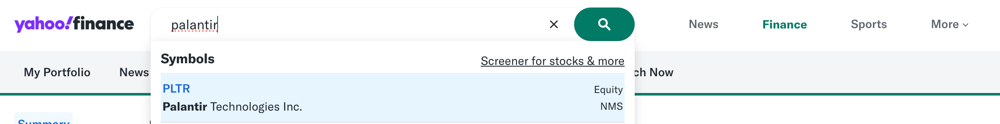
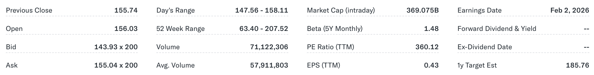
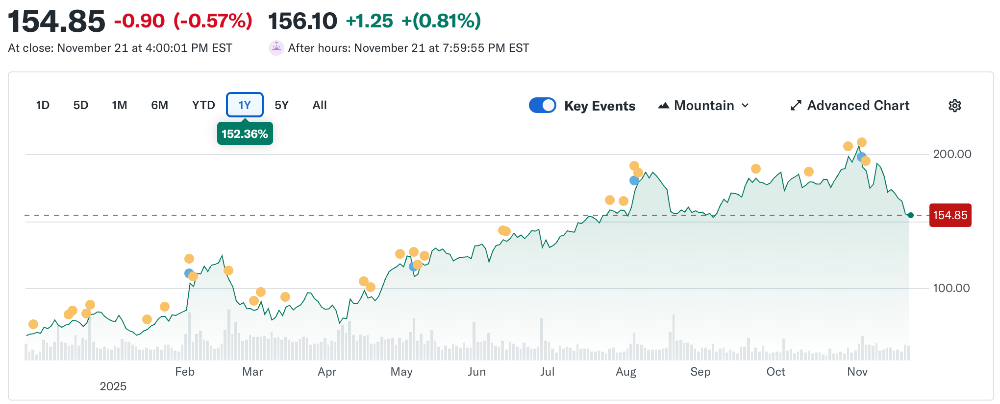
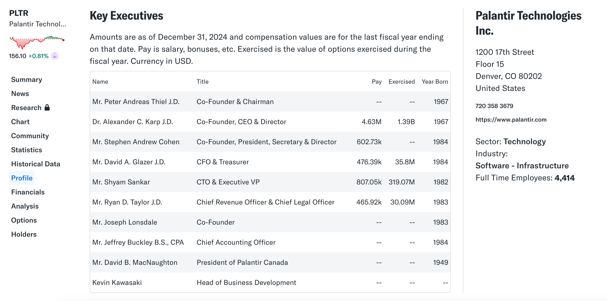
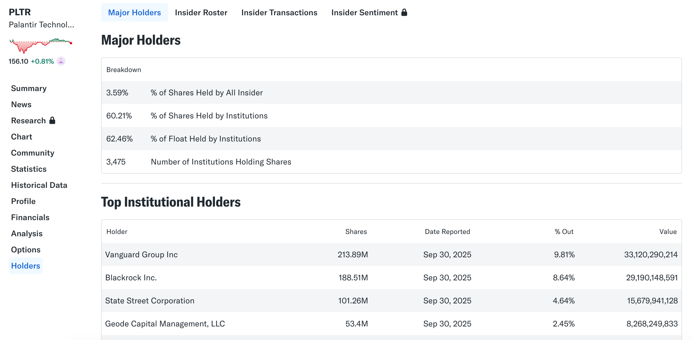

Welcome to the world of investing! When you first open a stock app or financial website, have you ever felt overwhelmed by the dense numbers, curves, and strange professional abbreviations (such as P/E, Beta, Volume) on the page?

For investment beginners, the first task in understanding a stock is to read that seemingly complicated **stock quote sheet**. Once you grasp the meaning of these data points, you can quickly judge a stock’s current value, market activity, and potential risk.

First, you need to look up the stock information of your target company. In the search bar at the top of [Yahoo! Finance](https://finance.yahoo.com/), enter the stock’s ticker symbol. In this article, we take [Palantir](https://finance.yahoo.com/quote/PLTR/) as an example:

## Price, Volatility, and Trading Activity

### Real-Time Price and Daily Volatility

| Indicator          | Palantir Example Data | Meaning                                                                                                                                                   |
| :----------------- | :-------------------- | :-------------------------------------------------------------------------------------------------------------------------------------------------------- |
| **Previous Close** | **$154.85**           | This is the last trading price at the end of the regular trading session (4:00 PM EST) on the day (November 21). It is also called the **current price**. |
| **Daily Change**   | **-0.89 (-0.57%)**    | This shows that the price of PLTR decreased by **0.89 USD** compared to the **previous trading day’s closing price**, a decline of **0.57%**.             |

* **Price:** Represents the most recent trade price reached between buyers and sellers at a given moment.
* **Daily change:** Provides volatility information. A positive number means the stock went up that day; a negative number means it went down. This percentage is the main indicator of the magnitude of price movement.

### Trading Hours and Daily Performance

| Indicator          | Palantir Example Data | Meaning                                                                                                                                                                 |
| :----------------- | :-------------------- | :---------------------------------------------------------------------------------------------------------------------------------------------------------------------- |
| **Previous Close** | **$155.74**           | This is the price at the close of the previous trading day. It is the **reference price** used for calculating the daily price change.                                  |
| **Open**           | **$156.03**           | This is the first trade price when the regular trading session begins at 9:30 AM EST.                                                                                   |
| **Day’s Range**    | **$147.56 - $158.11** | This is the **lowest price ($147.56)** and **highest price ($158.11)** that PLTR traded at during the regular session, showing how active the stock was during the day. |

**Understanding Pre-Market and After-Hours Trading:**

* **Data:** After-hours trading price is **$156.10 (+0.81%)**.
* **Meaning:** This indicates that PLTR’s price continued to fluctuate even after the regular session closed. As of 7:59 PM EST, the price had risen from $154.85 to **$156.10**.
* **Characteristics:** Pre-market/after-hours trading usually has **lower volume**, so price swings may be larger — but they do not fully represent the next day’s opening trend.

### Long-Term Price Range

| Indicator         | Palantir Example Data | Meaning                                                                                                      |
| :---------------- | :-------------------- | :----------------------------------------------------------------------------------------------------------- |
| **52-Week Range** | **$63.40 - $207.52**  | This is the **lowest price ($63.40)** and **highest price ($207.52)** of PLTR over the past year (52 weeks). |

* **Positioning:** This helps investors place the current price ($154.85) in a historical context. It shows that the current price is neither the lowest nor close to the highest, sitting in the mid-to-high range. A price near the 52-week low may indicate that the stock is “on sale” or undervalued, while a price near the 52-week high may indicate that it is “expensive” or overvalued.
* **Importance:** Investors often use this range to evaluate whether a stock is overbought or oversold.

Beginner investors are advised to focus on the **1-year (1Y)** and **5-year (5Y)** charts:

* **1-year chart:** Shows the stock’s performance over the past 12 months. It helps determine whether the price is generally **rising, falling, or moving sideways**, and whether there have been any **significant crashes or spikes**.

* **5-year chart (key for long-term investing):**

  * **Goal:** Choose companies that show a **stable long-term growth trend**.
  * **Evaluation criteria:** Does the stock show sustained long-term growth? After experiencing major declines, is it able to **rebound quickly** (showing resilience)?

For beginners, a good stock should demonstrate **continuous growth** and the ability to **recover quickly** from downturns.

## Market Size and Trading Liquidity (Assessing Risk)

### Market Cap

| Indicator      | Palantir Example Data | Meaning                                                                                               |
| :------------- | :-------------------- | :---------------------------------------------------------------------------------------------------- |
| **Market Cap** | **369.075B**          | B stands for Billion. Therefore, Palantir’s total market value is approximately **$369.075 billion**. |

Market cap (market capitalization) is the most important metric for measuring a company’s total value.

* **Calculation:** Stock price × total number of outstanding shares.
* **Understanding:** A $369B market cap shows that Palantir is a very large company. Market cap is the basis for measuring size and comparing it with other companies.

### Trading Volume

| Indicator       | Palantir Example Data | Meaning                                                                                  |
| :-------------- | :-------------------- | :--------------------------------------------------------------------------------------- |
| **Volume**      | **71,122,306 shares** | The total number of shares traded between buyers and sellers during the regular session. |
| **Avg. Volume** | **57,911,803 shares** | The average number of shares traded per day over a recent time period.                   |

* **Liquidity assessment:** Palantir’s daily volume exceeded 71 million shares, higher than average. This means the stock is **very liquid**, and investors can easily buy or sell it at the current market price without worrying about not having trading counterparts.
* **Risk of low volume:**
  If a stock’s volume is extremely low (close to zero), it lacks liquidity. Even if the price rises, you may not find a buyer, meaning you **cannot sell** your position, potentially trapping your capital. Beginners should avoid such low-volume stocks.

### Advanced Indicators

| Indicator             | Palantir Example Data | Meaning                                                                                                                                                                                                                |
| :-------------------- | :-------------------- | :--------------------------------------------------------------------------------------------------------------------------------------------------------------------------------------------------------------------- |
| **P/E Ratio (TTM)**   | **360.12**            | **The ratio of stock price to earnings per share.** This is a major valuation indicator. An extremely high P/E (e.g., above 300) usually means the market expects very high profit growth over the next several years. |
| **EPS (TTM)**         | **$0.43**             | **Net profit divided by total shares.** This shows how much net profit the company earns per share.                                                                                                                    |
| **Beta (5Y Monthly)** | **1.48**              | **Measures volatility relative to the market (e.g., S&P 500).** If Beta exceeds 1.0 (e.g., 1.48), it means the stock’s volatility is 48% higher than the market — high risk, high return.                              |

## Important Dates and Income Indicators

### Earnings Dates

This is the expected date when the company will release its financial results for the previous quarter, including revenue and profit.

Earnings releases often cause major stock price swings. Investors watch whether the company’s actual results beat or miss analysts’ general expectations.

### Dividends & Yield

* **Not all companies pay dividends:** A dividend is the distribution of part of a company’s profits to shareholders. Many **growth-oriented tech companies**, such as Palantir, usually reinvest all earnings into expansion and R&D, so they do not pay dividends.
* **Dividend yield:** Measures the investment return obtained from dividends. If a company pays dividends, this figure will appear.
* **Ex-Dividend Date:** For dividend-paying companies, this is the deadline by which an investor must buy and hold the stock to qualify for the next dividend.

### Special Note: Analyst Price Targets

| Indicator             | Palantir Example Data | Meaning                                                                                                                     |
| :-------------------- | :-------------------- | :-------------------------------------------------------------------------------------------------------------------------- |
| **1-Year Target Est** | **$185.76**           | This is the **average forecast** given by analysts tracking the company for its expected stock price in the next 12 months. |

Analyst target prices are only **opinions or estimates**, not guarantees. Beginners should not rely on these numbers for investment decisions. Always stick to your own independent research on fundamentals, valuation, and risk.

## Entry Points for Deeper Research (From Data to Story)

Once you have mastered basic data such as price, market cap, and liquidity, you can move on to the next stage of research. The goal is to **connect the data points with the company’s actual business story** and understand the company's future potential.

### Financials Overview

Financial statements are the **three pillars** of understanding a company’s health and the starting point of all fundamental analysis.

* **Understand the three statements:**

  * **Income Statement:** Reports whether the company made or lost money over a period (focus on revenue and net income).
  * **Balance Sheet:** Reports assets, liabilities, and shareholder equity at a specific moment (what the company owns and owes).
  * **Cash Flow Statement:** Reports cash inflows and outflows (the actual money the company can use).
* **Primary analysis goal:** For beginners, complex calculations are unnecessary. Simply do **high-level, horizontal comparisons**. Check historical data for Total Revenue and Net Income (usually over the past 4 years) and confirm whether they are showing a **healthy upward trend**. If so, it indicates the company is expanding.

### Charts and News

Charts record history, but news is the **real driver** of price changes.

* **Switch time ranges:** Use the time filters (such as 1 month, 6 months, 1 year) to observe long-term trends.
* **Research method:** When you see **abnormal price swings** on a chart (either spikes or drops), immediately look at the **news archive** for the same period. This helps you judge whether the movement was a **one-time event** or a **signal of deteriorating fundamentals**.

### Company Profile and Leadership

Data are facts, but leadership and business model are key factors that determine a company's future direction.

* **Understand background:** On the profile page, check the company’s **industry** and **sector**, which determine the industry standards and valuation methods applicable to the stock.
* **Understand the executive team:** Leadership is the foundation of a company’s value. Before investing, research the CEO and major executives — background, track record, and compensation. Strong leadership is a guarantee of long-term success.

### Holders

* **View holdings:** On the holders page, you can see which large institutions, mutual funds, or well-known investors own the stock.
* **Vote of confidence:** Heavy ownership by large institutional investors (often called “Smart Money”) is typically seen as a **vote of confidence** in the company’s future. If top institutions buy heavily, it can serve as a positive reference signal for your research.

