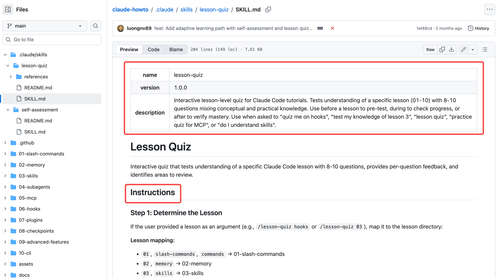

Claude Code 是 Anthropic 推出的 agentic（智能体）命令行工具，而 **Skills（技能）** 是其核心的扩展机制。

简单来说，**Skills 是一组打包好的指令、脚本和资源**，用于教导 Claude 如何以标准化的方式完成特定任务。

## 什么是 Claude Code 的 Skills？
在 Claude Code 中，Skills 就像是给 AI 增加的“专业插件”或“ SOP（标准作业程序）”。
* **本质**：它是存储在特定文件夹中的 Markdown 指令，有时还包含可执行脚本。
* **与项目的区别**："Claude Projects" 通常指的是 Claude.ai 网页版的一个功能，你可以把相关的文档、代码文件、技术标准上传到一个 Project 里，你可以为这个项目设置 "Custom Instructions" (自定义指令)。项目（Projects）通常提供静态的背景知识（如“这是我们的 API 文档”），而 Skills 提供的是**程序化知识**（如“按照这 5 个步骤生成 PR 描述”）。
* **核心价值**：避免你在每次对话中重复输入相同的偏好、流程或领域知识。

## Claude Code 的功能构成

在介绍Claude Code Skills的作用机制之前，我们有必要先理解 Claude Code 的功能构成。

Claude Code 的能力主要由以下 **三个技术模块** 共同驱动：

### 1. 原生系统工具
这是工具内置的底层能力，允许 Claude 直接与你的本地环境交互。
* **文件系统操作**：包括读取、搜索 (`grep`)、编辑和创建文件。
* **终端执行权**：Claude 可以直接在你的 Shell 中运行命令（如 `git`、代码构建命令或测试套件）。
* **权限模型**：它通过只读或读写权限控制，在受限的范围内操作本地资源。

### 2. 项目上下文配置文件 (`CLAUDE.md`)
这是一种基于文件的本地配置机制，用于定义特定项目的运行规则。
* **环境定义**：明确项目使用的构建系统（如 `npm`、`go build`）和测试命令。
* **规范约束**：存储编码风格、库使用偏好或架构决策，减少 AI 生成代码时的偏差。
* **自动化引导**：当 Claude 进入目录时，它会首先检索此文件以获取“项目操作说明”。

### 3. MCP 标准协议 (Model Context Protocol)
这是一种标准化的开放协议，用于实现与外部服务的能力集成。
* **互操作性**：通过连接到独立的 MCP 服务器（如 GitHub、Slack 或数据库连接器），扩展 AI 的数据边界。
* **动态发现**：Claude 会根据任务需求，动态查询已连接 MCP 服务器所提供的远程函数和资源。
* **解耦设计**：它允许用户在不修改 Claude Code 核心代码的情况下，通过添加新的协议节点来增加新功能。

| 组成部分 | 属性 | 数据流向 | 解决的问题 |
| :--- | :--- | :--- | :--- |
| **原生工具** | 内置功能 | 双向 (本地系统) | “如何操作我的文件和命令行？” |
| **CLAUDE.md** | 静态配置 | 单向 (输入给 AI) | “这个项目的开发规范和命令是什么？” |
| **MCP 协议** | 外部插件 | 双向 (远程/外部 API) | “如何获取项目之外的数据或调用第三方服务？” |

## Claude Code Skills的作用机制

Claude Code Skills是一种**基于文件系统的声明式指令集**。

### 1. 物理形态：结构化的 Markdown
在 Claude Code 中，一个 Skill 通常表现为一个包含 `SKILL.md` 的文件夹。它的内部结构受到严格定义：
* **Frontmatter (元数据)**：在 Markdown 顶部，用 YAML 定义 Skill 的名称、描述、触发词（Trigger Phrases）以及它需要的权限。
* **Instructions (指令区)**：核心部分。它不是简单的 Prompt，而是一套 **SOP（标准作业程序）**，规定了处理特定任务的算法逻辑或步骤。
* **Resources (资源区)**：Skill 文件夹内可以包含参考代码、Schema 定义或脚本，供 Claude 在执行任务时读取。



### 2. 运行机制：元工具（Meta-Tool）模式
Claude Code 处理 Skills 的方式被称为 **“渐进式加载（Progressive Disclosure）”**：
* **发现阶段**：启动时，Claude 只读取所有可用 Skill 的“摘要信息”（通常只有 30-50 个 token），这被视为一种“元工具”。
* **按需调用**：只有当你的需求命中了 Skill 的触发词，或者模型推理认为该 Skill 相关时，它才会通过一个内置的 `load_skill` 工具，将该 Skill 的**完整指令**注入到当前的上下文窗口中。
* **优点**：这种机制极大地节省了上下文带宽，防止因注入过多无关指令而导致的模型性能下降（Token 损耗）。

### 3. 技术分层：Skill 到底负责什么？
为了更好地理解Skills的作用，必须将其与另外两个核心组件区分开：

| 组件 | 技术本质 | 解决的问题 | 隐喻（仅供对比） |
| :--- | :--- | :--- | :--- |
| **MCP** | 协议/接口 (JSON-RPC) | 连接外部数据和 API 的**能力** | 人的“手” |
| **Skills** | **程序化知识** (Markdown) | 处理特定任务的**流程与策略** | 人的“专业经验” |
| **CLAUDE.md** | 静态项目配置 | 项目的**全局背景** | 人的“短期记忆” |

### 4. 触发与交互
在终端界面中，Skills 的存在感体现为：
* **斜杠命令**：你可以通过 `/skill-name` 显式强制加载某个技能。
* **意图拦截**：当你输入“帮我重构这个 API”时，Claude Code 会自动检测到这符合你定义的 `refactor-logic` 技能的元数据描述，从而自动启用它。

## 如何使用 Claude Code Skills？

Claude Code 的运行遵循一个名为 **“Agentic Loop”（智能体循环）** 的机制：
1.  **意图识别**：当你输入指令时，Claude 会检索可用的 Skills 列表。
2.  **动态加载（Progressive Disclosure）**：
    * 为了节省上下文窗口空间，Claude **不会**一次性加载所有 Skills。
    * 它只在判断某个 Skill 相关时，才动态加载其内容。
3.  **执行循环**：
    * **获取上下文**：读取相关文件和 Skill 指令。
    * **采取行动**：根据 Skill 提供的脚本或指令，运行终端命令、修改文件或调用 MCP 工具。
    * **验证结果**：Skill 通常包含验证步骤（如运行 linter 或测试），Claude 会根据结果决定是否继续。
4.  **记忆与持久化**：Claude 会根据 Skills 的执行过程自动生成“Auto-memory”，并将重要的项目规范保存在 `CLAUDE.md` 中，供下次参考。


## 如何创建或添加 Claude Code Skills？

Skill 本质上是一个遵循特定 Schema（架构）的 Markdown 文件夹。

### 1. 确定存储路径
Claude Code 会从两个位置检索 Skill 文件夹：
* **全局 Skill（跨项目可用）**：`~/.claude/skills/`
* **项目 Skill（仅当前项目可用）**：`[你的项目根目录]/.claude/skills/`

### 2. 创建 Skill 文件夹结构
每个 Skill 必须是一个独立的文件夹。假设你要创建一个名为 `security-audit`（安全审计）的技能：
```bash
mkdir -p .claude/skills/security-audit
touch .claude/skills/security-audit/SKILL.md
```

### 3. 编写 `SKILL.md` (核心定义)
`SKILL.md` 文件必须包含符合规范的 **YAML Frontmatter**。这是 Claude Code 能够“发现”该技能的关键。

**模板示例：**
```markdown
---
name: "Security Audit"
id: "security-audit"
description: "用于扫描代码中的硬编码密钥、SQL 注入风险和过时的依赖项。"
triggers: ["audit security", "check vulnerabilities", "scan for secrets"]
tools_required: ["grep", "ls", "read_file", "mcp:github-advisory-database"]
version: "1.0.0"
---

# 技能执行指令 (Instructions)

当你执行此技能时，请严格遵守以下步骤：

1. **静态扫描**：使用 `grep` 在所有配置文件和环境变量文件中搜索关键词（如 "key", "secret", "password"）。
2. **依赖分析**：读取 `package.json` 或 `requirements.txt`，并调用 `mcp:github-advisory-database` 工具检查已知漏洞。
3. **逻辑审查**：重点检查所有数据库查询语句，确保使用了参数化查询。
4. **输出报告**：在项目根目录生成 `SECURITY_REPORT.md`，列出风险等级和修复建议。
```

### 4. 加载与刷新
添加文件后，你不需要重新编译任何东西，但需要让 Claude Code 重新索引：

* **自动索引**：在大多数情况下，当你重新启动 Claude Code 会话时，它会自动扫描 `.claude/skills/` 目录。
* **手动刷新**：在终端输入 `/reload-skills`。

### 5. 如何验证 Skill 已生效
在 Claude Code 的命令行界面中，你可以通过以下方式确认：
1.  **查看列表**：输入 `/skills`，你应该能在输出列表中看到 `security-audit`。
2.  **测试触发**：直接说：“对当前项目执行 check vulnerabilities”，Claude 应该会响应：“正在加载 Security Audit 技能...”，并开始执行 `SKILL.md` 中定义的步骤。

### 一些需要注意的技术要点
* **原子性**：一个 Skill 应该只解决一个特定的、可重复的工作流问题。
* **工具绑定 (`tools_required`)**：如果你在 Frontmatter 中声明了某个 MCP 工具，而当前环境未配置该 MCP，Claude 会在使用技能前提示你安装缺失的依赖。
* **动态注入**：与 `CLAUDE.md` 不同，Skill 的详细指令不会在会话开始时就占据上下文（Context Window），只有在命中 `triggers` 时，这部分 Markdown 内容才会被动态加载到模型内存中。

