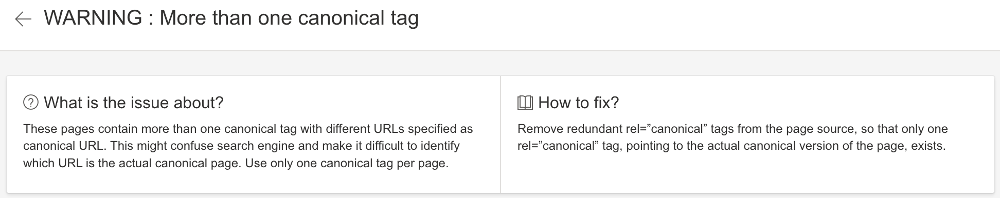
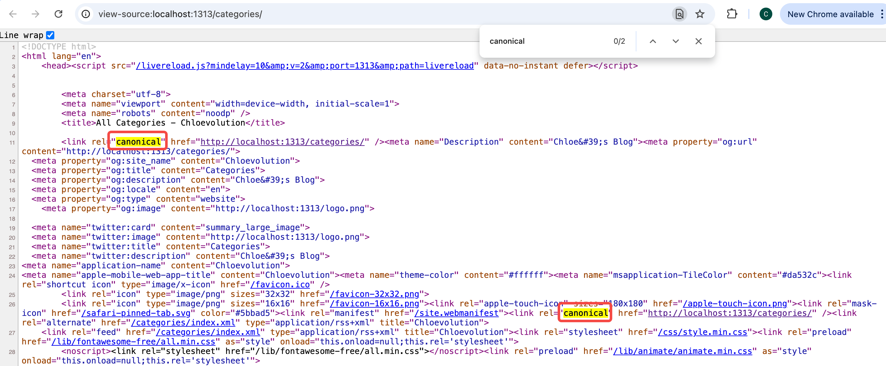
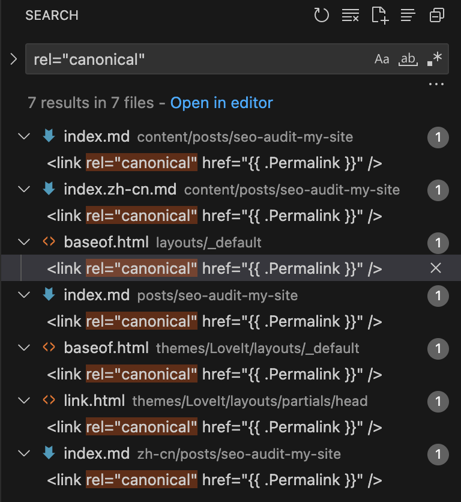
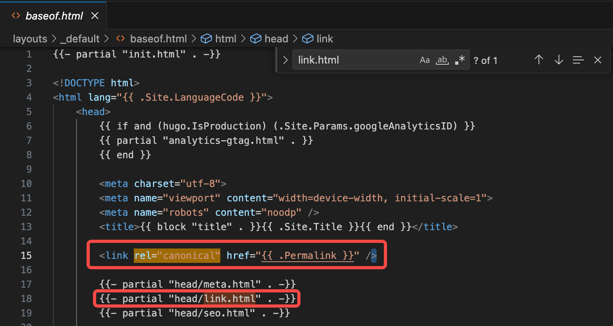
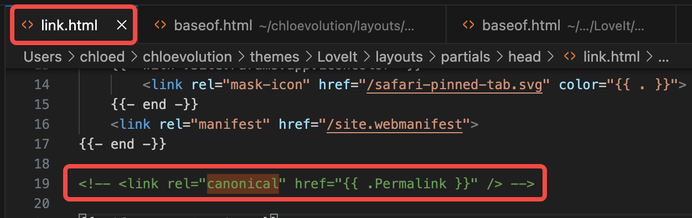
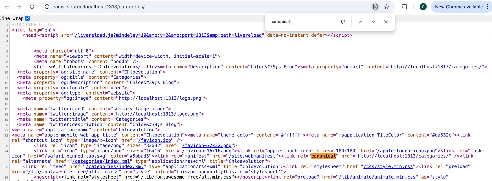

## 超过一个canonical标签
用Bing自带的检测工具检查了一下网站，报告提示存在“More than one canonical tag”的问题：



“More than one canonical tag” 的意思是：我网站的某个页面中包含了多个` <link rel="canonical"> `标签，而一个页面应该只包含一个 canonical 标签来明确指示搜索引擎哪一个 URL 是该内容的首选版本。

于是我随机挑选了一个页面，检查源代码，发现确实同时存在两个重复的`canonical`标签，虽然指向的是同一个 URL，但从 SEO 规范上讲，它依然是一个问题：


这种情况常见于以下几种情形：

- 页面模板（如 HTML 模板、React 组件、Next.js 的 `<Head>`）

- 静态页面构建器（如 Hugo、Gatsby、Jekyll）自动插入了一次

- 又手动加了一次（例如你自己加了一行 `<link rel="canonical">`）

我的网站是用Hugo和GitHub Pages搭建的，而Hugo会自动生成 canonical 标签。默认情况下，Hugo 会在我启用了 `<head>` 的模板中自动插入一条 canonical 标签，例如：
```gohtml
{{- if .Permalink -}}
<link rel="canonical" href="{{ .Permalink | safeURL }}">
{{- end -}}
```

但是，如果我又在模板中手动添加了一条，或者用了某些主题，主题里也写了一条，那么就会出现我在前面所说的：
页面中有两个 `<link rel="canonical">` 标签，尽管 href 相同。

但是我怎么知道重复的 canonical 标签在哪个文件呢？我选择在VS Code里直接进行全文搜索：



重复的标签存在于以下三个文件里：

- `layouts/_default/baseof.html` → 我自己项目的模板

- `themes/Lovelt/layouts/_default/baseof.html` → 主题自带的模板

- `themes/Lovelt/layouts/partials/head/link.html` → 主题中分离的 head 片段

很明显，我需要删除其中一个`baseof.html`中和 canonical标签相关的代码。此处，我们需要考虑 Hugo 模板的优先级：在 Hugo 中，如果你在项目目录下有和主题中同名的模板文件，项目目录的那个会被使用（优先级更高）。
但是需要注意，这只适用于单个文件的“整体替换”，不会影响 partial 文件是否仍被你的模板显式引用！
举例来说，如果你自己项目的 `layouts/_default/baseof.html` 中显式调用了：
```gohtml
{{ partial "head/link.html" . }}
```
那么即使主题自带 `baseof.html` 被“覆盖”了，你仍然通过 partial 引用了主题中的 `link.html`，它依然会执行，仍然会插入一条 canonical 标签。

考虑到我之前已经在自己项目的模板里添加了自定义代码，所以我选择删除`themes/Lovelt/layouts/_default/baseof.html`中关于`link.html`的引用代码：



另外，删除`link.html`中对canonical标签的引用：


推送代码到线上环境后，可以看到源代码里已经没有重复的 canonical 标签了：


## Duplicate without user-selected canonical
在我解决完前面提到的“重复canonical标签”的问题之后，Google Search Console提示我有页面索引的新问题：Duplicate without user-selected canonical

这个问题是：某些页面（比如 `/tags/obsidian/`）被 Google 判断为重复内容，而我却 **没有明确声明哪个是 canonical（主页面）**。

等我实际访问这个页面时，发现更大的问题在于： 打开`/categories/xxx/` 或 `/tags/xxx/` 这种具体分类/标签子页面时，页面显示的是 XML 内容（RSS），而非正常的 HTML 页面。但`/categories/` 和 `/tags/` 这类顶级列表页面又是能正常显示的。

出现这种情况的原因是：缺少 `layouts/taxonomy/term.html` 模板（或 `_default/terms.html`） 的 fallback 无法正确渲染 HTML

Hugo 在渲染如 `/categories/xxx/` 的子目录时：
1. 会优先找 `layouts/taxonomy/term.html`
2. 若没有，会 fallback 到 `layouts/_default/term.html`
3. 若还没有，再看 `themes/loveit/layouts/taxonomy/term.html`
4. 如果最终没有 HTML 模板，就只会生成 RSS/XML（尤其当启用了 RSS 输出）
所以，问题就是这个模板没定义，导致只生成了 XML 输出。

解决方法如下：
1. 添加 `layouts/taxonomy/term.html` 模板
在你的 Hugo 项目目录下创建文件：`layouts/taxonomy/term.html`
具体的代码根据你使用的Hugo模板来决定。一开始我是让ChatGPT帮我写的，但是预览的样式很奇怪。所以我又让它参考`list.html`的样式重新写了一版，非常完美。

**term.html和terms.html有什么区别？**
| 文件名          | 对应页面                                | 用途            | `.Data.Terms` 是否可用            |
| ------------ | ----------------------------------- | ------------- | ----------------------------- |
| `terms.html` | `/categories/`、`/tags/`             | 分类/标签「汇总页」    | ✅ 可用                          |
| `term.html`  | `/categories/ai/`、`/tags/obsidian/` | 某个分类/标签的文章列表页 | ❌ 不可用，只能用 `.Pages`、`.Title` 等 |


这两个模板负责**不同层级的数据结构**，所以**不能直接复制 `terms.html` 到 `term.html`**，会导致页面渲染失败或不显示内容。


2. 检查 `config.toml` 中的输出配置
确认你的配置中 taxonomy 相关类型未被禁用：
```toml
[outputs]
  home = ["HTML", "RSS"]
  taxonomy = ["HTML", "RSS"]
  term = ["HTML", "RSS"]
```
如果缺少 `HTML`，Hugo 将不会生成 HTML 页面，而只输出 XML/RSS。 

然后你就可以在预览环境中检查页面是否可以正常打开。我在这个过程中碰到了一个问题：页面不再显示 XML 内容了，但是只有导航栏和底栏，其余部分是空白的。然后我检查了一下代码，发现是AI给我写的代码有一处bug：我的 `baseof.html` 没有正常渲染。
出现这种情况的原因：`baseof.html` 用的是 `{{ block "content" . }}`，而AI写的 `term.html` 中用了 `{{ define "main" }}`。

> **那么“main” 区块永远不会被渲染出来**，因为 `baseof.html` 没有调用 `main`，它只渲染了 `content`。

所以需要修改 `term.html` 中的 block 名称为 `"content"`，然后预览页面就能正常显示了。