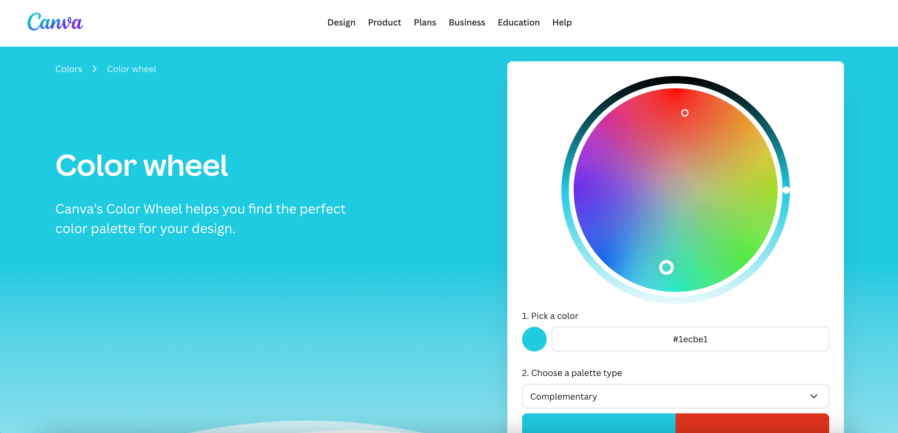
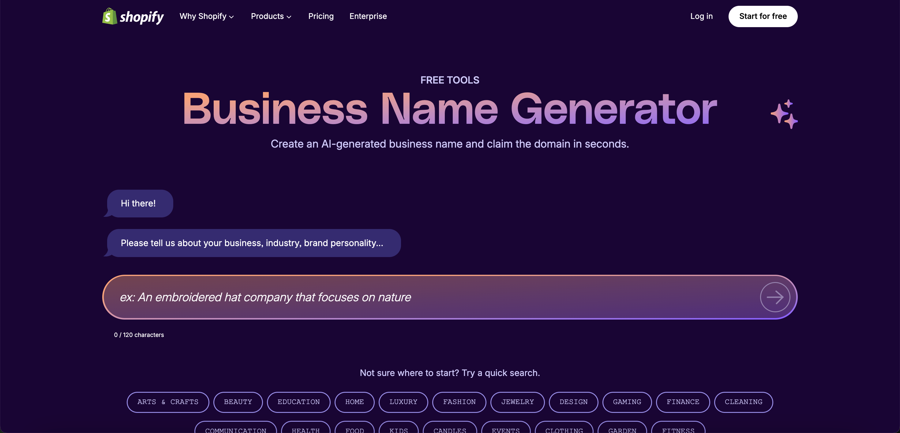
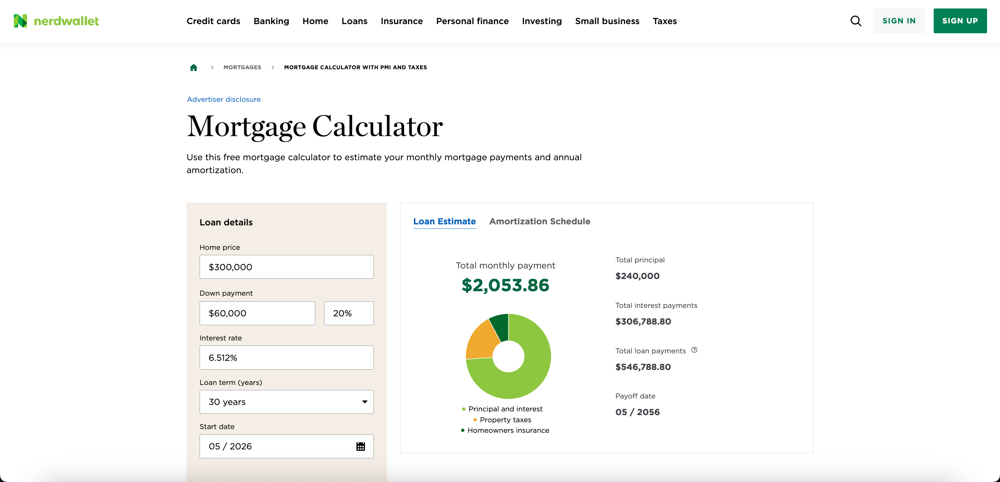

You're designing your first poster and want to understand "what is a color wheel." You search, click the first result—Canva's color theory page.

On the right side of the page is a colorful circle. You casually click on orange, and the screen immediately shows that its complementary color is blue. Interesting. You try purple and see yellow. Then you start wondering: what does triadic color scheme look like? What about analogous colors?

Before you know it, 5 minutes have passed.

This is completely different from your usual blog reading experience. You're not just reading—you're **exploring**.

When we talk about SEO, most people focus on keyword density, title tags, and backlinks. But there's a category of pages that have built competitive advantages through a completely different approach—**getting users to actively participate**.

Users don't just scroll and read; they click, explore, experiment, and use. They invest time on the page, engage in multiple interactions, and even bookmark the page for repeated use. This deep engagement translates into powerful SEO signals: longer dwell time, lower bounce rate, higher repeat visit rate—principles that align with [content engineering](https://chloevolution.com/posts/content-engineering/) frameworks.

In this article, I'll introduce three real-world cases:

- **Canva Color Theory Page**: A color wheel—why does it keep users engaged for 5 minutes?
- **Shopify Business Name Generator**: An input box—why do users remember this tool?
- **NerdWallet Mortgage Calculator**: A bunch of parameters—why do users use it repeatedly?

Three different interaction patterns, all backed by similar user engagement strategies—an approach paralleling [Canva's broader SEO strategy](https://chloevolution.com/posts/canva-seo-strategy/) of combining utility with user-generated value.


## Educational Interaction: Canva Color Theory Page

### Page Structure

When you open [Canva's color wheel page](https://www.canva.com/colors/color-wheel/), the above-the-fold design is extremely simple:

- Main heading: "Color wheel"
- Subheading: "The color wheel shows the relationships between colors"
- An interactive color wheel occupying the visual focus
- No other distracting elements



This design reduces cognitive load. You don't need to think "what should I do"—the color wheel is right there, waiting for you to click.

But the real depth is below.

**Long-Page Knowledge System**

Canva organizes color theory into a complete knowledge system, arranged on a long page in logical order from basic to advanced:

```
Color theory and the color wheel (Color Theory Basics)
↓
Color palette types (Color Palette Overview)
  → Complementary
  → Monochromatic
  → Analogous
  → Triadic
  → Tetradic
↓
Primary, secondary and tertiary colors (Color Classification)
↓
Warm and cool colors (Warm and Cool Tones)
↓
Shades, tints and tones (Brightness and Saturation)
↓
Hue, Saturation and Luminance (Color Parameters)
↓
Color meanings and color schemes (Extended Reading)
```

This is a carefully designed learning path: from basic concepts to color palette types, from color classification to color attributes, from theory to application. Users browse by scrolling, learning at their own pace.

What does this content depth bring? **17,228 keyword coverage**.

When you deeply explain a topic, you naturally cover all related concepts. Google understands these semantic relationships and ranks this page for related search terms.

### Interaction Mechanism Design

The color wheel looks simple, but its functionality is precise:

- Click any color → Display color schemes for that color
- Real-time display of complementary, analogous, triadic colors, etc.
- Visual presentation of color relationships, no text explanation needed

This is a model of **light interaction**.

Only 1 main interactive element. No input required, no forms to fill, no registration needed. Click and immediately see the effect.

The color wheel appears above the fold, lowering the participation threshold. But its value is continuously reinforced throughout the page:

- Above the fold: See the color wheel, try clicking
- After learning complementary color theory: Return to the color wheel to verify
- After learning triadic colors: Try different colors again
- After learning all theory: Use the color wheel to create your own color scheme

This is a **learn-practice-relearn** cycle. Interaction serves learning rather than dominating the experience.

### How to Attract User Engagement

**1. Progressive Information Disclosure**

Canva doesn't pile all information above the fold. Instead, it lets users learn at their own pace:

- Above the fold only shows core concepts
- Scroll to where you want, learn what you need
- Each section is independently complete, can be skipped

This aligns with human cognitive patterns. Our brains are better at processing chunked information rather than receiving large amounts of content at once.

**2. Zero-Barrier Interaction Design**

Clicking the color wheel requires no preparation:

- No input required
- No parameter selection needed
- No instructions to read

See the color wheel → Click → Immediately see the effect. This instant feedback creates a positive loop: click → discover → curiosity → click again.

**3. Encourage Exploration and Multiple Attempts**

The color wheel has 360 degrees of colors to choose from, meaning infinite combination possibilities.

User mental activity goes like this:

- "What's the complementary color of red?" (Click red)
- "Does blue's triadic color scheme look good?" (Click blue)
- "Are purple and yellow really complementary colors?" (Verify theory)
- "I want to find a warm color scheme." (Try orange tones)

Each click is a discovery. This joy of exploration keeps users engaged longer.

**4. Natural Conversion Path**

Canva's conversion design is very clever:

```
Learn color theory
→ Try interactive color wheel
→ Find a color scheme you like
→ Want to use this color scheme
→ See "Export palette" button
→ See "Create a design with Canva" button
→ Click to enter Canva editor
```

The key is **timing**.

When users have already invested 3-5 minutes learning color theory and have found a color scheme they like, the next step is naturally "I want to do something with this color scheme." The CTA that appears at this moment is not an interruption, but a continuation of the user's intent.

## Tool-Type Interaction: Shopify Business Name Generator

### Page Structure

[Shopify's business name generator](https://www.shopify.com/tools/business-name-generator) has a minimalist above-the-fold design:

- Main heading: "Business Name Generator"
- Subheading: "Create an AI-generated business name and claim the domain in seconds."
- An input box with placeholder text: "ex: An embroidered hat company that focuses on nature"
- Chat bubble prompt: "Please tell us about your business, industry, brand personality..."




No complex forms, no extra options. Enter a description, click generate—that simple.

**Content Organization: Tool First, Content Supporting**

```
Tool Area (Above the fold)
├─ Input box
├─ Generate button
└─ Quick search tags (Arts & Crafts, Beauty, Education...)

Supporting Content (Below)
├─ Name your business in 10 seconds or less (Quick naming guide)
├─ Sample business name ideas to inspire you (Example names)
└─ What makes Shopify merchant names successful? (Success cases)
```

The tool occupies the above-the-fold area, with content supporting below. Similar to Canva, Shopify also uses an interaction-first design. The difference is in content depth: Canva provides 9 sections of complete educational content, while Shopify's content is lighter, mainly usage guides and cases.

### Dual-Layer Vertical Segmentation Strategy

Shopify's traffic strategy is not a single tool, but a **multi-tool matrix + single-tool segmentation** dual-layer structure.

**First Layer: Multi-Tool Matrix (different tools under /tools/)**

| Tool Type | URL | Traffic Share | Monthly Traffic |
|---------|-----|---------|--------|
| Slogan Maker | /tools/slogan-maker | 20.84% | 11,865 |
| Profit Calculator | /tools/profit-margin-calculator | 16.36% | 9,316 |
| **Business Name Generator** | **/tools/business-name-generator** | **14.56%** | **8,289** |
| Logo Maker | /tools/logo-maker | 8.40% | 4,784 |
| AI Store Builder | /tools/ai-store-builder | 6.09% | 3,468 |
| Barcode Generator | /tools/barcode-generator | 5.73% | 3,265 |

**Second Layer: Single-Tool Industry Segmentation (business-name-generator subpages)**

| Type | URL | Traffic Share | Monthly Traffic |
|------|-----|---------|--------|
| **Style-based** | /business-name-generator/funny | 1.16% | 664 |
| | /business-name-generator/cool | 0.21% | 124 |
| **Food Industry** | /business-name-generator/food-truck | 0.70% | 401 |
| | /business-name-generator/cake | 0.56% | 322 |
| **E-commerce/Retail** | /business-name-generator/clothing-store | 0.43% | 246 |
| | /business-name-generator/tech | 0.31% | 181 |
| | /business-name-generator/boutique | 0.18% | 107 |
| | /business-name-generator/t-shirt | 0.18% | 105 |
| **Beauty/Personal Care** | /business-name-generator/beauty | 0.12% | 69 |
| | /business-name-generator/hair | 0.09% | 52 |
| | /business-name-generator/candle | 0.08% | 48 |

*Note: Traffic share is relative to total /tools/ folder traffic*

1. **Horizontal Expansion**: Create multiple different types of tools (slogan-maker, logo-maker, profit-calculator), covering different needs of entrepreneurs—similar to programmatic approaches in [how fintech makes money](https://chloevolution.com/posts/how-does-fintech-make-money/) through tool diversification
2. **Vertical Deep Dive**: Create 60+ industry segmentation pages under a single tool, precisely matching long-tail searches
3. **Traffic Accumulation Effect**: business-name-generator main page 14.56% + all subpages cumulative ~5-6% = total ~20% traffic
4. **Scalable Production**: Same technical architecture, generating different tools and different industry pages through URL parameters, low development cost but wide coverage

### Interaction Mechanism Design

**Instant Feedback**

Enter keyword → Click generate → Results displayed within 2 seconds.

Results are displayed in list format, usually 10+ options, providing variety. Each name has a "Check availability" button next to it, allowing immediate domain availability check.

**Encourage Multiple Attempts**

- Unlimited generations, no usage limit
- AI generates different names each time
- Quick iteration: Enter new keyword → Generate immediately

User mental activity:

- "Let's try what 'coffee' generates"
- "Try 'organic coffee' again"
- "What if I add 'roastery'?"
- "Let's try a different word 'artisan coffee'"

Each attempt might bring a surprise. This exploration process keeps users engaged longer.

### How to Attract User Engagement

**1. Zero-Barrier Design**

Only need 1-2 keywords, no complex forms, no registration required. Clear action guidance reduces decision cost.

**2. Instant Gratification**

See results within 2 seconds, 10+ options provide variety. The "Check availability" button next to each name allows users to immediately take the next action.

**3. Joy of Exploration**

AI generates different names each time, adding uncertainty and joy of exploration. Users wonder: "What if I change the word?" "Will generating again give me something better?"

This psychology drives users to make multiple attempts. Estimated users will try 3-5 different keywords, with total interactions of 15-30 times.

**4. Complete Solution**

Shopify doesn't just generate names, it also provides:

- Domain availability check
- Naming guide (how to choose a good name)
- Industry category suggestions
- Direct entry to create a store

Conversion path reflects [integrated marketing](https://chloevolution.com/posts/how-to-make-integrated-marketing-strategy/) principles:

```
Enter keyword
→ Generate name list
→ Find a name you like
→ Check domain availability
→ Domain is available
→ Want to register this domain
→ See "Start free trial"
→ Create Shopify store
```

Users have already found a satisfactory name, and the domain is available. The next step is naturally to create a website, and Shopify provides a one-stop solution.


## Calculator-Type Interaction: NerdWallet Mortgage Calculator

### Page Structure

[NerdWallet's mortgage calculator](https://www.nerdwallet.com/mortgages/mortgage-calculator) uses a left-right split layout:

- Left side: Input form (parameter control area)
- Right side: Results display (real-time feedback area)
- Clear visual separation



Suppose you're looking at a $500,000 house and want to know the monthly payment:

1. **First Use (Beginner Mode)**
   - Enter home price: $500,000
   - Enter down payment: $100,000 (20%)
   - Select loan term: 30 years
   - Enter interest rate: 6.5%
   - Right side immediately shows: Monthly payment $2,528

2. **Deep Exploration (Professional Mode)**
   - Click "Advanced options"
   - Add property taxes: $500/month
   - Add homeowners insurance: $150/month
   - Right side updates: Total monthly payment $3,178
   - Pie chart shows: Principal+Interest $2,528 (80%), Taxes+Insurance $650 (20%)

3. **Scenario Comparison**
   - Adjust down payment to 10% ($50,000)
   - Monthly payment immediately changes to $3,900 (because PMI is required)
   - Comparison reveals: Paying 10% more down payment saves $722/month

Throughout the process, users can adjust any parameter at any time, and results update in real-time. This instant feedback allows users to quickly understand the impact of different decisions.

**Layered Parameter Design**

```
Basic Parameters (Expanded by default)
├─ Home price
├─ Down payment
├─ Loan term
└─ Interest rate

Advanced Parameters (Collapsed under "Advanced options")
├─ Property taxes
├─ Homeowners insurance
├─ HOA fees
└─ PMI (Private Mortgage Insurance)

Results Display
├─ Monthly payment (Total monthly payment)
├─ Pie chart (Monthly payment breakdown)
└─ Amortization schedule
```

This design reduces cognitive load for first-time use. Beginners only need to fill in 4 basic fields, while professional users can expand advanced options.


### Interaction Mechanism Design

**Real-Time Calculation Feedback**

Adjust any parameter → Results update immediately.

No need to click a "Calculate" button. Slider interaction makes adjusting values more intuitive; you can see the monthly payment change while dragging the slider.

**Data Visualization**

- Pie chart shows monthly payment breakdown (principal, interest, taxes, insurance)
- Clear color coding
- Mouse hover shows detailed data

**Scenario-Based Calculation**

Users can quickly compare different scenarios:

- 30-year vs 15-year loan
- 20% vs 10% down payment
- Impact of different interest rates

Each parameter adjustment is a scenario simulation.

### How to Attract User Engagement

**1. Progressive Information Disclosure**

Above the fold only shows 4 required fields, with advanced options collapsed under "Advanced options". Beginners won't be scared off by complex parameters, while professional users can expand advanced options.

**2. Real-Time Feedback Mechanism**

Feedback speed: Real-time update, no delay.

Feedback richness: Not just a number, but also pie charts, amortization schedules, detailed breakdowns.

Feedback comparability: Can quickly try different parameters and compare different scenarios.

**3. Visualization Reduces Understanding Cost**

Pie chart shows monthly payment breakdown: See the proportion of each expense at a glance.

Amortization schedule visualization: Use charts to show changes in principal and interest, understand long-term trends.

Clear color coding, easy to understand.

**4. Encourage Parameter Adjustment and Exploration**

Slider interaction: More interesting than entering numbers, can quickly try different values.

Real-time feedback: Adjust parameters → Immediately see impact, establish understanding of cause and effect.

Scenario comparison: 30-year vs 15-year loan, 20% vs 10% down payment, impact of different interest rates.

User mental activity:

- "If I pay 5% more down payment, how much will the monthly payment decrease?"
- "How much higher will the monthly payment be for a 15-year loan?"
- "How much is PMI per month?"
- "If the interest rate drops 0.5%, how much can I save?"

Each adjustment is a discovery.

**5. Natural Conversion Path**

```
Enter home price and down payment
→ Calculate monthly payment
→ Adjust parameters to compare scenarios
→ Understand monthly payment breakdown
→ Want to apply for a loan
→ Scroll to the bottom of the page
→ See recommended loan products
→ Click "View details" or "Apply"
```

Users have already completed the calculation and understand their affordability. The next step is naturally to find loan products, and NerdWallet provides recommendations and comparisons.


## Comparison and Insights of Three Patterns

We've looked at three cases, three different interaction patterns. Now let's compare them together and discover some interesting patterns.

### Core Difference Comparison

| Dimension | Canva Color Theory | Shopify Business Name Generator | NerdWallet Mortgage Calculator |
|------|----------------|----------------------|------------------------|
| **Interaction Type** | Educational interaction | Tool-type interaction | Calculator-type interaction |
| **Interaction Complexity** | Light interaction (click color wheel) | Light interaction (enter keyword) | Heavy interaction (multi-parameter adjustment) |
| **Content Depth** | Deep educational content | Light guide content | Medium explanatory content |
| **User Goal** | Learn color theory | Quickly generate names | Compare loan scenarios |
| **Conversion Path** | Learn → Explore → Create design | Generate → Like → Register and use | Calculate → Understand → Apply for loan |
| **SEO Strategy** | Single-page deep coverage | Dual-layer vertical segmentation matrix | Ultra-long-tail keyword combination |
| **Traffic Structure** | Concentrated (96.3% non-brand terms) | Distributed (50%+ brand terms) | Concentrated (59% brand terms) |
| **Keyword Strategy** | Semantic coverage (deep content) | Vertical segmentation (60+ subpages) | Feature combination (94.5% low search volume terms) |

### Common Success Factors

Despite obvious differences in the three patterns, they all follow the same underlying principles:

**1. Instant Feedback Mechanism**

- Canva: Click color wheel → Immediately display color scheme
- Shopify: Enter keyword → Generate name list within 2 seconds
- NerdWallet: Adjust parameters → Real-time update monthly payment amount

What you see is what you get, no waiting, no loading.

**2. Progressive Design**

- Canva: From simple color wheel interaction to in-depth color theory
- Shopify: From basic input to industry segmentation selection
- NerdWallet: From 4 basic parameters to expanding advanced options

Let users start first, then gradually guide them deeper.

**3. Zero-Barrier Participation**

- No registration required to use core features
- No learning required to start operating
- No commitment required to get value

Reduce the psychological cost of first use.

**4. Joy of Exploration**

- Canva: 360-degree color wheel, infinite color combinations
- Shopify: AI generates different names each time, adding uncertainty
- NerdWallet: Slider interaction, quickly try different values

Each interaction is a small discovery, encouraging users to try multiple times.

**5. Natural Conversion Timing**

Not popping up to ask for registration as soon as you enter the page, but:

- Users have already explored color theory → Want to create designs
- Users have already found a name they like → Want to save and use it
- Users have already calculated monthly payment → Want to apply for a loan

After users have gained value, conversion requests seem reasonable.

### How to Choose the Right Pattern?

Different content types and user needs suit different interaction patterns.

**Educational Interaction (Canva Pattern)**

Applicable scenarios:
- Topics that need to establish cognition and understanding
- Complex concepts that need visual aids
- Users willing to spend time learning in depth

Typical applications:
- Design principles (color, typography, composition)
- Technical concepts (algorithms, architecture, protocols)
- Scientific knowledge (physics, chemistry, biology)

Key elements:
- Combination of interaction + deep content
- Learning path from simple to complex
- Encourage exploration and experimentation

**Tool-Type Interaction (Shopify Pattern)**

Applicable scenarios:
- Solve specific, clear problems
- Users need to get results quickly
- Can expand traffic through vertical segmentation

Typical applications:
- Generator tools (names, slogans, logos)
- Conversion tools (format conversion, unit conversion)
- Detection tools (SEO detection, speed testing)

Key elements:
- Simple input, instant output
- Results can be saved and shared
- Vertical segmentation strategy (industry, scenario, use)

**Calculator-Type Interaction (NerdWallet Pattern)**

Applicable scenarios:
- Need to compare multiple scenarios
- Involves complex numerical calculations
- Assist users in decision-making

Typical applications:
- Financial calculations (loans, investments, taxes)
- Cost estimation (renovation, travel, projects)
- Scenario comparison (packages, configurations, plans)

Key elements:
- Layered parameter design (basic + advanced)
- Data visualization (charts, comparisons)
- Real-time calculation feedback

### The Essence of SEO Advantage

All three cases achieved excellent SEO performance, but not because of the superficial feature of "having interaction."

What really works is:

**User Engagement Creates Real Signals**

Interaction transforms users from passive reading to active participation:

- Canva: Users click the color wheel, try different color schemes, scroll to learn theory
- Shopify: Users enter keywords, browse results, check domain availability
- NerdWallet: Users adjust parameters, view charts, compare different scenarios

The signals generated by these behaviors (dwell time, scroll depth, repeat visits) tell search engines: this page solved the user's problem.

**Coordination of Content and Interaction**

- Canva: Interaction above attracts attention, content below provides depth
- Shopify: Interaction provides instant value, content explains how to use
- NerdWallet: Interaction assists decision-making, content explains calculation logic

Content and interaction are not separate, but mutually supportive.

**Establishment of Brand Memory**

- Canva: 96.3% non-brand term traffic, establishing authority through educational content
- Shopify: 50%+ brand term traffic, users remember this tool
- NerdWallet: 59% brand term traffic, homebuyers use it repeatedly

The practicality of the tool establishes brand memory; users directly search for the brand name next time.

---

Back to the scenario at the beginning of the article:

You search Google for "what is a color wheel," click on Canva's result, originally just wanting to quickly check the concept.

But you stayed on that page for 5 minutes.

You clicked the color wheel, tried different color combinations, scrolled through explanations of complementary colors, analogous colors, triadic colors, and even learned about color saturation and brightness.

Why?

**Not because the page has interaction, but because interaction involves you in the learning process.**

You're no longer passively reading text, but actively exploring and discovering. Each click is a small experiment, each result is a new cognition.

This is the source of the SEO advantage of interactive pages:

- Not a technical advantage (JavaScript, animations, effects)
- Not superficial metrics (dwell time, bounce rate)
- But a user experience advantage: involving users in the problem-solving process

The essence of SEO is meeting user needs. Interactive pages perform well because they meet user needs in a better way.

**Action Recommendations:**

When considering adding interaction to a page, don't ask "What interaction can I add?"

Instead ask:

1. What problem do users want to solve when they come to this page?
2. How can I involve users in the problem-solving process?
3. Can interaction help users understand content faster and better?
4. Will users gain more value because of interaction?

If the answer is yes, then interaction is meaningful.

If you're just adding interaction for the sake of "increasing engagement," users will feel it, and search engines will feel it too.

**Finally:**

Not interaction for the sake of interaction, but to better solve user problems.

This is the real reason for the SEO success of interactive pages.

