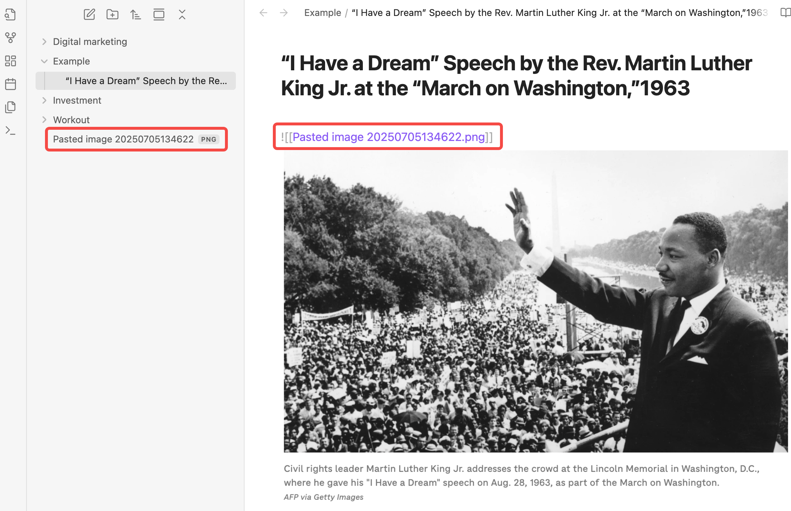
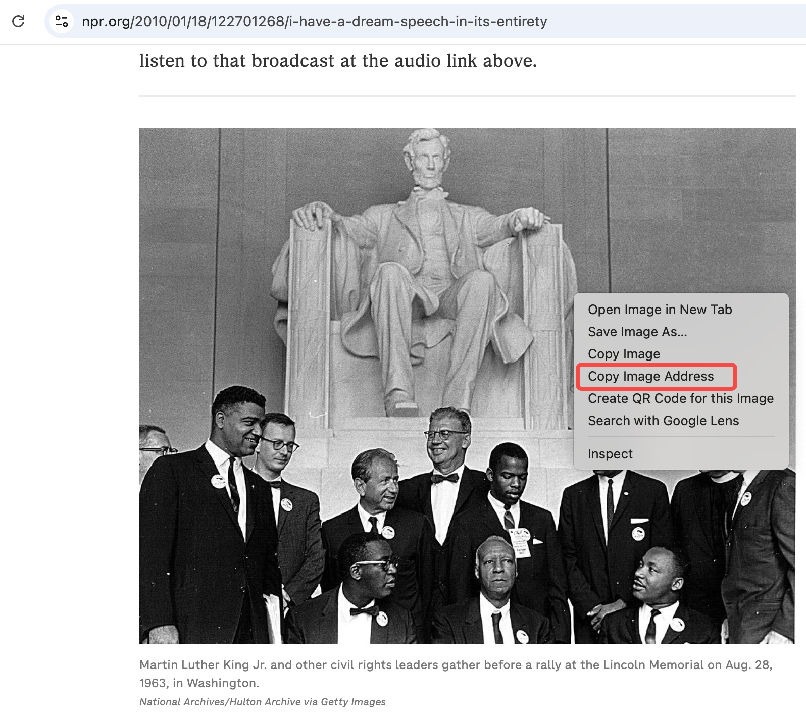
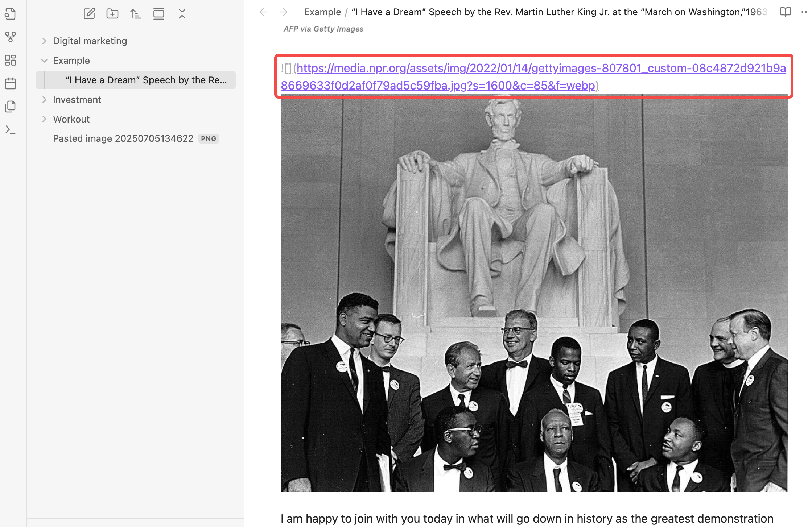
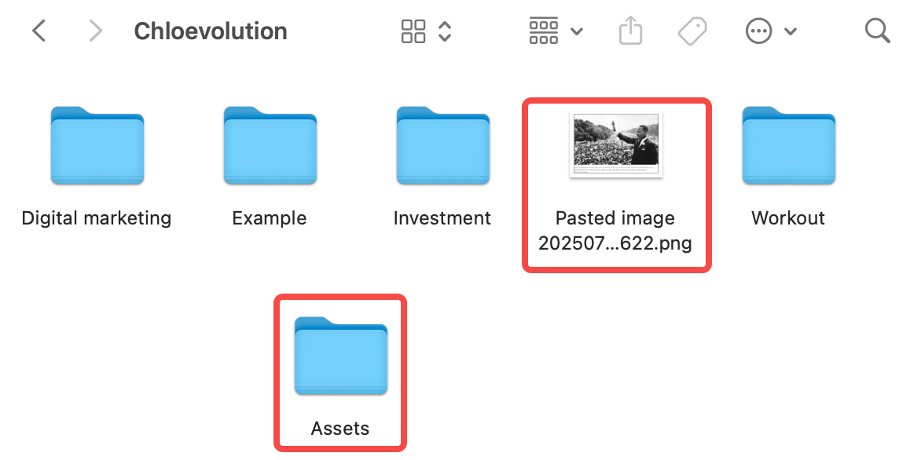
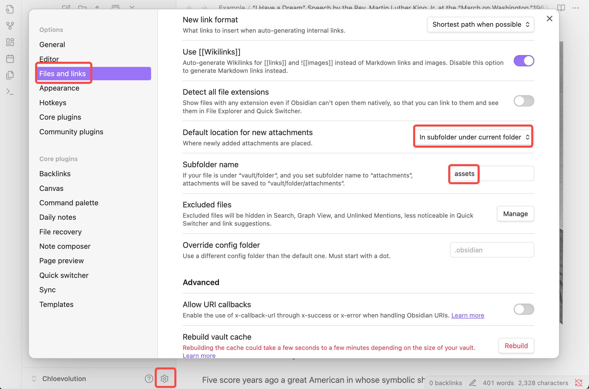
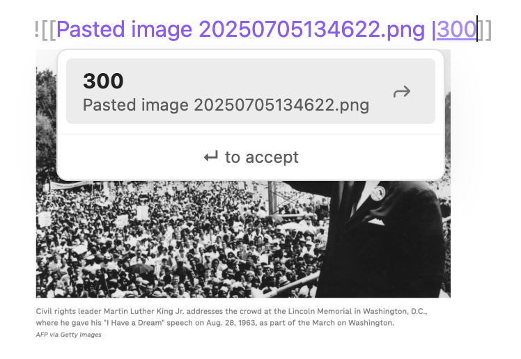

做笔记用 Obsidian，难免会用到图片。直接复制粘贴图片进去确实方便，但久而久之你会发现图片摆放一团乱，调整大小也麻烦，想让图片居中更是难上加难。还有个坑，就是删了图片，文件却没真正消失，还藏在根目录里。

## 图片在Obsidian中到底是什么？

说到图片，很多人第一反应就是“插入一张图就是一张图”，但在 Obsidian 里，图片其实更像是“外部文件”的引用。换句话说，图片并不是直接存在笔记内容里，而是存储在你的电脑文件夹里，然后通过链接或引用的方式显示在笔记里。

这也就解释了为什么你删除了笔记里的图片，文件夹里却还留着那个图片文件——因为**笔记只是引用了它，图片文件本体还是独立存在**。理解了这一点，才能更好地管理你的图片资源，比如统一放到某个专门的文件夹里，避免混乱，也方便后续的备份和整理。

## 如何在Obsidian中插入图片

在Obsidian里插入图片其实并不复杂，下面详细介绍几种常见的插入方式和它们的优缺点：

### 1. 复制粘贴图片

这是最方便快捷的方法。你可以直接在电脑上复制一张图片（比如截图或者网页图片），然后粘贴到Obsidian的编辑器里。Obsidian会自动帮你把这张图片保存到默认的附件文件夹（一般是 `.obsidian/assets` 或你设置的其他文件夹），同时在笔记中生成一段图片引用代码。

> **优点**：操作简单，省去找文件路径的麻烦。

> **缺点**：如果你不注意，图片会散落在多个地方，久了附件文件夹可能会很乱，管理起来比较麻烦。

如下图所示，我复制了一张图片粘贴到编辑器里，Obsidian自动帮我把图片保存在根目录下，独立于其它已有的文件夹，图片命名和日期有关，且显示图片为PNG格式。同时，笔记正文部分自动生成了一段该图片的引用代码：



### 2. 用 Markdown 语法手动插入图片

如果你已经有图片文件保存在电脑里的某个位置，最好用 Markdown 语法来插入图片，格式是：

```markdown
![[图片文件名.png]]
```

这里的 `[[ ]]` 是 Obsidian 独有的链接写法，代表引用库里的文件。如果你的图片在同一个库的子文件夹，比如 `assets` 文件夹里，路径写成：

```markdown
![[assets/图片文件名.png]]
```

或者使用标准 Markdown 语法：

```markdown

```

> **优点**：你可以自由控制图片的存放位置，避免附件文件夹乱糟糟。

> **缺点**：插入前需要确认图片路径正确，不然图片无法显示。


### 3. 拖拽图片到编辑区

把你电脑里的图片文件直接拖到 Obsidian 的编辑窗口，系统会自动复制图片到默认的附件文件夹，并生成对应的引用代码。本质上和第一种“直接复制粘贴图片”的方式类似。

> **优点**：操作直观、方便，比复制粘贴更稳定。

> **缺点**：依然需要注意附件文件夹的管理。

### 4. 插入网络图片链接

Obsidian 也支持网络图片插入，直接用标准 Markdown 语法：

```markdown

```

这种方式图片不会保存在本地，而是直接通过网络加载。

> **优点**：不占用本地存储，适合临时引用。

> **缺点**：必须联网，网络不稳定时图片可能无法显示。

如下图所示，我先在网页上右键复制所需图片的链接，然后用markdown语法写入笔记正文：


因为这种方式不涉及图片的本地保存，所以在左侧的目录栏里也不会生成对应的图片：



## 如何指定图片存放的文件夹？

### 1. 创建专门的图片文件夹

打开你的Obsidian笔记库（Vault）文件夹。

在根目录下新建一个文件夹，比如命名为 `assets`（也可以叫 `images`、`media`，自己选个喜欢的名字）。

所有你要插入的图片，都先放到这个文件夹里。

如下图所示，我在根目录下新建了一个`Assets`文件夹来存放图片，也可以看到之前的图片默认直接存放在根目录下了：


### 2. 修改图片的默认存储位置

默认情况下，Obsidian会把复制粘贴或拖拽的图片存到默认附件文件夹，如果你没做过设置，默认就是根目录或者 `.obsidian` 文件夹下的某个文件夹。

如果你想让图片都统一存放到自己新建的 `assets` 文件夹，**建议修改默认附件文件夹位置**，这样复制粘贴和拖拽图片时，图片都会自动保存到你指定的文件夹，管理更方便。

1. 打开 Obsidian，点击左下角的“设置”齿轮图标。
2. 找到【文件与链接】选项。
3. 在“默认附件文件夹路径”一栏，填写你刚才新建的文件夹名，比如 `assets`。
4. 保存设置后，复制粘贴或拖拽的图片都会自动存放到 `assets` 文件夹。

> **注意**：如果你之前已经有图片存放在默认位置，修改后它们不会自动搬移，需要手动整理。




## 图片尺寸调整方法

插入图片后，很多人都会遇到一个问题：图片太大或者太小，看着不协调。可惜 Obsidian 默认的 Markdown 语法对图片尺寸控制比较有限，不过我们还是有几个实用技巧，可以帮你灵活调整图片大小。

### 1. 使用 HTML 标签调整图片宽度

Obsidian 支持在 Markdown 里嵌入 HTML 标签，所以你可以用 `` 标签直接设置宽度，比如：

```html

```

这里的 `width="300"` 表示图片宽度是300像素，高度会按比例自动调整。

> **优点**：直观简单，能精准控制图片宽度。

> **缺点**：需要写一点 HTML 代码，稍微不方便。


### 2. 使用 Markdown 扩展语法（部分主题支持）

有些 Obsidian 主题或社区支持类似下面这种语法调整图片大小：

```markdown
![[assets/图片文件名.png|300]]
```

`|300` 表示宽度是300像素。

**注意**：这并不是所有主题都支持，默认 Obsidian 并不完全兼容，使用前最好测试一下。

如下图所示，在文件名后面添加像素后，图片明显变小：


### 3. 利用 CSS 自定义样式（适合高级用户）

如果你熟悉 CSS，可以在 Obsidian 主题的 `obsidian.css` 文件中添加自定义样式，统一控制图片尺寸，比如：

```css
.markdown-preview-section img {
  max-width: 80%;
  height: auto;
}
```

这样可以让图片在预览时最大宽度不超过80%，更适合不同屏幕大小。


## 如何让图片居中显示

### 1. 使用 HTML 标签居中

最简单、兼容性最好的方式就是用 HTML 标签嵌套图片，并指定居中对齐方式：

```html
<p align="center">
  
</p>
```

或者这样写也可以：

```html
<div style="text-align: center;">
  
</div>
```

你可以把 `width` 改成任何合适的数值，根据内容自动调整。


### 2. 使用 CSS 设置全局居中（适合经常居中的用户）

如果你希望**所有图片在预览模式下都自动居中**，可以使用 Obsidian 的 CSS 片段功能：

1. 在你的 Vault 文件夹下创建 `.obsidian/snippets` 文件夹（如果还没有的话）。
2. 新建一个 `.css` 文件，例如命名为 `center-images.css`，粘贴以下内容：

```css
.markdown-preview-view img {
  display: block;
  margin: 0 auto;
}
```

3. 回到 Obsidian，设置 > 外观 > 启用 CSS 片段，打开刚才的 `center-images.css`。
4. 所有图片在预览视图下就会自动居中了。


这两种方式都很简单，适合不同习惯的人选择使用。想要一张图片特别居中就用 HTML 标签，想要全局默认居中就用 CSS 片段，一劳永逸。

