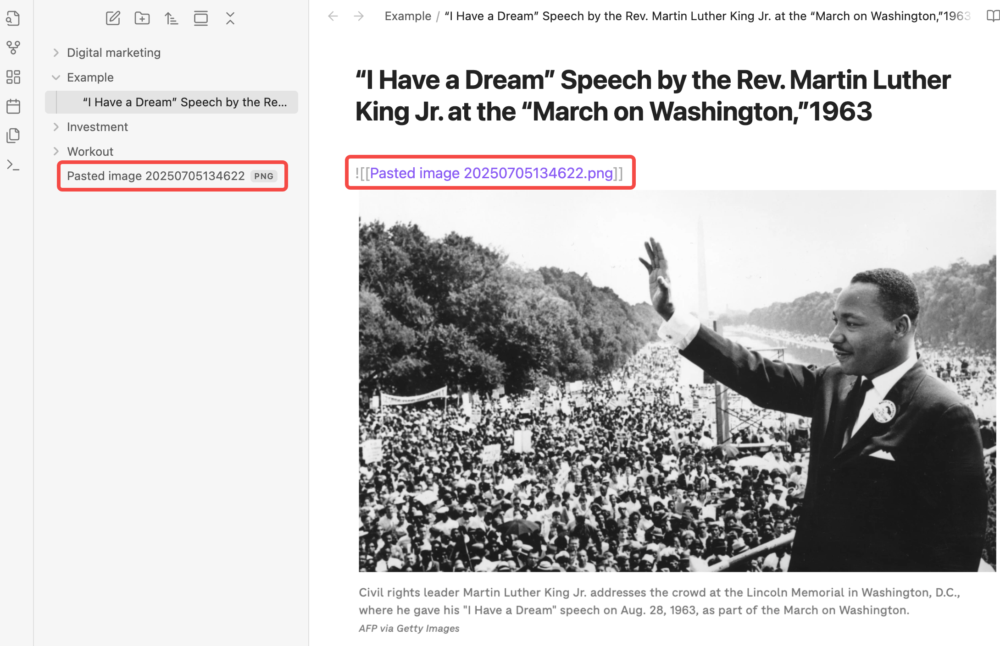
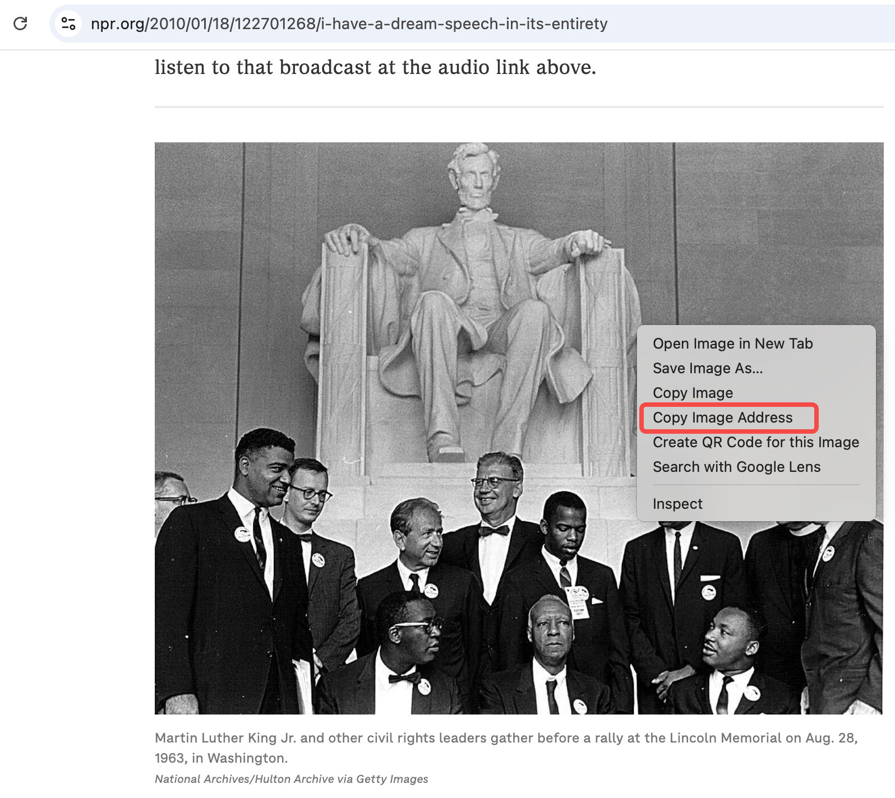
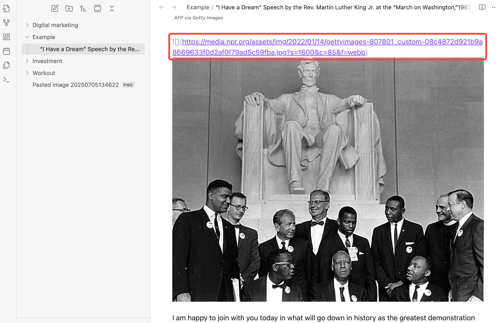
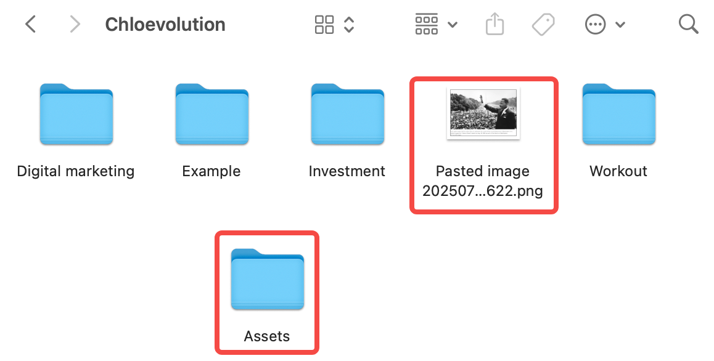
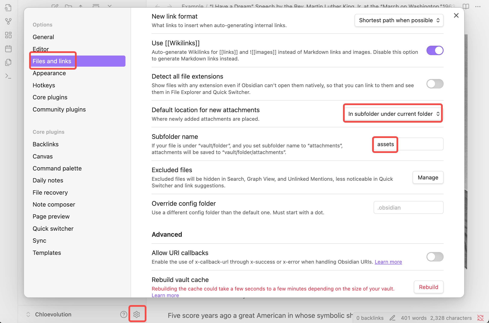
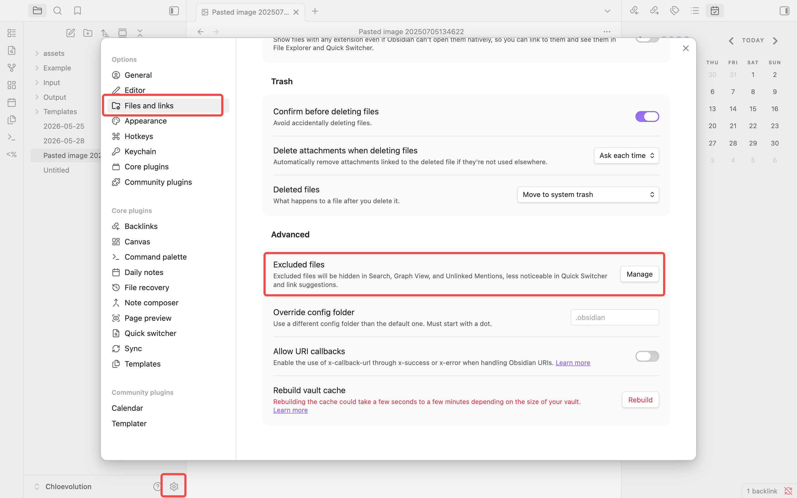
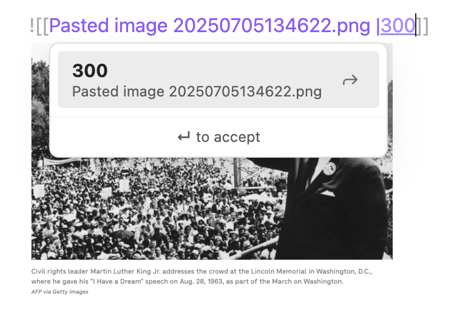
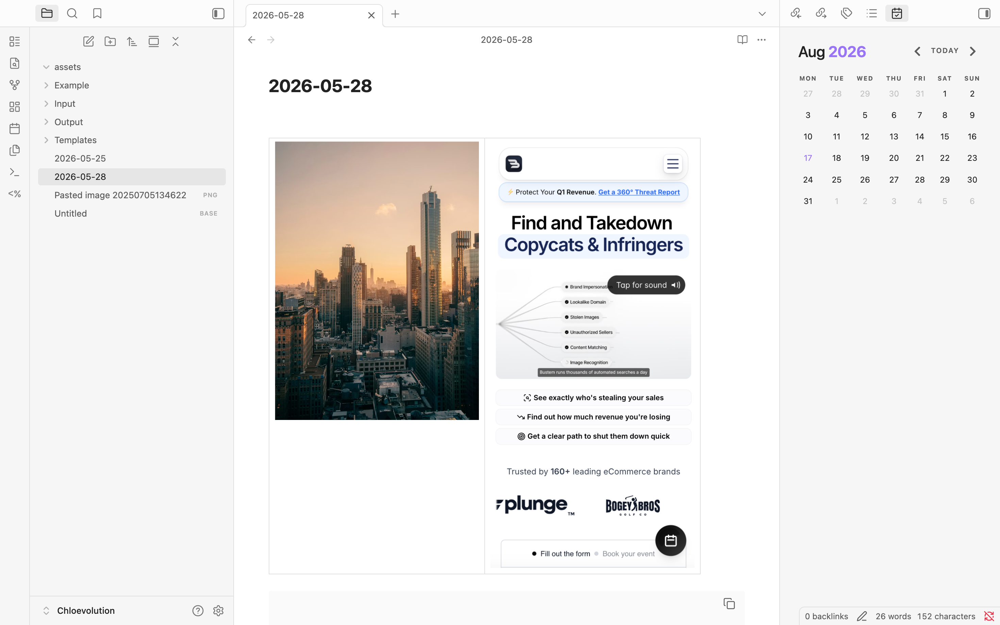
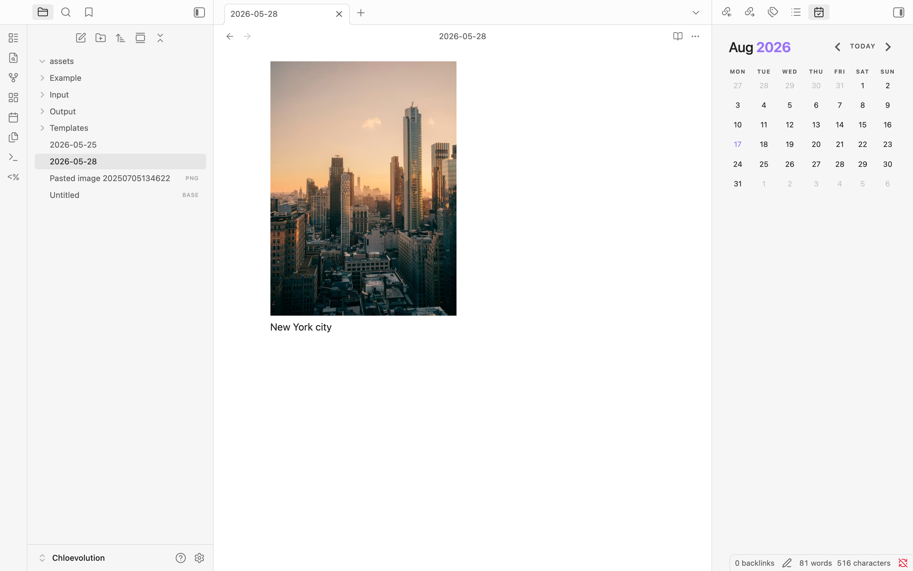
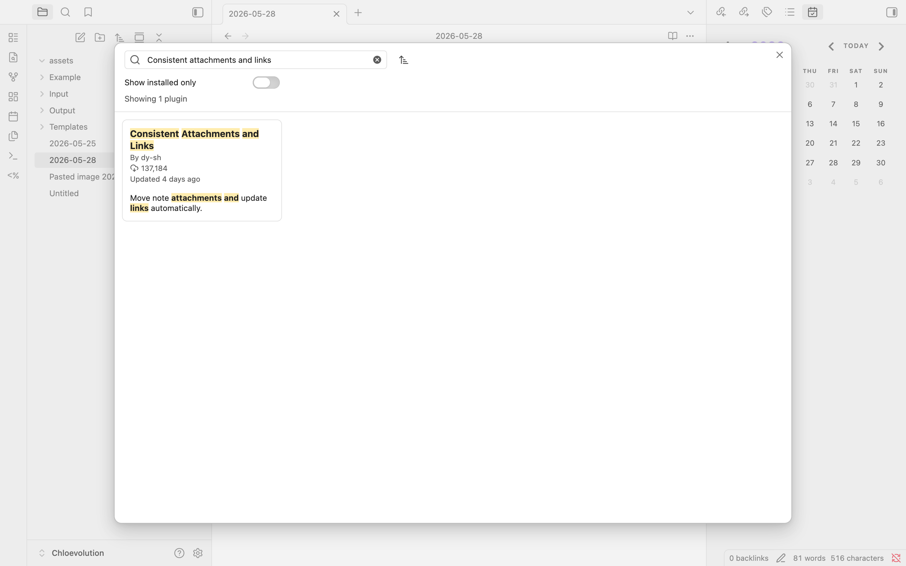

做笔记用 Obsidian，难免会用到图片。直接复制粘贴图片进去确实方便，但久而久之你会发现图片摆放一团乱，调整大小也麻烦，想让图片居中更是难上加难。还有个坑，就是删了图片，文件却没真正消失，还藏在根目录里。

## 图片在Obsidian中到底是什么？

说到图片，很多人第一反应就是“插入一张图就是一张图”，但在 Obsidian 里，图片其实更像是“外部文件”的引用。换句话说，图片并不是直接存在笔记内容里，而是存储在你的电脑文件夹里，然后通过链接或引用的方式显示在笔记里。

这也就解释了为什么你删除了笔记里的图片，文件夹里却还留着那个图片文件——因为**笔记只是引用了它，图片文件本体还是独立存在**。理解了这一点，才能更好地管理你的图片资源，比如统一放到某个专门的文件夹里，避免混乱，也方便后续的备份和整理。

## 如何在Obsidian中插入图片

在Obsidian里插入图片其实并不复杂，下面详细介绍几种常见的插入方式和它们的优缺点：

### 1. 复制粘贴图片

这是最方便快捷的方法。你可以直接在电脑上复制一张图片（比如截图或者网页图片），然后粘贴到Obsidian的编辑器里。Obsidian会自动帮你把这张图片保存到默认的附件文件夹（一般是 `.obsidian/assets` 或你设置的其他文件夹），同时在笔记中生成一段图片引用代码。

**粘贴图片的命名规则**：

Obsidian 默认会用 `Pasted image` + `时间戳` 的格式来命名粘贴的图片，比如：
- `Pasted image 20250705133021.png`
- `Pasted image 20250705133156.png`

时间戳格式是年月日时分秒（YYYYMMDDHHmmss），这样可以确保每张粘贴的图片都有唯一的文件名，不会发生命名冲突。

**粘贴图片的保存位置**：

粘贴图片的保存位置取决于你的设置：
1. 如果你设置了"默认附件文件夹路径"（比如 `assets`），图片会保存到那个文件夹
2. 如果没有设置，图片会保存到笔记库的根目录
3. 如果选择了"当前文件所在文件夹的子文件夹"，会在笔记所在目录下创建一个附件文件夹

> **优点**：操作简单，省去找文件路径的麻烦。

> **缺点**：如果你不注意，图片会散落在多个地方，久了附件文件夹可能会很乱，管理起来比较麻烦。

如下图所示，我复制了一张图片粘贴到编辑器里，Obsidian自动帮我把图片保存在根目录下，独立于其它已有的文件夹，图片命名和日期有关，且显示图片为PNG格式。同时，笔记正文部分自动生成了一段该图片的引用代码：



### 2. 用 Markdown 语法手动插入图片

如果你已经有图片文件保存在电脑里的某个位置，最好用 Markdown 语法来插入图片，格式是：

```markdown
![[图片文件名.png]]
```

这里的 `[[ ]]` 是 Obsidian 独有的链接写法，代表引用库里的文件。如果你的图片在同一个库的子文件夹，比如 `assets` 文件夹里，路径写成：

```markdown
![[assets/图片文件名.png]]
```

或者使用标准 Markdown 语法：

```markdown

```

> **优点**：你可以自由控制图片的存放位置，避免附件文件夹乱糟糟。

> **缺点**：插入前需要确认图片路径正确，不然图片无法显示。


### 3. 拖拽图片到编辑区

把你电脑里的图片文件直接拖到 Obsidian 的编辑窗口，系统会自动复制图片到默认的附件文件夹，并生成对应的引用代码。本质上和第一种“直接复制粘贴图片”的方式类似。

> **优点**：操作直观、方便，比复制粘贴更稳定。

> **缺点**：依然需要注意附件文件夹的管理。

### 4. 插入网络图片链接

Obsidian 也支持网络图片插入，直接用标准 Markdown 语法：

```markdown

```

这种方式图片不会保存在本地，而是直接通过网络加载。

> **优点**：不占用本地存储，适合临时引用。

> **缺点**：必须联网，网络不稳定时图片可能无法显示。

如下图所示，我先在网页上右键复制所需图片的链接，然后用markdown语法写入笔记正文：


因为这种方式不涉及图片的本地保存，所以在左侧的目录栏里也不会生成对应的图片：



## 如何指定图片存放的文件夹？

### 1. 创建专门的图片文件夹

打开你的Obsidian笔记库（Vault）文件夹。

在根目录下新建一个文件夹，比如命名为 `assets`（也可以叫 `images`、`media`，自己选个喜欢的名字）。

所有你要插入的图片，都先放到这个文件夹里。

如下图所示，我在根目录下新建了一个`Assets`文件夹来存放图片，也可以看到之前的图片默认直接存放在根目录下了：


### 2. 修改图片的默认存储位置

默认情况下，Obsidian会把复制粘贴或拖拽的图片存到默认附件文件夹，如果你没做过设置，默认就是根目录或者 `.obsidian` 文件夹下的某个文件夹。

如果你想让图片都统一存放到自己新建的 `assets` 文件夹，**建议修改默认附件文件夹位置**，这样复制粘贴和拖拽图片时，图片都会自动保存到你指定的文件夹，管理更方便。

1. 打开 Obsidian，点击左下角的“设置”齿轮图标。
2. 找到【文件与链接】选项。
3. 在“默认附件文件夹路径”一栏，填写你刚才新建的文件夹名，比如 `assets`。
4. 保存设置后，复制粘贴或拖拽的图片都会自动存放到 `assets` 文件夹。

**关于附件文件夹的几种选项**：

在”默认附件文件夹路径”设置中，你会看到以下几个选项：

- **Vault 根目录**：图片保存在笔记库的根目录，和笔记文件混在一起（不推荐）
- **当前文件所在文件夹的子文件夹**：会在笔记所在的文件夹下创建一个子文件夹（比如自动创建 `attachments` 文件夹）来存放图片
- **指定文件夹**：你可以输入一个固定的文件夹名（比如 `assets`），所有图片都会统一保存到这个文件夹（最推荐）

**自定义粘贴图片的命名模板**（需要插件）：

Obsidian 默认的 `Pasted image 20250705133021.png` 命名格式虽然不会冲突，但不够直观。如果你想自定义命名规则，可以使用社区插件：

- **[Paste Image Rename](https://github.com/reorx/obsidian-paste-image-rename)** 插件：可以在粘贴图片后立即弹出重命名对话框，或者设置自动命名模板（比如用笔记标题作为前缀）
- **[Attachment Management](https://github.com/trganda/obsidian-attachment-management)** 插件：提供更高级的附件管理功能，包括自动重命名、批量整理等

安装方法：

1. 打开设置 > 第三方插件 > 浏览
2. 搜索插件名称，点击安装并启用
3. 在插件设置中配置命名模板，比如：
   - `{notename}-{date}` 会生成类似 `我的笔记-20250705.png` 的文件名
   - `{date}-{time}` 会生成类似 `20250705-133021.png` 的文件名

> **注意**：如果你之前已经有图片存放在默认位置，修改后它们不会自动搬移，需要手动整理。




## 如何隐藏侧边栏中的图片文件

如果你经常粘贴图片到笔记里，时间一长，左侧的文件资源管理器就会被一堆图片文件占满，尤其是那些 `Pasted image 20250705123456.png` 之类的文件名，看着就头疼。想找个 Markdown 文件都得翻半天，影响工作效率。

其实 Obsidian 提供了几种方式可以让你“眼不见为净”，把这些图片文件从侧边栏里隐藏起来，让文件列表更清爽。

### 1. 使用文件资源管理器的排除功能

Obsidian 自带的文件资源管理器支持排除特定文件夹，这是最简单直接的方法：

1. 打开 Obsidian，点击左下角的“设置”齿轮图标。
2. 找到【文件与链接】选项。
3. 在“排除的文件”一栏，填写你存放图片的文件夹名称，比如 `assets`。
4. 保存后，`assets` 文件夹及其内容就不会在文件资源管理器中显示了。



> **优点**：设置简单，一劳永逸，适合把所有图片统一放在一个文件夹的用户。

> **缺点**：整个文件夹都会被隐藏，如果你偶尔需要查看或管理图片文件，还得通过系统文件管理器打开。

### 2. 折叠附件文件夹

如果你不想完全隐藏图片文件夹，只是想让它不那么显眼，可以直接在文件资源管理器里折叠这个文件夹：

1. 在左侧文件资源管理器中找到存放图片的文件夹（比如 `assets`）。
2. 点击文件夹名称左边的小三角，把文件夹折叠起来。
3. 这样文件夹还在，但里面的图片文件就不会全部展开显示了。

> **优点**：灵活性高，需要的时候随时可以展开查看。

> **缺点**：每次重启 Obsidian 后，文件夹可能又会自动展开，需要重新折叠。

### 3. 使用第三方插件过滤文件类型

如果你想要更精细的控制，比如只隐藏特定格式的图片（PNG、JPG 等），可以借助社区插件：

- **[File Explorer Note Count](https://community.obsidian.md/plugins/file-explorer-note-count)** 插件：可以统计文件数量，同时支持按文件类型过滤显示。
- **[Hider](https://community.obsidian.md/plugins/obsidian-hider)** 插件：可以隐藏特定类型的文件或文件夹，支持自定义规则。

安装方法：

1. 打开设置 > 第三方插件 > 浏览。
2. 搜索插件名称，点击安装并启用。
3. 根据插件设置，配置要隐藏的文件类型或规则。

> **优点**：功能强大，可以根据文件扩展名、命名规则等灵活过滤。

> **缺点**：需要安装额外插件，增加一点学习成本。

### 4. 通过 CSS 隐藏图片文件（适合高级用户）

如果你懂一点 CSS，还可以通过自定义样式直接在界面上隐藏图片文件的显示：

1. 在你的 Vault 文件夹下创建 `.obsidian/snippets` 文件夹（如果还没有的话）。
2. 新建一个 `.css` 文件，例如命名为 `hide-images.css`，粘贴以下内容：

```css
/* 隐藏文件资源管理器中的图片文件 */
.nav-file-title[data-path$=".png"],
.nav-file-title[data-path$=".jpg"],
.nav-file-title[data-path$=".jpeg"],
.nav-file-title[data-path$=".gif"],
.nav-file-title[data-path$=".svg"],
.nav-file-title[data-path$=".webp"] {
  display: none;
}
```

3. 回到 Obsidian，设置 > 外观 > 启用 CSS 片段，打开刚才的 `hide-images.css`。
4. 所有常见格式的图片文件就会从侧边栏中隐藏。

> **优点**：完全自定义，可以精确控制隐藏哪些文件类型。

> **缺点**：需要一定的 CSS 知识，而且只是视觉上隐藏，文件本身还在。


**我的建议**：如果你的图片都统一放在一个文件夹（比如 `assets`），直接用方法1排除文件夹最省事。如果你需要偶尔查看图片，就用方法2折叠文件夹。想要更灵活的控制，可以试试方法3的插件。

## 图片尺寸调整方法

插入图片后，很多人都会遇到一个问题：图片太大或者太小，看着不协调。可惜 Obsidian 默认的 Markdown 语法对图片尺寸控制比较有限，不过我们还是有几个实用技巧，可以帮你灵活调整图片大小。

### 1. 使用 HTML 标签调整图片宽度

Obsidian 支持在 Markdown 里嵌入 HTML 标签，所以你可以用 `` 标签直接设置宽度，比如：

```html

```

这里的 `width="300"` 表示图片宽度是300像素，高度会按比例自动调整。

> **优点**：直观简单，能精准控制图片宽度。

> **缺点**：需要写一点 HTML 代码，稍微不方便。


### 2. 使用 Markdown 扩展语法（部分主题支持）

有些 Obsidian 主题或社区支持类似下面这种语法调整图片大小：

```markdown
![[assets/图片文件名.png|300]]
```

`|300` 表示宽度是300像素。

**注意**：这并不是所有主题都支持，默认 Obsidian 并不完全兼容，使用前最好测试一下。

如下图所示，在文件名后面添加像素后，图片明显变小：


### 3. 利用 CSS 自定义样式（适合高级用户）

如果你熟悉 CSS，可以在 Obsidian 主题的 `obsidian.css` 文件中添加自定义样式，统一控制图片尺寸，比如：

```css
.markdown-preview-section img {
  max-width: 80%;
  height: auto;
}
```

这样可以让图片在预览时最大宽度不超过80%，更适合不同屏幕大小。


## 如何让图片居中显示

### 1. 使用 HTML 标签居中

最简单、兼容性最好的方式就是用 HTML 标签嵌套图片，并指定居中对齐方式：

```html
<p align="center">
  
</p>
```

或者这样写也可以：

```html
<div style="text-align: center;">
  
</div>
```

你可以把 `width` 改成任何合适的数值，根据内容自动调整。


### 2. 使用 CSS 设置全局居中（适合经常居中的用户）

如果你希望**所有图片在预览模式下都自动居中**，可以使用 Obsidian 的 CSS 片段功能：

1. 在你的 Vault 文件夹下创建 `.obsidian/snippets` 文件夹（如果还没有的话）。
2. 新建一个 `.css` 文件，例如命名为 `center-images.css`，粘贴以下内容：

```css
.markdown-preview-view img {
  display: block;
  margin: 0 auto;
}
```

3. 回到 Obsidian，设置 > 外观 > 启用 CSS 片段，打开刚才的 `center-images.css`。
4. 所有图片在预览视图下就会自动居中了。


这两种方式都很简单，适合不同习惯的人选择使用。想要一张图片特别居中就用 HTML 标签，想要全局默认居中就用 CSS 片段，一劳永逸。

## 如何让多张图片并排显示

有时候你可能需要在笔记里并排展示多张图片，比如做产品对比、展示不同角度的照片、或者创建一个图片网格布局。可惜 Obsidian 默认的 Markdown 语法并不支持图片并排，所有图片都会垂直排列。不过，我们可以通过一些技巧来实现这个效果。

### 1. 使用 HTML 表格实现图片并排

最简单直接的方法就是用 HTML 的 `<table>` 标签来排列图片：

```html
<table>
  <tr>
    <td></td>
    <td></td>
  </tr>
</table>
```

如果想要三张图片并排，就添加第三个 `<td>` 标签：

```html
<table>
  <tr>
    <td></td>
    <td></td>
    <td></td>
  </tr>
</table>
```

你还可以在图片下方添加说明文字：

```html
<table>
  <tr>
    <td></td>
    <td></td>
  </tr>
  <tr>
    <td align="center">方案 A</td>
    <td align="center">方案 B</td>
  </tr>
</table>
```

排列效果如下图：



> **优点**：兼容性好，适合精确控制图片位置和间距。

> **缺点**：代码稍显繁琐，需要手动调整每张图片的宽度。

### 2. 使用 Flexbox CSS 实现响应式图片网格

如果你想要更灵活的布局，可以用 CSS Flexbox 来实现响应式图片网格。这种方式特别适合图片数量较多的情况：

```html
<div style="display: flex; flex-wrap: wrap; gap: 10px;">
  
  
  
</div>
```

这里的 `gap: 10px` 控制图片之间的间距，你可以根据需要调整。如果希望图片自动适应屏幕宽度，可以用百分比：

```html
<div style="display: flex; flex-wrap: wrap; gap: 10px; justify-content: center;">
  
  
  
</div>
```

这样在不同屏幕尺寸下，图片会自动换行，保持良好的显示效果。

> **优点**：响应式设计，适合不同屏幕尺寸，代码相对简洁。

> **缺点**：需要一定的 CSS 基础知识。

### 3. 使用 CSS Grid 创建图片网格（适合高级用户）

如果你想创建更复杂的图片网格布局，CSS Grid 是最强大的选择：

```html
<div style="display: grid; grid-template-columns: repeat(3, 1fr); gap: 15px;">
  
  
  
  
  
  
</div>
```

`grid-template-columns: repeat(3, 1fr)` 表示创建3列等宽的网格。如果想要2列布局，就改成 `repeat(2, 1fr)`。

> **优点**：布局整齐，适合创建图片画廊或作品集展示。

> **缺点**：需要掌握 CSS Grid 知识。

### 4. 使用社区插件实现图片布局

如果你不想写代码，可以试试社区插件来实现图片并排和网格布局：

- **[Image Layout](https://github.com/vertis/obsidian-image-layouts)** 插件：专门用于图片布局，支持多种预设样式。
- **[Gallery View](https://community.obsidian.md/plugins/gallery-view)** 插件：可以创建图片画廊，支持网格布局和灯箱效果。

安装方法：

1. 打开设置 > 第三方插件 > 浏览。
2. 搜索插件名称，点击安装并启用。
3. 根据插件文档使用特定语法插入并排图片。

> **优点**：不需要写代码，有图形界面或简单语法即可实现。

> **缺点**：依赖第三方插件，可能存在兼容性问题。


**我的建议**：如果只是偶尔需要并排显示2-3张图片，用方法1的 HTML 表格最简单。如果经常需要创建图片网格或响应式布局，学习一下方法2的 Flexbox 会很有帮助。不想碰代码的话，直接用方法4的插件就好。

## 如何为图片添加标题和说明文字

在写技术文档、学术笔记或者产品说明时，经常需要为图片添加说明文字或标题，比如"图1: 系统架构图"这样的图注。虽然 Obsidian 的基础 Markdown 语法对图注的支持比较有限，但我们还是有几种方法可以实现这个效果。

### 1. 使用 Markdown 的 Alt 文本

最简单的方法是使用 Markdown 图片语法中的 alt 文本：

```markdown

```

这里的 `图1: 系统架构图` 就是 alt 文本。不过，**这种方式的 alt 文本在 Obsidian 预览模式下通常不会显示**，它主要用于：
- 图片无法加载时显示替代文字
- 帮助屏幕阅读器理解图片内容（无障碍访问）
- SEO 优化（如果你的笔记会发布到网站）

> **优点**：语法简单，符合 Markdown 标准。

> **缺点**：在 Obsidian 预览模式下看不到说明文字，不适合需要可见图注的场景。

### 2. 在图片下方直接添加文本说明

最直观的方法就是在图片引用代码下方直接写一行说明文字：

```markdown


*图1: 系统架构图 - 展示了前端、后端和数据库的交互关系*
```

或者用居中格式：

```markdown


<p align="center"><em>图1: 系统架构图</em></p>
```

> **优点**：简单直接，不需要额外代码，在编辑模式和预览模式下都能看到。

> **缺点**：文字和图片没有明确的语义关联，样式控制有限。

### 3. 使用 HTML `<figure>` 和 `<figcaption>` 标签

如果你想要更规范的图注格式，可以使用 HTML5 的 `<figure>` 和 `<figcaption>` 标签：

```html
<figure>
  
  <figcaption>图1: 系统架构图 - 展示了前端、后端和数据库的交互关系</figcaption>
</figure>
```


你还可以通过 CSS 自定义图注样式。在 `.obsidian/snippets` 文件夹下创建一个 CSS 文件：

```css
figure {
  margin: 20px auto;
  text-align: center;
}

figcaption {
  margin-top: 10px;
  font-size: 0.9em;
  color: #666;
  font-style: italic;
}
```

这样图注就会居中显示，字体稍小，颜色偏灰，看起来更专业。

> **优点**：语义化标签，样式可定制，符合 HTML5 标准。

> **缺点**：需要写 HTML 代码，稍微繁琐一些。

### 4. 使用社区插件实现自动图注编号

如果你需要给所有图片自动编号（图1、图2、图3...），可以使用社区插件：
- **[Image Captions](https://github.com/alangrainger/obsidian-image-captions)** 插件：自动将图片的 alt 文本转换为可见的图注。

安装方法：

1. 打开设置 > 第三方插件 > 浏览
2. 搜索插件名称，点击安装并启用
3. 使用插件提供的特殊语法插入带图注的图片

例如，使用 Image Captions 插件后，原本不显示的 alt 文本就会自动显示在图片下方：

```markdown

```

插件会自动将 `图1: 系统架构图` 显示为图片下方的说明文字。

> **优点**：自动编号，样式统一，支持交叉引用，适合长文档或学术论文。

> **缺点**：依赖第三方插件，需要学习插件的特定语法。


**我的建议**：如果只是偶尔需要添加图片说明，方法2直接在图片下方写文字最简单。如果需要更规范的格式，用方法3的 `<figure>` 标签。如果你在写长篇文档，需要大量图注和自动编号，方法4的插件会大大提高效率。

## Obsidian 支持哪些图片格式？

如果你用 iPhone 拍照后想把照片粘贴到 Obsidian，可能会发现图片显示不出来，或者某些特殊格式的图片无法正常加载。了解 Obsidian 支持哪些图片格式，以及如何处理不兼容的格式，可以帮你避免这些问题。

### Obsidian 原生支持的图片格式

Obsidian 支持大多数常见的图片格式：

- **PNG** (.png) - 无损压缩，支持透明背景，适合截图和图标
- **JPG/JPEG** (.jpg, .jpeg) - 有损压缩，文件体积小，适合照片
- **GIF** (.gif) - 支持动画，适合简单动图
- **SVG** (.svg) - 矢量图格式，可无限缩放不失真，适合图标和图表
- **WebP** (.webp) - Google 推出的现代图片格式，压缩率高，体积小
- **BMP** (.bmp) - 位图格式，文件较大，不常用

这些格式都可以直接插入到 Obsidian 笔记中，无需额外转换。

### HEIC 格式的问题和解决方案

**HEIC 是什么？**

HEIC (High Efficiency Image Container) 是苹果从 iOS 11 开始使用的默认照片格式。它比传统的 JPG 格式体积更小，但兼容性较差。

**为什么 HEIC 在 Obsidian 中无法显示？**

Obsidian 本身不原生支持 HEIC 格式，因为这个格式需要特定的解码器，而且在 Windows 和部分 Linux 系统上支持度不够。

**解决方法：**

#### 方法1：在 iPhone 上改为拍摄 JPG 格式

这是最简单的预防方法：

1. 打开 iPhone 的"设置"
2. 进入"相机" > "格式"
3. 选择"最兼容"（而不是"高效"）

之后拍摄的照片就会自动保存为 JPG 格式，可以直接在 Obsidian 中使用。

> **注意**：这个设置只影响新拍的照片，已有的 HEIC 照片需要单独转换。

#### 方法2：使用在线转换工具

有很多免费的在线工具可以把 HEIC 转换为 JPG：

- **[CloudConvert](https://cloudconvert.com/heic-to-jpg)** - 支持批量转换，无需安装
- **[HEICtoJPG.com](https://heictojpg.com/)** - 简单快速，本地转换保护隐私
- **[FreeConvert](https://www.freeconvert.com/heic-to-jpg)** - 功能全面，支持多种格式

使用方法很简单，上传 HEIC 文件，点击转换，下载 JPG 文件即可。

#### 方法3：使用桌面转换软件

如果你经常需要转换大量 HEIC 图片，建议安装专门的转换工具：

**Windows 系统：**
- **[iMazing HEIC Converter](https://imazing.com/heic)** - 免费，界面简洁，支持批量转换
- **[CopyTrans HEIC](https://www.copytrans.net/copytransheic/)** - 免费，可以让 Windows 系统直接查看 HEIC 文件

**Mac 系统：**
- Mac 系统本身就支持 HEIC 格式，可以用"预览"应用打开 HEIC 文件，然后"文件" > "导出"选择 JPG 格式即可

**跨平台工具：**
- **[XnConvert](https://www.xnview.com/en/xnconvert/)** - 免费开源，支持 Windows/Mac/Linux，功能强大

#### 方法4：使用 AirDrop 或共享时自动转换

iPhone 在通过 AirDrop 或"共享"功能发送照片到其他设备时，可以自动转换为兼容格式：

1. 在 iPhone 照片应用中选择照片
2. 点击“共享”按钮
3. 选择"选项"
4. 将“自动”改为“兼容”
5. 发送到电脑后就是 JPG 格式了

### 如何选择合适的图片格式以优化库体积

如果你的 Obsidian 笔记库越来越大，图片占用了大量空间，可以考虑优化图片格式：

**1. 截图和图标优先用 PNG**
- 文字截图、界面截图等需要清晰显示的，用 PNG 格式
- 如果截图包含大量照片内容，可以考虑转为 JPG

**2. 照片优先用 JPG 或 WebP**
- 普通照片用 JPG，压缩率设置 80-85% 即可，肉眼几乎看不出差异
- 如果追求更小体积，可以转换为 WebP 格式（体积比 JPG 小 25-35%）

**3. 图标和矢量图用 SVG**
- Logo、图标、流程图等优先使用 SVG 格式
- SVG 文件体积小，缩放不失真

**4. 避免使用 BMP 和未压缩的 PNG**
- BMP 格式体积太大，没有必要使用
- 导出 PNG 时注意选择压缩选项

**压缩工具推荐：**

- **[TinyPNG](https://tinypng.com/)** - 在线压缩 PNG 和 JPG，压缩率高且几乎无损
- **[Squoosh](https://squoosh.app/)** - Google 出品，支持多种格式转换和压缩，可以在线对比效果
- **[ImageOptim](https://imageoptim.com/)** (Mac) - 本地批量压缩工具，操作简单


## 如何清理未使用的图片

还记得文章开头提到的那个坑吗？在 Obsidian 笔记里删除图片引用代码后，图片文件本身还留在文件夹里，时间一长就会积累很多“孤立图片”——这些图片没有被任何笔记引用，却占用着存储空间。

如果你的笔记库已经用了一段时间，很可能存在不少这样的冗余文件。定期清理这些未使用的图片，可以帮你保持笔记库的整洁，减少备份和同步的负担。

### 什么是未使用的图片？

未使用的图片（也叫孤立图片、孤立附件）是指：
- 图片文件存在于你的笔记库中
- 但没有任何笔记通过 `![[]]` 或 `` 语法引用它

常见产生原因：
1. 删除了笔记里的图片引用，但忘记删除文件
2. 重命名或移动了图片，旧文件还留着
3. 测试时粘贴了图片，后来又不需要了
4. 从其他地方导入笔记时带来的多余图片

### 方法1：使用社区插件自动查找和清理

最推荐的方法是使用专门的插件来管理附件文件：

#### 插件推荐1：Consistent attachments and links

**[Consistent attachments and links](https://github.com/dy-sh/obsidian-consistent-attachments-and-links)** 是一个功能强大的附件管理插件，可以：

- 自动检测未被引用的附件文件
- 批量删除孤立的图片和附件
- 自动重命名附件文件以匹配笔记名称
- 自动整理附件到指定文件夹

安装和使用方法：

1. 打开设置 > 社区插件 > 浏览
2. 搜索 "Consistent attachments and links"，点击安装并启用
3. 在插件设置中，找到 "Delete unused attachments" 选项
4. 点击 "Delete unused attachments confirmation" 按钮
5. 插件会列出所有未被引用的附件，确认后批量删除



> **优点**：功能全面，可以一键清理所有孤立附件，还能自动整理文件结构。

> **缺点**：删除前需要仔细检查列表，避免误删有用的文件。

#### 插件推荐2：Janitor

**[Janitor](https://github.com/Canna71/obsidian-janitor)** 是一个专注于清理和维护笔记库的插件：

- 扫描并显示所有孤立的附件文件
- 支持预览要删除的文件列表
- 可以设置自动清理规则

安装和使用方法：

1. 打开设置 > 社区插件 > 浏览
2. 搜索 “Janitor”，点击安装并启用
3. 使用命令面板（Ctrl/Cmd + P）输入 "Janitor"
4. 选择 "Scan for orphaned files" 扫描孤立文件
5. 确认后执行清理操作

> **优点**：界面简洁，专注于清理功能，扫描速度快。

> **缺点**：功能相对单一，不如 Consistent attachments and links 全面。

### 方法2：手动查找和清理（适合小规模清理）

如果你的笔记库不大，或者只想清理特定的图片文件，可以手动操作：

#### 步骤1：使用全局搜索确认图片是否被引用

1. 在 Obsidian 中按 Ctrl/Cmd + Shift + F 打开全局搜索
2. 输入图片文件名（不含路径），比如 `Pasted image 20250705133021.png`
3. 如果搜索结果为空，说明这张图片没有被任何笔记引用

#### 步骤2：在文件系统中删除文件

1. 打开笔记库文件夹
2. 进入存放图片的文件夹（比如 `assets`）
3. 找到确认未使用的图片文件
4. 删除或移动到回收站

> **注意**：删除前建议先备份笔记库，或者先移到临时文件夹观察一段时间，确认没有问题再彻底删除。

### 方法3：使用命令行工具批量查找（适合高级用户）

如果你熟悉命令行，可以用脚本来查找孤立的图片文件。

**在 Mac/Linux 上使用 grep 和 find：**

```bash
# 进入笔记库目录
cd /path/to/your/vault

# 找出所有图片文件
find assets -type f \( -name "*.png" -o -name "*.jpg" -o -name "*.jpeg" \) > all_images.txt

# 逐个检查是否被引用（需要手动处理输出结果）
while read image; do
  filename=$(basename "$image")
  grep -r "$filename" . --include="*.md" > /dev/null || echo "未使用: $image"
done < all_images.txt
```

这个脚本会列出所有在 Markdown 文件中找不到引用的图片。

> **优点**：灵活性高，可以自定义搜索规则。

> **缺点**：需要一定的命令行知识，不适合初学者。

### 清理时的注意事项

1. **删除前务必备份**：清理操作不可逆，建议先备份整个笔记库，或者把要删除的文件先移到临时文件夹观察几天。

2. **注意网络图片和外部链接**：插件通常只检测本地文件引用，如果你用的是网络图片链接（``），不会被识别为未使用。

3. **检查模板和模板文件**：有些图片可能在模板中被引用，但插件扫描时可能遗漏，删除前要确认。

4. **留意图片命名冲突**：如果多个图片文件名相同但在不同文件夹，全局搜索可能会误判，需要手动确认。

5. **考虑保留期**：对于刚删除引用的图片，建议先保留一段时间（比如30天），观察确认后再彻底删除。


**我的建议**：如果你的笔记库有很多孤立图片，直接用"Consistent attachments and links"插件一键清理最省事。如果只是偶尔清理几张图片，用全局搜索手动确认就够了。不管哪种方式，清理前一定要先备份！


