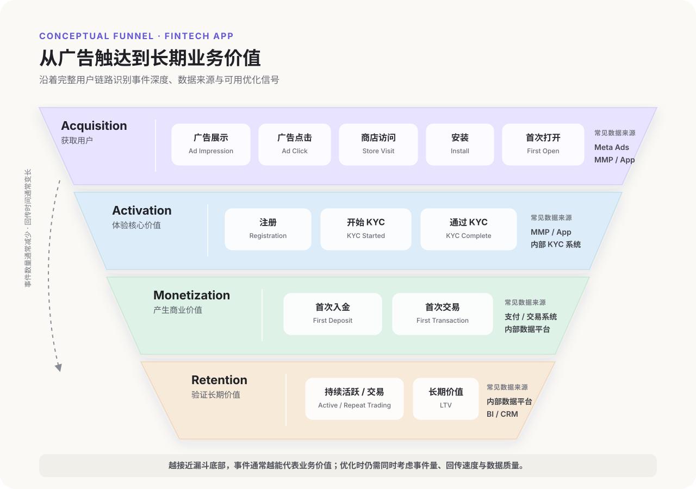
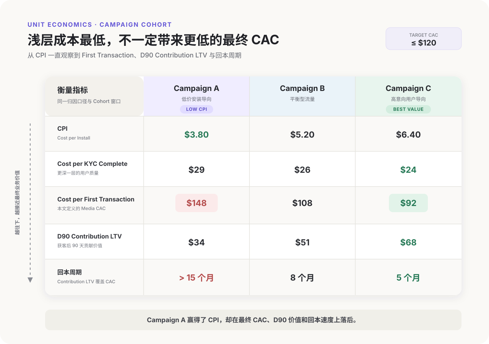
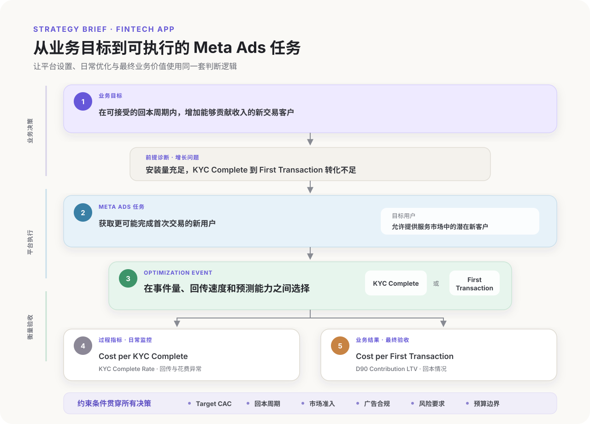

第一次接触 Meta 广告的人，通常会从后台开始：选择一个广告目标，设置受众和预算，上传素材，然后等待结果。Meta 的官方指南也提供了完整的操作说明，告诉我们每项功能是什么、应该在哪里设置，以及平台推荐采用哪些做法。

这些内容很重要，但它们解决的是“如何使用 Meta Ads”，不一定能回答“我的业务应该如何使用 Meta Ads”。

例如，同样获得一次注册，对不同业务的意义可能完全不同。电商网站的注册用户可能距离购买只差一步；B2B SaaS 的注册可能只是一次产品试用，后面还有团队采用、销售跟进和合同签署；Fintech App 的注册用户则可能还要完成 Know Your Customer（KYC，客户身份验证）、首次入金或交易，才会产生真正的业务价值。如果没有先弄清这些差异，即使后台设置完全正确，也可能只是在高效地获得错误的结果。

我接触过的产品形态包括以 App 为主的 Fintech 产品、面向个人用户的桌面工具软件，以及类似 Jira 的 B2B SaaS 项目管理工具。回头看这些经历，“金融”“软件”或“SaaS”这样的行业标签只能提供初步背景。真正改变广告策略的，是几个更具体的问题：谁在使用和付费，产品在哪里完成转化，收入在什么时候发生，以及一次浅层转化究竟能否代表一个有价值的客户。

这也是本文的起点。受众、CBO 与 ABO、每日预算都属于后续执行决策，本文先建立业务上下文。只有知道业务如何创造价值，才能进一步决定 Meta Ads 应该承担什么任务、向系统提供什么信号，以及最终用什么指标判断投放结果。

## 制定广告策略前，先定义业务上下文

Brief 开头的一句“我们是一家 Fintech 公司”，不足以定义完整的业务上下文。行业可以帮助我们快速理解市场，但不足以直接决定广告策略。

即使都属于 Fintech，支付工具、券商、借贷平台和个人财务管理 App 的转化路径、收入来源、用户价值与合规边界也可能完全不同。反过来，两个分属不同行业的产品，如果同样采用订阅模式、由用户自主完成购买，并且拥有较短的转化周期，它们在获客和衡量上的问题反而可能更接近。

因此，在制定 Meta 广告策略之前，我更倾向于用下面六个维度描述业务。

### 1. 客户类型：谁使用、谁决策、谁付费

最基本的区分是 B2C、B2B 还是 B2B2C，但真正需要确认的是：使用者、决策者和付费者是不是同一个人。

对于多数 B2C 工具，看到广告、下载产品和完成付费的可能是同一个用户，广告可以围绕一个人的即时问题展开。B2B SaaS 则不同。实际使用产品的项目成员、推动采购的团队负责人和批准预算的管理者可能是三类人。一条广告即使吸引了大量普通使用者，也不一定能带来拥有采购权的客户。

这个差异会进一步影响素材内容的表达、转化的定义和效果的衡量。如果广告触达的人不能独立完成决策，就不能把一次点击或注册直接看作完整的获客结果。

### 2. 产品形态：用户在哪里体验和完成转化

产品是 Mobile App、Web App、桌面软件还是 SaaS，会同时改变用户体验产品的场景，以及广告点击之后的数据能否形成闭环。

以我接触过的 iPhone 解锁类桌面工具为例，用户通常先在网页上理解产品、下载安装包，再进入桌面软件完成扫描、试用、激活或购买。广告平台看到的网站行为，只覆盖了整个链路的一部分。如果后续的软件激活和付款没有回传，并与广告点击建立关联，投手可能会把一个“下载很多”的广告误判为有效广告。

Fintech App 的链路通常从广告跳到 App Store 或 Google Play，然后进入 App 内完成注册、KYC 和关键业务行为。这里不仅存在网页与 App 的切换，还可能受到操作系统、隐私框架和事件回传方式的影响。产品形态因此会直接决定后面需要什么数据基础，也会限制广告系统能够看到和优化的行为。

### 3. 变现方式：一次转化最终如何产生收入

不同变现方式会改变收入由什么行为触发、多久能够确认，以及一个用户可能贡献多少长期价值。因此，广告主判断用户质量时采用的标准也会不同。

一次性付费软件可以较快比较获客成本与订单毛利；订阅产品需要考虑续费与回本周期（Payback Period）；电商需要扣除商品成本、折扣、退款和履约成本后判断订单价值；采用 In-App Purchase（IAP）的游戏需要观察付费率、每付费用户平均收入（ARPPU）与留存，采用 In-App Advertising（IAA）的游戏则更关注活跃度和广告收入；交易型 Fintech 产品可能只有在用户入金并持续交易后才产生收入；B2B SaaS 即使获得了高质量线索，也可能要数周或数月才能形成合同收入。

因此，不能脱离变现方式解释同一个广告指标。低成本注册只有在注册行为能够可靠预测未来收入时才有意义；如果两者的关联很弱，降低注册成本甚至可能让系统持续寻找更容易注册、却没有商业价值的人。

### 4. 转化位置：关键行为发生在哪个系统里

用户可能在网站、App Store、Google Play、App、桌面软件、CRM，甚至在线下完成最终转化。关键行为离广告平台越远，数据连接和效果判断通常就越困难。

这里需要回答两个问题：
- 真正决定业务价值的行为发生在哪里？
- Meta 能否及时、准确地获得这个信号？

Pixel 只是连接部分网站行为的工具，是否安装并不能直接证明整条转化链路已经打通。

例如，对一个 Fintech App 来说，安装事件可能发生在移动设备上，KYC 结果来自内部系统，首次入金还可能依赖支付服务。只有把这些行为放在同一条转化链路中，才有可能判断广告获得的是安装用户、完成 KYC 的用户，还是最终能够产生收入的用户。

### 5. 决策周期与回本周期：多久才能知道一个用户是否有价值

有些需求非常即时。用户遇到手机无法使用的问题，可能在看到桌面工具广告后很快下载并购买。另一些产品需要更高的理解成本和更长的信任建立过程，尤其是涉及团队协作、长期订阅或金融决策时。

转化周期越长，投放决策就越不能只依赖当天或最近几天的数据。收入发生较晚时，还会出现一个现实问题：广告系统需要快速反馈来学习，但业务需要更长时间才能确认用户质量。投手必须在反馈速度和业务价值之间做选择，不能默认优化最容易获得的事件。

### 6. 约束条件：哪些用户类型和表达方式不能由算法自由探索

地区、年龄、产品服务范围、用户隐私和行业监管都会构成投放边界。对 Fintech 产品来说，某个市场是否允许提供服务、广告主需要什么资质、哪些收益或风险表述不能使用，可能比受众兴趣和素材形式更早决定广告能否投放。

这些约束最好在策略阶段确认。等到广告被拒、账户受限或用户进入产品后才发现，预算和学习数据可能已经产生损失。自动化可以帮助系统在允许的范围内寻找转化机会，但不能替广告主定义合法的服务范围，也不能判断企业愿意承担什么样的合规和业务风险。

区分不同业务类型后再看 Meta Ads，可以更直观地理解业务模式如何影响投放决策：

| 业务类型 | 常见变现方式 | 关键用户路径 | 判断用户质量的常见依据 |
| --- | --- | --- | --- |
| 电商 | 商品销售、订阅 | 浏览商品 → 加购 → 结账 → 购买 → 复购 | 新客订单、贡献毛利、退款率、复购 |
| 游戏 | IAP、IAA 或混合变现 | 安装 → 新手引导 → 活跃 → 付费或观看广告 → 留存 | 留存、付费率、ARPU、LTV、广告收入 |
| Fintech App | 交易手续费、利差、订阅等 | 安装 → 注册 → KYC → 入金 → 交易 → 留存 | KYC 通过率、入金率、交易活跃度、风险调整后的 LTV |
| B2C 桌面工具 | 一次性购买、订阅 | 访问网站 → 下载 → 安装 → 激活 → 购买 | 激活率、付费率、订单毛利、退款率 |
| B2B SaaS | 席位订阅、企业合同 | 访问或注册 → 产品试用 → 团队采用或销售跟进 → 签约 → 续费 | 合格线索、销售机会、合同收入、续费与扩席 |

业务模式的描述能够从一句模糊的“我们是一款 App”，变成一组能够指导广告决策的信息：

| 维度 | 需要回答的问题 | 对 Meta 广告的影响 |
| --- | --- | --- |
| 客户类型 | 谁使用、谁决策、谁付费？ | 决定受众、信息和转化定义 |
| 产品形态 | 用户在哪里体验产品？ | 决定点击后的路径和数据连接方式 |
| 变现方式 | 什么行为最终产生收入？ | 决定客户价值、CAC 和回本判断 |
| 转化位置 | 关键行为发生在哪个系统？ | 决定平台能够看到和优化哪些信号 |
| 决策周期 | 多久才能确认用户价值？ | 决定观察窗口和优化事件的深浅 |
| 约束条件 | 哪些市场、用户或表达受到限制？ | 决定投放边界和可用策略 |

这一步会影响后续实际广告每个环节的设置。两个广告主即使选择了相同的 Campaign Objective，也可能因为业务上下文不同，最终采用完全不同的事件、受众信号、创意信息和衡量标准。后台提供的是可选工具，而业务上下文决定了应该如何使用这些工具。

## 绘制从广告触达到业务价值的完整转化链路

定义业务上下文后，下一步是把用户从“看到广告”到“产生业务价值”的过程梳理出来。

Meta 后台呈现的是平台能够识别的行为，例如展示、点击、安装、注册或购买。业务内部还可能存在更多决定用户价值的环节，包括完成新手引导、通过 KYC、首次入金、首次交易、续订和长期留存。这些行为分布在不同的系统中，发生时间也不一致。只观察其中一段，很容易对广告效果做出错误判断。

以 Fintech App 为例，一条广告可能带来大量安装和注册，但这批用户在 KYC 或首次入金环节大量流失。此时，CPI 和 Cost per Registration 都可能表现良好，真正重要的 Cost per Funded User 却在上升。广告平台没有自动替业务完成这层判断，投手需要主动把广告数据与后续用户行为连接起来。

### 从平台可见行为扩展到完整业务链路

绘制转化链路时，可以先写下最终能够代表业务价值的行为，再从这个行为向前回溯用户必须经历的步骤。

一个 Fintech App 的简化链路可能是：

```text
广告展示
→ 广告点击
→ App Store 或 Google Play 访问
→ 安装
→ 首次打开
→ 注册
→ 开始 KYC
→ 通过 KYC
→ 首次入金
→ 首次交易
→ 持续活跃或交易
```

首次入金在这里仍不一定等于收入。如果产品依靠交易手续费变现，用户完成交易后才开始贡献收入；如果收入依赖资产规模或持续交易，还需要继续观察用户留存和长期价值。

其他业务也有各自的关键链路：

| 业务类型 | 平台容易观察的前端行为 | 更接近业务价值的后续行为 |
| --- | --- | --- |
| 电商 | 商品浏览、加购、发起结账、购买 | 扣除取消和退款后的有效订单、贡献毛利、复购 |
| 游戏 | 安装、首次打开、完成新手引导 | IAP 付费、IAA 收入、D7/D30 留存、LTV |
| Fintech App | 安装、注册 | KYC 通过、首次入金、首次交易、持续活跃 |
| B2C 桌面工具 | 落地页访问、软件下载 | 安装、激活、付费、续订、退款后的净收入 |
| B2B SaaS | 内容访问、表单提交、试用注册 | 产品采用、销售机会、签约、续费与扩席 |

这张链路图的价值，在于梳理清楚平台指标与业务结果之间还隔着多少步骤。距离越远，越需要谨慎解释一次点击、安装或注册的价值。

### 用 Acquisition、Activation、Monetization 和 Retention 辅助拆解链路

这套四阶段划分是本文采用的分析框架，借鉴了 Dave McClure 提出的 [AARRR（Pirate Metrics）](https://www.slideshare.net/slideshow/startup-metrics-for-pirates-long-version/89026)：Acquisition、Activation、Retention、Referral 和 Revenue。

为了聚焦付费获客与业务价值之间的关系，我省略了 Referral，将 Revenue 扩展为 Monetization，并按照 Acquisition、Activation、Monetization 和 Retention 展开。这个顺序主要用于组织分析，不代表行业内存在一套统一的四阶段标准。对于依靠长期活跃后才产生收入的产品，Retention 可能先于 Monetization；两者也可能持续相互影响。

#### Acquisition：把目标用户带进产品

这个阶段通常包括广告展示、点击、落地页访问、商店访问、安装或注册。广告对这部分结果的影响最直接，但这些行为大多处于浅层漏斗，还不能单独证明用户会产生收入。

#### Activation：让用户体验到产品的核心价值

Activation 的定义取决于产品。桌面工具可能是成功完成第一次扫描；项目管理 SaaS 可能是创建第一个项目并邀请团队成员；游戏可能是完成新手引导；Fintech App 则可能是完成注册、通过 KYC，或完成产品定义的第一个关键操作。

Activation 需要产品团队和投放团队共同定义。定义过浅会失去对用户质量的区分能力，定义过深则可能让事件数量过少、反馈速度过慢。

#### Monetization：用户开始产生可确认的商业价值

电商的 Monetization 通常从有效购买开始，IAP 游戏从付费行为开始，IAA 游戏则需要根据广告展示和收入确认。Fintech 产品的入金代表用户投入资金，但具体收入事件还要结合交易、订阅或其他变现方式确定。B2B SaaS 的 Monetization 可能直到合同签署后才发生。

#### Retention：判断价值能否持续

一次购买、一次交易或第一个月的订阅收入，只描述了用户在某个时点的价值。复购、续费、活跃、重复交易和 LTV 能进一步判断广告带来的用户是否值得持续获取。

这四个阶段不一定组成完全线性的漏斗。用户可能跨设备完成行为，也可能经过多次广告触达后才转化；B2B 购买还会涉及多个角色。将其画成顺序链路，是为了统一事件定义和分析口径，不代表每位用户都会严格按照同一顺序行动。

MMP 是 Mobile Measurement Partner 的缩写，它连接广告平台与 App 内行为，用于识别用户从广告点击或展示，到安装、首次打开及后续事件的转化路径，并提供跨渠道归因和效果分析。常见的 MMP 包括 [AppsFlyer](https://www.appsflyer.com/glossary/mmp/)、[Adjust](https://help.adjust.com/en/article/attribution-methods)、[Singular](https://support.singular.net/hc/en-us/articles/115000526963-Understanding-Singular-Mobile-App-Attribution) 和 [Kochava](https://www.kochava.com/glossary/attribution/)。它们都提供移动归因和 App 事件监测，具体支持的渠道、数据导出、隐私衡量、反作弊和定价方案有所不同。

图中的 MMP 主要覆盖 Install、First Open、Registration 等移动端事件；KYC 结果、入金、交易和 LTV 等深层数据通常还需要来自 App 后端、支付或交易系统及内部数据平台。



### 为每个节点记录五项信息

仅仅列出事件名称还不够。每个节点至少需要记录以下五项信息：

| 信息 | 需要回答的问题 |
| --- | --- |
| 事件定义 | 满足什么条件才算完成这个行为？ |
| 数据来源 | 事件来自 Meta、MMP、网站、App、CRM 还是内部数据库？ |
| 发生时间 | 用户通常在点击广告后多久完成？ |
| 业务意义 | 这个行为能在多大程度上预测后续收入或长期价值？ |
| 负责人 | 数据异常或转化率下降时，由投放、产品、销售还是数据团队排查？ |

例如，“完成注册”需要明确到系统真正创建账户，还是用户只提交了手机号；“通过 KYC”需要明确是提交资料、自动审核通过，还是完成全部人工复核；“首次入金”也需要说明入金申请、支付成功和资金到账中的哪一个状态才会被记录。

事件定义不一致时，不同报表即使使用相同名称，也可能在统计不同的用户行为。投手看到的数据差异未必来自归因，还可能来自业务团队和广告平台对事件的定义不同。

<!-- 后续若有可公开的一手数据，可在概念漏斗图之后补充一张经过脱敏的 MMP 或内部漏斗截图，展示各层转化率。隐藏产品名称、账户 ID、绝对用户量和敏感金额；保留事件名称与转化率即可。概念图用于解释框架，真实截图用于提供经验证据，两者作用不同。 -->

### 区分广告影响、产品影响和共同影响

完整转化链路还能帮助团队确定问题应该由谁处理。可以为每个节点标记主要影响来源：

| 环节 | 常见主要影响因素 |
| --- | --- |
| 展示与点击 | 竞价、受众信号、素材、版位 |
| 商店访问到安装 | 商店页面、评分、素材、设备兼容性、安装包大小 |
| 安装到注册 | Onboarding、登录方式、产品价值表达、技术问题 |
| 注册到 KYC 通过 | 用户质量、KYC 流程、资料要求、审核规则 |
| KYC 通过到首次入金 | 信任、支付方式、手续费、产品体验、市场环境 |
| 入金到持续交易 | 产品价值、市场环境、运营触达、用户需求 |

广告会影响进入每一层的人群质量，后续转化率也会受到产品体验和业务规则影响。看到 KYC 通过率下降时，需要同时检查流量来源是否变化，以及 KYC 流程、审核规则或目标市场是否发生变化。直接更换素材或受众，可能无法解决真正的问题。

### 找到最终业务事件和可用优化事件

完整链路中通常会同时存在两个重要事件：

- **最终业务事件**：最能代表收入或长期价值的行为。
- **可用优化事件**：与业务价值有较强关联，同时拥有足够数量、较快回传和稳定数据质量的行为。

两者有时是同一个事件。电商每天拥有大量购买时，可以直接围绕 Purchase 优化；当最终业务事件发生很少或需要很长时间才能确认时，广告系统可能需要一个更早出现的事件作为学习信号。

以 Fintech App 为例，持续交易用户可能最接近长期业务价值，但这个事件发生得太晚、数量也较少。KYC Complete 或 First Deposit 可能成为阶段性的优化事件，前提是它们能够可靠预测后续交易和收入。具体选择仍要结合事件量、回传速度和用户质量验证。

完成这一步后，转化链路应该同时告诉我们三件事：业务最终需要什么结果，Meta 当前能够获得什么信号，以及浅层指标表现良好时，哪些后续环节仍可能让整体获客失去价值。

## 用单位经济模型确定可承受的获客成本

明确最终业务事件和可用优化事件后，还需要回答一个更现实的问题：为获得一个有价值的客户，我们最多愿意支付多少成本？

Ads Manager 会告诉我们当前的 CPM、CPI、CPA 或 ROAS，却不会主动判断这些数字能否支撑业务盈利。行业平均水平也只能作为外部参照。同样是 20 美元的 Cost per Registration，对于高毛利订阅产品可能可以接受，对于注册后只有少量用户能够通过 KYC 并完成交易的 Fintech App，则可能已经超过实际承受能力。

这一步需要借助 Unit Economics（单位经济模型），把单个客户可能贡献的价值、获取成本和回收时间放在一起判断。

### 先定义 CAC 中的“客户”

CAC（Customer Acquisition Cost）通常用获客投入除以新增客户数计算。真正容易出现分歧的是分母：什么状态的用户才算一个新增客户？

如果团队分别使用安装、注册、KYC Complete 和 First Transaction 作为“客户”，即使都在讨论 CAC，得到的数字也没有可比性。业务应先选择一个能够代表客户关系成立的事件，再把安装或注册等浅层结果称为对应的 Cost per Event。

| 业务类型 | 可以用于定义新增客户的事件 | 需要避免的混淆 |
| --- | --- | --- |
| 电商 | 完成首个有效订单的新客 | 把所有订单都当成新客户，或忽略取消与退款 |
| 订阅 App | 开始付费订阅的用户 | 把 Free Trial 或注册直接计为付费客户 |
| IAP 游戏 | 首次完成 IAP 的用户 | 把安装用户与付费用户使用同一种 CAC 口径 |
| Fintech App | 首次入金或首次交易用户，取决于变现方式 | 把注册、KYC 通过或入金金额直接当成收入 |
| B2B SaaS | 新签约客户或付费账户 | 把 Lead、Trial 和正式客户混在同一个分母中 |

同一家公司可以同时追踪 CPI、Cost per Registration、Cost per KYC Complete 和 Cost per First Transaction，但对外讨论 CAC 或设定预算时，需要明确采用哪一层事件。

### 用贡献价值计算客户能够支持的成本

客户价值也需要采用与业务模式一致的口径。收入、交易金额和贡献利润代表不同概念，直接使用最大的数字会高估广告可以承受的成本。

对电商而言，订单收入需要扣除商品成本、折扣、退款、支付和履约等可变成本；订阅产品需要考虑续费率、平台抽成和服务成本；IAA 游戏的价值来自广告收入，IAP 游戏还需要考虑应用商店分成。Fintech 产品的入金金额属于客户资产或资金流，通常不能直接当作业务收入。更合适的价值来源可能包括净交易手续费、利差、订阅收入或其他服务收入，并进一步扣除奖励补贴、支付成本、KYC 与合规成本、客户服务成本，以及与业务相关的欺诈或信用损失。

因此，用于获客决策的 LTV 最好接近 Contribution LTV，即客户在指定观察期内预计贡献的收入，扣除随客户增长而增加的相关成本。观察期可以是 30 天、90 天、12 个月或完整客户生命周期，选择哪一种取决于数据成熟度、业务稳定性和能够接受的回本周期。

可以先用下面的关系确定 Target CAC：

```text
Target CAC
= 选定观察期内的预期 Contribution LTV
− 业务要求保留的利润与风险缓冲
```

这项缓冲对收入波动较大、留存尚未稳定或受市场行情影响明显的产品尤其重要。历史 LTV 也需要按照获客月份、地区、渠道或用户类型观察 Cohort，避免少数早期高价值客户抬高整体平均值。

### 区分 Media CAC 和 Fully Loaded CAC

“获客投入”同样存在口径差异。Media CAC 只计算广告花费，适合日常比较 Campaign 和渠道效率；Fully Loaded CAC 还可能包含素材制作、代理服务、营销工具、促销奖励和相关人员成本，更适合财务规划与整体盈利判断。

```text
Media CAC = 广告花费 ÷ 新增客户数

Fully Loaded CAC
=（广告花费 + 创意及代理等相关获客成本）÷ 新增客户数
```

投手在 Ads Manager 中控制的主要是 Media CAC，但业务给出的 CAC 上限有时采用 Fully Loaded 口径。如果双方没有先统一定义，广告即使达到平台目标，整体获客成本仍可能超出预算。

### 把最终 CAC 倒推成浅层事件的成本上限

最终业务事件数量较少时，团队通常还需要为 Install、Registration 或 KYC Complete 等上游事件设置阶段性成本参考。它们可以从 Target CAC 和历史漏斗转化率倒推：

```text
上游事件的可承受成本
= Target CAC × 上游事件到最终客户的转化率
```

假设一个 Fintech App 将 First Transaction 定义为新增客户，Target CAC 为 120 美元。历史 Cohort 中，Install 到 Registration 的转化率为 45%，Registration 到 KYC Complete 为 40%，KYC Complete 到 First Transaction 为 25%，那么：

```text
Install → First Transaction
= 45% × 40% × 25%
= 4.5%

可承受 CPI
= 120 美元 × 4.5%
= 5.4 美元
```

这里的数字仅用于说明计算方法，不代表 Fintech 行业基准。如果某个 Campaign 的 CPI 为 5 美元，看起来低于目标，但它带来的用户在 KYC 或交易环节转化更差，最终 CAC 仍可能超过 120 美元。倒推结果需要根据不同 Campaign 的后续 Cohort 表现持续更新，不能把全站平均转化率永久套用到所有流量。

### 同时检查成本、回本速度和规模

达到 Target CAC 只说明单位经济可能成立，还需要观察收入何时回来。两个 Campaign 的 CAC 都是 100 美元，一个月内收回成本与一年后收回成本，对现金流和扩量能力的影响不同。增长较快时，较长的 Payback Period 会持续占用资金，即使预测 LTV 较高，也可能限制可以投入的预算。

最终的广告预算判断至少需要同时考虑三个变量：

- **成本**：新增客户的 Media CAC 和 Fully Loaded CAC 是否在可接受范围内。
- **回本速度**：Contribution LTV 需要多长时间覆盖 CAC。
- **规模**：在维持客户质量的前提下，还能获得多少符合条件的新客户。

这三个变量也解释了为什么单独追求最低 CPA 往往没有足够意义。成本更低的流量可能价值更低，回本更慢；质量更高的 Campaign 即使 CPA 较高，只要 Contribution LTV 和回本速度更好，仍可能值得获得更多预算。

下面采用一组模拟的 Fintech App Cohort 数据进行举例。三个 Campaign 都将 First Transaction 定义为新增客户，Target CAC 设为 120 美元，并使用相同的归因口径。



Campaign A 以最低的 CPI 获得了更多低成本安装，但 Cost per First Transaction 达到 148 美元，超过 120 美元的 Target CAC。Campaign C 的 CPI 比 Campaign A 高约 68%，Cost per First Transaction 却低约 38%，同时拥有更高的 D90 Contribution LTV 和更短的回本周期。如果只在 Ads Manager 中按照 CPI 分配预算，Campaign A 很可能会被误判为表现最好的一组。

完成单位经济模型后，业务目标会变成一组更具体的边界：最终客户如何定义、Target CAC 是多少、允许多长的回本周期，以及为了获得这个客户，上游事件分别可以承受多少成本。这些边界随后才能用于选择 Meta 广告的任务、优化事件和预算策略。

## 明确 Meta Ads 在业务增长中的任务

完成业务画像、转化链路和单位经济模型后，才适合讨论 Meta Ads 具体要完成什么任务。

“增加收入”“扩大用户规模”或“提升品牌知名度”属于业务或营销层面的目标，仍然不足以直接指导 Campaign 设置。投放团队需要继续向下拆解：增长受阻发生在哪个环节，广告能够影响哪类用户行为，系统应该根据什么事件寻找用户，以及最终用哪些业务结果验证投放价值。

### 区分五个容易混在一起的决策

从业务目标到 Ads Manager 设置，中间至少包含五层决策：

| 决策层 | 需要回答的问题 | Fintech App 示例 |
| --- | --- | --- |
| 业务目标 | 公司希望获得什么业务结果？ | 增加能够贡献收入的交易客户，同时控制回本周期 |
| 增长问题 | 当前限制增长的主要环节在哪里？ | 安装量充足，但完成 KYC 并交易的用户不足 |
| Meta Ads 任务 | 广告需要影响谁的什么行为？ | 获取更可能完成 KYC 和首次交易的新用户 |
| Campaign 设置 | 系统按照什么方向投放和学习？ | 选择适合 App 获客的 Campaign Objective，并围绕可回传的 App Event 优化 |
| 衡量标准 | 日常如何控制，最终如何验收？ | 用 Cost per KYC Complete 做过程监控，用 Cost per First Transaction 和 D90 Contribution LTV 验证业务结果 |

这五层之间有关联，但不能相互替代。选择 App Promotion 只能告诉 Meta 广告要推动与 App 相关的结果，无法替业务定义高价值用户。选择 KYC Complete 作为 Optimization Event，也不代表 KYC 通过本身已经产生收入。平台设置负责把预算导向指定行为，业务指标负责检查这个行为是否继续带来后续价值。

### 根据增长瓶颈选择广告任务

Meta Ads 可以在用户旅程的不同阶段承担任务。优先级应来自当前最重要且广告有能力影响的增长问题。

| 当前问题 | Meta Ads 可以承担的任务 | 过程指标 | 仍需验证的业务结果 |
| --- | --- | --- | --- |
| 目标市场对产品或品类缺乏认知 | 解释需求、建立认知并形成有效访问 | Reach、Video View、Landing Page View | 品牌搜索、后续转化或增量触达 |
| 新用户数量不足 | 获取符合服务条件的新用户 | Install 或选定 App Event 的数量与成本 | 最终 CAC、Contribution LTV、回本周期 |
| 用户安装后没有完成关键步骤 | 重新触达未完成流程的用户 | Registration、KYC Complete 等完成成本 | 完成率提升及新增的有效客户 |
| 已有客户活跃度下降 | Re-engagement，推动用户返回 App | App Open、目标 App Event | 恢复交易、留存和增量收入 |
| 单位经济成立但规模不足 | 在 CAC 边界内扩展可触达用户 | 花费、结果量、Marginal CAC | 新增客户规模及 Cohort 质量是否稳定 |

这张表同时说明了广告任务的边界。注册到 KYC 的流失可能来自流量质量，也可能来自流程过长、技术错误或审核规则变化。如果主要问题位于产品流程，增加广告预算只会让更多用户进入同一个流失点。投放团队需要先确认广告能够改变哪部分结果，再决定是调整 Campaign，还是把问题交给产品、数据或运营团队处理。

### 一个 Campaign 只保留一个主要任务

同一个业务阶段可能同时存在多个需求，例如获取新用户、召回未完成 KYC 的用户，以及促进已经入金的客户首次交易。这些需求面对的人群、信息、Optimization Event 和成功标准并不相同。

将它们放进同一个 Campaign，会让预算分配和结果解释变得困难。较容易完成的事件通常会更快产生数据，也可能在汇总报表中掩盖更深层任务的表现。更清晰的做法是为每项主要任务分别写出：

- **目标用户**：新用户、未完成关键步骤的用户，还是需要重新激活的客户。
- **期望行为**：广告希望用户完成哪个明确动作。
- **Optimization Event**：Meta 实际能够接收并用于学习的事件。
- **过程指标**：投手在日常优化中观察的成本、数量和转化率。
- **业务结果**：最终 CAC、Contribution LTV、留存或增量收入。
- **约束条件**：地区、服务资格、合规要求、预算和回本周期。

这里的“一项主要任务”指决策与衡量口径保持一致，不要求账户中永远只有一种素材、受众或广告组。多个执行变量可以服务同一个任务，最终仍需用同一组核心指标判断结果。

### 为不同阶段设置过程指标和结果指标

深层业务事件最接近价值，但反馈较慢；浅层事件更快，预测能力通常较弱。实际投放需要同时使用两类指标。

以获取 Fintech App 新交易客户为例，团队可以每日观察 Spend、Install、Cost per Registration 和 Cost per KYC Complete，及时发现投放或回传异常；每周或按成熟 Cohort 检查 Cost per First Transaction；达到 D30 或 D90 后，再评估 Contribution LTV 和回本情况。

过程指标用于发现问题和控制节奏，结果指标用于判断策略是否成立。如果 CPI 突然上升，但 Cost per First Transaction 和 Cohort 价值保持稳定，投手未必需要立即停止 Campaign；如果 CPI 持续下降，最终 CAC 和用户价值却在恶化，则说明系统获得了更多便宜但低价值的结果。

### 把广告任务写成可执行的 Strategy Brief

在进入 Ads Manager 前，可以用一段简短的 Strategy Brief 统一团队预期：

```text
业务目标：在可接受的回本周期内增加新交易客户
增长问题：当前安装量充足，KYC Complete 到 First Transaction 转化不足
Meta Ads 任务：获取更可能完成首次交易的新用户
目标用户：允许提供服务市场中的潜在新客户
Optimization Event：根据事件量和预测能力，在 KYC Complete 与 First Transaction 中选择
过程指标：Cost per KYC Complete、KYC Complete Rate
结果指标：Cost per First Transaction、D90 Contribution LTV
约束条件：Target CAC、市场准入、广告合规和风险要求
```

这份 Brief 的作用是把业务语言转化成投放团队能够执行和复盘的判断标准。进入后台后，Campaign Objective、Optimization Event、预算、受众信号和创意都应服务于同一项任务。任何设置无法解释它与业务目标的关系时，就需要重新检查这项设置是否必要。



## 在进入 Ads Manager 前检查策略是否完整

在创建 Campaign 前，我会用下面这份清单检查策略是否已经具备执行条件。

| 检查项 | 需要形成的答案 | 尚未明确时可能出现的问题 |
| --- | --- | --- |
| 业务模式 | 谁使用、谁付费，产品通过什么方式产生收入 | 广告获得了用户，却无法判断用户是否创造价值 |
| 新增客户定义 | 哪个事件代表客户关系或商业价值开始成立 | Install、Registration 和 CAC 被混用 |
| 完整转化链路 | 用户从广告触达到最终业务事件需要经过哪些步骤 | 浅层指标良好时，无法发现后续流失 |
| 数据与事件 | 每个关键事件来自哪里，Meta 能否及时、稳定地接收 | 选中了深层事件，系统却没有足够可靠的学习信号 |
| 单位经济 | Target CAC、Contribution LTV 和回本周期分别是多少 | CPA 达标，但整体获客仍然亏损或占用过多现金流 |
| 广告任务 | Meta Ads 要影响哪类用户完成什么行为 | 一个 Campaign 同时承担多个无法统一衡量的目标 |
| 优化事件 | 哪个事件兼顾业务价值、事件量、回传速度和数据质量 | 系统持续获得便宜但低价值的结果，或因信号太少无法稳定投放 |
| 衡量方案 | 日常看什么过程指标，何时用什么业务结果验收 | 使用尚未成熟的 Cohort 下结论，或只依据平台归因判断效果 |
| 约束与分工 | 市场、合规、预算和风险边界是什么，异常由谁处理 | 投放问题与产品、审核或数据问题相互推诿 |

这份清单不要求所有信息一开始就拥有高度确定性。新产品可能没有完整 LTV，新的转化事件也可能缺少稳定的历史转化率。此时可以把暂时无法确认的内容明确写成假设，例如使用 D30 Contribution LTV 代替完整 LTV、用一个 Target CAC 区间控制测试，或者先围绕较浅的事件积累数据。

关键在于区分已知事实、计算结果和待验证假设。把估算值当作确定结论，会让后续团队误解策略依据；清楚记录假设，则可以在 Campaign 获得新数据后逐步修正。

### 用两条反馈回路复盘投放

Campaign 上线后，可以通过两条反馈回路检查策略。

第一条是平台反馈回路：广告是否获得展示和花费，Optimization Event 的数量与成本是否稳定，素材、受众信号和预算调整后发生了什么变化。这条回路反馈较快，适合日常操作。

第二条是业务反馈回路：广告带来的用户是否继续完成 KYC、入金或交易，最终 CAC 是否在目标范围内，成熟 Cohort 的 Contribution LTV 和回本周期是否达到预期。这条回路通常更慢，却决定策略能否持续。

### 业务变化后重新走一遍决策链

广告策略不会因为完成一次设置就长期有效。产品增加新的变现方式、进入新的国家、调整 KYC 流程、提高订阅价格或改变促销奖励时，客户价值和转化路径都可能随之变化。即使 Ads Manager 中的 Campaign 没有改动，原来的 Optimization Event、Target CAC 和衡量窗口也可能已经不再适用。

因此，业务发生重要变化时，需要重新检查：

- 最终业务事件是否仍然代表客户价值。
- 原有 Optimization Event 对后续收入的预测能力是否改变。
- Target CAC 和回本周期是否需要更新。
- 新市场或新产品是否增加了合规、数据和服务范围约束。
- 现有素材表达和目标用户是否仍然匹配当前业务任务。

这也是为什么业务模式应该位于 Meta 广告知识体系的起点。账户结构、受众、创意和出价决定策略如何执行，业务模式决定这些执行动作应该服务什么结果。
