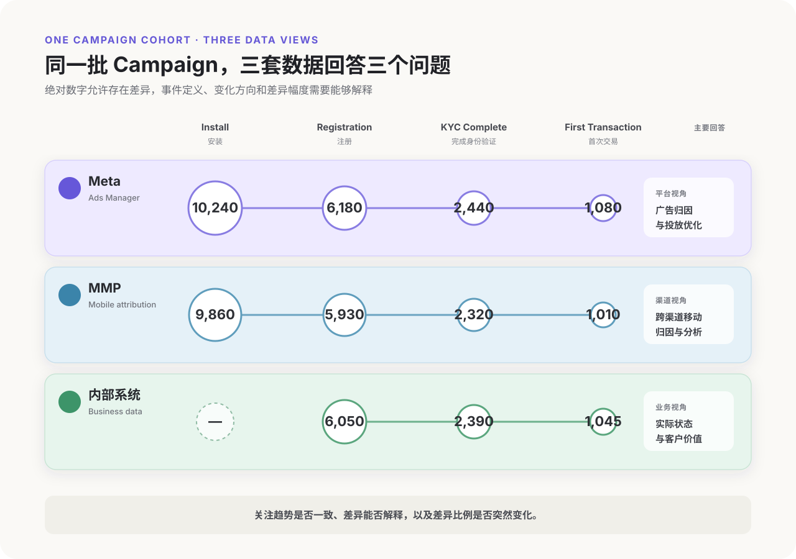
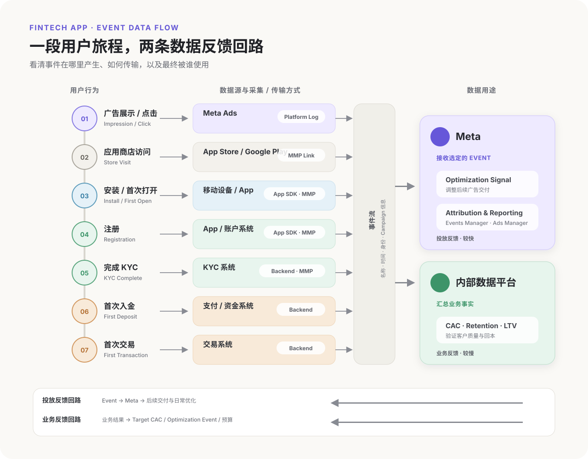
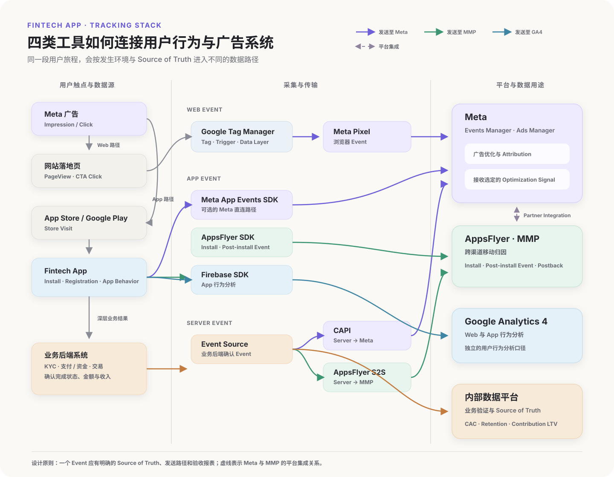

第一次为 Meta 广告搭建数据追踪体系时，很容易从工具开始：网站有没有安装 Pixel，App 有没有接入 SDK，是否使用 MMP，要不要配置 Conversions API（CAPI）。这些问题确实需要回答，但“工具已经接入”只能说明数据具备了传输条件，无法直接证明它能够支持广告决策。

我们需要更加关心的是另一组问题：用户完成了什么行为，这个行为在业务中代表什么，Meta 能否及时、稳定地收到它，以及收到后究竟用于优化、归因还是业务分析。

以 Fintech App 为例，Install、Registration、KYC Complete、First Deposit 和 First Transaction 都可以被记录为事件，但它们传递给广告系统的含义完全不同。Install 发生得早、数量多，距离收入也更远；First Transaction 更接近商业价值，通常需要更长时间才能发生，事件量也可能更少。选择哪一个事件，影响 Meta 会寻找什么样的用户，也影响投手如何解释 Campaign 表现。

即使事件已经回传，Meta、MMP 和内部业务系统中的数字也经常无法完全一致。Meta 按照自己的 Attribution 规则报告广告结果，MMP 负责识别移动渠道与安装或 App Event 的关系，内部系统记录 KYC、资金和交易等业务事实。三套数据回答的问题不同，时间和身份口径也可能不同。看到差异时，直接选择数字最大或最小的一方都缺乏依据。

Meta 的官方文档能够说明 Pixel、App SDK 和 CAPI 如何配置，也会提供 Events Manager 的诊断信息。投手仍然需要把分散在广告平台、MMP 和内部系统中的事件放回完整业务链路，判断哪些信号适合投放学习、哪些数据适合日常监控，以及最终应由什么业务结果验收。

## Meta 广告为什么需要业务数据

Meta 能直接观察到的是广告展示、点击，以及广告主通过网站、App 或服务器发送给平台的 Event。它无法自行理解一次注册是否通过了后续审核、一笔入金是否最终形成交易，也无法知道某个客户在三个月后贡献了多少利润。广告主向平台提供什么数据，决定了系统能够学习和优化到哪一层。

对投手而言，业务数据至少承担三项任务：为 Meta 提供 Optimization Signal，为日常投放提供过程反馈，以及为最终效果提供业务验证。围绕这些任务，Attribution 进一步决定广告接触、渠道和 Campaign 如何获得转化归属。

### 为系统提供 Optimization Signal

创建 Campaign 时，广告主会通过 Campaign Objective、Conversion Location、Performance Goal 和 Optimization Event 等设置告诉 Meta 希望获得什么结果。系统随后根据能够观察到的行为寻找更可能完成该结果的用户。

如果一个 Fintech App 围绕 Install 优化，系统会优先寻找更可能安装 App 的用户。这些用户是否愿意完成 KYC、入金和交易，需要通过后续数据验证。如果 KYC Complete 或 First Transaction 能够稳定回传，并且拥有足够事件量，它们可以向 Meta 提供更接近业务价值的信号。

深层事件也有其局限性：事件数量过少、回传延迟很长、定义频繁变化或数据大量缺失时，深层事件很难形成稳定信号。投手选择 Optimization Event 时，需要同时考虑业务相关性、事件量、回传速度和数据质量。

这里有一个容易忽略的区别：Optimization Event 是系统寻找用户时使用的信号，最终业务事件是团队判断客户价值时采用的标准。两者可以相同，也可以处于转化链路的不同位置。例如，Campaign 暂时围绕 KYC Complete 优化，业务仍然可以使用 Cost per First Transaction 和 D90 Contribution LTV 验收结果。

### 为投手提供过程反馈

投放过程中，投手需要尽快知道 Campaign 是否正常运行，以及问题出现在哪一层。Spend、Impression、Click 和 Install 可以反映广告交付与浅层转化，Registration、KYC Complete 或 Purchase 等事件能够进一步说明用户进入产品后的行为。

这些过程数据帮助投手回答：

- Campaign 是否正常获得展示和花费？
- 广告点击后，用户是否进入网站或 App？
- Optimization Event 的数量和成本是否出现异常？
- 某次预算、素材或产品改动后，漏斗从哪一层开始变化？
- 成本变化来自媒体交付，还是点击后的产品转化？

例如，Cost per KYC Complete 上升可能由 CPM 增长、CTR 下降、Install Rate 下降或 KYC Complete Rate 下降造成。只观察最终成本，会看到结果恶化；把相关事件连接成漏斗，才能判断问题更接近广告、商店页面、Onboarding 还是 KYC 流程。

过程反馈需要足够及时，但不能替代成熟的业务结果。一个 Campaign 上线两天后 CPI 很低，只能说明它在当前阶段获得安装的效率较高；用户是否会继续产生价值，还需要等待更深层事件和 Cohort 成熟。

### 为业务提供结果验证

广告平台中的转化数量属于平台归因结果，业务系统中的订单、订阅、入金和交易记录则更接近实际经营结果。投手需要把两者连接起来，检查广告带来的用户是否继续完成关键行为，以及这些行为能否覆盖获客成本。

对于 Fintech App，业务验证可能包括：

- 广告用户的 KYC 通过率是否稳定。
- First Deposit 和 First Transaction 的转化率是否稳定，是否显著低于自然流量或其他渠道。
- 不同 Campaign 获得的客户在 D30、D90 的活跃和 Contribution LTV 是否存在差异。
- Media CAC 和回本周期是否处于业务能够接受的范围内。
- 投放规模增加后，边际客户质量是否发生变化。

如果 Meta 报告的 Registration 持续增长，而内部系统中的 First Transaction 没有同步增长，平台交付可能已经完成了指定任务，但当前 Optimization Event 对最终价值的预测能力需要重新评估。此时继续降低 Cost per Registration，未必能改善真实获客效率。

下面使用一组模拟数据展示同一批 Campaign 在 Meta、MMP 和内部业务系统中的记录方式，所有数字采用相同统计周期。



在这组模拟数据中，Meta 报告的归因转化高于 MMP，内部系统记录的 Registration、KYC Complete 和 First Transaction 又与两者略有差异。差异本身不能直接证明某一方出错，还要继续检查 Attribution Window、事件定义、回传时间和用户匹配方式。三个系统的趋势方向突然分离，或者差异比例在没有业务变化时明显扩大，才更值得优先排查。

因此，评估数据追踪是否有效时，可以先问三个问题：Meta 是否获得了可用的学习信号，投手是否拥有及时的过程反馈，业务是否能够验证最终价值。接下来再沿着事件从产生到被使用的路径，确认每个工具在其中承担什么作用。

## 投手需要看懂的最小数据链路

一次转化出现在 Ads Manager 之前，通常已经经过多个系统。用户先在网站或 App 中完成行为，追踪工具将部分信息发送给 Meta，平台再进行接收、匹配、归因和报表处理。投手最终看到的数字位于这条链路的下游。

理解这条链路才能在数据异常时知道问题可能发生在哪一段。Events Manager 没有收到事件、事件已经收到但 Ads Manager 没有转化，以及平台转化与内部订单不同，分别对应不同的检查方向。

### 一次事件从发生到被使用的六个环节

可以把最小数据链路拆成六个环节：

```text
用户完成行为
→ 数据源记录
→ 追踪工具采集和传输
→ Meta 接收与处理
→ Campaign 用于优化和归因
→ 内部数据验证业务价值
```

| 环节 | 核心问题 | 投手需要知道什么 |
| --- | --- | --- |
| 用户完成行为 | 用户实际做了什么？ | Event 对应的真实动作和完成条件 |
| 数据源记录 | 哪个系统最先确认该行为？ | 网站、App、CRM、支付或交易系统中谁是 Source of Truth |
| 采集和传输 | 数据通过什么方式离开来源系统？ | 使用 Pixel、App SDK、MMP、CAPI，还是由其他集成发送 |
| Meta 接收与处理 | 平台是否成功收到并识别事件？ | Event 是否出现，时间、名称和关键字段是否合理 |
| 优化和归因 | 事件如何影响投放与报表？ | 是否被选为 Optimization Event，是否满足当前 Attribution 规则 |
| 业务验证 | 这批用户最终是否产生价值？ | 内部转化、CAC、Contribution LTV 和回本表现 |

投手不需要实现每一环的技术逻辑，但需要知道每一段由谁负责、预期会产生什么结果，以及异常时应该从哪一层开始沟通。

### 先找到事件的 Source of Truth

同一个名称可能出现在多个系统中，但最早确认业务事实的系统通常只有一个。这个系统可以被视为该事件的 Source of Truth。

例如，网站页面可以记录用户点击“提交订单”，支付系统才能确认付款是否成功；App 可以记录用户提交 KYC 资料，KYC 系统才能确认审核是否通过；MMP 可以接收 First Transaction Event，交易系统才掌握交易是否真实完成、是否撤销以及最终产生了多少收入。

如果数据源没有正确记录，后面的 Pixel、MMP 或 CAPI 也无法生成可靠数据。反过来，数据源已经拥有正确记录，而 Meta 缺少事件时，问题更可能位于采集、传输或平台接收环节。

因此，在制定数据跟踪计划时，每个关键 Event 都应该回答：

- 哪个系统最先确认这个行为完成？
- 什么状态才算完成，而非开始或提交？
- 行为被撤销、退款或审核拒绝后，原记录如何处理？
- 哪个团队负责确认来源数据是否正确？

对于投手来说，Source of Truth 的价值在于提供一个业务参照。平台报表出现异常时，可以先确认真实行为有没有变化，再决定是否需要检查广告交付或数据传输。

### 区分数据采集、传输和接收

“事件已经埋点”“事件已经发送”和“Meta 已经收到”描述的是三个不同状态。

数据采集发生在用户行为被记录时。例如，用户打开 App、完成注册或提交 KYC 后，App 或后端生成对应 Event。数据传输指 Pixel、SDK、MMP 或服务器集成将 Event 发送到目标平台。Meta 接收后，还需要识别 Event Name、发生时间和其他必要信息，随后才可能把它用于报表或投放。

这三个状态经常被一句“埋点已经做好”合并。遇到事件缺失时，投手可以依次确认：

1. 来源系统中是否存在这条业务记录。
2. 对应的追踪工具是否触发并发送 Event。
3. Events Manager 或相关数据源中是否收到 Event。
4. Ads Manager 是否在相应时间和 Attribution 口径下报告结果。

前两项通常需要开发、数据或 MMP 管理人员协助，后两项是投手可以直接参与检查的部分。

### Meta 收到 Event 与 Ads Manager 归因转化是两回事

Event 出现在 Events Manager，说明 Meta 数据源接收到了该事件。它是否出现在某个 Campaign 的结果中，还要看用户是否与广告接触建立关联、事件是否落在 Attribution Window 内，以及报表采用什么时间和转化口径。

因此，可能出现以下情况：

- Events Manager 持续收到 Purchase，某个 Campaign 没有获得 Purchase Attribution。
- MMP 记录了 Install，Meta 将其中一部分 Install 归因给广告。
- 内部系统确认了 First Transaction，事件因回传延迟暂时没有出现在 Meta 报表中。
- Meta 报告了 View-through Conversion，MMP 或内部渠道报表采用不同规则，没有把功劳分配给 Meta。

这些情况需要分别检查事件接收和 Attribution，不能仅凭 Ads Manager 中的转化数量判断追踪工具是否正常。

### App 业务通常跨越更多系统

网站购买通常可以在浏览器和网站后端之间完成。App 获客还会经过广告平台、App Store 或 Google Play、移动设备、App、MMP 和业务后端。Fintech 产品的 KYC、支付与交易又可能来自独立服务，完整路径会进一步延长。

一个简化的 Fintech App 数据链路可能是：

```text
Meta 广告展示或点击
→ App Store / Google Play
→ Install 与 First Open：App SDK 或 MMP
→ Registration：App 或账户系统
→ KYC Complete：KYC 系统
→ First Deposit：支付或资金系统
→ First Transaction：交易系统
→ 选定 Event 回传 Meta
→ 内部数据平台计算 CAC、留存与 Contribution LTV
```

用户看到的是一段连续体验，数据则分散在多个系统中。只接入 App SDK，通常无法自动获得 KYC 审核或交易结果；只查看内部交易系统，也无法独立判断客户来自哪个广告接触。完整追踪需要把必要的业务 Event 与获客信息连接起来。



### 数据链路中存在两条反馈回路

第一条是投放反馈回路。用户完成 Event 后，数据被发送给 Meta，系统利用信号调整后续广告交付，投手通过结果数量、成本和转化率进行日常优化。这条回路需要较快、较稳定的数据。

第二条是业务反馈回路。用户行为进入内部数据平台后，团队继续观察收入、留存、Contribution LTV 和回本周期，再据此调整 Target CAC、Optimization Event 与预算。这条回路通常更慢，也更接近最终价值。

两个反馈回路共同决定数据追踪是否真正可用。只有投放回路时，Meta 可以持续获得转化，却可能沿着一个无法预测长期价值的浅层 Event 优化；只有业务回路时，团队知道客户最终质量，却无法及时把有效信号反馈给广告系统。

完成这张最小数据链路后，投手应该能够指出每个关键 Event 的 Source of Truth、传输方式、Meta 接收位置和业务验证报表。下一步再分别理解 Pixel、App SDK、MMP 和 CAPI 在链路中的职责，就不容易把不同工具当成可以相互替代的方案。

## Pixel、App SDK、MMP 和 CAPI 分别解决什么问题

Pixel、App SDK、MMP 和 Conversions API（CAPI）经常同时出现在数据追踪方案中，也容易被放在一起比较。它们实际位于数据链路的不同位置：有的负责采集网站行为，有的记录 App 内 Event，有的连接移动广告触点与后续行为，还有的把服务器已经确认的结果发送给 Meta。

对投手来说，关键是判断业务需要哪些能力、重要 Event 通过哪条路径进入 Meta，以及各系统的数据能否相互验证。具体的 SDK 集成、API 请求和服务器部署可以由开发团队负责。

| 工具或系统 | 主要覆盖范围 | 主要作用 | 投手需要确认的问题 |
| --- | --- | --- | --- |
| Meta Pixel | 网站浏览器中的行为 | 采集 PageView、Lead、Purchase 等网站 Event，并发送给 Meta | Event 是否在正确页面或动作后触发；名称、Value 和 Currency 是否符合定义 |
| App SDK | App 内行为 | 从 App 记录 Install、Registration、Purchase 等 App Event，并发送给 Meta | 关键 App Event 是否已经接入；测试环境与正式环境是否混淆 |
| MMP | 移动 App 的跨渠道测量 | 连接广告触点、Install 和 Post-install Event，并按自身规则提供归因结果 | 哪些媒体与 Event 已接入；MMP 的 Attribution 口径是什么；哪些 Event 会回传 Meta |
| CAPI | 服务器到 Meta 的数据传输 | 将网站后端、CRM 或其他业务系统确认的 Event 发送给 Meta | Event 来自哪个 Source of Truth；延迟和字段是否可用；与浏览器 Event 是否正确去重 |
| 内部业务系统 | 账户、KYC、支付、交易与收入数据 | 确认业务事实并计算 CAC、留存、LTV 和回本表现 | 哪个系统确认最终状态；平台数据与业务结果如何定期核对 |

这张表也解释了为什么“已经安装 Pixel”或“已经接入 MMP”不足以证明追踪完整。工具覆盖的环境和职责不同，最终方案取决于用户路径与关键 Event 出现的位置。

### Meta Pixel：记录网站浏览器中的用户行为

[Meta Pixel](https://developers.facebook.com/docs/meta-pixel/) 是部署在网站上的追踪代码，适合采集页面访问、表单提交、注册和购买等浏览器端行为。对于以落地页获客的业务，它通常是最直接的数据入口，也便于投手在 Events Manager 中检查 Event 是否持续收到。

Pixel 的可见范围主要限于网站浏览器。用户点击广告后前往 App Store，再进入 App 完成注册或交易，Pixel 无法继续观察 App 内路径。即使行为发生在网站，浏览器限制、Consent 状态、页面加载失败或用户过早关闭页面，也可能影响 Event 的采集和发送。

### App SDK：把 App 内 Event 提供给 Meta

[Meta App Events SDK](https://developers.facebook.com/docs/app-events/) 用于记录 App 环境中的行为。Install、App Launch、Registration 或 In-app Purchase（IAP）等 Event 可以通过相应集成发送给 Meta，支持 App Campaign 的测量与优化。

SDK 只能发送产品明确采集并配置的 Event。Fintech App 中的 KYC Complete、First Deposit 或 First Transaction 可能由后端系统最终确认，仅在前端记录按钮点击或成功页面，容易把“用户发起操作”和“业务确认完成”混为一谈。这类 Event 是否应由 App 发送，需要结合 Source of Truth 和业务流程判断。

### MMP：衡量移动获客并连接 Install 与后续行为

MMP（Mobile Measurement Partner，移动测量合作伙伴）常见产品包括 [AppsFlyer](https://www.appsflyer.com/)、[Adjust](https://www.adjust.com/) 和 [Singular](https://www.singular.net/)。它通常通过 SDK、媒体集成和服务器连接，帮助 App 广告主跨多个渠道衡量 Campaign，并将广告互动与 Install、Registration、Purchase 等 Post-install Event 建立联系。

MMP 对同时投放 Meta、Google、TikTok 或联盟渠道的团队尤其重要，因为它提供了一套相对统一的移动获客观察口径。不过，MMP 仍有自己的 Attribution Window、去重和渠道分配规则，其结果不必与 Meta Ads Manager 完全一致。

MMP 也不能代替内部业务系统。它可以收到 KYC Complete 或 First Transaction，却未必拥有审核状态变更、撤销交易、净收入和 Contribution LTV 等完整信息。团队仍需用内部数据确认用户的最终业务价值。

### CAPI：从服务器发送业务确认后的 Event

[Conversions API（CAPI）](https://developers.facebook.com/docs/marketing-api/conversions-api/) 允许企业从服务器、CRM 或其他数据源向 Meta 发送 Event。网站 Purchase、Lead 后续状态或线下成交等结果由后端确认时，CAPI 可以提供一条不完全依赖浏览器的传输路径。

CAPI 改善的是数据传输能力，不会自动修正业务定义。如果 CRM 把尚未审核的线索标记为 Qualified Lead，或者后端把入金申请当成 First Deposit，错误定义同样会稳定地传给 Meta。因此，接入前应先确认 Event 的完成条件、来源系统和允许用于广告优化的数据范围。

同一个 Event 可能同时由 Pixel 和 CAPI 发送。此时需要正确的去重设计，避免 Meta 将一次转化识别为两次。投手不需要编写去重逻辑，但应在验收时确认浏览器与服务器 Event 没有造成明显重复，并让开发团队说明采用了什么识别方式。

### 四类工具应根据用户路径组合

实际方案通常会组合使用这些工具：

- **网站转化业务**：Pixel 采集浏览器行为；当 Purchase、Qualified Lead 或成交状态由后端确认时，可通过 CAPI 补充服务器 Event。
- **纯 App 获客**：App SDK 或 MMP 负责连接 Install 与 In-app Event。是否同时使用，以及 Event 通过哪条路径回传 Meta，应根据现有 Attribution 体系和集成方案确定。
- **Web-to-App 路径**：Pixel 观察广告落地页，MMP 连接 App Install 与 Post-install 行为，内部标识或 Deep Link 参数帮助串联两段路径。
- **Fintech App**：MMP 或 App SDK 提供 Install 和前期 App Event，KYC、入金及交易系统确认深层业务 Event，再将适合优化的信号发送给 Meta，同时由内部数据平台验证 CAC、留存和 Contribution LTV。

下面这张图以包含 Web-to-App 路径的 Fintech App 为例。[Google Tag Manager](https://support.google.com/tagmanager/answer/6102821?hl=zh-Hans)（GTM）管理落地页上的 Tag 与触发条件，数据可以分别发送给 Meta Pixel 和 [Google Analytics](https://support.google.com/analytics/answer/11593727?hl=zh-Hans)（GA4）。GTM 只负责管理和触发 Tag，本身不计算 Attribution。App 侧由 AppsFlyer SDK 采集 Install 和 Post-install Event，AppsFlyer 作为 MMP 提供跨渠道归因，并通过与 [Meta Ads 的官方集成](https://support.appsflyer.com/hc/en-us/articles/207033826-Meta-Ads-integration-setup) 交换测量所需的数据。KYC、入金和交易结果由业务后端确认后，可以进入内部数据平台，也可以按需要通过 CAPI 或 AppsFlyer 的 Server-to-Server（S2S）路径发送给广告与测量平台。

图中的几条路径代表可组合的实现方式，并不表示每个团队都要同时启用所有 SDK。实际方案需要明确每个 Event 的唯一来源与发送路径，尤其要避免同一 Event 由 Meta App Events SDK、AppsFlyer 和 CAPI 重复回传。



这里需要特别警惕重复建设。同一个 Registration 可能被 App SDK、MMP 和服务器分别发送给 Meta；如果命名、参数或去重规则没有统一，平台接收到的信号可能比缺失数据更难解释。

面对具体业务时，可以按以下顺序判断：

1. 关键 Event 发生在网站、App，还是业务后端？
2. 哪个系统最先确认 Event 真正完成？
3. 是否需要跨多个媒体渠道衡量 App 安装与后续行为？
4. 是否存在只能由服务器确认的深层 Event？
5. 每个 Event 通过哪条路径进入 Meta，会不会重复发送？
6. Meta、MMP 与内部报表分别由谁验收，差异如何解释？

当这些问题有明确答案时，工具组合才称得上可用。下一步还要从已经能够采集的业务行为中选择 Optimization Signal，因为技术上可以回传的 Event，并不一定适合交给 Meta 用于广告优化。

## 如何从业务 Event 中选择可用的 Optimization Signal

一条完整的用户路径可能产生几十个 Event，真正适合作为 Optimization Signal 的通常只有少数几个。Meta 会根据广告主选择的 Event 寻找更可能完成相同行为的用户，因此，Event 的定义会直接影响系统学习的方向。

如果 Fintech App 选择 Install，系统会优先寻找更容易安装 App 的用户；选择 KYC Complete，系统寻找的人群会更接近能够通过身份验证的用户；选择 First Transaction，信号距离收入更近，同时也可能面临数量更少、反馈更慢的问题。

选择 Optimization Signal，本质上是在业务价值与机器学习可用性之间寻找平衡。过浅的 Event 容易积累数据，却可能吸引大量低价值用户；过深的 Event 更接近最终结果，但如果发生频率过低或回传延迟过长，系统很难及时获得稳定反馈。

### 可采集、可优化和可验证是三个层次

团队首先要区分 Event 在数据体系中的三种用途：

| Event 用途 | 回答的问题 | Fintech App 示例 |
| --- | --- | --- |
| 数据采集 | 用户完成了什么行为？ | Install、Registration、KYC Submit、KYC Complete、First Deposit |
| 广告优化 | 希望 Meta 按什么行为寻找用户？ | Registration 或 KYC Complete |
| 业务验证 | 这批用户最终是否有价值？ | First Transaction、D30 Retention、Contribution LTV、Payback Period |

所有关键 Event 都值得进入分析体系，但不需要全部成为 Optimization Event。D90 Contribution LTV 很接近长期业务价值，它的反馈周期通常不适合日常投放学习；Install 可以快速积累，却无法单独证明获客质量。前者更适合作为业务验证指标，后者可以用于观察获客入口或特定冷启动阶段。

同一个 Event 的用途也会随业务阶段变化。First Deposit 在低预算市场可能只能作为结果指标，在数据量较大的市场则可能具备直接优化条件。因此，Optimization Signal 需要结合账户、市场、预算和转化规模判断。

### 一个可用的 Optimization Signal 应满足五个条件

#### 1. 与业务价值存在明确关系

Event 越能预测后续收入、留存或合格客户，业务相关性越高。判断这种关系需要查看真实 Cohort：完成 Registration 的用户中有多少通过 KYC，完成 KYC 的用户中有多少入金和交易，以及不同 Event Cohort 的留存和 Contribution LTV 是否存在稳定差异。

“发生在漏斗更深处”不能自动证明 Event 更有价值。例如，某些 First Deposit 可能来自短期奖励活动，后续没有交易；某些通过 KYC 的用户则可能具有更高的长期活跃概率。最终仍要由业务数据验证。

#### 2. 在当前投放规模下有足够数量

系统需要反复观察 Event，才能识别哪些广告接触和用户特征与结果相关。Event 数量过少时，单个用户、某一天的异常或一次促销活动都可能明显改变结果，Campaign 交付也更容易波动。

这里不建议把某个固定数量当成适用于所有账户的硬门槛。投手可以观察 Event 是否持续发生、Cost per Event 是否剧烈波动、Campaign 是否长期缺少结果，以及预算增加后 Event 数量能否同步增长。判断对象应当是当前 Campaign 的真实反馈密度，而非脱离业务背景的通用数字。

#### 3. 能够及时回传

Registration 通常在安装后较快发生，KYC Complete 可能等待数小时或数天，First Transaction 还可能受到入金到账和市场开放时间影响。反馈间隔越长，Meta 调整交付的速度通常越慢，新 Campaign 也需要更长时间才能积累可判断的数据。

#### 4. 定义稳定且数据可信

Optimization Event 必须代表一个清晰、可重复的业务状态。KYC Complete 应明确表示审核通过，First Deposit 应明确表示资金到账，First Transaction 应说明是否排除模拟交易、失败交易和随后撤销的交易。

如果不同地区、系统版本或平台端采用不同完成条件，同名 Event 会混合不同质量的信号。

#### 5. Meta 能够识别并用于当前 Campaign

Event 已经进入内部数据库，不代表 Meta 能够接收、匹配并在当前投放设置中使用。上线前需要确认 Event 持续出现在对应 Data Source 中，参数和时间没有明显异常，并且可以在所使用的 Campaign 配置中被选择。

### Fintech App 的 Event 应怎样取舍

下面是一种常见的判断方式，表中的数量和速度为相对关系，不能直接代替具体产品的数据：

| Event | 业务价值距离 | 常见数据量 | 常见反馈速度 | 更适合承担的角色 |
| --- | --- | --- | --- | --- |
| Install | 较远 | 高 | 快 | 获客入口观察、早期数据参考 |
| Registration | 较远至中等 | 较高 | 较快 | 冷启动或深层 Event 数量不足时的候选信号 |
| KYC Complete | 中等至较近 | 中等 | 中等，受审核影响 | 兼顾客户质量与反馈数量的候选信号 |
| First Deposit | 较近 | 较低 | 中等至较慢 | 数据量充足时的深层候选信号 |
| First Transaction | 接近收入 | 低 | 较慢 | 成熟规模下的候选信号，或长期质量验证指标 |
| Repeat Transaction / Contribution LTV | 最接近长期价值 | 很低 | 很慢 | Cohort 评估和业务验证 |

假设一个新市场每周可以获得大量 Registration，KYC Complete 已经稳定发生，First Transaction 数量仍然很少。此时可以先比较 Registration Campaign 与 KYC Complete Campaign 带来的后续入金率和交易率。如果 KYC Complete 能保持稳定交付，并显著改善下游质量，它更适合作为下一阶段的 Optimization Signal。First Transaction 可以继续进入 Meta 和内部报表，用来观察更长期的结果，等数据规模与时效性满足条件后再测试直接优化。

这套取舍不等于沿漏斗单向升级。市场规模下降、预算被拆分、KYC 流程变长或 Event 回传异常时，原本可用的深层信号可能失去学习条件。团队可以暂时采用发生更频繁的上游 Event，同时用 First Deposit、First Transaction 和 Contribution LTV 约束质量。

最终选中的 Optimization Signal 应当能够稳定告诉 Meta“什么样的用户更接近当前业务目标”，内部指标则持续检查系统有没有沿着正确方向寻找用户。

## 为什么 Meta、MMP 和内部系统的数据对不上

投手经常会遇到这样的情况：Meta Ads Manager 报告了 1,000 次转化，MMP 只归因到其中一部分，内部系统统计出的业务结果又是另一个数字。三套数据存在差异，不一定代表某个系统发生故障。它们记录的对象、采用的归因规则和回答的业务问题原本就不同。

理解差异的第一步，是明确每套系统所代表的数据的含义：

| 数据系统 | 主要回答的问题 | 更适合支持的决策 |
| --- | --- | --- |
| Meta | 哪些结果可以按照 Meta 的规则归因给广告？ | Campaign 交付、Optimization 和平台内日常判断 |
| MMP | 多个移动获客渠道之间，Install 和 Post-install Event 应如何分配？ | 跨渠道 Attribution、媒体比较和移动获客分析 |
| 内部业务系统 | 实际发生了多少注册、KYC、入金、交易和收入？ | CAC、Retention、LTV、Payback Period 和经营判断 |

Meta 的数字属于平台 Attribution 结果，MMP 提供跨渠道测量口径，内部系统确认业务事实。投手需要找到各系统之间稳定、可解释的关系，没有必要要求三者在任何报表中完全相等。

### 归因规则不同

同一位用户可能在 Meta 看到广告，在另一个渠道点击广告，随后完成安装和 KYC。Meta 和 MMP 对这段路径可以采用不同的 Attribution Window、触点优先级以及 Click-through 和 View-through 规则，最终将转化分配给不同渠道。

Meta 还可以识别发生在不同设备上的部分广告接触与转化，MMP 则会受到设备标识、媒体数据共享和自身 Attribution Model 的限制。AppsFlyer 的[官方差异说明](https://support.appsflyer.com/hc/en-us/articles/4410481130641-Meta-ads-discrepancies)也将 Attribution Window、跨渠道分配、Cross-device Attribution、时区和 Re-engagement 口径列为 Meta 与 AppsFlyer 数据不一致的常见原因。

因此，Meta 报告的 KYC Complete 数量高于或低于 MMP，都可能发生。仅比较总数无法判断哪个系统“更准确”，还要确认双方是否在比较同一类用户和同一段 Attribution 范围。

### 统计时间不同

三个系统可能把同一次转化记录在不同日期：

- Meta 报表可以按照广告 Impression 或 Click 所在日期呈现归因结果。
- MMP 报表可能按照 Install、Re-engagement 或 Event Activity 的日期组织数据。
- 内部系统通常按照 KYC 审核通过、资金到账或交易完成的实际时间记录结果。

例如，用户周一点击广告，周二安装 App，周四通过 KYC，周五完成首次交易。查看“周一获得的用户最终产生多少交易”和查看“周五发生了多少交易”，得到的是两种时间口径。前者属于 Acquisition Cohort，后者属于 Event Activity。

账户时区也会改变每日数据的边界。一个 Event 在北京时间凌晨发生，可能被另一个采用 UTC 的系统计入前一天。日数据看起来差异明显时，周度或更长周期的趋势可能依然接近。

### Event 定义与统计单位不同

名称相同不能保证定义一致。App 前端可能在用户提交 KYC 资料时触发 KYC Event，内部系统要等审核通过后才记录 KYC Complete；支付页面可能记录 Deposit Submitted，资金系统只统计已经到账的 First Deposit。

统计单位也需要确认：

- 统计 Event 次数，还是完成 Event 的 Unique Users？
- 重复入金是否全部计数，还是只记录 First Deposit？
- 失败、撤销、退款和审核拒绝是否会从业务结果中剔除？
- Re-install、Re-attribution 和 Re-engagement 是否归入新用户？
- Revenue 使用 Gross Revenue、Net Revenue，还是扣除奖励和手续费后的 Contribution？

这些差异都可能让数据在技术上正确、业务上却无法直接比较。对账前需要把 Event Name 翻译成明确的业务状态与统计单位。

### 数据传输、匹配与处理也会造成差异

内部系统已经记录 Event，只能说明业务行为真实发生。Event 还需要经过 SDK、MMP、CAPI 或 Partner Integration 才能到达 Meta。以下问题会减少、延迟或放大平台中的数据：

- Event Mapping 遗漏，导致 MMP 收到 Event 后没有回传 Meta。
- SDK 与服务器同时发送同一个 Event，去重失败后形成重复记录。
- Event Name、时间、Value 或 Currency 参数不符合约定。
- Event 回传延迟，导致不同时间查看报表时结果尚未成熟。
- Consent、ATT 状态或可用标识不同，影响平台匹配广告接触与用户行为。
- 测试环境、内部员工或异常交易只在部分系统中被过滤。

隐私限制下，部分平台数据还可能包含 Aggregated 或 Modeled Reporting，用户级明细因权限和媒体政策无法完整传递给 MMP。此时，总体趋势可以用于投放判断，逐条用户记录却未必能够一一对应。

### 先判断是合理差异还是数据异常

平台间存在差异很常见，差异突然改变则更值得关注。投手可以用下面的信号区分两类情况：

| 观察结果 | 更可能属于合理口径差异 | 更可能属于数据异常 |
| --- | --- | --- |
| 差异比例 | 长期处于相对稳定区间 | 某天或某次版本发布后突然扩大 |
| 趋势方向 | 三套系统大致同涨同跌 | 某一系统上升，其他系统持续下降或归零 |
| 影响范围 | 多个 Campaign 呈现相似差异 | 只影响特定 OS、App Version、地区或 Event |
| 漏斗关系 | 上下游 Event 的比例基本合理 | KYC Complete 突然高于 Registration，或重复量明显增加 |
| 数据成熟 | 随回传和转化周期逐步收敛 | 超过正常成熟时间后仍持续缺失 |

不要先设定一个适用于所有账户的“可接受差异率”。Web、Android、iOS、不同 Consent 结构和不同 Event 深度的正常区间都可能不同。更实用的做法是记录各系统在稳定时期的 Baseline，并对偏离历史关系的变化设置提醒。

---

Meta 广告的数据追踪体系由多个环节共同组成：业务系统确认用户行为，Pixel、App SDK、MMP 和 CAPI 负责采集或传输数据，Meta 使用其中一部分 Event 进行优化和 Attribution，内部数据平台继续验证客户质量与商业价值。任何一个工具都只能覆盖这条链路的一部分。

对投手来说，最重要的能力是把业务目标转换成清晰的 Event，理解 Event 从哪里产生、通过什么路径进入 Meta，以及每套报表能够支持什么判断。

