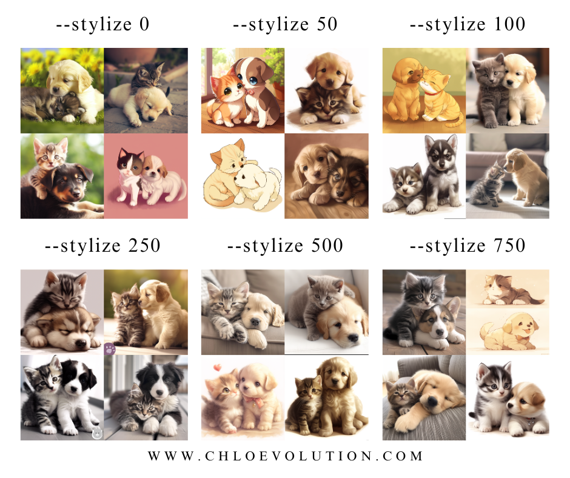
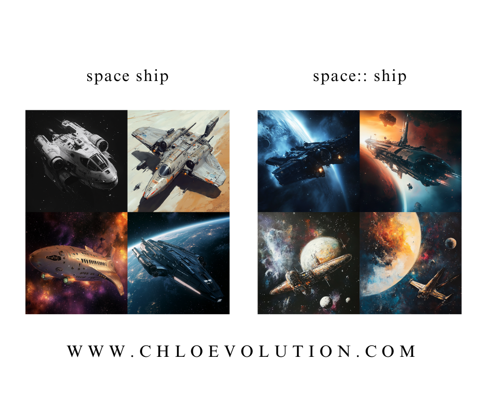
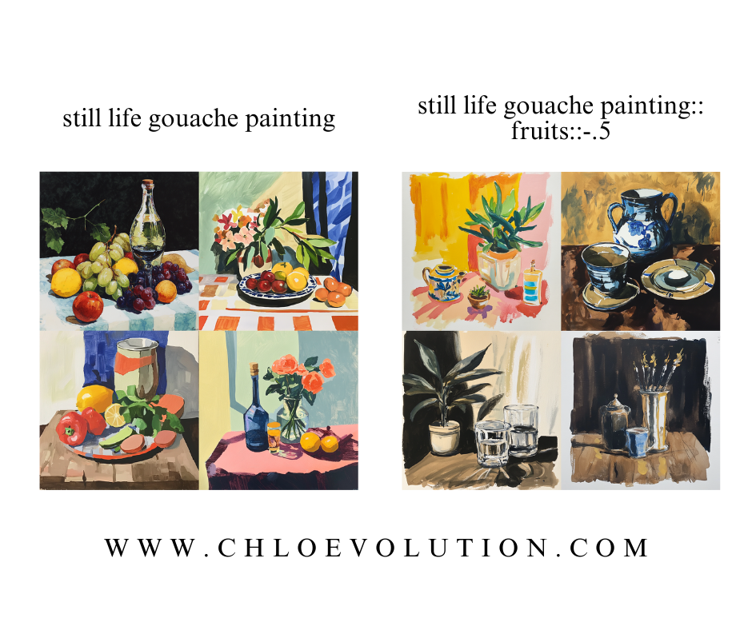
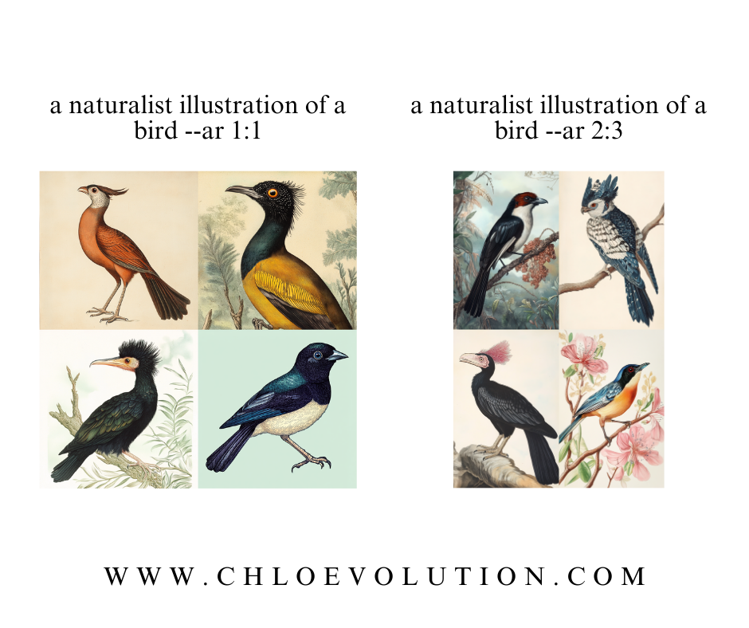

In [《Midjourney Tutorial for Beginners》](https://chloevolution.com/posts/midjourney-tutorial-for-beginners/), we covered Midjourney's basic setup, commands, parameters, and image generation methods. This article will introduce more advanced techniques to help generate images that better match your expectations.

## Advanced Prompt Parameters
### Quality
The `--quality` or `--q` parameter enhances image details without increasing resolution:
- Default value: 1
- Acceptable values: 0.25, 0.5, 1 (Values above 1 default to 1)


### Stylize
Lower Stylize values produce literal interpretations, while higher values increase artistic interpretation:
- Default: 100
- Acceptable range: 0-1000 (integers)
    - 50 ≈ Style low
    - 100 ≈ Style med
    - 250 ≈ Style high
    - 750 ≈ Style very high



### Chaos
`--chaos` or `--c` controls variation in initial image grids:
- Default: 0
- Range: 0-100
- Higher values = more diverse results


### Seed
Midjourney uses seed numbers to generate visual noise patterns as image generation starting points:
- Accepts integers 0-4294967295
- Identical seeds + prompts ≈ similar results
- Only affects initial image grid

## Using Image Prompts
Midjourney allows combining image URLs with text prompts. Use `--iw` to control image influence weight:
- Must combine images with text prompts
- Image position (before/after text) affects results

For detailed implementations, see:  
[《How to Use Midjourney CREF for Character Consistency》](https://chloevolution.com/posts/midjourney-cref/)  
[《How to Use Midjourney SREF for Style Consistency》](https://chloevolution.com/posts/midjourney-sref/)

## Multi-Prompts
Use `::` to separate and weight different concepts:
- Add space before/after double colons: `concept1 :: concept2`
- Default equal weighting



### Prompt Weighting
Add numbers after `::` to set relative weights:
- V1-V3: Integer weights only
- V4+: Supports decimal weights
- Unspecified = weight 1
- Ratios determine actual weighting: `space::2 ship` = 2:1 ratio


### Negative Weights
Remove elements using negative values:  


## Image Blending
Use `/blend` to merge 2-5 images:
- Equivalent to multi-image `imagine` prompts
- Max 5 images (use `/imagine` for more)
- No text prompts allowed

## Permutation Prompts
Use curly braces `{}` to create combinatorial variations:
### Text Permutations
```
/imagine a naturalist illustration of a {blueberry, rambutan} bird
```
Generates 2 separate tasks:  


### Parameter Permutations
```
/imagine a naturalist illustration of a bird --ar {2:3, 1:1}
```
Creates 2 aspect ratio variations:  


### Nested Permutations
Multiple braces create cross-product combinations:
```
/imagine a naturalist illustration of a {red, green} flower --ar {2:3, 1:1}
```
Generates 4 combinations (2 colors × 2 ratios):
```
/imagine...red flower --ar 2:3  
/imagine...red flower --ar 1:1  
/imagine...green flower --ar 2:3  
/imagine...green flower --ar 1:1
```
