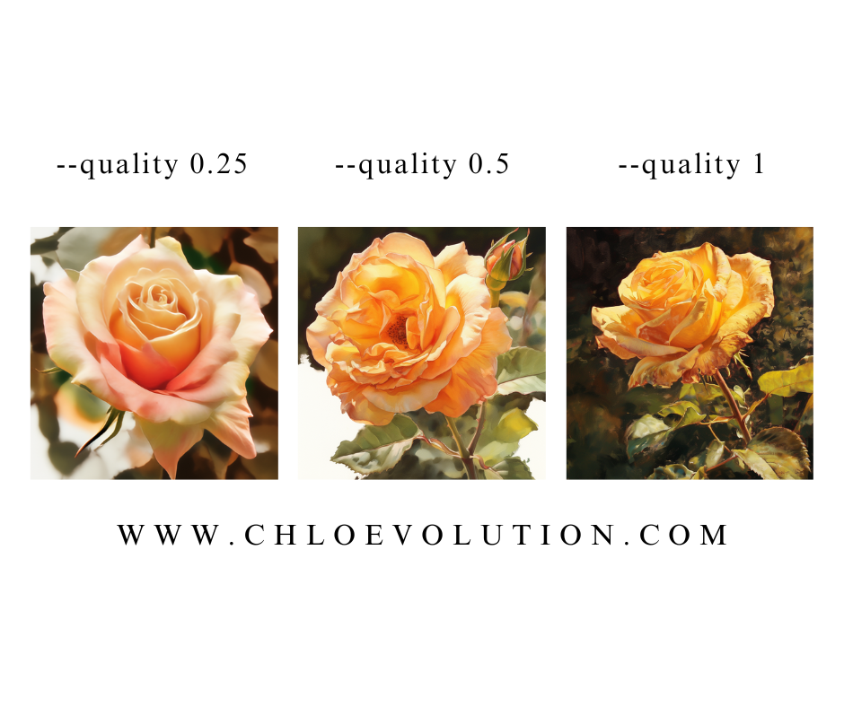
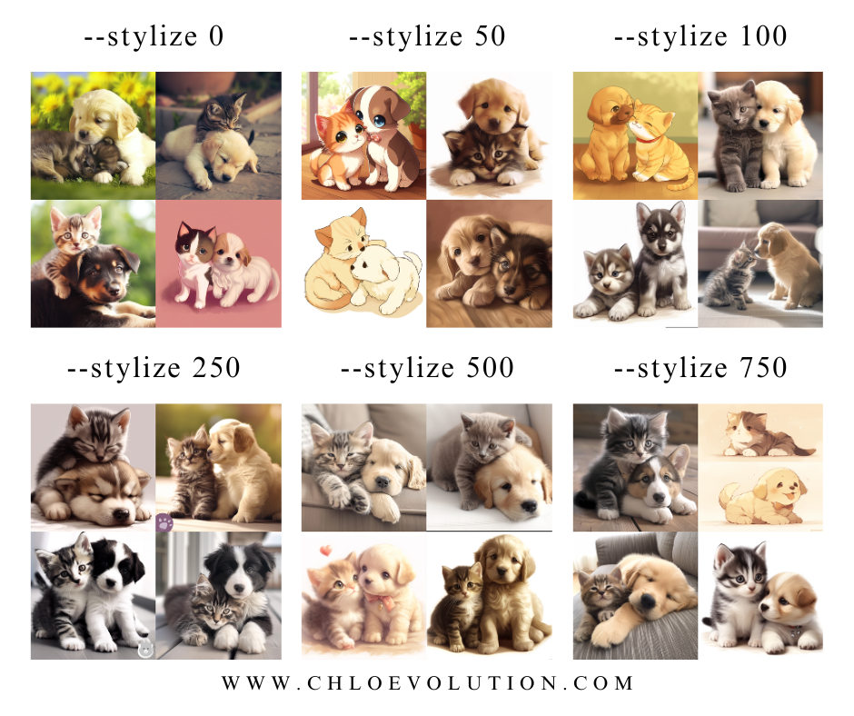
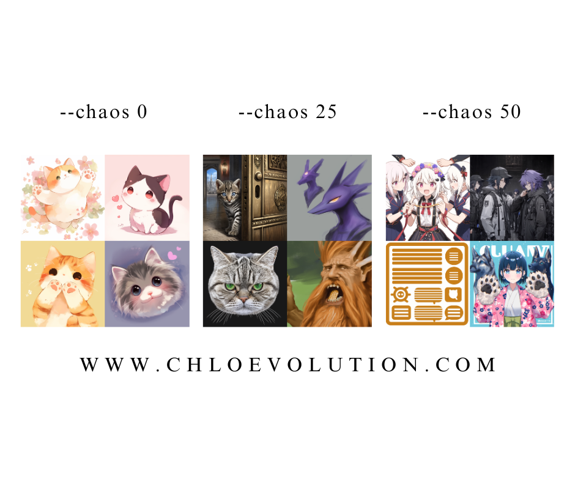
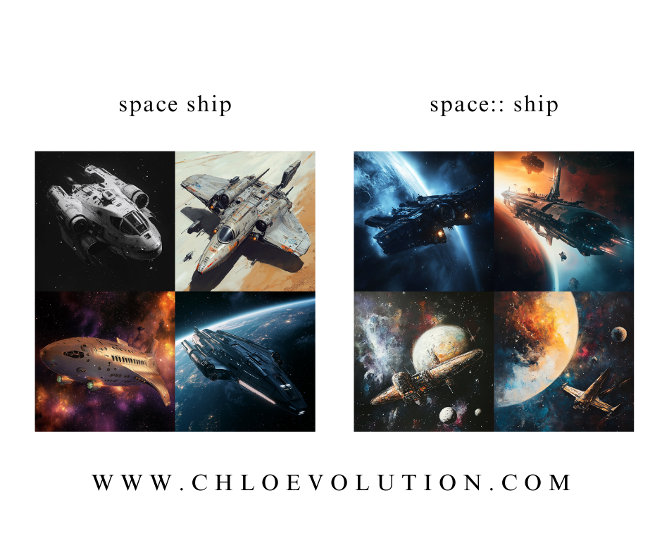
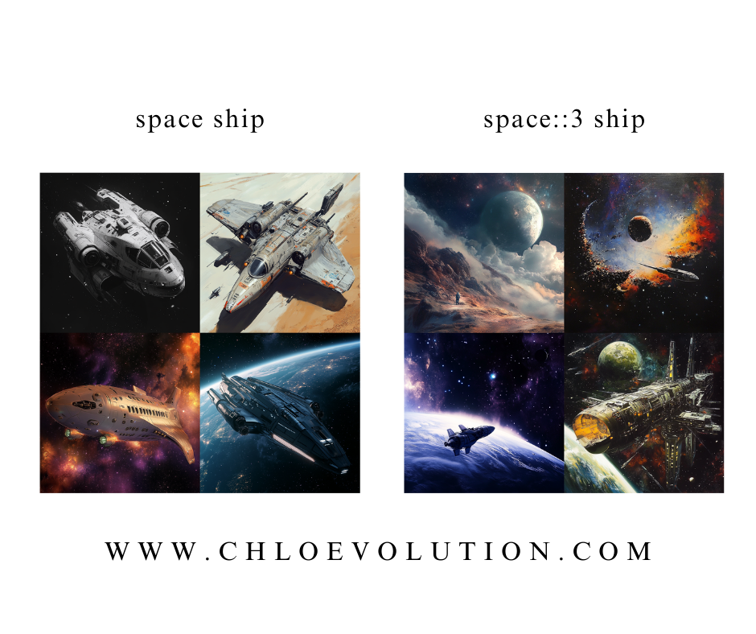
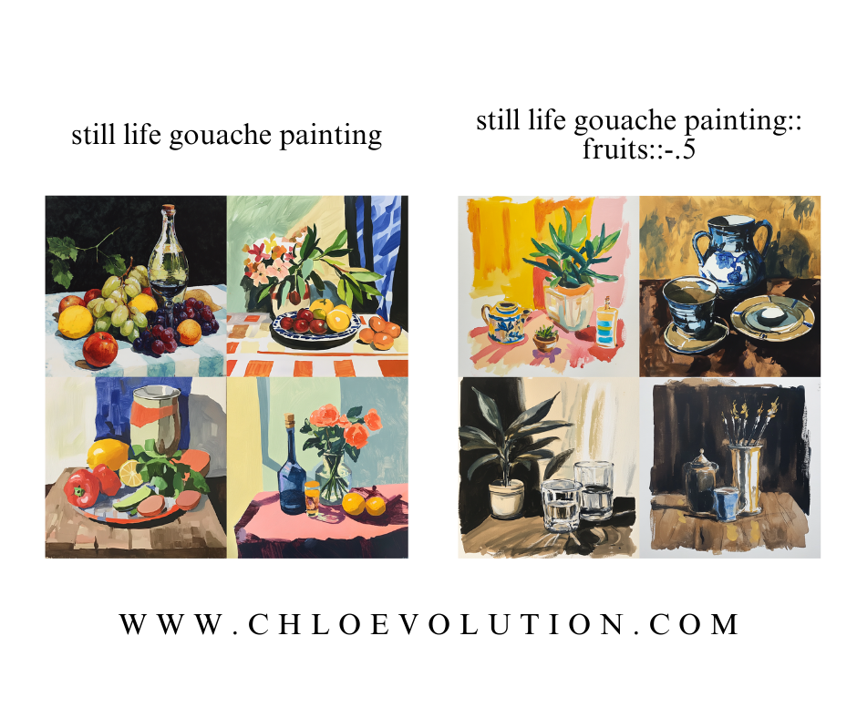
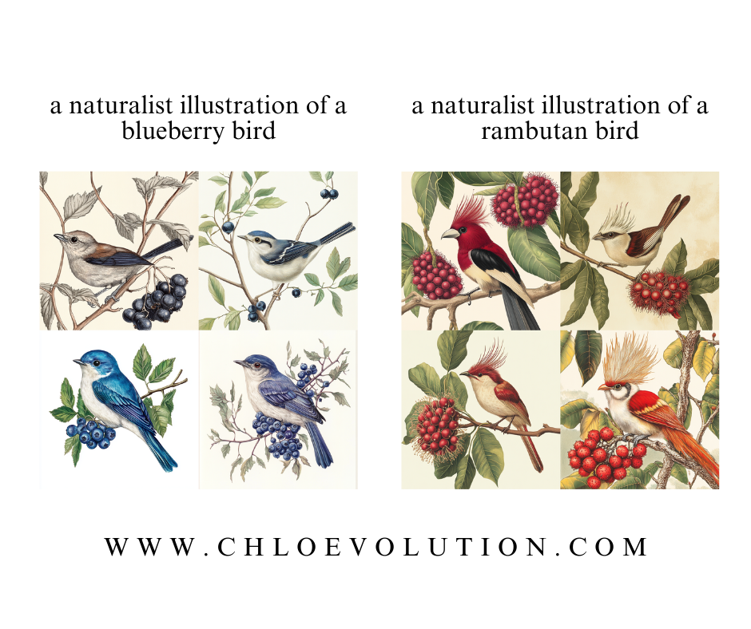
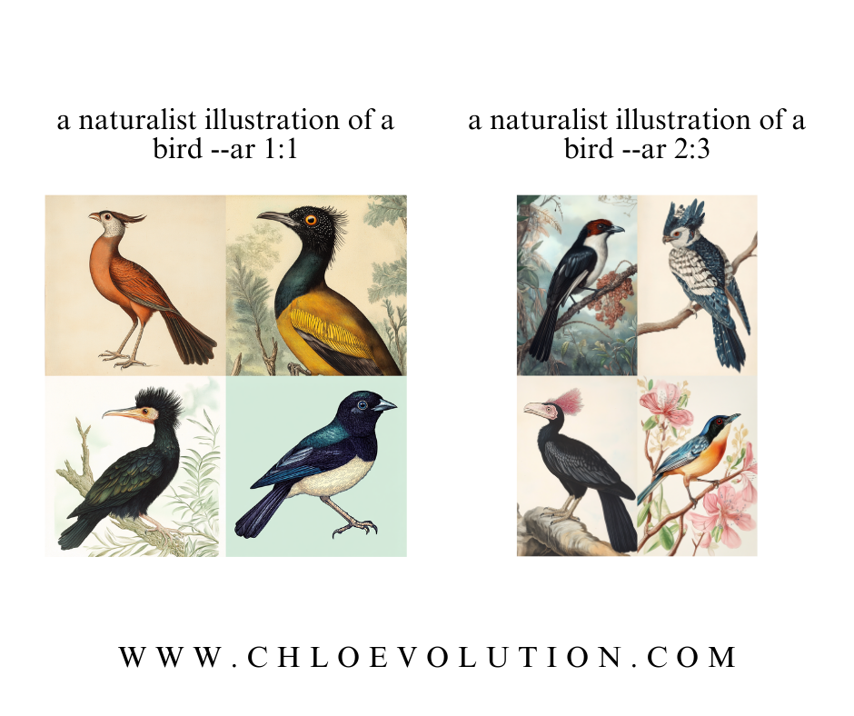

在[《适合新手的Midjourney教程》](https://chloevolution.com/zh-cn/posts/midjourney-tutorial-for-beginners/)中，我们介绍了Midjourney的基本设置、命令、参数以及图片生成的方法。本文想要介绍一些更加进阶的技巧，使得生成的图片更加符合预期。

## Prompt进阶参数
### Quality
`--quality`或`--q`参数不会提高图片的分辨率，但可以优化图片的细节
- 该参数的默认值为1
- 允许设置的值：0.25、0.5、1。任何高于1的值都一律视为1



### Stylize
低Stylize值生成的图片与用户提供的prompt非常接近，但艺术性较低；高Stylize值生成的图片艺术化程度高，但与prompt的联系较少
- stylize的默认值为100
- 支持0到1000之内的整数值
    - stylize 50：等同于设置Style low
    - stylize 100：等同于设置Style med
    - stylize 250：等同于设置Style high
    - stylize 750：等同于设置Style very high



### Chaos
`--chaos`或`--c`参数影响初始图片网格中四张图片的变差程度。高chaos值会产生更多不同的图片结果，较低chaos值产生重复度更高的图片结果。
- chaos的默认值为为0
- 支持0到100的值



### Seed
Midjourney Bot会使用一个种子编号创建一个视觉噪点（类似电视无信号时的雪花噪点），作为生成初始图片网格的起点。每个图片的种子数都是随机生成的，但可以用`--seed`参数指定。如果使用相同的种子号和prompt，就会得到近似的图片。
- seed可接受0到4294967295之间的整数
- seed值只影响初始图片网格

## 使用图片prompt
Midjourney允许使用图片作为prompt的一部分。与`--iw`参数结合起来使用可以调整图片的影响程度。
- 图片prompt必须搭配文本prompt才能起作用
- 图片prompt位于文本prompt的前面或后面

具体的操作细节可以参考[《如何使用Midjourney CREF控制角色一致性》](https://chloevolution.com/zh-cn/posts/midjourney-cref/)和[《如何使用Midjourney SREF控制风格一致性》](https://chloevolution.com/zh-cn/posts/midjourney-sref/)。

## 使用多重prompt
使用`::`作为多重提示的分隔符，混合多个概念。
在prompt中添加`::`表示Midjourney Bot应单独考虑prompt的每一部分，双冒号要加一个空格进行连接。如spaceship和space与ship：



### prompt权重
在`::`后添加数字可表示左侧prompt的权重，不设置则两侧权重相等。
- V1、V2、V3版本的模型只接受整数作为权重
- V4及之后的版本可接受小数作为权重
- 没有定义权重，则默认权重为1。如space::2 ship等于space::2 ship::1
- 权重仅计算前后两个权重的比值，与绝对值无关


### 负prompt权重
负权重可用于在图片中除去或减少某一prompt的内容：


## 使用blend融合图片
使用`/blend`命令可上传2到5张图片，将它们合成为一张新图片。
- `/blend`与使用`/imagine`的多图像prompt效果相同
- `/blend`最多可使用5张图片。如需使用多于5张图片，要用带`/imagine`的图片prompt
- `/blend`不能与文本prompt一起使用

## Permutation prompt
在prompt中加入`{}`对，并在其中填写并列的形容词或名词，用`,`分隔。这段prompt等于将大括号内的内容分别分配给后续的prompt，并各执行一次生成图片的任务，类似于乘法分配律。
### 文本排列示例
```
/imagine a naturalist illustration of a {blueberry, rambutan} bird
```


### 参数排列示例
```
/imagine a naturalist illustration of a bird --ar {2:3, 1:1}
```


### 多重嵌套排列示例
当prompt中存在两组平行的permutation prompt时，它们会互相交叉排列
```
/imagine a naturalist illustration of a {red, green} flower --ar {2:3, 1:1}
```
等于创建了4（2×2）个生成图片的任务：
```
/imagine a naturalist illustration of a red flower --ar 2:3
/imagine a naturalist illustration of a red flower --ar 1:1
/imagine a naturalist illustration of a green flower --ar 2:3
/imagine a naturalist illustration of a green flower --ar 1:1

```
