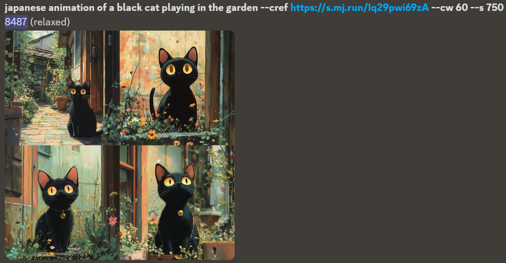
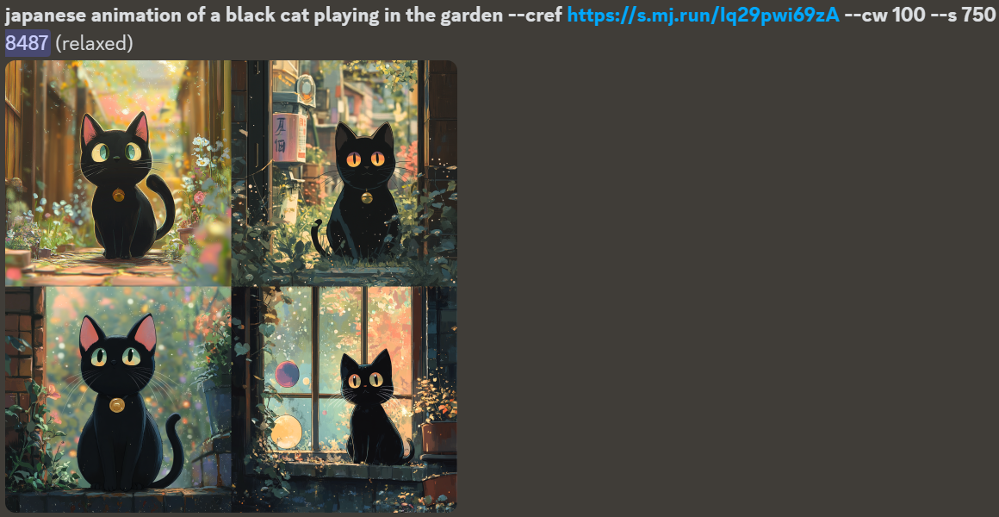

---cref command stands for "Character Reference". It is mainly used to extract character features from reference images and apply them to new images to achieve coherence and consistency in character design. It allows users to specify one or more images as content references. Midjourney will use these reference images to help generate images with similar content. This feature is more suitable for anime or games.

## Applicable version
Midjourney V6 and Niji V6

## Basic usage
```prompt prompt --cref image URL```

1. Select a clear image as a character reference and upload it to Midjourney (you can also upload multiple images). This article uses this picture as an example:


2. Enter the following prompt:
```
japanese animation of a black cat playing in the garden --cref https://s.mj.run/Iq29pwi69zA
```

You can see that Midjourney generates a new Japanese animation style picture based on the image of the black cat in the reference picture:


## Set the weight of the character reference
---The cw (Character weight) parameter can be used to
adjust the style strength, with a value range of 0 to 100. When cw is set to 0, AI only locks the facial features of the character. When cw is set to 100, AI locks the entire character, including the face, hair, clothing, etc.

If you want the generated image to be extremely similar to the reference image, you can set the cw value to 80 to 100; if you want the generated image to be more in line with the prompt description, you can set the cw value to 0 to 30.

The following are reference effects of different parameter values:

### cw=0


### cw=30


### cw=60


### cw=100
