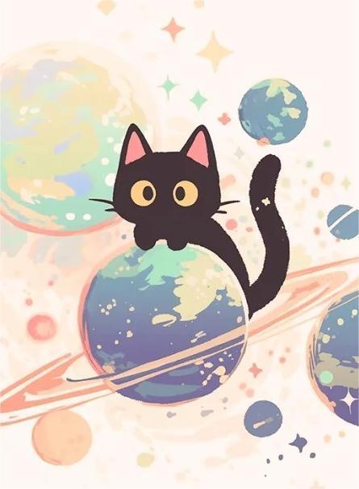
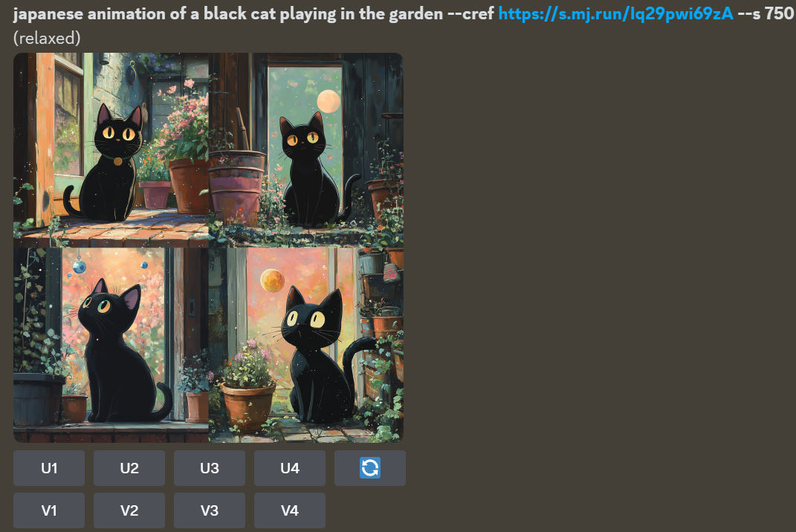
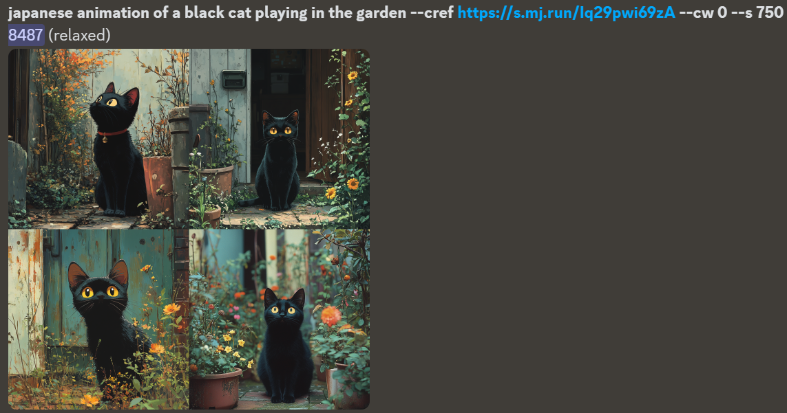

---cref指令全称为“角色参考”（Character Reference），主要用于从参考图片中抽取人物特性，并将其应用至新图像中，以实现人物形象的连贯性和一致性设计。它允许用户指定一个或多个图像作为内容参考。Midjourney将使用这些参考图像来帮助生成具有类似内容的图像。这个功能更适合用于动漫或游戏。

## 适用版本
Midjourney V6 和 Niji V6

## 基础使用方法
```prompt提示词 --cref 图片URL```

1. 选择清晰的图片作为角色参考，上传到Midjourney中（也可以上传多张）。本文以这张图片为例：


2. 输入以下prompt：
```
japanese animation of a black cat playing in the garden --cref https://s.mj.run/Iq29pwi69zA
```

可以看到Midjourney按照参考图片中小黑猫的形象生成了新的日本动画风格的图片：



## 设置人物参考的权重
---cw（Character weight）参数可用来
调节风格强度，数值范围为0到100。当cw设置为0时，AI只锁定角色的脸部特征，cw设置为100时，AI会锁定整个角色，包括脸部、头发、服装等等。

如果希望生成的图片与参考图片的相似度极高，可以将cw值设置为80到100；如果希望生成的图片更加贴合prompt描述内容，可以将cw值设置为0到30。

以下为不同参数值的参考效果：

### cw=0


### cw=30


### cw=60


### cw=100
