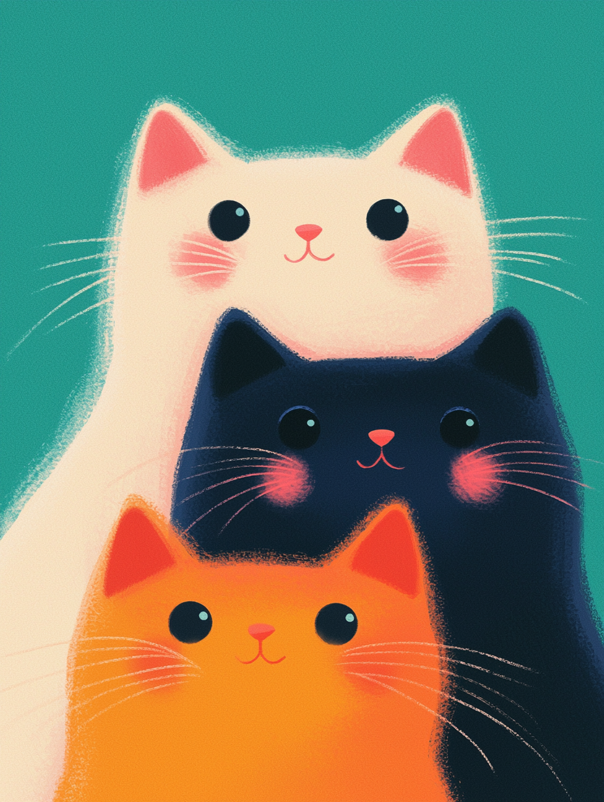
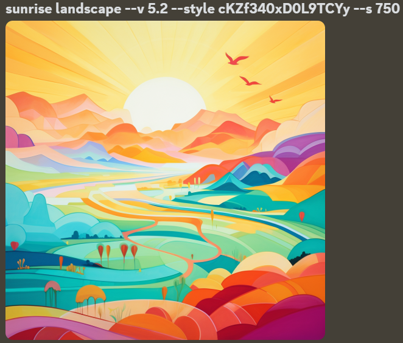
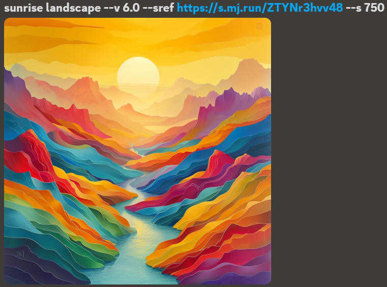
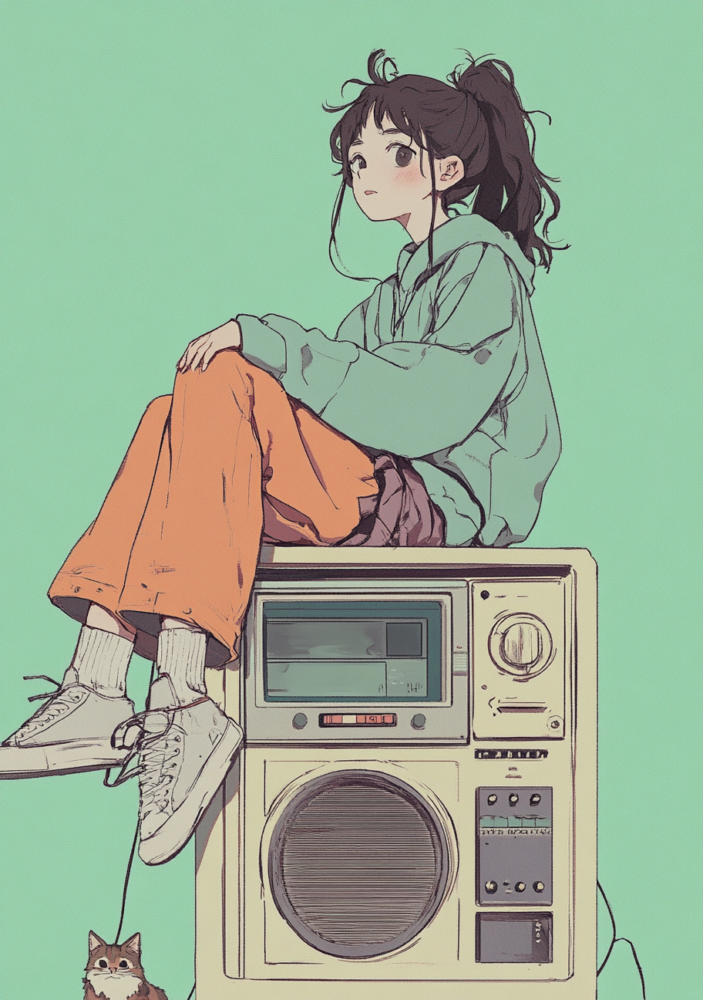
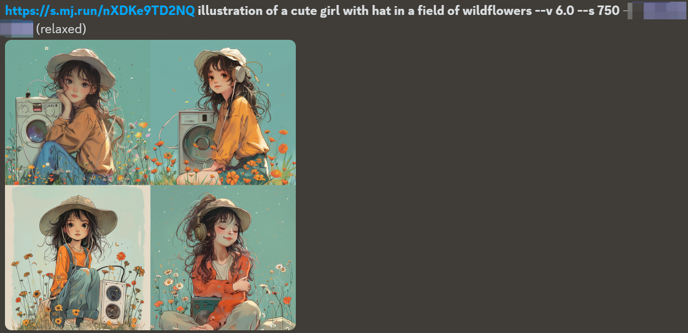
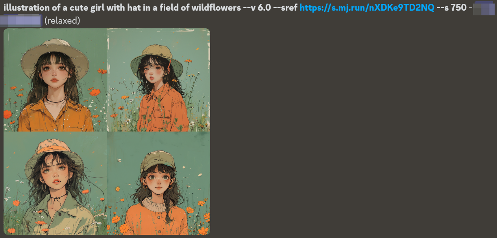
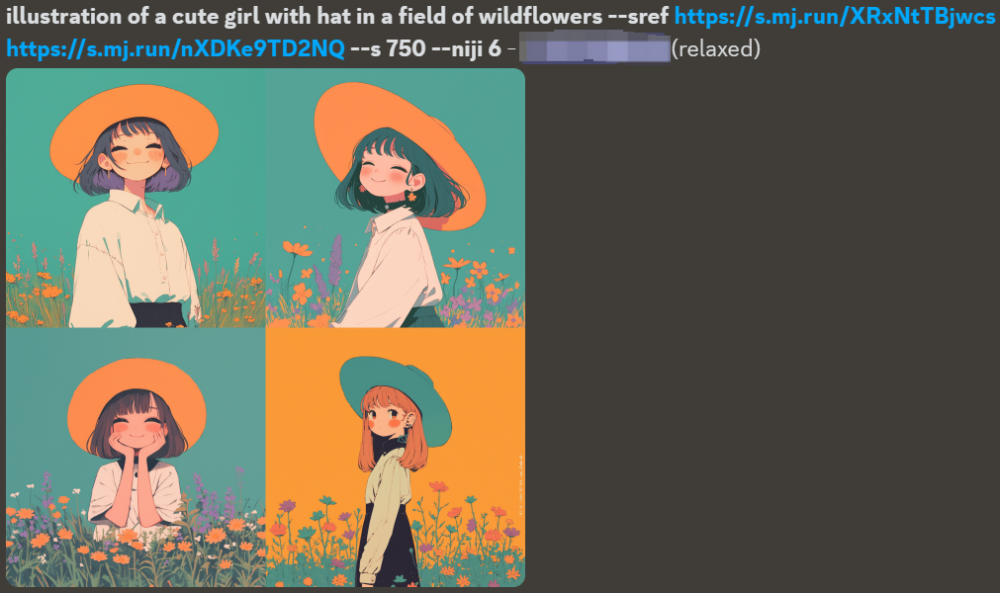
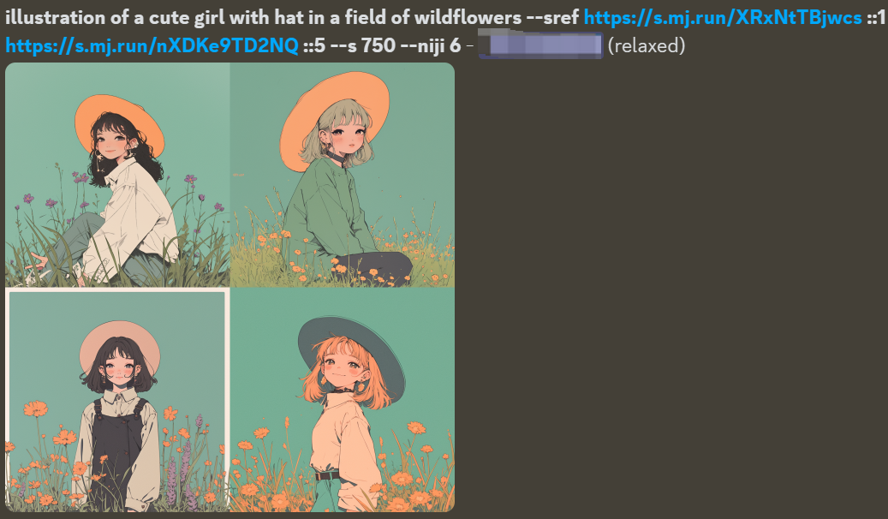

---


The full name of the ---sref command is "Style References," which aims to help users replicate and maintain consistency in the style of images.Its main function is to allow users to upload one or more images as style references to guide Midjourney in generating images that are consistent in style with these reference images.This instruction is particularly useful when you come across an image you really like and want to try generating similar or identical styles, but you don't know what that style is.


## Applicable Versions  
Midjourney V6 and Niji V6


## Basic Usage Method
```prompt prompt word --sref image URL```


There are three ways to obtain the image URL:  
1. Move the mouse over the previously generated image, right-click, select "Copy Message Link," and then you can paste it into the prompt.  
2. Directly drag the previously generated image into the input box.  
3. Upload an image from your local device.


MJ will treat the image URL as a style reference and try to create content in a similar style.


This article will demonstrate using [this image from the Midjourney official website](https://www.midjourney.com/jobs/8e07eed2-5e4c-4cea-bbd3-fb07da784f43?index=0):





First, upload the image to Midjourney, then enter the following prompt:  
```
a cute girl with hat --sref https://s.mj.run/XRxNtTBjwcs --style raw --s 750 --niji 6
```


You can see that Midjourney has created four images of little girls wearing hats based on the style of the pictures we provided:[](basic-usage-example.png)


### ---sref vs. Style Tuner
The Style Tuner can generate a series of images through prompts, and it determines the style and direction of the model based on your selected content.You can use the images generated by the style tuner as a reference URL for the sref parameter. Below is an example of a prompt:


Image generated by Style Tuner:  



According to the style of the style tuner, the image generated using the sref parameter: 


### ---sref vs. Padding Image
The --sref parameter and the padding image prompt format are different:
- Padding Image:
/imagine URL prompt text --v 6


- Style reference:  
/imagine prompt text --v 6 --sref URL


Let's take a look at the differences in the generated images using the reference image below: [reference image](https://www.midjourney.com/jobs/a94d3836-b446-45b7-8a0c-33c41fda1869?index=0).





Using the same descriptive text and reference images, **the padding image focuses more on semantic content (such as characters, places, objects, etc.), while referencing a small portion of style**:  



The **sref parameter focuses more on color and style**:  



## Advanced Usage Methods


### Set the Total Weight for Image Reference
The ---sw (Style weight) parameter can be used to adjust the strength of the style.The default value for --sw is 100, with a range of 0 to 1000.The higher the value, the more similar the generated image is to the reference image in style; the lower the value, the closer the image is to the effect directly suggested by the prompt.After testing, it takes at least 15-20 to see the effect, with values around 200 showing better results, while exceeding 700 can easily lead to distortion and deformation in the image.


### Using multiple images as style references


The prompt is as follows:  
```
prompt keywords --sref Image one URL Image two URL Image three URL ...
```


For example, generate an image that simultaneously references the styles of the two images mentioned above: 


### Setting the Weight of a Single Reference Image  
When using multiple reference images, each image has the same reference weight.You can use "::" to specify the weight of a single image, with the weight value ranging from 0 to 100, for example:





### Using with Base Images
By using base images, Midjourney learns the elements, composition, and content of the pictures, while the --sref command allows Midjourney to learn the style of the images.Note: You must include text prompts in the middle; otherwise, it will not be able to generate.
The prompt words are as follows:
```
Image URL prompt words --sref Image URL
```


Using both simultaneously can balance semantic content and style.[](combine-image-prompt-sref-example.png)